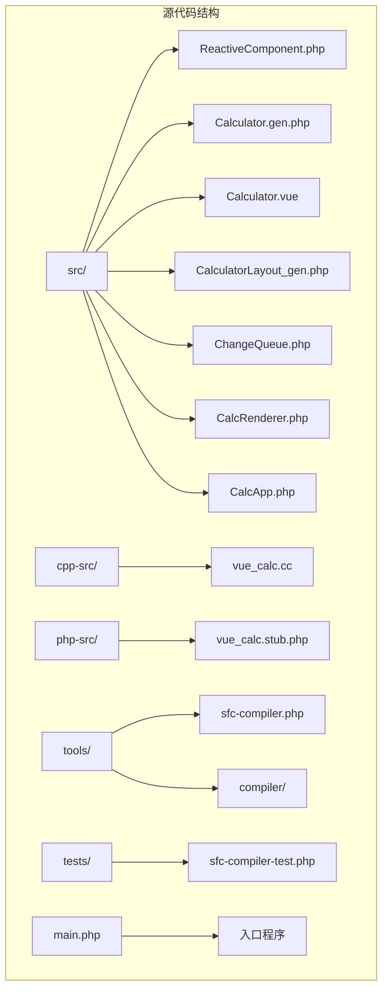
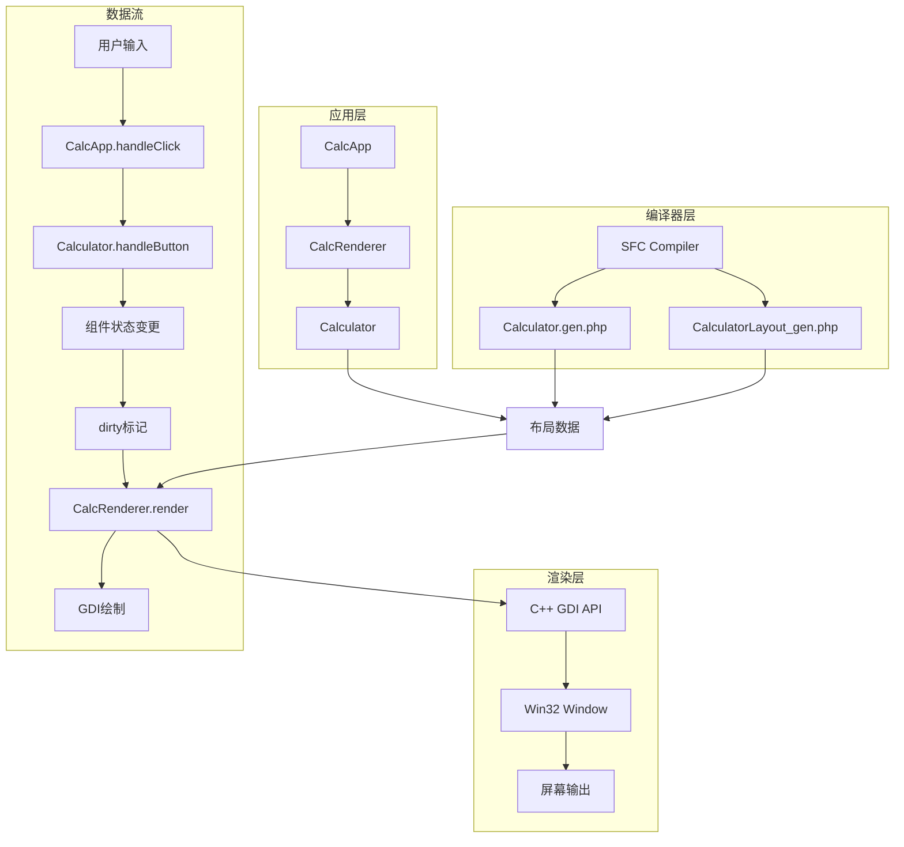
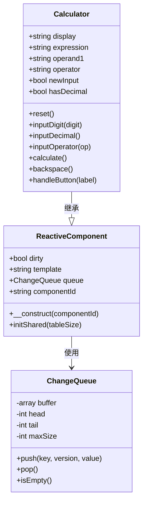
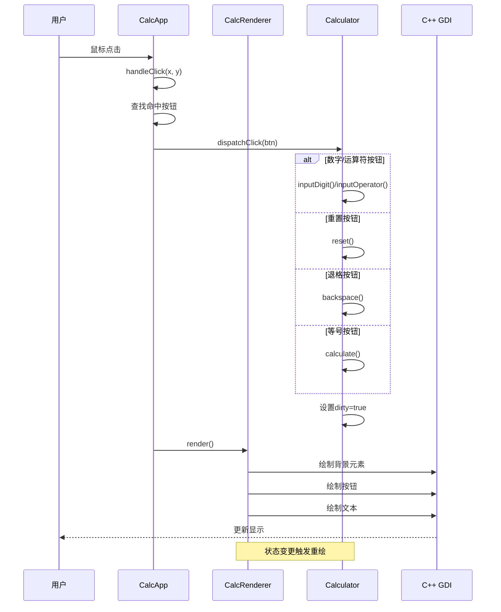
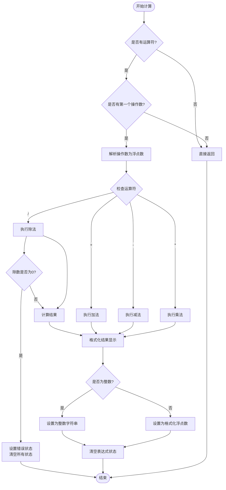
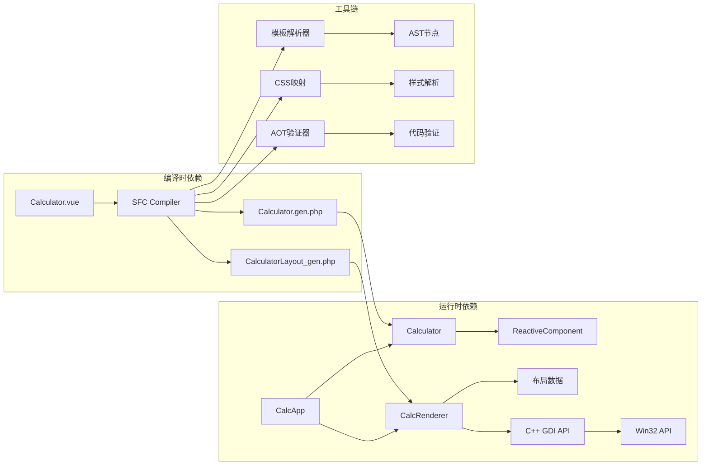

# API参考文档

<cite>
**本文档引用的文件**
- [ReactiveComponent.php](file://src/ReactiveComponent.php)
- [Calculator.gen.php](file://src/Calculator.gen.php)
- [Calculator.vue](file://src/Calculator.vue)
- [CalculatorLayout_gen.php](file://src/CalculatorLayout_gen.php)
- [ChangeQueue.php](file://src/ChangeQueue.php)
- [main.php](file://main.php)
- [CalcRenderer.php](file://src/CalcRenderer.php)
- [CalcApp.php](file://src/CalcApp.php)
- [vue_calc.cc](file://cpp-src/vue_calc.cc)
- [vue_calc.stub.php](file://php-src/vue_calc.stub.php)
- [sfc-compiler.php](file://tools/sfc-compiler.php)
- [sfc-compiler-test.php](file://tests/sfc-compiler-test.php)
- [project.yml](file://project.yml)
</cite>

## 目录
1. [简介](#简介)
2. [项目结构](#项目结构)
3. [核心组件](#核心组件)
4. [架构概览](#架构概览)
5. [详细组件分析](#详细组件分析)
6. [依赖关系分析](#依赖关系分析)
7. [性能考虑](#性能考虑)
8. [故障排除指南](#故障排除指南)
9. [版本兼容性与迁移](#版本兼容性与迁移)
10. [结论](#结论)

## 简介

VueCalc是一个基于Vue设计理念的桌面计算器应用程序，采用单文件组件(SFC)模式构建。该项目展示了如何使用PHP实现响应式数据驱动的桌面应用，并通过C++ Win32 API进行底层渲染。

该系统的核心特点：
- **响应式组件架构**：基于ReactiveComponent基类的组件化设计
- **SFC编译器**：将.vue单文件组件转换为PHP类和布局数据
- **数据驱动渲染**：组件状态变化自动触发渲染更新
- **跨语言集成**：PHP业务逻辑 + C++ GDI绘制引擎

## 项目结构

**图表来源**
- [project.yml:1-10](file://project.yml#L1-L10)
- [main.php:1-291](file://main.php#L1-L291)

**章节来源**
- [project.yml:1-10](file://project.yml#L1-L10)
- [main.php:1-291](file://main.php#L1-L291)

## 核心组件

### ReactiveComponent基类

ReactiveComponent是所有响应式组件的基类，提供了组件生命周期管理和变更通知机制。

**主要属性：**
- `$dirty: bool` - 脏标记，指示组件状态是否需要重新渲染
- `$template: string` - 模板文件路径（可选）
- `$queue: ?ChangeQueue` - 全局变更队列实例
- `$componentId: string` - 组件唯一标识符

**核心方法：**
- `__construct(?string $componentId = null)` - 构造函数，设置组件ID
- `initShared(int $tableSize = 10240): void` - 初始化共享资源和变更队列

**章节来源**
- [ReactiveComponent.php:11-35](file://src/ReactiveComponent.php#L11-L35)

### Calculator组件

Calculator是继承自ReactiveComponent的具体组件，实现了完整的计算器功能。

**状态属性：**
- `$display: string` - 当前显示值，默认'0'
- `$expression: string` - 表达式显示，默认''
- `$operand1: string` - 第一个操作数，默认''
- `$operator: string` - 当前运算符，默认''
- `$newInput: bool` - 是否开始新输入，默认true
- `$hasDecimal: bool` - 是否已输入小数点，默认false

**核心方法：**
- `reset(): void` - 重置计算器状态
- `inputDigit(string $digit): void` - 输入数字
- `inputDecimal(): void` - 输入小数点
- `inputOperator(string $op): void` - 输入运算符
- `calculate(): void` - 执行计算
- `backspace(): void` - 退格删除
- `handleButton(string $label): void` - 处理按钮点击

**章节来源**
- [Calculator.gen.php:9-174](file://src/Calculator.gen.php#L9-L174)
- [Calculator.vue:45-202](file://src/Calculator.vue#L45-L202)

### CalcRenderer渲染器

CalcRenderer负责将组件状态数据驱动地渲染到屏幕上。

**核心职责：**
- 读取布局数据并渲染背景元素(rect)
- 渲染文本显示区域
- 绘制按钮及其标签
- 调用C++ GDI API进行实际绘制

**关键方法：**
- `__construct(int $hWnd, Calculator $component)` - 构造函数
- `render(): void` - 主渲染方法
- `renderTextElement(int $hdc, array $el): void` - 渲染文本元素
- `getBindValue(string $bindKey): string` - 获取绑定值

**章节来源**
- [main.php:26-133](file://main.php#L26-L133)

### CalcApp应用控制器

CalcApp是应用程序的主控制器，管理窗口生命周期和事件循环。

**核心职责：**
- 创建和管理主窗口
- 处理用户输入事件
- 协调组件状态更新和渲染
- 控制应用运行循环

**关键方法：**
- `__construct(Calculator $calc)` - 构造函数
- `initWindow(): bool` - 初始化窗口
- `run(): void` - 主事件循环
- `handleClick(int $x, int $y): void` - 处理鼠标点击
- `dispatchClick(array $btn): void` - 分发按钮点击事件

**章节来源**
- [main.php:139-259](file://main.php#L139-L259)

## 架构概览

**图表来源**
- [main.php:139-259](file://main.php#L139-L259)
- [sfc-compiler.php:1-210](file://tools/sfc-compiler.php#L1-L210)

**章节来源**
- [main.php:1-291](file://main.php#L1-L291)
- [sfc-compiler.php:1-210](file://tools/sfc-compiler.php#L1-L210)

## 详细组件分析

### ReactiveComponent类分析

**图表来源**
- [ReactiveComponent.php:11-35](file://src/ReactiveComponent.php#L11-L35)
- [Calculator.gen.php:9-174](file://src/Calculator.gen.php#L9-L174)
- [ChangeQueue.php:11-57](file://src/ChangeQueue.php#L11-L57)

**章节来源**
- [ReactiveComponent.php:11-35](file://src/ReactiveComponent.php#L11-L35)
- [ChangeQueue.php:11-57](file://src/ChangeQueue.php#L11-L57)

### CalcApp事件处理流程

**图表来源**
- [main.php:171-259](file://main.php#L171-L259)
- [Calculator.gen.php:149-168](file://src/Calculator.gen.php#L149-L168)

**章节来源**
- [main.php:171-259](file://main.php#L171-L259)
- [Calculator.gen.php:149-168](file://src/Calculator.gen.php#L149-L168)

### 计算器核心算法流程

**图表来源**
- [Calculator.gen.php:85-128](file://src/Calculator.gen.php#L85-L128)

**章节来源**
- [Calculator.gen.php:85-128](file://src/Calculator.gen.php#L85-L128)

## 依赖关系分析

**图表来源**
- [sfc-compiler.php:19-25](file://tools/sfc-compiler.php#L19-L25)
- [main.php:139-259](file://main.php#L139-L259)

**章节来源**
- [sfc-compiler.php:19-25](file://tools/sfc-compiler.php#L19-L25)
- [main.php:139-259](file://main.php#L139-L259)

## 性能考虑

### 渲染优化策略

1. **脏标记机制**：只有当组件状态发生变化时才触发重绘
2. **双缓冲技术**：使用内存DC进行离屏渲染，减少闪烁
3. **增量更新**：仅在状态变更时重新渲染，避免全量重绘
4. **帧率控制**：约60FPS的渲染频率

### 内存管理

- **环形缓冲队列**：ChangeQueue使用固定大小的环形缓冲区
- **对象池模式**：ReactiveComponent::initShared预分配资源
- **垃圾回收**：PHP自动管理内存，C++层负责GDI对象清理

### 并发模型

- **单线程事件循环**：Windows消息循环处理所有UI事件
- **同步渲染**：渲染操作在主线程执行，保证线程安全
- **异步I/O**：消息队列处理用户输入事件

## 故障排除指南

### 常见问题及解决方案

**窗口创建失败**
- 检查Win32 API权限和系统兼容性
- 验证窗口尺寸参数的有效性
- 确认消息循环正常运行

**渲染异常**
- 检查GDI句柄有效性
- 验证布局数据的完整性
- 确认颜色值格式正确

**计算错误**
- 检查除零异常处理
- 验证浮点数精度控制
- 确认字符串到数值的转换

**编译器错误**
- 验证.vue文件语法正确性
- 检查CSS样式映射规则
- 确认模板解析器支持的标签

**章节来源**
- [main.php:152-227](file://main.php#L152-L227)
- [Calculator.gen.php:138-148](file://src/Calculator.gen.php#L138-L148)

## 版本兼容性与迁移

### API版本规范

**当前版本**：1.0.0
**兼容性要求**：
- PHP 8.0+ (用于AOT编译器)
- Windows 7+ (Win32 API要求)
- 支持native_types命名空间

### 迁移指南

**从旧版本升级**：
1. 更新ReactiveComponent基类的构造函数参数
2. 检查组件属性声明的兼容性
3. 验证AOT编译器的语法支持
4. 测试C++ GDI API的向后兼容性

**向新架构迁移**：
1. 使用SFC编译器替代手动布局生成
2. 迁移CSS样式到新的映射系统
3. 更新事件处理机制以支持新的分发模式
4. 验证渲染管道的性能改进

### 兼容性矩阵

| 组件 | PHP版本 | Windows版本 | 编译器版本 |
|------|---------|-------------|------------|
| ReactiveComponent | 8.0+ | 7+ | 3.x |
| CalcRenderer | 8.0+ | 7+ | 3.x |
| CalcApp | 8.0+ | 7+ | 3.x |
| SFC编译器 | CLI 8.0+ | 任意 | 3.x |

**章节来源**
- [project.yml:1-10](file://project.yml#L1-L10)
- [sfc-compiler.php:1-17](file://tools/sfc-compiler.php#L1-L17)

## 结论

VueCalc项目展示了现代桌面应用开发的最佳实践，通过以下关键技术实现了高性能和可维护性：

1. **响应式架构**：基于ReactiveComponent的组件化设计
2. **编译时优化**：SFC编译器将模板转换为高效的PHP代码
3. **跨语言集成**：PHP业务逻辑与C++渲染引擎的无缝协作
4. **数据驱动渲染**：状态变更自动触发UI更新
5. **严格的类型系统**：利用native_types确保类型安全

该架构为类似的应用程序提供了完整的开发框架，包括编译器、运行时环境和工具链的完整解决方案。开发者可以基于此架构快速构建复杂的桌面应用程序，同时享受现代Web开发的便利性和性能优势。