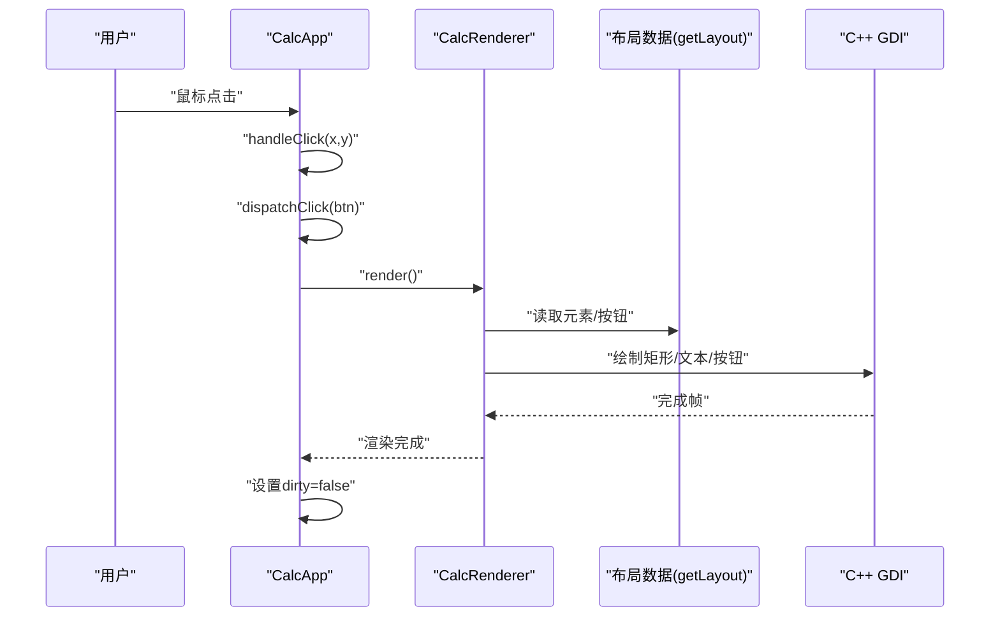
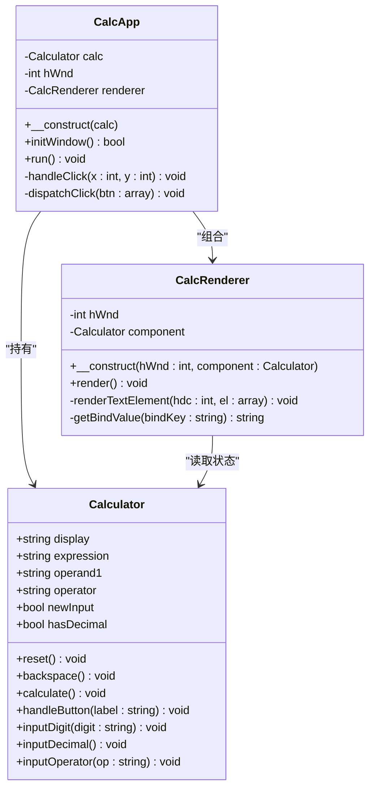
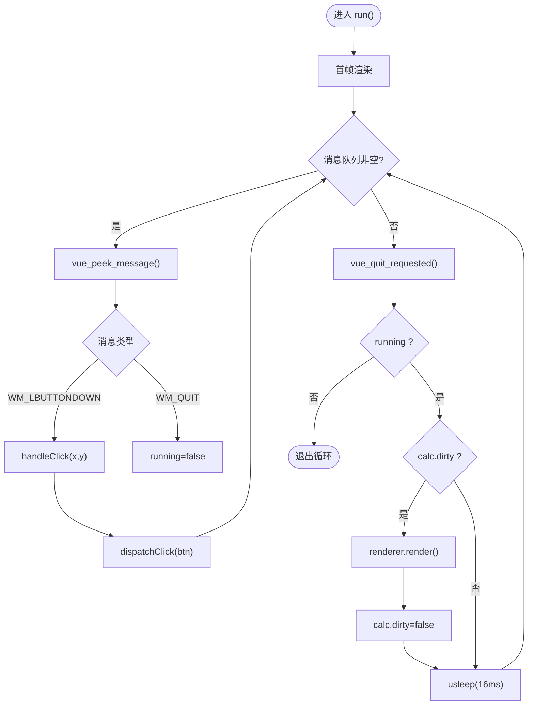
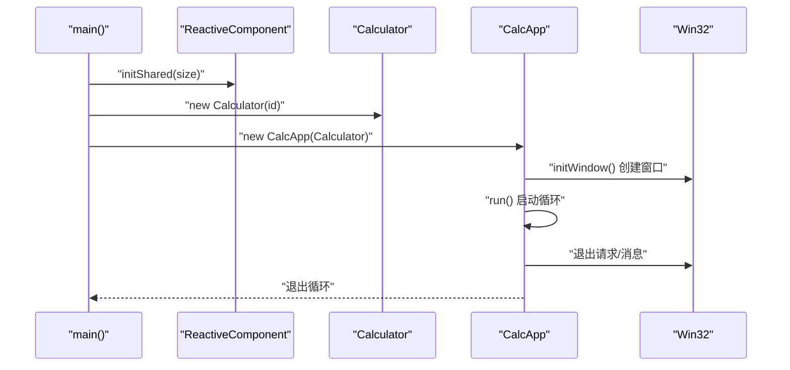
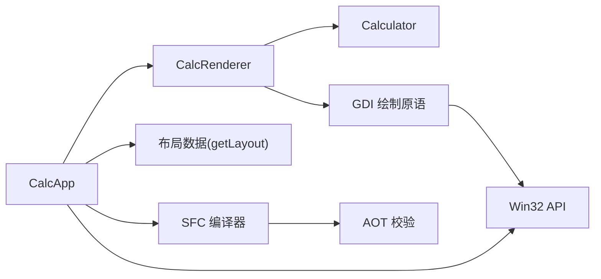

# CalcApp应用控制器API

<cite>
**本文引用的文件**
- [main.php](file://main.php)
- [Calculator.gen.php](file://src/Calculator.gen.php)
- [Calculator.vue](file://src/Calculator.vue)
- [vue_calc.cc](file://cpp-src/vue_calc.cc)
- [vue_calc.stub.php](file://php-src/vue_calc.stub.php)
- [ReactiveComponent.php](file://src/ReactiveComponent.php)
- [ChangeQueue.php](file://src/ChangeQueue.php)
- [sfc-compiler.php](file://tools/sfc-compiler.php)
- [template-parser.php](file://tools/compiler/template-parser.php)
- [css-mappings.php](file://tools/compiler/css-mappings.php)
- [aot-validator.php](file://tools/compiler/aot-validator.php)
- [verify-layout.php](file://tests/verify-layout.php)
- [project.yml](file://project.yml)
</cite>

## 目录
1. [简介](#简介)
2. [项目结构](#项目结构)
3. [核心组件](#核心组件)
4. [架构总览](#架构总览)
5. [详细组件分析](#详细组件分析)
6. [依赖分析](#依赖分析)
7. [性能考虑](#性能考虑)
8. [故障排查指南](#故障排查指南)
9. [结论](#结论)
10. [附录](#附录)

## 简介
本文件为 CalcApp 应用控制器的完整API参考文档。CalcApp 是一个基于“类 Vue 数据驱动”的桌面计算器应用，采用 PHP 实现业务逻辑与响应式状态，C++ 封装 Win32 API 提供窗口与 GDI 绘制能力。应用控制器负责应用初始化、事件循环、窗口生命周期管理、事件分发与渲染协调。

- 应用入口与初始化顺序：响应式框架初始化 → 组件实例化 → 窗口创建与显示 → 渲染器绑定 → 启动事件循环
- 事件处理机制：Win32 消息轮询 → 鼠标点击命中测试 → 按钮处理器路由 → 组件方法调用 → 脏标记触发 → 渲染更新
- 生命周期：窗口创建 → 首帧渲染 → 循环处理消息 → 状态变更重绘 → 退出请求 → 关闭

## 项目结构
项目采用“模板编译 + AOT 兼容”架构，主要目录与职责如下：
- cpp-src：C++ Win32 API 封装与 GDI 绘制原语
- php-src：C++ 导出到 PHP 的函数声明（stub）
- src：SFC 编译生成的组件类与布局数据、响应式基类与变更队列
- tools：SFC 编译器与验证工具
- tests：布局输出验证脚本
- 根目录：应用入口 main.php、项目配置 project.yml

```mermaid
graph TB
subgraph "应用层"
MAIN["main.php<br/>应用入口与初始化"]
APP["CalcApp<br/>应用控制器"]
RENDERER["CalcRenderer<br/>数据驱动渲染器"]
CALC["Calculator<br/>组件类(生成)"]
end
subgraph "响应式系统"
RC["ReactiveComponent<br/>响应式基类"]
CQ["ChangeQueue<br/>变更队列"]
end
subgraph "渲染层"
LAYOUT["CalculatorLayout_gen.php<br/>布局数据(getLayout)"]
STUB["vue_calc.stub.php<br/>C++导出函数声明"]
CPP["vue_calc.cc<br/>Win32/GDI封装"]
end
subgraph "编译工具链"
SFC["sfc-compiler.php<br/>SFC编译器"]
TP["template-parser.php<br/>模板解析器"]
CM["css-mappings.php<br/>样式映射"]
AV["aot-validator.php<br/>AOT校验"]
end
MAIN --> APP
APP --> CALC
APP --> RENDERER
RENDERER --> LAYOUT
RENDERER --> CPP
CALC --> RC
RC --> CQ
SFC --> TP
SFC --> CM
SFC --> AV
SFC --> LAYOUT
SFC --> CALC
CPP <- --> STUB
```

**图表来源**
- [main.php:265-291](file://main.php#L265-L291)
- [Calculator.gen.php:9-174](file://src/Calculator.gen.php#L9-L174)
- [ReactiveComponent.php:11-35](file://src/ReactiveComponent.php#L11-L35)
- [ChangeQueue.php:11-57](file://src/ChangeQueue.php#L11-L57)
- [sfc-compiler.php:133-210](file://tools/sfc-compiler.php#L133-L210)
- [template-parser.php:60-96](file://tools/compiler/template-parser.php#L60-L96)
- [css-mappings.php:15-210](file://tools/compiler/css-mappings.php#L15-L210)
- [aot-validator.php:17-169](file://tools/compiler/aot-validator.php#L17-L169)
- [vue_calc.cc:35-84](file://cpp-src/vue_calc.cc#L35-L84)
- [vue_calc.stub.php:12-24](file://php-src/vue_calc.stub.php#L12-L24)

**章节来源**
- [project.yml:1-10](file://project.yml#L1-L10)
- [main.php:265-291](file://main.php#L265-L291)

## 核心组件
本节聚焦 CalcApp 应用控制器的API，涵盖构造、初始化、事件循环、事件分发与渲染协调等。

- 构造函数
  - 参数：Calculator 实例
  - 作用：持有组件实例，初始化窗口句柄为 0
  - 参考：[构造函数:145-149](file://main.php#L145-L149)

- 初始化窗口
  - 方法：initWindow()
  - 返回：bool
  - 步骤：创建窗口 → 显示 → 绑定渲染器
  - 参考：[初始化窗口:152-169](file://main.php#L152-L169)

- 主事件循环
  - 方法：run()
  - 行为：处理消息队列 → 鼠标点击命中测试 → 分发到组件 → 渲染脏区 → 退出检测
  - 参考：[主事件循环:172-227](file://main.php#L172-L227)

- 私有辅助：点击处理
  - 方法：handleClick(x, y)
  - 行为：遍历布局按钮 → 命中测试 → 调用分发
  - 参考：[点击处理:230-241](file://main.php#L230-L241)

- 私有辅助：事件分发
  - 方法：dispatchClick(btn)
  - 行为：根据 handler 字段路由到组件方法（reset/backspace/calculate/handleButton）
  - 参考：[事件分发:244-258](file://main.php#L244-L258)

- 渲染器 CalcRenderer
  - 成员：hWnd、Calculator
  - 方法：render() 遍历布局元素与按钮，调用 C++ GDI 绘制原语
  - 参考：[渲染器:26-133](file://main.php#L26-L133)

**章节来源**
- [main.php:139-259](file://main.php#L139-L259)

## 架构总览
应用控制器位于应用层，向上依赖组件与渲染器，向下依赖 C++ Win32/GDI 封装。响应式系统通过脏标记驱动渲染，布局数据由 SFC 编译器生成。



**图表来源**
- [main.php:172-227](file://main.php#L172-L227)
- [main.php:230-258](file://main.php#L230-L258)
- [main.php:99-132](file://main.php#L99-L132)
- [Calculator.gen.php:149-168](file://src/Calculator.gen.php#L149-L168)

## 详细组件分析

### CalcApp 应用控制器
- 角色：应用生命周期与事件循环的协调者
- 关键职责：
  - 初始化窗口与渲染器
  - 处理 Win32 消息（鼠标点击、退出）
  - 将用户交互路由到组件方法
  - 基于脏标记驱动渲染



**图表来源**
- [main.php:139-259](file://main.php#L139-L259)
- [Calculator.gen.php:9-174](file://src/Calculator.gen.php#L9-L174)

**章节来源**
- [main.php:139-259](file://main.php#L139-L259)

### 事件处理机制与消息循环
- 消息轮询：使用 C++ 导出函数 vue_peek_message 获取消息
- 事件类型：
  - 左键按下：提取坐标 → 命中测试 → 分发到组件
  - 退出消息：设置运行标志为 false
- 错误处理：try/catch 包裹点击与渲染过程，打印错误信息



**图表来源**
- [main.php:172-227](file://main.php#L172-L227)
- [vue_calc.cc:69-84](file://cpp-src/vue_calc.cc#L69-L84)
- [vue_calc.stub.php:16](file://php-src/vue_calc.stub.php#L16)

**章节来源**
- [main.php:172-227](file://main.php#L172-L227)

### 应用程序配置与自定义选项
- 窗口尺寸：由 SFC 编译生成的布局常量 WINDOW_WIDTH/HEIGHT 决定
- 样式映射：CSS 类 → GDI 属性（颜色、字体、粗细等），由编译器生成布局数据
- 自定义项建议：
  - 通过 .vue 模板的 <app> 宽高属性调整窗口尺寸
  - 通过 <style> 类名配置按钮与文本外观
  - 通过 @click 路由到组件方法，扩展功能

**章节来源**
- [Calculator.vue:1-41](file://src/Calculator.vue#L1-L41)
- [css-mappings.php:15-210](file://tools/compiler/css-mappings.php#L15-L210)
- [sfc-compiler.php:133-181](file://tools/sfc-compiler.php#L133-L181)

### 应用生命周期方法
- 启动流程
  1) 设置时区
  2) 初始化响应式框架共享内存与变更队列
  3) 实例化组件
  4) 创建应用控制器并初始化窗口
  5) 启动事件循环
- 关闭流程
  - 退出消息或请求 → 退出循环 → 输出关闭信息



**图表来源**
- [main.php:265-291](file://main.php#L265-L291)
- [ReactiveComponent.php:30-33](file://src/ReactiveComponent.php#L30-L33)
- [Calculator.gen.php:170-174](file://src/Calculator.gen.php#L170-L174)
- [main.php:152-169](file://main.php#L152-L169)
- [main.php:172-227](file://main.php#L172-L227)

**章节来源**
- [main.php:265-291](file://main.php#L265-L291)

### 与其他组件的集成接口与依赖关系
- 与 C++ 层集成
  - 通过 php-src/vue_calc.stub.php 声明的函数与 cpp-src/vue_calc.cc 实现对接
  - 关键函数：窗口创建/显示、消息轮询、GDI 绘制原语
- 与响应式系统集成
  - 组件继承 ReactiveComponent，使用脏标记驱动渲染
  - 变更队列为可选扩展（当前 CalcApp 使用脏标记直接触发）
- 与编译器集成
  - SFC 编译器生成布局数据与组件类
  - AOT 校验确保生成代码满足编译器约束

**章节来源**
- [vue_calc.stub.php:12-24](file://php-src/vue_calc.stub.php#L12-L24)
- [vue_calc.cc:35-157](file://cpp-src/vue_calc.cc#L35-L157)
- [ReactiveComponent.php:11-35](file://src/ReactiveComponent.php#L11-L35)
- [ChangeQueue.php:11-57](file://src/ChangeQueue.php#L11-L57)
- [sfc-compiler.php:133-210](file://tools/sfc-compiler.php#L133-L210)
- [aot-validator.php:36-106](file://tools/compiler/aot-validator.php#L36-L106)

### 调试与监控相关API
- 日志输出
  - 窗口创建成功/失败提示
  - 启动/关闭信息
  - 渲染与点击异常捕获与堆栈输出
- 性能与同步
  - 事件循环中固定休眠约 16ms 以接近 60 FPS
- 布局验证
  - 测试脚本验证生成布局元素数量与关键属性

**章节来源**
- [main.php:160-168](file://main.php#L160-L168)
- [main.php:176](file://main.php#L176)
- [main.php:194-197](file://main.php#L194-L197)
- [main.php:217-219](file://main.php#L217-L219)
- [main.php:223](file://main.php#L223)
- [verify-layout.php:1-33](file://tests/verify-layout.php#L1-L33)

## 依赖分析
- 组件耦合
  - CalcApp 与 CalcRenderer 强耦合（组合关系）
  - CalcRenderer 与 Calculator 弱耦合（只读访问状态）
  - CalcApp 与 Win32/C++ 通过 stub/实现解耦
- 外部依赖
  - C++ Win32 API（窗口、消息、GDI）
  - SFC 编译器与 AOT 校验工具
- 潜在风险
  - 事件分发使用字符串路由，需保证按钮 handler 与组件方法一致
  - 布局数据由编译器生成，需确保样式与模板匹配



**图表来源**
- [main.php:139-259](file://main.php#L139-L259)
- [Calculator.gen.php:9-174](file://src/Calculator.gen.php#L9-L174)
- [sfc-compiler.php:133-210](file://tools/sfc-compiler.php#L133-L210)
- [aot-validator.php:36-106](file://tools/compiler/aot-validator.php#L36-L106)
- [vue_calc.cc:35-157](file://cpp-src/vue_calc.cc#L35-L157)

**章节来源**
- [main.php:139-259](file://main.php#L139-L259)

## 性能考虑
- 渲染频率：事件循环中固定休眠约 16ms，目标 ~60 FPS
- 脏标记优化：仅在组件状态变更后重绘，减少无效绘制
- 布局计算：编译期完成坐标与样式计算，运行时仅做遍历绘制
- 消息处理：使用 PeekMessage 非阻塞轮询，避免卡顿

[本节为通用性能讨论，无需特定文件来源]

## 故障排查指南
- 窗口创建失败
  - 现象：initWindow 返回 false 并输出错误信息
  - 排查：检查标题、宽高参数；确认 C++ 窗口注册与创建逻辑
  - 参考：[窗口创建:152-169](file://main.php#L152-L169)
- 点击无响应
  - 现象：鼠标点击未触发组件方法
  - 排查：确认布局按钮坐标与命中测试范围；检查按钮 handler 与组件方法名称一致
  - 参考：[点击处理:230-258](file://main.php#L230-L258)
- 渲染异常
  - 现象：渲染过程中抛出异常
  - 排查：查看错误信息与堆栈；检查布局数据完整性与 GDI 调用参数
  - 参考：[渲染异常捕获:217-219](file://main.php#L217-L219)
- 退出不生效
  - 现象：点击关闭按钮无法退出
  - 排查：确认 C++ 回调设置与退出标志位；检查消息循环中的退出条件
  - 参考：[退出检查:206-208](file://main.php#L206-L208)

**章节来源**
- [main.php:152-169](file://main.php#L152-L169)
- [main.php:230-258](file://main.php#L230-L258)
- [main.php:217-219](file://main.php#L217-L219)
- [main.php:206-208](file://main.php#L206-L208)

## 结论
CalcApp 应用控制器以简洁清晰的方式实现了桌面应用的初始化、事件循环与渲染协调。其设计遵循“模板编译 + AOT 兼容”的理念，将复杂度隐藏在编译阶段，运行时保持轻量与高效。通过脏标记驱动渲染与严格的事件分发路由，应用具备良好的可维护性与扩展性。

[本节为总结性内容，无需特定文件来源]

## 附录

### API 一览表（CalcApp）
- 构造函数
  - 名称：__construct
  - 参数：Calculator $calc
  - 作用：保存组件实例，初始化窗口句柄
  - 参考：[构造函数:145-149](file://main.php#L145-L149)

- 初始化窗口
  - 名称：initWindow
  - 返回：bool
  - 作用：创建并显示窗口，绑定渲染器
  - 参考：[初始化窗口:152-169](file://main.php#L152-L169)

- 主事件循环
  - 名称：run
  - 返回：void
  - 作用：消息轮询、事件分发、渲染控制、退出检测
  - 参考：[主事件循环:172-227](file://main.php#L172-L227)

- 私有：点击处理
  - 名称：handleClick
  - 参数：int $x, int $y
  - 作用：遍历按钮进行命中测试
  - 参考：[点击处理:230-241](file://main.php#L230-L241)

- 私有：事件分发
  - 名称：dispatchClick
  - 参数：array $btn
  - 作用：根据 handler 路由到组件方法
  - 参考：[事件分发:244-258](file://main.php#L244-L258)

**章节来源**
- [main.php:139-259](file://main.php#L139-L259)

### 使用示例（启动与配置）
- 启动步骤
  1) 设置时区
  2) 初始化响应式框架共享内存
  3) 实例化组件
  4) 创建应用控制器并初始化窗口
  5) 启动事件循环
- 配置要点
  - 窗口尺寸：由 .vue 中 <app> 的 width/height 决定
  - 样式：通过 <style> 类名配置颜色、字体、粗细等
  - 事件：通过 <btn> 的 @click 路由到组件方法

**章节来源**
- [main.php:265-291](file://main.php#L265-L291)
- [Calculator.vue:1-41](file://src/Calculator.vue#L1-L41)
- [sfc-compiler.php:133-181](file://tools/sfc-compiler.php#L133-L181)