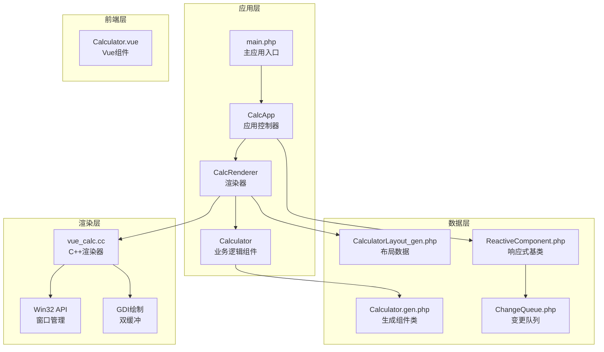
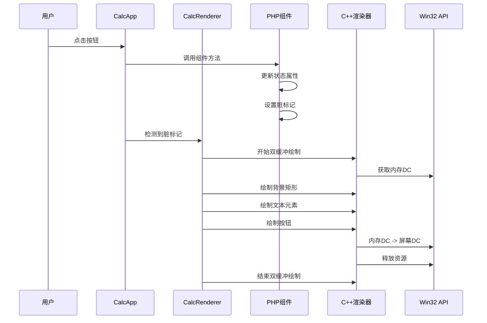
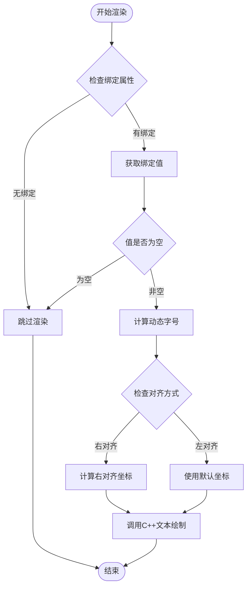
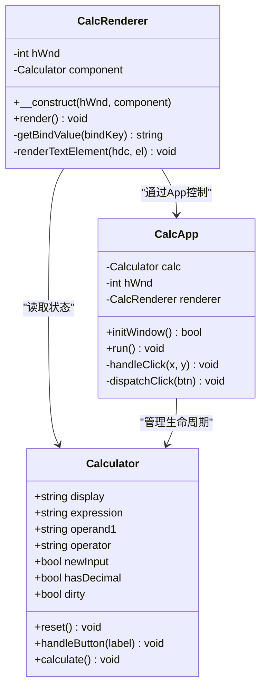
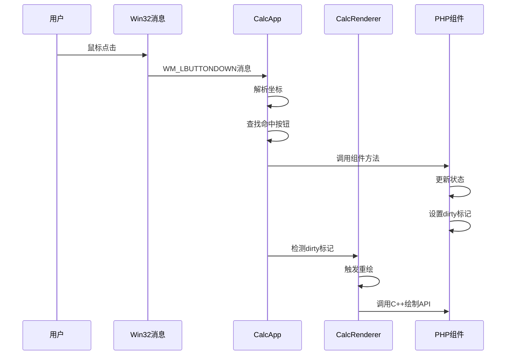
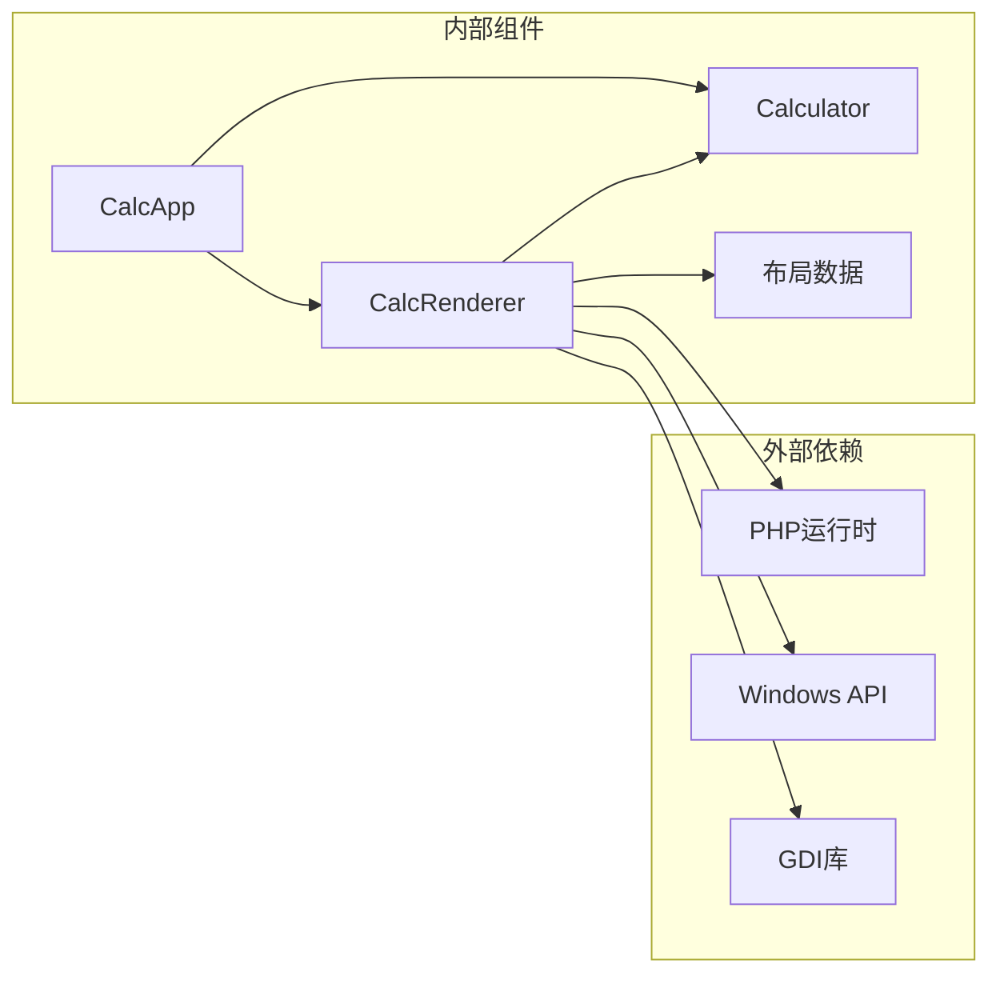
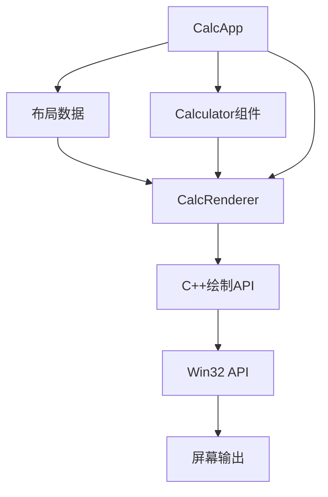

# CalcRenderer渲染器API

<cite>
**本文档引用的文件**
- [vue_calc.cc](file://cpp-src/vue_calc.cc)
- [vue_calc.stub.php](file://php-src/vue_calc.stub.php)
- [main.php](file://main.php)
- [Calculator.gen.php](file://src/Calculator.gen.php)
- [CalculatorLayout_gen.php](file://src/CalculatorLayout_gen.php)
- [Calculator.vue](file://src/Calculator.vue)
- [ReactiveComponent.php](file://src/ReactiveComponent.php)
- [ChangeQueue.php](file://src/ChangeQueue.php)
</cite>

## 目录
1. [简介](#简介)
2. [项目结构](#项目结构)
3. [核心组件](#核心组件)
4. [架构概览](#架构概览)
5. [详细组件分析](#详细组件分析)
6. [依赖关系分析](#依赖关系分析)
7. [性能考虑](#性能考虑)
8. [故障排除指南](#故障排除指南)
9. [结论](#结论)

## 简介

CalcRenderer是一个基于C++的Win32 GDI渲染器，专为VueCalc桌面计算器应用设计。该渲染器采用"数据驱动"架构，将PHP端的响应式逻辑与C++底层的Windows API渲染层分离，实现了高性能的桌面应用程序渲染。

该渲染器的核心特性包括：
- **双缓冲技术**：通过内存设备上下文实现无闪烁渲染
- **数据驱动渲染**：基于布局数据和组件状态进行渲染
- **响应式更新**：仅在组件状态变更时触发重绘
- **跨语言集成**：PHP逻辑与C++渲染层的无缝通信

## 项目结构

VueCalc项目采用分层架构设计，各组件职责明确：



**图表来源**
- [main.php:26-133](file://main.php#L26-L133)
- [vue_calc.cc:35-157](file://cpp-src/vue_calc.cc#L35-L157)

**章节来源**
- [main.php:1-291](file://main.php#L1-L291)
- [vue_calc.cc:1-157](file://cpp-src/vue_calc.cc#L1-L157)

## 核心组件

### CalcRenderer渲染器

CalcRenderer是整个渲染系统的核心组件，负责将布局数据和组件状态转换为最终的视觉呈现。

#### 主要职责
- **数据驱动渲染**：遍历布局数据，根据组件状态进行渲染
- **双缓冲管理**：协调C++层的双缓冲绘制流程
- **坐标变换**：处理文本对齐和坐标计算
- **事件处理**：与应用控制器协作处理用户交互

#### 关键属性
- `$hWnd`: 窗口句柄，用于与C++层通信
- `$component`: Calculator组件实例，提供渲染数据源

**章节来源**
- [main.php:26-35](file://main.php#L26-L35)

### C++渲染器层

C++层提供了底层的Win32 API封装，实现了高效的图形绘制功能。

#### 核心功能模块
- **窗口管理**：窗口创建、显示、消息处理
- **GDI绘制**：矩形填充、文本绘制、按钮渲染
- **双缓冲技术**：内存设备上下文管理

**章节来源**
- [vue_calc.cc:35-157](file://cpp-src/vue_calc.cc#L35-L157)

## 架构概览

VueCalc采用了独特的"数据驱动渲染"架构，实现了逻辑与渲染的完全分离：



**图表来源**
- [main.php:172-227](file://main.php#L172-L227)
- [vue_calc.cc:90-117](file://cpp-src/vue_calc.cc#L90-L117)

## 详细组件分析

### CalcRenderer类详解

CalcRenderer类实现了完整的数据驱动渲染流程，是整个系统的桥梁。

#### 构造函数
```php
public function __construct(int $hWnd, Calculator $component)
```
- **参数**：窗口句柄和Calculator组件实例
- **作用**：建立渲染器与组件的关联关系

#### 渲染流程
```php
public function render(): void
{
    $hdc = vue_begin_paint($this->hWnd);
    $layout = getLayout();
    $elements = $layout['elements'];
    $buttons = $layout['buttons'];
    
    // 渲染背景元素
    foreach ($elements as $el) {
        // ... 绘制逻辑
    }
    
    // 渲染按钮
    foreach ($buttons as $btn) {
        // ... 按钮绘制逻辑
    }
    
    vue_end_paint($this->hWnd, $hdc);
}
```

#### 文本渲染算法
CalcRenderer实现了智能的文本渲染算法，支持动态字号调整和对齐：



**图表来源**
- [main.php:49-94](file://main.php#L49-L94)

**章节来源**
- [main.php:26-133](file://main.php#L26-L133)

### C++渲染器API详解

C++层提供了完整的Win32 GDI绘制API，所有函数都通过PHP层的stub文件暴露。

#### 窗口管理API

##### 窗口创建
```cpp
Int php_vue_window_create(String title, Int width, Int height)
```
- **功能**：创建主窗口
- **参数**：
  - `title`: 窗口标题
  - `width`: 窗口宽度
  - `height`: 窗口高度
- **返回值**：窗口句柄（hWnd）

##### 窗口显示
```cpp
void php_vue_window_show(Int hWnd, Int cmdShow)
```
- **功能**：显示窗口
- **参数**：
  - `hWnd`: 窗口句柄
  - `cmdShow`: 显示命令（如SW_SHOW）

##### 退出检测
```cpp
Bool php_vue_quit_requested()
```
- **功能**：检查是否请求退出
- **返回值**：布尔值表示退出状态

##### 消息处理
```cpp
Array php_vue_peek_message()
```
- **功能**：获取并处理Windows消息
- **返回值**：消息数组或空数组

#### 双缓冲绘制API

##### 开始绘制帧
```cpp
Int php_vue_begin_paint(Int hWnd)
```
- **功能**：初始化双缓冲绘制
- **返回值**：内存设备上下文句柄

##### 结束绘制帧
```cpp
void php_vue_end_paint(Int hWnd, Int hdcHandle)
```
- **功能**：完成绘制并将结果输出到屏幕
- **参数**：
  - `hWnd`: 窗口句柄
  - `hdcHandle`: 内存设备上下文句柄

#### GDI绘制原语

##### 矩形填充
```cpp
void php_vue_fill_rect(Int hdc, Int x, Int y, Int w, Int h, Int rgbColor)
```
- **功能**：填充指定矩形区域
- **参数**：
  - `hdc`: 设备上下文
  - `x, y`: 左上角坐标
  - `w, h`: 宽度和高度
  - `rgbColor`: RGB颜色值

##### 文本绘制
```cpp
void php_vue_draw_text(Int hdc, Int x, Int y, String text, Int fontSize, Int rgbColor, Int bold)
```
- **功能**：在指定位置绘制文本
- **参数**：
  - `hdc`: 设备上下文
  - `x, y`: 绘制起点坐标
  - `text`: 要绘制的文本
  - `fontSize`: 字体大小
  - `rgbColor`: 文本颜色
  - `bold`: 是否加粗（1为加粗，0为正常）

##### 按钮绘制
```cpp
void php_vue_draw_button(Int hdc, Int x, Int y, Int w, Int h, Int bgColor, Int borderColor)
```
- **功能**：绘制带边框的按钮
- **参数**：
  - `hdc`: 设备上下文
  - `x, y`: 左上角坐标
  - `w, h`: 宽度和高度
  - `bgColor`: 背景色
  - `borderColor`: 边框颜色

**章节来源**
- [vue_calc.cc:35-157](file://cpp-src/vue_calc.cc#L35-L157)
- [vue_calc.stub.php:12-24](file://php-src/vue_calc.stub.php#L12-L24)

### 数据结构定义

#### 布局数据结构

布局数据由SFC编译器生成，包含以下关键字段：

```php
const WINDOW_WIDTH  = 328;
const WINDOW_HEIGHT = 420;

function getLayout(): array
{
    return [
        'window_width'  => 328,
        'window_height' => 420,
        'elements'      => [
            [
                'type' => 'rect',      // 元素类型
                'x' => 0,              // X坐标
                'y' => 0,              // Y坐标
                'w' => 328,            // 宽度
                'h' => 420,            // 高度
                'color' => 1973790,    // 颜色值
            ],
            [
                'type' => 'text',      // 文本元素
                'bind' => 'expression', // 绑定的组件属性
                'x' => 10,             // X坐标
                'y' => 10,             // Y坐标
                'align' => 'left',     // 对齐方式
                'fontSize' => 16,      // 字体大小
                'color' => 9868950,    // 文本颜色
                'bold' => 0,           // 是否加粗
            ],
        ],
        'buttons'       => [
            [
                'label' => 'C',        // 按钮标签
                'x' => 2,              // X坐标
                'y' => 82,             // Y坐标
                'w' => 76,             // 宽度
                'h' => 56,             // 高度
                'bg' => 5263440,       // 背景色
                'fg' => 16777215,      // 文本颜色
                'border' => 6579300,   // 边框颜色
                'handler' => 'reset',  // 处理函数
                'arg' => NULL,         // 参数
            ],
        ],
    ];
}
```

#### 样式属性

样式属性通过CSS类定义，支持以下属性：
- `font-size`: 字体大小（像素）
- `color`: 文本颜色（十六进制）
- `background`: 背景色（十六进制）
- `font-weight`: 字体粗细（bold/normal）

**章节来源**
- [CalculatorLayout_gen.php:10-296](file://src/CalculatorLayout_gen.php#L10-L296)
- [Calculator.vue:205-215](file://src/Calculator.vue#L205-L215)

### 与PHP组件的交互

#### 数据传递机制

CalcRenderer通过以下方式与PHP组件交互：



**图表来源**
- [main.php:26-133](file://main.php#L26-L133)
- [main.php:139-259](file://main.php#L139-L259)

#### 事件处理流程

用户交互通过以下链路处理：



**图表来源**
- [main.php:172-227](file://main.php#L172-L227)
- [main.php:229-258](file://main.php#L229-L258)

**章节来源**
- [main.php:139-259](file://main.php#L139-L259)

## 依赖关系分析

### 组件耦合度

CalcRenderer与其他组件的依赖关系如下：



### 数据流依赖

渲染数据流遵循严格的单向依赖：



**图表来源**
- [main.php:99-132](file://main.php#L99-L132)
- [vue_calc.cc:90-117](file://cpp-src/vue_calc.cc#L90-L117)

**章节来源**
- [main.php:1-291](file://main.php#L1-L291)
- [vue_calc.cc:1-157](file://cpp-src/vue_calc.cc#L1-L157)

## 性能考虑

### 双缓冲技术优化

CalcRenderer实现了高效的双缓冲渲染技术：

1. **内存设备上下文复用**：避免频繁创建销毁DC
2. **增量更新**：仅在组件状态变更时重绘
3. **坐标预计算**：减少重复的数学运算
4. **资源管理**：确保所有GDI对象正确释放

### 渲染性能优化建议

#### 文本渲染优化
- 使用动态字号调整算法，避免超长数字导致的渲染问题
- 实现文本宽度缓存，减少重复计算
- 采用右对齐优化算法，提高布局计算效率

#### 按钮渲染优化
- 实现按钮命中测试缓存
- 优化字体创建和选择流程
- 合理使用GDI对象池

#### 内存管理
- 确保所有HDC、HBITMAP、HPEN、HFONT对象正确释放
- 避免内存泄漏和资源泄露
- 实现RAII风格的资源管理

### 最佳实践

1. **状态管理**：始终在修改组件状态后设置`$this->dirty = true`
2. **错误处理**：在渲染循环中添加适当的异常捕获
3. **资源清理**：确保在应用退出时正确清理所有资源
4. **性能监控**：定期检查渲染性能，识别瓶颈

## 故障排除指南

### 常见问题及解决方案

#### 窗口创建失败
**症状**：`vue_window_create()`返回0
**原因**：
- 窗口类未注册
- 内存不足
- 权限问题

**解决方案**：
- 检查窗口类注册是否成功
- 确认有足够的系统资源
- 验证应用程序权限

#### 渲染异常
**症状**：屏幕显示异常或崩溃
**原因**：
- GDI对象未正确释放
- 绘制参数越界
- 内存DC状态错误

**解决方案**：
- 检查所有GDI对象的创建和销毁配对
- 验证坐标和尺寸参数的有效性
- 确保双缓冲流程完整执行

#### 性能问题
**症状**：渲染卡顿或CPU占用过高
**原因**：
- 频繁的全屏重绘
- 未优化的文本计算
- 资源管理不当

**解决方案**：
- 实施脏标记机制
- 优化文本布局算法
- 改进资源复用策略

**章节来源**
- [main.php:172-227](file://main.php#L172-L227)
- [vue_calc.cc:90-117](file://cpp-src/vue_calc.cc#L90-L117)

## 结论

CalcRenderer渲染器成功实现了VueCalc项目的"数据驱动渲染"架构，通过PHP逻辑层与C++渲染层的完美结合，创建了一个高效、可维护的桌面应用程序。

### 主要成就

1. **架构创新**：实现了逻辑与渲染的完全分离
2. **性能优化**：通过双缓冲技术和增量更新实现高效渲染
3. **跨语言集成**：展示了PHP与C++的无缝协作模式
4. **可扩展性**：清晰的组件边界便于功能扩展

### 技术特色

- **数据驱动**：基于布局数据的声明式渲染
- **响应式更新**：智能的脏标记机制
- **跨平台潜力**：Win32 API层可替换为其他平台实现
- **开发效率**：Vue.js风格的组件化开发体验

### 未来发展方向

1. **多平台支持**：扩展到Linux和macOS平台
2. **硬件加速**：集成DirectX或OpenGL进行硬件加速
3. **主题系统**：实现动态主题切换功能
4. **国际化**：支持多语言界面渲染

这个项目为构建现代桌面应用程序提供了一个优秀的参考模型，展示了如何将传统的Web开发理念应用到桌面软件开发中。