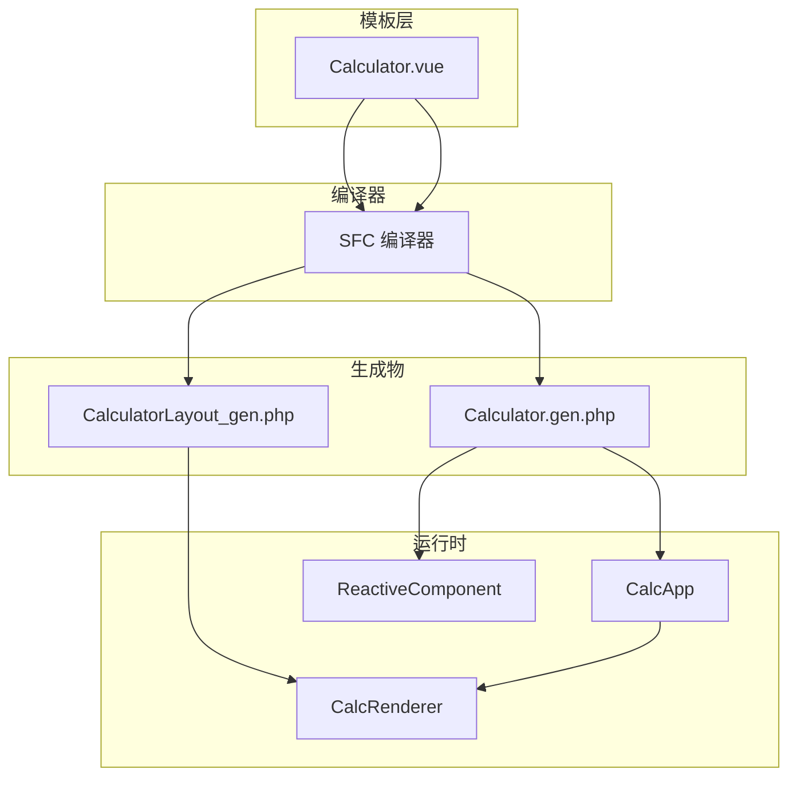
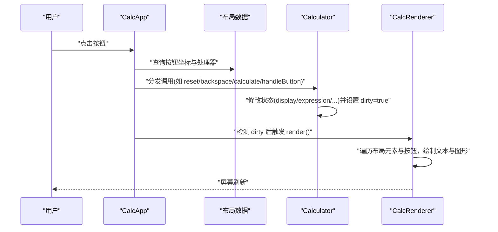
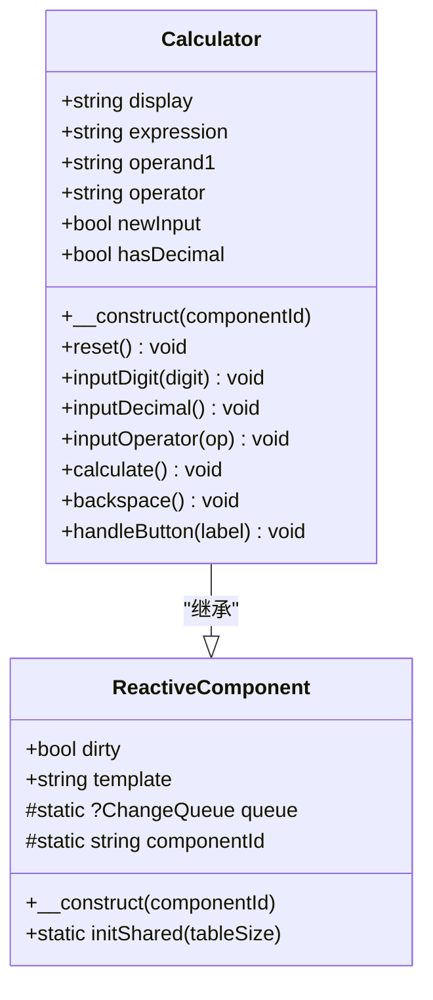
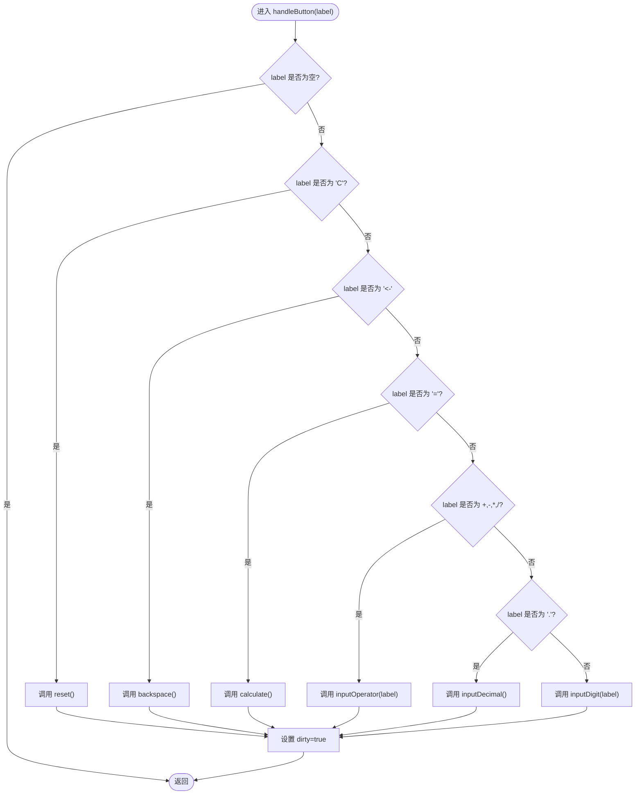
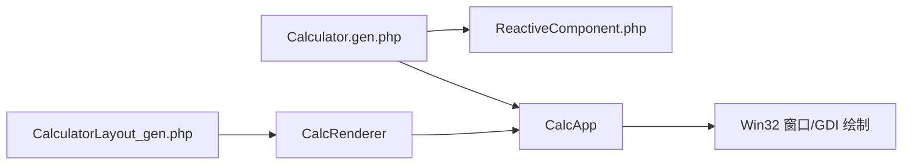

# Calculator组件API

<cite>
**本文引用的文件**
- [Calculator.vue](file://src/Calculator.vue)
- [Calculator.gen.php](file://src/Calculator.gen.php)
- [ReactiveComponent.php](file://src/ReactiveComponent.php)
- [CalculatorLayout_gen.php](file://src/CalculatorLayout_gen.php)
- [ChangeQueue.php](file://src/ChangeQueue.php)
- [main.php](file://main.php)
- [sfc-compiler-test.php](file://tests/sfc-compiler-test.php)
- [verify-layout.php](file://tests/verify-layout.php)
</cite>

## 目录
1. [简介](#简介)
2. [项目结构](#项目结构)
3. [核心组件](#核心组件)
4. [架构总览](#架构总览)
5. [详细组件分析](#详细组件分析)
6. [依赖关系分析](#依赖关系分析)
7. [性能考虑](#性能考虑)
8. [故障排除指南](#故障排除指南)
9. [结论](#结论)
10. [附录](#附录)

## 简介
本文件为Calculator组件的完整API参考文档，面向开发者与使用者，系统性地记录了Calculator类的公共方法、属性、状态管理机制、事件处理流程以及与父类ReactiveComponent的关系。文档还提供了按钮处理方法handleButton()的行为说明、组件生命周期要点（初始化、状态更新、渲染触发）、典型使用场景与调试建议，并通过图示帮助理解组件内部的数据流与控制流。

## 项目结构
Calculator组件采用“单文件组件(.vue) + SFC编译器 + AOT编译”的架构：
- 模板层：Calculator.vue定义UI结构与样式，包含显示区、按钮网格及事件绑定。
- 逻辑层：SFC编译器将.vue转换为Calculator.gen.php（组件类）与CalculatorLayout_gen.php（布局数据）。
- 渲染层：CalcRenderer基于布局数据与组件状态进行GDI绘制；CalcApp负责事件循环与脏标记驱动的重绘。
- 基类层：ReactiveComponent提供脏标记与共享变更队列能力，支持AOT编译环境下的响应式更新。

图表来源
- [Calculator.vue:1-215](file://src/Calculator.vue#L1-L215)
- [Calculator.gen.php:1-174](file://src/Calculator.gen.php#L1-L174)
- [CalculatorLayout_gen.php:1-296](file://src/CalculatorLayout_gen.php#L1-L296)
- [main.php:1-291](file://main.php#L1-L291)
- [ReactiveComponent.php:1-35](file://src/ReactiveComponent.php#L1-L35)

章节来源
- [Calculator.vue:1-215](file://src/Calculator.vue#L1-L215)
- [Calculator.gen.php:1-174](file://src/Calculator.gen.php#L1-L174)
- [CalculatorLayout_gen.php:1-296](file://src/CalculatorLayout_gen.php#L1-L296)
- [main.php:1-291](file://main.php#L1-L291)
- [ReactiveComponent.php:1-35](file://src/ReactiveComponent.php#L1-L35)

## 核心组件
本节聚焦Calculator类的公共API与状态变量，帮助快速定位功能入口与状态字段。

- 公共属性（状态变量）
  - display: 当前显示值（字符串），用于主显示区文本绑定。
  - expression: 表达式（字符串），用于右上角表达式显示。
  - operand1: 第一个操作数（字符串），参与计算。
  - operator: 当前运算符（字符串），支持'+', '-', '*', '/'。
  - newInput: 是否开始新输入（布尔），控制数字输入的覆盖与追加策略。
  - hasDecimal: 是否已输入小数点（布尔），防止重复小数点输入。
  - dirty: 脏标记（布尔），由父类ReactiveComponent提供，指示是否需要重绘。

- 公共方法
  - reset(): 重置计算器状态，清空显示与表达式，复位运算符与输入标志。
  - inputDigit(digit): 输入数字字符（含'.'），根据newInput与hasDecimal控制覆盖或追加。
  - inputDecimal(): 输入小数点，确保最多一个'.'。
  - inputOperator(op): 输入运算符，必要时先执行一次计算，然后设置表达式与运算符。
  - calculate(): 执行四则运算，处理除零错误，格式化结果，更新状态。
  - backspace(): 删除最后一位，支持退格到'0'或清除小数点。
  - handleButton(label): 统一的按钮处理入口，分派到具体逻辑方法。

章节来源
- [Calculator.gen.php:11-27](file://src/Calculator.gen.php#L11-L27)
- [Calculator.gen.php:29-168](file://src/Calculator.gen.php#L29-L168)
- [Calculator.vue:45-62](file://src/Calculator.vue#L45-L62)
- [Calculator.vue:63-202](file://src/Calculator.vue#L63-L202)

## 架构总览
Calculator组件遵循“数据驱动”的响应式设计：用户点击按钮 → CalcApp捕获事件 → 分发到Calculator的方法 → 修改状态变量 → 设置dirty → CalcRenderer按布局数据重新绘制。

图表来源
- [main.php:229-258](file://main.php#L229-L258)
- [CalculatorLayout_gen.php:10-296](file://src/CalculatorLayout_gen.php#L10-L296)
- [Calculator.gen.php:150-168](file://src/Calculator.gen.php#L150-L168)

章节来源
- [main.php:1-291](file://main.php#L1-L291)
- [CalculatorLayout_gen.php:1-296](file://src/CalculatorLayout_gen.php#L1-L296)

## 详细组件分析

### Calculator类结构与继承关系
Calculator继承自ReactiveComponent，后者提供脏标记与共享变更队列，满足AOT编译环境下的响应式更新需求。

图表来源
- [ReactiveComponent.php:11-34](file://src/ReactiveComponent.php#L11-L34)
- [Calculator.gen.php:9-174](file://src/Calculator.gen.php#L9-L174)

章节来源
- [ReactiveComponent.php:1-35](file://src/ReactiveComponent.php#L1-L35)
- [Calculator.gen.php:9-174](file://src/Calculator.gen.php#L9-L174)

### 状态变量与作用域
- display: 主显示区文本绑定，支持整数与小数格式化输出。
- expression: 表达式区文本绑定，用于显示“操作数 运算符”。
- operand1/operator/newInput/hasDecimal: 计算状态机的核心变量，决定输入与计算行为。
- dirty: 由父类提供，用于驱动渲染循环。

章节来源
- [Calculator.gen.php:11-27](file://src/Calculator.gen.php#L11-L27)
- [Calculator.vue:45-62](file://src/Calculator.vue#L45-L62)

### 方法详解

#### reset()
- 功能：重置计算器到初始状态。
- 行为：清空display/expression/operand1/operator，重置newInput/hasDecimal，设置dirty以触发重绘。
- 使用场景：用户点击“C”或需要清空状态时。

章节来源
- [Calculator.gen.php:29-39](file://src/Calculator.gen.php#L29-L39)
- [Calculator.vue:63-73](file://src/Calculator.vue#L63-L73)

#### inputDigit(digit)
- 参数：digit（字符串，数字或'.'）。
- 行为：若处于新输入阶段，直接覆盖display；否则在非'.'且display为'0'时覆盖，否则追加；最后设置dirty。
- 边界：防止'0'开头的多余前导零。

章节来源
- [Calculator.gen.php:41-56](file://src/Calculator.gen.php#L41-L56)
- [Calculator.vue:75-90](file://src/Calculator.vue#L75-L90)

#### inputDecimal()
- 行为：新输入阶段设置display为'0.'；若未输入小数点则追加'.'并标记hasDecimal；最后设置dirty。
- 边界：同一输入阶段仅允许一个'.'。

章节来源
- [Calculator.gen.php:58-70](file://src/Calculator.gen.php#L58-L70)
- [Calculator.vue:92-104](file://src/Calculator.vue#L92-L104)

#### inputOperator(op)
- 参数：op（字符串，'+', '-', '*', '/'）。
- 行为：若已有运算符且非新输入，先执行一次计算；随后保存当前display为operand1，设置operator与expression，进入新输入模式。
- 作用：实现连续计算的“惰性求值”。

章节来源
- [Calculator.gen.php:72-83](file://src/Calculator.gen.php#L72-L83)
- [Calculator.vue:106-117](file://src/Calculator.vue#L106-L117)

#### calculate()
- 行为：若缺少operator或operand1，直接返回；否则将operand1与当前display转为浮点数，执行对应运算；除法时检查除数为0并返回错误状态；结果格式化为整数或去除末尾0的小数字符串；清理expression/operand1/operator，设置newInput与hasDecimal，设置dirty。
- 错误处理：除零时显示错误提示并清空状态。

章节来源
- [Calculator.gen.php:85-128](file://src/Calculator.gen.php#L85-L128)
- [Calculator.vue:119-162](file://src/Calculator.vue#L119-L162)

#### backspace()
- 行为：若处于新输入或当前显示为错误，则不处理；否则删除最后一位；若删除的是'.'，同步清除hasDecimal；最后设置dirty。
- 边界：删除至最后一位时恢复为'0'并进入新输入。

章节来源
- [Calculator.gen.php:130-147](file://src/Calculator.gen.php#L130-L147)
- [Calculator.vue:164-181](file://src/Calculator.vue#L164-L181)

#### handleButton(label)
- 参数：label（字符串，按钮标签）。
- 行为：根据label分派到对应方法：
  - 'C' → reset()
  - '<-' → backspace()
  - '=' → calculate()
  - '+', '-', '*', '/' → inputOperator()
  - '.' → inputDecimal()
  - 数字 → inputDigit()
- 作用：统一的事件入口，便于模板与布局数据驱动。

章节来源
- [Calculator.gen.php:149-168](file://src/Calculator.gen.php#L149-L168)
- [Calculator.vue:183-202](file://src/Calculator.vue#L183-L202)

### 按钮处理流程（算法）

图表来源
- [Calculator.gen.php:149-168](file://src/Calculator.gen.php#L149-L168)

章节来源
- [Calculator.gen.php:149-168](file://src/Calculator.gen.php#L149-L168)

### 生命周期与渲染触发
- 初始化：CalcApp在main()中调用ReactiveComponent::initShared()初始化共享变更队列，然后实例化Calculator并创建CalcRenderer。
- 状态更新：Calculator各方法在修改状态后设置$dirty=true。
- 渲染触发：CalcApp.run()中检测$calc->dirty为true时调用CalcRenderer->render()，随后重置$dirty=false。
- 布局数据：CalculatorLayout_gen.php提供元素与按钮的布局信息，CalcRenderer据此绘制。

章节来源
- [main.php:265-291](file://main.php#L265-L291)
- [ReactiveComponent.php:30-33](file://src/ReactiveComponent.php#L30-L33)
- [CalculatorLayout_gen.php:10-296](file://src/CalculatorLayout_gen.php#L10-L296)

## 依赖关系分析
- 组件依赖
  - Calculator依赖ReactiveComponent提供的脏标记与共享队列。
  - CalcApp依赖Calculator与CalcRenderer，负责事件捕获与渲染调度。
  - CalcRenderer依赖CalculatorLayout_gen.php提供的布局数据。
- 编译器依赖
  - SFC编译器将Calculator.vue转换为Calculator.gen.php与CalculatorLayout_gen.php，确保AOT编译兼容性。

图表来源
- [Calculator.gen.php:9-174](file://src/Calculator.gen.php#L9-L174)
- [ReactiveComponent.php:11-34](file://src/ReactiveComponent.php#L11-L34)
- [CalculatorLayout_gen.php:10-296](file://src/CalculatorLayout_gen.php#L10-L296)
- [main.php:26-133](file://main.php#L26-L133)

章节来源
- [Calculator.gen.php:9-174](file://src/Calculator.gen.php#L9-L174)
- [ReactiveComponent.php:1-35](file://src/ReactiveComponent.php#L1-L35)
- [CalculatorLayout_gen.php:1-296](file://src/CalculatorLayout_gen.php#L1-L296)
- [main.php:1-291](file://main.php#L1-L291)

## 性能考虑
- 脏标记驱动：仅在状态变更时触发渲染，避免不必要的重绘。
- 字符串格式化：calculate()中对结果进行格式化，避免过长小数导致布局异常。
- 渲染频率：事件循环中使用微秒级休眠维持约60FPS，平衡流畅度与CPU占用。
- AOT兼容：通过静态属性与手动脏标记，避免魔术方法带来的编译限制。

[本节为通用性能讨论，无需特定文件来源]

## 故障排除指南
- 除零错误
  - 现象：显示“Error”，表达式与操作数清空。
  - 处理：检查除数是否为0，避免后续计算继续。
  - 参考：[Calculator.gen.php:104-114](file://src/Calculator.gen.php#L104-L114)
- 退格无效
  - 现象：点击“<-”无变化。
  - 排查：确认当前状态不是新输入或错误状态；检查hasDecimal与display长度。
  - 参考：[Calculator.gen.php:133-146](file://src/Calculator.gen.php#L133-L146)
- 小数点重复输入
  - 现象：界面出现多个'.'。
  - 排查：确认inputDecimal()逻辑与hasDecimal标志正确设置。
  - 参考：[Calculator.gen.php:58-70](file://src/Calculator.gen.php#L58-L70)
- 连续计算未生效
  - 现象：输入多个运算符后未立即计算。
  - 排查：确认inputOperator()在非新输入时会先调用calculate()。
  - 参考：[Calculator.gen.php:75-82](file://src/Calculator.gen.php#L75-L82)
- 渲染未更新
  - 现象：点击按钮后屏幕无变化。
  - 排查：确认各方法均设置$dirty=true；检查CalcApp.run()中对$dirty的检测与重置。
  - 参考：[main.php:213-221](file://main.php#L213-L221)

章节来源
- [Calculator.gen.php:104-114](file://src/Calculator.gen.php#L104-L114)
- [Calculator.gen.php:133-146](file://src/Calculator.gen.php#L133-L146)
- [Calculator.gen.php:58-70](file://src/Calculator.gen.php#L58-L70)
- [Calculator.gen.php:75-82](file://src/Calculator.gen.php#L75-L82)
- [main.php:213-221](file://main.php#L213-L221)

## 结论
Calculator组件通过清晰的状态变量与方法划分，实现了稳定的四则运算逻辑；配合ReactiveComponent的脏标记机制与SFC编译器的AOT兼容设计，形成了简洁高效的响应式桌面计算器。文档化的API与流程图有助于开发者快速理解与扩展功能。

[本节为总结性内容，无需特定文件来源]

## 附录

### 使用示例（方法调用与交互）
以下示例描述典型调用路径与预期行为，便于集成与测试：
- 输入数字序列：依次调用inputDigit("1")、inputDigit("2")、inputDigit(".")、inputDigit("3")，最终display呈现"12.3"。
- 连续计算：调用inputOperator("+")后输入"5"，再调用inputOperator("-")，系统先计算"12.3+5"，再等待下一次输入。
- 等号计算：调用calculate()，若operator与operand1有效则执行运算并格式化结果。
- 退格删除：调用backspace()，逐位删除直至"0"或到达边界。
- 清空状态：调用reset()，恢复初始状态。

章节来源
- [Calculator.gen.php:41-56](file://src/Calculator.gen.php#L41-L56)
- [Calculator.gen.php:58-70](file://src/Calculator.gen.php#L58-L70)
- [Calculator.gen.php:72-83](file://src/Calculator.gen.php#L72-L83)
- [Calculator.gen.php:85-128](file://src/Calculator.gen.php#L85-L128)
- [Calculator.gen.php:130-147](file://src/Calculator.gen.php#L130-L147)
- [Calculator.gen.php:29-39](file://src/Calculator.gen.php#L29-L39)

### 模板与布局映射
- 模板绑定：display与expression分别绑定到主显示文本与表达式文本。
- 按钮映射：布局数据中的buttons数组定义了18个按钮的标签、坐标、颜色与处理器；handleButton()通过label分派到对应方法。
- 验证：测试脚本验证了布局元素数量、按钮数量与处理器映射的正确性。

章节来源
- [Calculator.vue:10-13](file://src/Calculator.vue#L10-L13)
- [CalculatorLayout_gen.php:15-296](file://src/CalculatorLayout_gen.php#L15-L296)
- [sfc-compiler-test.php:214-238](file://tests/sfc-compiler-test.php#L214-L238)
- [verify-layout.php:32-61](file://tests/verify-layout.php#L32-L61)