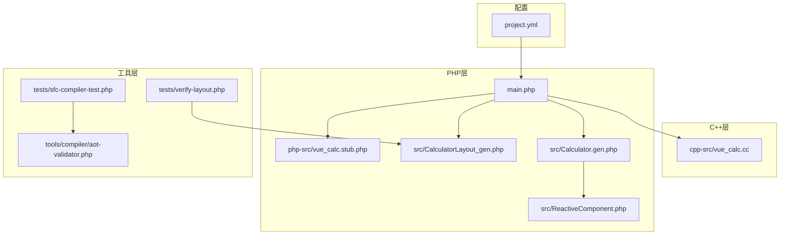
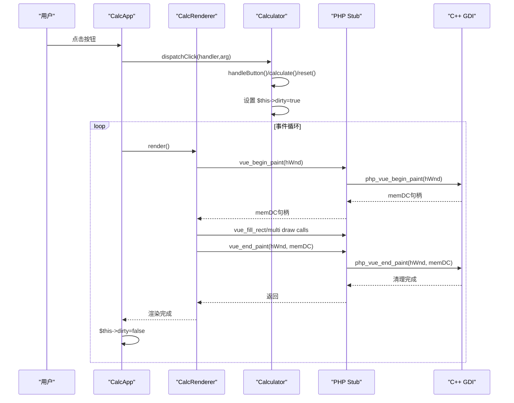
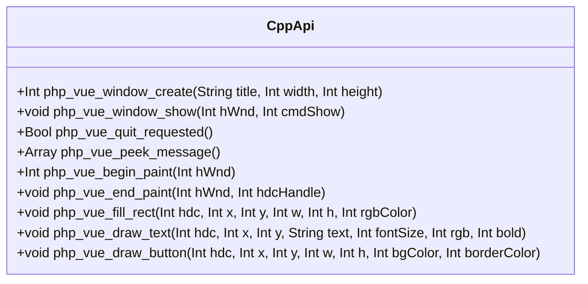
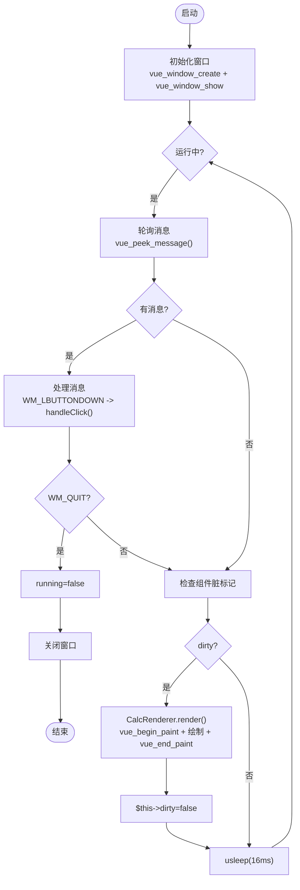
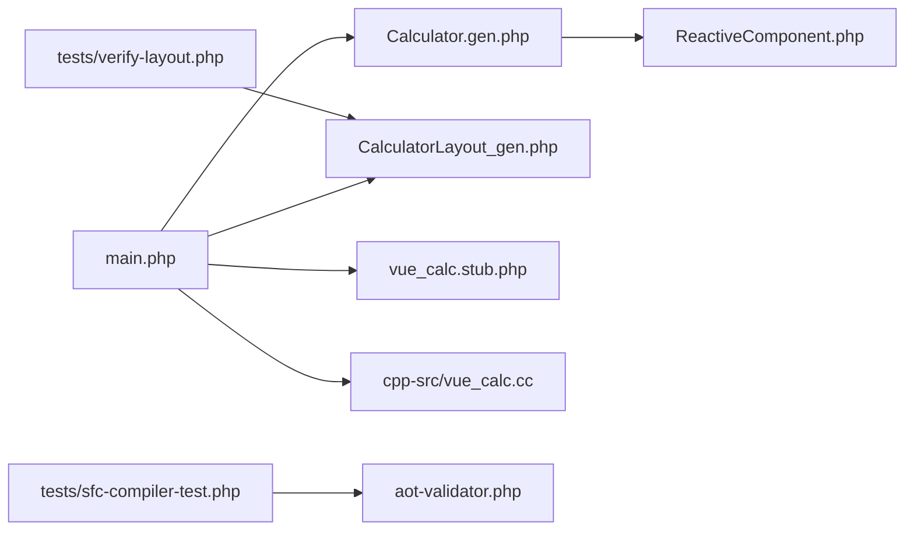

# PHP C++ Stub接口API

<cite>
**本文档引用的文件**
- [vue_calc.cc](file://cpp-src/vue_calc.cc)
- [vue_calc.stub.php](file://php-src/vue_calc.stub.php)
- [main.php](file://main.php)
- [Calculator.gen.php](file://src/Calculator.gen.php)
- [CalculatorLayout_gen.php](file://src/CalculatorLayout_gen.php)
- [ReactiveComponent.php](file://src/ReactiveComponent.php)
- [aot-validator.php](file://tools/compiler/aot-validator.php)
- [sfc-compiler-test.php](file://tests/sfc-compiler-test.php)
- [verify-layout.php](file://tests/verify-layout.php)
- [project.yml](file://project.yml)
</cite>

## 目录
1. [简介](#简介)
2. [项目结构](#项目结构)
3. [核心组件](#核心组件)
4. [架构总览](#架构总览)
5. [详细组件分析](#详细组件分析)
6. [依赖关系分析](#依赖关系分析)
7. [性能考虑](#性能考虑)
8. [故障排除指南](#故障排除指南)
9. [结论](#结论)
10. [附录](#附录)

## 简介
本文件为“VueCalc”项目中PHP与C++之间的Stub接口API文档，聚焦于：
- PHP侧对C++函数的声明与调用接口
- native_types类型系统的使用方法与约束
- PHP与C++之间的数据类型映射关系
- 完整接口定义（函数签名、返回值、异常处理）
- 实际调用示例与最佳实践
- AOT编译限制与兼容性要求

该系统采用“SFC编译器 + AOT编译”的模式，将.vue单文件组件编译为PHP代码，配合C++层Win32 GDI绘制原语，实现数据驱动的桌面计算器渲染。

## 项目结构
项目采用分层组织：
- C++层：提供Win32窗口与GDI绘制原语封装
- PHP层：SFC编译生成的布局与组件逻辑，以及应用主流程
- 工具层：AOT验证器、模板解析器、CSS映射等

图表来源
- [main.php:1-291](file://main.php#L1-L291)
- [Calculator.gen.php:1-174](file://src/Calculator.gen.php#L1-L174)
- [CalculatorLayout_gen.php:1-296](file://src/CalculatorLayout_gen.php#L1-L296)
- [ReactiveComponent.php:1-35](file://src/ReactiveComponent.php#L1-L35)
- [vue_calc.stub.php:1-24](file://php-src/vue_calc.stub.php#L1-L24)
- [vue_calc.cc:1-157](file://cpp-src/vue_calc.cc#L1-L157)
- [aot-validator.php:1-169](file://tools/compiler/aot-validator.php#L1-L169)
- [sfc-compiler-test.php:1-365](file://tests/sfc-compiler-test.php#L1-L365)
- [verify-layout.php:1-72](file://tests/verify-layout.php#L1-L72)
- [project.yml:1-10](file://project.yml#L1-L10)

章节来源
- [project.yml:1-10](file://project.yml#L1-L10)
- [main.php:1-291](file://main.php#L1-L291)

## 核心组件
- C++绘制原语模块：提供窗口创建、消息轮询、双缓冲绘制、矩形填充、文本绘制、按钮绘制等函数
- PHP Stub声明：定义与C++函数一一对应的PHP函数签名
- 应用主流程：窗口初始化、事件循环、渲染器驱动、组件状态变更检测
- 响应式组件基类：提供脏标记机制与共享内存初始化
- SFC布局生成：将.vue模板编译为布局数组与按钮映射
- AOT验证器：确保生成的PHP代码满足Swoole AOT编译约束

章节来源
- [vue_calc.cc:1-157](file://cpp-src/vue_calc.cc#L1-L157)
- [vue_calc.stub.php:1-24](file://php-src/vue_calc.stub.php#L1-L24)
- [main.php:1-291](file://main.php#L1-L291)
- [ReactiveComponent.php:1-35](file://src/ReactiveComponent.php#L1-L35)
- [CalculatorLayout_gen.php:1-296](file://src/CalculatorLayout_gen.php#L1-L296)
- [aot-validator.php:1-169](file://tools/compiler/aot-validator.php#L1-L169)

## 架构总览
系统采用“数据驱动 + C++原语渲染”的架构：
- PHP负责业务逻辑与状态管理
- SFC编译器将.vue模板转为布局数组
- 应用主流程在事件循环中检测脏标记并触发渲染
- 渲染器通过C++绘制原语完成UI绘制

图表来源
- [main.php:99-132](file://main.php#L99-L132)
- [main.php:171-227](file://main.php#L171-L227)
- [Calculator.gen.php:149-168](file://src/Calculator.gen.php#L149-L168)
- [CalculatorLayout_gen.php:10-296](file://src/CalculatorLayout_gen.php#L10-L296)
- [vue_calc.stub.php:13-23](file://php-src/vue_calc.stub.php#L13-L23)
- [vue_calc.cc:91-117](file://cpp-src/vue_calc.cc#L91-L117)

## 详细组件分析

### C++绘制原语模块
- 窗口管理：创建窗口、显示窗口、检查退出请求、消息轮询
- 绘制原语：双缓冲帧开始/结束、矩形填充、文本绘制、按钮绘制（背景+边框+文字）

图表来源
- [vue_calc.cc:36-157](file://cpp-src/vue_calc.cc#L36-L157)

章节来源
- [vue_calc.cc:19-157](file://cpp-src/vue_calc.cc#L19-L157)

### PHP Stub声明与调用约定
- PHP函数名以vue_开头，与C++实现中的php_vue_前缀对应
- 参数与返回值类型严格匹配C++签名
- 调用示例集中在应用主流程与渲染器中

章节来源
- [vue_calc.stub.php:13-23](file://php-src/vue_calc.stub.php#L13-L23)
- [main.php:154-166](file://main.php#L154-L166)
- [main.php:180-204](file://main.php#L180-L204)
- [main.php:101-131](file://main.php#L101-L131)

### 应用主流程与事件循环
- 初始化窗口：调用vue_window_create与vue_window_show
- 事件循环：通过vue_peek_message轮询消息，处理WM_LBUTTONDOWN与WM_QUIT
- 渲染触发：当组件状态变更（dirty）时调用CalcRenderer.render()

图表来源
- [main.php:152-169](file://main.php#L152-L169)
- [main.php:171-227](file://main.php#L171-L227)
- [main.php:229-258](file://main.php#L229-L258)

章节来源
- [main.php:152-227](file://main.php#L152-L227)

### 渲染器与布局驱动
- 渲染器基于SFC生成的布局数组，遍历elements与buttons进行绘制
- 文本元素支持对齐、动态字号、颜色与粗体
- 按钮绘制包含背景、边框与居中文字

章节来源
- [main.php:26-133](file://main.php#L26-L133)
- [CalculatorLayout_gen.php:10-296](file://src/CalculatorLayout_gen.php#L10-L296)

### 响应式组件与脏标记
- ReactiveComponent提供脏标记$dirty与共享内存初始化
- 子类在状态变更后设置$dirty=true，驱动渲染器重绘

章节来源
- [ReactiveComponent.php:11-35](file://src/ReactiveComponent.php#L11-L35)
- [Calculator.gen.php:30-39](file://src/Calculator.gen.php#L30-L39)

### SFC布局生成与校验
- 布局生成：将.vue模板与样式映射为elements/buttons数组
- AOT验证：禁止多点文件名、const嵌套数组、变量属性/方法访问、PHP8特性等

章节来源
- [CalculatorLayout_gen.php:10-296](file://src/CalculatorLayout_gen.php#L10-L296)
- [aot-validator.php:36-106](file://tools/compiler/aot-validator.php#L36-L106)

## 依赖关系分析
- PHP主流程依赖：Calculator.gen.php（组件）、CalculatorLayout_gen.php（布局）、vue_calc.stub.php（接口声明）、C++绘制原语
- 渲染器依赖：布局数组与组件状态
- AOT验证器依赖：生成的PHP代码与规则集

图表来源
- [main.php:1-291](file://main.php#L1-L291)
- [Calculator.gen.php:1-174](file://src/Calculator.gen.php#L1-L174)
- [CalculatorLayout_gen.php:1-296](file://src/CalculatorLayout_gen.php#L1-L296)
- [ReactiveComponent.php:1-35](file://src/ReactiveComponent.php#L1-L35)
- [vue_calc.stub.php:1-24](file://php-src/vue_calc.stub.php#L1-L24)
- [vue_calc.cc:1-157](file://cpp-src/vue_calc.cc#L1-L157)
- [aot-validator.php:1-169](file://tools/compiler/aot-validator.php#L1-L169)
- [sfc-compiler-test.php:1-365](file://tests/sfc-compiler-test.php#L1-L365)
- [verify-layout.php:1-72](file://tests/verify-layout.php#L1-L72)

## 性能考虑
- 渲染频率控制：事件循环中使用微秒级sleep维持约60FPS
- 双缓冲绘制：减少闪烁，提升视觉流畅度
- 字号自适应：根据文本长度动态调整字体大小，避免溢出
- 脏标记机制：仅在状态变更时触发重绘，降低CPU占用

章节来源
- [main.php:223-223](file://main.php#L223-L223)
- [main.php:71-78](file://main.php#L71-L78)
- [main.php:101-131](file://main.php#L101-L131)

## 故障排除指南
- AOT编译失败排查
  - 文件名含多个点：确保文件名仅含最多一个点（如Calculator.gen.php），避免生成无效C++符号
  - const嵌套数组：使用函数返回数组而非全局const常量
  - 变量属性/方法访问：避免$obj->$var或$obj->$method()，使用显式分支路由
  - PHP8特性：替换str_contains等函数为兼容写法
- 运行期错误
  - 异常捕获：在事件处理与渲染过程中使用try/catch输出错误信息
  - 窗口创建失败：检查返回值并输出错误提示

章节来源
- [aot-validator.php:36-106](file://tools/compiler/aot-validator.php#L36-L106)
- [main.php:160-164](file://main.php#L160-L164)
- [main.php:192-198](file://main.php#L192-L198)
- [main.php:215-219](file://main.php#L215-L219)

## 结论
本项目通过PHP与C++的清晰分工实现了高性能的数据驱动桌面应用：
- PHP负责逻辑与渲染驱动，C++专注底层绘制原语
- 严格的AOT约束保证了跨平台可执行产物的稳定性
- native_types与脏标记机制提升了类型安全与渲染效率
- 通过SFC编译器与布局生成，实现了从模板到可执行UI的完整链路

## 附录

### 接口定义与调用示例

- 窗口管理
  - 函数：vue_window_create(title: string, width: int, height: int): int
  - 函数：vue_window_show(hWnd: int, cmdShow: int): void
  - 函数：vue_quit_requested(): bool
  - 函数：vue_peek_message(): array

- 绘制原语
  - 函数：vue_begin_paint(hWnd: int): int
  - 函数：vue_end_paint(hWnd: int, hdc: int): void
  - 函数：vue_fill_rect(hdc: int, x: int, y: int, w: int, h: int, rgb: int): void
  - 函数：vue_draw_text(hdc: int, x: int, y: int, text: string, fontSize: int, rgb: int, bold: int): void
  - 函数：vue_draw_button(hdc: int, x: int, y: int, w: int, h: int, bgColor: int, borderColor: int): void

- 调用示例路径
  - 窗口创建与显示：[main.php:154-166](file://main.php#L154-L166)
  - 事件轮询与点击处理：[main.php:180-204](file://main.php#L180-L204)
  - 渲染流程：[main.php:101-131](file://main.php#L101-L131)
  - 组件状态变更：[Calculator.gen.php:30-39](file://src/Calculator.gen.php#L30-L39)

- 类型映射关系
  - string ↔ String（C++侧String）
  - int ↔ Int（C++侧Int/Bool/HDC句柄等）
  - bool ↔ Bool（C++侧Bool）
  - array ↔ Array（C++侧Array，用于消息轮询返回值）

- native_types使用
  - 在生成的组件类与布局文件中引入native_types命名空间，确保类型系统可用
  - 示例路径：[Calculator.gen.php:7](file://src/Calculator.gen.php#L7)、[Calculator.gen.php:30](file://src/Calculator.gen.php#L30)、[CalculatorLayout_gen.php:1](file://src/CalculatorLayout_gen.php#L1)

- AOT编译限制与要求
  - 文件名规则：文件名中“.”最多出现一次，避免生成无效C++符号
  - 常量数组：禁止使用const声明嵌套数组，建议改为函数返回
  - 变量访问：禁止$obj->$var与$obj->$method()，需使用显式分支
  - PHP8特性：避免使用str_contains等仅PHP8支持的函数
  - 顶层执行：生成文件中所有代码必须位于类或函数内部

- 最佳实践
  - 使用脏标记机制仅在状态变更时触发渲染
  - 文本绘制时根据长度动态调整字号，避免溢出
  - 事件处理与渲染过程加入异常捕获，便于调试
  - 保持PHP与C++接口签名一致，避免类型不匹配

章节来源
- [vue_calc.stub.php:13-23](file://php-src/vue_calc.stub.php#L13-L23)
- [main.php:154-166](file://main.php#L154-L166)
- [main.php:180-204](file://main.php#L180-L204)
- [main.php:101-131](file://main.php#L101-L131)
- [Calculator.gen.php:7-39](file://src/Calculator.gen.php#L7-L39)
- [Calculator.gen.php:149-168](file://src/Calculator.gen.php#L149-L168)
- [CalculatorLayout_gen.php:10-296](file://src/CalculatorLayout_gen.php#L10-L296)
- [aot-validator.php:36-106](file://tools/compiler/aot-validator.php#L36-L106)