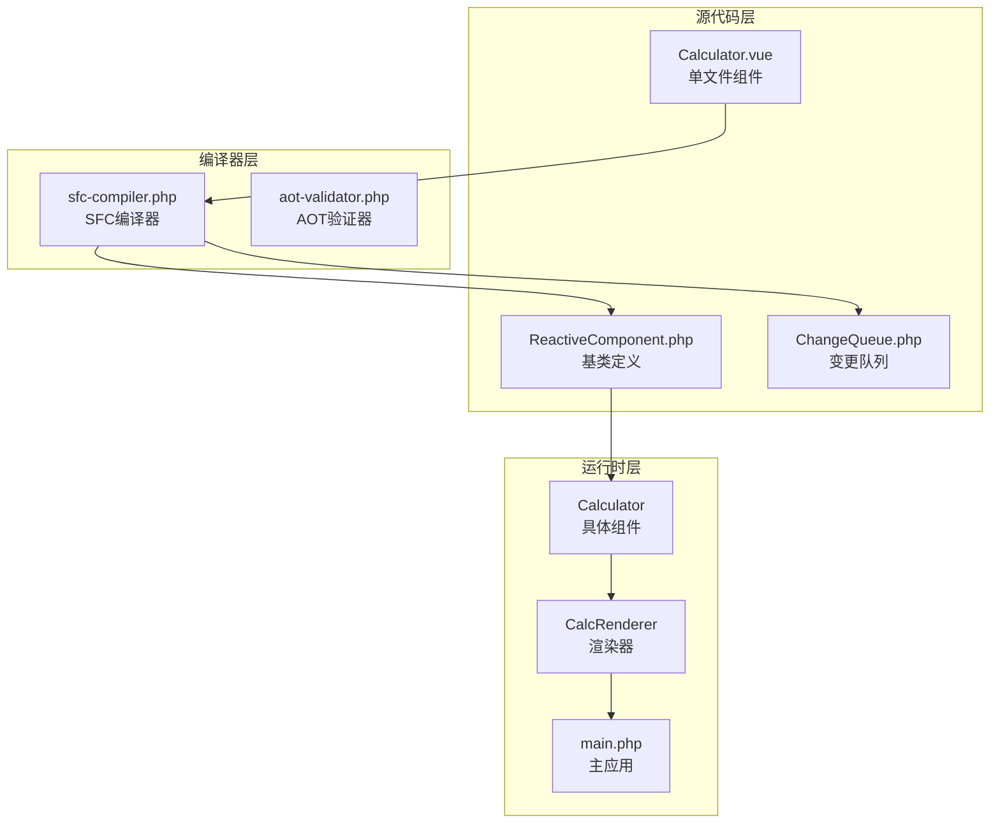
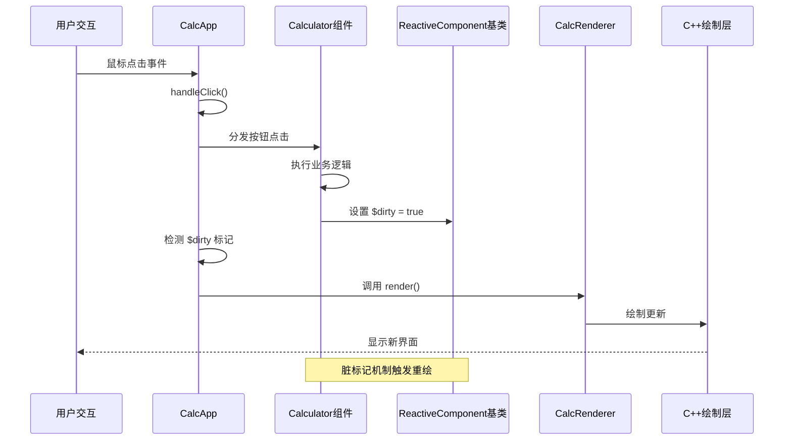
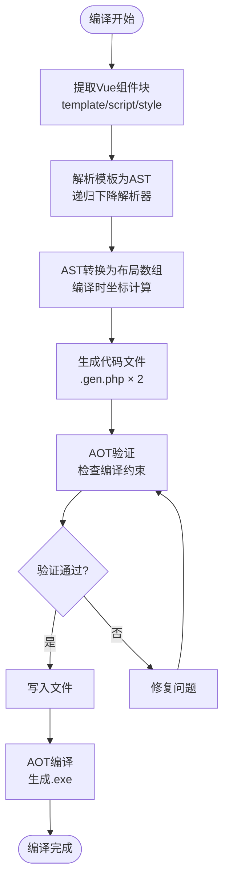
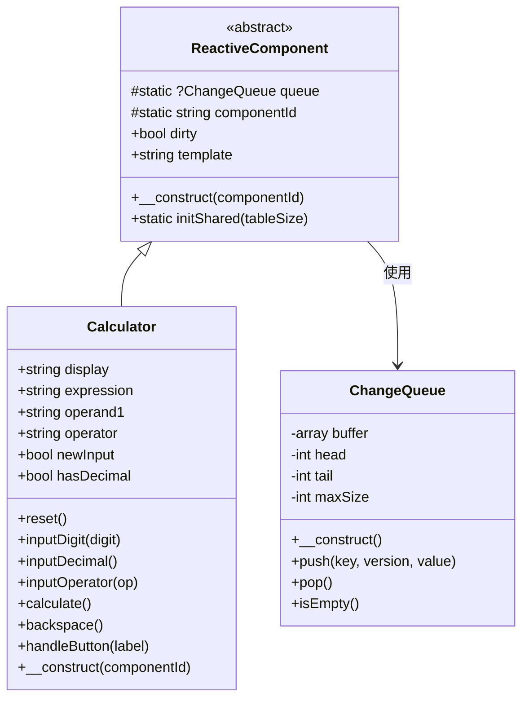
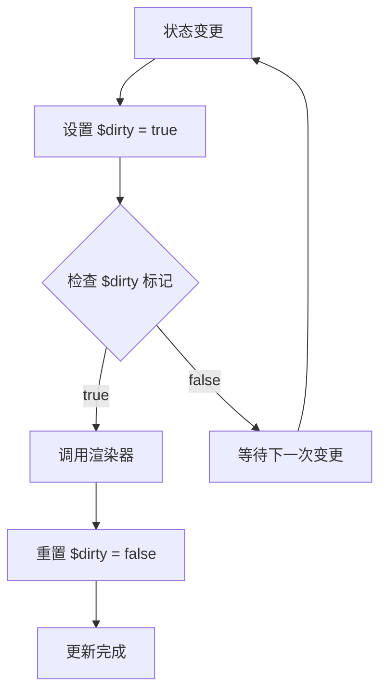
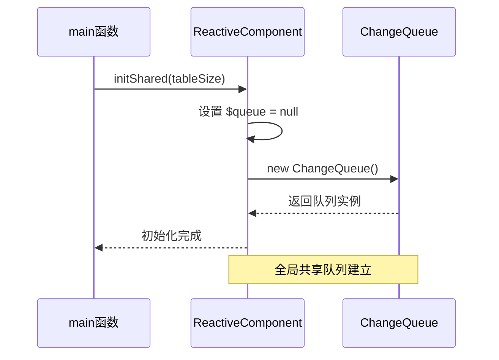
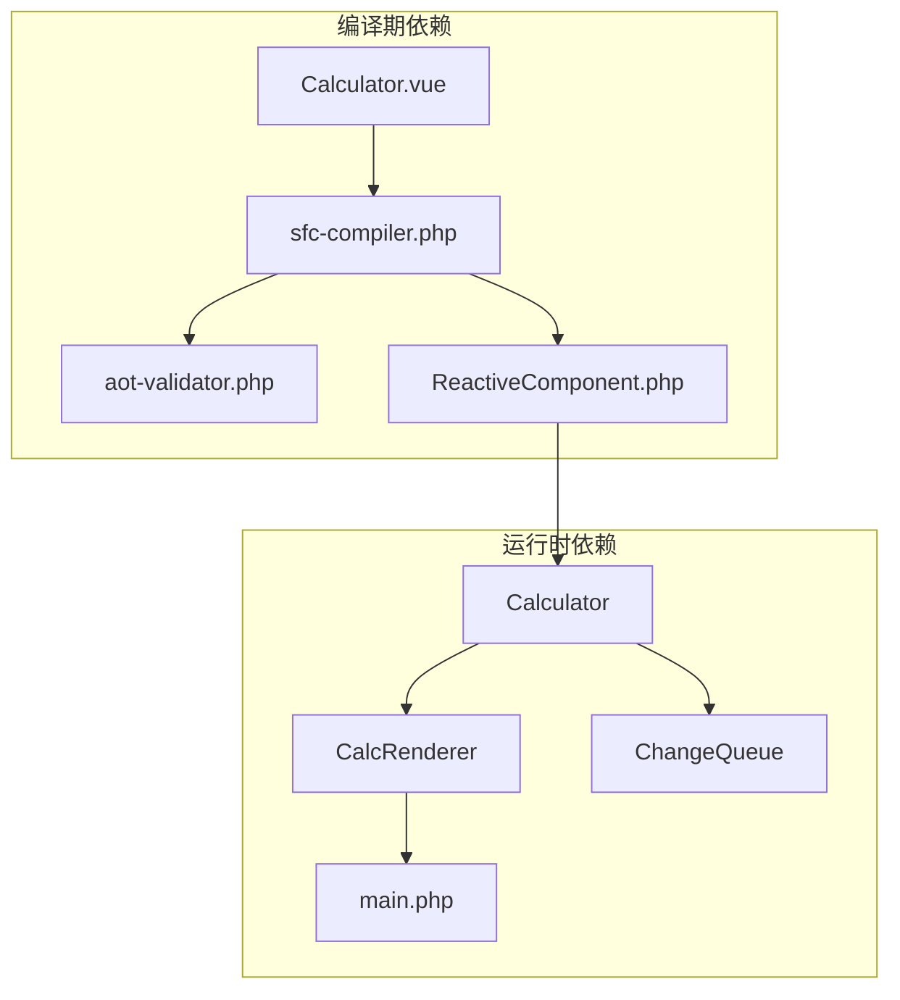

# ReactiveComponent基类API

<cite>
**本文档引用的文件**
- [ReactiveComponent.php](file://src/ReactiveComponent.php)
- [Calculator.gen.php](file://src/Calculator.gen.php)
- [Calculator.vue](file://src/Calculator.vue)
- [ChangeQueue.php](file://src/ChangeQueue.php)
- [main.php](file://main.php)
- [sfc-compiler.php](file://tools/sfc-compiler.php)
- [aot-validator.php](file://tools/compiler/aot-validator.php)
- [sfc-compiler-test.php](file://tests/sfc-compiler-test.php)
</cite>

## 目录
1. [简介](#简介)
2. [项目结构](#项目结构)
3. [核心组件](#核心组件)
4. [架构概览](#架构概览)
5. [详细组件分析](#详细组件分析)
6. [依赖关系分析](#依赖关系分析)
7. [性能考虑](#性能考虑)
8. [故障排除指南](#故障排除指南)
9. [结论](#结论)
10. [附录](#附录)

## 简介
ReactiveComponent是Vue-Calc项目中的响应式组件基类，为基于单文件组件(SFC)的桌面应用程序提供响应式数据驱动的基础架构。该基类实现了AOT(Ahead-of-Time)编译兼容的响应式系统，通过脏标记机制实现高效的UI更新。

该系统的核心特性包括：
- AOT编译兼容的响应式架构
- 基于脏标记的状态变更检测
- 共享的变更队列管理
- 类型安全的组件继承体系
- 完整的编译器集成支持

## 项目结构
Vue-Calc项目采用模块化的架构设计，主要包含以下关键组件：



**图表来源**
- [sfc-compiler.php:17-25](file://tools/sfc-compiler.php#L17-L25)
- [main.php:26-133](file://main.php#L26-L133)
- [ReactiveComponent.php:11-35](file://src/ReactiveComponent.php#L11-L35)

**章节来源**
- [sfc-compiler.php:1-210](file://tools/sfc-compiler.php#L1-L210)
- [main.php:1-291](file://main.php#L1-L291)

## 核心组件

### ReactiveComponent基类概述
ReactiveComponent是整个响应式系统的核心基类，提供了以下关键功能：

#### 静态属性
- `$componentId`: 当前组件的唯一标识符，用于区分不同的组件实例
- `$queue`: 全局变更队列，管理组件状态变更的通知机制

#### 实例属性
- `$dirty`: 脏标记布尔值，指示组件状态是否需要重新渲染
- `$template`: 模板文件路径，可选的模板支持

#### 关键方法
- `__construct()`: 构造函数，初始化组件ID
- `initShared()`: 静态初始化方法，设置全局变更队列

**章节来源**
- [ReactiveComponent.php:11-35](file://src/ReactiveComponent.php#L11-L35)

## 架构概览

### 响应式系统架构
Vue-Calc的响应式系统采用分层架构设计，实现了从模板到渲染的完整数据驱动流程：



**图表来源**
- [main.php:213-221](file://main.php#L213-L221)
- [Calculator.gen.php:29-168](file://src/Calculator.gen.php#L29-L168)

### AOT编译兼容性架构
系统特别针对Swoole AOT编译器进行了优化，确保生成的C++代码能够正确编译：



**图表来源**
- [sfc-compiler.php:46-210](file://tools/sfc-compiler.php#L46-L210)
- [aot-validator.php:36-106](file://tools/compiler/aot-validator.php#L36-L106)

**章节来源**
- [sfc-compiler.php:1-210](file://tools/sfc-compiler.php#L1-L210)
- [aot-validator.php:1-169](file://tools/compiler/aot-validator.php#L1-L169)

## 详细组件分析

### ReactiveComponent类详细分析

#### 类定义和继承关系


**图表来源**
- [ReactiveComponent.php:11-35](file://src/ReactiveComponent.php#L11-L35)
- [Calculator.gen.php:9-174](file://src/Calculator.gen.php#L9-L174)
- [ChangeQueue.php:11-57](file://src/ChangeQueue.php#L11-L57)

#### 脏标记机制工作原理
脏标记是ReactiveComponent的核心机制，实现了高效的UI更新控制：



**图表来源**
- [main.php:213-221](file://main.php#L213-L221)
- [Calculator.gen.php:38-167](file://src/Calculator.gen.php#L38-L167)

#### 静态初始化流程
ReactiveComponent提供了静态初始化方法，用于设置全局共享资源：



**图表来源**
- [main.php:276](file://main.php#L276)
- [ReactiveComponent.php:30-33](file://src/ReactiveComponent.php#L30-L33)

**章节来源**
- [ReactiveComponent.php:1-35](file://src/ReactiveComponent.php#L1-L35)
- [Calculator.gen.php:1-174](file://src/Calculator.gen.php#L1-L174)
- [ChangeQueue.php:1-57](file://src/ChangeQueue.php#L1-L57)

### 具体组件实现示例

#### Calculator组件的脏标记使用
Calculator作为ReactiveComponent的具体实现，展示了脏标记的最佳实践：

##### 状态变更模式
每个公共方法在修改内部状态后都会设置脏标记：

```mermaid
flowchart LR
subgraph "状态变更方法"
Reset[reset()] --> Dirty1["设置 $dirty = true"]
InputDigit[inputDigit()] --> Dirty2["设置 $dirty = true"]
InputDecimal[inputDecimal()] --> Dirty3["设置 $dirty = true"]
InputOp[inputOperator()] --> Dirty4["设置 $dirty = true"]
Calc[caculate()] --> Dirty5["设置 $dirty = true"]
Backspace[backspace()] --> Dirty6["设置 $dirty = true"]
end
Dirty1 --> Render1[触发重绘]
Dirty2 --> Render2[触发重绘]
Dirty3 --> Render3[触发重绘]
Dirty4 --> Render4[触发重绘]
Dirty5 --> Render5[触发重绘]
Dirty6 --> Render6[触发重绘]
```

**图表来源**
- [Calculator.gen.php:30-147](file://src/Calculator.gen.php#L30-L147)

##### 错误处理中的脏标记
在错误处理场景中，同样需要设置脏标记以确保UI同步更新：

```mermaid
flowchart TD
CalcCall[caculate()] --> CheckOp{"运算符存在?"}
CheckOp --> |否| Return1[直接返回]
CheckOp --> |是| CheckOper1{"第一个操作数存在?"}
CheckOper1 --> |否| Return2[直接返回]
CheckOper1 --> |是| PerformCalc[执行计算]
PerformCalc --> CheckDiv{"除数为0?"}
CheckDiv --> |是| HandleError[设置错误状态]
CheckDiv --> |否| SetResult[设置计算结果]
HandleError --> DirtyError["设置 $dirty = true"]
SetResult --> DirtySuccess["设置 $dirty = true"]
DirtyError --> RenderError[触发重绘]
DirtySuccess --> RenderSuccess[触发重绘]
```

**图表来源**
- [Calculator.gen.php:86-128](file://src/Calculator.gen.php#L86-L128)

**章节来源**
- [Calculator.gen.php:1-174](file://src/Calculator.gen.php#L1-L174)

## 依赖关系分析

### 组件间依赖关系


**图表来源**
- [sfc-compiler.php:19-24](file://tools/sfc-compiler.php#L19-L24)
- [main.php:26-133](file://main.php#L26-L133)

### 编译器集成点
系统与编译器的集成体现在多个层面：

#### AOT验证规则
编译器在生成代码前进行严格验证，确保AOT兼容性：

| 验证规则 | 描述 | 影响范围 |
|---------|------|----------|
| 文件名点数限制 | 文件名茎名最多允许1个点 | 所有生成的.gen.php文件 |
| 常量数组限制 | 禁止嵌套结构的const数组 | 生成的布局文件 |
| 变量属性访问 | 禁止$obj->$var形式 | 所有生成的组件类 |
| 变量方法调用 | 禁止$obj->$method()形式 | 所有生成的组件类 |
| PHP8函数兼容 | 替换str_contains等函数 | 生成的组件类 |

**章节来源**
- [aot-validator.php:36-106](file://tools/compiler/aot-validator.php#L36-L106)
- [sfc-compiler.php:184-201](file://tools/sfc-compiler.php#L184-L201)

## 性能考虑

### 脏标记性能优化
ReactiveComponent的脏标记机制提供了高效的UI更新策略：

#### 时间复杂度分析
- 状态变更: O(1) - 直接设置布尔值
- 变更检测: O(1) - 检查布尔标志
- 渲染触发: O(n) - n为需要渲染的元素数量

#### 内存使用优化
- 脏标记占用固定内存空间
- 变更队列使用环形缓冲区，避免内存泄漏
- 组件实例共享全局队列，减少内存开销

### 渲染性能优化
系统通过以下方式优化渲染性能：

1. **按需渲染**: 仅在脏标记为true时触发渲染
2. **批量更新**: 合并连续的状态变更
3. **增量更新**: 仅更新发生变化的部分

## 故障排除指南

### 常见问题及解决方案

#### 脏标记未设置问题
**症状**: UI不更新但逻辑正常
**原因**: 状态变更后忘记设置`$dirty = true`
**解决方案**: 确保每个修改内部状态的方法都设置脏标记

#### AOT编译失败
**症状**: 编译时报错，无法生成.exe
**原因**: 代码不符合AOT编译器要求
**解决方案**: 
1. 检查文件名是否包含多余点号
2. 避免使用变量属性访问
3. 使用显式if/else替代变量方法调用

#### 渲染异常
**症状**: 界面显示异常或空白
**原因**: 渲染器无法正确读取组件状态
**解决方案**: 
1. 确保组件属性名称与模板绑定一致
2. 检查渲染器的属性访问映射

**章节来源**
- [main.php:213-221](file://main.php#L213-L221)
- [aot-validator.php:36-106](file://tools/compiler/aot-validator.php#L36-L106)

## 结论
ReactiveComponent基类为Vue-Calc项目提供了强大而灵活的响应式组件基础。其设计充分考虑了AOT编译兼容性和性能优化，在保持类型安全的同时实现了高效的UI更新机制。

关键优势包括：
- **AOT兼容性**: 完全符合Swoole编译器要求
- **性能优化**: 脏标记机制提供高效的变更检测
- **类型安全**: 强类型的属性声明和方法签名
- **易于扩展**: 清晰的继承体系便于功能扩展

通过遵循本文档的最佳实践，开发者可以构建稳定可靠的响应式组件，充分利用系统的性能优势和编译器优化。

## 附录

### API参考表

#### ReactiveComponent类方法

| 方法名 | 参数 | 返回值 | 描述 |
|--------|------|--------|------|
| `__construct` | `?string $componentId = null` | `void` | 构造函数，初始化组件ID |
| `initShared` | `int $tableSize = 10240` | `void` | 静态初始化方法，设置全局变更队列 |

#### ReactiveComponent类属性

| 属性名 | 类型 | 默认值 | 描述 |
|--------|------|--------|------|
| `$componentId` | `string` | `''` | 当前组件标识符 |
| `$queue` | `?ChangeQueue` | `null` | 全局变更队列实例 |
| `$dirty` | `bool` | `false` | 脏标记，指示是否需要重绘 |
| `$template` | `string` | `''` | 模板文件路径 |

#### Calculator类方法

| 方法名 | 参数 | 返回值 | 描述 |
|--------|------|--------|------|
| `reset` | `void` | `void` | 重置计算器状态 |
| `inputDigit` | `string $digit` | `void` | 输入数字 |
| `inputDecimal` | `void` | `void` | 输入小数点 |
| `inputOperator` | `string $op` | `void` | 输入运算符 |
| `calculate` | `void` | `void` | 执行计算 |
| `backspace` | `void` | `void` | 退格删除 |
| `handleButton` | `string $label` | `void` | 处理按钮点击 |

### 最佳实践指南

#### 继承ReactiveComponent的正确方式
1. **声明属性**: 在子类中明确声明所有公共属性
2. **设置脏标记**: 每次状态变更后设置`$this->dirty = true`
3. **显式初始化**: 调用父类构造函数设置组件ID
4. **避免魔术方法**: 不要使用`__get`/`__set`魔术方法

#### AOT编译兼容性要求
1. **文件命名**: 避免文件名包含多余点号
2. **属性访问**: 使用显式属性访问而非变量属性
3. **方法调用**: 使用显式方法调用而非变量方法
4. **函数兼容**: 避免使用PHP8特有的函数

#### 错误避免清单
- ✅ 每个状态变更后都设置脏标记
- ✅ 避免在模板绑定中使用变量属性
- ✅ 确保所有公共属性都有明确的类型声明
- ✅ 在错误处理中也要设置脏标记
- ✅ 遵循AOT编译器的所有限制要求