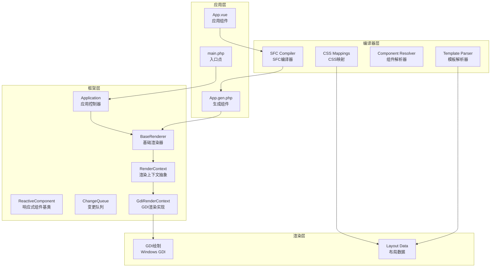
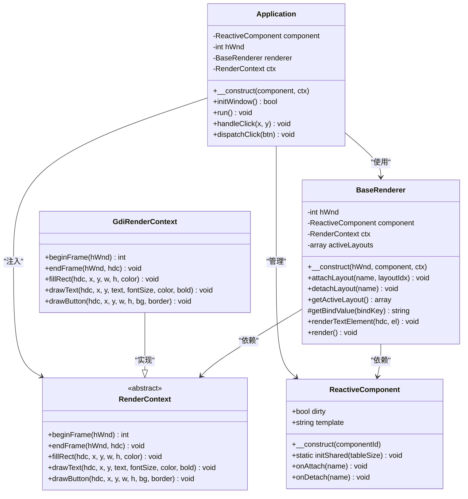
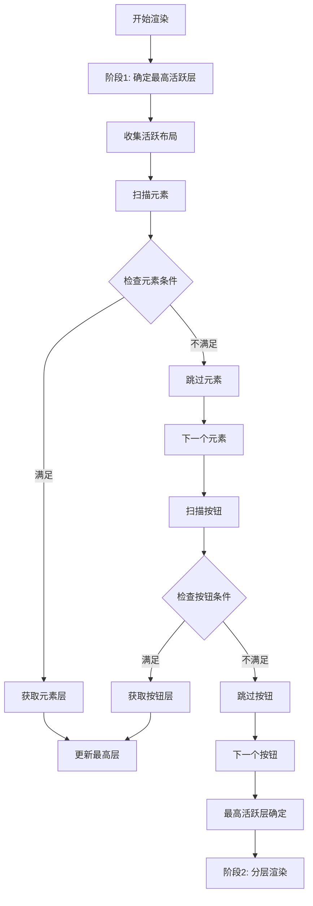
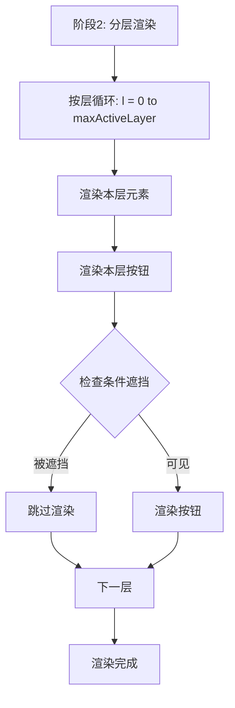
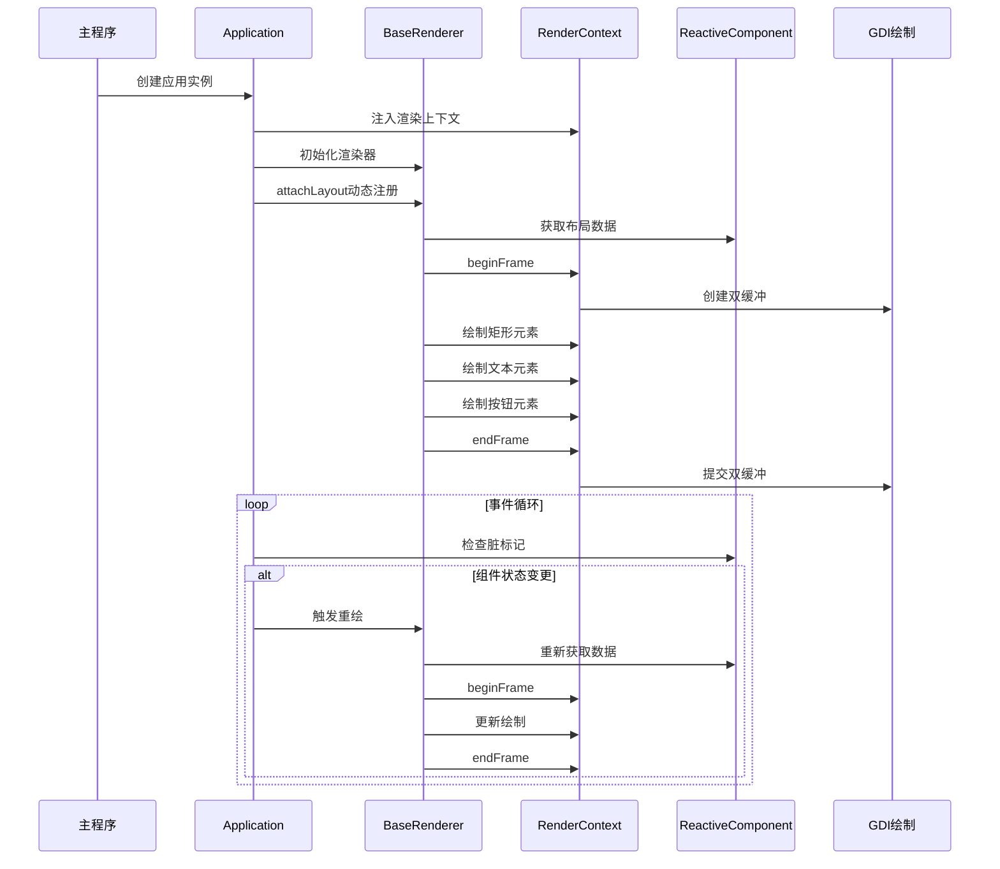
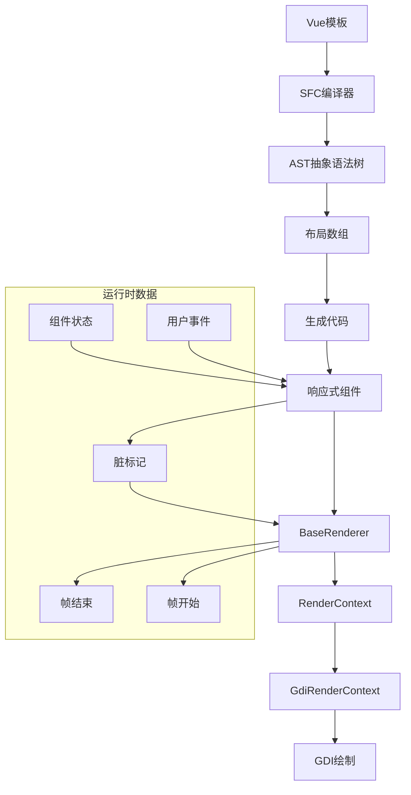
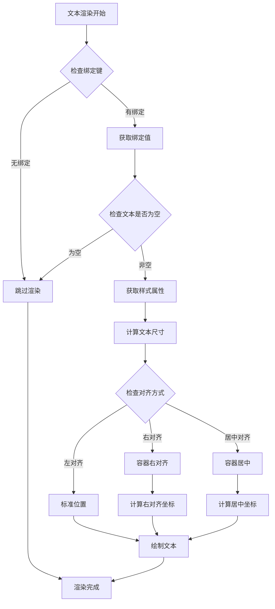
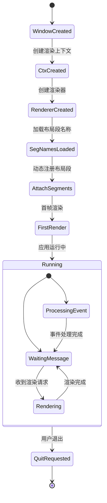
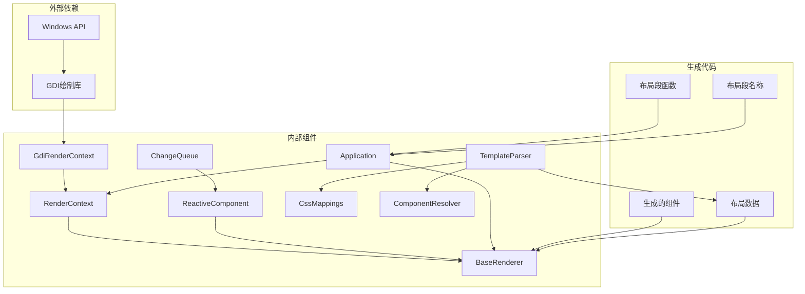
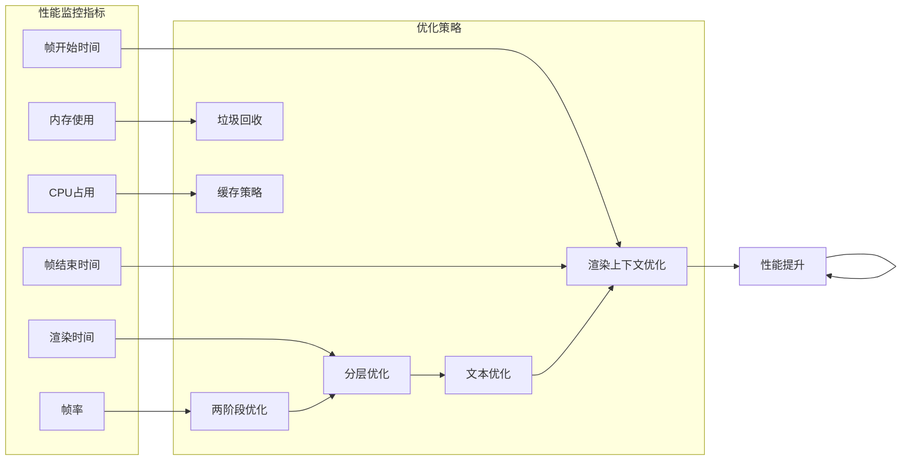

# BaseRenderer基础渲染器

<cite>
**本文档引用的文件**
- [BaseRenderer.php](file://framework/BaseRenderer.php)
- [Application.php](file://apps/calculator/Application.php)
- [ReactiveComponent.php](file://framework/ReactiveComponent.php)
- [RenderContext.php](file://framework/rendering/RenderContext.php)
- [GdiRenderContext.php](file://framework/rendering/GdiRenderContext.php)
- [ChangeQueue.php](file://framework/ChangeQueue.php)
- [sfc-compiler.php](file://framework/sfc-compiler.php)
- [template-parser.php](file://framework/compiler/template-parser.php)
- [ast-nodes.php](file://framework/compiler/ast-nodes.php)
- [css-mappings.php](file://framework/compiler/css-mappings.php)
- [component-resolver.php](file://framework/compiler/component-resolver.php)
- [App.gen.php](file://apps/calculator/gen/App.gen.php)
- [App.vue](file://apps/calculator/App.vue)
</cite>

## 更新摘要
**变更内容**
- 新增渲染上下文架构支持，实现完全后端无关的渲染器
- 移除直接GDI调用依赖，通过RenderContext抽象层实现后端解耦
- 引入分段布局机制，支持动态布局挂载和卸载
- 更新两阶段渲染算法以适配新的渲染上下文架构
- 增强AOT兼容性，解决嵌套数组类型丢失问题

## 目录
1. [简介](#简介)
2. [项目结构概览](#项目结构概览)
3. [核心组件分析](#核心组件分析)
4. [架构总览](#架构总览)
5. [详细组件分析](#详细组件分析)
6. [依赖关系分析](#依赖关系分析)
7. [性能考虑](#性能考虑)
8. [故障排除指南](#故障排除指南)
9. [结论](#结论)

## 简介

BaseRenderer基础渲染器是VueCalc v6项目中的核心渲染组件，采用数据驱动的方式实现高性能的桌面应用程序渲染。该渲染器基于SFC（Single File Component）编译器生成的布局数据，通过抽象的渲染上下文接口进行绘制，实现了从模板到最终渲染的完整数据流。

**更新** BaseRenderer v6 M1版本引入了革命性的渲染上下文架构，完全移除了对直接GDI调用的依赖，实现了真正的后端无关渲染器。该渲染器支持分段布局管理，通过RenderContext抽象层实现了与具体渲染后端的解耦。

BaseRenderer的设计理念是"泛化数据驱动渲染"，它不绑定特定的组件类型，可以接受任意ReactiveComponent子类，支持框架的复用性和扩展性。该组件通过**两阶段分层渲染算法**和**分段布局管理**，实现了复杂的UI层次管理和条件渲染功能。

## 项目结构概览

VueCalc项目采用模块化的架构设计，主要分为以下几个层次：



**图表来源**
- [BaseRenderer.php:1-186](file://framework/BaseRenderer.php#L1-L186)
- [sfc-compiler.php:1-567](file://framework/sfc-compiler.php#L1-L567)
- [Application.php:1-146](file://apps/calculator/Application.php#L1-L146)
- [RenderContext.php:1-30](file://framework/rendering/RenderContext.php#L1-L30)
- [GdiRenderContext.php:1-38](file://framework/rendering/GdiRenderContext.php#L1-L38)

**章节来源**
- [BaseRenderer.php:1-186](file://framework/BaseRenderer.php#L1-L186)
- [sfc-compiler.php:1-567](file://framework/sfc-compiler.php#L1-L567)
- [Application.php:1-146](file://apps/calculator/Application.php#L1-L146)

## 核心组件分析

### BaseRenderer类结构

BaseRenderer是一个专门负责数据驱动渲染的类，其核心职责包括：

- **分段布局管理**：通过attachLayout/detachLayout管理活跃布局列表
- **渲染上下文抽象**：通过RenderContext进行后端无关绘制
- **条件渲染控制**：支持v-if条件的动态渲染
- **分层渲染管理**：实现多层UI元素的正确绘制顺序
- **文本渲染优化**：提供智能的文本对齐和动态字号调整



**图表来源**
- [BaseRenderer.php:14-26](file://framework/BaseRenderer.php#L14-L26)
- [RenderContext.php:13-29](file://framework/rendering/RenderContext.php#L13-L29)
- [GdiRenderContext.php:11-36](file://framework/rendering/GdiRenderContext.php#L11-L36)
- [ReactiveComponent.php:11-75](file://framework/ReactiveComponent.php#L11-L75)
- [Application.php:10-22](file://apps/calculator/Application.php#L10-L22)

### 渲染上下文架构详解

**更新** BaseRenderer引入了全新的渲染上下文架构，实现了完全的后端无关性：

#### RenderContext抽象层

RenderContext定义了所有渲染操作的抽象接口：

- **帧管理**：beginFrame/endFrame用于双缓冲管理
- **几何绘制**：fillRect用于矩形填充
- **文本绘制**：drawText用于文本渲染
- **按钮绘制**：drawButton用于按钮渲染

#### GdiRenderContext实现

GdiRenderContext提供了Windows GDI的具体实现：

- **双缓冲支持**：通过vue_begin_paint/vue_end_paint实现
- **GDI原语封装**：封装了5个基础GDI绘制函数
- **类型安全**：使用native_types确保AOT兼容性

#### 分段布局管理

**更新** 新增的分段布局机制允许动态管理布局：

- **动态挂载**：attachLayout支持运行时添加布局段
- **动态卸载**：detachLayout支持运行时移除布局段
- **活跃布局列表**：维护当前激活的布局段集合
- **布局回调**：onAttach/onDetach提供生命周期回调

**章节来源**
- [BaseRenderer.php:18-52](file://framework/BaseRenderer.php#L18-L52)
- [RenderContext.php:13-29](file://framework/rendering/RenderContext.php#L13-L29)
- [GdiRenderContext.php:11-36](file://framework/rendering/GdiRenderContext.php#L11-L36)
- [ReactiveComponent.php:65-74](file://framework/ReactiveComponent.php#L65-L74)

### 两阶段渲染算法详解

**更新** BaseRenderer实现了先进的两阶段渲染算法，彻底改变了传统的单一循环渲染方式。这一算法通过明确的阶段划分，确保了正确的z-order渲染和条件遮挡处理。

#### Phase 1：最高活跃层确定

在第一阶段，渲染器扫描所有元素和按钮，确定当前场景中的最高活跃层：



**图表来源**
- [BaseRenderer.php:139-150](file://framework/BaseRenderer.php#L139-L150)

#### Phase 2：分层渲染

在第二阶段，渲染器按层进行渲染，确保每层内元素和按钮的正确绘制顺序：



**图表来源**
- [BaseRenderer.php:152-181](file://framework/BaseRenderer.php#L152-L181)

#### 条件遮挡机制

**更新** 新增的条件遮挡机制确保了正确的UI层次管理：

- **低层条件按钮被高层遮挡**：当按钮位于较低层且具有条件时，会被更高层的元素或按钮遮挡
- **Chrome按钮规则**：无条件的按钮（Chrome按钮）不受层遮挡影响，始终可点击
- **条件按钮的特殊处理**：仅在最高活跃层渲染有条件按钮

**章节来源**
- [BaseRenderer.php:152-181](file://framework/BaseRenderer.php#L152-L181)
- [Application.php:109-139](file://apps/calculator/Application.php#L109-L139)

## 架构总览

VueCalc的整体架构体现了现代前端工程的最佳实践，通过编译时优化和运行时高效渲染的结合，实现了高性能的桌面应用。



**图表来源**
- [Application.php:17-50](file://apps/calculator/Application.php#L17-L50)
- [BaseRenderer.php:124-184](file://framework/BaseRenderer.php#L124-L184)
- [RenderContext.php:15-29](file://framework/rendering/RenderContext.php#L15-L29)

### 数据流架构



**图表来源**
- [sfc-compiler.php:1-567](file://framework/sfc-compiler.php#L1-L567)
- [template-parser.php:1-866](file://framework/compiler/template-parser.php#L1-L866)
- [BaseRenderer.php:129-183](file://framework/BaseRenderer.php#L129-L183)

## 详细组件分析

### BaseRenderer渲染器实现

BaseRenderer的核心实现包含以下关键功能：

#### 分段布局管理

**更新** BaseRenderer引入了分段布局管理系统：

- **动态布局注册**：通过attachLayout动态添加布局段
- **布局段卸载**：通过detachLayout移除不再需要的布局段
- **活跃布局聚合**：getActiveLayout合并所有活跃布局的数据
- **布局回调机制**：onAttach/onDetach提供布局生命周期回调

```mermaid
flowchart TD
Start[应用启动] --> InitCtx[初始化渲染上下文]
InitCtx --> CreateRenderer[创建BaseRenderer]
CreateRenderer --> GetSegNames[获取布局段名称]
GetSegNames --> LoopSegs[遍历布局段]
LoopSegs --> AttachSeg[attachLayout(name, idx)]
AttachSeg --> OnAttach[调用onAttach回调]
OnAttach --> NextSeg[下一个布局段]
NextSeg --> LoopSegs
LoopSegs --> Render[首次渲染]
Render --> ActiveLayouts[活跃布局列表]
ActiveLayouts --> CollectData[collectLayoutData]
CollectData --> Elements[元素数组]
CollectData --> Buttons[按钮数组]
Elements --> RenderElements[渲染元素]
Buttons --> RenderButtons[渲染按钮]
```

**图表来源**
- [BaseRenderer.php:28-52](file://framework/BaseRenderer.php#L28-L52)
- [Application.php:40-46](file://apps/calculator/Application.php#L40-L46)

#### 文本元素渲染

文本渲染是BaseRenderer的重要组成部分，支持多种渲染特性：

- **绑定值获取**：通过委托机制从组件获取动态数据
- **对齐方式支持**：左对齐、右对齐和居中对齐的智能计算
- **动态字号调整**：根据文本长度自动调整字体大小
- **容器约束**：支持容器宽度限制的精确对齐



**图表来源**
- [BaseRenderer.php:60-116](file://framework/BaseRenderer.php#L60-L116)

#### 两阶段渲染机制

**更新** BaseRenderer实现了复杂的两阶段渲染系统，支持多层UI元素的正确显示顺序：

##### 阶段1：最高活跃层确定

- **布局数据收集**：遍历所有活跃布局，收集元素和按钮
- **条件表达式检查**：检查每个元素和按钮的v-if条件
- **层计算**：提取元素和按钮的layer属性，确定最大值
- **最终确定**：取元素和按钮的最大层值作为最高活跃层

##### 阶段2：分层渲染

- **层级遍历**：从0到最高活跃层进行循环
- **元素渲染**：每层内先渲染所有元素
- **按钮渲染**：每层内渲染按钮，应用条件遮挡规则
- **Chrome按钮**：无条件按钮不受层遮挡影响

**章节来源**
- [BaseRenderer.php:124-184](file://framework/BaseRenderer.php#L124-L184)

### 编译器集成

BaseRenderer与SFC编译器的深度集成体现在多个方面：

#### 布局数据生成

编译器将Vue模板转换为高效的布局数组，包含以下信息：

- **元素属性**：位置、尺寸、颜色等
- **绑定键**：动态数据绑定的标识符
- **条件表达式**：v-if条件的结构化表示
- **事件处理器**：按钮点击事件的映射
- **层信息**：z-order渲染的层级标识

#### 分段布局函数

**更新** 编译器生成了分段布局函数：

- **getLayoutSegmentNames**：返回所有可用布局段的名称列表
- **getLayout_函数**：为每个布局段生成独立的布局函数
- **callLayoutSegment**：根据名称分发到对应的布局函数
- **AOT兼容性**：使用if/else显式调用，避免变量函数调用

#### 条件渲染系统

编译器支持多种条件渲染模式：

- **真值检查**：属性存在且非空
- **假值检查**：属性不存在或为空
- **相等比较**：属性值与指定值的比较
- **不等比较**：属性值与指定值的不等比较

**章节来源**
- [sfc-compiler.php:361-413](file://framework/sfc-compiler.php#L361-L413)
- [template-parser.php:1-866](file://framework/compiler/template-parser.php#L1-L866)

### 应用控制器协作

BaseRenderer与Application控制器紧密协作，实现完整的应用生命周期管理：



**图表来源**
- [Application.php:17-50](file://apps/calculator/Application.php#L17-L50)
- [Application.php:52-107](file://apps/calculator/Application.php#L52-L107)

**章节来源**
- [Application.php:109-146](file://apps/calculator/Application.php#L109-L146)

## 依赖关系分析

### 组件间依赖关系



**图表来源**
- [BaseRenderer.php:1-186](file://framework/BaseRenderer.php#L1-L186)
- [Application.php:1-146](file://apps/calculator/Application.php#L1-L146)
- [RenderContext.php:1-30](file://framework/rendering/RenderContext.php#L1-L30)
- [GdiRenderContext.php:1-38](file://framework/rendering/GdiRenderContext.php#L1-L38)
- [ChangeQueue.php:1-57](file://framework/ChangeQueue.php#L1-L57)

### 关键依赖特性

#### 低耦合设计

BaseRenderer通过接口抽象实现了良好的解耦：

- **渲染上下文接口**：通过RenderContext接口访问渲染后端
- **组件接口**：通过ReactiveComponent接口访问组件状态
- **布局接口**：通过函数调用获取布局数据
- **绘制接口**：通过抽象方法进行图形绘制

#### 可扩展性

渲染器支持多种扩展方式：

- **自定义渲染后端**：通过继承RenderContext添加新后端
- **自定义组件**：任何ReactiveComponent子类都可以使用
- **样式扩展**：通过CSS映射支持新的样式属性
- **渲染扩展**：可以通过继承BaseRenderer添加新功能

**章节来源**
- [BaseRenderer.php:18-26](file://framework/BaseRenderer.php#L18-L26)
- [RenderContext.php:13-29](file://framework/rendering/RenderContext.php#L13-L29)
- [css-mappings.php:27-69](file://framework/compiler/css-mappings.php#L27-L69)

## 性能考虑

### 渲染性能优化

**更新** 两阶段渲染算法和渲染上下文架构带来了显著的性能优化：

#### 阶段化处理优化

- **预计算最高活跃层**：在渲染前一次性计算，避免重复遍历
- **条件短路**：跳过不满足条件的元素和按钮，减少无效渲染
- **层内批处理**：同层元素和按钮的批量处理，提高缓存效率
- **分段布局缓存**：活跃布局列表的快速查找和更新

#### 渲染上下文优化

- **双缓冲管理**：RenderContext负责帧级别的双缓冲管理
- **GDI资源复用**：GdiRenderContext复用GDI上下文和资源
- **绘制命令批处理**：渲染上下文可以优化绘制命令的执行顺序

#### 内存管理

- **静态布局数据**：布局数组在编译时生成，运行时只读
- **最小化对象创建**：避免在渲染循环中创建临时对象
- **资源复用**：GDI上下文在窗口生命周期内复用
- **分段布局管理**：动态管理布局段的生命周期

#### 文本渲染优化

- **动态字号调整**：根据文本长度自动调整字体大小，避免溢出
- **右对齐计算**：精确的容器宽度计算，确保文本对齐效果
- **字符宽度估算**：使用线性估算提高计算效率

### 运行时性能监控



**图表来源**
- [Application.php:94-104](file://apps/calculator/Application.php#L94-L104)

## 故障排除指南

### 常见问题诊断

#### 渲染异常

**问题现象**：界面不显示或显示异常

**可能原因**：
- 布局数据生成错误
- 组件状态未正确更新
- 渲染上下文初始化失败
- 分段布局名称不匹配

**解决步骤**：
1. 检查生成的布局数据格式
2. 验证组件状态的脏标记设置
3. 确认渲染上下文创建成功
4. 验证分段布局名称的大小写一致性

#### 文本渲染问题

**问题现象**：文本显示不正确或位置错误

**可能原因**：
- 绑定键配置错误
- 容器宽度计算错误
- 字体大小设置不当
- 渲染上下文不支持某些字体属性

**解决步骤**：
1. 验证`:bind`属性配置
2. 检查容器属性设置
3. 调整字体大小参数
4. 检查渲染后端的字体支持

#### 事件处理问题

**问题现象**：按钮点击无响应

**可能原因**：
- 事件处理器映射错误
- 条件遮挡导致按钮不可见
- 坐标计算错误
- 分层渲染顺序问题

**解决步骤**：
1. 检查`@click`处理器配置
2. 验证v-if条件设置
3. 确认按钮坐标计算
4. 检查分层渲染逻辑

#### 渲染上下文问题

**更新** 新增渲染上下文相关问题的诊断：

**问题现象**：渲染器无法初始化或渲染失败

**可能原因**：
- RenderContext实现缺失
- GdiRenderContext初始化失败
- 双缓冲管理错误
- GDI资源泄漏

**解决步骤**：
1. 确认RenderContext实现类存在
2. 验证GdiRenderContext构造函数
3. 检查beginFrame/endFrame配对
4. 确认GDI资源正确释放

#### 分段布局问题

**更新** 新增分段布局相关问题的诊断：

**问题现象**：布局段无法正确加载或显示

**可能原因**：
- 布局段名称不匹配
- 分段函数未生成
- callLayoutSegment调用失败
- 嵌套数组类型丢失

**解决步骤**：
1. 检查布局段名称的kebab-case格式
2. 验证分段函数的生成
3. 确认callLayoutSegment的实现
4. 检查AOT数组类型兼容性

**章节来源**
- [BaseRenderer.php:21-26](file://framework/BaseRenderer.php#L21-L26)
- [Application.php:109-146](file://apps/calculator/Application.php#L109-L146)

### 调试技巧

#### 日志记录

建议在关键位置添加调试日志：

- 渲染开始和结束时间
- 布局数据统计信息
- 错误处理和异常信息
- 渲染上下文状态

#### 性能分析

使用性能分析工具监控：

- 渲染循环执行时间
- 内存分配情况
- GDI调用频率
- 渲染上下文切换开销

## 结论

BaseRenderer基础渲染器作为VueCalc v6项目的核心组件，展现了现代前端工程在桌面应用领域的创新实践。通过数据驱动的渲染理念、编译时优化和运行时高效执行的结合，实现了高性能、可维护的桌面应用程序架构。

**更新** 本次重大更新引入了全新的渲染上下文架构，实现了完全的后端无关性。通过抽象的RenderContext接口和GdiRenderContext实现，BaseRenderer v6 M1版本展现了以下重要改进：

1. **完全后端无关**：通过RenderContext抽象层，渲染器不再依赖特定的渲染后端
2. **分段布局管理**：支持动态布局挂载和卸载，提高了应用的灵活性
3. **增强AOT兼容性**：解决了嵌套数组类型丢失问题，提升了编译器兼容性
4. **两阶段渲染优化**：保持了原有的两阶段渲染算法优势
5. **生命周期回调**：通过onAttach/onDetach提供布局管理的生命周期支持

该渲染器的主要优势包括：

1. **高度可复用性**：不绑定特定组件类型，支持框架复用
2. **强大的条件渲染**：支持复杂的v-if条件和多层遮挡
3. **性能优化**：两阶段渲染和智能缓存策略
4. **z-order保证**：两阶段算法确保正确的绘制顺序
5. **易于扩展**：清晰的接口设计和模块化架构
6. **后端无关**：通过抽象层支持多种渲染后端
7. **动态布局**：支持运行时布局段的动态管理

未来的发展方向可能包括：

- 支持更多渲染后端（Direct2D、Skia、OpenGL等）
- 增强动画和过渡效果
- 优化大屏幕和高DPI显示支持
- 扩展到WebAssembly等新平台
- 实现更高级的渲染优化技术

通过BaseRenderer的设计和实现，VueCalc项目为桌面应用开发提供了一个优秀的参考范例，展示了如何将现代前端技术应用于传统桌面应用开发领域。新的渲染上下文架构为未来的扩展和优化奠定了坚实的基础。