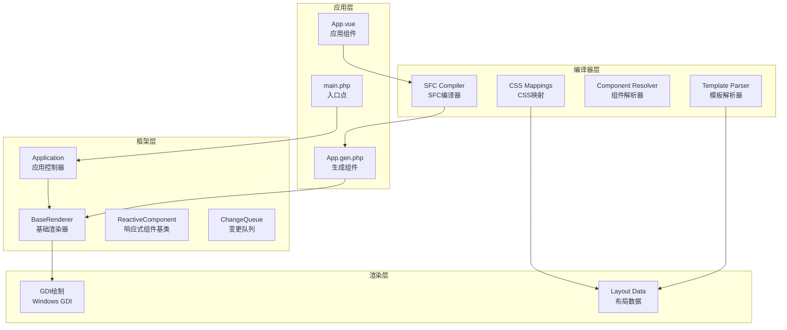
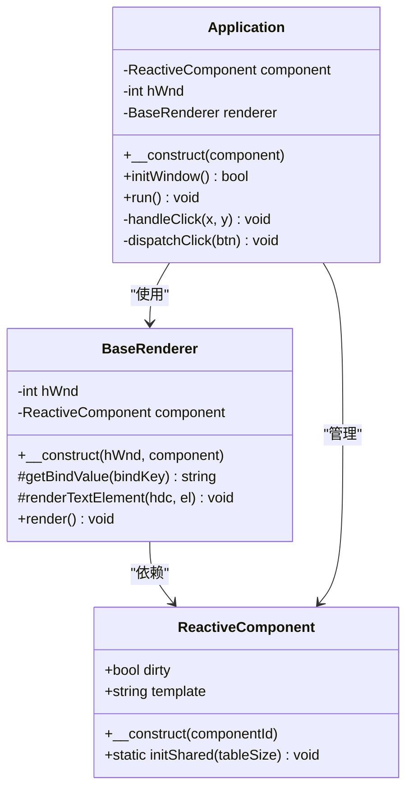
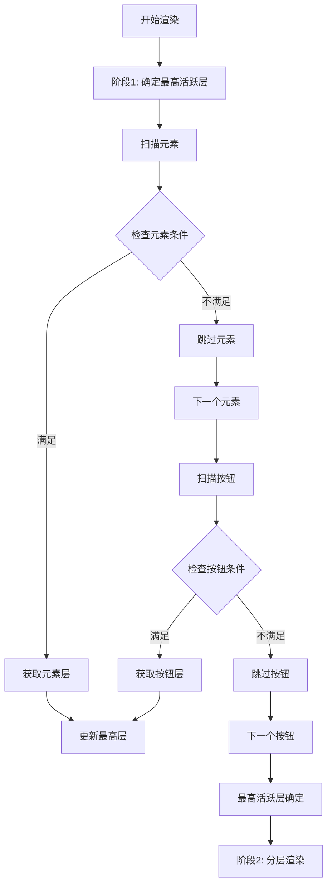
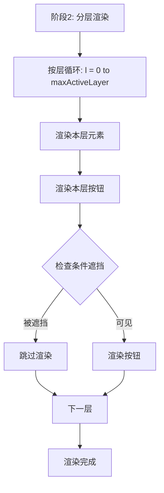
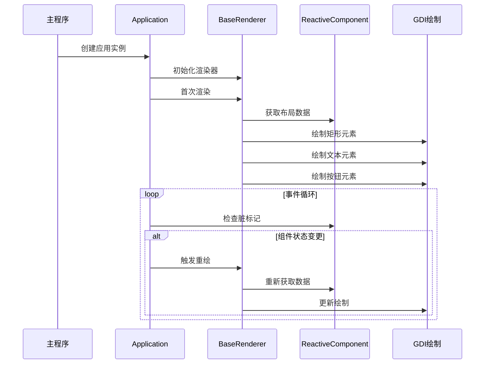
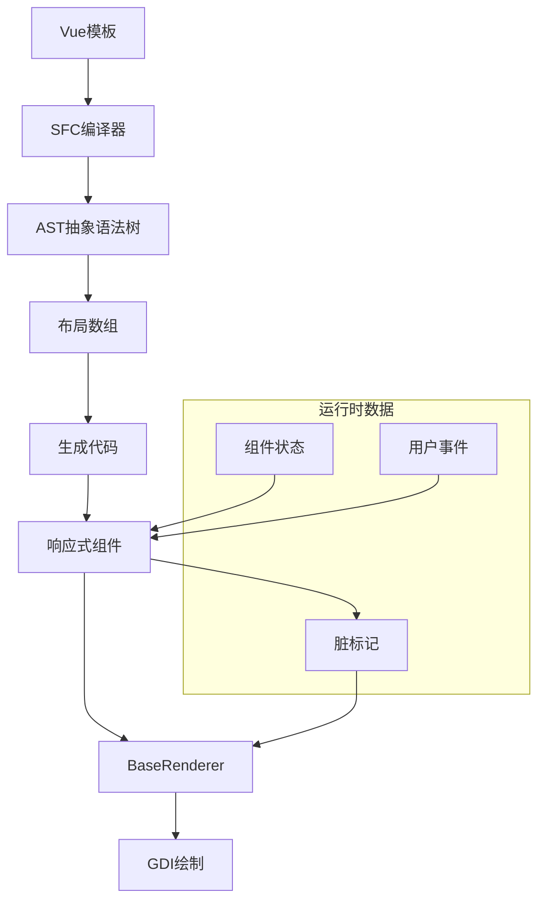
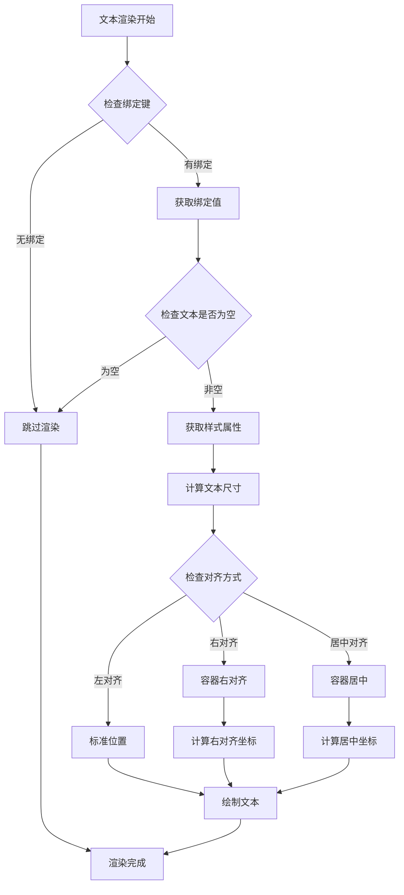
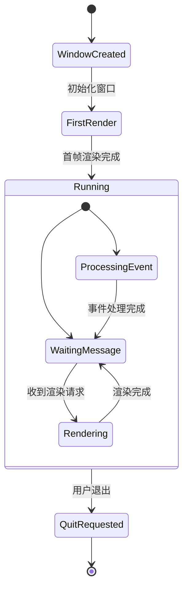
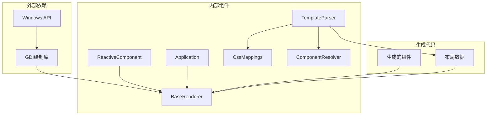
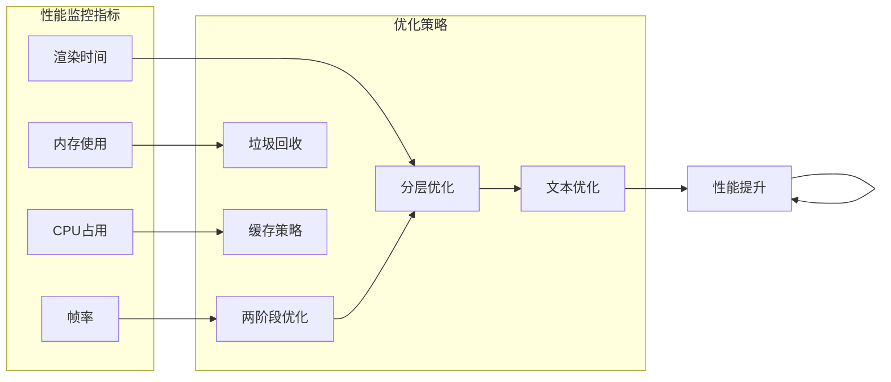

# BaseRenderer基础渲染器

<cite>
**本文档引用的文件**
- [BaseRenderer.php](file://framework/BaseRenderer.php)
- [Application.php](file://apps/calculator/Application.php)
- [ReactiveComponent.php](file://framework/ReactiveComponent.php)
- [sfc-compiler.php](file://framework/sfc-compiler.php)
- [template-parser.php](file://framework/compiler/template-parser.php)
- [ast-nodes.php](file://framework/compiler/ast-nodes.php)
- [css-mappings.php](file://framework/compiler/css-mappings.php)
- [component-resolver.php](file://framework/compiler/component-resolver.php)
- [App.gen.php](file://apps/calculator/gen/App.gen.php)
- [App.vue](file://apps/calculator/App.vue)
</cite>

## 更新摘要
**变更内容**
- 新增两阶段渲染算法的详细实现说明
- 更新最高活跃层确定机制的描述
- 增强分层渲染逻辑的技术细节
- 新增条件遮挡和Chrome按钮规则的解释
- 更新渲染流程图为两阶段架构

## 目录
1. [简介](#简介)
2. [项目结构概览](#项目结构概览)
3. [核心组件分析](#核心组件分析)
4. [架构总览](#架构总览)
5. [详细组件分析](#详细组件分析)
6. [依赖关系分析](#依赖关系分析)
7. [性能考虑](#性能考虑)
8. [故障排除指南](#故障排除指南)
9. [结论](#结论)

## 简介

BaseRenderer基础渲染器是VueCalc v5项目中的核心渲染组件，采用数据驱动的方式实现高性能的桌面应用程序渲染。该渲染器基于SFC（Single File Component）编译器生成的布局数据，通过GDI图形接口进行绘制，实现了从模板到最终渲染的完整数据流。

BaseRenderer的设计理念是"泛化数据驱动渲染"，它不绑定特定的组件类型，可以接受任意ReactiveComponent子类，支持框架的复用性和扩展性。该组件通过**两阶段分层渲染算法**，实现了复杂的UI层次管理和条件渲染功能。

**更新** 本次更新重点介绍了BaseRenderer的两阶段渲染算法，包括最高活跃层确定和分层渲染逻辑，这是VueCalc v5 M3版本的重要架构改进。

## 项目结构概览

VueCalc项目采用模块化的架构设计，主要分为以下几个层次：

**图表来源**
- [BaseRenderer.php:1-151](file://framework/BaseRenderer.php#L1-L151)
- [sfc-compiler.php:1-485](file://framework/sfc-compiler.php#L1-L485)
- [Application.php:1-139](file://apps/calculator/Application.php#L1-L139)

**章节来源**
- [BaseRenderer.php:1-151](file://framework/BaseRenderer.php#L1-L151)
- [sfc-compiler.php:1-485](file://framework/sfc-compiler.php#L1-L485)
- [Application.php:1-139](file://apps/calculator/Application.php#L1-L139)

## 核心组件分析

### BaseRenderer类结构

BaseRenderer是一个专门负责数据驱动渲染的类，其核心职责包括：

- **布局数据渲染**：根据编译器生成的布局数组进行绘制
- **条件渲染控制**：支持v-if条件的动态渲染
- **分层渲染管理**：实现多层UI元素的正确绘制顺序
- **文本渲染优化**：提供智能的文本对齐和动态字号调整

**图表来源**
- [BaseRenderer.php:9-151](file://framework/BaseRenderer.php#L9-L151)
- [ReactiveComponent.php:11-65](file://framework/ReactiveComponent.php#L11-L65)
- [Application.php:10-139](file://apps/calculator/Application.php#L10-L139)

### 两阶段渲染算法详解

**更新** BaseRenderer实现了先进的两阶段渲染算法，彻底改变了传统的单一循环渲染方式。这一算法通过明确的阶段划分，确保了正确的z-order渲染和条件遮挡处理。

#### Phase 1：最高活跃层确定

在第一阶段，渲染器扫描所有元素和按钮，确定当前场景中的最高活跃层：

**图表来源**
- [BaseRenderer.php:100-111](file://framework/BaseRenderer.php#L100-L111)

#### Phase 2：分层渲染

在第二阶段，渲染器按层进行渲染，确保每层内元素和按钮的正确绘制顺序：

**图表来源**
- [BaseRenderer.php:113-146](file://framework/BaseRenderer.php#L113-L146)

#### 条件遮挡机制

**更新** 新增的条件遮挡机制确保了正确的UI层次管理：

- **低层条件按钮被高层遮挡**：当按钮位于较低层且具有条件时，会被更高层的元素或按钮遮挡
- **Chrome按钮规则**：无条件的按钮（Chrome按钮）不受层遮挡影响，始终可点击
- **条件按钮的特殊处理**：仅在最高活跃层渲染有条件按钮

**章节来源**
- [BaseRenderer.php:113-146](file://framework/BaseRenderer.php#L113-L146)
- [Application.php:100-131](file://apps/calculator/Application.php#L100-L131)

## 架构总览

VueCalc的整体架构体现了现代前端工程的最佳实践，通过编译时优化和运行时高效渲染的结合，实现了高性能的桌面应用。

**图表来源**
- [Application.php:43-98](file://apps/calculator/Application.php#L43-L98)
- [BaseRenderer.php:88-149](file://framework/BaseRenderer.php#L88-L149)

### 数据流架构

**图表来源**
- [sfc-compiler.php:298-341](file://framework/sfc-compiler.php#L298-L341)
- [template-parser.php:557-683](file://framework/compiler/template-parser.php#L557-L683)

## 详细组件分析

### BaseRenderer渲染器实现

BaseRenderer的核心实现包含以下关键功能：

#### 文本元素渲染

文本渲染是BaseRenderer的重要组成部分，支持多种渲染特性：

- **绑定值获取**：通过委托机制从组件获取动态数据
- **对齐方式支持**：左对齐、右对齐和居中对齐的智能计算
- **动态字号调整**：根据文本长度自动调整字体大小
- **容器约束**：支持容器宽度限制的精确对齐

**图表来源**
- [BaseRenderer.php:27-83](file://framework/BaseRenderer.php#L27-L83)

#### 两阶段渲染机制

**更新** BaseRenderer实现了复杂的两阶段渲染系统，支持多层UI元素的正确显示顺序：

##### 阶段1：最高活跃层确定

- **元素扫描**：遍历所有元素，检查条件表达式
- **层计算**：提取元素的layer属性，确定最大值
- **按钮扫描**：遍历所有按钮，检查条件表达式
- **最终确定**：取元素和按钮的最大层值作为最高活跃层

##### 阶段2：分层渲染

- **层级遍历**：从0到最高活跃层进行循环
- **元素渲染**：每层内先渲染所有元素
- **按钮渲染**：每层内渲染按钮，应用条件遮挡规则
- **Chrome按钮**：无条件按钮不受层遮挡影响

**章节来源**
- [BaseRenderer.php:88-149](file://framework/BaseRenderer.php#L88-L149)

### 编译器集成

BaseRenderer与SFC编译器的深度集成体现在多个方面：

#### 布局数据生成

编译器将Vue模板转换为高效的布局数组，包含以下信息：

- **元素属性**：位置、尺寸、颜色等
- **绑定键**：动态数据绑定的标识符
- **条件表达式**：v-if条件的结构化表示
- **事件处理器**：按钮点击事件的映射
- **层信息**：z-order渲染的层级标识

#### 条件渲染系统

编译器支持多种条件渲染模式：

- **真值检查**：属性存在且非空
- **假值检查**：属性不存在或为空
- **相等比较**：属性值与指定值的比较
- **不等比较**：属性值与指定值的不等比较

**章节来源**
- [template-parser.php:762-778](file://framework/compiler/template-parser.php#L762-L778)
- [sfc-compiler.php:383-421](file://framework/sfc-compiler.php#L383-L421)

### 应用控制器协作

BaseRenderer与Application控制器紧密协作，实现完整的应用生命周期管理：

**图表来源**
- [Application.php:43-98](file://apps/calculator/Application.php#L43-L98)

**章节来源**
- [Application.php:100-138](file://apps/calculator/Application.php#L100-L138)

## 依赖关系分析

### 组件间依赖关系

**图表来源**
- [BaseRenderer.php:1-151](file://framework/BaseRenderer.php#L1-L151)
- [Application.php:1-139](file://apps/calculator/Application.php#L1-L139)
- [template-parser.php:1-866](file://framework/compiler/template-parser.php#L1-L866)

### 关键依赖特性

#### 低耦合设计

BaseRenderer通过接口抽象实现了良好的解耦：

- **组件接口**：通过ReactiveComponent接口访问组件状态
- **布局接口**：通过函数调用获取布局数据
- **绘制接口**：通过GDI函数进行图形绘制

#### 可扩展性

渲染器支持多种扩展方式：

- **自定义组件**：任何ReactiveComponent子类都可以使用
- **样式扩展**：通过CSS映射支持新的样式属性
- **渲染扩展**：可以通过继承BaseRenderer添加新功能

**章节来源**
- [BaseRenderer.php:14-18](file://framework/BaseRenderer.php#L14-L18)
- [css-mappings.php:27-69](file://framework/compiler/css-mappings.php#L27-L69)

## 性能考虑

### 渲染性能优化

**更新** 两阶段渲染算法带来了显著的性能优化：

#### 阶段化处理优化

- **预计算最高活跃层**：在渲染前一次性计算，避免重复遍历
- **条件短路**：跳过不满足条件的元素和按钮，减少无效渲染
- **层内批处理**：同层元素和按钮的批量处理，提高缓存效率

#### 内存管理

- **静态布局数据**：布局数组在编译时生成，运行时只读
- **最小化对象创建**：避免在渲染循环中创建临时对象
- **资源复用**：GDI上下文在窗口生命周期内复用

#### 文本渲染优化

- **动态字号调整**：根据文本长度自动调整字体大小，避免溢出
- **右对齐计算**：精确的容器宽度计算，确保文本对齐效果
- **字符宽度估算**：使用线性估算提高计算效率

### 运行时性能监控

**图表来源**
- [Application.php:94-95](file://apps/calculator/Application.php#L94-L95)

## 故障排除指南

### 常见问题诊断

#### 渲染异常

**问题现象**：界面不显示或显示异常

**可能原因**：
- 布局数据生成错误
- 组件状态未正确更新
- GDI绘制失败

**解决步骤**：
1. 检查生成的布局数据格式
2. 验证组件状态的脏标记设置
3. 确认GDI上下文创建成功

#### 文本渲染问题

**问题现象**：文本显示不正确或位置错误

**可能原因**：
- 绑定键配置错误
- 容器宽度计算错误
- 字体大小设置不当

**解决步骤**：
1. 验证`:bind`属性配置
2. 检查容器属性设置
3. 调整字体大小参数

#### 事件处理问题

**问题现象**：按钮点击无响应

**可能原因**：
- 事件处理器映射错误
- 条件遮挡导致按钮不可见
- 坐标计算错误

**解决步骤**：
1. 检查`@click`处理器配置
2. 验证v-if条件设置
3. 确认按钮坐标计算

#### 两阶段渲染问题

**更新** 新增两阶段渲染相关问题的诊断：

**问题现象**：元素和按钮的显示顺序不正确

**可能原因**：
- 层级设置错误
- 条件遮挡逻辑问题
- 渲染顺序不正确

**解决步骤**：
1. 检查元素和按钮的layer属性
2. 验证条件遮挡设置
3. 确认两阶段渲染逻辑
4. 检查最高活跃层计算

**章节来源**
- [BaseRenderer.php:21-24](file://framework/BaseRenderer.php#L21-L24)
- [Application.php:100-131](file://apps/calculator/Application.php#L100-L131)

### 调试技巧

#### 日志记录

建议在关键位置添加调试日志：

- 渲染开始和结束时间
- 布局数据统计信息
- 错误处理和异常信息

#### 性能分析

使用性能分析工具监控：

- 渲染循环执行时间
- 内存分配情况
- GDI调用频率

## 结论

BaseRenderer基础渲染器作为VueCalc v5项目的核心组件，展现了现代前端工程在桌面应用领域的创新实践。通过数据驱动的渲染理念、编译时优化和运行时高效执行的结合，实现了高性能、可维护的桌面应用程序架构。

**更新** 本次两阶段渲染算法的引入进一步增强了渲染器的功能性和正确性。通过明确的阶段划分，BaseRenderer实现了：

1. **最高活跃层确定**：准确识别当前场景中的最高活跃层
2. **分层渲染管理**：确保每层内元素和按钮的正确绘制顺序
3. **条件遮挡处理**：实现正确的UI层次管理和遮挡逻辑
4. **Chrome按钮支持**：无条件按钮不受层遮挡影响

该渲染器的主要优势包括：

1. **高度可复用性**：不绑定特定组件类型，支持框架复用
2. **强大的条件渲染**：支持复杂的v-if条件和多层遮挡
3. **性能优化**：两阶段渲染和智能缓存策略
4. **z-order保证**：两阶段算法确保正确的绘制顺序
5. **易于扩展**：清晰的接口设计和模块化架构

未来的发展方向可能包括：

- 支持更多渲染后端（Direct2D等）
- 增强动画和过渡效果
- 优化大屏幕和高DPI显示支持
- 扩展到WebAssembly等新平台

通过BaseRenderer的设计和实现，VueCalc项目为桌面应用开发提供了一个优秀的参考范例，展示了如何将现代前端技术应用于传统桌面应用开发领域。