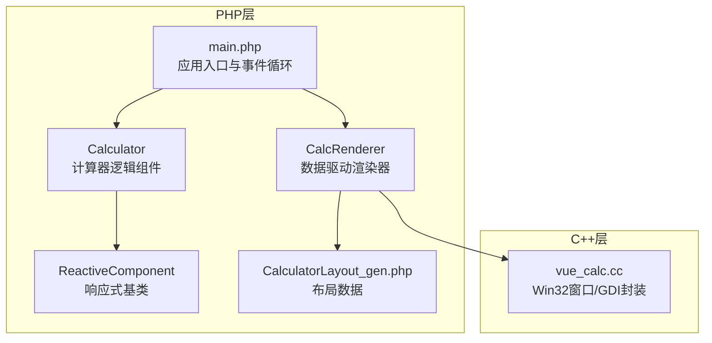
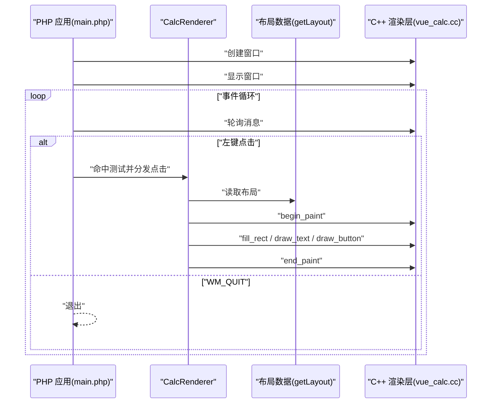
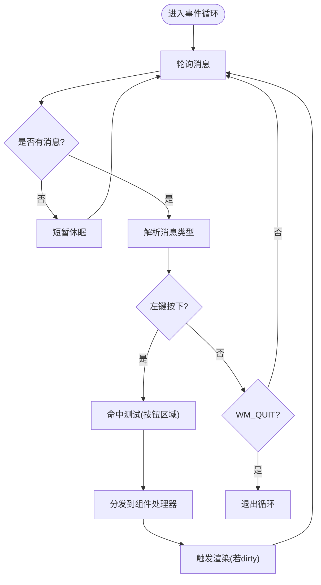
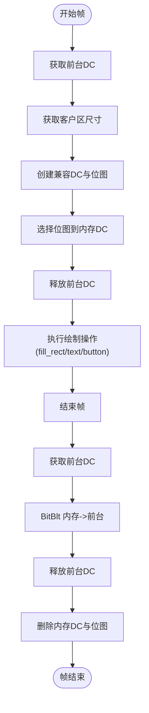
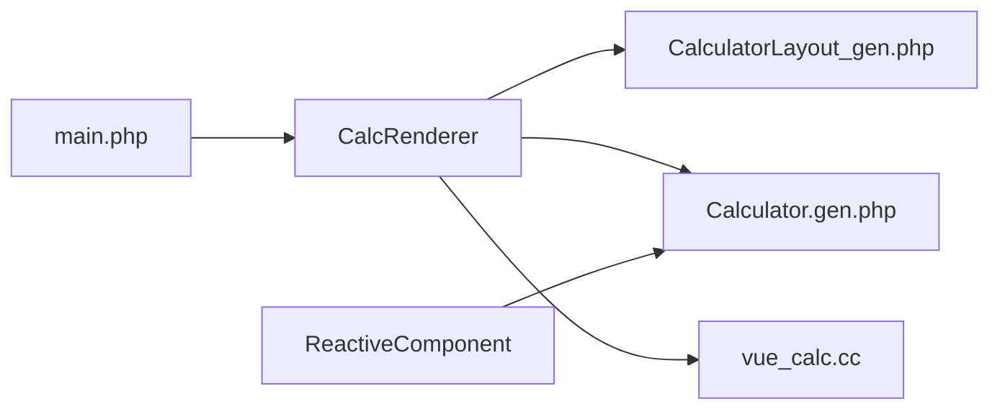
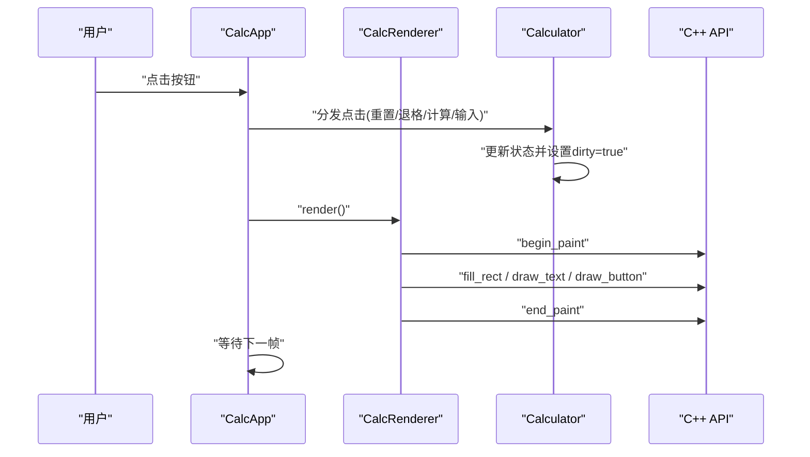

# C++渲染层

<cite>
**本文引用的文件**
- [cpp-src/vue_calc.cc](file://cpp-src/vue_calc.cc)
- [php-src/vue_calc.stub.php](file://php-src/vue_calc.stub.php)
- [main.php](file://main.php)
- [src/Calculator.gen.php](file://src/Calculator.gen.php)
- [src/CalculatorLayout_gen.php](file://src/CalculatorLayout_gen.php)
- [src/ReactiveComponent.php](file://src/ReactiveComponent.php)
- [project.yml](file://project.yml)
</cite>

## 目录
1. [简介](#简介)
2. [项目结构](#项目结构)
3. [核心组件](#核心组件)
4. [架构总览](#架构总览)
5. [详细组件分析](#详细组件分析)
6. [依赖关系分析](#依赖关系分析)
7. [性能考量](#性能考量)
8. [故障排查指南](#故障排查指南)
9. [结论](#结论)
10. [附录](#附录)

## 简介
本文件为“VueCalc”项目C++渲染层的技术文档，聚焦于cpp-src/vue_calc.cc的实现，涵盖：
- Win32 API封装与窗口管理
- GDI绘制原语（文本、矩形、按钮）
- 双缓冲绘制技术（vue_begin_paint/vue_end_paint）
- 字体处理、颜色管理、坐标系统
- C++与PHP之间的接口规范
- 性能优化与调试建议

该渲染层采用“薄封装”策略，将Win32 API与GDI能力暴露给PHP侧，由PHP端负责业务逻辑与响应式状态管理，C++层专注窗口与绘制。

## 项目结构
项目采用分层设计：
- C++层：仅提供Win32窗口与GDI绘制原语（cpp-src/vue_calc.cc）
- PHP层：包含主程序入口、响应式组件、渲染器、布局数据生成等（main.php、src/*.php）
- 接口声明：PHP侧通过stub文件声明C++导出函数（php-src/vue_calc.stub.php）

图表来源
- [main.php:1-291](file://main.php#L1-L291)
- [src/Calculator.gen.php:1-174](file://src/Calculator.gen.php#L1-L174)
- [src/CalculatorLayout_gen.php:1-296](file://src/CalculatorLayout_gen.php#L1-L296)
- [src/ReactiveComponent.php:1-35](file://src/ReactiveComponent.php#L1-L35)
- [cpp-src/vue_calc.cc:1-157](file://cpp-src/vue_calc.cc#L1-L157)

章节来源
- [project.yml:1-10](file://project.yml#L1-L10)
- [main.php:1-291](file://main.php#L1-L291)

## 核心组件
- 窗口管理模块
  - 窗口创建：php_vue_window_create
  - 窗口显示：php_vue_window_show
  - 消息轮询：php_vue_peek_message
  - 退出检测：php_vue_quit_requested
- GDI绘制原语模块
  - 双缓冲：php_vue_begin_paint、php_vue_end_paint
  - 填充矩形：php_vue_fill_rect
  - 绘制文本：php_vue_draw_text
  - 绘制按钮：php_vue_draw_button

章节来源
- [cpp-src/vue_calc.cc:36-84](file://cpp-src/vue_calc.cc#L36-L84)
- [cpp-src/vue_calc.cc:91-156](file://cpp-src/vue_calc.cc#L91-L156)

## 架构总览
C++渲染层作为“薄封装”的底层图形抽象，向上提供稳定、简洁的API；PHP层基于SFC生成的布局数据与组件状态，驱动C++完成绘制与交互。

图表来源
- [main.php:171-227](file://main.php#L171-L227)
- [main.php:99-132](file://main.php#L99-L132)
- [src/CalculatorLayout_gen.php:10-296](file://src/CalculatorLayout_gen.php#L10-L296)
- [cpp-src/vue_calc.cc:91-156](file://cpp-src/vue_calc.cc#L91-L156)

## 详细组件分析

### 窗口管理与消息循环
- 窗口过程回调：处理关闭与销毁消息，设置全局退出标志并退出消息循环
- 窗口创建：注册类、创建窗口、返回句柄
- 显示窗口：调用ShowWindow
- 消息轮询：PeekMessage包装，返回消息数组并派发
- 退出检测：查询全局退出标志

图表来源
- [main.php:171-227](file://main.php#L171-L227)
- [cpp-src/vue_calc.cc:21-33](file://cpp-src/vue_calc.cc#L21-L33)
- [cpp-src/vue_calc.cc:69-84](file://cpp-src/vue_calc.cc#L69-L84)

章节来源
- [cpp-src/vue_calc.cc:19-84](file://cpp-src/vue_calc.cc#L19-L84)
- [main.php:171-227](file://main.php#L171-L227)

### 双缓冲绘制（防闪烁）
- 开始帧：获取客户区尺寸，创建兼容DC与位图，选择到内存DC，释放设备上下文
- 结束帧：获取客户区尺寸，获取前台DC，BitBlt将内存位图拷贝到前台，释放前台DC，删除内存DC与位图对象
- 使用场景：在渲染周期内先在内存DC绘制，最后一次性blit到屏幕，避免闪烁

图表来源
- [cpp-src/vue_calc.cc:91-117](file://cpp-src/vue_calc.cc#L91-L117)

章节来源
- [cpp-src/vue_calc.cc:91-117](file://cpp-src/vue_calc.cc#L91-L117)
- [main.php:99-132](file://main.php#L99-L132)

### 绘制原语

#### 填充矩形（rect）
- 参数：hdc、x、y、w、h、rgb颜色
- 实现要点：创建纯色画刷，填充矩形，释放画刷

章节来源
- [cpp-src/vue_calc.cc:120-125](file://cpp-src/vue_calc.cc#L120-L125)

#### 绘制文本（text）
- 参数：hdc、x、y、text、fontSize、rgb颜色、bold（0/1）
- 实现要点：设置文本颜色与透明背景，按字号、粗细、字体创建字体，输出文本，恢复旧字体并释放

章节来源
- [cpp-src/vue_calc.cc:127-139](file://cpp-src/vue_calc.cc#L127-L139)

#### 绘制按钮（button）
- 参数：hdc、x、y、w、h、bgColor、borderColor
- 实现要点：先填充背景，再绘制边框（无填充），最后恢复旧画笔/画刷并释放

章节来源
- [cpp-src/vue_calc.cc:141-156](file://cpp-src/vue_calc.cc#L141-L156)

### 字体处理与坐标系统
- 字体：使用CreateFont创建，字符集、质量、字体族等参数固定
- 坐标：GDI坐标系原点在左上角，x向右递增，y向下递增
- 文本对齐：右侧对齐通过容器宽度与字符宽度估算偏移实现

章节来源
- [cpp-src/vue_calc.cc:127-139](file://cpp-src/vue_calc.cc#L127-L139)
- [main.php:49-94](file://main.php#L49-L94)

### 颜色管理
- 颜色编码：RGB整型（例如0xFFFFFF为白色），传入GDI函数
- 使用示例：背景色、前景色、边框色均以整型传入

章节来源
- [src/CalculatorLayout_gen.php:10-296](file://src/CalculatorLayout_gen.php#L10-L296)
- [cpp-src/vue_calc.cc:120-156](file://cpp-src/vue_calc.cc#L120-L156)

### C++与PHP接口规范
- 命名约定：PHP侧函数以vue_开头，C++实现以php_vue_开头
- 窗口管理
  - vue_window_create(title, width, height) -> int
  - vue_window_show(hWnd, cmdShow) -> void
  - vue_quit_requested() -> bool
  - vue_peek_message() -> array
- 绘制原语
  - vue_begin_paint(hWnd) -> int
  - vue_end_paint(hWnd, hdc) -> void
  - vue_fill_rect(hdc, x, y, w, h, rgb) -> void
  - vue_draw_text(hdc, x, y, text, fontSize, rgb, bold) -> void
  - vue_draw_button(hdc, x, y, w, h, bg, border) -> void

章节来源
- [php-src/vue_calc.stub.php:12-23](file://php-src/vue_calc.stub.php#L12-L23)
- [cpp-src/vue_calc.cc:36-156](file://cpp-src/vue_calc.cc#L36-L156)

## 依赖关系分析
- C++层依赖
  - Windows.h：Win32 API与GDI
  - phpx.h：PHP扩展框架（用于导出函数与类型）
- PHP层依赖
  - ReactiveComponent：提供脏标记机制
  - SFC生成的布局数据：提供窗口尺寸与UI元素位置/样式
  - CalcRenderer：将布局与组件状态映射到C++绘制API

图表来源
- [main.php:1-291](file://main.php#L1-L291)
- [src/Calculator.gen.php:1-174](file://src/Calculator.gen.php#L1-L174)
- [src/CalculatorLayout_gen.php:1-296](file://src/CalculatorLayout_gen.php#L1-L296)
- [src/ReactiveComponent.php:1-35](file://src/ReactiveComponent.php#L1-L35)
- [cpp-src/vue_calc.cc:1-157](file://cpp-src/vue_calc.cc#L1-L157)

章节来源
- [main.php:1-291](file://main.php#L1-L291)
- [src/Calculator.gen.php:1-174](file://src/Calculator.gen.php#L1-L174)
- [src/CalculatorLayout_gen.php:1-296](file://src/CalculatorLayout_gen.php#L1-L296)
- [src/ReactiveComponent.php:1-35](file://src/ReactiveComponent.php#L1-L35)
- [cpp-src/vue_calc.cc:1-157](file://cpp-src/vue_calc.cc#L1-L157)

## 性能考量
- 双缓冲
  - 优点：避免闪烁，减少屏幕撕裂感
  - 注意：每次渲染结束后及时释放内存DC与位图，防止资源泄漏
- 文本渲染
  - 字体创建/切换成本较高，建议在渲染周期内尽量复用或减少频繁切换
  - 右对齐计算使用估算字符宽度，避免复杂度高的文本测量
- 事件循环
  - 使用usleep控制帧率，避免CPU占用过高
  - 仅在组件状态变更（dirty）时触发渲染，降低无效绘制
- 资源管理
  - 所有GDI对象（画笔、画刷、画笔、位图）均需成对创建/删除
  - DC获取与释放要成对出现，避免死锁或句柄泄漏

章节来源
- [cpp-src/vue_calc.cc:91-117](file://cpp-src/vue_calc.cc#L91-L117)
- [main.php:213-224](file://main.php#L213-L224)

## 故障排查指南
- 窗口无法创建
  - 检查窗口类注册与CreateWindowEx参数
  - 确认返回值非零
- 绘制无输出
  - 确认在begin_paint/end_paint之间进行绘制
  - 检查hdc有效性与坐标范围
- 文本不显示
  - 检查字体创建与选择/恢复流程
  - 确认颜色与背景模式设置正确
- 资源泄漏
  - 确保每个CreateObject都有对应的DeleteObject
  - 确保DeleteDC/DeleteObject在ReleaseDC之后执行
- 事件未响应
  - 检查消息轮询与DispatchMessage链路
  - 确认左键点击坐标转换与命中测试逻辑

章节来源
- [cpp-src/vue_calc.cc:36-84](file://cpp-src/vue_calc.cc#L36-L84)
- [cpp-src/vue_calc.cc:91-156](file://cpp-src/vue_calc.cc#L91-L156)
- [main.php:171-227](file://main.php#L171-L227)

## 结论
本渲染层以“薄封装”为核心理念，将Win32窗口与GDI绘制能力暴露给PHP侧，配合SFC生成的布局数据与响应式组件，实现了数据驱动的桌面计算器渲染方案。通过双缓冲、资源管理与事件循环优化，兼顾了性能与可维护性。后续可在字体缓存、批量绘制、更丰富的GDI原语等方面进一步扩展。

## 附录

### 关键流程：渲染与交互

图表来源
- [main.php:229-258](file://main.php#L229-L258)
- [main.php:99-132](file://main.php#L99-L132)
- [src/Calculator.gen.php:149-168](file://src/Calculator.gen.php#L149-L168)
- [cpp-src/vue_calc.cc:91-156](file://cpp-src/vue_calc.cc#L91-L156)