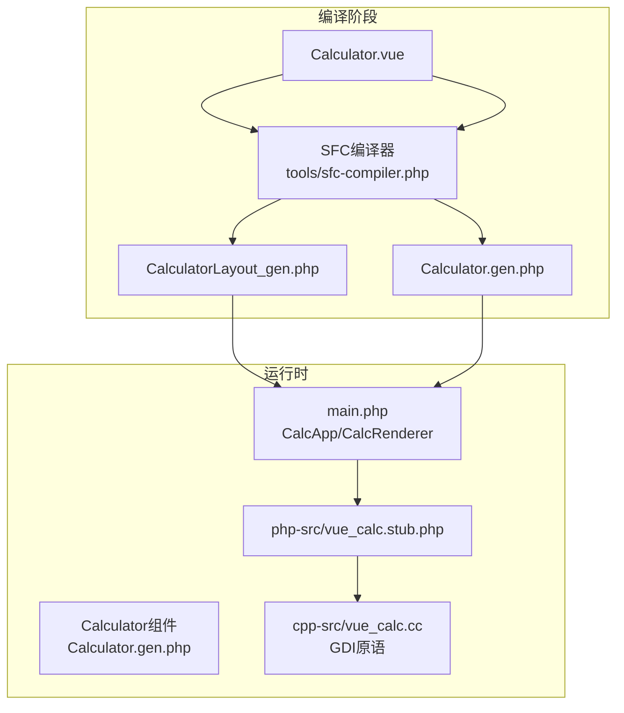
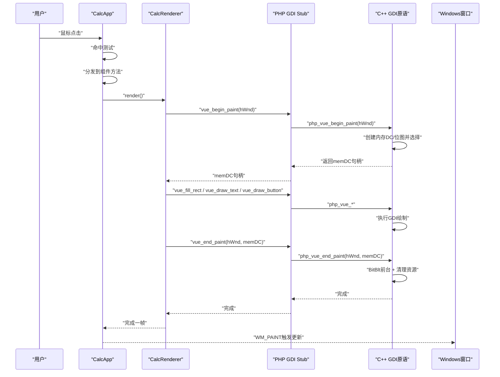
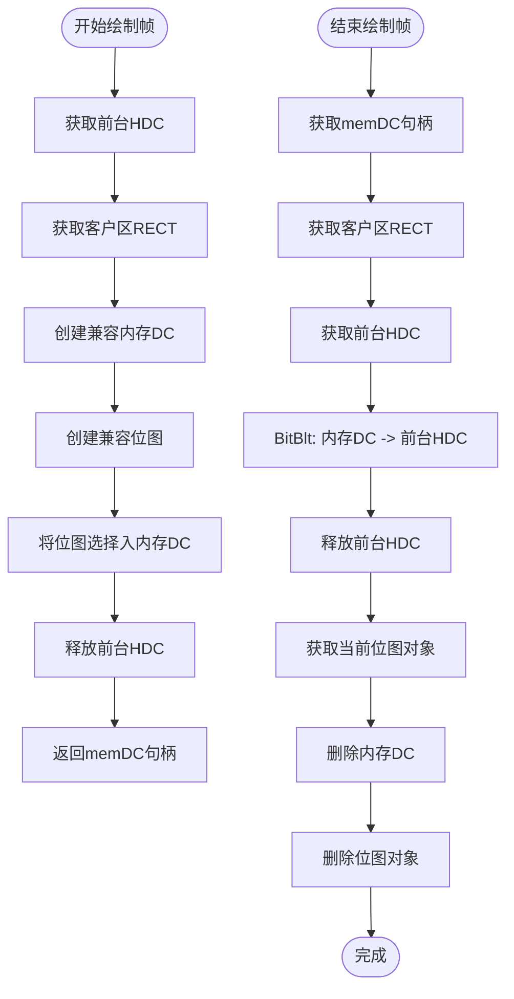
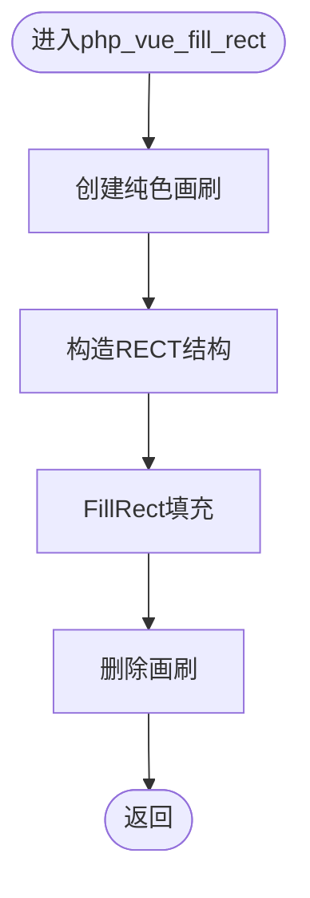
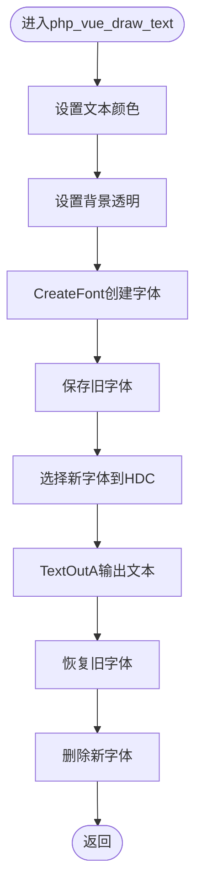
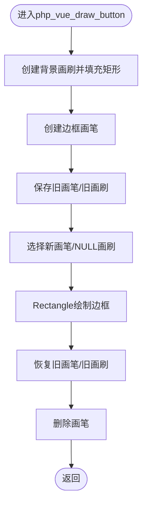
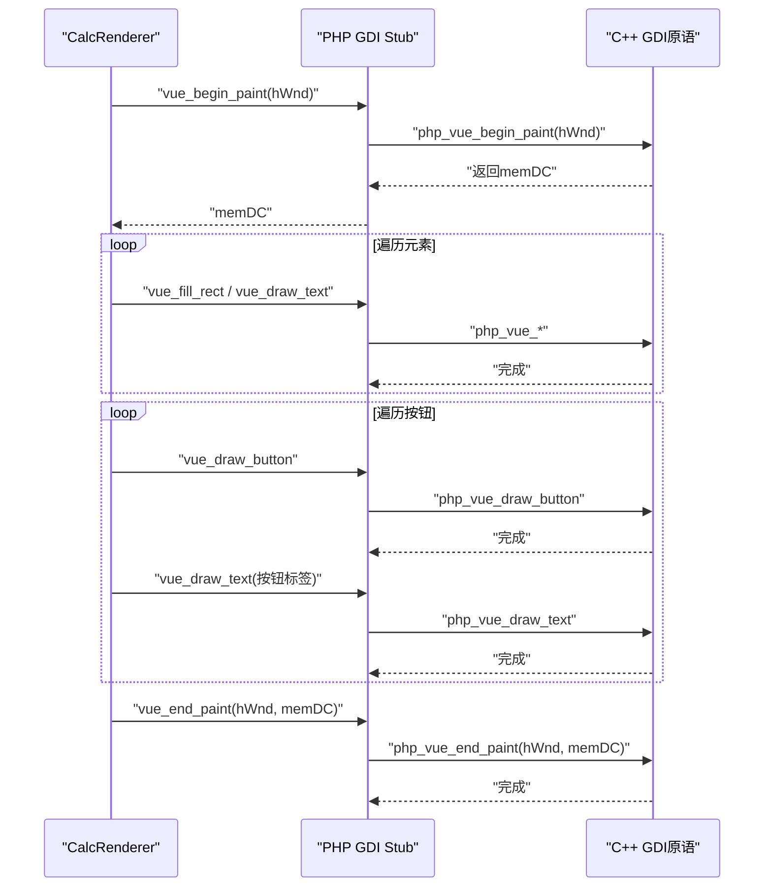
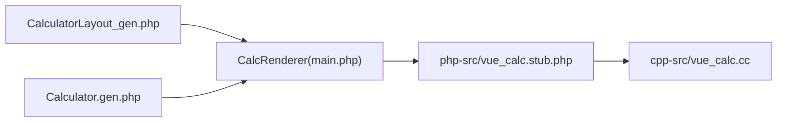

# GDI绘制原语

<cite>
**本文引用的文件**
- [cpp-src/vue_calc.cc](file://cpp-src/vue_calc.cc)
- [php-src/vue_calc.stub.php](file://php-src/vue_calc.stub.php)
- [main.php](file://main.php)
- [src/Calculator.gen.php](file://src/Calculator.gen.php)
- [src/Calculator.vue](file://src/Calculator.vue)
- [src/CalculatorLayout_gen.php](file://src/CalculatorLayout_gen.php)
- [tools/sfc-compiler.php](file://tools/sfc-compiler.php)
- [project.yml](file://project.yml)
</cite>

## 目录
1. [简介](#简介)
2. [项目结构](#项目结构)
3. [核心组件](#核心组件)
4. [架构总览](#架构总览)
5. [详细组件分析](#详细组件分析)
6. [依赖关系分析](#依赖关系分析)
7. [性能考虑](#性能考虑)
8. [故障排查指南](#故障排查指南)
9. [结论](#结论)
10. [附录](#附录)

## 简介
本技术文档聚焦于GDI绘制原语的实现与使用，围绕双缓冲渲染、矩形填充、文本绘制、按钮绘制等核心功能展开。重点解析以下方面：
- 双缓冲技术：php_vue_begin_paint的内存设备上下文与位图创建、选择与释放；php_vue_end_paint的后台缓冲到前台的blit操作与资源回收。
- 绘制函数实现：php_vue_fill_rect的矩形填充算法、php_vue_draw_text的文本绘制流程（字体创建与颜色设置）、php_vue_draw_button的按钮绘制（背景填充与边框绘制）。
- 技术细节：颜色管理（RGB整型）、坐标系统（像素坐标）、字体处理（字号、粗细、透明背景）。
- 性能优化与调试建议：减少GDI对象创建频率、批量化绘制、避免闪烁、调试技巧与常见问题定位。

## 项目结构
该项目采用“模板/样式编译 + PHP逻辑 + C++ GDI原语”的分层架构：
- 模板与样式：通过SFC编译器将.vue转换为布局数组与组件类文件。
- PHP逻辑：响应式组件负责业务状态与交互，渲染器负责将状态映射到GDI绘制调用。
- C++ GDI层：提供窗口与GDI绘制原语，封装Win32 API。

图表来源
- [tools/sfc-compiler.php:133-181](file://tools/sfc-compiler.php#L133-L181)
- [src/CalculatorLayout_gen.php:10-296](file://src/CalculatorLayout_gen.php#L10-L296)
- [src/Calculator.gen.php:1-174](file://src/Calculator.gen.php#L1-L174)
- [main.php:26-133](file://main.php#L26-L133)
- [php-src/vue_calc.stub.php:12-24](file://php-src/vue_calc.stub.php#L12-L24)
- [cpp-src/vue_calc.cc:35-157](file://cpp-src/vue_calc.cc#L35-L157)

章节来源
- [project.yml:1-10](file://project.yml#L1-L10)
- [tools/sfc-compiler.php:1-210](file://tools/sfc-compiler.php#L1-L210)
- [src/CalculatorLayout_gen.php:10-296](file://src/CalculatorLayout_gen.php#L10-L296)
- [main.php:26-133](file://main.php#L26-L133)
- [php-src/vue_calc.stub.php:12-24](file://php-src/vue_calc.stub.php#L12-L24)
- [cpp-src/vue_calc.cc:35-157](file://cpp-src/vue_calc.cc#L35-L157)

## 核心组件
- C++ GDI原语层（cpp-src/vue_calc.cc）
  - 窗口管理：创建窗口、显示窗口、消息轮询、退出检测。
  - 双缓冲：开始绘制帧（创建内存DC与位图并选择）、结束绘制帧（前台blit与资源清理）。
  - 绘制函数：矩形填充、文本绘制、按钮绘制。
- PHP渲染层（main.php）
  - CalcRenderer：遍历布局元素与按钮，调用GDI原语进行绘制。
  - CalcApp：主事件循环、消息处理、点击命中测试、触发组件方法。
- 组件与布局（src/Calculator.gen.php、src/CalculatorLayout_gen.php）
  - 组件类：包含计算器业务逻辑与状态。
  - 布局数组：包含元素与按钮的几何信息与样式属性。
- SFC编译器（tools/sfc-compiler.php）
  - 解析.vue，生成布局数组与组件类文件。

章节来源
- [cpp-src/vue_calc.cc:35-157](file://cpp-src/vue_calc.cc#L35-L157)
- [main.php:26-133](file://main.php#L26-L133)
- [src/Calculator.gen.php:1-174](file://src/Calculator.gen.php#L1-L174)
- [src/CalculatorLayout_gen.php:10-296](file://src/CalculatorLayout_gen.php#L10-L296)
- [tools/sfc-compiler.php:133-181](file://tools/sfc-compiler.php#L133-L181)

## 架构总览
下图展示了从用户交互到最终GDI绘制的端到端流程。

图表来源
- [main.php:171-227](file://main.php#L171-L227)
- [main.php:99-133](file://main.php#L99-L133)
- [cpp-src/vue_calc.cc:90-117](file://cpp-src/vue_calc.cc#L90-L117)
- [php-src/vue_calc.stub.php:18-24](file://php-src/vue_calc.stub.php#L18-L24)

## 详细组件分析

### 双缓冲实现（Begin/End Paint）
- php_vue_begin_paint
  - 获取前台HDC，查询客户区尺寸。
  - 创建兼容DC与兼容位图，并将位图选择入内存DC。
  - 释放前台HDC，返回内存DC句柄供绘制使用。
- php_vue_end_paint
  - 获取前台HDC，执行BitBlt将内存DC内容复制到前台。
  - 释放前台HDC。
  - 获取当前选入的位图对象句柄，删除内存DC与位图对象，确保资源回收。

图表来源
- [cpp-src/vue_calc.cc:90-117](file://cpp-src/vue_calc.cc#L90-L117)

章节来源
- [cpp-src/vue_calc.cc:90-117](file://cpp-src/vue_calc.cc#L90-L117)

### 矩形填充（php_vue_fill_rect）
- 参数：HDC、矩形位置(x,y)与尺寸(w,h)、RGB颜色。
- 实现要点：
  - 使用纯色画刷（CreateSolidBrush）创建画刷。
  - 定义RECT并调用FillRect填充。
  - 删除画刷对象，避免资源泄漏。
- 复杂度：O(1)，按像素填充，受窗口大小影响。

图表来源
- [cpp-src/vue_calc.cc:119-125](file://cpp-src/vue_calc.cc#L119-L125)

章节来源
- [cpp-src/vue_calc.cc:119-125](file://cpp-src/vue_calc.cc#L119-L125)

### 文本绘制（php_vue_draw_text）
- 参数：HDC、位置(x,y)、文本字符串、字号、RGB颜色、是否粗体。
- 实现要点：
  - 设置文本颜色（SetTextColor），背景模式设为透明（SetBkMode）。
  - 使用CreateFont创建字体（字号、粗细、字符集、质量等参数）。
  - 选择字体到HDC，调用TextOutA输出文本。
  - 恢复旧字体并删除新建字体，保证状态一致性。
- 字体与颜色：
  - 颜色以RGB整型传入，直接用于SetTextColor与CreateSolidBrush等。
  - 字号为整型像素值，用于CreateFont。
  - 粗细通过FW_BOLD/FW_NORMAL控制。
- 复杂度：O(n)，n为文本长度。

图表来源
- [cpp-src/vue_calc.cc:127-139](file://cpp-src/vue_calc.cc#L127-L139)

章节来源
- [cpp-src/vue_calc.cc:127-139](file://cpp-src/vue_calc.cc#L127-L139)

### 按钮绘制（php_vue_draw_button）
- 参数：HDC、按钮位置(x,y)与尺寸(w,h)、背景色、边框色。
- 实现要点：
  - 先用背景色画刷填充矩形区域（FillRect）。
  - 创建实线画笔（CreatePen），选择NULL画刷（无填充）与实线画笔绘制矩形边框（Rectangle）。
  - 恢复旧画笔与旧画刷，删除新建画笔，避免状态污染与资源泄漏。
- 复杂度：O(1)，固定四条线段与一次填充。

图表来源
- [cpp-src/vue_calc.cc:141-156](file://cpp-src/vue_calc.cc#L141-L156)

章节来源
- [cpp-src/vue_calc.cc:141-156](file://cpp-src/vue_calc.cc#L141-L156)

### 渲染器与调用链（CalcRenderer）
- CalcRenderer.render
  - 调用vue_begin_paint获取memDC。
  - 遍历布局元素：rect背景与text文本。
  - 遍历按钮：先绘制背景与边框，再在中心绘制标签文本。
  - 调用vue_end_paint完成blit与资源清理。
- 文本对齐与动态字号
  - 支持左对齐与右对齐（基于容器宽度与字符宽度估算）。
  - 长文本自动缩小字号，提升可读性。

图表来源
- [main.php:99-133](file://main.php#L99-L133)
- [cpp-src/vue_calc.cc:90-117](file://cpp-src/vue_calc.cc#L90-L117)
- [cpp-src/vue_calc.cc:119-156](file://cpp-src/vue_calc.cc#L119-L156)

章节来源
- [main.php:99-133](file://main.php#L99-L133)

### 坐标系统与颜色管理
- 坐标系统
  - 使用Win32客户区坐标系，原点位于左上角。
  - 绘制函数参数均为整型像素值。
- 颜色管理
  - 颜色以RGB整型传递，直接用于SetTextColor、CreateSolidBrush等。
  - 布局数组中的颜色值来自CSS类映射，经编译器转换为整型。
- 字体处理
  - 字号为整型像素值，粗细通过FW_BOLD/FW_NORMAL切换。
  - 字体名称固定为系统可用字体，字符集与质量默认配置。

章节来源
- [main.php:49-94](file://main.php#L49-L94)
- [src/CalculatorLayout_gen.php:10-296](file://src/CalculatorLayout_gen.php#L10-L296)
- [cpp-src/vue_calc.cc:127-139](file://cpp-src/vue_calc.cc#L127-L139)

## 依赖关系分析
- 组件耦合
  - CalcRenderer依赖布局数组与GDI stub函数，耦合度低，便于维护。
  - 组件类与渲染器解耦，组件只关注状态与逻辑。
- 外部依赖
  - Win32 GDI API：HDC、HBITMAP、HFONT、HPEN、HBRUSH等。
  - SFC编译器：将.vue转换为布局数组与组件类文件。
- 循环依赖
  - 未发现循环依赖，模块职责清晰。

图表来源
- [src/CalculatorLayout_gen.php:10-296](file://src/CalculatorLayout_gen.php#L10-L296)
- [main.php:26-133](file://main.php#L26-L133)
- [php-src/vue_calc.stub.php:12-24](file://php-src/vue_calc.stub.php#L12-L24)
- [cpp-src/vue_calc.cc:35-157](file://cpp-src/vue_calc.cc#L35-L157)

章节来源
- [src/CalculatorLayout_gen.php:10-296](file://src/CalculatorLayout_gen.php#L10-L296)
- [main.php:26-133](file://main.php#L26-L133)
- [php-src/vue_calc.stub.php:12-24](file://php-src/vue_calc.stub.php#L12-L24)
- [cpp-src/vue_calc.cc:35-157](file://cpp-src/vue_calc.cc#L35-L157)

## 性能考虑
- 双缓冲
  - 使用内存DC与位图进行离屏绘制，避免闪烁，提高刷新效率。
- 资源管理
  - 每次绘制后及时删除GDI对象（画刷、画笔、字体、位图），防止资源泄漏。
- 批量化绘制
  - 合并相邻的矩形或文本绘制，减少状态切换与对象创建次数。
- 字体缓存
  - 若频繁使用相同字号/粗细，可在C++层缓存字体对象，避免重复创建。
- 文本渲染
  - 长文本自动缩放字号，减少溢出与重排成本。
- 事件循环
  - 控制帧率（如约60FPS），避免过度绘制导致CPU占用过高。

## 故障排查指南
- 绘制空白或闪烁
  - 检查是否正确调用begin_paint与end_paint，确保位图选择与BitBlt顺序正确。
  - 确认资源清理顺序：先DeleteObject位图，再DeleteDC。
- 文本不显示或乱码
  - 检查字体创建参数（字号、粗细、字符集）与颜色设置。
  - 确保背景模式为透明（TRANSPARENT），避免被背景覆盖。
- 按钮边框异常
  - 检查画笔创建与选择顺序，确保先选择NULL画刷再绘制矩形。
- 内存泄漏
  - 确保每个CreateSolidBrush/CreateFont/CreatePen都对应DeleteObject/DeleteDC。
- 点击无响应
  - 检查消息循环与命中测试逻辑，确认按钮坐标范围与点击坐标一致。

章节来源
- [cpp-src/vue_calc.cc:90-117](file://cpp-src/vue_calc.cc#L90-L117)
- [cpp-src/vue_calc.cc:119-156](file://cpp-src/vue_calc.cc#L119-L156)
- [main.php:171-227](file://main.php#L171-L227)

## 结论
本项目通过SFC编译器将Vue风格的模板/样式转换为布局数组与组件类，配合PHP渲染器与C++ GDI原语，实现了高效、可维护的数据驱动桌面应用。双缓冲技术有效避免了闪烁，绘制函数简洁明确，资源管理严格，具备良好的扩展性与可调试性。建议在实际工程中进一步引入字体缓存与批量绘制策略，以获得更佳的性能表现。

## 附录
- 函数声明与命名规范
  - PHP侧以vue_开头，C++实现以php_vue_开头，保持清晰的边界。
- 编译产物
  - 生成布局数组文件与组件类文件，供AOT编译与运行时使用。

章节来源
- [php-src/vue_calc.stub.php:12-24](file://php-src/vue_calc.stub.php#L12-L24)
- [tools/sfc-compiler.php:133-181](file://tools/sfc-compiler.php#L133-L181)
- [src/CalculatorLayout_gen.php:10-296](file://src/CalculatorLayout_gen.php#L10-L296)
- [src/Calculator.gen.php:1-174](file://src/Calculator.gen.php#L1-L174)