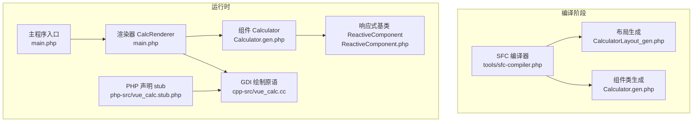
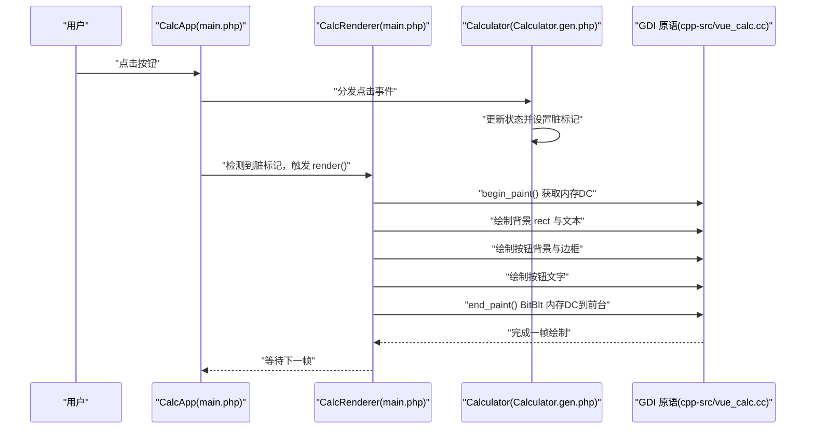
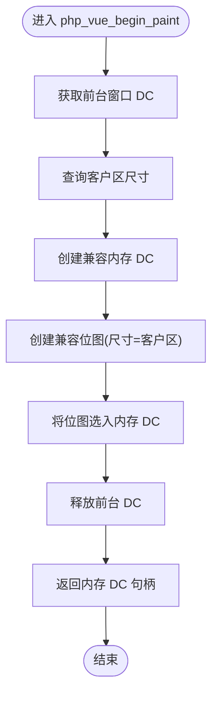
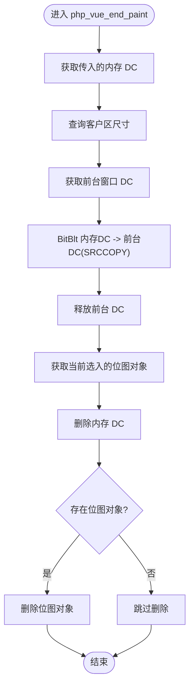
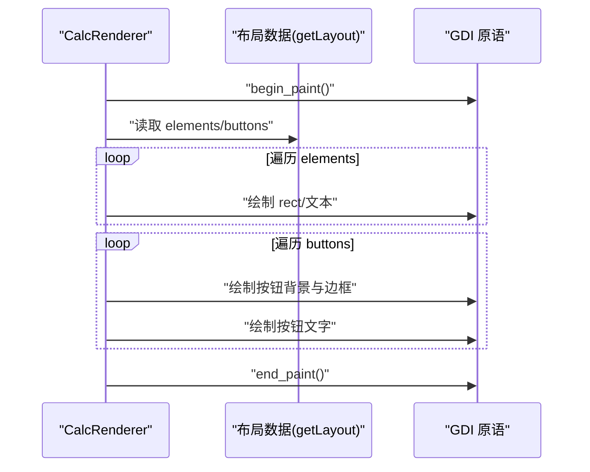
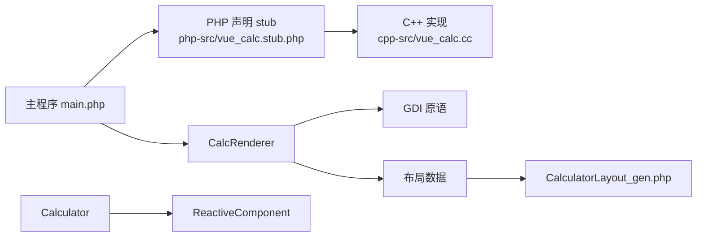

# 双缓冲系统

<cite>
**本文引用的文件**
- [cpp-src/vue_calc.cc](file://cpp-src/vue_calc.cc)
- [main.php](file://main.php)
- [src/Calculator.gen.php](file://src/Calculator.gen.php)
- [src/CalculatorLayout_gen.php](file://src/CalculatorLayout_gen.php)
- [src/ReactiveComponent.php](file://src/ReactiveComponent.php)
- [php-src/vue_calc.stub.php](file://php-src/vue_calc.stub.php)
- [tools/sfc-compiler.php](file://tools/sfc-compiler.php)
- [project.yml](file://project.yml)
</cite>

## 目录
1. [简介](#简介)
2. [项目结构](#项目结构)
3. [核心组件](#核心组件)
4. [架构总览](#架构总览)
5. [详细组件分析](#详细组件分析)
6. [依赖关系分析](#依赖关系分析)
7. [性能考量](#性能考量)
8. [故障排查指南](#故障排查指南)
9. [结论](#结论)
10. [附录](#附录)

## 简介
本技术文档聚焦于“双缓冲系统”的实现与优化，围绕两个关键的 Win32 GDI 绘制原语函数进行深入解析：
- php_vue_begin_paint：负责创建内存设备上下文（HDC）与兼容位图（HBITMAP），并将其选入内存 DC，为离屏绘制做准备。
- php_vue_end_paint：负责将内存缓冲区一次性 BitBlt 到前台窗口 DC，随后释放内存 DC 与位图资源，完成一帧绘制。

文档同时阐述双缓冲在避免闪烁方面的原理、在 Win32 GDI 中的具体实现细节，并给出最佳实践与常见问题的解决方案。

## 项目结构
该项目采用“SFC 编译器 + 数据驱动渲染”的架构模式：
- SFC 编译器将 .vue 组件编译为两份生成文件：布局数据与组件类。
- PHP 侧通过 CalcRenderer 驱动 C++ GDI 绘制原语，实现无闪烁的界面渲染。
- C++ 层仅提供薄封装的 Win32 API，保证与 AOT 编译器的兼容性。

图表来源
- [tools/sfc-compiler.php:132-210](file://tools/sfc-compiler.php#L132-L210)
- [main.php:26-133](file://main.php#L26-L133)
- [src/Calculator.gen.php:1-174](file://src/Calculator.gen.php#L1-L174)
- [src/CalculatorLayout_gen.php:1-296](file://src/CalculatorLayout_gen.php#L1-L296)
- [src/ReactiveComponent.php:1-35](file://src/ReactiveComponent.php#L1-L35)
- [cpp-src/vue_calc.cc:90-117](file://cpp-src/vue_calc.cc#L90-L117)
- [php-src/vue_calc.stub.php:12-24](file://php-src/vue_calc.stub.php#L12-L24)

章节来源
- [project.yml:1-10](file://project.yml#L1-L10)
- [tools/sfc-compiler.php:1-210](file://tools/sfc-compiler.php#L1-L210)
- [main.php:1-291](file://main.php#L1-L291)

## 核心组件
- 双缓冲绘制原语
  - php_vue_begin_paint：创建内存 DC 与兼容位图，选入位图，返回内存 DC 句柄，供离屏绘制使用。
  - php_vue_end_paint：将内存 DC 内容一次性 BitBlt 到前台窗口 DC，释放内存 DC 与位图，完成一帧。
- 渲染器 CalcRenderer：读取布局数据，遍历元素与按钮，调用 GDI 绘制原语完成整帧绘制。
- 组件 Calculator：维护显示状态与表达式，修改状态后设置脏标记，触发重绘。
- 响应式基类 ReactiveComponent：提供脏标记机制与共享变更队列初始化。

章节来源
- [cpp-src/vue_calc.cc:90-117](file://cpp-src/vue_calc.cc#L90-L117)
- [main.php:26-133](file://main.php#L26-L133)
- [src/Calculator.gen.php:1-174](file://src/Calculator.gen.php#L1-L174)
- [src/ReactiveComponent.php:1-35](file://src/ReactiveComponent.php#L1-L35)

## 架构总览
下图展示了从用户交互到渲染完成的端到端流程，重点体现双缓冲在避免闪烁中的作用。

图表来源
- [main.php:171-227](file://main.php#L171-L227)
- [main.php:99-132](file://main.php#L99-L132)
- [cpp-src/vue_calc.cc:90-117](file://cpp-src/vue_calc.cc#L90-L117)

## 详细组件分析

### 双缓冲绘制原语：php_vue_begin_paint
- 目标：为离屏绘制准备内存设备上下文与兼容位图。
- 关键步骤
  - 获取前台窗口 DC。
  - 查询客户区尺寸，创建兼容内存 DC。
  - 创建与客户区同尺寸的兼容位图。
  - 将位图选入内存 DC，确保后续绘制在内存缓冲区进行。
  - 释放前台 DC，返回内存 DC 句柄。
- 资源管理
  - 返回的内存 DC 由调用方持有，需在结束时调用 end_paint 进行清理。
- 性能要点
  - 仅在窗口尺寸变化或首次创建时重建位图，避免频繁分配。
  - 使用兼容 DC 与兼容位图，确保绘制效率与像素格式匹配。

图表来源
- [cpp-src/vue_calc.cc:90-102](file://cpp-src/vue_calc.cc#L90-L102)

章节来源
- [cpp-src/vue_calc.cc:90-102](file://cpp-src/vue_calc.cc#L90-L102)

### 双缓冲绘制原语：php_vue_end_paint
- 目标：将内存缓冲区一次性 BitBlt 到前台窗口，避免逐次绘制造成的闪烁。
- 关键步骤
  - 获取前台窗口 DC。
  - 使用 BitBlt 将内存 DC 的全部内容复制到前台 DC（SRCCOPY）。
  - 释放前台 DC。
  - 获取当前选入的位图对象句柄，删除内存 DC 与位图，完成资源回收。
- 错误处理
  - 若未选入位图，DeleteObject 将不会执行，避免误删。
- 性能要点
  - 一次 BitBlt 完成整帧提交，减少多次刷新带来的闪烁与抖动。
  - 合理释放资源，防止内存泄漏。

图表来源
- [cpp-src/vue_calc.cc:104-117](file://cpp-src/vue_calc.cc#L104-L117)

章节来源
- [cpp-src/vue_calc.cc:104-117](file://cpp-src/vue_calc.cc#L104-L117)

### 渲染器：CalcRenderer
- 角色：基于布局数据与组件状态，调用 GDI 绘制原语完成整帧绘制。
- 工作流程
  - 调用 begin_paint 获取内存 DC。
  - 遍历布局元素（rect 背景 + text 文本）进行绘制。
  - 遍历按钮（背景 + 边框 + 文字居中）进行绘制。
  - 调用 end_paint 提交整帧到前台。
- 脏标记驱动：仅当组件状态变更（dirty 为真）时才触发渲染，避免不必要的重绘。

图表来源
- [main.php:99-132](file://main.php#L99-L132)
- [src/CalculatorLayout_gen.php:10-296](file://src/CalculatorLayout_gen.php#L10-L296)
- [cpp-src/vue_calc.cc:90-117](file://cpp-src/vue_calc.cc#L90-L117)

章节来源
- [main.php:26-133](file://main.php#L26-L133)
- [src/CalculatorLayout_gen.php:1-296](file://src/CalculatorLayout_gen.php#L1-L296)

### 组件：Calculator
- 角色：维护显示值、表达式、操作数与运算符等状态；在状态变更后设置脏标记，触发重绘。
- 关键方法
  - 输入数字、输入小数点、输入运算符、计算、退格、重置等。
  - 每个方法在修改状态后设置 $this->dirty = true。

章节来源
- [src/Calculator.gen.php:1-174](file://src/Calculator.gen.php#L1-L174)
- [src/ReactiveComponent.php:19-20](file://src/ReactiveComponent.php#L19-L20)

### 响应式基类：ReactiveComponent
- 角色：提供脏标记与共享变更队列初始化，支持 AOT 编译器兼容的数据驱动渲染。
- 关键点
  - $dirty：布尔标志，指示是否需要重绘。
  - initShared：初始化全局变更队列，供 AOT 环境使用。

章节来源
- [src/ReactiveComponent.php:1-35](file://src/ReactiveComponent.php#L1-L35)

## 依赖关系分析
- 语言与模块边界
  - PHP 侧：CalcRenderer 依赖布局数据与组件状态，调用 GDI 原语。
  - C++ 侧：仅封装 Win32 API，提供 begin_paint/end_paint 等薄层接口。
  - 编译器：SFC 编译器生成布局与组件类，供运行时消费。
- 接口契约
  - PHP 通过 stub 声明调用 C++ 函数，命名规范为 vue_*（PHP）与 php_vue_*（C++）。
- 资源生命周期
  - 内存 DC 与位图由 C++ 层创建与销毁，调用方仅持有句柄，避免跨语言资源泄漏。

图表来源
- [php-src/vue_calc.stub.php:12-24](file://php-src/vue_calc.stub.php#L12-L24)
- [cpp-src/vue_calc.cc:90-117](file://cpp-src/vue_calc.cc#L90-L117)
- [main.php:26-133](file://main.php#L26-L133)
- [src/CalculatorLayout_gen.php:10-296](file://src/CalculatorLayout_gen.php#L10-L296)
- [src/Calculator.gen.php:1-174](file://src/Calculator.gen.php#L1-L174)
- [src/ReactiveComponent.php:1-35](file://src/ReactiveComponent.php#L1-L35)

章节来源
- [php-src/vue_calc.stub.php:12-24](file://php-src/vue_calc.stub.php#L12-L24)
- [cpp-src/vue_calc.cc:90-117](file://cpp-src/vue_calc.cc#L90-L117)
- [main.php:26-133](file://main.php#L26-L133)

## 性能考量
- 双缓冲避免闪烁的原理
  - 将绘制过程放在内存 DC 中完成，最后一次性 BitBlt 到前台 DC，避免中间态被用户看到，从而消除闪烁。
- 资源复用与释放
  - 仅在窗口尺寸变化或首次创建时重建兼容位图，减少频繁分配与释放。
  - end_paint 中统一释放内存 DC 与位图，防止资源泄漏。
- 脏标记驱动渲染
  - 仅在组件状态变更后触发渲染，避免无效重绘，降低 CPU/GPU 压力。
- 文本渲染优化
  - 根据文本长度动态调整字号，避免超长数字导致的过度缩放与重排。
- 帧率控制
  - 应用层使用微秒级休眠维持约 60 FPS，平衡流畅度与功耗。

章节来源
- [main.php:99-132](file://main.php#L99-L132)
- [main.php:213-224](file://main.php#L213-L224)
- [cpp-src/vue_calc.cc:90-117](file://cpp-src/vue_calc.cc#L90-L117)

## 故障排查指南
- 画面撕裂或闪烁
  - 确认每帧均通过 begin_paint 获取内存 DC，并在渲染完成后调用 end_paint 提交。
  - 检查是否在渲染过程中直接对前台 DC 进行绘制，这会破坏双缓冲效果。
- 内存泄漏
  - 确保 end_paint 正确删除内存 DC 与位图；若未选入位图，DeleteObject 将不会执行，属预期行为。
- 位图尺寸不匹配
  - 确认位图尺寸与客户区一致；若窗口尺寸变化，需重新创建位图。
- 文本错位或截断
  - 检查文本对齐与容器宽度计算逻辑，确保右对齐时的 x 坐标与字符宽度估算合理。
- 性能抖动
  - 检查脏标记是否正确设置与清零；避免频繁的状态变更导致高频重绘。
  - 控制帧率，避免过高的刷新频率造成系统压力。

章节来源
- [cpp-src/vue_calc.cc:104-117](file://cpp-src/vue_calc.cc#L104-L117)
- [main.php:99-132](file://main.php#L99-L132)
- [main.php:213-224](file://main.php#L213-L224)

## 结论
本项目通过“SFC 编译器 + 数据驱动渲染 + 双缓冲 GDI”的组合，实现了高性能、低闪烁的桌面计算器界面。双缓冲的核心在于：
- 在内存 DC 中完成整帧绘制；
- 最后一次性 BitBlt 到前台 DC；
- 严格管理资源生命周期，避免泄漏与尺寸不匹配。

配合脏标记驱动与合理的帧率控制，系统在保持简洁的同时具备良好的可维护性与扩展性。

## 附录
- 双缓冲最佳实践
  - 仅在必要时重建位图（如尺寸变化）。
  - 每帧必须成对调用 begin_paint 与 end_paint。
  - 避免在渲染过程中直接操作前台 DC。
  - 使用脏标记驱动渲染，减少无效重绘。
  - 对长文本进行字号自适应，提升可读性与性能。
- 相关文件索引
  - 双缓冲实现：[cpp-src/vue_calc.cc:90-117](file://cpp-src/vue_calc.cc#L90-L117)
  - 渲染器调用链：[main.php:99-132](file://main.php#L99-L132)
  - 组件状态与脏标记：[src/Calculator.gen.php:1-174](file://src/Calculator.gen.php#L1-L174)，[src/ReactiveComponent.php:19-20](file://src/ReactiveComponent.php#L19-L20)
  - 布局数据生成：[tools/sfc-compiler.php:132-210](file://tools/sfc-compiler.php#L132-L210)，[src/CalculatorLayout_gen.php:10-296](file://src/CalculatorLayout_gen.php#L10-L296)
  - PHP 声明 stub：[php-src/vue_calc.stub.php:12-24](file://php-src/vue_calc.stub.php#L12-L24)