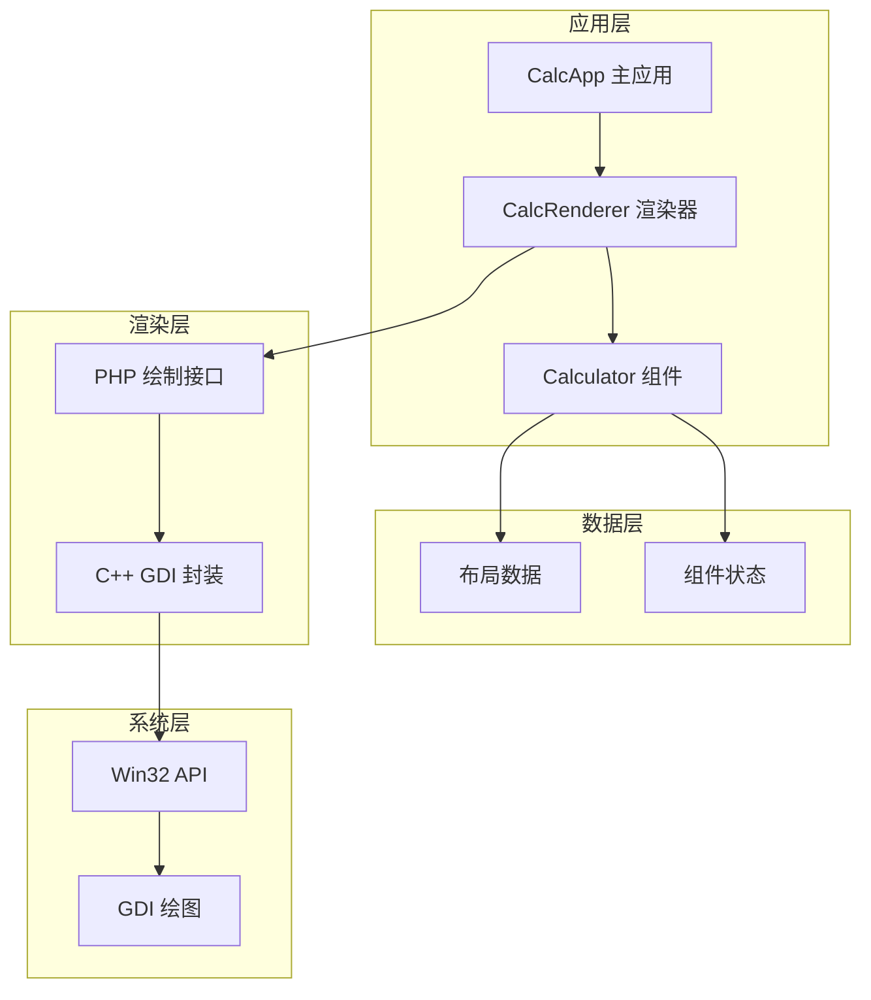
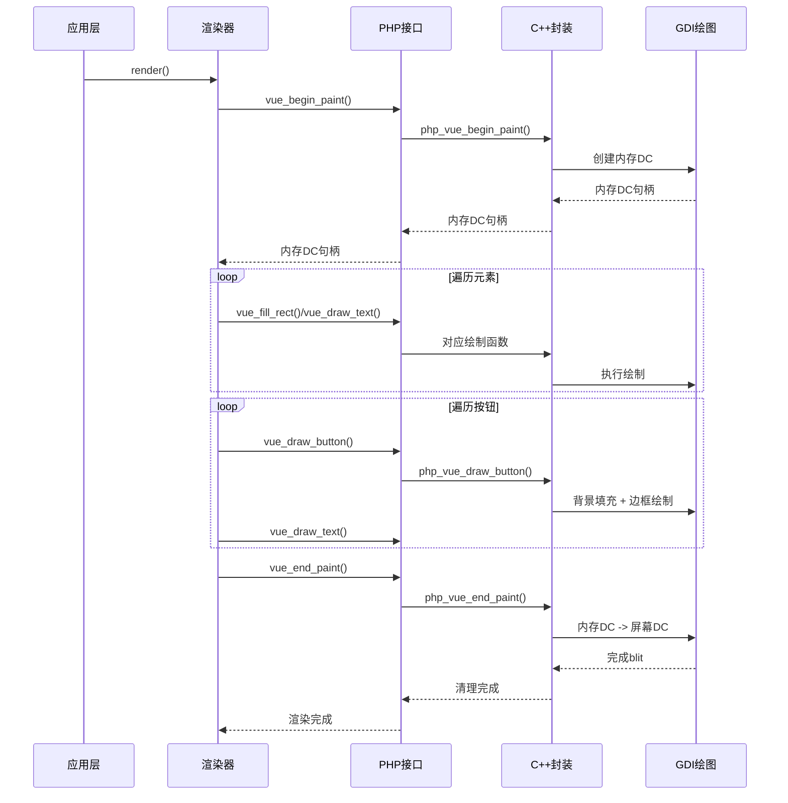
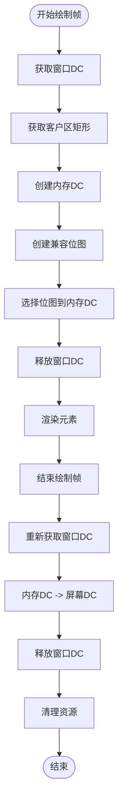
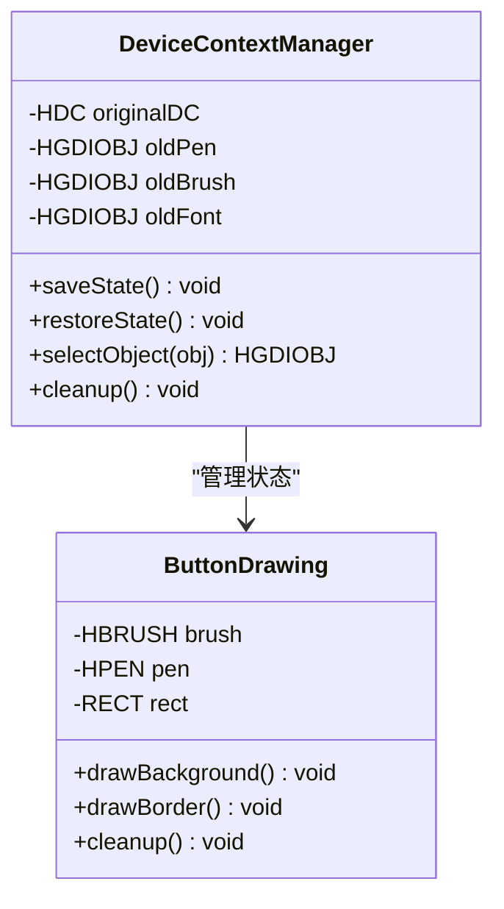
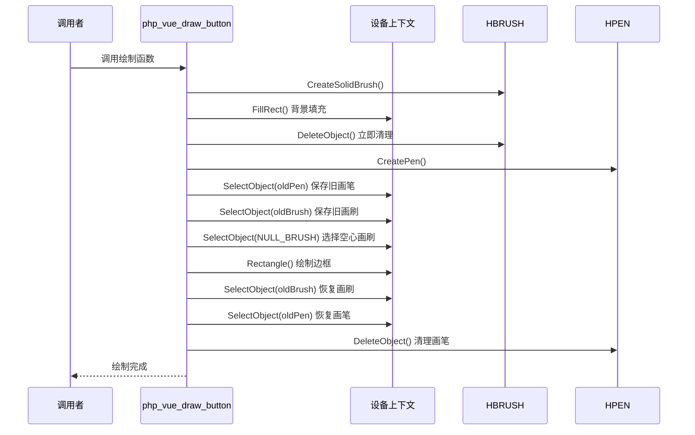
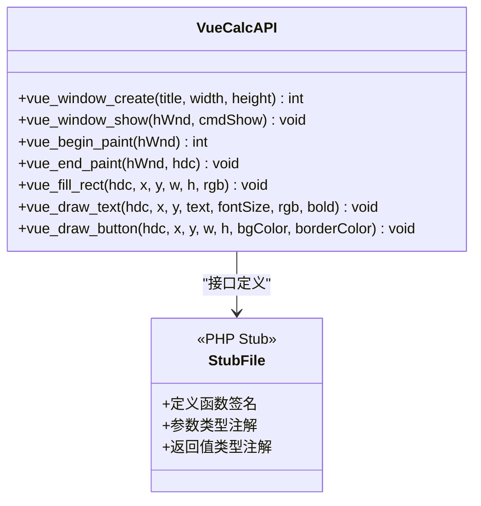
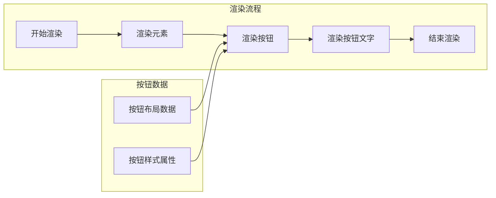
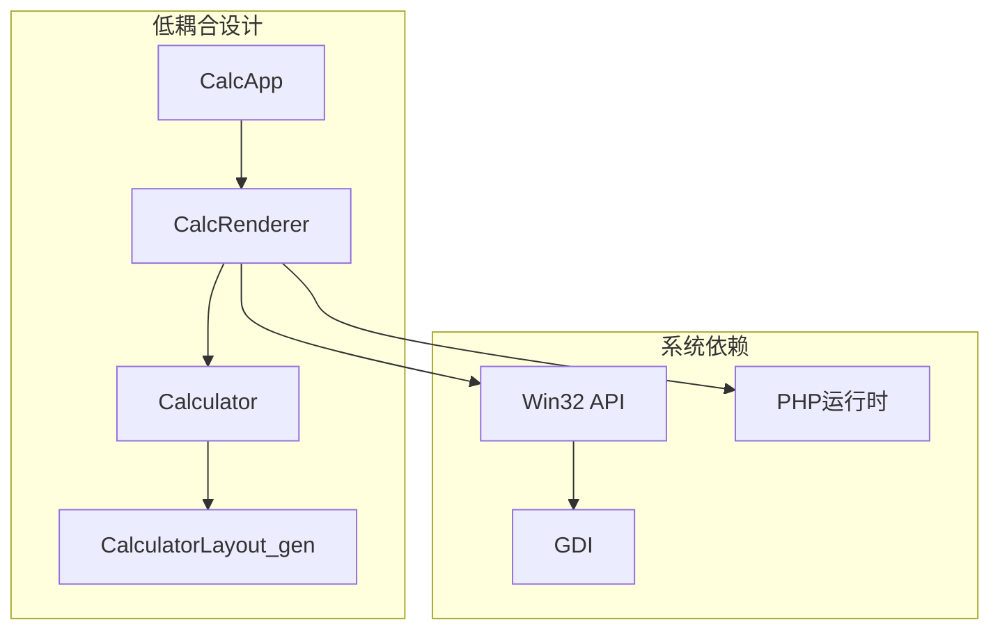

# 按钮绘制

<cite>
**本文引用的文件**
- [vue_calc.cc](file://cpp-src/vue_calc.cc)
- [vue_calc.stub.php](file://php-src/vue_calc.stub.php)
- [main.php](file://main.php)
- [Calculator.gen.php](file://src/Calculator.gen.php)
- [CalculatorLayout_gen.php](file://src/CalculatorLayout_gen.php)
- [Calculator.vue](file://src/Calculator.vue)
- [ReactiveComponent.php](file://src/ReactiveComponent.php)
</cite>

## 目录
1. [简介](#简介)
2. [项目结构](#项目结构)
3. [核心组件](#核心组件)
4. [架构概览](#架构概览)
5. [详细组件分析](#详细组件分析)
6. [依赖关系分析](#依赖关系分析)
7. [性能考虑](#性能考虑)
8. [故障排除指南](#故障排除指南)
9. [结论](#结论)

## 简介

本文档深入分析VueCalc项目中按钮绘制功能的技术实现，重点解析`php_vue_draw_button`函数的双重绘制机制。该系统采用PHP逻辑层与C++ GDI绘制层分离的架构设计，通过数据驱动的方式实现响应式桌面计算器的渲染。

系统的核心创新在于将Win32 API封装为薄层绘制原语，同时保持PHP逻辑层的完全独立性，实现了"类Vue数据驱动桌面框架"的渲染引擎架构。

## 项目结构

VueCalc项目采用分层架构设计，主要包含以下层次：

**图表来源**
- [main.php:26-133](file://main.php#L26-L133)
- [vue_calc.cc:90-156](file://cpp-src/vue_calc.cc#L90-L156)

**章节来源**
- [main.php:1-291](file://main.php#L1-L291)
- [CalculatorLayout_gen.php:1-296](file://src/CalculatorLayout_gen.php#L1-L296)

## 核心组件

### 绘制原语层

系统的核心绘制原语包括：

1. **双缓冲绘制**：通过内存DC实现无闪烁渲染
2. **矩形填充**：使用HBRUSH画刷进行背景填充
3. **文本绘制**：支持字体大小、颜色、粗细的文本渲染
4. **按钮绘制**：复合绘制操作，包含背景填充和边框绘制

### 数据驱动渲染器

CalcRenderer负责将组件状态转换为具体的绘制指令：

**图表来源**
- [main.php:99-132](file://main.php#L99-L132)
- [vue_calc.cc:90-156](file://cpp-src/vue_calc.cc#L90-L156)

**章节来源**
- [main.php:26-133](file://main.php#L26-L133)
- [vue_calc.cc:90-156](file://cpp-src/vue_calc.cc#L90-L156)

## 架构概览

### 双缓冲渲染架构

系统采用双缓冲技术确保绘制过程的流畅性和一致性：

**图表来源**
- [vue_calc.cc:90-117](file://cpp-src/vue_calc.cc#L90-L117)

### 设备上下文状态管理

C++层通过精确的状态保存和恢复机制确保绘制的一致性：

**图表来源**
- [vue_calc.cc:141-156](file://cpp-src/vue_calc.cc#L141-L156)

**章节来源**
- [vue_calc.cc:90-156](file://cpp-src/vue_calc.cc#L90-L156)

## 详细组件分析

### php_vue_draw_button函数分析

#### 双重绘制机制详解

`php_vue_draw_button`函数实现了标准的按钮绘制流程，包含两个主要阶段：

**第一阶段：背景填充**
- 创建HBRUSH画刷对象
- 使用FillRect函数执行矩形填充
- 立即删除画刷对象以释放资源

**第二阶段：边框绘制**
- 创建HPEN画笔对象
- 保存当前的画笔和画刷状态
- 选择NULL_BRUSH实现空心绘制
- 使用Rectangle函数绘制边框
- 恢复之前的画笔和画刷状态
- 删除临时创建的画笔对象

#### 设备上下文状态保存和恢复

函数的关键特性在于对GDI状态的精确管理：

**图表来源**
- [vue_calc.cc:141-156](file://cpp-src/vue_calc.cc#L141-L156)

#### 坐标计算和Rectangle函数调用

函数使用标准的矩形坐标表示法：
- 左上角坐标：(x, y)
- 右下角坐标：(x + w, y + h)
- Rectangle函数自动处理四条边的绘制

坐标计算的简洁性确保了绘制的准确性，避免了边界错误。

#### 资源清理策略

系统采用"立即清理"策略：
- 背景画刷在使用后立即删除
- 临时画笔在边框绘制完成后立即删除
- 通过保存和恢复机制确保状态一致性

**章节来源**
- [vue_calc.cc:141-156](file://cpp-src/vue_calc.cc#L141-L156)

### 绘制接口层

#### PHP层接口定义

PHP层提供了清晰的类型安全接口：

**图表来源**
- [vue_calc.stub.php:12-24](file://php-src/vue_calc.stub.php#L12-L24)

#### 渲染器集成

CalcRenderer将按钮绘制集成到整体渲染流程中：

**图表来源**
- [main.php:116-129](file://main.php#L116-L129)
- [CalculatorLayout_gen.php:59-294](file://src/CalculatorLayout_gen.php#L59-L294)

**章节来源**
- [vue_calc.stub.php:12-24](file://php-src/vue_calc.stub.php#L12-L24)
- [main.php:116-129](file://main.php#L116-L129)

### 布局和样式系统

#### 布局数据生成

系统通过SFC编译器自动生成布局数据，包含所有按钮的位置和样式信息：

| 属性名 | 类型 | 描述 | 示例值 |
|--------|------|------|--------|
| label | string | 按钮显示文本 | "C", "7", "=" |
| x, y | int | 按钮左上角坐标 | 2, 82, 162 |
| w, h | int | 按钮宽高 | 76, 56 |
| bg | int | 背景色RGB值 | 5263440, 3289650 |
| fg | int | 前景色RGB值 | 16777215 |
| border | int | 边框颜色RGB值 | 6579300, 4605510 |
| handler | string | 处理函数名 | "reset", "handleButton" |
| arg | mixed | 参数值 | NULL, "/", "*" |

#### 样式定制方法

系统支持多种样式定制方式：

1. **颜色定制**：通过RGB整数值指定颜色
2. **尺寸调整**：通过布局数据调整按钮位置和大小
3. **字体定制**：通过文本绘制接口调整字体大小和样式

**章节来源**
- [CalculatorLayout_gen.php:59-294](file://src/CalculatorLayout_gen.php#L59-L294)
- [Calculator.vue:205-214](file://src/Calculator.vue#L205-L214)

## 依赖关系分析

### 组件耦合度分析

**图表来源**
- [main.php:139-259](file://main.php#L139-L259)
- [Calculator.gen.php:9-174](file://src/Calculator.gen.php#L9-L174)

### 绘制管道依赖

系统的绘制管道具有清晰的依赖关系：

1. **CalcRenderer**依赖**PHP绘制接口**，但不直接依赖Win32 API
2. **PHP绘制接口**依赖**C++封装层**，但不直接依赖GDI
3. **C++封装层**直接依赖**Win32 GDI API**

这种分层设计确保了各层职责明确，便于维护和扩展。

**章节来源**
- [main.php:139-259](file://main.php#L139-L259)
- [vue_calc.cc:90-156](file://cpp-src/vue_calc.cc#L90-L156)

## 性能考虑

### 双缓冲技术优势

双缓冲技术显著提升了渲染性能和视觉质量：

- **无闪烁效果**：避免了传统单缓冲绘制时的闪烁问题
- **原子性更新**：整个帧的绘制完成后一次性显示到屏幕
- **资源复用**：内存DC和位图在帧间复用，减少频繁分配

### 资源管理优化

系统在资源管理方面采用了多项优化措施：

1. **及时清理**：绘制完成后立即释放临时资源
2. **状态保存**：精确保存和恢复GDI状态，避免全局污染
3. **批量操作**：在同一设备上下文中执行多个绘制操作

### 绘制优化建议

基于现有实现，提出以下优化建议：

1. **批处理绘制**：对于大量相似按钮，可以考虑批处理绘制以减少状态切换
2. **缓存机制**：对于静态按钮，可以缓存其绘制结果以提升性能
3. **增量更新**：实现脏矩形区域的增量更新，只重绘变化的部分

## 故障排除指南

### 常见问题诊断

#### 绘制异常问题

**问题现象**：按钮绘制出现颜色错误或边框缺失

**可能原因**：
1. GDI状态未正确恢复
2. 资源对象未正确删除
3. 坐标计算错误

**解决方案**：
1. 检查SelectObject和DeleteObject的配对使用
2. 确保所有临时对象都进行了清理
3. 验证矩形坐标的计算逻辑

#### 性能问题

**问题现象**：渲染帧率过低或CPU占用过高

**可能原因**：
1. 绘制调用过于频繁
2. 资源分配和释放不及时
3. 双缓冲机制未正确使用

**解决方案**：
1. 实现脏标记机制，只在状态变化时重绘
2. 确保资源的及时清理
3. 检查双缓冲的正确使用

**章节来源**
- [vue_calc.cc:141-156](file://cpp-src/vue_calc.cc#L141-L156)

### 调试技巧

1. **状态检查**：使用GetStockObject检查当前GDI对象状态
2. **资源监控**：跟踪HGDIOBJ的数量变化
3. **坐标验证**：打印关键坐标值验证计算正确性

## 结论

VueCalc项目的按钮绘制功能展现了优秀的软件架构设计：

1. **清晰的分层架构**：PHP逻辑层与C++绘制层分离，职责明确
2. **精确的资源管理**：严格的GDI状态保存和恢复机制
3. **高效的双缓冲技术**：确保流畅的渲染体验
4. **灵活的样式系统**：支持丰富的按钮样式定制

该实现为构建高性能的桌面应用程序提供了良好的参考模式，特别是在需要将高级语言逻辑与底层图形系统结合的场景中。通过合理的架构设计和严格的资源管理，系统实现了功能完整性与性能优化的平衡。