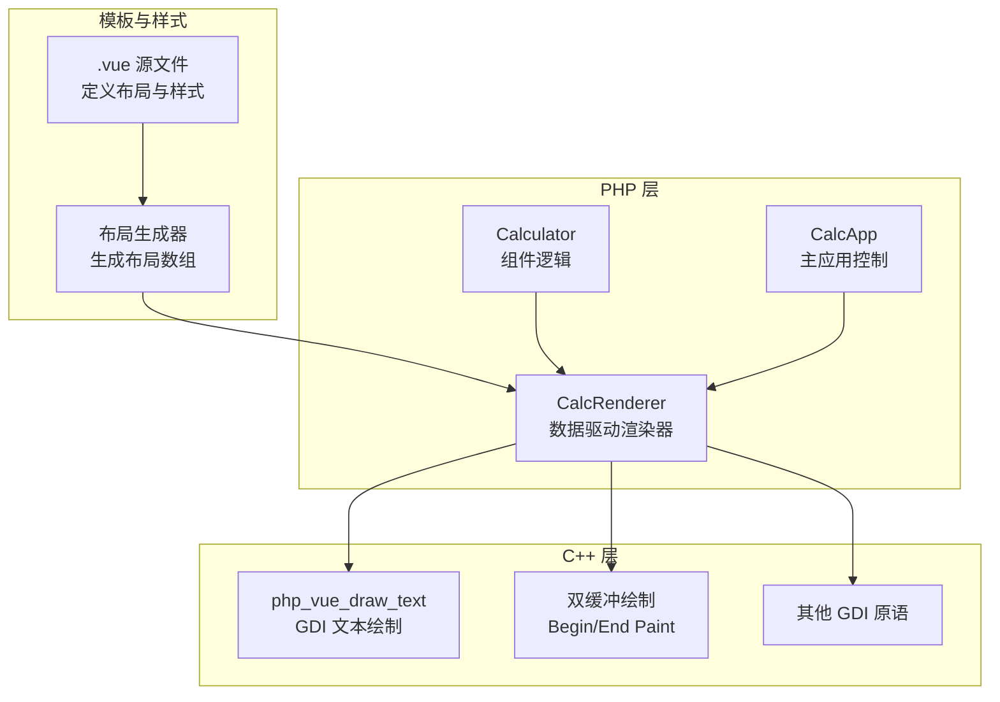
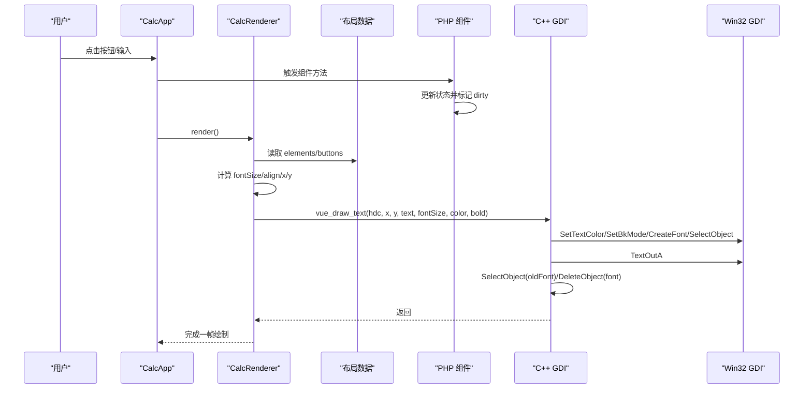
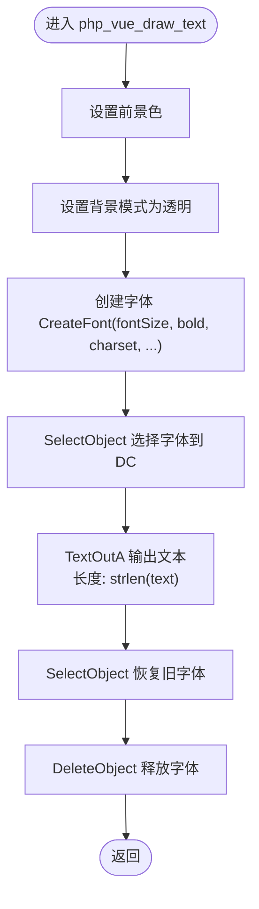
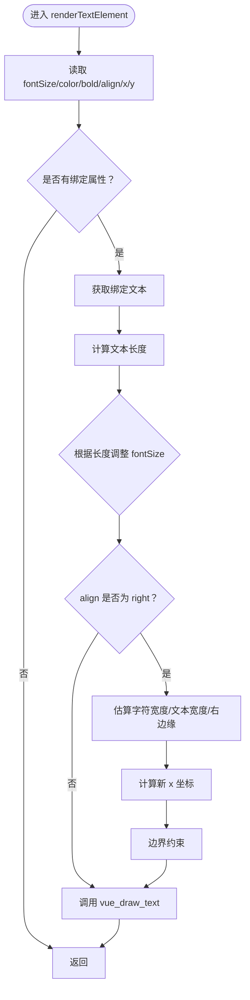
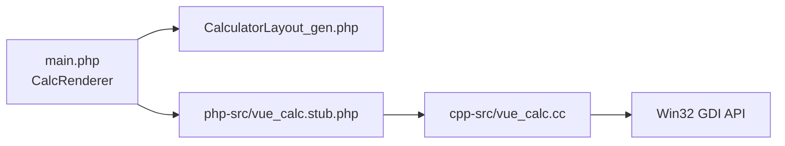

# 文本渲染

<cite>
**本文引用的文件**
- [cpp-src/vue_calc.cc](file://cpp-src/vue_calc.cc)
- [main.php](file://main.php)
- [src/CalculatorLayout_gen.php](file://src/CalculatorLayout_gen.php)
- [php-src/vue_calc.stub.php](file://php-src/vue_calc.stub.php)
- [src/Calculator.vue](file://src/Calculator.vue)
- [tools/compiler/template-parser.php](file://tools/compiler/template-parser.php)
</cite>

## 目录
1. [简介](#简介)
2. [项目结构](#项目结构)
3. [核心组件](#核心组件)
4. [架构总览](#架构总览)
5. [详细组件分析](#详细组件分析)
6. [依赖关系分析](#依赖关系分析)
7. [性能考量](#性能考量)
8. [故障排查指南](#故障排查指南)
9. [结论](#结论)

## 简介
本文件聚焦于“文本渲染”子系统，围绕 C++ 层的 php_vue_draw_text 函数展开，系统性解析其完整实现流程，包括：
- 颜色设置（SetTextColor）
- 背景模式设置（SetBkMode）
- 字体创建（CreateFont）的参数配置与行为
- 字体属性（字号、粗体、字符集）的来源与影响
- 字体对象的选择与恢复机制
- 文本输出（TextOutA）过程、字符串长度计算与内存管理
- 文本渲染最佳实践与调试技巧

同时，结合 PHP 层 CalcRenderer 的调用链路，说明布局数据如何驱动 C++ 文本绘制，并给出面向实际开发的优化建议与问题定位方法。

## 项目结构
该工程采用“SFC 编译 + 数据驱动渲染”的架构：
- 模板与样式由 .vue 文件描述，经编译器转换为布局数据（elements/buttons）
- PHP 层根据组件状态与布局数据，调用 C++ GDI 绘制原语进行渲染
- C++ 层仅提供薄封装的 Win32 API，负责双缓冲、矩形填充、文本绘制等底层能力

图表来源
- [src/Calculator.vue:1-215](file://src/Calculator.vue#L1-L215)
- [src/CalculatorLayout_gen.php:10-58](file://src/CalculatorLayout_gen.php#L10-L58)
- [main.php:26-133](file://main.php#L26-L133)
- [cpp-src/vue_calc.cc:90-139](file://cpp-src/vue_calc.cc#L90-L139)

章节来源
- [src/Calculator.vue:1-215](file://src/Calculator.vue#L1-L215)
- [src/CalculatorLayout_gen.php:10-58](file://src/CalculatorLayout_gen.php#L10-L58)
- [main.php:26-133](file://main.php#L26-L133)
- [cpp-src/vue_calc.cc:90-139](file://cpp-src/vue_calc.cc#L90-L139)

## 核心组件
- C++ 文本绘制函数：php_vue_draw_text
  - 设置前景色、透明背景
  - 创建字体（字号、粗细、字符集等）
  - 选择字体到 DC，执行文本输出，再恢复/释放字体
- PHP 渲染器：CalcRenderer
  - 从布局数据提取文本属性（fontSize/color/bold/align）
  - 动态调整字号与右对齐计算
  - 调用 vue_draw_text 完成绘制
- 布局生成：CalculatorLayout_gen.php
  - 将 .vue 的样式映射为 fontSize/color/bold 等属性
  - 生成 elements/buttons 数组供渲染器消费

章节来源
- [cpp-src/vue_calc.cc:127-139](file://cpp-src/vue_calc.cc#L127-L139)
- [main.php:49-94](file://main.php#L49-L94)
- [src/CalculatorLayout_gen.php:40-57](file://src/CalculatorLayout_gen.php#L40-L57)

## 架构总览
文本渲染的数据流与调用链如下：

图表来源
- [main.php:99-132](file://main.php#L99-L132)
- [src/CalculatorLayout_gen.php:40-57](file://src/CalculatorLayout_gen.php#L40-L57)
- [cpp-src/vue_calc.cc:127-139](file://cpp-src/vue_calc.cc#L127-L139)

## 详细组件分析

### C++ 文本绘制函数：php_vue_draw_text
- 参数与职责
  - hdc：目标设备上下文句柄
  - x/y：文本起点坐标
  - text：要绘制的字符串
  - fontSize：字号（像素高度）
  - rgbColor：RGB 前景色
  - bold：是否粗体
- 关键步骤
  1) 设置前景色：SetTextColor
  2) 设置背景模式：SetBkMode（透明）
  3) 创建字体：CreateFont（参数见下节）
  4) 选择字体到 DC：SelectObject
  5) 文本输出：TextOutA（长度通过 strlen 计算）
  6) 恢复旧字体并释放新字体：SelectObject(oldFont) + DeleteObject(font)

图表来源
- [cpp-src/vue_calc.cc:127-139](file://cpp-src/vue_calc.cc#L127-L139)

章节来源
- [cpp-src/vue_calc.cc:127-139](file://cpp-src/vue_calc.cc#L127-L139)

#### 字体创建参数详解（CreateFont）
- 字号（nHeight）
  - 来源：来自 PHP 层传入的 fontSize
  - 含义：以像素为单位的字符高度
- 粗体（weight）
  - 来源：bold 参数映射为 FW_BOLD 或 FW_NORMAL
- 斜体/下划线/删除线
  - 均为 FALSE，不启用
- 字符集（charset）
  - 使用 DEFAULT_CHARSET，可跨语言显示
- 输出精度与裁剪精度
  - OUT_DEFAULT_PRECIS / CLIP_DEFAULT_PRECIS
- 质量
  - DEFAULT_QUALITY
- 倾斜度与族类
  - DEFAULT_PITCH | FF_SWISS（瑞士风格无衬线字体）
- 字体名
  - "Segoe UI"（Windows 默认 UI 字体）

这些参数共同决定了最终渲染效果与兼容性。若需更严格的字体控制，可在 C++ 层扩展参数或引入外部字体资源。

章节来源
- [cpp-src/vue_calc.cc:131-134](file://cpp-src/vue_calc.cc#L131-L134)

#### 字体对象的选择与恢复机制
- 选择字体：SelectObject 将新建字体选入 DC，后续 TextOutA 使用该字体
- 恢复字体：在输出完成后，先 SelectObject 回到旧字体，确保 DC 状态可预期
- 释放字体：DeleteObject 删除字体对象，避免 GDI 资源泄漏

此机制保证了：
- 文本输出前后 DC 状态一致
- 避免字体对象长期占用导致资源耗尽

章节来源
- [cpp-src/vue_calc.cc:135-138](file://cpp-src/vue_calc.cc#L135-L138)

#### TextOutA 的文本输出过程
- 输入：HDC、起点坐标、字符串指针、字符串长度
- 长度计算：使用 strlen 计算字节数（注意：对于多字节编码，应考虑宽字符 API）
- 输出：将文本按当前字体与颜色写入 DC
- 注意：若字符串包含多字节字符，建议改用宽字符版本以获得更准确的长度与渲染结果

章节来源
- [cpp-src/vue_calc.cc:136-136](file://cpp-src/vue_calc.cc#L136-L136)

#### 内存管理与资源回收
- 字体对象：CreateFont 返回的 HFONT 必须 DeleteObject 释放
- 旧字体对象：SelectObject 返回旧对象，应在恢复后继续使用 SelectObject 恢复
- DC 与位图：双缓冲中使用的内存由 C++ 层负责创建与销毁（非本文重点）

章节来源
- [cpp-src/vue_calc.cc:114-117](file://cpp-src/vue_calc.cc#L114-L117)
- [cpp-src/vue_calc.cc:135-138](file://cpp-src/vue_calc.cc#L135-L138)

### PHP 渲染器：CalcRenderer 的文本渲染
- 从布局数据读取文本属性
  - fontSize：默认 16；根据文本长度动态下调
  - color：默认白色；由样式映射而来
  - bold：默认 0；由样式映射而来
  - align：left/right；right 时按容器宽度与字符宽度估算 x 坐标
- 右对齐策略
  - 估算字符宽度：约等于 fontSize × 0.6
  - 计算文本宽度：textLen × charWidth
  - 右边缘：containerX + containerW
  - 新 x：rightEdge - 12 - textWidth，最小不低于 containerX + 4
- 调用 C++ 绘制
  - 最终调用 vue_draw_text 完成绘制

图表来源
- [main.php:49-94](file://main.php#L49-L94)

章节来源
- [main.php:49-94](file://main.php#L49-L94)

### 布局数据与样式映射
- 样式映射
  - .expr-text：fontSize=16，color=灰色，bold=0
  - .display-text：fontSize=32，color=白色，bold=1
- 布局生成
  - 将样式映射为 fontSize/color/bold
  - 生成 elements/buttons 数组供渲染器消费

章节来源
- [src/Calculator.vue:205-214](file://src/Calculator.vue#L205-L214)
- [src/CalculatorLayout_gen.php:40-57](file://src/CalculatorLayout_gen.php#L40-L57)

### 模板解析与布局生成（编译期）
- 模板解析器
  - 支持 <app>/<rect>/<text>/<grid>/<btn> 等标签
  - 解析 @click 与 :bind 等指令
- 布局降级
  - 将 AST 转换为 elements/buttons 数组
  - 计算按钮坐标、提取样式属性

章节来源
- [tools/compiler/template-parser.php:284-361](file://tools/compiler/template-parser.php#L284-L361)
- [tools/compiler/template-parser.php:456-541](file://tools/compiler/template-parser.php#L456-L541)

## 依赖关系分析
- PHP 层依赖
  - 布局数据：CalculatorLayout_gen.php 提供 elements/buttons
  - 组件状态：Calculator 类维护 display/expression 等
  - GDI 原语：通过 stub 声明的 vue_* 函数桥接到 C++
- C++ 层依赖
  - Win32 GDI：SetTextColor、SetBkMode、CreateFont、TextOutA、SelectObject、DeleteObject
  - 双缓冲：CreateCompatibleDC/BitBlt/DeleteObject

图表来源
- [main.php:26-133](file://main.php#L26-L133)
- [src/CalculatorLayout_gen.php:10-58](file://src/CalculatorLayout_gen.php#L10-L58)
- [php-src/vue_calc.stub.php:12-23](file://php-src/vue_calc.stub.php#L12-L23)
- [cpp-src/vue_calc.cc:127-139](file://cpp-src/vue_calc.cc#L127-L139)

章节来源
- [main.php:26-133](file://main.php#L26-L133)
- [src/CalculatorLayout_gen.php:10-58](file://src/CalculatorLayout_gen.php#L10-L58)
- [php-src/vue_calc.stub.php:12-23](file://php-src/vue_calc.stub.php#L12-L23)
- [cpp-src/vue_calc.cc:127-139](file://cpp-src/vue_calc.cc#L127-L139)

## 性能考量
- 字体对象创建成本
  - 每次绘制都创建字体对象，频繁切换可能导致性能下降
  - 建议：在 C++ 层缓存常用字体对象（按字号/粗体/字符集分组），减少 CreateFont 调用次数
- 字符串长度计算
  - strlen 计算字节数，对多字节字符可能不准确
  - 建议：在需要精确宽度时，使用宽字符 API 或预估字符宽度
- 双缓冲与刷新频率
  - 双缓冲可显著降低闪烁
  - 刷新频率（~60 FPS）与组件 dirty 标记配合，避免无效重绘

[本节为通用性能建议，不直接分析具体文件]

## 故障排查指南
- 文本未显示
  - 检查前景色与背景模式：前景色与背景相近会导致不可见
  - 检查字体是否成功创建与释放：确认 CreateFont 返回有效句柄
- 文本错位或截断
  - 检查右对齐计算：字符宽度估算与容器宽度、x 坐标边界
  - 检查坐标传递：确保 x/y 与布局数据一致
- 字体渲染异常
  - 检查字符集：DEFAULT_CHARSET 通常足够，但特殊字符可能需要指定特定字符集
  - 检查粗体开关：bold 参数映射是否正确
- 资源泄漏
  - 确认每次 SelectObject(oldFont) 与 DeleteObject(font) 成对出现
  - 确认双缓冲中的位图与 DC 已正确释放

章节来源
- [cpp-src/vue_calc.cc:127-139](file://cpp-src/vue_calc.cc#L127-L139)
- [main.php:81-91](file://main.php#L81-L91)

## 结论
本文围绕 php_vue_draw_text 的实现，系统梳理了颜色、背景、字体创建与选择恢复、文本输出与内存管理的关键环节，并结合 PHP 层的 CalcRenderer 与布局数据，给出了完整的数据驱动渲染流程。实践中建议：
- 在 C++ 层引入字体缓存与宽字符 API 支持
- 在 PHP 层完善对多字节字符的宽度估算
- 加强错误检测与资源回收的单元测试覆盖