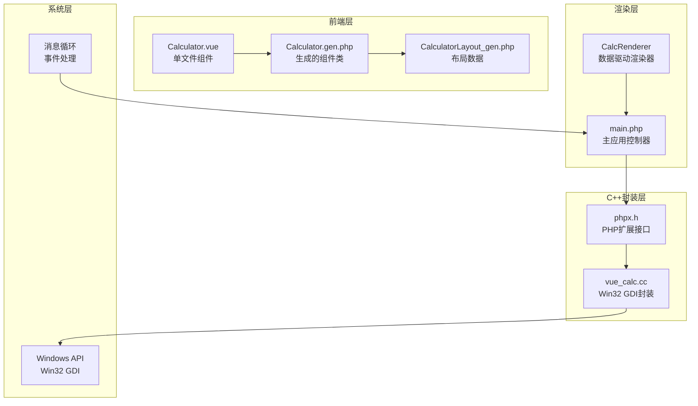
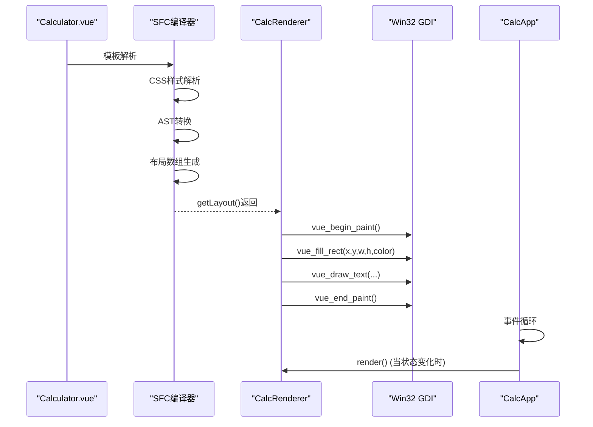
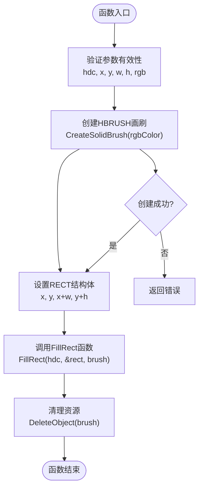
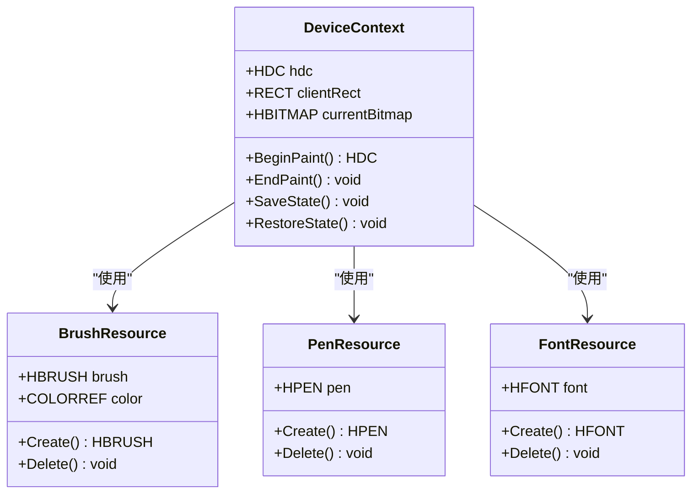
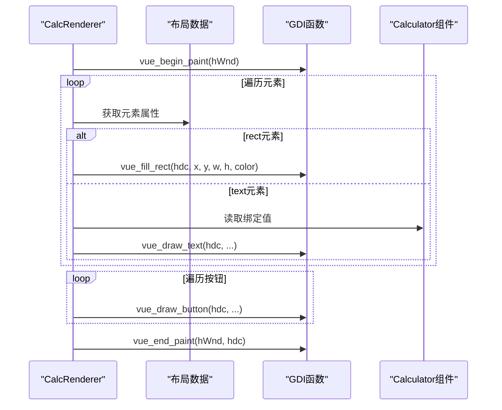
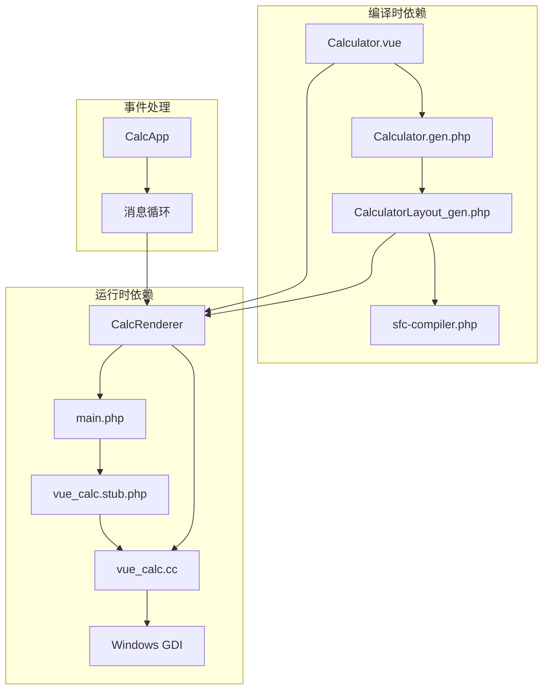
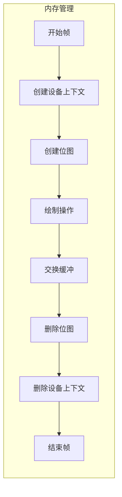

# 矩形绘制

<cite>
**本文档引用的文件**
- [vue_calc.cc](file://cpp-src/vue_calc.cc)
- [main.php](file://main.php)
- [Calculator.vue](file://src/Calculator.vue)
- [Calculator.gen.php](file://src/Calculator.gen.php)
- [vue_calc.stub.php](file://php-src/vue_calc.stub.php)
- [sfc-compiler.php](file://tools/sfc-compiler.php)
- [verify-layout.php](file://tests/verify-layout.php)
</cite>

## 目录
1. [简介](#简介)
2. [项目结构](#项目结构)
3. [核心组件](#核心组件)
4. [架构概览](#架构概览)
5. [详细组件分析](#详细组件分析)
6. [依赖关系分析](#依赖关系分析)
7. [性能考虑](#性能考虑)
8. [故障排除指南](#故障排除指南)
9. [结论](#结论)

## 简介

本文档深入分析了Vue计算器项目中的矩形绘制功能实现。该系统采用"类Vue数据驱动桌面框架"架构，通过PHP实现业务逻辑，C++封装Win32 GDI API进行底层绘制。重点分析`php_vue_fill_rect`函数的实现机制，包括HBRUSH画刷的创建和使用、RECT结构体的坐标设置、FillRect函数的调用过程，以及RGB颜色值的处理方式。

该系统实现了完整的双缓冲渲染机制，通过编译时计算的布局数据驱动实时绘制，为桌面应用程序提供了高效的数据驱动渲染解决方案。

## 项目结构

Vue计算器项目采用分层架构设计，主要包含以下核心模块：

**图表来源**
- [main.php:1-291](file://main.php#L1-L291)
- [vue_calc.cc:1-157](file://cpp-src/vue_calc.cc#L1-L157)

**章节来源**
- [main.php:1-15](file://main.php#L1-L15)
- [sfc-compiler.php:1-210](file://tools/sfc-compiler.php#L1-L210)

## 核心组件

### GDI绘制原语层

系统的核心绘制功能位于C++层，通过`phpx.h`框架提供PHP可调用的Win32 API封装。主要的绘制原语包括：

- **双缓冲绘制**: `php_vue_begin_paint` 和 `php_vue_end_paint` 函数实现无闪烁渲染
- **矩形填充**: `php_vue_fill_rect` 函数处理矩形绘制
- **文本绘制**: `php_vue_draw_text` 函数支持字体和颜色设置
- **按钮绘制**: `php_vue_draw_button` 函数结合填充和边框绘制

### 数据驱动渲染器

`CalcRenderer`类负责将布局数据转换为实际的绘制命令。它遍历编译生成的布局数组，根据组件状态调用相应的GDI函数。

**章节来源**
- [vue_calc.cc:86-156](file://cpp-src/vue_calc.cc#L86-L156)
- [main.php:26-133](file://main.php#L26-L133)

## 架构概览

系统采用"模板编译 + 数据驱动渲染"的架构模式：

**图表来源**
- [sfc-compiler.php:120-158](file://tools/sfc-compiler.php#L120-L158)
- [main.php:99-133](file://main.php#L99-L133)
- [vue_calc.cc:90-125](file://cpp-src/vue_calc.cc#L90-L125)

## 详细组件分析

### php_vue_fill_rect函数实现分析

`php_vue_fill_rect`函数是矩形绘制的核心实现，其完整执行流程如下：

**图表来源**
- [vue_calc.cc:119-125](file://cpp-src/vue_calc.cc#L119-L125)

#### HBRUSH画刷创建机制

函数使用`CreateSolidBrush`创建单色画刷，该画刷用于填充矩形内部区域。画刷的生命周期严格控制，确保在完成绘制后立即释放，防止资源泄漏。

#### RECT结构体坐标系统

RECT结构体采用Win32标准坐标系统：
- 左上角坐标: `(x, y)`
- 右下角坐标: `(x + w, y + h)`
- 坐标范围: 原点位于左上角，x轴向右递增，y轴向下递增

#### RGB颜色值处理

颜色值通过`COLORREF`类型传递，采用RGB格式存储。函数直接使用传入的颜色值创建画刷，无需额外的颜色空间转换。

**章节来源**
- [vue_calc.cc:119-125](file://cpp-src/vue_calc.cc#L119-L125)

### 设备上下文状态管理

系统实现了完整的双缓冲渲染机制，确保绘制过程中的状态隔离和资源管理：

**图表来源**
- [vue_calc.cc:90-117](file://cpp-src/vue_calc.cc#L90-L117)

#### 双缓冲渲染流程

双缓冲机制通过以下步骤实现：

1. **开始绘制**: 获取窗口设备上下文，创建兼容位图
2. **绘制到后台**: 所有绘制操作在内存位图上进行
3. **交换显示**: 使用BitBlt将后台缓冲复制到前台
4. **资源清理**: 释放临时对象和设备上下文

**章节来源**
- [vue_calc.cc:90-117](file://cpp-src/vue_calc.cc#L90-L117)

### 数据驱动渲染流程

渲染器根据布局数据驱动具体的绘制操作：

**图表来源**
- [main.php:99-133](file://main.php#L99-L133)

**章节来源**
- [main.php:99-133](file://main.php#L99-L133)

## 依赖关系分析

系统各组件之间的依赖关系呈现清晰的层次结构：

**图表来源**
- [sfc-compiler.php:133-181](file://tools/sfc-compiler.php#L133-L181)
- [main.php:1-291](file://main.php#L1-L291)
- [vue_calc.cc:1-157](file://cpp-src/vue_calc.cc#L1-L157)

### 关键依赖特性

1. **编译时确定性**: 所有布局坐标在编译时计算完成
2. **运行时最小化**: 运行时只做状态检查和绘制调用
3. **类型安全**: 通过phpx.h框架确保类型转换正确
4. **资源管理**: 自动化的资源生命周期管理

**章节来源**
- [sfc-compiler.php:120-158](file://tools/sfc-compiler.php#L120-L158)
- [main.php:1-291](file://main.php#L1-L291)

## 性能考虑

### 渲染性能优化

系统采用了多项性能优化策略：

1. **双缓冲技术**: 避免绘制过程中的闪烁现象
2. **增量更新**: 仅在组件状态变化时触发重绘
3. **编译时计算**: 布局坐标在编译时确定，运行时无需计算
4. **资源复用**: 合理的资源创建和销毁时机

### 内存管理策略

**图表来源**
- [vue_calc.cc:90-117](file://cpp-src/vue_calc.cc#L90-L117)

### 性能监控指标

- **帧率**: 约60 FPS (16ms/帧)
- **内存占用**: 每帧创建的临时对象数量有限
- **CPU使用**: 主要集中在GDI绘制操作
- **渲染延迟**: 从状态变化到显示更新的时间

**章节来源**
- [main.php:223-224](file://main.php#L223-L224)
- [vue_calc.cc:90-117](file://cpp-src/vue_calc.cc#L90-L117)

## 故障排除指南

### 常见问题及解决方案

#### 绘制异常问题

| 问题症状 | 可能原因 | 解决方案 |
|---------|---------|---------|
| 矩形不显示 | 颜色值无效或超出范围 | 检查COLORREF格式和有效范围 |
| 绘制闪烁 | 缺少双缓冲机制 | 确保使用begin_paint/end_paint |
| 内存泄漏 | 资源未正确释放 | 检查DeleteObject调用 |

#### 调试技巧

1. **启用调试输出**: 在关键函数中添加日志输出
2. **参数验证**: 检查输入参数的有效性
3. **资源状态检查**: 确认GDI对象的创建和销毁配对

**章节来源**
- [vue_calc.cc:119-125](file://cpp-src/vue_calc.cc#L119-L125)

### 错误处理机制

系统实现了多层次的错误处理：

1. **参数验证**: 在函数入口处验证输入参数
2. **资源检查**: 确保GDI对象创建成功
3. **异常捕获**: 在应用层捕获并处理异常
4. **优雅降级**: 发生错误时保持应用程序稳定

**章节来源**
- [main.php:178-221](file://main.php#L178-L221)

## 结论

Vue计算器项目的矩形绘制功能展现了现代桌面应用程序开发的最佳实践。通过将业务逻辑与底层渲染分离，系统实现了高度的模块化和可维护性。

该实现的关键优势包括：

1. **架构清晰**: 分层设计使各组件职责明确
2. **性能优异**: 双缓冲和编译时优化确保流畅体验
3. **易于扩展**: 插件化的GDI封装便于添加新的绘制原语
4. **类型安全**: 通过phpx.h框架提供强类型接口

未来可以考虑的改进方向：
- 添加更多的GDI原语支持
- 实现更复杂的图形效果
- 优化内存使用效率
- 增强错误恢复能力

该系统为类似的数据驱动桌面应用开发提供了优秀的参考模型。