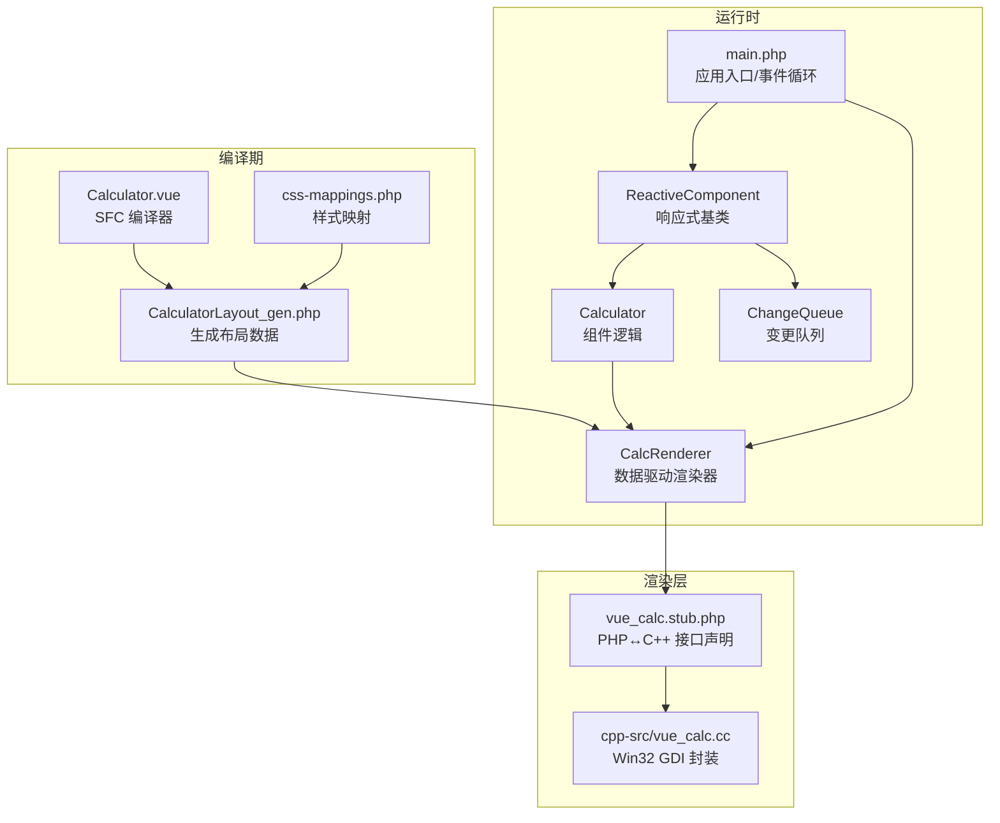
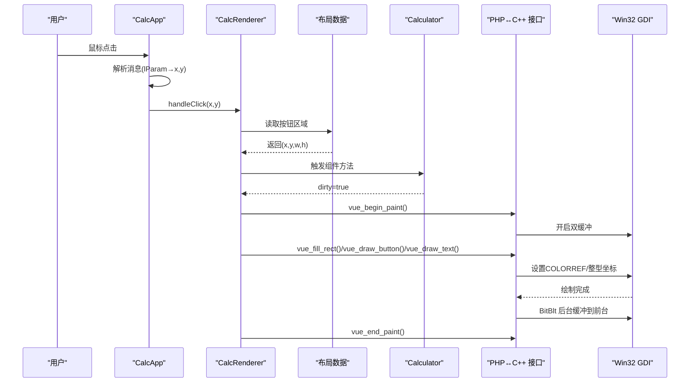
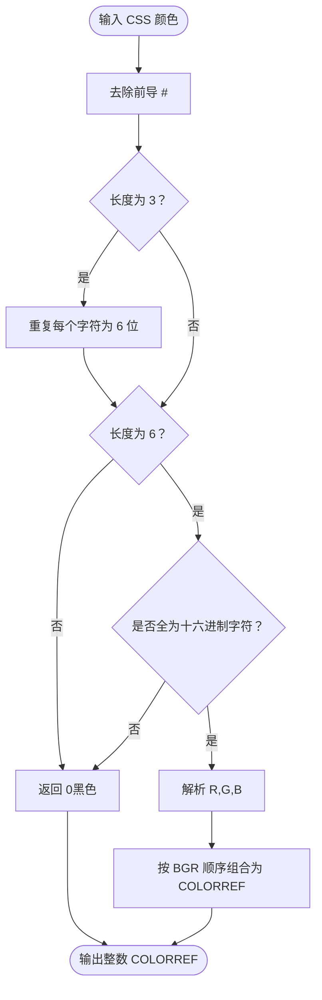
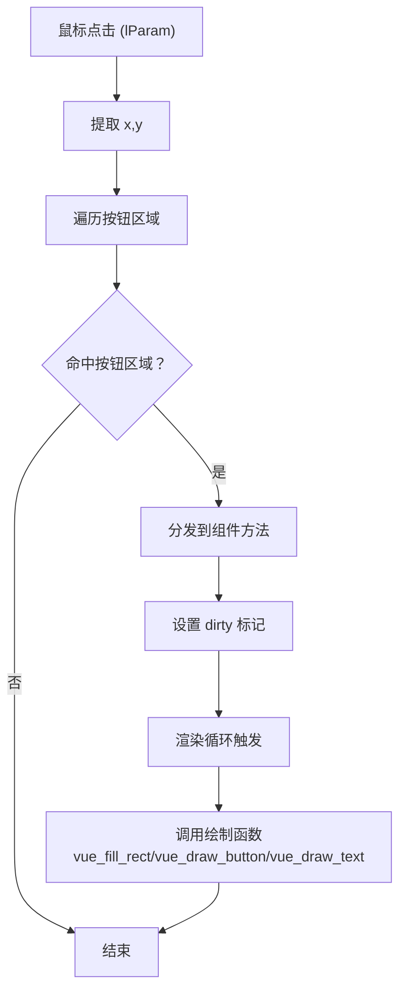
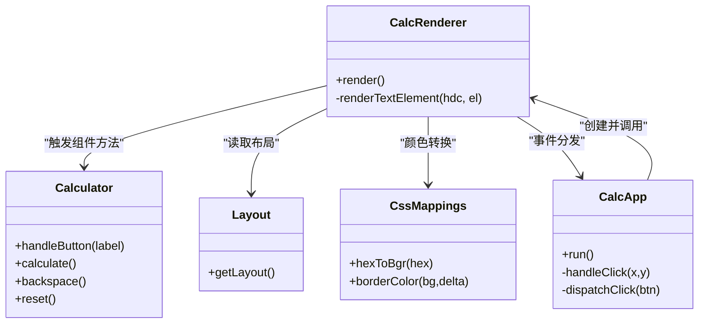
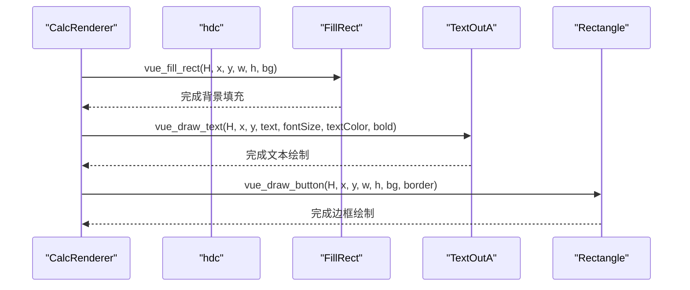
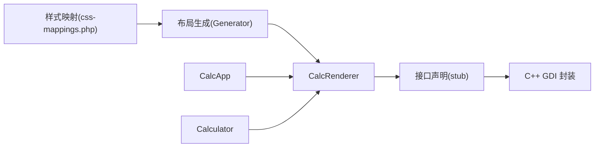

# 颜色与坐标管理

<cite>
**本文引用的文件**
- [cpp-src/vue_calc.cc](file://cpp-src/vue_calc.cc)
- [php-src/vue_calc.stub.php](file://php-src/vue_calc.stub.php)
- [main.php](file://main.php)
- [src/Calculator.gen.php](file://src/Calculator.gen.php)
- [src/CalculatorLayout_gen.php](file://src/CalculatorLayout_gen.php)
- [src/ReactiveComponent.php](file://src/ReactiveComponent.php)
- [src/ChangeQueue.php](file://src/ChangeQueue.php)
- [tools/compiler/css-mappings.php](file://tools/compiler/css-mappings.php)
- [tests/sfc-compiler-test.php](file://tests/sfc-compiler-test.php)
- [tests/verify-layout.php](file://tests/verify-layout.php)
</cite>

## 目录
1. [简介](#简介)
2. [项目结构](#项目结构)
3. [核心组件](#核心组件)
4. [架构总览](#架构总览)
5. [详细组件分析](#详细组件分析)
6. [依赖关系分析](#依赖关系分析)
7. [性能考量](#性能考量)
8. [故障排查指南](#故障排查指南)
9. [结论](#结论)
10. [附录](#附录)

## 简介
本技术文档聚焦于“颜色与坐标管理”主题，围绕以下目标展开：
- 深入分析RGB颜色值的编码与转换机制，重点说明COLORREF类型在Win32中的使用及颜色空间处理。
- 详细解释Win32坐标系统的特点：原点位置、坐标轴方向、像素对齐要求。
- 阐述颜色管理在不同绘制函数中的统一处理方式，以及坐标参数的类型转换与边界检查策略。
- 提供颜色值的十六进制表示方法、坐标计算的最佳实践与调试技巧。

## 项目结构
该项目采用“SFC（单文件组件）编译 + 数据驱动渲染”的架构，前端样式与布局由SFC编译器生成，运行时由PHP驱动渲染，底层通过C++封装Win32 GDI进行绘制。

图表来源
- [main.php:139-259](file://main.php#L139-L259)
- [src/Calculator.gen.php:9-174](file://src/Calculator.gen.php#L9-L174)
- [src/CalculatorLayout_gen.php:10-296](file://src/CalculatorLayout_gen.php#L10-L296)
- [tools/compiler/css-mappings.php:15-210](file://tools/compiler/css-mappings.php#L15-L210)
- [cpp-src/vue_calc.cc:9-157](file://cpp-src/vue_calc.cc#L9-L157)
- [php-src/vue_calc.stub.php:12-23](file://php-src/vue_calc.stub.php#L12-L23)

章节来源
- [main.php:1-291](file://main.php#L1-L291)
- [src/Calculator.gen.php:1-174](file://src/Calculator.gen.php#L1-L174)
- [src/CalculatorLayout_gen.php:1-296](file://src/CalculatorLayout_gen.php#L1-L296)
- [tools/compiler/css-mappings.php:1-210](file://tools/compiler/css-mappings.php#L1-L210)
- [cpp-src/vue_calc.cc:1-157](file://cpp-src/vue_calc.cc#L1-L157)
- [php-src/vue_calc.stub.php:1-23](file://php-src/vue_calc.stub.php#L1-L23)

## 核心组件
- 颜色编码与转换
  - CSS颜色字符串通过样式映射模块转换为GDI使用的BGR整数（COLORREF），支持#RRGGBB与#RGB简写。
  - 提供边框色推导算法，按通道加固定增量生成更亮的边框色。
- 坐标系统与绘制
  - Win32 GDI坐标系原点位于左上角，X轴向右增长，Y轴向下增长；像素对齐要求矩形坐标与尺寸为整数。
  - 渲染器统一将布局数据中的(x,y,w,h)传递给C++绘制函数，确保一致的坐标处理。
- 统一的颜色与坐标处理
  - 所有绘制函数接收整型坐标与COLORREF颜色值，避免浮点误差与类型不匹配问题。
  - 文本对齐与按钮居中计算均基于整数像素，保证视觉一致性。

章节来源
- [tools/compiler/css-mappings.php:75-107](file://tools/compiler/css-mappings.php#L75-L107)
- [src/CalculatorLayout_gen.php:10-296](file://src/CalculatorLayout_gen.php#L10-L296)
- [cpp-src/vue_calc.cc:119-156](file://cpp-src/vue_calc.cc#L119-L156)
- [main.php:99-132](file://main.php#L99-L132)

## 架构总览
下图展示了颜色与坐标管理在整体架构中的位置与交互。

图表来源
- [main.php:171-241](file://main.php#L171-L241)
- [main.php:99-132](file://main.php#L99-L132)
- [src/CalculatorLayout_gen.php:10-296](file://src/CalculatorLayout_gen.php#L10-L296)
- [cpp-src/vue_calc.cc:91-156](file://cpp-src/vue_calc.cc#L91-L156)
- [php-src/vue_calc.stub.php:12-23](file://php-src/vue_calc.stub.php#L12-L23)

## 详细组件分析

### 颜色编码与转换机制
- CSS到COLORREF的转换
  - 支持#RRGGBB与#RGB两种格式，后者会被扩展为#RRGGBB再解析。
  - 使用位移组合生成BGR顺序的COLORREF整数，符合Win32 GDI期望。
- 边框色推导
  - 对背景色的每个通道增加固定增量，得到更亮的边框色，提升视觉对比度。
- 生成布局中的颜色值
  - 布局数据直接包含十进制的COLORREF整数值，渲染器无需再次转换，减少开销。

图表来源
- [tools/compiler/css-mappings.php:75-107](file://tools/compiler/css-mappings.php#L75-L107)
- [tests/sfc-compiler-test.php:46-71](file://tests/sfc-compiler-test.php#L46-L71)

章节来源
- [tools/compiler/css-mappings.php:75-107](file://tools/compiler/css-mappings.php#L75-L107)
- [tests/sfc-compiler-test.php:46-71](file://tests/sfc-compiler-test.php#L46-L71)
- [src/CalculatorLayout_gen.php:15-58](file://src/CalculatorLayout_gen.php#L15-L58)

### 坐标系统与像素对齐
- Win32坐标系特点
  - 原点位于客户区左上角，X轴向右增长，Y轴向下增长。
  - 绘制函数接收整型坐标(x,y,w,h)，确保像素对齐，避免半像素导致的模糊。
- 布局与渲染中的坐标处理
  - 布局数据提供整数坐标与尺寸，渲染器直接传入C++绘制函数。
  - 文本对齐与按钮居中计算均基于整数像素，保证视觉一致性。

图表来源
- [main.php:188-241](file://main.php#L188-L241)
- [main.php:99-132](file://main.php#L99-L132)
- [src/CalculatorLayout_gen.php:10-296](file://src/CalculatorLayout_gen.php#L10-L296)

章节来源
- [main.php:188-241](file://main.php#L188-L241)
- [src/CalculatorLayout_gen.php:10-296](file://src/CalculatorLayout_gen.php#L10-L296)

### 统一的颜色与坐标处理
- 颜色处理统一
  - 所有绘制函数接收整型COLORREF颜色值，避免多次转换与类型不一致。
  - 文本颜色、按钮背景色、边框色均来自布局数据的COLORREF整数。
- 坐标处理统一
  - 所有绘制函数接收整型坐标与尺寸，渲染器在布局阶段就保证为整数。
  - 文本对齐与按钮居中计算也基于整数像素，避免浮点误差。

图表来源
- [main.php:26-133](file://main.php#L26-L133)
- [src/Calculator.gen.php:9-174](file://src/Calculator.gen.php#L9-L174)
- [tools/compiler/css-mappings.php:75-107](file://tools/compiler/css-mappings.php#L75-L107)
- [src/CalculatorLayout_gen.php:10-296](file://src/CalculatorLayout_gen.php#L10-L296)

章节来源
- [main.php:26-133](file://main.php#L26-L133)
- [src/Calculator.gen.php:9-174](file://src/Calculator.gen.php#L9-L174)
- [tools/compiler/css-mappings.php:75-107](file://tools/compiler/css-mappings.php#L75-L107)
- [src/CalculatorLayout_gen.php:10-296](file://src/CalculatorLayout_gen.php#L10-L296)

### 绘制函数与COLORREF使用
- 填充矩形
  - 使用SolidBrush与COLORREF背景色填充指定矩形区域。
- 绘制文本
  - 设置文本颜色为COLORREF，透明背景，使用指定字号与粗细绘制。
- 绘制按钮
  - 先填充背景色，再绘制边框，最后在中心绘制标签文本。

图表来源
- [cpp-src/vue_calc.cc:119-156](file://cpp-src/vue_calc.cc#L119-L156)
- [main.php:99-132](file://main.php#L99-L132)

章节来源
- [cpp-src/vue_calc.cc:119-156](file://cpp-src/vue_calc.cc#L119-L156)
- [main.php:99-132](file://main.php#L99-L132)

## 依赖关系分析
- 颜色依赖链
  - 布局数据提供十进制COLORREF整数 → 渲染器直接传递给C++绘制函数。
  - 样式映射模块负责CSS到COLORREF的转换，测试覆盖多种输入格式。
- 坐标依赖链
  - 布局数据提供整数坐标与尺寸 → 渲染器统一传入绘制函数 → C++层按Win32坐标系绘制。
- 事件与渲染依赖链
  - 应用层捕获鼠标消息 → 计算器组件更新状态 → 渲染器触发重绘 → C++双缓冲绘制。

图表来源
- [tools/compiler/css-mappings.php:15-210](file://tools/compiler/css-mappings.php#L15-L210)
- [src/CalculatorLayout_gen.php:10-296](file://src/CalculatorLayout_gen.php#L10-L296)
- [main.php:26-133](file://main.php#L26-L133)
- [php-src/vue_calc.stub.php:12-23](file://php-src/vue_calc.stub.php#L12-L23)
- [cpp-src/vue_calc.cc:91-156](file://cpp-src/vue_calc.cc#L91-L156)

章节来源
- [tools/compiler/css-mappings.php:15-210](file://tools/compiler/css-mappings.php#L15-L210)
- [src/CalculatorLayout_gen.php:10-296](file://src/CalculatorLayout_gen.php#L10-L296)
- [main.php:26-133](file://main.php#L26-L133)
- [php-src/vue_calc.stub.php:12-23](file://php-src/vue_calc.stub.php#L12-L23)
- [cpp-src/vue_calc.cc:91-156](file://cpp-src/vue_calc.cc#L91-L156)

## 性能考量
- 双缓冲绘制
  - 使用内存DC与位图进行离屏绘制，最后一次性BitBlt到前台，减少闪烁与重绘成本。
- 颜色与坐标处理
  - COLORREF整数直接传递，避免重复解析与转换；坐标均为整数，减少浮点运算。
- 渲染触发
  - 仅在组件状态变更（dirty）时触发渲染，降低CPU占用。

章节来源
- [cpp-src/vue_calc.cc:91-117](file://cpp-src/vue_calc.cc#L91-L117)
- [main.php:213-221](file://main.php#L213-L221)
- [src/ReactiveComponent.php:19-20](file://src/ReactiveComponent.php#L19-L20)

## 故障排查指南
- 颜色异常
  - 若出现纯黑或不可见文本，检查CSS颜色格式是否为有效#RRGGBB/#RGB，确认简写格式已被正确扩展。
  - 使用测试用例验证hexToBgr行为，定位无效输入与边界情况。
- 坐标错位
  - 检查布局数据中的(x,y,w,h)是否为整数，确保渲染器未对坐标做额外浮点运算。
  - 确认按钮命中测试的区间是否正确（左闭右开区间）。
- 绘制闪烁
  - 确保使用双缓冲流程：begin_paint → 绘制 → end_paint，避免直接在前台DC绘制。
- 文本对齐问题
  - 检查容器宽度与字符宽度计算，确保右对齐时x坐标不越界。

章节来源
- [tests/sfc-compiler-test.php:46-71](file://tests/sfc-compiler-test.php#L46-L71)
- [tests/verify-layout.php:14-71](file://tests/verify-layout.php#L14-L71)
- [cpp-src/vue_calc.cc:91-117](file://cpp-src/vue_calc.cc#L91-L117)
- [main.php:230-241](file://main.php#L230-L241)

## 结论
本项目通过SFC编译生成布局数据，并在运行时以数据驱动的方式驱动Win32 GDI绘制。颜色管理方面，采用CSS到COLORREF的统一转换与边框色推导策略，确保视觉一致性；坐标管理方面，严格遵循Win32坐标系与像素对齐原则，所有绘制参数均为整数，保证渲染精度与性能。整体架构清晰、职责分离明确，便于维护与扩展。

## 附录

### 颜色值十六进制表示方法
- 支持格式
  - 标准格式：#RRGGBB（如#1e1e1e）
  - 简写格式：#RGB（如#1e1 → 展开为#11ee11）
- 转换规则
  - 去除#前缀，若为3位则扩展为6位。
  - 校验是否为十六进制字符，否则返回0。
  - 按BGR顺序组合为COLORREF整数。

章节来源
- [tools/compiler/css-mappings.php:75-107](file://tools/compiler/css-mappings.php#L75-L107)
- [tests/sfc-compiler-test.php:46-71](file://tests/sfc-compiler-test.php#L46-L71)

### 坐标计算最佳实践
- 原点与方向
  - 左上角为原点，X向右增长，Y向下增长。
- 像素对齐
  - 所有坐标与尺寸使用整数，避免半像素导致的模糊。
- 文本对齐
  - 右对齐时，依据字符宽度与容器宽度计算x坐标，确保不越界。
- 按钮居中
  - 基于按钮宽高与字体大小计算文本居中位置，使用整数运算。

章节来源
- [main.php:50-94](file://main.php#L50-L94)
- [src/CalculatorLayout_gen.php:10-296](file://src/CalculatorLayout_gen.php#L10-L296)

### 调试技巧
- 验证布局数据
  - 使用验证脚本检查元素数量、绑定字段与坐标范围。
- 验证颜色转换
  - 使用测试用例覆盖#RRGGBB、#RGB与无效输入场景。
- 事件命中测试
  - 在handleClick中打印命中按钮索引与坐标，辅助定位布局问题。
- 渲染触发监控
  - 通过脏标记与渲染日志确认渲染频率与触发条件。

章节来源
- [tests/verify-layout.php:14-71](file://tests/verify-layout.php#L14-L71)
- [tests/sfc-compiler-test.php:46-71](file://tests/sfc-compiler-test.php#L46-L71)
- [main.php:171-227](file://main.php#L171-L227)