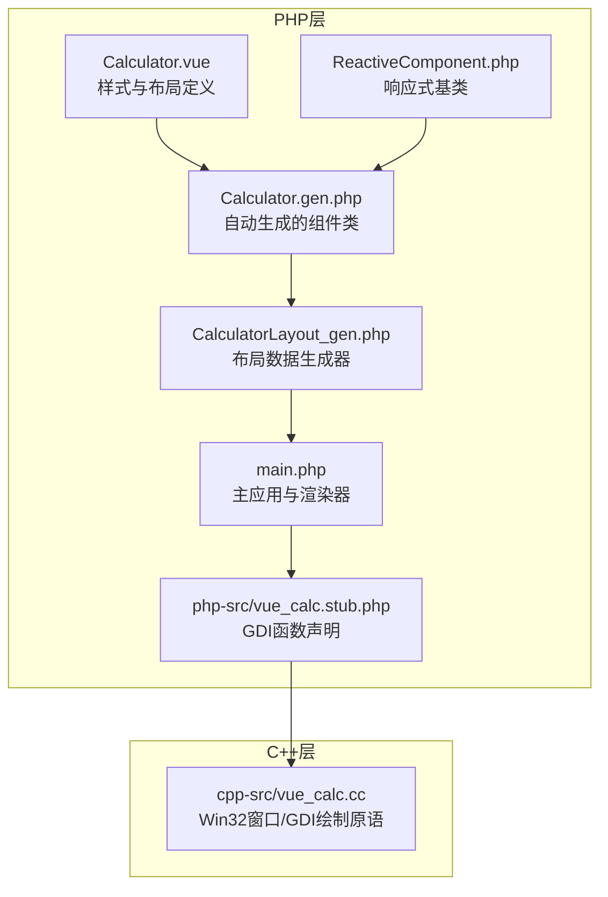
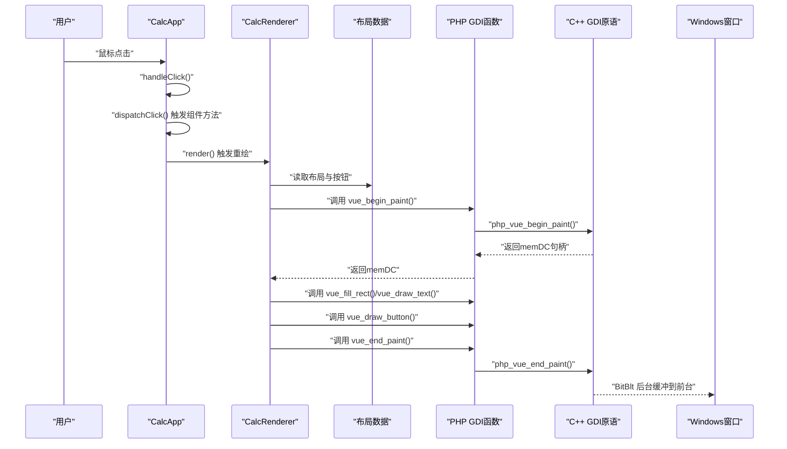
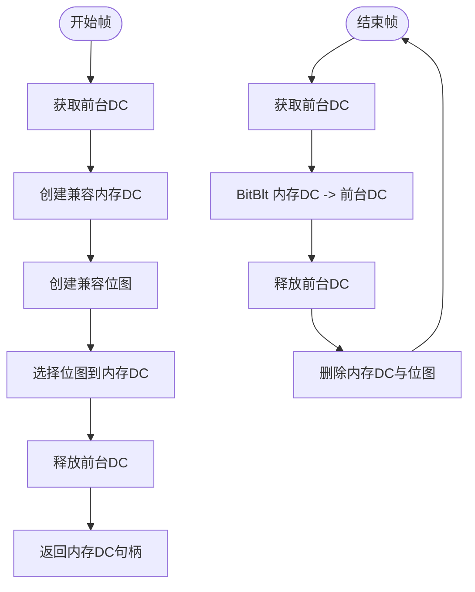
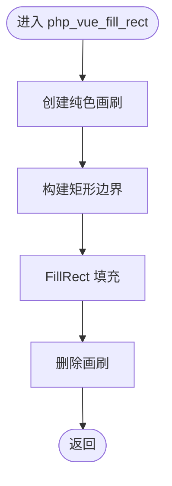
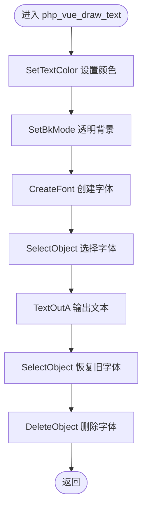
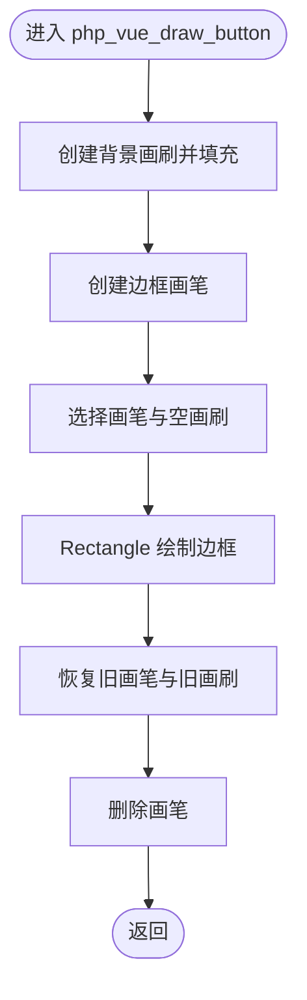
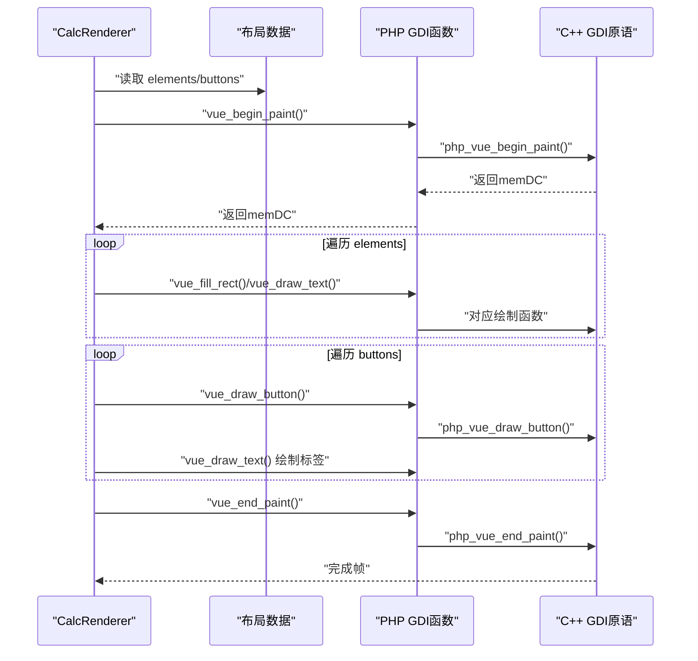
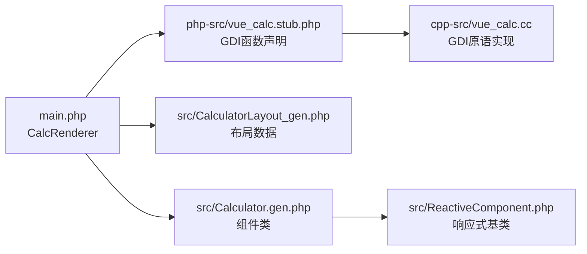

# GDI绘制API

<cite>
**本文引用的文件列表**
- [cpp-src/vue_calc.cc](file://cpp-src/vue_calc.cc)
- [php-src/vue_calc.stub.php](file://php-src/vue_calc.stub.php)
- [src/Calculator.gen.php](file://src/Calculator.gen.php)
- [src/Calculator.vue](file://src/Calculator.vue)
- [src/CalculatorLayout_gen.php](file://src/CalculatorLayout_gen.php)
- [src/ReactiveComponent.php](file://src/ReactiveComponent.php)
- [main.php](file://main.php)
</cite>

## 目录
1. [简介](#简介)
2. [项目结构](#项目结构)
3. [核心组件](#核心组件)
4. [架构总览](#架构总览)
5. [详细组件分析](#详细组件分析)
6. [依赖关系分析](#依赖关系分析)
7. [性能考量](#性能考量)
8. [故障排查指南](#故障排查指南)
9. [结论](#结论)
10. [附录](#附录)

## 简介
本技术文档聚焦于项目中的GDI绘制API封装与实现，系统性解析C++层对Windows GDI绘制原语的薄封装，涵盖：
- 双缓冲技术的实现原理与性能优势
- 绘制函数算法：矩形填充、文本绘制、按钮绘制
- 颜色空间与GDI颜色设置（RGB、SetTextColor、SetBkMode）
- 字体管理策略（CreateFont参数、粗细控制、字符集）
- 绘制性能优化最佳实践（设备上下文复用、对象选择优化、绘制顺序）

该实现采用“PHP逻辑 + C++ GDI渲染”的分层设计，通过数据驱动方式将布局与状态映射为GDI绘制命令，确保界面更新高效、稳定。

## 项目结构
项目采用“单文件组件（SFC）+ AOT编译”模式，渲染层位于C++，逻辑层位于PHP，二者通过一组约定的函数接口进行交互。

图表来源
- [src/Calculator.vue:1-215](file://src/Calculator.vue#L1-L215)
- [src/Calculator.gen.php:1-174](file://src/Calculator.gen.php#L1-L174)
- [src/CalculatorLayout_gen.php:1-296](file://src/CalculatorLayout_gen.php#L1-L296)
- [src/ReactiveComponent.php:1-35](file://src/ReactiveComponent.php#L1-L35)
- [main.php:1-291](file://main.php#L1-L291)
- [php-src/vue_calc.stub.php:1-24](file://php-src/vue_calc.stub.php#L1-L24)
- [cpp-src/vue_calc.cc:1-157](file://cpp-src/vue_calc.cc#L1-L157)

章节来源
- [src/Calculator.vue:1-215](file://src/Calculator.vue#L1-L215)
- [src/Calculator.gen.php:1-174](file://src/Calculator.gen.php#L1-L174)
- [src/CalculatorLayout_gen.php:1-296](file://src/CalculatorLayout_gen.php#L1-L296)
- [src/ReactiveComponent.php:1-35](file://src/ReactiveComponent.php#L1-L35)
- [main.php:1-291](file://main.php#L1-L291)
- [php-src/vue_calc.stub.php:1-24](file://php-src/vue_calc.stub.php#L1-L24)
- [cpp-src/vue_calc.cc:1-157](file://cpp-src/vue_calc.cc#L1-L157)

## 核心组件
- C++ GDI绘制原语层：提供窗口管理与GDI绘制API封装，包含双缓冲、矩形填充、文本绘制、按钮绘制等。
- PHP渲染器层：基于布局数据与组件状态，调用GDI函数进行绘制；仅在组件状态变更时触发重绘。
- 响应式组件基类：提供脏标记机制，确保渲染按需执行。
- 布局生成器：将SFC模板转换为布局数据，供渲染器消费。

章节来源
- [cpp-src/vue_calc.cc:1-157](file://cpp-src/vue_calc.cc#L1-L157)
- [main.php:26-133](file://main.php#L26-L133)
- [src/ReactiveComponent.php:1-35](file://src/ReactiveComponent.php#L1-L35)
- [src/CalculatorLayout_gen.php:1-296](file://src/CalculatorLayout_gen.php#L1-L296)

## 架构总览
下图展示从用户交互到GDI绘制的整体流程，以及数据驱动渲染的关键节点。

图表来源
- [main.php:171-227](file://main.php#L171-L227)
- [main.php:99-133](file://main.php#L99-L133)
- [src/CalculatorLayout_gen.php:10-296](file://src/CalculatorLayout_gen.php#L10-L296)
- [php-src/vue_calc.stub.php:18-23](file://php-src/vue_calc.stub.php#L18-L23)
- [cpp-src/vue_calc.cc:90-117](file://cpp-src/vue_calc.cc#L90-L117)

## 详细组件分析

### 双缓冲实现与性能优势
- 实现原理
  - 开始帧：获取前台DC，创建兼容内存DC与位图，选择位图至内存DC，释放前台DC，返回内存DC句柄。
  - 结束帧：获取前台DC，将内存DC内容以SRCCOPY方式Blit至前台DC，释放前台DC，删除内存DC与位图对象。
- 性能优势
  - 消除闪烁：先在内存缓冲区完成绘制，再一次性提交到屏幕，避免逐元素绘制导致的闪烁。
  - 提升吞吐：减少对前台DC的频繁访问，降低与系统窗口管理器交互的开销。
  - 便于批处理：同一帧内可多次调用绘制函数，最终一次性呈现。

图表来源
- [cpp-src/vue_calc.cc:90-117](file://cpp-src/vue_calc.cc#L90-L117)

章节来源
- [cpp-src/vue_calc.cc:90-117](file://cpp-src/vue_calc.cc#L90-L117)

### 矩形填充算法（php_vue_fill_rect）
- 输入参数：设备上下文句柄、矩形位置与尺寸、RGB颜色值
- 算法步骤
  - 使用RGB颜色值创建纯色画刷
  - 定义矩形边界
  - 调用填充函数完成绘制
  - 删除临时画刷对象
- 关键点
  - 颜色值以RGB形式传入，底层由GDI内部转换为设备颜色格式
  - 画刷在使用后立即释放，避免资源泄漏

图表来源
- [cpp-src/vue_calc.cc:120-125](file://cpp-src/vue_calc.cc#L120-L125)

章节来源
- [cpp-src/vue_calc.cc:120-125](file://cpp-src/vue_calc.cc#L120-L125)

### 文本绘制算法（php_vue_draw_text）
- 输入参数：设备上下文句柄、文本位置、文本内容、字号、RGB颜色、粗细标志
- 算法步骤
  - 设置文本颜色（SetTextColor）
  - 设置背景模式为透明（SetBkMode）
  - 创建字体（CreateFont），参数包括字号、粗细、字符集等
  - 选择字体到设备上下文，输出文本（TextOutA）
  - 恢复旧字体并删除新建字体
- 关键点
  - 字体粗细通过粗细枚举控制
  - 字符集使用默认字符集，确保多语言字符显示
  - 文本背景透明，避免覆盖已有内容

图表来源
- [cpp-src/vue_calc.cc:127-139](file://cpp-src/vue_calc.cc#L127-L139)

章节来源
- [cpp-src/vue_calc.cc:127-139](file://cpp-src/vue_calc.cc#L127-L139)

### 按钮绘制算法（php_vue_draw_button）
- 输入参数：设备上下文句柄、按钮位置与尺寸、背景色、边框色
- 算法步骤
  - 使用背景色创建画刷并填充矩形
  - 使用边框色创建画笔，设置无填充画刷，绘制矩形边框
  - 恢复旧画笔与旧画刷，删除临时对象
- 关键点
  - 背景色与边框色均以RGB形式传入
  - 通过NULL_BRUSH实现空心矩形，仅绘制边框

图表来源
- [cpp-src/vue_calc.cc:141-156](file://cpp-src/vue_calc.cc#L141-L156)

章节来源
- [cpp-src/vue_calc.cc:141-156](file://cpp-src/vue_calc.cc#L141-L156)

### 颜色空间与GDI颜色设置
- 颜色值传递
  - RGB颜色值以整型形式传入，底层由GDI内部转换为设备颜色格式
- 文本颜色与背景
  - 使用SetTextColor设置文本颜色
  - 使用SetBkMode设置背景模式为透明，避免文本背景覆盖
- 字体颜色
  - 字体颜色由文本颜色统一控制，无需额外设置

章节来源
- [cpp-src/vue_calc.cc:127-139](file://cpp-src/vue_calc.cc#L127-L139)

### 字体管理策略
- 字体创建参数
  - 字号：由外部传入，支持动态调整
  - 粗细：通过粗细枚举控制，支持常规与加粗
  - 字符集：使用默认字符集，适配多语言
  - 输出精度与裁剪精度：使用默认精度
  - 质量：使用默认质量
  - 倾斜与族：使用默认族与倾斜
  - 字体名：固定为系统常用字体
- 粗细控制
  - 通过布尔标志切换粗细，简化调用端逻辑
- 字符集处理
  - 默认字符集确保常见字符集显示正常

章节来源
- [cpp-src/vue_calc.cc:131-134](file://cpp-src/vue_calc.cc#L131-L134)

### 数据驱动渲染流程
- 渲染入口
  - 渲染器在组件状态变更后调用begin_paint，随后遍历布局元素与按钮，依次调用相应GDI函数
- 文本渲染
  - 支持动态字号与对齐（右对齐时根据容器宽度与字符长度计算偏移）
- 按钮渲染
  - 先绘制背景与边框，再在中心绘制标签文本

图表来源
- [main.php:99-133](file://main.php#L99-L133)
- [src/CalculatorLayout_gen.php:10-296](file://src/CalculatorLayout_gen.php#L10-L296)
- [php-src/vue_calc.stub.php:18-23](file://php-src/vue_calc.stub.php#L18-L23)
- [cpp-src/vue_calc.cc:90-117](file://cpp-src/vue_calc.cc#L90-L117)

章节来源
- [main.php:99-133](file://main.php#L99-L133)
- [src/CalculatorLayout_gen.php:10-296](file://src/CalculatorLayout_gen.php#L10-L296)

## 依赖关系分析
- 组件耦合
  - PHP渲染器依赖布局数据与GDI函数声明
  - GDI函数声明与C++实现一一对应
  - C++层不依赖PHP，保持薄封装
- 外部依赖
  - Windows GDI API（设备上下文、位图、画刷、画笔、字体）
  - Windows消息循环与窗口过程

图表来源
- [main.php:26-133](file://main.php#L26-L133)
- [php-src/vue_calc.stub.php:1-24](file://php-src/vue_calc.stub.php#L1-L24)
- [cpp-src/vue_calc.cc:1-157](file://cpp-src/vue_calc.cc#L1-L157)
- [src/CalculatorLayout_gen.php:1-296](file://src/CalculatorLayout_gen.php#L1-L296)
- [src/Calculator.gen.php:1-174](file://src/Calculator.gen.php#L1-L174)
- [src/ReactiveComponent.php:1-35](file://src/ReactiveComponent.php#L1-L35)

章节来源
- [main.php:26-133](file://main.php#L26-L133)
- [php-src/vue_calc.stub.php:1-24](file://php-src/vue_calc.stub.php#L1-L24)
- [cpp-src/vue_calc.cc:1-157](file://cpp-src/vue_calc.cc#L1-L157)
- [src/CalculatorLayout_gen.php:1-296](file://src/CalculatorLayout_gen.php#L1-L296)
- [src/Calculator.gen.php:1-174](file://src/Calculator.gen.php#L1-L174)
- [src/ReactiveComponent.php:1-35](file://src/ReactiveComponent.php#L1-L35)

## 性能考量
- 设备上下文复用
  - 使用内存DC进行批量绘制，避免频繁获取前台DC
  - 结束帧一次性BitBlt，减少系统调用次数
- 对象选择优化
  - 仅在必要时创建临时对象（画刷、画笔、字体），使用后立即删除
  - 文本绘制中先保存旧对象，再恢复，避免污染设备上下文状态
- 绘制顺序优化
  - 先绘制背景矩形，再绘制按钮与文本，确保层次清晰
  - 文本对齐计算在CPU侧完成，减少GDI复杂度
- 脏标记机制
  - 仅在组件状态变更时触发渲染，避免无效重绘

[本节为通用性能建议，不直接分析具体文件]

## 故障排查指南
- 绘制闪烁
  - 确认使用了双缓冲流程（begin_paint/end_paint）
  - 检查是否在前台DC上直接绘制
- 文本未显示或颜色异常
  - 检查SetTextColor与SetBkMode设置
  - 确认字体创建成功且被正确选择
- 按钮边框缺失
  - 检查画笔创建与选择，确认使用NULL_BRUSH
- 资源泄漏
  - 确保每次创建的画刷、画笔、字体在使用后删除
- 布局错位
  - 检查布局数据中的坐标与容器尺寸
  - 文本右对齐时的宽度计算是否正确

章节来源
- [cpp-src/vue_calc.cc:90-156](file://cpp-src/vue_calc.cc#L90-L156)
- [main.php:99-133](file://main.php#L99-L133)

## 结论
本项目通过C++薄封装Windows GDI原语，结合PHP数据驱动渲染，实现了高性能、低耦合的桌面界面。双缓冲技术有效消除了闪烁，矩形填充、文本绘制与按钮绘制的算法简洁明确，颜色与字体管理策略保证了显示一致性。配合脏标记机制与合理的对象生命周期管理，整体渲染性能与可维护性得到平衡。

[本节为总结性内容，不直接分析具体文件]

## 附录
- 函数命名规范
  - PHP层以vue_开头，C++层以php_vue_开头
- 关键流程
  - 窗口创建与消息循环
  - 双缓冲帧开始与结束
  - 绘制函数调用序列

章节来源
- [php-src/vue_calc.stub.php:1-24](file://php-src/vue_calc.stub.php#L1-L24)
- [cpp-src/vue_calc.cc:36-84](file://cpp-src/vue_calc.cc#L36-L84)
- [cpp-src/vue_calc.cc:90-156](file://cpp-src/vue_calc.cc#L90-L156)
- [main.php:171-227](file://main.php#L171-L227)