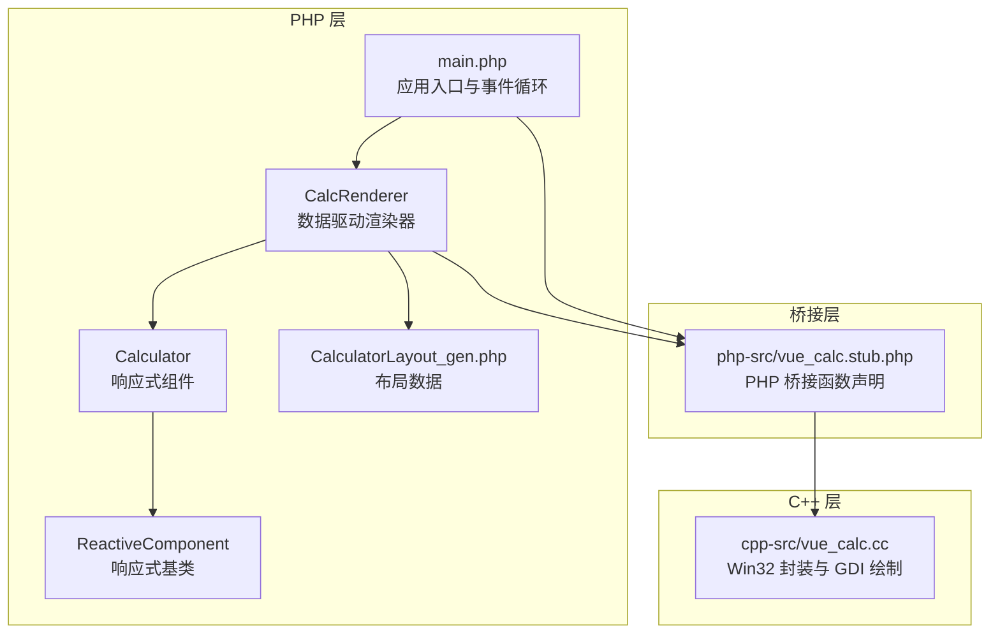
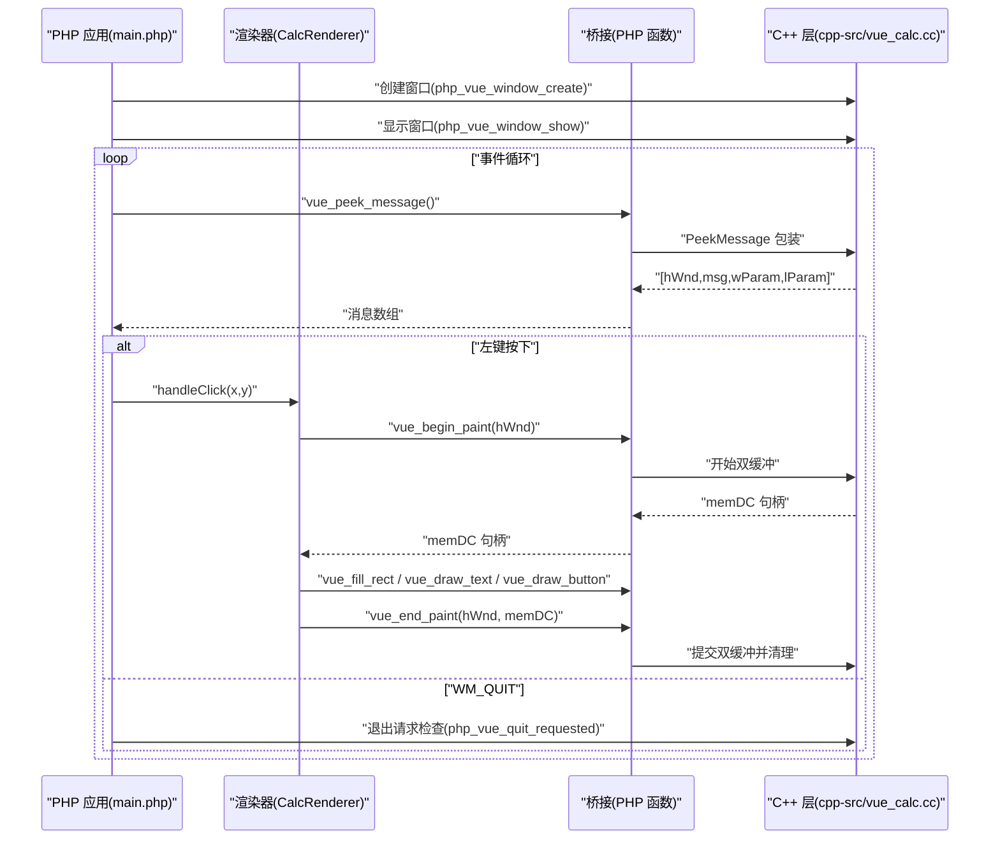
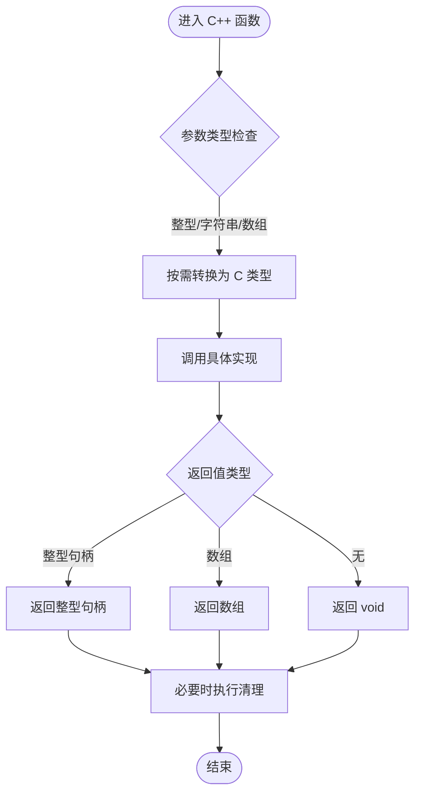
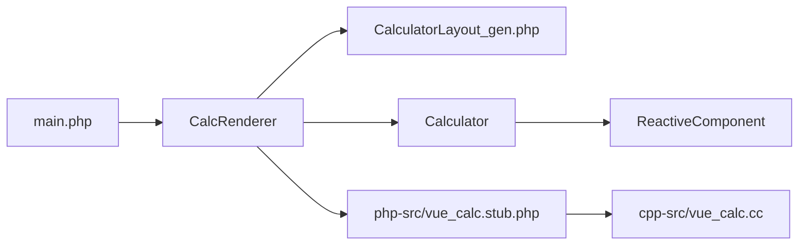

# PHP-C++桥接接口

<cite>
**本文引用的文件**
- [cpp-src/vue_calc.cc](file://cpp-src/vue_calc.cc)
- [php-src/vue_calc.stub.php](file://php-src/vue_calc.stub.php)
- [main.php](file://main.php)
- [src/Calculator.gen.php](file://src/Calculator.gen.php)
- [src/CalculatorLayout_gen.php](file://src/CalculatorLayout_gen.php)
- [src/ReactiveComponent.php](file://src/ReactiveComponent.php)
- [tools/sfc-compiler.php](file://tools/sfc-compiler.php)
- [tests/sfc-compiler-test.php](file://tests/sfc-compiler-test.php)
- [tests/verify-layout.php](file://tests/verify-layout.php)
- [project.yml](file://project.yml)
</cite>

## 目录
1. [简介](#简介)
2. [项目结构](#项目结构)
3. [核心组件](#核心组件)
4. [架构总览](#架构总览)
5. [详细组件分析](#详细组件分析)
6. [依赖关系分析](#依赖关系分析)
7. [性能考量](#性能考量)
8. [故障排查指南](#故障排查指南)
9. [结论](#结论)
10. [附录](#附录)

## 简介
本项目通过 PHP 与 C++ 的桥接接口，实现了“类 Vue 数据驱动”的桌面计算器应用。其中：
- C++ 层仅提供 Win32 API 的薄封装，负责窗口管理与 GDI 绘制原语。
- PHP 层实现响应式组件、布局数据驱动渲染以及事件循环。
- 通过统一的桥接函数名约定与类型映射，实现 PHP 与 C++ 的稳定交互。

## 项目结构
- cpp-src：C++ 桥接实现，包含窗口与 GDI 绘制函数。
- php-src：PHP 桥接函数的 stub 声明，定义函数签名与命名规范。
- src：SFC 编译生成的布局与组件代码，以及响应式基类。
- tools：SFC 编译器与验证工具。
- tests：编译器单元测试与布局校验脚本。
- main.php：应用入口与主事件循环，协调窗口、渲染与事件处理。

图表来源
- [main.php:1-291](file://main.php#L1-L291)
- [src/Calculator.gen.php:1-174](file://src/Calculator.gen.php#L1-L174)
- [src/CalculatorLayout_gen.php:1-296](file://src/CalculatorLayout_gen.php#L1-L296)
- [src/ReactiveComponent.php:1-35](file://src/ReactiveComponent.php#L1-L35)
- [php-src/vue_calc.stub.php:1-24](file://php-src/vue_calc.stub.php#L1-L24)
- [cpp-src/vue_calc.cc:1-157](file://cpp-src/vue_calc.cc#L1-L157)

章节来源
- [project.yml:1-10](file://project.yml#L1-L10)
- [main.php:1-291](file://main.php#L1-L291)

## 核心组件
- C++ 桥接函数集：窗口创建/显示、消息轮询、双缓冲绘制、矩形填充、文本绘制、按钮绘制。
- PHP 桥接声明：与 C++ 函数一一对应的 PHP 函数签名与命名规范。
- 应用渲染器：基于布局数据与组件状态，驱动 C++ GDI 完成绘制。
- 响应式组件：维护状态与脏标记，触发重绘。
- SFC 编译器：将 .vue 组件编译为布局数组与组件类，供 AOT 编译器消费。

章节来源
- [cpp-src/vue_calc.cc:35-157](file://cpp-src/vue_calc.cc#L35-L157)
- [php-src/vue_calc.stub.php:12-24](file://php-src/vue_calc.stub.php#L12-L24)
- [main.php:26-133](file://main.php#L26-L133)
- [src/Calculator.gen.php:9-174](file://src/Calculator.gen.php#L9-L174)
- [src/ReactiveComponent.php:11-35](file://src/ReactiveComponent.php#L11-L35)

## 架构总览
PHP 层负责业务逻辑与渲染调度；C++ 层提供底层窗口与绘制能力；二者通过一组桥接函数进行通信。事件循环中，PHP 从 C++ 获取消息并分发到组件处理，组件状态变更后触发渲染，渲染器调用 C++ 的绘制原语完成双缓冲绘制。

图表来源
- [main.php:152-227](file://main.php#L152-L227)
- [main.php:180-204](file://main.php#L180-L204)
- [main.php:99-132](file://main.php#L99-L132)
- [cpp-src/vue_calc.cc:35-84](file://cpp-src/vue_calc.cc#L35-L84)
- [cpp-src/vue_calc.cc:91-117](file://cpp-src/vue_calc.cc#L91-L117)
- [cpp-src/vue_calc.cc:119-156](file://cpp-src/vue_calc.cc#L119-L156)

## 详细组件分析

### C++ 桥接函数族与实现要点
- 函数命名规范
  - PHP 侧以 vue_ 开头，C++ 实现以 php_vue_ 前缀，保持一一对应。
  - 示例：php_vue_window_create ↔ vue_window_create。
- 参数类型转换与返回值处理
  - 整型：如句柄、坐标、颜色、布尔标志等，按整型传递。
  - 字符串：C++ 使用 C 风格字符串指针，PHP 传入 UTF-8 字符串。
  - 数组：C++ 返回数组或空数组，用于消息轮询结果。
- 内存管理与资源清理
  - 双缓冲：C++ 在 begin_paint 中创建 memDC 与位图，在 end_paint 中释放 memDC 与位图。
  - GDI 对象：每帧绘制中创建的刷子、画笔、字体在使用后立即删除，避免泄漏。
  - 窗口句柄：由 PHP 保存并传递给后续绘制与消息处理函数。

章节来源
- [php-src/vue_calc.stub.php:9-23](file://php-src/vue_calc.stub.php#L9-L23)
- [cpp-src/vue_calc.cc:35-57](file://cpp-src/vue_calc.cc#L35-L57)
- [cpp-src/vue_calc.cc:65-84](file://cpp-src/vue_calc.cc#L65-L84)
- [cpp-src/vue_calc.cc:91-117](file://cpp-src/vue_calc.cc#L91-L117)
- [cpp-src/vue_calc.cc:119-156](file://cpp-src/vue_calc.cc#L119-L156)

#### 函数实现与调用流程图

图表来源
- [cpp-src/vue_calc.cc:35-157](file://cpp-src/vue_calc.cc#L35-L157)

### 窗口与消息处理
- 窗口创建
  - 注册窗口类，创建窗口，返回窗口句柄。
  - 设置控制台输出编码，确保文本渲染正确。
- 显示窗口
  - 通过 ShowWindow 显示指定窗口。
- 退出请求
  - 通过全局标志跟踪 WM_CLOSE/WM_DESTROY，供 PHP 查询。
- 消息轮询
  - PeekMessage 包装，返回消息数组并翻译/派发消息。

章节来源
- [cpp-src/vue_calc.cc:19-33](file://cpp-src/vue_calc.cc#L19-L33)
- [cpp-src/vue_calc.cc:35-67](file://cpp-src/vue_calc.cc#L35-L67)
- [cpp-src/vue_calc.cc:69-84](file://cpp-src/vue_calc.cc#L69-L84)

### GDI 绘制原语
- 双缓冲绘制
  - begin_paint：获取客户区尺寸，创建兼容 DC 与位图，返回 memDC。
  - end_paint：将 memDC 内容 blit 至屏幕，释放 memDC 与位图。
- 填充矩形
  - 创建纯色刷子，填充指定矩形区域，立即删除刷子。
- 绘制文本
  - 设置文本颜色与透明背景，创建字体（粗细可选），绘制文本后恢复旧对象并删除字体。
- 绘制按钮
  - 先填充背景，再绘制边框，最后居中绘制标签文本。

章节来源
- [cpp-src/vue_calc.cc:91-117](file://cpp-src/vue_calc.cc#L91-L117)
- [cpp-src/vue_calc.cc:119-156](file://cpp-src/vue_calc.cc#L119-L156)

### PHP 桥接函数与调用示例
- 命名与签名
  - 与 C++ 对应的函数名与参数类型一致，便于 AOT 编译器静态绑定。
- 调用位置
  - 渲染器在每帧开始调用 begin_paint 获取 memDC，随后调用填充与绘制函数，最后调用 end_paint 提交并清理。
  - 事件循环中，通过 peek_message 获取消息并分发到组件处理。

章节来源
- [php-src/vue_calc.stub.php:12-24](file://php-src/vue_calc.stub.php#L12-L24)
- [main.php:99-132](file://main.php#L99-L132)
- [main.php:180-204](file://main.php#L180-L204)

### 数据类型映射规则
- Int：窗口句柄、坐标、尺寸、颜色、布尔标志等整型参数与返回值。
- String：文本内容，C++ 使用 C 风格字符串指针。
- Bool：退出请求标志。
- Array：消息轮询返回值，包含 [hWnd, message, wParam, lParam] 或空数组。

章节来源
- [cpp-src/vue_calc.cc:35-157](file://cpp-src/vue_calc.cc#L35-L157)
- [php-src/vue_calc.stub.php:12-24](file://php-src/vue_calc.stub.php#L12-L24)

### 内存管理与资源清理策略
- 双缓冲生命周期
  - begin_paint 创建 memDC 与位图，end_paint 释放 memDC 与位图，防止内存泄漏。
- GDI 对象生命周期
  - 每次绘制中创建的刷子、画笔、字体在使用后立即 DeleteObject/DeleteDC，避免资源泄露。
- 窗口句柄生命周期
  - 由 PHP 保存并贯穿整个渲染周期，确保后续绘制与消息处理可用。

章节来源
- [cpp-src/vue_calc.cc:91-117](file://cpp-src/vue_calc.cc#L91-L117)
- [cpp-src/vue_calc.cc:119-156](file://cpp-src/vue_calc.cc#L119-L156)

### 最佳实践与常见问题
- 最佳实践
  - 严格遵循函数命名规范，确保 PHP 与 C++ 一一对应。
  - 在渲染前调用 begin_paint 获取 memDC，在渲染完成后调用 end_paint 提交并清理。
  - 文本绘制时注意字体创建与恢复顺序，避免影响后续绘制。
  - 事件循环中优先处理消息，避免阻塞渲染。
- 常见问题
  - 文本未显示：检查字体创建与颜色设置，确认文本坐标与容器边界。
  - 绘制闪烁：确保每帧使用双缓冲，并在 end_paint 后立即释放资源。
  - 点击无效：确认消息类型与 lParam 解析正确，命中测试坐标范围。

章节来源
- [main.php:171-227](file://main.php#L171-L227)
- [main.php:229-258](file://main.php#L229-L258)

## 依赖关系分析
- PHP 应用依赖桥接函数与渲染器，渲染器依赖布局数据与组件状态。
- 渲染器通过桥接函数调用 C++ 的窗口与绘制能力。
- SFC 编译器生成布局数据与组件类，供 PHP 运行时使用。

图表来源
- [main.php:26-133](file://main.php#L26-L133)
- [src/Calculator.gen.php:9-174](file://src/Calculator.gen.php#L9-L174)
- [src/CalculatorLayout_gen.php:10-296](file://src/CalculatorLayout_gen.php#L10-L296)
- [src/ReactiveComponent.php:11-35](file://src/ReactiveComponent.php#L11-L35)
- [php-src/vue_calc.stub.php:12-24](file://php-src/vue_calc.stub.php#L12-L24)
- [cpp-src/vue_calc.cc:35-157](file://cpp-src/vue_calc.cc#L35-L157)

章节来源
- [main.php:1-291](file://main.php#L1-L291)
- [src/Calculator.gen.php:1-174](file://src/Calculator.gen.php#L1-L174)
- [src/CalculatorLayout_gen.php:1-296](file://src/CalculatorLayout_gen.php#L1-L296)
- [src/ReactiveComponent.php:1-35](file://src/ReactiveComponent.php#L1-L35)
- [php-src/vue_calc.stub.php:1-24](file://php-src/vue_calc.stub.php#L1-L24)
- [cpp-src/vue_calc.cc:1-157](file://cpp-src/vue_calc.cc#L1-L157)

## 性能考量
- 双缓冲绘制：减少屏幕闪烁，提升视觉体验。
- 每帧绘制后立即释放 GDI 对象，避免累积资源占用。
- 事件循环中使用非阻塞消息轮询，保证渲染节拍稳定。
- 文本渲染根据长度动态调整字号，优化显示效果。

## 故障排查指南
- 文本不显示
  - 检查颜色设置与透明度配置。
  - 确认字体创建成功且坐标在可见范围内。
- 绘制异常
  - 确保 begin_paint 与 end_paint 成对调用。
  - 检查 memDC 与位图是否正确创建与释放。
- 点击无响应
  - 核对消息类型与 lParam 解析逻辑。
  - 确认按钮坐标与命中测试范围。

章节来源
- [main.php:180-204](file://main.php#L180-L204)
- [main.php:229-258](file://main.php#L229-L258)
- [cpp-src/vue_calc.cc:91-117](file://cpp-src/vue_calc.cc#L91-L117)
- [cpp-src/vue_calc.cc:119-156](file://cpp-src/vue_calc.cc#L119-L156)

## 结论
该桥接接口通过清晰的命名规范与类型映射，将 PHP 的响应式逻辑与 C++ 的 Win32/GDI 能力有机结合。配合 SFC 编译器生成的布局数据，实现了高性能、可维护的数据驱动桌面应用。遵循资源清理与双缓冲绘制的最佳实践，可获得稳定的运行表现。

## 附录
- SFC 编译器与验证
  - 编译器将 .vue 组件解析为 AST 并生成布局数组与组件类。
  - AOT 验证确保生成代码满足编译器约束。
- 测试与验证
  - 单元测试覆盖 CSS 映射、模板解析、AST 降级与 AOT 验证。
  - 布局验证脚本核对生成布局数据的准确性。

章节来源
- [tools/sfc-compiler.php:1-210](file://tools/sfc-compiler.php#L1-L210)
- [tests/sfc-compiler-test.php:1-365](file://tests/sfc-compiler-test.php#L1-L365)
- [tests/verify-layout.php:1-72](file://tests/verify-layout.php#L1-L72)