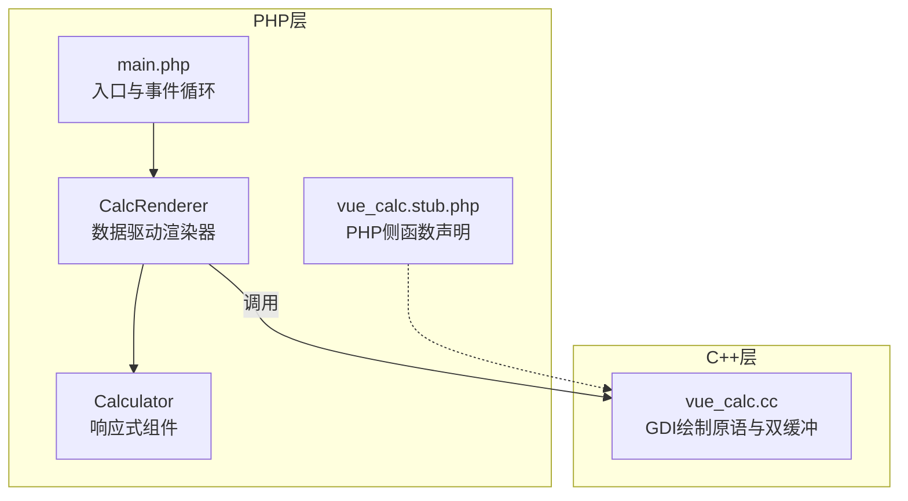
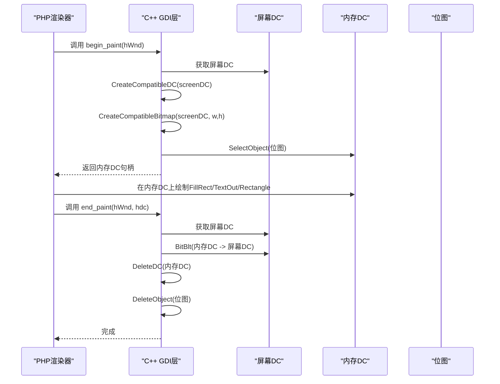
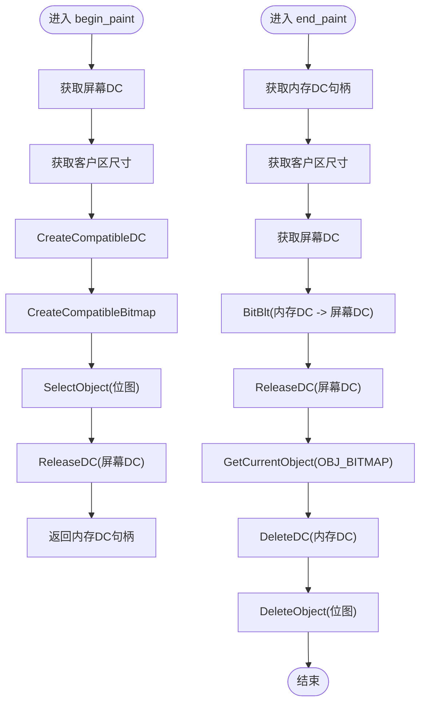
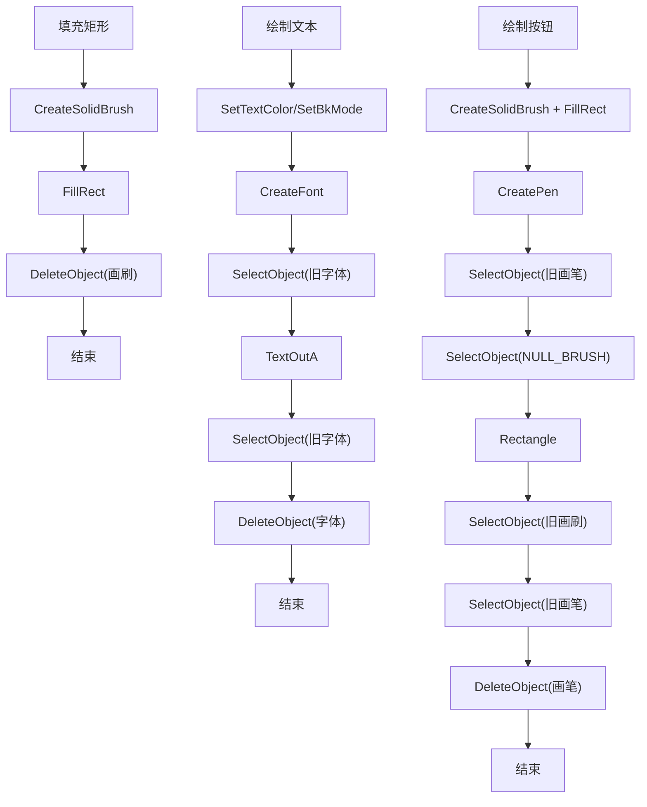
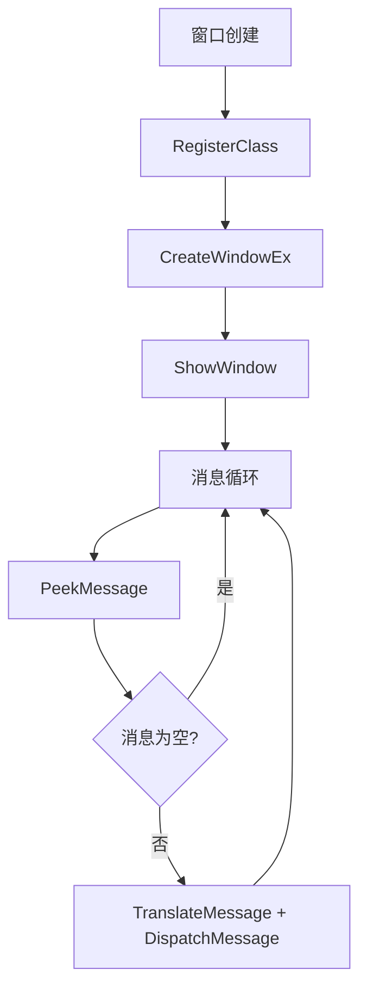
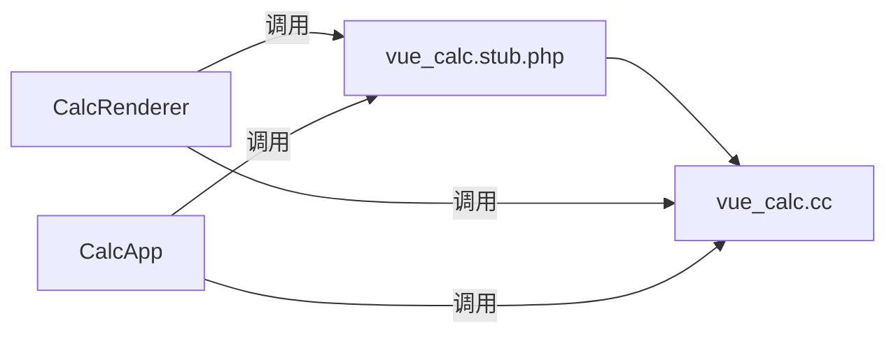

# 内存管理策略

<cite>
**本文引用的文件**
- [vue_calc.cc](file://cpp-src/vue_calc.cc)
- [main.php](file://main.php)
- [vue_calc.stub.php](file://php-src/vue_calc.stub.php)
- [Calculator.gen.php](file://src/Calculator.gen.php)
- [Calculator.vue](file://src/Calculator.vue)
- [开发经验与教训.md](file://开发经验与教训.md)
- [开发经验与教训_v2.md](file://开发经验与教训_v2.md)
- [project.yml](file://project.yml)
</cite>

## 目录
1. [引言](#引言)
2. [项目结构](#项目结构)
3. [核心组件](#核心组件)
4. [架构总览](#架构总览)
5. [详细组件分析](#详细组件分析)
6. [依赖关系分析](#依赖关系分析)
7. [性能考量](#性能考量)
8. [故障排查指南](#故障排查指南)
9. [结论](#结论)
10. [附录](#附录)

## 引言
本文件聚焦于C++层内存管理策略，围绕Windows GDI对象的生命周期管理展开，重点覆盖：
- GDI对象的创建与销毁时机：HDC设备上下文、HBITMAP位图、HFONT字体、HBRUSH画刷、HPEN画笔
- 双缓冲技术中的内存分配策略：CreateCompatibleDC、CreateCompatibleBitmap的使用，以及在php_vue_begin_paint与php_vue_end_paint中如何正确管理内存资源
- 内存泄漏预防措施：DeleteDC、DeleteObject等清理函数的调用时机
- 内存管理最佳实践：RAII模式的应用与异常安全保证
- Windows GDI对象的引用计数机制与资源回收策略

## 项目结构
该项目采用“PHP逻辑 + C++ GDI渲染”的混合架构，其中C++层仅提供薄封装的Win32 API与GDI绘制原语，渲染调度由PHP端负责。关键文件与职责如下：
- C++层：封装窗口管理与GDI绘制原语，提供begin_paint/end_paint双缓冲接口
- PHP层：响应式组件、渲染器、主事件循环，负责脏标记与按需重绘
- SFC编译器：将.vue组件编译为静态布局数据，供渲染器消费

图表来源
- [main.php:139-227](file://main.php#L139-L227)
- [vue_calc.cc:90-117](file://cpp-src/vue_calc.cc#L90-L117)
- [vue_calc.stub.php:12-23](file://php-src/vue_calc.stub.php#L12-L23)

章节来源
- [project.yml:1-10](file://project.yml#L1-L10)
- [main.php:139-227](file://main.php#L139-L227)
- [vue_calc.cc:90-117](file://cpp-src/vue_calc.cc#L90-L117)
- [vue_calc.stub.php:12-23](file://php-src/vue_calc.stub.php#L12-L23)

## 核心组件
- 窗口与消息处理：窗口创建、显示、消息轮询与退出请求检测
- 双缓冲绘制：begin_paint创建内存DC与位图，end_paint将后台缓冲blit到前台并释放资源
- 绘制原语：填充矩形、绘制文本、绘制按钮（背景+边框）
- 事件循环：批量处理消息，按脏标记触发渲染，维持约60FPS

章节来源
- [vue_calc.cc:36-84](file://cpp-src/vue_calc.cc#L36-L84)
- [vue_calc.cc:90-117](file://cpp-src/vue_calc.cc#L90-L117)
- [vue_calc.cc:119-156](file://cpp-src/vue_calc.cc#L119-L156)
- [main.php:171-227](file://main.php#L171-L227)

## 架构总览
C++层提供GDI绘制原语，PHP层负责数据与渲染调度。渲染流程如下：
- PHP侧调用begin_paint获取内存DC句柄
- 在内存DC上执行绘制（填充矩形、绘制文本、绘制按钮）
- 调用end_paint将内存DC内容一次性blit到屏幕，并释放内存DC与位图

图表来源
- [vue_calc.cc:90-117](file://cpp-src/vue_calc.cc#L90-L117)
- [main.php:99-132](file://main.php#L99-L132)

## 详细组件分析

### 双缓冲绘制组件
- begin_paint：获取屏幕DC，创建兼容DC与兼容位图，选择位图到内存DC，释放屏幕DC后返回内存DC句柄
- end_paint：获取屏幕DC，将内存DC内容一次性blit到屏幕，释放屏幕DC；随后查询当前选入的位图并删除内存DC与位图对象

图表来源
- [vue_calc.cc:90-117](file://cpp-src/vue_calc.cc#L90-L117)

章节来源
- [vue_calc.cc:90-117](file://cpp-src/vue_calc.cc#L90-L117)

### 绘制原语组件
- 填充矩形：创建实心画刷，调用FillRect，立即DeleteObject释放画刷
- 绘制文本：设置文本颜色与透明背景，创建字体，选择字体到DC，绘制文本后恢复旧字体并DeleteObject释放字体
- 绘制按钮：先填充背景（实心画刷），再绘制边框（画笔+空画刷），最后恢复旧画刷与旧画笔并DeleteObject释放画笔

图表来源
- [vue_calc.cc:119-156](file://cpp-src/vue_calc.cc#L119-L156)

章节来源
- [vue_calc.cc:119-156](file://cpp-src/vue_calc.cc#L119-L156)

### 窗口与消息处理组件
- 窗口创建：注册窗口类，创建窗口，返回hWnd
- 显示窗口：ShowWindow
- 退出请求：全局标志g_quitRequested，WM_CLOSE/WM_DESTROY时置位并PostQuitMessage
- 消息轮询：PeekMessage封装，返回数组或空数组，翻译并分发消息

图表来源
- [vue_calc.cc:36-84](file://cpp-src/vue_calc.cc#L36-L84)

章节来源
- [vue_calc.cc:36-84](file://cpp-src/vue_calc.cc#L36-L84)

### 内存泄漏预防与清理时机
- 内存DC与位图：begin_paint创建内存DC与位图，end_paint中DeleteDC与DeleteObject释放
- 临时GDI对象：FillRect/CreateSolidBrush、DrawText/CreateFont、DrawButton/CreatePen均在使用后立即DeleteObject
- 旧对象恢复：SelectObject替换后，应在后续绘制前恢复旧对象，避免悬挂引用

章节来源
- [vue_calc.cc:90-117](file://cpp-src/vue_calc.cc#L90-L117)
- [vue_calc.cc:119-156](file://cpp-src/vue_calc.cc#L119-L156)

### RAII模式与异常安全
- 当前实现采用“即时创建、即时释放”的模式，确保每个临时GDI对象在创建后尽快释放，避免跨函数边界持有句柄
- 若需引入RAII，可在C++层封装轻量RAII类，将HGDIOBJ与DeleteObject绑定，利用析构函数自动释放
- 异常安全建议：在begin_paint中捕获Win32 API异常，确保即使失败也能释放已获取的资源；在end_paint中保证DeleteDC/DeleteObject的调用顺序与条件判断

章节来源
- [vue_calc.cc:90-117](file://cpp-src/vue_calc.cc#L90-L117)
- [vue_calc.cc:119-156](file://cpp-src/vue_calc.cc#L119-L156)

### Windows GDI对象引用计数与资源回收
- GDI对象通常由内核维护引用计数，句柄本身不直接持有对象数据
- DeleteDC/DeleteObject会减少引用计数，当计数归零时内核回收资源
- 选择对象（SelectObject）会替换当前选入的对象，旧对象需在后续恢复或释放
- GetCurrentObject可用于查询当前选入的位图，便于end_paint中统一释放

章节来源
- [vue_calc.cc:114-116](file://cpp-src/vue_calc.cc#L114-L116)

## 依赖关系分析
- PHP层通过stub函数与C++层交互，函数命名约定为vue_*（PHP）对应php_vue_*（C++）
- 渲染器在render中调用begin_paint与end_paint，中间执行多个绘制原语
- 事件循环在消息清空后检查脏标记，触发渲染

图表来源
- [vue_calc.stub.php:12-23](file://php-src/vue_calc.stub.php#L12-L23)
- [main.php:99-132](file://main.php#L99-L132)
- [vue_calc.cc:90-117](file://cpp-src/vue_calc.cc#L90-L117)

章节来源
- [vue_calc.stub.php:12-23](file://php-src/vue_calc.stub.php#L12-L23)
- [main.php:99-132](file://main.php#L99-L132)
- [vue_calc.cc:90-117](file://cpp-src/vue_calc.cc#L90-L117)

## 性能考量
- 双缓冲避免闪烁，一次性BitBlt减少屏幕更新次数
- 临时GDI对象在使用后立即释放，降低内存峰值
- 事件循环采用批量消息处理与固定帧率sleep，平衡CPU占用与响应性

章节来源
- [vue_calc.cc:90-117](file://cpp-src/vue_calc.cc#L90-L117)
- [main.php:171-227](file://main.php#L171-L227)

## 故障排查指南
- 位图未释放：若end_paint中未DeleteObject位图，可能导致内存泄漏
- 旧对象未恢复：SelectObject后未恢复旧对象，可能影响后续绘制
- 临时对象未释放：FillRect/CreateSolidBrush、DrawText/CreateFont、DrawButton/CreatePen等未DeleteObject
- 资源未成对释放：CreateCompatibleDC未DeleteDC，CreateCompatibleBitmap未DeleteObject

章节来源
- [vue_calc.cc:114-116](file://cpp-src/vue_calc.cc#L114-L116)
- [vue_calc.cc:119-156](file://cpp-src/vue_calc.cc#L119-L156)

## 结论
本项目在C++层实现了清晰的GDI资源生命周期管理：双缓冲绘制在begin_paint与end_paint之间形成完整的资源获取与释放闭环；临时GDI对象在创建后立即释放，有效避免内存泄漏；通过合理的清理顺序与条件判断，确保资源回收的可靠性。为进一步增强异常安全性，可在C++层引入轻量RAII封装，使资源管理更加稳健。

## 附录
- GDI对象生命周期与清理清单
  - 内存DC：CreateCompatibleDC → DeleteDC
  - 位图：CreateCompatibleBitmap → DeleteObject
  - 画刷：CreateSolidBrush → DeleteObject
  - 字体：CreateFont → DeleteObject
  - 画笔：CreatePen → DeleteObject
- 双缓冲流程要点
  - 在begin_paint中创建内存DC与位图，并选择位图到内存DC
  - 在end_paint中一次性blit到屏幕，随后DeleteDC与DeleteObject位图
  - 临时对象在使用后立即释放，避免跨作用域持有句柄