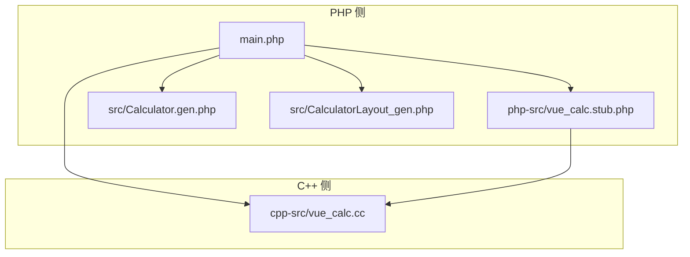
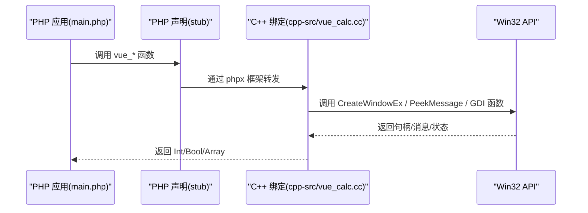
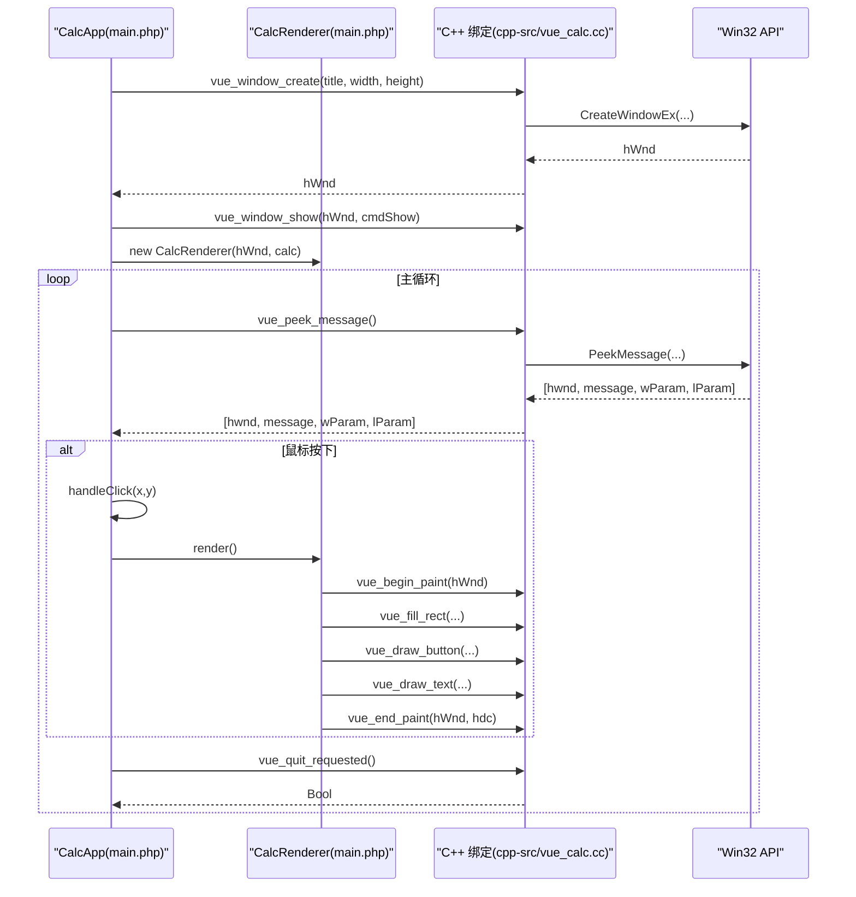
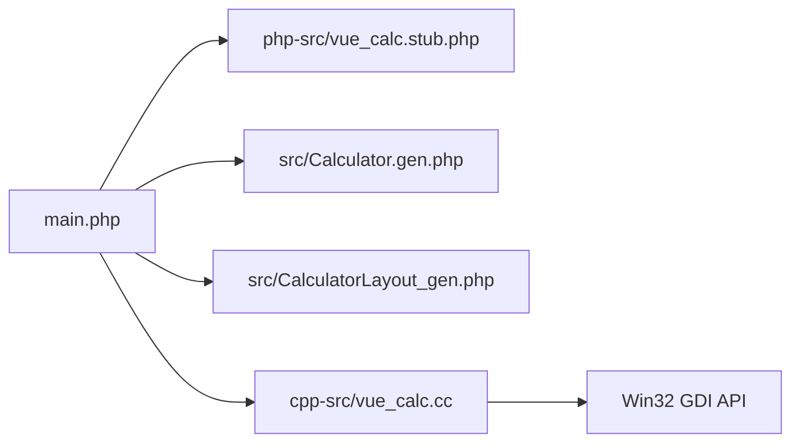

# 函数绑定接口

<cite>
**本文引用的文件**
- [cpp-src/vue_calc.cc](file://cpp-src/vue_calc.cc)
- [php-src/vue_calc.stub.php](file://php-src/vue_calc.stub.php)
- [main.php](file://main.php)
- [src/Calculator.gen.php](file://src/Calculator.gen.php)
- [src/CalculatorLayout_gen.php](file://src/CalculatorLayout_gen.php)
- [project.yml](file://project.yml)
- [VueCalc技术规划文档_v3.html](file://VueCalc技术规划文档_v3.html)
</cite>

## 目录
1. [简介](#简介)
2. [项目结构](#项目结构)
3. [核心组件](#核心组件)
4. [架构总览](#架构总览)
5. [详细组件分析](#详细组件分析)
6. [依赖关系分析](#依赖关系分析)
7. [性能考量](#性能考量)
8. [故障排查指南](#故障排查指南)
9. [结论](#结论)
10. [附录](#附录)

## 简介
本文件系统性梳理了 VueCalc 项目中的 PHP-C++ 函数绑定接口，重点围绕 phpx 框架如何将 C++ 函数暴露给 PHP 调用，并详细说明函数命名规范（PHP 中以 vue_ 开头，C++ 实现以 php_vue_ 前缀）、参数传递与返回值包装机制、以及各绑定函数的职责与实现要点。文档覆盖以下函数：
- 窗口与消息：php_vue_window_create、php_vue_window_show、php_vue_quit_requested、php_vue_peek_message
- 绘制原语：php_vue_begin_paint、php_vue_end_paint、php_vue_fill_rect、php_vue_draw_text、php_vue_draw_button

同时给出函数签名映射规则、调用示例路径与错误处理策略，帮助开发者快速理解并正确使用该接口。

## 项目结构
该项目采用“SFC 编译 + AOT”的流水线，将 .vue 组件编译为 .gen.php，再由 phpx 框架将 C++ 绘制层函数绑定到 PHP，形成“PHP 逻辑 + C++ GDI 渲染”的混合架构。关键目录与文件如下：
- cpp-src：C++ 绘制与窗口层实现，包含所有 php_vue_* 函数
- php-src：PHP 侧函数声明 stub，定义 PHP 调用接口
- src：SFC 编译生成的组件与布局数据
- main.php：主应用入口，组织事件循环与渲染
- project.yml：构建配置，声明源码来源

图表来源
- [main.php:1-291](file://main.php#L1-L291)
- [php-src/vue_calc.stub.php:1-24](file://php-src/vue_calc.stub.php#L1-L24)
- [cpp-src/vue_calc.cc:1-157](file://cpp-src/vue_calc.cc#L1-L157)
- [src/Calculator.gen.php:1-174](file://src/Calculator.gen.php#L1-L174)
- [src/CalculatorLayout_gen.php:1-200](file://src/CalculatorLayout_gen.php#L1-L200)

章节来源
- [project.yml:1-10](file://project.yml#L1-L10)
- [main.php:1-291](file://main.php#L1-L291)

## 核心组件
- 窗口与消息层：负责窗口创建、显示、退出状态检查与消息轮询
- 绘制原语层：提供双缓冲绘制、矩形填充、文本绘制、按钮绘制等基础图形操作
- 应用控制层：在 PHP 侧组织事件循环、响应式渲染与 C++ 绘制调用

章节来源
- [cpp-src/vue_calc.cc:15-157](file://cpp-src/vue_calc.cc#L15-L157)
- [php-src/vue_calc.stub.php:12-24](file://php-src/vue_calc.stub.php#L12-L24)
- [main.php:26-259](file://main.php#L26-L259)

## 架构总览
下图展示了从 PHP 调用到 C++ 实现再到 Win32 API 的完整链路，以及数据在各层之间的流动。

图表来源
- [main.php:152-227](file://main.php#L152-L227)
- [cpp-src/vue_calc.cc:35-157](file://cpp-src/vue_calc.cc#L35-L157)
- [php-src/vue_calc.stub.php:12-24](file://php-src/vue_calc.stub.php#L12-L24)

## 详细组件分析

### 函数命名规范与映射规则
- PHP 调用接口以 vue_ 开头，例如 vue_window_create、vue_peek_message
- C++ 实际实现以 php_vue_ 前缀，例如 php_vue_window_create、php_vue_peek_message
- phpx.h 提供类型系统与自动转换，PHP 参数在进入 C++ 时被转换为 Int/Bool/String/Array 等类型；C++ 返回值会被自动装箱为 PHP 可识别的 Variant

章节来源
- [php-src/vue_calc.stub.php:9-10](file://php-src/vue_calc.stub.php#L9-L10)
- [VueCalc技术规划文档_v3.html:1205-1236](file://VueCalc技术规划文档_v3.html#L1205-L1236)

### 窗口与消息函数族

#### php_vue_window_create
- 职责：注册窗口类、创建窗口并返回窗口句柄
- 参数映射：title(String) → 窗口标题；width/height(Int) → 窗口尺寸
- 返回值：hWnd(Int)
- 关键实现要点：设置控制台输出代码页、注册窗口类、创建窗口、返回句柄

章节来源
- [cpp-src/vue_calc.cc:35-57](file://cpp-src/vue_calc.cc#L35-L57)
- [php-src/vue_calc.stub.php:13](file://php-src/vue_calc.stub.php#L13)

#### php_vue_window_show
- 职责：显示指定窗口
- 参数映射：hWnd(Int)、cmdShow(Int) → 显示命令
- 返回值：无
- 关键实现要点：调用 ShowWindow 显示窗口

章节来源
- [cpp-src/vue_calc.cc:60-62](file://cpp-src/vue_calc.cc#L60-L62)
- [php-src/vue_calc.stub.php:14](file://php-src/vue_calc.stub.php#L14)

#### php_vue_quit_requested
- 职责：查询是否请求退出
- 参数映射：无
- 返回值：Bool
- 关键实现要点：内部静态变量跨函数共享，WM_CLOSE/WM_DESTROY 会置位退出标志

章节来源
- [cpp-src/vue_calc.cc:19-33](file://cpp-src/vue_calc.cc#L19-L33)
- [cpp-src/vue_calc.cc:65-67](file://cpp-src/vue_calc.cc#L65-L67)
- [php-src/vue_calc.stub.php:15](file://php-src/vue_calc.stub.php#L15)

#### php_vue_peek_message
- 职责：轮询并取出一条消息，返回 [hwnd, message, wParam, lParam] 或空数组
- 参数映射：无
- 返回值：Array
- 关键实现要点：PeekMessage + PM_REMOVE；TranslateMessage + DispatchMessage；返回数组便于 PHP 解包

章节来源
- [cpp-src/vue_calc.cc:70-84](file://cpp-src/vue_calc.cc#L70-L84)
- [php-src/vue_calc.stub.php:16](file://php-src/vue_calc.stub.php#L16)

### 绘制原语函数族

#### php_vue_begin_paint
- 职责：开始一帧绘制，创建内存 DC 并返回句柄
- 参数映射：hWnd(Int) → 目标窗口句柄
- 返回值：hdc(Int)
- 关键实现要点：获取客户区尺寸、创建兼容 DC 与位图、释放设备上下文

章节来源
- [cpp-src/vue_calc.cc:91-102](file://cpp-src/vue_calc.cc#L91-L102)
- [php-src/vue_calc.stub.php:19](file://php-src/vue_calc.stub.php#L19)

#### php_vue_end_paint
- 职责：结束一帧绘制，将后台缓冲 blit 到前台并清理资源
- 参数映射：hWnd(Int)、hdcHandle(Int) → 窗口句柄与内存 DC 句柄
- 返回值：无
- 关键实现要点：BitBlt 前台复制、释放 DC 与位图对象

章节来源
- [cpp-src/vue_calc.cc:105-117](file://cpp-src/vue_calc.cc#L105-L117)
- [php-src/vue_calc.stub.php:20](file://php-src/vue_calc.stub.php#L20)

#### php_vue_fill_rect
- 职责：在指定 DC 上填充矩形
- 参数映射：hdc(Int)、x/y(Int)、w/h(Int)、rgb(Int) → 颜色为 BGR
- 返回值：无
- 关键实现要点：创建纯色画刷、填充矩形、释放画刷

章节来源
- [cpp-src/vue_calc.cc:120-125](file://cpp-src/vue_calc.cc#L120-L125)
- [php-src/vue_calc.stub.php:21](file://php-src/vue_calc.stub.php#L21)

#### php_vue_draw_text
- 职责：在指定 DC 上绘制文本
- 参数映射：hdc(Int)、x/y(Int)、text(String)、fontSize(Int)、rgb(Int)、bold(Int)
- 返回值：无
- 关键实现要点：设置文本颜色与透明背景、创建字体、TextOutA 输出、恢复旧对象并释放字体

章节来源
- [cpp-src/vue_calc.cc:128-139](file://cpp-src/vue_calc.cc#L128-L139)
- [php-src/vue_calc.stub.php:22](file://php-src/vue_calc.stub.php#L22)

#### php_vue_draw_button
- 职责：绘制按钮（背景填充 + 边框）
- 参数映射：hdc(Int)、x/y(Int)、w/h(Int)、bgColor(Int)、borderColor(Int)
- 返回值：无
- 关键实现要点：先填充背景画刷，再绘制矩形边框，最后恢复旧对象并释放画笔

章节来源
- [cpp-src/vue_calc.cc:142-156](file://cpp-src/vue_calc.cc#L142-L156)
- [php-src/vue_calc.stub.php:23](file://php-src/vue_calc.stub.php#L23)

### 函数签名映射与类型转换
- 参数类型转换：phpx.h 将 PHP 的 int/float/bool/string/array 转换为 C++ 的 Int/Float/Bool/String/Array/Variants
- 返回值包装：C++ 返回值自动装箱为 Variant，PHP 侧可直接接收 Int/Bool/Array
- 资源句柄：当前以整型句柄传递（HWND/HDC），未来可考虑使用 phpx 的 Box 资源包装提升类型安全

章节来源
- [VueCalc技术规划文档_v3.html:1215-1221](file://VueCalc技术规划文档_v3.html#L1215-L1221)
- [VueCalc技术规划文档_v3.html:1240-1249](file://VueCalc技术规划文档_v3.html#L1240-L1249)

### 调用序列与工作流

#### 事件循环与渲染流程

图表来源
- [main.php:152-227](file://main.php#L152-L227)
- [main.php:99-132](file://main.php#L99-L132)
- [cpp-src/vue_calc.cc:35-157](file://cpp-src/vue_calc.cc#L35-L157)

### 错误处理策略
- 窗口创建失败：返回 0，PHP 侧检测并输出错误信息
- 渲染异常：捕获 Throwable 并输出错误与堆栈
- 消息循环异常：捕获异常并记录，继续运行
- 退出条件：WM_QUIT 或 vue_quit_requested() 为真时停止循环

章节来源
- [main.php:160-163](file://main.php#L160-L163)
- [main.php:192-198](file://main.php#L192-L198)
- [main.php:215-219](file://main.php#L215-L219)
- [main.php:200-204](file://main.php#L200-L204)

## 依赖关系分析
- main.php 依赖 php-src/vue_calc.stub.php 中的函数声明，并调用 C++ 绑定函数
- 绘制层依赖 Win32 GDI API，实现双缓冲与基本图形绘制
- 布局与组件由 SFC 编译生成，CalcRenderer 读取布局数据并驱动绘制

图表来源
- [main.php:1-291](file://main.php#L1-L291)
- [cpp-src/vue_calc.cc:1-157](file://cpp-src/vue_calc.cc#L1-L157)
- [src/Calculator.gen.php:1-174](file://src/Calculator.gen.php#L1-L174)
- [src/CalculatorLayout_gen.php:1-200](file://src/CalculatorLayout_gen.php#L1-L200)

章节来源
- [main.php:1-291](file://main.php#L1-L291)
- [cpp-src/vue_calc.cc:1-157](file://cpp-src/vue_calc.cc#L1-L157)

## 性能考量
- 双缓冲绘制：通过内存 DC 与 BitBlt 减少闪烁，提高刷新效率
- 事件驱动渲染：仅在组件状态变更（dirty）时重绘，降低无效绘制
- 限帧：usleep 控制约 60 FPS，平衡 CPU 占用与流畅度
- 字号自适应：根据文本长度动态调整字号，优化显示效果

章节来源
- [main.php:101-132](file://main.php#L101-L132)
- [main.php:223-224](file://main.php#L223-L224)
- [main.php:72-78](file://main.php#L72-L78)

## 故障排查指南
- 窗口创建失败：检查返回值是否为 0，并确认标题、宽高参数有效
- 无消息响应：确保在主循环中持续调用 vue_peek_message 并处理消息类型
- 绘制不刷新：确认组件状态 dirty 已置位并在主循环中触发渲染
- 文本显示异常：检查字体大小、颜色与对齐参数，确保文本非空
- 退出不生效：确认 WM_QUIT 消息或 vue_quit_requested() 返回值

章节来源
- [main.php:160-163](file://main.php#L160-L163)
- [main.php:180-204](file://main.php#L180-L204)
- [main.php:214-221](file://main.php#L214-L221)
- [main.php:80-94](file://main.php#L80-L94)

## 结论
本项目通过 phpx 框架实现了 PHP 与 C++ 的无缝桥接，以清晰的命名规范与稳定的类型转换机制，将 Win32 绘制原语暴露给 PHP 使用。窗口与消息函数负责底层交互，绘制原语提供高效双缓冲渲染能力，配合响应式组件与布局数据，形成“数据驱动 + C++ 渲染”的桌面应用架构。建议后续探索 phpx 的资源包装与静态属性读写能力，进一步提升类型安全与性能。

## 附录

### 函数调用示例路径
- 窗口创建与显示：[main.php:152-169](file://main.php#L152-L169)
- 事件循环与消息处理：[main.php:171-227](file://main.php#L171-L227)
- 首帧渲染与重绘：[main.php:175-221](file://main.php#L175-L221)
- 绘制流程（begin/end + fill_rect/button/text）：[main.php:99-132](file://main.php#L99-L132)

### 关键数据模型
- 布局数据结构：包含 elements/buttons 等字段，用于 CalcRenderer 驱动绘制
- 组件状态：Calculator.gen.php 中的 display/expression 等属性，通过 dirty 触发重绘

章节来源
- [src/CalculatorLayout_gen.php:10-58](file://src/CalculatorLayout_gen.php#L10-L58)
- [src/Calculator.gen.php:9-174](file://src/Calculator.gen.php#L9-L174)