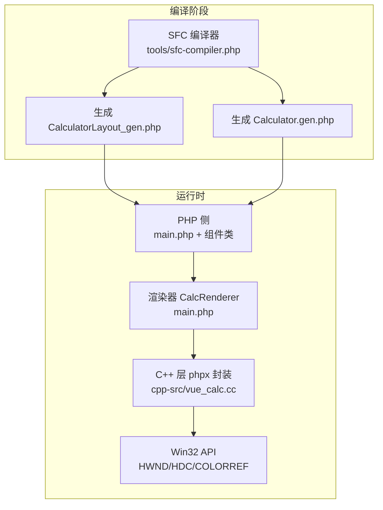
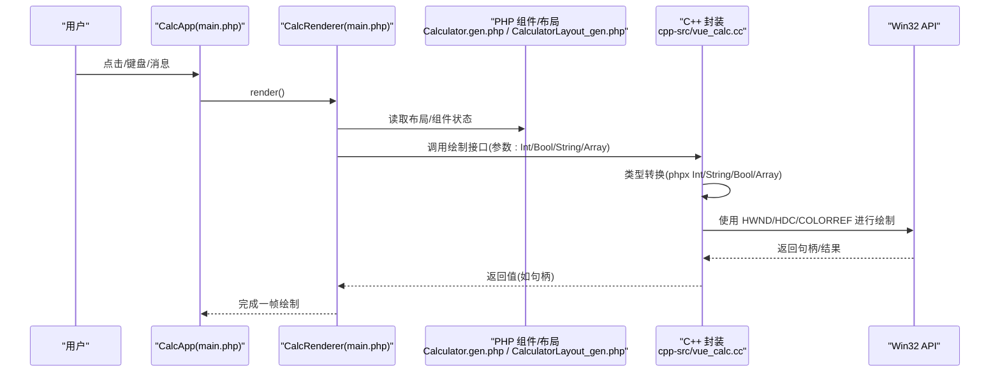
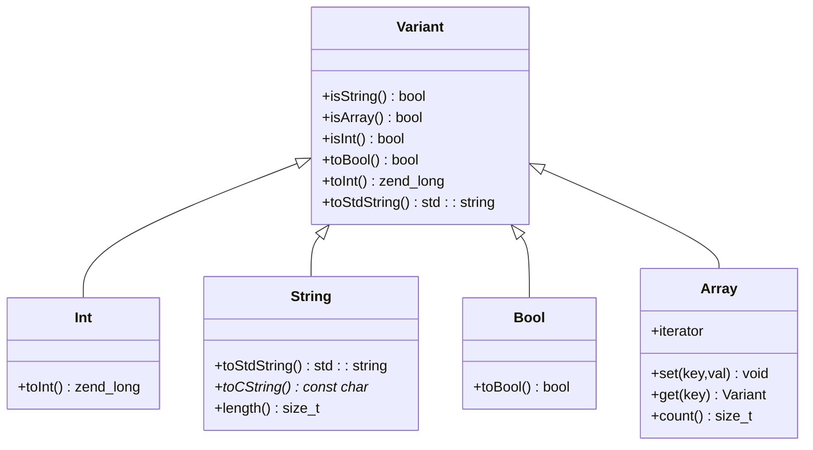
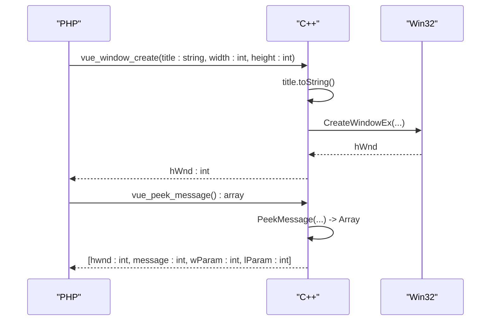
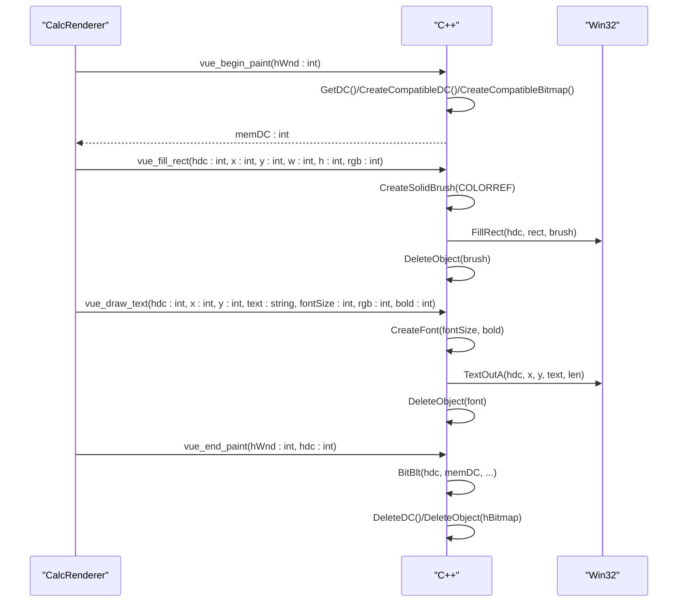
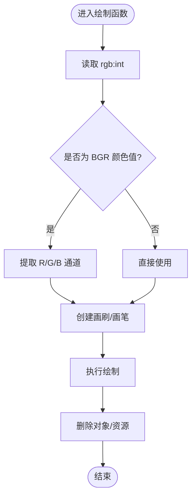
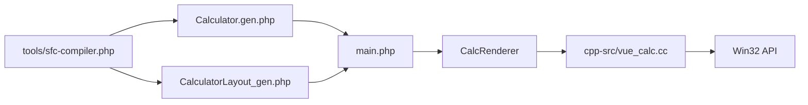

# 数据类型转换

<cite>
**本文引用的文件**
- [cpp-src/vue_calc.cc](file://cpp-src/vue_calc.cc)
- [php-src/vue_calc.stub.php](file://php-src/vue_calc.stub.php)
- [main.php](file://main.php)
- [src/Calculator.gen.php](file://src/Calculator.gen.php)
- [src/CalculatorLayout_gen.php](file://src/CalculatorLayout_gen.php)
- [src/ReactiveComponent.php](file://src/ReactiveComponent.php)
- [src/ChangeQueue.php](file://src/ChangeQueue.php)
- [tools/sfc-compiler.php](file://tools/sfc-compiler.php)
- [project.yml](file://project.yml)
</cite>

## 目录
1. [简介](#简介)
2. [项目结构](#项目结构)
3. [核心组件](#核心组件)
4. [架构总览](#架构总览)
5. [详细组件分析](#详细组件分析)
6. [依赖关系分析](#依赖关系分析)
7. [性能考量](#性能考量)
8. [故障排查指南](#故障排查指南)
9. [结论](#结论)
10. [附录](#附录)

## 简介
本技术文档围绕 PHP 到 C++ 的数据类型转换进行系统性梳理，重点基于 phpx 框架提供的类型系统，结合本项目中的实际使用场景，深入解析如下转换规则与实现细节：
- 整数类型（Int）：直接转换与参数传递
- 字符串类型（String）：编码处理与字符集转换
- 布尔类型（Bool）：真值映射与条件判断
- 数组类型（Array）：结构化转换与消息打包
- 特殊类型（HWND/HDC/COLORREF）：句柄与颜色值的封装与传递
- 最佳实践与性能优化：内存分配与释放策略

同时，文档通过序列图、类图与流程图展示关键数据流与转换过程，帮助读者快速理解从 PHP 逻辑到 C++ GDI 绘制的完整链路。

## 项目结构
本项目采用“SFC 编译 + AOT 构建”的模式，将 .vue 组件编译为 .gen.php 文件，再由 AOT 编译器生成可执行程序。C++ 层仅提供 Win32 API 的薄封装，所有业务逻辑与响应式状态由 PHP 端实现。

图表来源
- [tools/sfc-compiler.php:133-207](file://tools/sfc-compiler.php#L133-L207)
- [main.php:26-133](file://main.php#L26-L133)
- [cpp-src/vue_calc.cc:1-157](file://cpp-src/vue_calc.cc#L1-L157)

章节来源
- [project.yml:1-10](file://project.yml#L1-L10)
- [tools/sfc-compiler.php:1-210](file://tools/sfc-compiler.php#L1-L210)
- [main.php:1-291](file://main.php#L1-L291)

## 核心组件
- C++ phpx 封装层：提供窗口创建、消息轮询、双缓冲绘制、GDI 绘制原语等接口，统一以 Int/Bool/String/Array 参数形式暴露给 PHP。
- PHP 侧组件与渲染器：Calculator 组件负责业务逻辑，CalcRenderer 负责将组件状态与布局数据驱动到 C++ 绘制接口。
- 布局生成：SFC 编译器将模板解析为布局数组（元素与按钮），供渲染器按需读取并调用 C++ 接口。
- 响应式框架：ReactiveComponent + ChangeQueue 提供 AOT 兼容的脏标记与变更队列机制。

章节来源
- [cpp-src/vue_calc.cc:1-157](file://cpp-src/vue_calc.cc#L1-L157)
- [main.php:26-133](file://main.php#L26-L133)
- [src/Calculator.gen.php:1-174](file://src/Calculator.gen.php#L1-L174)
- [src/CalculatorLayout_gen.php:1-296](file://src/CalculatorLayout_gen.php#L1-L296)
- [src/ReactiveComponent.php:1-35](file://src/ReactiveComponent.php#L1-L35)
- [src/ChangeQueue.php:1-57](file://src/ChangeQueue.php#L1-L57)

## 架构总览
下图展示了从用户交互到 C++ 绘制的端到端数据流，以及 PHP 与 C++ 之间的类型转换位置。

图表来源
- [main.php:171-227](file://main.php#L171-L227)
- [main.php:99-132](file://main.php#L99-L132)
- [src/Calculator.gen.php:1-174](file://src/Calculator.gen.php#L1-L174)
- [src/CalculatorLayout_gen.php:1-296](file://src/CalculatorLayout_gen.php#L1-L296)
- [cpp-src/vue_calc.cc:36-84](file://cpp-src/vue_calc.cc#L36-L84)

## 详细组件分析

### C++ phpx 封装层的数据类型转换
C++ 层通过 phpx.h 提供的类型系统完成 PHP 与 C++ 的互操作，核心类型与转换规则如下：
- Int：对应 PHP 的 int，C++ 中为 zend_long；用于句柄、坐标、尺寸、颜色等数值。
- String：对应 PHP 的 string，内部为带引用计数的字符串；用于标题、文本等。
- Bool：对应 PHP 的 bool；用于状态查询与条件分支。
- Array：对应 PHP 的 array；用于消息打包、布局描述等结构化数据。

图表来源
- [cpp-src/vue_calc.cc:36-84](file://cpp-src/vue_calc.cc#L36-L84)

章节来源
- [cpp-src/vue_calc.cc:36-84](file://cpp-src/vue_calc.cc#L36-L84)

### 窗口与消息处理的类型转换
- 窗口创建：PHP 传入标题（string）、宽高（int），C++ 返回 hWnd（int）。
- 显示窗口：PHP 传入 hWnd（int）、cmdShow（int）。
- 退出请求：C++ 查询全局标志并返回 bool。
- 消息轮询：C++ 返回包含 hwnd/message/wParam/lParam 的数组（Array），PHP 解包并分发。

图表来源
- [php-src/vue_calc.stub.php:13-16](file://php-src/vue_calc.stub.php#L13-L16)
- [cpp-src/vue_calc.cc:36-84](file://cpp-src/vue_calc.cc#L36-L84)
- [main.php:171-227](file://main.php#L171-L227)

章节来源
- [php-src/vue_calc.stub.php:13-16](file://php-src/vue_calc.stub.php#L13-L16)
- [cpp-src/vue_calc.cc:36-84](file://cpp-src/vue_calc.cc#L36-L84)
- [main.php:171-227](file://main.php#L171-L227)

### 绘制原语的类型转换与特殊类型处理
- 双缓冲帧：Begin 返回 memDC（int），End 接收 memDC（int）并进行 blit。
- 填充矩形：接收 hdc（int）、坐标与尺寸（int）、颜色（int，BGR）。
- 绘制文本：接收 hdc（int）、坐标（int）、文本（string）、字号（int）、颜色（int，BGR）、粗细（int）。
- 绘制按钮：接收 hdc（int）、坐标与尺寸（int）、背景色与边框色（int，BGR）。

图表来源
- [main.php:99-132](file://main.php#L99-L132)
- [cpp-src/vue_calc.cc:91-157](file://cpp-src/vue_calc.cc#L91-L157)

章节来源
- [main.php:99-132](file://main.php#L99-L132)
- [cpp-src/vue_calc.cc:91-157](file://cpp-src/vue_calc.cc#L91-L157)

### 特殊类型处理：HWND/HDC/COLORREF
- HWND：由 C++ 创建并返回给 PHP，作为整数句柄使用。PHP 侧以 int 传入 C++ 接口。
- HDC：由 C++ 获取/创建并返回给 PHP，作为整数句柄使用。PHP 侧以 int 传入绘制接口。
- COLORREF：以 int 传入 C++，C++ 内部将其视为 BGR 颜色值，必要时转换为 RGB 通道后再创建画刷或画笔。

图表来源
- [cpp-src/vue_calc.cc:120-157](file://cpp-src/vue_calc.cc#L120-L157)

章节来源
- [cpp-src/vue_calc.cc:120-157](file://cpp-src/vue_calc.cc#L120-L157)

### 字符串编码处理：UTF-8 到 WideChar
- C++ 层在创建控制台输出编码时设置 UTF-8（CP 65001），确保控制台输出正确显示中文。
- 文本绘制接口使用 ANSI 版本的 TextOutA，因此传入的文本需为多字节字符串。若需要 Unicode 支持，可在后续扩展中切换到 Unicode 版本的 API（例如 TextOutW）并相应调整 String 的转换策略。

章节来源
- [cpp-src/vue_calc.cc:37](file://cpp-src/vue_calc.cc#L37)
- [cpp-src/vue_calc.cc:128-139](file://cpp-src/vue_calc.cc#L128-L139)

### 布尔类型与条件判断
- 退出请求检查返回 Bool，用于主循环的终止条件。
- 粗体字体选择根据 bool 值决定是否加粗。

章节来源
- [cpp-src/vue_calc.cc:65-67](file://cpp-src/vue_calc.cc#L65-L67)
- [cpp-src/vue_calc.cc:129-135](file://cpp-src/vue_calc.cc#L129-L135)

### 数组类型与消息打包
- 消息轮询返回 Array，包含 hwnd/message/wParam/lParam 四元组；PHP 侧解包并分发消息类型。
- 布局数据（元素与按钮）以 Array 形式存储，渲染器遍历并调用绘制接口。

章节来源
- [cpp-src/vue_calc.cc:70-84](file://cpp-src/vue_calc.cc#L70-L84)
- [src/CalculatorLayout_gen.php:10-296](file://src/CalculatorLayout_gen.php#L10-L296)

## 依赖关系分析
- SFC 编译器生成布局与组件类文件，供运行时使用。
- CalcRenderer 依赖布局数据与组件状态，调用 C++ 绘制接口。
- C++ 封装层依赖 phpx.h 类型系统与 Win32 API。
- 响应式框架提供脏标记与变更队列，驱动渲染循环。

图表来源
- [tools/sfc-compiler.php:133-207](file://tools/sfc-compiler.php#L133-L207)
- [main.php:26-133](file://main.php#L26-L133)
- [cpp-src/vue_calc.cc:1-157](file://cpp-src/vue_calc.cc#L1-L157)

章节来源
- [tools/sfc-compiler.php:1-210](file://tools/sfc-compiler.php#L1-L210)
- [main.php:1-291](file://main.php#L1-L291)
- [cpp-src/vue_calc.cc:1-157](file://cpp-src/vue_calc.cc#L1-L157)

## 性能考量
- 句柄生命周期管理：HDC/HBITMAP/HBRUSH/HPEN 等对象在使用完毕后必须及时删除，避免资源泄漏。当前实现遵循“创建即删除”的原则，确保每帧结束后释放资源。
- 字符串处理：文本绘制使用 ANSI 版本 API，避免不必要的宽字符转换开销。若未来需要 Unicode 支持，应评估 TextOutW 的成本并考虑缓存字体对象。
- 数组访问：布局数组与消息数组均为轻量结构，遍历开销低。建议保持数组结构稳定，减少重复构建。
- 渲染频率：主循环使用微秒级休眠维持约 60 FPS，平衡流畅度与 CPU 占用。

章节来源
- [cpp-src/vue_calc.cc:105-117](file://cpp-src/vue_calc.cc#L105-L117)
- [cpp-src/vue_calc.cc:128-139](file://cpp-src/vue_calc.cc#L128-L139)
- [main.php:223](file://main.php#L223)

## 故障排查指南
- 窗口创建失败：检查返回值与错误输出，确认标题字符串编码与尺寸参数。
- 绘制异常：确认 hdc 与 rgb 参数类型正确，颜色值格式符合 BGR 规范。
- 文本不显示：检查文本长度与坐标计算，确认字体大小与粗细参数。
- 消息处理异常：检查消息数组解包顺序与消息类型判断。
- 资源泄漏：核对每帧结束时 DeleteDC/DeleteObject 的调用是否覆盖所有创建的对象。

章节来源
- [main.php:152-169](file://main.php#L152-L169)
- [cpp-src/vue_calc.cc:91-157](file://cpp-src/vue_calc.cc#L91-L157)
- [main.php:171-227](file://main.php#L171-L227)

## 结论
本项目通过 phpx 框架实现了 PHP 与 C++ 的高效互操作，将业务逻辑与渲染分离，形成清晰的职责边界。通过对 Int/String/Bool/Array 的标准化转换，以及对 HWND/HDC/COLORREF 的安全封装，项目在保证功能完整性的同时兼顾了性能与可维护性。建议在未来扩展中引入 Unicode 文本支持与更精细的资源管理策略，以进一步提升跨平台与国际化能力。

## 附录
- 类型系统概览（摘自文档）
  - PHP int → C++ Int（zend_long）
  - PHP float → C++ Float（double）
  - PHP bool → C++ Bool
  - PHP string → C++ String（带引用计数）
  - PHP array → C++ Array（关联数组/HashTable）
  - 任意类型 → C++ Variant（通用容器）

章节来源
- [VueCalc技术规划文档_v3.html:1215-1257](file://VueCalc技术规划文档_v3.html#L1215-L1257)