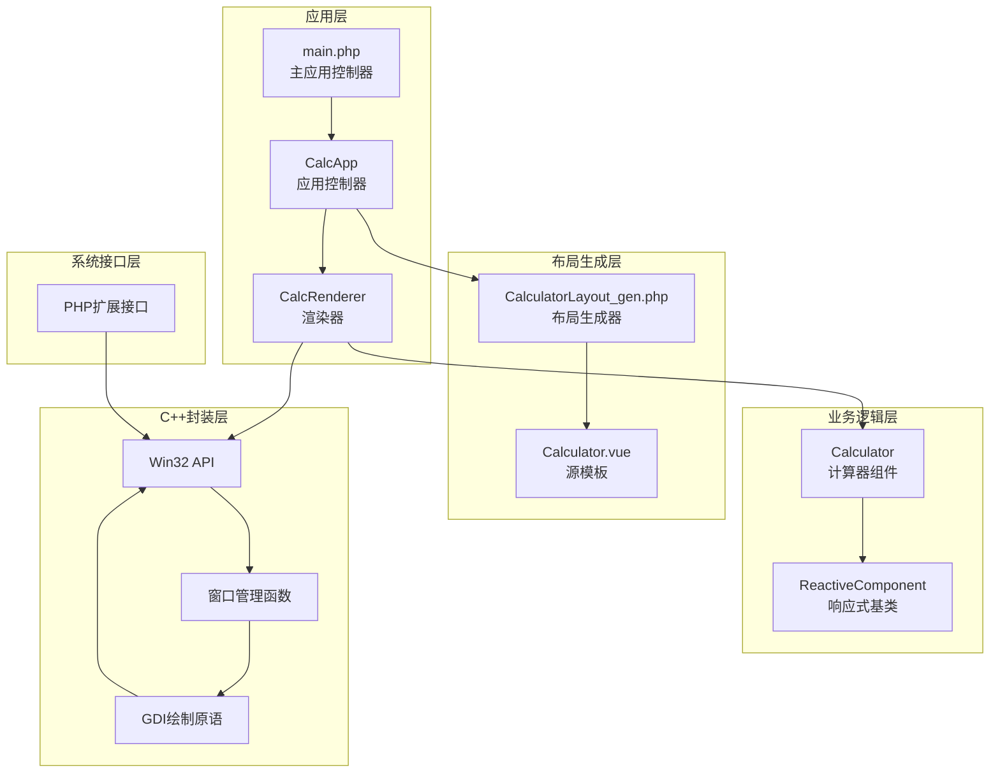
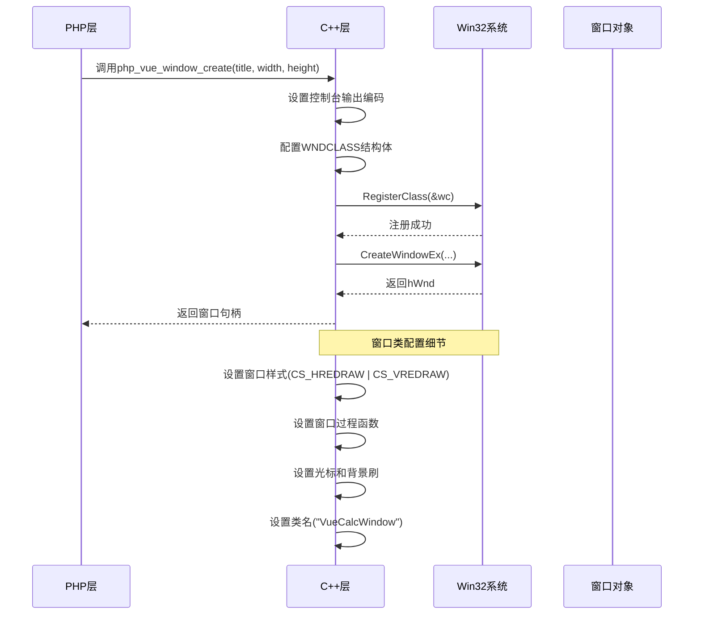
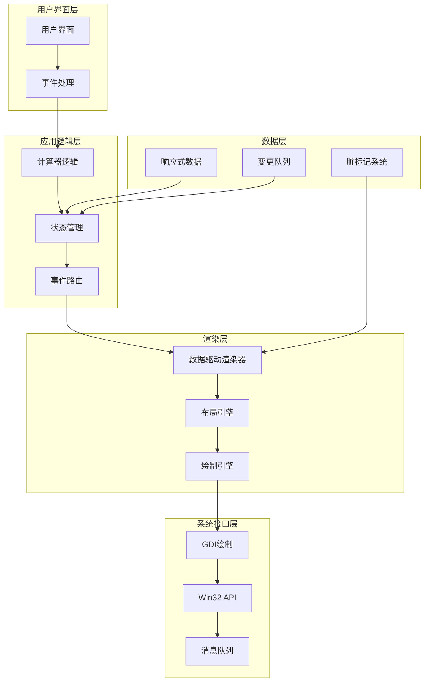
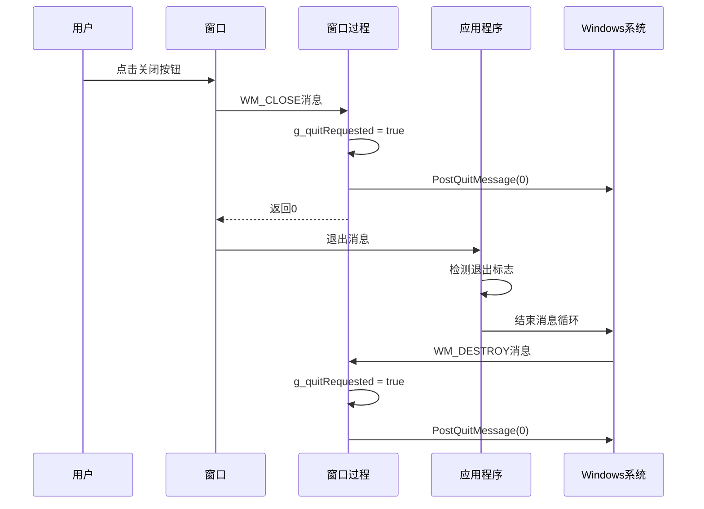
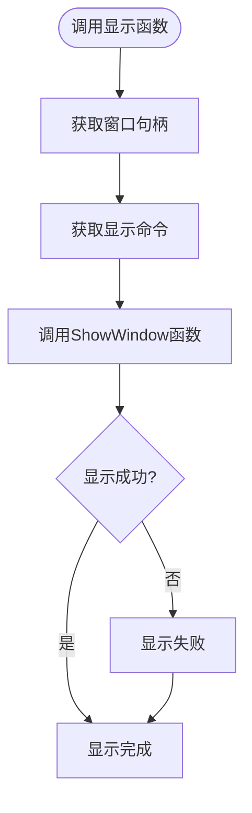
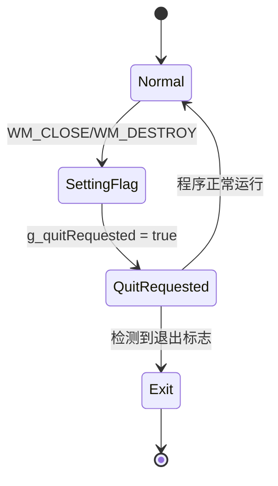
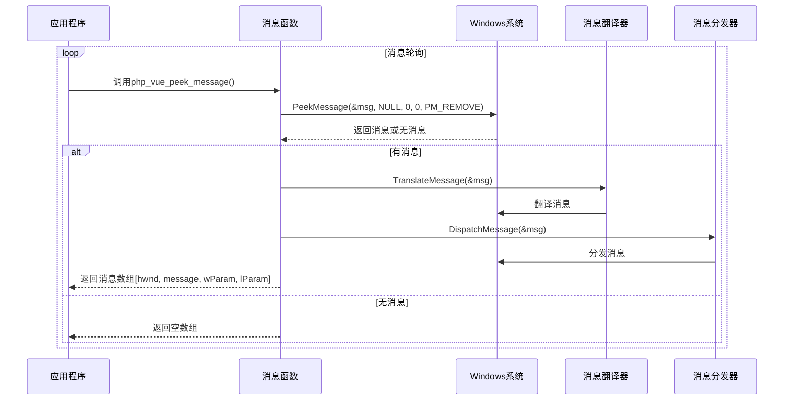
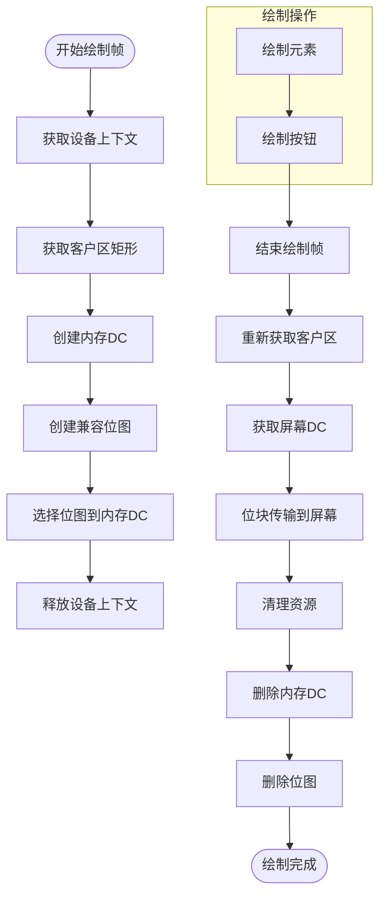
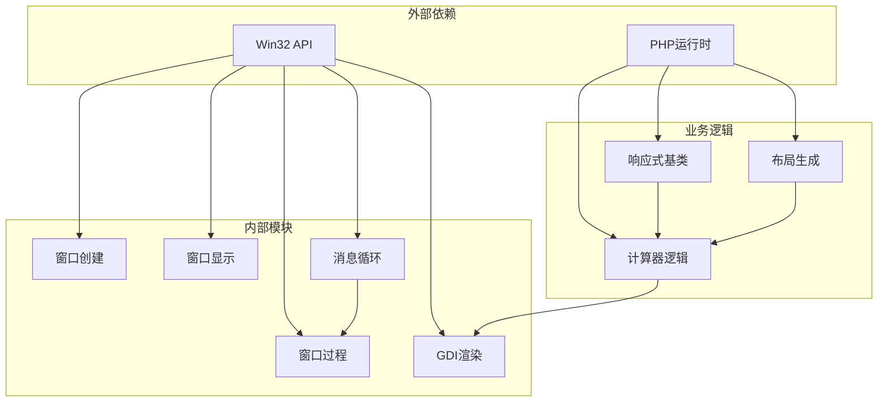

# Win32窗口管理系统

<cite>
**本文档引用的文件**
- [vue_calc.cc](file://cpp-src/vue_calc.cc)
- [main.php](file://main.php)
- [Calculator.gen.php](file://src/Calculator.gen.php)
- [Calculator.vue](file://src/Calculator.vue)
- [CalculatorLayout_gen.php](file://src/CalculatorLayout_gen.php)
- [ReactiveComponent.php](file://src/ReactiveComponent.php)
- [vue_calc.stub.php](file://php-src/vue_calc.stub.php)
</cite>

## 目录
1. [简介](#简介)
2. [项目结构](#项目结构)
3. [核心组件](#核心组件)
4. [架构概览](#架构概览)
5. [详细组件分析](#详细组件分析)
6. [依赖关系分析](#依赖关系分析)
7. [性能考虑](#性能考虑)
8. [故障排除指南](#故障排除指南)
9. [结论](#结论)

## 简介

VueCalc是一个基于SFC（单文件组件）编译器的类Vue数据驱动桌面计算器应用程序。该系统采用独特的"薄绘制原语层"架构，其中C++层仅封装Win32 API作为底层渲染引擎，而所有计算器逻辑和响应式数据均由PHP端实现。

该Win32窗口管理系统提供了完整的窗口生命周期管理、消息处理机制和GDI绘制原语，实现了高性能的数据驱动渲染架构。

## 项目结构

项目采用模块化设计，主要分为以下几个层次：



**图表来源**
- [main.php:152-227](file://main.php#L152-L227)
- [Calculator.gen.php:9-174](file://src/Calculator.gen.php#L9-L174)
- [CalculatorLayout_gen.php:10-296](file://src/CalculatorLayout_gen.php#L10-L296)
- [vue_calc.cc:21-84](file://cpp-src/vue_calc.cc#L21-L84)

**章节来源**
- [main.php:1-291](file://main.php#L1-L291)
- [Calculator.gen.php:1-174](file://src/Calculator.gen.php#L1-L174)
- [CalculatorLayout_gen.php:1-296](file://src/CalculatorLayout_gen.php#L1-L296)

## 核心组件

### 窗口过程函数VueCalcWndProc

VueCalcWndProc是系统的核心消息处理函数，负责处理Windows消息并协调应用程序的生命周期。

```mermaid
flowchart TD
Start([消息到达]) --> CheckMsg{检查消息类型}
CheckMsg --> |WM_CLOSE| CloseHandler[关闭处理]
CheckMsg --> |WM_DESTROY| DestroyHandler[销毁处理]
CheckMsg --> |其他消息| DefProc[默认窗口过程]
CloseHandler --> SetFlag1[设置退出标志]
SetFlag1 --> PostQuit1[PostQuitMessage(0)]
PostQuit1 --> Return0[返回0]
DestroyHandler --> SetFlag2[设置退出标志]
SetFlag2 --> PostQuit2[PostQuitMessage(0)]
PostQuit2 --> Return0
DefProc --> ReturnDef[返回DefWindowProc]
Return0 --> End([消息处理完成])
ReturnDef --> End
```

**图表来源**
- [vue_calc.cc:21-33](file://cpp-src/vue_calc.cc#L21-L33)

### 窗口创建函数php_vue_window_create

该函数负责创建和初始化Win32窗口，包含完整的窗口类配置和创建过程。



**图表来源**
- [vue_calc.cc:36-57](file://cpp-src/vue_calc.cc#L36-L57)

**章节来源**
- [vue_calc.cc:21-84](file://cpp-src/vue_calc.cc#L21-L84)

## 架构概览

系统采用分层架构设计，实现了清晰的关注点分离：



**图表来源**
- [main.php:26-133](file://main.php#L26-L133)
- [Calculator.gen.php:9-174](file://src/Calculator.gen.php#L9-L174)
- [ReactiveComponent.php:11-35](file://src/ReactiveComponent.php#L11-L35)

## 详细组件分析

### VueCalcWndProc窗口过程函数

VueCalcWndProc实现了标准的Windows消息处理模式，重点关注窗口关闭和销毁事件：

#### 消息处理机制

| 消息类型 | 处理逻辑 | 影响 |
|---------|---------|------|
| WM_CLOSE | 设置全局退出标志，调用PostQuitMessage | 触发应用程序优雅退出 |
| WM_DESTROY | 设置全局退出标志，调用PostQuitMessage | 完成窗口资源清理 |
| 其他消息 | 调用DefWindowProc进行默认处理 | 维持标准Windows行为 |

#### 关闭流程分析



**图表来源**
- [vue_calc.cc:21-33](file://cpp-src/vue_calc.cc#L21-L33)
- [main.php:200-208](file://main.php#L200-L208)

**章节来源**
- [vue_calc.cc:21-33](file://cpp-src/vue_calc.cc#L21-L33)

### 窗口创建函数php_vue_window_create

该函数实现了完整的窗口创建流程，包含多个关键配置步骤：

#### WNDCLASS结构体配置

| 字段 | 配置值 | 作用 |
|------|--------|------|
| style | CS_HREDRAW \| CS_VREDRAW | 垂直和水平重绘 |
| lpfnWndProc | VueCalcWndProc | 自定义窗口过程 |
| hInstance | GetModuleHandle(NULL) | 模块实例句柄 |
| hCursor | LoadCursor(IDC_ARROW) | 标准箭头光标 |
| hbrBackground | COLOR_WINDOW + 1 | 系统窗口背景刷 |
| lpszClassName | "VueCalcWindow" | 窗口类名 |

#### CreateWindowEx调用参数

| 参数 | 值 | 说明 |
|------|-----|------|
| dwExStyle | 0 | 扩展样式 |
| lpClassName | "VueCalcWindow" | 窗口类名 |
| lpWindowName | 标题字符串 | 窗口标题 |
| dwStyle | WS_OVERLAPPEDWINDOW & ~WS_THICKFRAME & ~WS_MAXIMIZEBOX | 窗口样式（禁用调整大小和最大化） |
| x, y | CW_USEDEFAULT | 默认位置 |
| nWidth, nHeight | 传入尺寸 | 窗口尺寸 |
| hWndParent, hMenu | NULL | 父窗口和菜单句柄 |
| hInstance | GetModuleHandle(NULL) | 模块实例 |
| lpParam | NULL | 窗口创建参数 |

**章节来源**
- [vue_calc.cc:36-57](file://cpp-src/vue_calc.cc#L36-L57)

### 窗口显示控制php_vue_window_show

该函数提供了简单的窗口显示控制功能：



**图表来源**
- [vue_calc.cc:60-62](file://cpp-src/vue_calc.cc#L60-L62)

**章节来源**
- [vue_calc.cc:60-62](file://cpp-src/vue_calc.cc#L60-L62)

### 窗口退出检测php_vue_quit_requested

这是一个简单的全局状态查询函数，用于检测应用程序是否请求退出：



**图表来源**
- [vue_calc.cc:65-67](file://cpp-src/vue_calc.cc#L65-L67)

**章节来源**
- [vue_calc.cc:65-67](file://cpp-src/vue_calc.cc#L65-L67)

### 消息轮询函数php_vue_peek_message

这是系统的核心消息处理函数，实现了完整的消息轮询、翻译和分发机制：



**图表来源**
- [vue_calc.cc:70-84](file://cpp-src/vue_calc.cc#L70-L84)

#### 消息处理流程详解

1. **消息检查**: 使用PeekMessage检查是否有待处理消息
2. **消息翻译**: TranslateMessage将虚拟键消息转换为字符消息
3. **消息分发**: DispatchMessage将消息发送到相应的窗口过程
4. **结果返回**: 将消息信息打包为PHP数组返回

**章节来源**
- [vue_calc.cc:70-84](file://cpp-src/vue_calc.cc#L70-L84)

### GDI绘制原语

系统提供了完整的GDI绘制原语，支持双缓冲渲染以提高性能：

#### 双缓冲渲染流程



**图表来源**
- [vue_calc.cc:91-117](file://cpp-src/vue_calc.cc#L91-L117)

**章节来源**
- [vue_calc.cc:91-156](file://cpp-src/vue_calc.cc#L91-L156)

## 依赖关系分析

系统采用了清晰的依赖层次结构：



**图表来源**
- [main.php:152-227](file://main.php#L152-L227)
- [Calculator.gen.php:9-174](file://src/Calculator.gen.php#L9-L174)
- [vue_calc.cc:21-156](file://cpp-src/vue_calc.cc#L21-L156)

**章节来源**
- [main.php:1-291](file://main.php#L1-291)
- [Calculator.gen.php:1-174](file://src/Calculator.gen.php#L1-L174)

## 性能考虑

### 双缓冲渲染优化

系统采用双缓冲技术来减少闪烁和提高渲染性能：

1. **内存DC创建**: 在内存中创建设备上下文，避免直接绘制到屏幕
2. **位图缓存**: 使用兼容位图存储渲染结果
3. **批量传输**: 使用BitBlt一次性传输整个帧到屏幕

### 消息处理优化

1. **非阻塞消息轮询**: 使用PeekMessage避免阻塞应用程序
2. **批量消息处理**: 在每次迭代中处理所有待处理消息
3. **退出标志检测**: 提供快速退出机制

### 内存管理优化

1. **资源及时释放**: 确保所有GDI对象在使用后正确释放
2. **内存池管理**: 合理管理临时对象的生命周期
3. **垃圾回收**: 依赖PHP的垃圾回收机制管理对象

## 故障排除指南

### 常见问题及解决方案

#### 窗口创建失败

**症状**: 窗口句柄为0，应用程序无法启动

**可能原因**:
- 窗口类注册失败
- CreateWindowEx调用参数错误
- 内存不足

**解决方法**:
1. 检查RegisterClass返回值
2. 验证窗口类名唯一性
3. 确认CreateWindowEx参数正确性

#### 消息处理异常

**症状**: 应用程序无响应或消息处理错误

**可能原因**:
- 窗口过程函数未正确处理消息
- 消息队列溢出
- 线程安全问题

**解决方法**:
1. 确保所有消息都有适当的处理逻辑
2. 检查消息循环的完整性
3. 验证多线程环境下的安全性

#### 渲染性能问题

**症状**: 渲染卡顿或帧率过低

**可能原因**:
- 双缓冲配置不当
- 绘制操作过于频繁
- 资源释放不及时

**解决方法**:
1. 优化绘制操作的频率
2. 确保及时释放GDI资源
3. 考虑使用更高效的绘制算法

**章节来源**
- [main.php:160-163](file://main.php#L160-L163)
- [vue_calc.cc:70-84](file://cpp-src/vue_calc.cc#L70-L84)

## 结论

VueCalc的Win32窗口管理系统展现了优秀的架构设计和实现质量。通过将Win32 API封装为薄层，系统实现了清晰的关注点分离，使得业务逻辑完全由PHP实现，而底层渲染由C++层提供高性能支持。

### 主要优势

1. **架构清晰**: 分层设计使各层职责明确，便于维护和扩展
2. **性能优异**: 双缓冲渲染和高效的消息处理确保流畅的用户体验
3. **易于扩展**: 模块化设计为添加新功能提供了便利
4. **跨语言集成**: 成功实现了PHP和C++的无缝协作

### 技术亮点

- **数据驱动渲染**: 基于响应式数据的状态变化触发重绘
- **消息驱动架构**: 完整的消息循环处理机制
- **资源管理**: 严格的资源生命周期管理
- **错误处理**: 完善的异常处理和错误恢复机制

该系统为类似的数据驱动桌面应用程序提供了一个优秀的参考实现，展示了如何在Windows平台上构建高性能、可维护的应用程序。