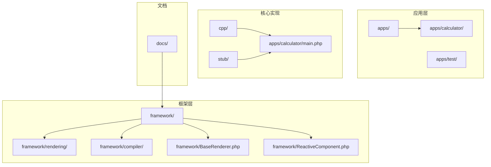
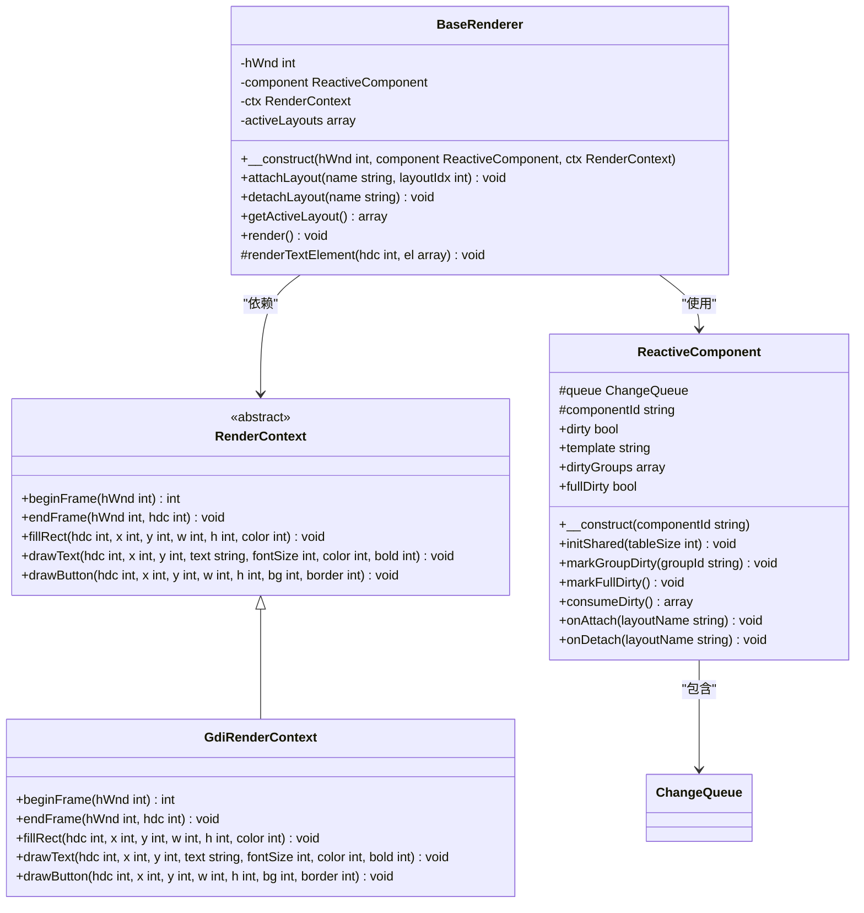
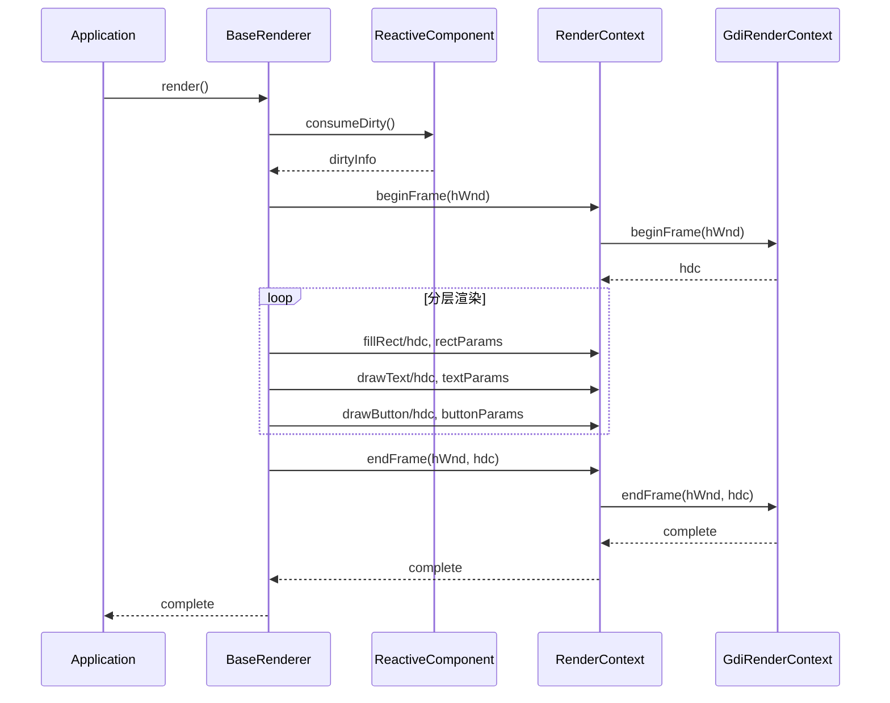
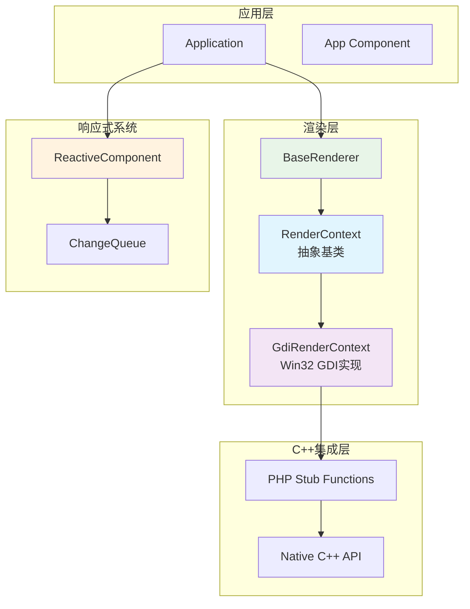
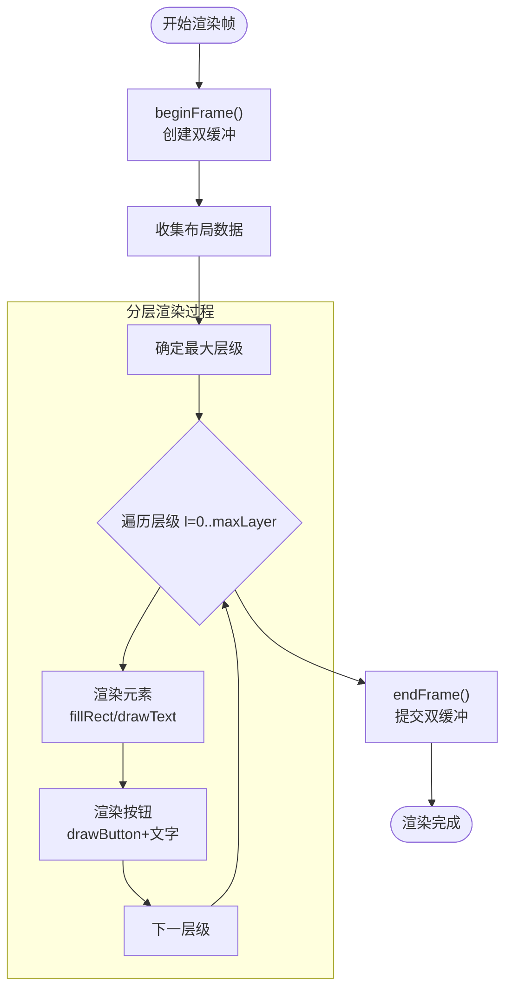
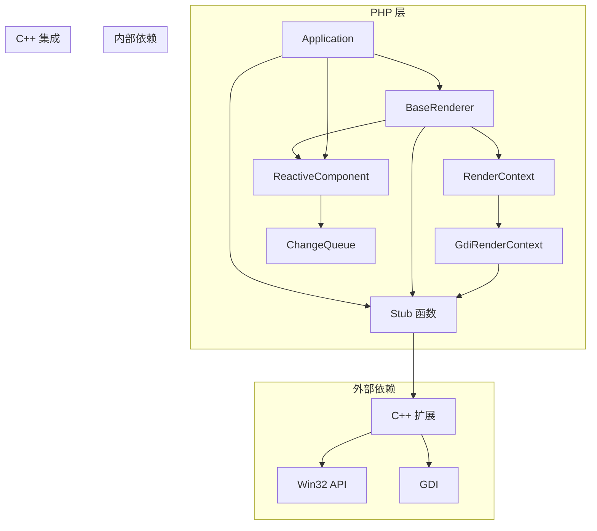

# 渲染上下文抽象

<cite>
**本文档引用的文件**
- [RenderContext.php](file://framework/rendering/RenderContext.php)
- [GdiRenderContext.php](file://framework/rendering/GdiRenderContext.php)
- [BaseRenderer.php](file://framework/BaseRenderer.php)
- [ReactiveComponent.php](file://framework/ReactiveComponent.php)
- [Application.php](file://apps/calculator/Application.php)
- [vue_calc.cc](file://cpp/vue_calc.cc)
- [vue_calc.stub.php](file://stub/vue_calc.stub.php)
- [main.php](file://apps/calculator/main.php)
- [ChangeQueue.php](file://framework/ChangeQueue.php)
- [App.vue](file://apps/calculator/App.vue)
</cite>

## 目录
1. [简介](#简介)
2. [项目结构](#项目结构)
3. [核心组件](#核心组件)
4. [架构概览](#架构概览)
5. [详细组件分析](#详细组件分析)
6. [依赖关系分析](#依赖关系分析)
7. [性能考虑](#性能考虑)
8. [故障排除指南](#故障排除指南)
9. [结论](#结论)

## 简介

VueCalc 是一个基于 Swoole Compiler 的跨平台桌面应用程序框架，专门用于构建数据驱动的桌面计算器应用。本文档深入分析了渲染上下文抽象的设计理念、实现细节和架构模式，重点展示了如何通过抽象基类实现后端无关的渲染接口，并通过具体实现适配不同的图形后端。

该框架采用分层架构设计，通过渲染上下文抽象实现了高度的模块化和可扩展性，为未来的多后端支持奠定了坚实基础。渲染上下文抽象不仅简化了渲染逻辑的实现，还确保了代码的可维护性和可测试性。

## 项目结构

VueCalc 项目采用清晰的分层组织结构，每个目录都有明确的职责分工：

**图表来源**
- [main.php:1-40](file://apps/calculator/main.php#L1-L40)
- [RenderContext.php:1-30](file://framework/rendering/RenderContext.php#L1-L30)

**章节来源**
- [main.php:1-40](file://apps/calculator/main.php#L1-L40)
- [Application.php:1-146](file://apps/calculator/Application.php#L1-L146)

## 核心组件

### 渲染上下文抽象基类

渲染上下文抽象基类是整个渲染系统的核心，它定义了统一的渲染接口规范，确保不同图形后端的一致性：

**图表来源**
- [RenderContext.php:13-29](file://framework/rendering/RenderContext.php#L13-L29)
- [GdiRenderContext.php:11-37](file://framework/rendering/GdiRenderContext.php#L11-L37)
- [BaseRenderer.php:14-185](file://framework/BaseRenderer.php#L14-L185)
- [ReactiveComponent.php:11-74](file://framework/ReactiveComponent.php#L11-L74)

### 渲染器架构

渲染器采用两阶段分层渲染机制，确保复杂的UI层次能够正确处理和渲染：

**图表来源**
- [BaseRenderer.php:124-184](file://framework/BaseRenderer.php#L124-L184)
- [GdiRenderContext.php:13-36](file://framework/rendering/GdiRenderContext.php#L13-L36)

**章节来源**
- [RenderContext.php:5-29](file://framework/rendering/RenderContext.php#L5-L29)
- [GdiRenderContext.php:5-37](file://framework/rendering/GdiRenderContext.php#L5-L37)
- [BaseRenderer.php:10-185](file://framework/BaseRenderer.php#L10-L185)

## 架构概览

VueCalc 的渲染系统采用了经典的分层架构模式，通过抽象基类实现了高度的模块化和可扩展性：

**图表来源**
- [Application.php:10-146](file://apps/calculator/Application.php#L10-L146)
- [BaseRenderer.php:14-185](file://framework/BaseRenderer.php#L14-L185)
- [RenderContext.php:13-29](file://framework/rendering/RenderContext.php#L13-L29)
- [GdiRenderContext.php:11-37](file://framework/rendering/GdiRenderContext.php#L11-L37)

### 设计模式分析

该系统实现了多种重要的设计模式：

1. **策略模式**: RenderContext 抽象基类定义了统一接口，具体实现类可以自由选择不同的渲染策略
2. **模板方法模式**: BaseRenderer 定义了渲染流程的骨架，具体步骤由子类实现
3. **观察者模式**: ReactiveComponent 通过脏标记机制通知渲染器进行更新
4. **工厂模式**: 应用程序根据配置创建相应的渲染上下文实例

**章节来源**
- [Application.php:17-50](file://apps/calculator/Application.php#L17-L50)
- [BaseRenderer.php:124-184](file://framework/BaseRenderer.php#L124-L184)

## 详细组件分析

### 渲染上下文抽象层

渲染上下文抽象层是整个系统的核心抽象，它定义了所有渲染操作的标准接口：

#### 接口设计原则

渲染上下文接口遵循以下设计原则：
- **后端无关性**: 所有方法都使用通用参数类型，不依赖特定图形库
- **一致性**: 相同类型的渲染操作具有相同的接口签名
- **可扩展性**: 通过继承新的实现类支持不同的图形后端

#### 核心方法分析

**图表来源**
- [BaseRenderer.php:139-181](file://framework/BaseRenderer.php#L139-L181)

**章节来源**
- [RenderContext.php:15-29](file://framework/rendering/RenderContext.php#L15-L29)

### GDI 渲染上下文实现

GDI 渲染上下文是渲染上下文抽象的具体实现，负责与 Win32 GDI API 交互：

#### 实现特点

1. **直接委托**: 每个方法都直接调用对应的 C++ stub 函数
2. **类型安全**: 严格遵循抽象基类的接口规范
3. **错误处理**: 通过 C++ 层面的错误检查确保稳定性

#### 性能优化

GDI 实现采用了多项性能优化技术：
- **双缓冲技术**: 避免闪烁，提高渲染效率
- **内存管理**: 合理分配和释放 GDI 对象
- **字体缓存**: 复用字体对象减少创建开销

**章节来源**
- [GdiRenderContext.php:11-37](file://framework/rendering/GdiRenderContext.php#L11-L37)
- [vue_calc.cc:90-156](file://cpp/vue_calc.cc#L90-L156)

### 基础渲染器

基础渲染器是渲染系统的协调中心，负责管理渲染流程和数据流：

#### 渲染流程控制

渲染器实现了复杂的两阶段分层渲染机制：

1. **第一阶段**: 确定所有活跃布局中的最大层级
2. **第二阶段**: 按层级顺序渲染，确保正确的覆盖关系

#### 数据驱动渲染

渲染器支持数据驱动的渲染模式：
- **布局段管理**: 动态管理多个布局段
- **条件渲染**: 支持基于条件表达式的元素显示控制
- **文本对齐**: 支持左对齐、右对齐和居中对齐

**章节来源**
- [BaseRenderer.php:124-184](file://framework/BaseRenderer.php#L124-L184)

### 响应式组件系统

响应式组件系统提供了完整的状态管理和变更通知机制：

#### 脏标记机制

组件使用脏标记机制跟踪状态变更：
- **全局脏标记**: `$dirty` 标识组件需要重绘
- **分组脏标记**: `$dirtyGroups` 支持按组粒度的重绘控制
- **全量重绘**: `$fullDirty` 标识需要完全重绘

#### 变更队列

ChangeQueue 实现了环形缓冲区，支持高效的变更通知：
- **固定大小缓冲**: 4096 个条目的环形缓冲
- **原子操作**: 确保线程安全的队列操作
- **版本控制**: 支持变更版本跟踪

**章节来源**
- [ReactiveComponent.php:11-74](file://framework/ReactiveComponent.php#L11-L74)
- [ChangeQueue.php:11-56](file://framework/ChangeQueue.php#L11-L56)

## 依赖关系分析

渲染上下文抽象系统展现了清晰的依赖层次结构：

**图表来源**
- [Application.php:17-50](file://apps/calculator/Application.php#L17-L50)
- [BaseRenderer.php:21-26](file://framework/BaseRenderer.php#L21-L26)
- [vue_calc.stub.php:12-23](file://stub/vue_calc.stub.php#L12-L23)

### 循环依赖检测

系统设计避免了循环依赖：
- **单向依赖**: 所有依赖都是单向的，从具体实现指向抽象基类
- **接口隔离**: 通过接口分离关注点，降低耦合度
- **依赖注入**: 通过构造函数注入依赖，便于测试和替换

**章节来源**
- [Application.php:17-22](file://apps/calculator/Application.php#L17-L22)
- [BaseRenderer.php:21-26](file://framework/BaseRenderer.php#L21-L26)

## 性能考虑

渲染上下文抽象系统在设计时充分考虑了性能因素：

### 渲染性能优化

1. **双缓冲技术**: 避免屏幕闪烁，提高渲染效率
2. **分层渲染**: 通过层级管理确保正确的绘制顺序
3. **条件渲染**: 支持基于条件的元素过滤，减少不必要的绘制
4. **文本优化**: 动态调整字体大小，适应不同长度的文本内容

### 内存管理

1. **对象池**: GDI 对象的创建和销毁成本较高，需要合理管理
2. **缓冲区复用**: 环形缓冲区支持高效的变更通知
3. **延迟加载**: 布局段按需加载，减少初始内存占用

### 并发考虑

系统目前是单线程设计，但在未来可以扩展支持：
- **渲染线程**: 将渲染操作分离到独立线程
- **消息队列**: 使用线程安全的消息队列处理用户输入
- **同步机制**: 实现适当的同步机制保证数据一致性

## 故障排除指南

### 常见问题诊断

#### 渲染异常

**问题**: 应用程序启动后无法显示界面
**可能原因**:
- 窗口创建失败
- GDI 上下文初始化错误
- 渲染上下文配置错误

**解决方案**:
1. 检查窗口创建函数的返回值
2. 验证 GDI 上下文的初始化过程
3. 确认渲染上下文的配置参数

#### 性能问题

**问题**: 渲染帧率过低
**可能原因**:
- 过多的布局段导致渲染时间增加
- 文本对齐计算过于复杂
- GDI 对象频繁创建和销毁

**解决方案**:
1. 优化布局段数量
2. 简化文本对齐算法
3. 实现 GDI 对象缓存机制

#### 内存泄漏

**问题**: 应用程序运行时间越长内存占用越大
**可能原因**:
- GDI 对象未正确释放
- 环形缓冲区未及时清理
- 字符串对象未正确销毁

**解决方案**:
1. 确保所有 GDI 对象在使用后正确释放
2. 实现缓冲区的自动清理机制
3. 使用弱引用或智能指针管理对象生命周期

**章节来源**
- [Application.php:33-36](file://apps/calculator/Application.php#L33-L36)
- [vue_calc.cc:110-117](file://cpp/vue_calc.cc#L110-L117)

## 结论

VueCalc 的渲染上下文抽象系统展现了优秀的软件架构设计原则。通过抽象基类实现了高度的模块化和可扩展性，为未来的多后端支持奠定了坚实基础。

### 主要成就

1. **抽象设计**: 成功实现了后端无关的渲染接口
2. **模块化**: 清晰的分层架构便于维护和扩展
3. **性能优化**: 双缓冲技术和分层渲染确保了良好的用户体验
4. **AOT 兼容**: 专门为 Ahead-of-Time 编译进行了优化

### 未来发展方向

1. **多后端支持**: 计划扩展支持 Skia、OpenGL 和 Web Canvas
2. **性能提升**: 实现更高效的渲染管道和内存管理
3. **功能增强**: 添加更多的图形原语和动画效果
4. **工具链完善**: 提供更好的开发工具和调试支持

该系统为构建高性能、可维护的数据驱动桌面应用程序提供了优秀的范例，其设计理念和实现模式值得其他类似项目借鉴和学习。