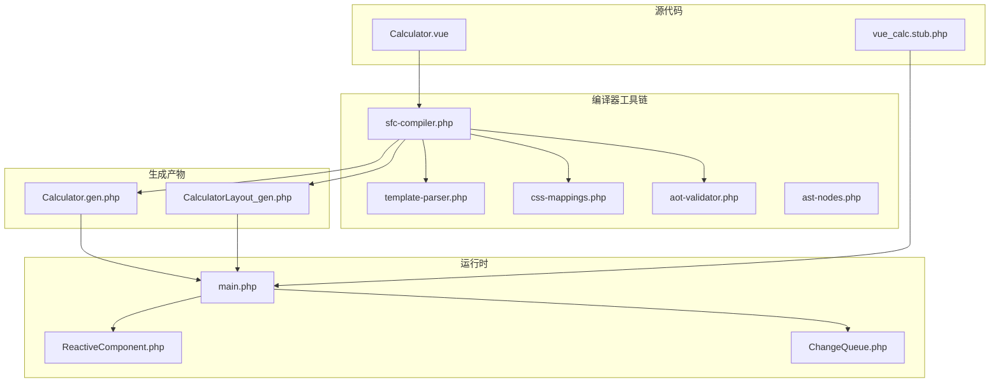
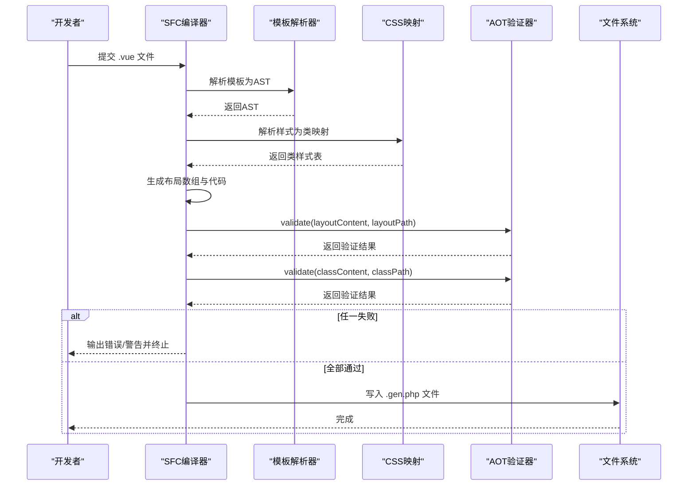
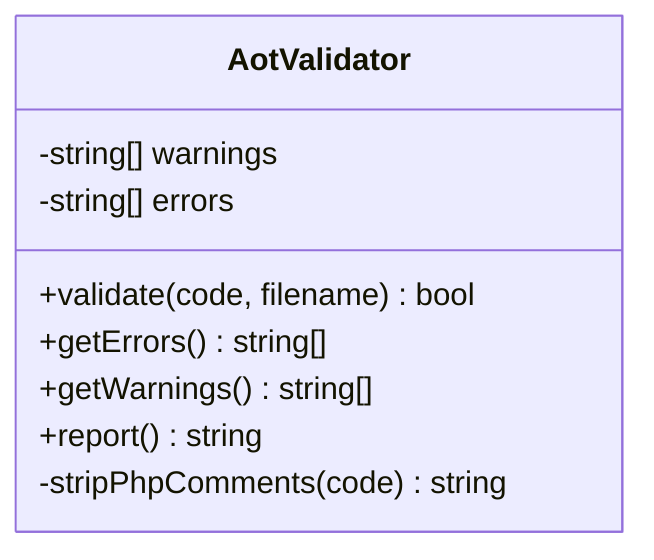
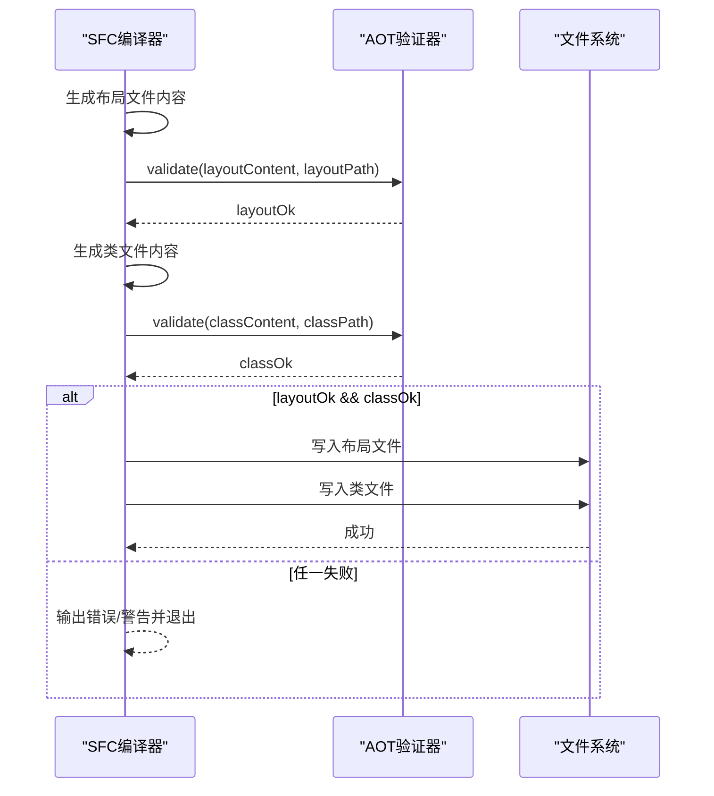
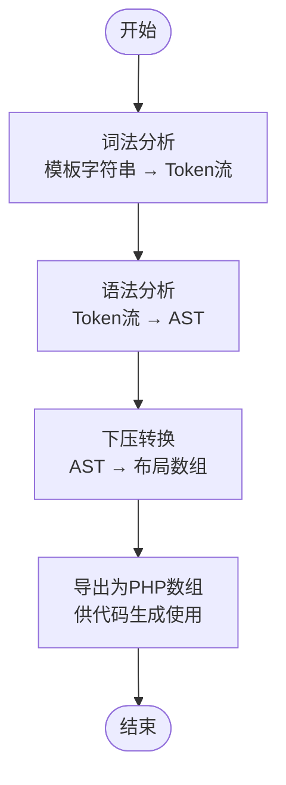
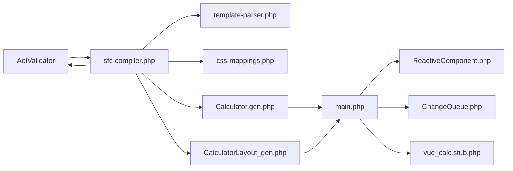

# AOT验证器

<cite>
**本文引用的文件**
- [aot-validator.php](file://tools/compiler/aot-validator.php)
- [sfc-compiler.php](file://tools/sfc-compiler.php)
- [template-parser.php](file://tools/compiler/template-parser.php)
- [css-mappings.php](file://tools/compiler/css-mappings.php)
- [ast-nodes.php](file://tools/compiler/ast-nodes.php)
- [Calculator.gen.php](file://src/Calculator.gen.php)
- [CalculatorLayout_gen.php](file://src/CalculatorLayout_gen.php)
- [verify-layout.php](file://tests/verify-layout.php)
- [ReactiveComponent.php](file://src/ReactiveComponent.php)
- [ChangeQueue.php](file://src/ChangeQueue.php)
- [main.php](file://main.php)
- [vue_calc.stub.php](file://php-src/vue_calc.stub.php)
</cite>

## 目录
1. [简介](#简介)
2. [项目结构](#项目结构)
3. [核心组件](#核心组件)
4. [架构总览](#架构总览)
5. [详细组件分析](#详细组件分析)
6. [依赖关系分析](#依赖关系分析)
7. [性能考量](#性能考量)
8. [故障排查指南](#故障排查指南)
9. [结论](#结论)
10. [附录](#附录)

## 简介
本文件面向AOT（Ahead-of-Time）验证器，系统性阐述其在Swoole AOT编译器中的作用与实现。AOT验证器在生成代码写入磁盘之前执行，通过一系列约束检查，确保生成的PHP代码满足Swoole AOT编译器的要求，从而避免运行时错误。本文将深入解析验证规则、实现细节、扩展机制，并提供常见问题的诊断与修复建议。

## 项目结构
该示例工程采用“单文件组件（SFC）→ 编译器 → AOT验证 → 生成代码”的流水线。AOT验证器位于编译器工具链中，作为生成阶段的前置校验环节。

图表来源
- [sfc-compiler.php:18-210](file://tools/sfc-compiler.php#L18-L210)
- [aot-validator.php:17-169](file://tools/compiler/aot-validator.php#L17-L169)
- [template-parser.php:60-680](file://tools/compiler/template-parser.php#L60-L680)
- [css-mappings.php:15-210](file://tools/compiler/css-mappings.php#L15-L210)
- [ast-nodes.php:9-153](file://tools/compiler/ast-nodes.php#L9-L153)
- [Calculator.gen.php:1-174](file://src/Calculator.gen.php#L1-L174)
- [CalculatorLayout_gen.php:1-296](file://src/CalculatorLayout_gen.php#L1-L296)
- [ReactiveComponent.php:11-35](file://src/ReactiveComponent.php#L11-L35)
- [ChangeQueue.php:11-57](file://src/ChangeQueue.php#L11-L57)
- [main.php:26-291](file://main.php#L26-L291)
- [vue_calc.stub.php:12-24](file://php-src/vue_calc.stub.php#L12-L24)

章节来源
- [sfc-compiler.php:18-210](file://tools/sfc-compiler.php#L18-L210)

## 核心组件
- AotValidator：AOT兼容性验证器，负责在生成文件写入磁盘前进行约束检查，收集错误与警告信息。
- SFC编译器：负责从.vue文件提取模板/脚本/样式块，解析模板为AST，转换为布局数组，生成两类.gen.php文件，并在写盘前调用AotValidator进行验证。
- 模板解析器：递归下降解析器，将模板字符串转为AST节点，再下压为布局数组。
- CSS映射：将CSS类属性映射为渲染参数，供布局数组生成使用。
- AST节点：定义模板语法树节点类型及属性，用于错误定位与调试。

章节来源
- [aot-validator.php:17-169](file://tools/compiler/aot-validator.php#L17-L169)
- [sfc-compiler.php:18-210](file://tools/sfc-compiler.php#L18-L210)
- [template-parser.php:60-680](file://tools/compiler/template-parser.php#L60-L680)
- [css-mappings.php:15-210](file://tools/compiler/css-mappings.php#L15-L210)
- [ast-nodes.php:9-153](file://tools/compiler/ast-nodes.php#L9-L153)

## 架构总览
AOT验证器在编译流水线中的位置如下：

图表来源
- [sfc-compiler.php:184-209](file://tools/sfc-compiler.php#L184-L209)
- [aot-validator.php:36-106](file://tools/compiler/aot-validator.php#L36-L106)

## 详细组件分析

### AotValidator组件分析
AotValidator提供统一的验证接口，按顺序执行多项规则检查，并输出错误与警告。其设计遵循“非致命警告 + 致命错误”的策略，确保生成阶段能及时暴露问题。

图表来源
- [aot-validator.php:17-169](file://tools/compiler/aot-validator.php#L17-L169)

验证规则与实现要点：
- 文件名点号限制：禁止在文件名主干部分出现多余点号，避免AOT生成无效C++符号名。
- 常量数组嵌套限制：禁止在生成文件中出现const数组包含嵌套结构，避免全局常量未注册导致的问题。
- 变量属性访问限制：禁止$obj->$var形式，避免AOT不支持的动态属性访问。
- 变量方法调用限制：禁止$obj->$method()形式，避免AOT不支持的动态方法调用。
- PHP8函数兼容性：检测str_contains等函数，给出替代方案提示，避免不同PHP版本差异导致的运行时问题。
- 顶层声明合法性：允许顶层const/函数/类声明，但需确保生成文件主体结构符合AOT要求。

章节来源
- [aot-validator.php:36-106](file://tools/compiler/aot-validator.php#L36-L106)

### SFC编译器与AOT验证集成
SFC编译器在生成两类.gen.php文件后，立即调用AotValidator进行验证。若任一文件验证失败，则终止写盘并输出错误/警告信息；全部通过后才写入磁盘。

图表来源
- [sfc-compiler.php:184-209](file://tools/sfc-compiler.php#L184-L209)

章节来源
- [sfc-compiler.php:184-209](file://tools/sfc-compiler.php#L184-L209)

### 模板解析器与布局生成
模板解析器将模板字符串解析为AST，再下压为布局数组，供代码生成阶段使用。此阶段的正确性直接影响生成文件的结构与内容，进而影响AOT验证器的判断。

图表来源
- [template-parser.php:118-199](file://tools/compiler/template-parser.php#L118-L199)
- [template-parser.php:205-279](file://tools/compiler/template-parser.php#L205-L279)
- [template-parser.php:456-541](file://tools/compiler/template-parser.php#L456-L541)

章节来源
- [template-parser.php:60-680](file://tools/compiler/template-parser.php#L60-L680)

### CSS映射与样式解析
CSS映射模块将CSS类属性映射为渲染参数，为布局数组提供颜色、字体、对齐等信息。解析过程中会收集警告，如缺少背景或前景色等。

章节来源
- [css-mappings.php:15-210](file://tools/compiler/css-mappings.php#L15-L210)

### AST节点模型
AST节点定义了模板语法树的结构，便于错误定位与调试。节点携带行号信息，有助于在编译期报告具体位置。

章节来源
- [ast-nodes.php:9-153](file://tools/compiler/ast-nodes.php#L9-L153)

## 依赖关系分析
AOT验证器与编译器其他模块的依赖关系如下：

图表来源
- [sfc-compiler.php:18-210](file://tools/sfc-compiler.php#L18-L210)
- [aot-validator.php:17-169](file://tools/compiler/aot-validator.php#L17-L169)
- [Calculator.gen.php:1-174](file://src/Calculator.gen.php#L1-L174)
- [CalculatorLayout_gen.php:1-296](file://src/CalculatorLayout_gen.php#L1-L296)
- [main.php:26-291](file://main.php#L26-L291)
- [ReactiveComponent.php:11-35](file://src/ReactiveComponent.php#L11-L35)
- [ChangeQueue.php:11-57](file://src/ChangeQueue.php#L11-L57)
- [vue_calc.stub.php:12-24](file://php-src/vue_calc.stub.php#L12-L24)

章节来源
- [sfc-compiler.php:18-210](file://tools/sfc-compiler.php#L18-L210)

## 性能考量
- 正则匹配开销：验证器使用正则表达式进行模式匹配，建议在大规模代码扫描时关注匹配复杂度与回溯风险。
- 字符串处理：验证器对生成文件内容进行预处理（如注释剥离），注意大文件的内存占用与处理时间。
- 早期失败：验证器在发现致命错误时立即返回，避免后续写盘与AOT编译浪费资源。

## 故障排查指南
常见验证失败场景与解决建议：
- 文件名含多个点号
  - 现象：报错指出文件名主干含多个点号，可能导致C++符号无效。
  - 解决：将文件名改为仅含一个点号或移除多余点号。
  - 参考规则：文件名点号限制。
- 生成文件中存在const数组嵌套
  - 现象：报错指出const数组包含嵌套结构，AOT不支持。
  - 解决：将const数组改为函数返回数组的形式。
  - 参考规则：常量数组嵌套限制。
- 使用变量属性访问$obj->$var
  - 现象：报错指出不支持的动态属性访问。
  - 解决：改用显式的if/else分支映射。
  - 参考规则：变量属性访问限制。
- 使用变量方法调用$obj->$method()
  - 现象：报错指出不支持的动态方法调用。
  - 解决：改用显式的if/else路由分派。
  - 参考规则：变量方法调用限制。
- 使用PHP8函数（如str_contains）
  - 现象：警告提示该函数在某些PHP版本不可用。
  - 解决：替换为兼容的函数组合（如strpos等价判断）。
  - 参考规则：PHP8函数兼容性。

章节来源
- [aot-validator.php:42-106](file://tools/compiler/aot-validator.php#L42-L106)

## 结论
AOT验证器通过严格的约束检查，有效降低了Swoole AOT编译器的失败率与运行时错误概率。其设计简洁明确，规则覆盖关键的AOT不兼容模式。结合SFC编译器的流水线，验证器确保生成文件在进入AOT阶段前即满足要求，显著提升了开发体验与构建稳定性。

## 附录

### 验证规则清单
- 文件名点号限制：文件名主干最多允许一个点号。
- 常量数组嵌套限制：禁止const数组包含嵌套结构。
- 变量属性访问限制：禁止$obj->$var。
- 变量方法调用限制：禁止$obj->$method()。
- PHP8函数兼容性：检测并提示str_contains等函数的替代方案。
- 顶层声明合法性：允许顶层const/函数/类声明，但需保证生成文件结构合规。

章节来源
- [aot-validator.php:42-106](file://tools/compiler/aot-validator.php#L42-L106)

### 生成文件示例与验证
- Calculator.gen.php：类文件，包含组件逻辑与构造函数，验证器检查其是否满足AOT要求。
- CalculatorLayout_gen.php：布局文件，包含窗口尺寸与布局数组，验证器检查其是否满足AOT要求。

章节来源
- [Calculator.gen.php:1-174](file://src/Calculator.gen.php#L1-L174)
- [CalculatorLayout_gen.php:1-296](file://src/CalculatorLayout_gen.php#L1-L296)

### 运行时集成
- main.php：应用入口，加载生成的布局与组件，初始化渲染器并驱动绘制。
- ReactiveComponent.php/ChangeQueue.php：响应式框架基础，配合生成的组件实现状态变更与重绘。
- vue_calc.stub.php：Win32 API声明，供渲染器调用底层绘制原语。

章节来源
- [main.php:26-291](file://main.php#L26-L291)
- [ReactiveComponent.php:11-35](file://src/ReactiveComponent.php#L11-L35)
- [ChangeQueue.php:11-57](file://src/ChangeQueue.php#L11-L57)
- [vue_calc.stub.php:12-24](file://php-src/vue_calc.stub.php#L12-L24)