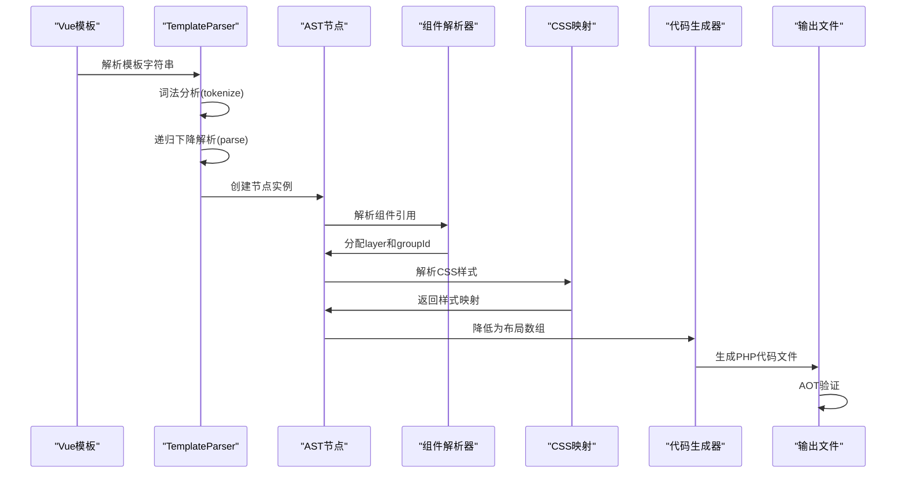
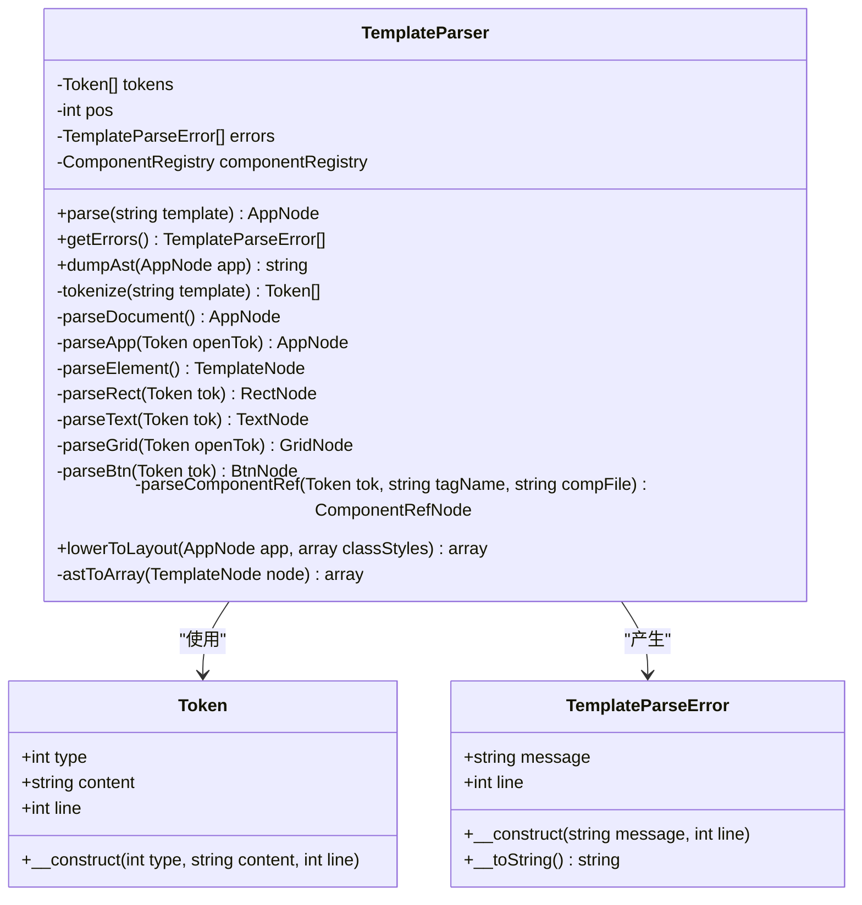
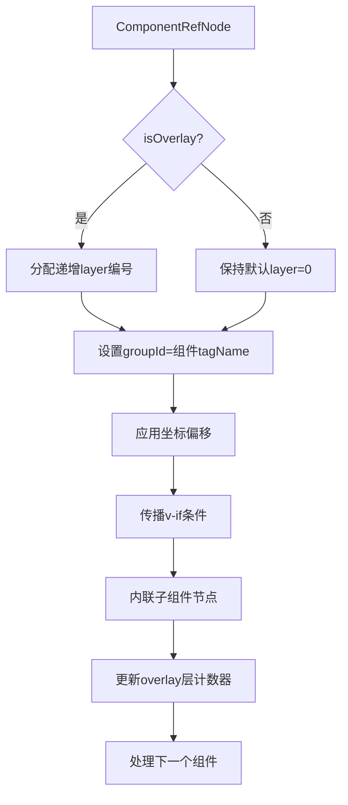
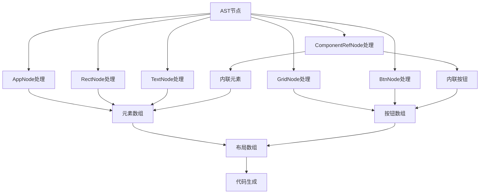

# AST节点定义

<cite>
**本文档引用的文件**
- [ast-nodes.php](file://framework/compiler/ast-nodes.php)
- [template-parser.php](file://framework/compiler/template-parser.php)
- [sfc-compiler.php](file://framework/sfc-compiler.php)
- [BaseRenderer.php](file://framework/BaseRenderer.php)
- [Application.php](file://apps/calculator/Application.php)
- [AppLayout_gen.php](file://apps/calculator/gen/AppLayout_gen.php)
- [vue-dialog-overlay-pattern.md](file://docs/vue-dialog-overlay-pattern.md)
- [architecture-roadmap.html](file://docs/architecture-roadmap.html)
</cite>

## 更新摘要
**所做更改**
- 新增layer和groupId属性到TemplateNode基类
- 更新AST节点定义以支持弹窗覆盖层系统
- 增强组件引用节点以支持overlay属性
- 完善两阶段渲染和分层点击机制
- 新增分组标识和组件边界管理

## 目录
1. [简介](#简介)
2. [项目结构](#项目结构)
3. [核心组件](#核心组件)
4. [架构概览](#架构概览)
5. [详细组件分析](#详细组件分析)
6. [依赖关系分析](#依赖关系分析)
7. [性能考虑](#性能考虑)
8. [故障排除指南](#故障排除指南)
9. [结论](#结论)

## 简介

本文件详细阐述了Vue计算器项目中的AST（抽象语法树）节点定义系统。该系统用于解析Vue单文件组件中的模板部分，将其转换为内部表示的数据结构，以便进行后续的布局计算和代码生成。

AST节点系统采用面向对象的设计模式，通过继承关系构建了一个完整的节点层次结构，能够准确表示Vue组件模板中的各种元素类型，包括应用容器、矩形背景、文本显示、网格布局和按钮等。

**更新** 本次更新重点增强了弹窗覆盖层系统支持，通过新增layer和groupId属性为复杂的UI层次结构提供数据结构基础。

## 项目结构

Vue计算器项目采用模块化的架构设计，主要包含以下核心目录和文件：

```mermaid
graph TB
subgraph "源代码结构"
SRC[src/] --> CALC[Calculator.vue]
SRC --> GEN[Calculator.gen.php]
SRC --> LAYOUT[CalculatorLayout_gen.php]
TOOLS[tools/] --> COMPILER[compiler/]
COMPILER --> AST[ast-nodes.php]
COMPILER --> PARSER[template-parser.php]
COMPILER --> SFC[sfc-compiler.php]
COMPILER --> RENDERER[BaseRenderer.php]
COMPILER --> APP[Application.php]
TESTS[tests/] --> UNIT[sfc-compiler-test.php]
TESTS --> VERIFY[verify-layout.php]
END
subgraph "生成文件"
GEN_FILE[Calculator.gen.php]
LAYOUT_FILE[CalculatorLayout_gen.php]
END
CALC --> GEN_FILE
CALC --> LAYOUT_FILE
```

**图表来源**
- [ast-nodes.php:1-211](file://framework/compiler/ast-nodes.php#L1-L211)
- [sfc-compiler.php:1-487](file://framework/sfc-compiler.php#L1-L487)

**章节来源**
- [ast-nodes.php:1-211](file://framework/compiler/ast-nodes.php#L1-L211)
- [sfc-compiler.php:1-487](file://framework/sfc-compiler.php#L1-L487)

## 核心组件

AST节点系统的核心由抽象基类和多个具体节点类型组成，每个节点都继承自统一的抽象基类，确保了类型的一致性和扩展性。

### 抽象基类：TemplateNode

所有AST节点的基类，提供了统一的接口和基础功能：

```mermaid
classDiagram
class TemplateNode {
+int line
+string vIf
+int layer
+string groupId
+__construct(int line)
}
class AppNode {
+string title
+int width
+int height
+TemplateNode[] children
+__construct(string title, int width, int height, int line)
}
class RectNode {
+int x
+int y
+int w
+int h
+string class
+__construct(int x, int y, int w, int h, string class, int line)
}
class TextNode {
+int x
+int y
+string bind
+string vModel
+string class
+string align
+int containerW
+int containerX
+bool hasContainer
+__construct(int x, int y, string bind, string class, string align, int containerW, int containerX, int line, string vModel)
}
class GridNode {
+int x
+int y
+int cols
+int rows
+int cellW
+int cellH
+int margin
+BtnNode[] buttons
+__construct(int x, int y, int cols, int rows, int cellW, int cellH, int margin, int line)
}
class BtnNode {
+int row
+int col
+string label
+string class
+string handler
+?string arg
+__construct(int row, int col, string label, string class, string handler, ?string arg, int line)
}
class UnknownNode {
+string tagName
+__construct(string tagName, int line)
}
class ComponentRefNode {
+string tagName
+string componentFile
+array props
+TemplateNode[] slotChildren
+bool selfClosing
+bool isOverlay
+__construct(string tagName, string componentFile, array props, array slotChildren, bool selfClosing, int line)
}
TemplateNode <|-- AppNode
TemplateNode <|-- RectNode
TemplateNode <|-- TextNode
TemplateNode <|-- GridNode
TemplateNode <|-- BtnNode
TemplateNode <|-- UnknownNode
TemplateNode <|-- ComponentRefNode
```



**图表来源**
- [ast-nodes.php:9-211](file://framework/compiler/ast-nodes.php#L9-L211)

### 节点类型详解

#### 抽象基类属性增强

**新增属性**：
- `layer`: 覆盖层编号，默认为0（基础层），overlay组件自动分配更高层
- `groupId`: 组件组标识符，默认为'app'，overlay组件使用其tagName

#### 应用节点（AppNode）
应用节点是整个AST的根节点，代表Vue组件的顶层容器：

- **属性**：
  - `title`: 应用标题字符串
  - `width`: 应用窗口宽度（像素）
  - `height`: 应用窗口高度（像素）
  - `children`: 子节点数组，包含所有直接子元素

- **用途**：作为模板解析的根节点，承载所有子元素

#### 矩形节点（RectNode）
矩形节点用于绘制应用程序的背景和界面元素：

- **几何属性**：
  - `x`, `y`: 矩形左上角坐标
  - `w`, `h`: 矩形宽度和高度
  - `class`: CSS类名，用于样式映射

- **约束条件**：宽度和高度必须大于0，否则会触发错误报告

#### 文本节点（TextNode）
文本节点负责渲染动态文本内容：

- **位置属性**：
  - `x`, `y`: 文本基线位置
  - `bind`: 数据绑定属性名，如"expression"或"display"
  - `vModel`: v4 M2.4: v-model数据绑定（与bind互斥）

- **样式属性**：
  - `class`: CSS类名
  - `align`: 文本对齐方式（left/right）
  - `containerW`, `containerX`: 容器宽度和起始位置

- **特殊标记**：`hasContainer`指示是否设置了容器参数

#### 网格节点（GridNode）
网格节点提供按钮布局管理功能：

- **网格参数**：
  - `x`, `y`: 网格左上角坐标
  - `cols`, `rows`: 列数和行数
  - `cellW`, `cellH`: 单元格宽高
  - `margin`: 单元格间距

- **子元素**：`buttons`数组包含所有按钮节点

#### 按钮节点（BtnNode）
按钮节点表示可交互的用户界面元素：

- **位置信息**：
  - `row`, `col`: 在网格中的行列位置
  - `label`: 按钮显示标签

- **交互信息**：
  - `class`: CSS类名
  - `handler`: 处理函数名称
  - `arg`: 函数参数（可选）

#### 未知节点（UnknownNode）
处理未支持的HTML标签：

- **用途**：当遇到不支持的标签时，创建此节点以保留信息而非忽略
- **错误处理**：同时记录相应的解析错误

#### 组件引用节点（ComponentRefNode）
**更新** 新增overlay属性支持弹窗覆盖层系统：

- **组件信息**：
  - `tagName`: 自定义标签名，如'display-panel'
  - `componentFile`: 解析后的.vue源文件绝对路径
  - `props`: 标签中的解析属性数组
  - `slotChildren`: 组件标签内的子节点（插槽内容）
  - `selfClosing`: 是否为自闭合标签

- **新增属性**：
  - `isOverlay`: 是否为overlay组件（自动分配更高层）
  - `layer`: overlay组件自动分配的层编号
  - `groupId`: 使用组件tagName作为组标识符

**章节来源**
- [ast-nodes.php:9-211](file://framework/compiler/ast-nodes.php#L9-L211)

## 架构概览

AST节点系统采用分层架构设计，从模板解析到最终的布局输出形成了完整的工作流程：



**图表来源**
- [template-parser.php:88-105](file://framework/compiler/template-parser.php#L88-L105)
- [sfc-compiler.php:289-296](file://framework/sfc-compiler.php#L289-L296)

### 模板解析流程

模板解析过程遵循标准的编译器设计模式：

1. **词法分析阶段**：将原始模板字符串分解为Token流
2. **语法分析阶段**：使用递归下降算法构建AST
3. **组件解析阶段**：解析组件引用并分配layer和groupId
4. **语义分析阶段**：验证节点约束和错误报告
5. **代码生成阶段**：将AST转换为布局数组

**章节来源**
- [template-parser.php:131-200](file://framework/compiler/template-parser.php#L131-L200)
- [template-parser.php:493-543](file://framework/compiler/template-parser.php#L493-L543)

## 详细组件分析

### 模板解析器（TemplateParser）

TemplateParser是AST节点系统的核心组件，负责将Vue模板转换为内部表示：



**图表来源**
- [template-parser.php:61-680](file://framework/compiler/template-parser.php#L61-L680)

#### 词法分析器实现

词法分析器采用正则表达式匹配策略，能够准确识别各种HTML标签和注释：

- **Token类型**：
  - `TOK_TAG_OPEN`: 开始标签
  - `TOK_TAG_CLOSE`: 结束标签  
  - `TOK_TAG_SELF`: 自闭合标签
  - `TOK_TEXT`: 文本内容
  - `TOK_COMMENT`: 注释

- **行号跟踪**：维护精确的行号信息用于错误定位

#### 语法分析器实现

递归下降解析器实现了完整的HTML语法树构建：

- **根节点验证**：确保模板以`<app>`标签开始
- **嵌套结构处理**：正确处理标签的嵌套关系
- **组件引用解析**：识别并解析组件引用标签
- **错误恢复**：在遇到错误时继续解析其他部分

**更新** 组件引用解析新增overlay属性检测和处理：

- **overlay属性检测**：`$node->isOverlay = isset($attrs['overlay'])`
- **条件传播**：从组件引用传播v-if条件到子节点
- **层分配**：overlay组件自动分配递增的layer编号

**章节来源**
- [template-parser.php:61-680](file://framework/compiler/template-parser.php#L61-L680)
- [template-parser.php:493-543](file://framework/compiler/template-parser.php#L493-L543)

### 组件解析器（resolveComponentRefs）

**新增** 组件解析器负责处理组件引用并分配层和组标识：



**图表来源**
- [sfc-compiler.php:93-181](file://framework/sfc-compiler.php#L93-L181)

#### 层分配机制

组件解析器实现了智能的层分配策略：

- **全局overlay层计数器**：`$nextOverlayLayer = 1`
- **自动层分配**：overlay组件按出现顺序分配layer=1,2,3...
- **层计数器更新**：每个overlay组件处理完其子节点后递增
- **默认层保持**：非overlay组件保持layer=0

#### 组标识管理

**新增** 组件解析器为每个内联子节点设置groupId：

- **组标识规则**：`$childNode->groupId = $child->tagName`
- **组件边界标记**：为后续的分组渲染和脏检查提供基础
- **向后兼容**：默认'app'标识符确保现有代码不受影响

**章节来源**
- [sfc-compiler.php:93-181](file://framework/sfc-compiler.php#L93-L181)

### 布局生成器

布局生成器将AST转换为最终的渲染数据结构：



**图表来源**
- [template-parser.php:557-686](file://framework/compiler/template-parser.php#L557-L686)

#### 编译时坐标计算

网格按钮的坐标在编译时进行计算，确保运行时的高效渲染：

- **公式**：`x = gridX + col * cellW + margin`
- **公式**：`y = gridY + row * cellH + margin`
- **公式**：`width = cellW - margin * 2`
- **公式**：`height = cellH - margin * 2`

#### 属性输出增强

**更新** 布局生成器现在输出新增的layer和groupId属性：

- **元素属性**：`'layer' => $child->layer` 和 `'group_id' => $child->groupId`
- **按钮属性**：`'layer' => $child->layer` 和 `'group_id' => $child->groupId`
- **向后兼容**：现有代码无需修改即可使用新属性

**章节来源**
- [template-parser.php:557-686](file://framework/compiler/template-parser.php#L557-L686)

## 依赖关系分析

AST节点系统的依赖关系清晰明确，遵循单一职责原则：

```mermaid
graph TB
subgraph "核心依赖"
AST_NODES[ast-nodes.php] --> TEMPLATE_PARSER[template-parser.php]
AST_NODES --> SFC_COMPILER[sfc-compiler.php]
CSS_MAPPINGS[css-mappings.php] --> TEMPLATE_PARSER
AOT_VALIDATOR[aot-validator.php] --> SFC_COMPILER
END
subgraph "渲染模块"
BASE_RENDERER[BaseRenderer.php] --> APP_LAYOUT[AppLayout_gen.php]
APPLICATION[Application.php] --> APP_LAYOUT
END
subgraph "工具模块"
TEMPLATE_PARSER --> CSS_MAPPINGS
TEMPLATE_PARSER --> AOT_VALIDATOR
SFC_COMPILER --> AST_NODES
SFC_COMPILER --> TEMPLATE_PARSER
SFC_COMPILER --> CSS_MAPPINGS
SFC_COMPILER --> AOT_VALIDATOR
END
subgraph "测试模块"
SFC_TEST[sfc-compiler-test.php] --> AST_NODES
SFC_TEST --> TEMPLATE_PARSER
SFC_TEST --> CSS_MAPPINGS
SFC_TEST --> AOT_VALIDATOR
VERIFY_LAYOUT[verify-layout.php] --> APP_LAYOUT
END
subgraph "生成文件"
CALCULATOR_VUE[Calculator.vue] --> CALCULATOR_GEN[Calculator.gen.php]
CALCULATOR_VUE --> CALCULATOR_LAYOUT[AppLayout_gen.php]
END
```

**图表来源**
- [sfc-compiler.php:289-296](file://framework/sfc-compiler.php#L289-L296)
- [BaseRenderer.php:88-151](file://framework/BaseRenderer.php#L88-L151)

### 错误处理机制

系统实现了多层次的错误处理机制：

1. **解析错误**：TemplateParseError类封装错误信息
2. **验证错误**：AotValidator检查生成代码的兼容性
3. **运行时错误**：UnknownNode处理未知标签
4. **组件解析警告**：resolveComponentRefs返回解析警告

**章节来源**
- [template-parser.php:44-59](file://framework/compiler/template-parser.php#L44-L59)
- [sfc-compiler.php:95-97](file://framework/sfc-compiler.php#L95-L97)

## 性能考虑

AST节点系统在设计时充分考虑了性能优化：

### 内存使用优化
- **节点复用**：相同类型的节点共享属性结构
- **延迟计算**：坐标等复杂属性在需要时才计算
- **紧凑存储**：使用基本数据类型减少内存占用
- **层计数器缓存**：避免重复计算overlay层编号

### 计算效率优化
- **编译时计算**：网格坐标在编译时预计算
- **批量处理**：支持批量样式解析和节点遍历
- **缓存机制**：CSS样式映射结果缓存
- **层过滤优化**：渲染时按层分组处理

### 可扩展性设计
- **插件架构**：新的节点类型可以轻松添加
- **配置驱动**：CSS属性映射通过配置文件管理
- **接口抽象**：统一的节点接口便于扩展
- **组标识系统**：为后续的分组渲染和脏检查提供基础

## 故障排除指南

### 常见问题及解决方案

#### 解析错误
- **症状**：模板解析失败，出现错误信息
- **原因**：标签不匹配、属性缺失、语法错误
- **解决**：检查模板语法，确保所有标签正确闭合

#### 样式解析错误
- **症状**：颜色值无效，尺寸解析失败
- **原因**：CSS语法错误或不支持的属性
- **解决**：检查CSS语法，使用支持的属性值

#### AOT编译错误
- **症状**：生成的PHP文件无法被AOT编译器处理
- **原因**：文件名包含多个点、使用了不支持的PHP特性
- **解决**：修改文件名格式，避免使用PHP8特有的函数

#### overlay层分配问题
- **症状**：overlay组件层分配异常
- **原因**：组件嵌套深度超过限制、overlay属性使用错误
- **解决**：检查组件嵌套层数不超过1层，确保overlay属性正确使用

**章节来源**
- [sfc-compiler.php:95-104](file://framework/sfc-compiler.php#L95-L104)
- [template-parser.php:44-59](file://framework/compiler/template-parser.php#L44-L59)

### 调试技巧

1. **启用AST转储**：使用`--dump-ast`选项查看解析结果
2. **检查行号**：利用节点的line属性精确定位错误位置
3. **单元测试**：运行测试套件验证各组件功能
4. **层分配验证**：检查生成的布局文件中layer和group_id属性

**章节来源**
- [sfc-compiler.php:280-284](file://framework/sfc-compiler.php#L280-L284)
- [template-parser.php:118-121](file://framework/compiler/template-parser.php#L118-L121)

## 结论

AST节点定义系统为Vue计算器项目提供了强大而灵活的模板解析能力。通过精心设计的节点层次结构、完善的错误处理机制和高效的代码生成流程，该系统成功地将Vue模板转换为高性能的桌面应用程序界面。

**更新亮点** 本次更新显著增强了系统的弹窗覆盖层支持：

1. **层管理系统**：通过layer属性实现多层UI叠加
2. **组标识系统**：通过groupId属性管理组件边界
3. **智能分配机制**：自动为overlay组件分配递增层编号
4. **向后兼容性**：现有代码完全不受影响
5. **两阶段渲染**：支持分层渲染和分层点击处理

系统的主要优势包括：

1. **类型安全**：强类型的节点设计确保了数据的正确性
2. **扩展性强**：模块化的架构支持新节点类型的添加
3. **性能优异**：编译时计算和缓存机制提升了运行时性能
4. **易于维护**：清晰的代码结构和完善的测试覆盖
5. **功能完备**：支持复杂的UI层次结构和交互场景

未来可以考虑的改进方向：
- 添加更多节点类型支持
- 实现增量编译以提升开发效率
- 增强错误诊断和自动修复功能
- 优化层管理和组标识的性能表现
- 扩展overlay系统的功能和灵活性