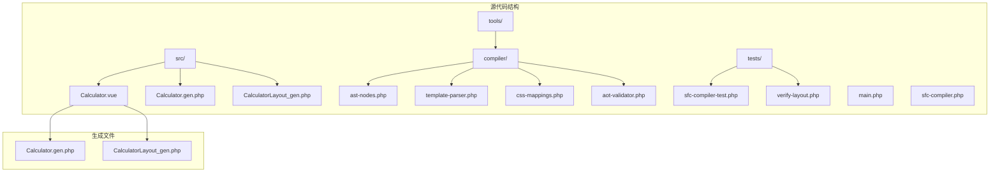
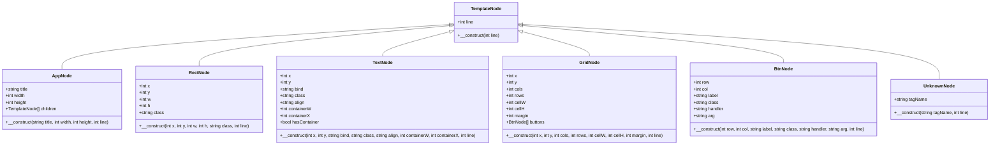
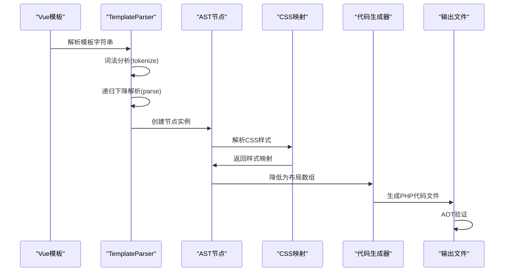
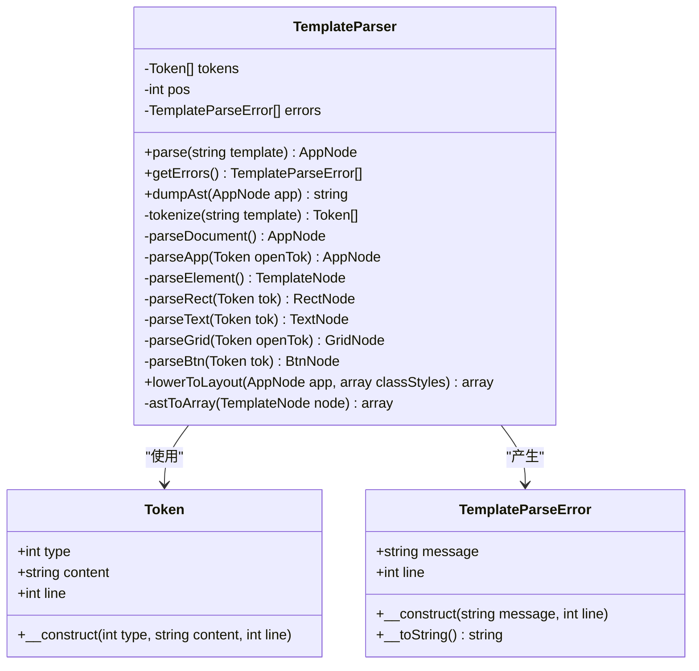
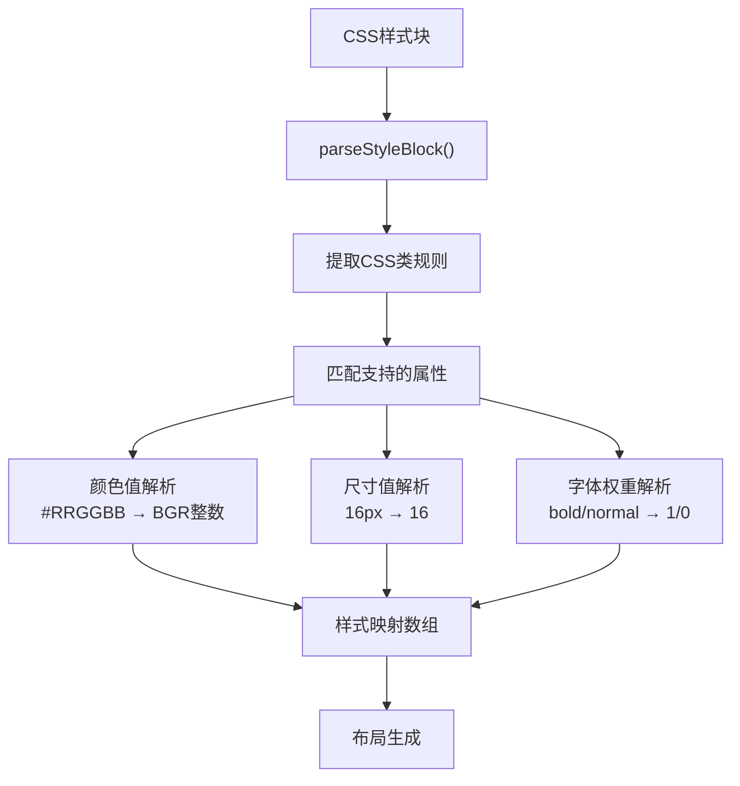
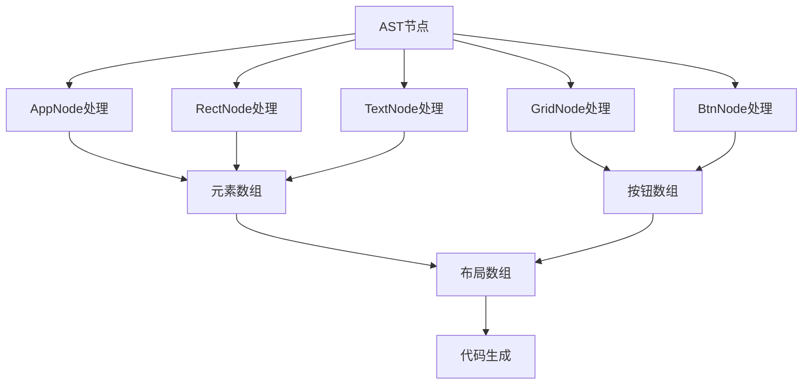
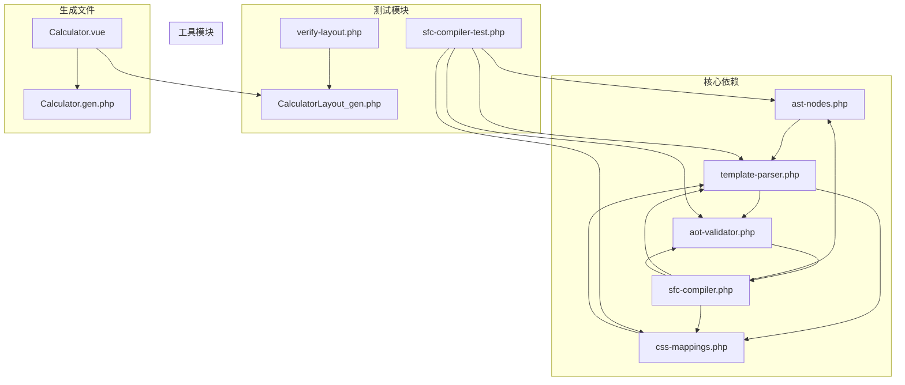

# AST节点定义

<cite>
**本文档引用的文件**
- [ast-nodes.php](file://tools/compiler/ast-nodes.php)
- [template-parser.php](file://tools/compiler/template-parser.php)
- [Calculator.vue](file://src/Calculator.vue)
- [Calculator.gen.php](file://src/Calculator.gen.php)
- [CalculatorLayout_gen.php](file://src/CalculatorLayout_gen.php)
- [css-mappings.php](file://tools/compiler/css-mappings.php)
- [aot-validator.php](file://tools/compiler/aot-validator.php)
- [sfc-compiler.php](file://tools/sfc-compiler.php)
- [sfc-compiler-test.php](file://tests/sfc-compiler-test.php)
- [verify-layout.php](file://tests/verify-layout.php)
</cite>

## 目录
1. [简介](#简介)
2. [项目结构](#项目结构)
3. [核心组件](#核心组件)
4. [架构概览](#架构概览)
5. [详细组件分析](#详细组件分析)
6. [依赖关系分析](#依赖关系分析)
7. [性能考虑](#性能考虑)
8. [故障排除指南](#故障排除指南)
9. [结论](#结论)

## 简介

本文件详细阐述了Vue计算器项目中的AST（抽象语法树）节点定义系统。该系统用于解析Vue单文件组件中的模板部分，将其转换为内部表示的数据结构，以便进行后续的布局计算和代码生成。

AST节点系统采用面向对象的设计模式，通过继承关系构建了一个完整的节点层次结构，能够准确表示Vue组件模板中的各种元素类型，包括应用容器、矩形背景、文本显示、网格布局和按钮等。

## 项目结构

Vue计算器项目采用模块化的架构设计，主要包含以下核心目录和文件：

**图表来源**
- [Calculator.vue:1-215](file://src/Calculator.vue#L1-L215)
- [sfc-compiler.php:1-210](file://tools/sfc-compiler.php#L1-L210)

**章节来源**
- [Calculator.vue:1-215](file://src/Calculator.vue#L1-L215)
- [sfc-compiler.php:1-210](file://tools/sfc-compiler.php#L1-L210)

## 核心组件

AST节点系统的核心由抽象基类和多个具体节点类型组成，每个节点都继承自统一的抽象基类，确保了类型的一致性和扩展性。

### 抽象基类：TemplateNode

所有AST节点的基类，提供了统一的接口和基础功能：

**图表来源**
- [ast-nodes.php:9-153](file://tools/compiler/ast-nodes.php#L9-L153)

### 节点类型详解

#### 应用节点（AppNode）
应用节点是整个AST的根节点，代表Vue组件的顶层容器：

- **属性**：
  - `title`: 应用标题字符串
  - `width`: 应用窗口宽度（像素）
  - `height`: 应用窗口高度（像素）
  - `children`: 子节点数组，包含所有直接子元素

- **用途**：作为模板解析的根节点，承载所有子元素

#### 矩形节点（RectNode）
矩形节点用于绘制应用程序的背景和界面元素：

- **几何属性**：
  - `x`, `y`: 矩形左上角坐标
  - `w`, `h`: 矩形宽度和高度
  - `class`: CSS类名，用于样式映射

- **约束条件**：宽度和高度必须大于0，否则会触发错误报告

#### 文本节点（TextNode）
文本节点负责渲染动态文本内容：

- **位置属性**：
  - `x`, `y`: 文本基线位置
  - `bind`: 数据绑定属性名，如"expression"或"display"

- **样式属性**：
  - `class`: CSS类名
  - `align`: 文本对齐方式（left/right）
  - `containerW`, `containerX`: 容器宽度和起始位置

- **特殊标记**：`hasContainer`指示是否设置了容器参数

#### 网格节点（GridNode）
网格节点提供按钮布局管理功能：

- **网格参数**：
  - `x`, `y`: 网格左上角坐标
  - `cols`, `rows`: 列数和行数
  - `cellW`, `cellH`: 单元格宽高
  - `margin`: 单元格间距

- **子元素**：`buttons`数组包含所有按钮节点

#### 按钮节点（BtnNode）
按钮节点表示可交互的用户界面元素：

- **位置信息**：
  - `row`, `col`: 在网格中的行列位置
  - `label`: 按钮显示标签

- **交互信息**：
  - `class`: CSS类名
  - `handler`: 处理函数名称
  - `arg`: 函数参数（可选）

#### 未知节点（UnknownNode）
处理未支持的HTML标签：

- **用途**：当遇到不支持的标签时，创建此节点以保留信息而非忽略
- **错误处理**：同时记录相应的解析错误

**章节来源**
- [ast-nodes.php:9-153](file://tools/compiler/ast-nodes.php#L9-L153)

## 架构概览

AST节点系统采用分层架构设计，从模板解析到最终的布局输出形成了完整的工作流程：

**图表来源**
- [template-parser.php:79-96](file://tools/compiler/template-parser.php#L79-L96)
- [sfc-compiler.php:99-122](file://tools/sfc-compiler.php#L99-L122)

### 模板解析流程

模板解析过程遵循标准的编译器设计模式：

1. **词法分析阶段**：将原始模板字符串分解为Token流
2. **语法分析阶段**：使用递归下降算法构建AST
3. **语义分析阶段**：验证节点约束和错误报告
4. **代码生成阶段**：将AST转换为布局数组

**章节来源**
- [template-parser.php:118-199](file://tools/compiler/template-parser.php#L118-L199)
- [template-parser.php:205-451](file://tools/compiler/template-parser.php#L205-L451)

## 详细组件分析

### 模板解析器（TemplateParser）

TemplateParser是AST节点系统的核心组件，负责将Vue模板转换为内部表示：

**图表来源**
- [template-parser.php:60-680](file://tools/compiler/template-parser.php#L60-L680)

#### 词法分析器实现

词法分析器采用正则表达式匹配策略，能够准确识别各种HTML标签和注释：

- **Token类型**：
  - `TOK_TAG_OPEN`: 开始标签
  - `TOK_TAG_CLOSE`: 结束标签  
  - `TOK_TAG_SELF`: 自闭合标签
  - `TOK_TEXT`: 文本内容
  - `TOK_COMMENT`: 注释

- **行号跟踪**：维护精确的行号信息用于错误定位

#### 语法分析器实现

递归下降解析器实现了完整的HTML语法树构建：

- **根节点验证**：确保模板以`<app>`标签开始
- **嵌套结构处理**：正确处理标签的嵌套关系
- **错误恢复**：在遇到错误时继续解析其他部分

**章节来源**
- [template-parser.php:60-680](file://tools/compiler/template-parser.php#L60-L680)

### CSS样式映射系统

CSS映射系统将CSS样式属性转换为渲染引擎可用的数值格式：

**图表来源**
- [css-mappings.php:164-194](file://tools/compiler/css-mappings.php#L164-L194)

#### 支持的CSS属性

系统支持以下CSS属性的解析和转换：

- **颜色属性**：`background`, `color` → BGR颜色值
- **尺寸属性**：`font-size` → 像素值
- **字体属性**：`font-weight` → 粗细标志
- **布局属性**：`border-radius`, `padding`, `margin` → 数值
- **文本属性**：`text-align` → 对齐方式

**章节来源**
- [css-mappings.php:27-69](file://tools/compiler/css-mappings.php#L27-L69)

### 布局生成器

布局生成器将AST转换为最终的渲染数据结构：

**图表来源**
- [template-parser.php:464-541](file://tools/compiler/template-parser.php#L464-L541)

#### 编译时坐标计算

网格按钮的坐标在编译时进行计算，确保运行时的高效渲染：

- **公式**：`x = gridX + col * cellW + margin`
- **公式**：`y = gridY + row * cellH + margin`
- **公式**：`width = cellW - margin * 2`
- **公式**：`height = cellH - margin * 2`

**章节来源**
- [template-parser.php:498-525](file://tools/compiler/template-parser.php#L498-L525)

## 依赖关系分析

AST节点系统的依赖关系清晰明确，遵循单一职责原则：

**图表来源**
- [sfc-compiler.php:19-25](file://tools/sfc-compiler.php#L19-L25)
- [sfc-compiler-test.php:15-18](file://tests/sfc-compiler-test.php#L15-L18)

### 错误处理机制

系统实现了多层次的错误处理机制：

1. **解析错误**：TemplateParseError类封装错误信息
2. **验证错误**：AotValidator检查生成代码的兼容性
3. **运行时错误**：UnknownNode处理未知标签

**章节来源**
- [template-parser.php:43-58](file://tools/compiler/template-parser.php#L43-L58)
- [aot-validator.php:17-169](file://tools/compiler/aot-validator.php#L17-L169)

## 性能考虑

AST节点系统在设计时充分考虑了性能优化：

### 内存使用优化
- **节点复用**：相同类型的节点共享属性结构
- **延迟计算**：坐标等复杂属性在需要时才计算
- **紧凑存储**：使用基本数据类型减少内存占用

### 计算效率优化
- **编译时计算**：网格坐标在编译时预计算
- **批量处理**：支持批量样式解析和节点遍历
- **缓存机制**：CSS样式映射结果缓存

### 可扩展性设计
- **插件架构**：新的节点类型可以轻松添加
- **配置驱动**：CSS属性映射通过配置文件管理
- **接口抽象**：统一的节点接口便于扩展

## 故障排除指南

### 常见问题及解决方案

#### 解析错误
- **症状**：模板解析失败，出现错误信息
- **原因**：标签不匹配、属性缺失、语法错误
- **解决**：检查模板语法，确保所有标签正确闭合

#### 样式解析错误
- **症状**：颜色值无效，尺寸解析失败
- **原因**：CSS语法错误或不支持的属性
- **解决**：检查CSS语法，使用支持的属性值

#### AOT编译错误
- **症状**：生成的PHP文件无法被AOT编译器处理
- **原因**：文件名包含多个点、使用了不支持的PHP特性
- **解决**：修改文件名格式，避免使用PHP8特有的函数

**章节来源**
- [sfc-compiler-test.php:135-170](file://tests/sfc-compiler-test.php#L135-L170)
- [aot-validator.php:29-106](file://tools/compiler/aot-validator.php#L29-L106)

### 调试技巧

1. **启用AST转储**：使用`--dump-ast`选项查看解析结果
2. **检查行号**：利用节点的line属性精确定位错误位置
3. **单元测试**：运行测试套件验证各组件功能

**章节来源**
- [sfc-compiler.php:113-117](file://tools/sfc-compiler.php#L113-L117)
- [sfc-compiler-test.php:198-207](file://tests/sfc-compiler-test.php#L198-L207)

## 结论

AST节点定义系统为Vue计算器项目提供了强大而灵活的模板解析能力。通过精心设计的节点层次结构、完善的错误处理机制和高效的代码生成流程，该系统成功地将Vue模板转换为高性能的桌面应用程序界面。

系统的主要优势包括：

1. **类型安全**：强类型的节点设计确保了数据的正确性
2. **扩展性强**：模块化的架构支持新节点类型的添加
3. **性能优异**：编译时计算和缓存机制提升了运行时性能
4. **易于维护**：清晰的代码结构和完善的测试覆盖

未来可以考虑的改进方向：
- 添加更多节点类型支持
- 实现增量编译以提升开发效率
- 增强错误诊断和自动修复功能