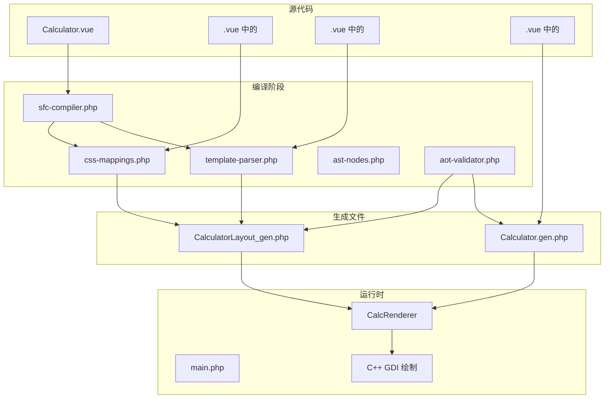
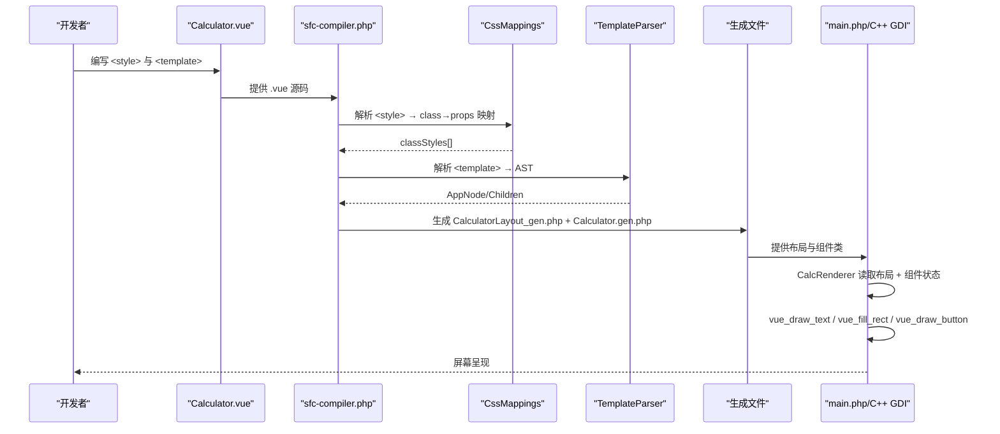
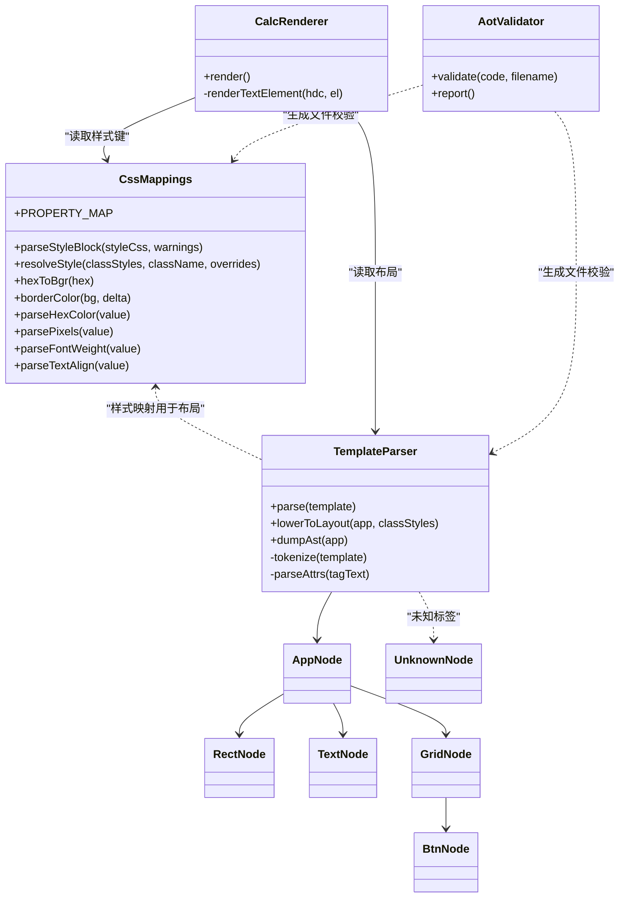

# CSS样式映射

<cite>
**本文引用的文件**
- [css-mappings.php](file://tools/compiler/css-mappings.php)
- [Calculator.vue](file://src/Calculator.vue)
- [Calculator.gen.php](file://src/Calculator.gen.php)
- [sfc-compiler.php](file://tools/sfc-compiler.php)
- [template-parser.php](file://tools/compiler/template-parser.php)
- [ast-nodes.php](file://tools/compiler/ast-nodes.php)
- [ReactiveComponent.php](file://src/ReactiveComponent.php)
- [CalculatorLayout_gen.php](file://src/CalculatorLayout_gen.php)
- [main.php](file://main.php)
- [aot-validator.php](file://tools/compiler/aot-validator.php)
- [sfc-compiler-test.php](file://tests/sfc-compiler-test.php)
</cite>

## 目录
1. [简介](#简介)
2. [项目结构](#项目结构)
3. [核心组件](#核心组件)
4. [架构总览](#架构总览)
5. [详细组件分析](#详细组件分析)
6. [依赖关系分析](#依赖关系分析)
7. [性能考量](#性能考量)
8. [故障排查指南](#故障排查指南)
9. [结论](#结论)
10. [附录](#附录)

## 简介
本文件面向CSS样式映射系统，聚焦于将CSS属性映射到Win32 GDI绘制参数的机制与实现细节。文档涵盖：
- CSS到GDI属性的映射规则（颜色、字体、边距、内边距、对齐等）
- 样式解析器的实现（CSS语法解析、选择器匹配、属性值解析）
- 样式优先级、继承与默认值策略
- 样式映射表与转换规则清单
- 调试技巧与常见问题解决方案
- 如何扩展支持新的CSS属性

## 项目结构
该项目采用“单文件组件（SFC）+ 编译器 + AOT验证”的流水线，将Vue风格模板与样式编译为可在C++ GDI层渲染的数据结构。

图表来源
- [sfc-compiler.php: 85-127:85-127](file://tools/sfc-compiler.php#L85-L127)
- [css-mappings.php: 164-194:164-194](file://tools/compiler/css-mappings.php#L164-L194)
- [template-parser.php: 464-541:464-541](file://tools/compiler/template-parser.php#L464-L541)
- [main.php: 99-132:99-132](file://main.php#L99-L132)

章节来源
- [sfc-compiler.php: 1-L210:1-210](file://tools/sfc-compiler.php#L1-L210)
- [Calculator.vue: 1-L215:1-215](file://src/Calculator.vue#L1-L215)

## 核心组件
- 样式映射器：负责将CSS属性解析为GDI可用的键值对，并提供默认值与警告提示。
- 模板解析器：递归下降解析模板，构建AST，再下推为布局数组。
- 编译器：串联样式解析与模板解析，生成布局与组件类文件，并进行AOT验证。
- 运行时渲染器：读取布局数据，结合组件状态，调用C++ GDI绘制接口。

章节来源
- [css-mappings.php: 15-L210:15-210](file://tools/compiler/css-mappings.php#L15-L210)
- [template-parser.php: 60-L680:60-680](file://tools/compiler/template-parser.php#L60-L680)
- [sfc-compiler.php: 85-L210:85-210](file://tools/sfc-compiler.php#L85-L210)
- [main.php: 26-L133:26-133](file://main.php#L26-L133)

## 架构总览
CSS样式映射与渲染的关键流程如下：

图表来源
- [sfc-compiler.php: 85-L210:85-210](file://tools/sfc-compiler.php#L85-L210)
- [css-mappings.php: 164-L194:164-194](file://tools/compiler/css-mappings.php#L164-L194)
- [template-parser.php: 464-L541:464-541](file://tools/compiler/template-parser.php#L464-L541)
- [main.php: 99-L132:99-132](file://main.php#L99-L132)

## 详细组件分析

### 样式映射器（CssMappings）
- 职责
  - 定义CSS属性到输出键的映射表（PROPERTY_MAP），每个条目包含：输出键、解析器、默认值。
  - 提供颜色解析（十六进制转BGR整数）、边框色派生、像素值解析、字体粗细解析、文本对齐解析。
  - 解析整个<style>块，提取类名与属性，返回class→props映射；若未指定背景或前景色，记录警告。
  - 合并类样式与内联覆盖（resolveStyle）。

- 关键实现要点
  - 颜色解析：支持#RGB与#RRGGBB，非法值回退为黑色。
  - 边框色：基于背景色通道加固定增量，上限255。
  - 字体粗细：'bold'或数值≥600视为粗体，否则常规。
  - 文本对齐：仅接受left/right/center，否则默认left。
  - 默认值：背景0（透明黑），前景白色，字号16，粗细0，圆角/内边距/外边距/对齐默认0或left。

- 使用示例（路径）
  - [parseStyleBlock:164-194](file://tools/compiler/css-mappings.php#L164-L194)
  - [resolveStyle:204-208](file://tools/compiler/css-mappings.php#L204-L208)
  - [PROPERTY_MAP:27-69](file://tools/compiler/css-mappings.php#L27-L69)

章节来源
- [css-mappings.php: 15-L210:15-210](file://tools/compiler/css-mappings.php#L15-L210)

### 样式解析器（TemplateParser）
- 职责
  - 将模板字符串词法分析为Token序列，再递归下降解析为AST节点。
  - 支持rect、text、grid、btn等标签，未知标签生成UnknownNode并保留错误信息。
  - 将AST下推为布局数组：rect→color，text→fontSize/color/bold/align，grid→按钮坐标与样式（含边框）。

- 关键实现要点
  - 错误收集：TemplateParseError携带行号，便于定位问题。
  - 属性解析：支持:bind、@click、container-w/container-x等自定义属性。
  - 坐标计算：grid内按钮位置在编译期计算，考虑margin与单元尺寸。

- 使用示例（路径）
  - [lowerToLayout:464-541](file://tools/compiler/template-parser.php#L464-L541)
  - [parseAttrs:567-589](file://tools/compiler/template-parser.php#L567-L589)
  - [AST节点定义:20-153](file://tools/compiler/ast-nodes.php#L20-L153)

章节来源
- [template-parser.php: 60-L680:60-680](file://tools/compiler/template-parser.php#L60-L680)
- [ast-nodes.php: 1-L153:1-153](file://tools/compiler/ast-nodes.php#L1-L153)

### 编译器（sfc-compiler.php）
- 职责
  - 抽取template/script/style三块。
  - 调用CssMappings解析样式，调用TemplateParser解析模板，生成布局与组件类文件。
  - 进行AOT验证，通过后再写入磁盘。

- 关键实现要点
  - 步骤化流程：提取→样式解析→模板解析→AST→布局数组→AOT验证→生成文件。
  - 输出文件：CalculatorLayout_gen.php（布局数组）、Calculator.gen.php（组件类）。

- 使用示例（路径）
  - [主流程:85-210](file://tools/sfc-compiler.php#L85-L210)
  - [生成布局文件:133-182](file://tools/sfc-compiler.php#L133-L182)

章节来源
- [sfc-compiler.php: 1-L210:1-210](file://tools/sfc-compiler.php#L1-L210)

### 运行时渲染器（main.php）
- 职责
  - 读取布局数据，遍历元素与按钮，调用C++绘制接口。
  - 文本渲染支持动态字号与右对齐容器计算。
  - 按钮渲染包含背景、边框与居中文本。

- 关键实现要点
  - 数据驱动：仅在组件状态变更（dirty）时重绘。
  - 文本对齐：右对齐时根据容器宽度与字符宽度计算x偏移。
  - 动态字号：长数字时自动缩小字号。

- 使用示例（路径）
  - [renderTextElement:50-94](file://main.php#L50-L94)
  - [render:99-132](file://main.php#L99-L132)

章节来源
- [main.php: 26-L133:26-133](file://main.php#L26-L133)

### AOT验证器（aot-validator.php）
- 职责
  - 在生成文件写盘前进行AOT兼容性检查，防止编译失败。
  - 规则：文件名中最多一个点、禁止const嵌套数组、禁止变量属性/方法访问、PHP8函数警告、代码需位于类或函数内。

- 使用示例（路径）
  - [validate:36-106](file://tools/compiler/aot-validator.php#L36-L106)

章节来源
- [aot-validator.php: 1-L169:1-169](file://tools/compiler/aot-validator.php#L1-L169)

## 依赖关系分析

图表来源
- [css-mappings.php: 15-L210:15-210](file://tools/compiler/css-mappings.php#L15-L210)
- [template-parser.php: 60-L680:60-680](file://tools/compiler/template-parser.php#L60-L680)
- [ast-nodes.php: 20-L153:20-153](file://tools/compiler/ast-nodes.php#L20-L153)
- [main.php: 26-L133:26-133](file://main.php#L26-L133)
- [aot-validator.php: 17-L169:17-169](file://tools/compiler/aot-validator.php#L17-L169)

## 性能考量
- 编译期计算：grid按钮坐标在编译期完成，运行时只需按索引读取，降低运行时开销。
- 样式解析：正则逐条扫描PROPERTY_MAP，复杂度O(N)，N为类数量；整体开销较小。
- 文本渲染：右对齐计算按字符长度线性执行，通常影响有限。
- AOT验证：正则扫描，快速过滤不兼容模式，避免后续编译失败。

## 故障排查指南
- CSS类缺少背景或前景色
  - 现象：样式解析阶段产生警告，可能导致不可见或透明渲染。
  - 处理：为类添加background或color。
  - 参考：[parseStyleBlock 警告逻辑:185-188](file://tools/compiler/css-mappings.php#L185-L188)

- 颜色值格式错误
  - 现象：非法十六进制被解析为0（黑色）。
  - 处理：确保使用#RRGGBB或#RGB格式。
  - 参考：[hexToBgr:79-96](file://tools/compiler/css-mappings.php#L79-L96)

- 字体粗细解析
  - 现象：'bold'或数值≥600才视为粗体。
  - 处理：使用'bold'或数值≥600。
  - 参考：[parseFontWeight:132-139](file://tools/compiler/css-mappings.php#L132-L139)

- 文本对齐无效
  - 现象：非left/right/center将回退为left。
  - 处理：使用受支持的对齐方式。
  - 参考：[parseTextAlign:144-151](file://tools/compiler/css-mappings.php#L144-L151)

- 模板解析错误
  - 现象：未知标签、属性缺失、按钮不在grid内等会生成错误与UnknownNode。
  - 处理：修正模板结构与属性。
  - 参考：[TemplateParser 错误收集:610-613](file://tools/compiler/template-parser.php#L610-L613)

- AOT验证失败
  - 现象：文件名含多个点、const嵌套数组、变量属性/方法访问、PHP8函数等。
  - 处理：遵循AOT约束，使用函数返回数组、避免变量访问、替换PHP8函数。
  - 参考：[AotValidator 规则:36-106](file://tools/compiler/aot-validator.php#L36-L106)

章节来源
- [css-mappings.php: 79-L151:79-151](file://tools/compiler/css-mappings.php#L79-L151)
- [template-parser.php: 610-L613:610-613](file://tools/compiler/template-parser.php#L610-L613)
- [aot-validator.php: 36-L106:36-106](file://tools/compiler/aot-validator.php#L36-L106)

## 结论
该CSS样式映射系统通过简洁的映射表与稳健的解析器，实现了从CSS到GDI绘制参数的可靠转换。编译期的布局生成与AOT验证保证了运行时的稳定性与性能。开发者可通过扩展PROPERTY_MAP与模板解析规则，轻松支持更多CSS属性与渲染需求。

## 附录

### 样式映射表与转换规则
- 背景颜色 background
  - CSS: background: #RRGGBB | #RGB
  - 输出键: bg
  - 解析器: parseHexColor
  - 默认值: 0（透明黑）
  - 参考: [PROPERTY_MAP:27-32](file://tools/compiler/css-mappings.php#L27-L32)

- 前景色 color
  - CSS: color: #RRGGBB | #RGB
  - 输出键: fg
  - 解析器: parseHexColor
  - 默认值: 白色
  - 参考: [PROPERTY_MAP:33-37](file://tools/compiler/css-mappings.php#L33-L37)

- 字号 font-size
  - CSS: font-size: Npx
  - 输出键: fontSize
  - 解析器: parsePixels
  - 默认值: 16
  - 参考: [PROPERTY_MAP:38-42](file://tools/compiler/css-mappings.php#L38-L42)

- 字体粗细 font-weight
  - CSS: font-weight: bold | 数值
  - 输出键: bold
  - 解析器: parseFontWeight
  - 默认值: 0（常规）
  - 参考: [PROPERTY_MAP:43-47](file://tools/compiler/css-mappings.php#L43-L47)

- 圆角 border-radius
  - CSS: border-radius: Npx
  - 输出键: borderRadius
  - 解析器: parsePixels
  - 默认值: 0
  - 参考: [PROPERTY_MAP:49-53](file://tools/compiler/css-mappings.php#L49-L53)

- 内边距 padding
  - CSS: padding: Npx
  - 输出键: padding
  - 解析器: parsePixels
  - 默认值: 0
  - 参考: [PROPERTY_MAP:54-58](file://tools/compiler/css-mappings.php#L54-L58)

- 外边距 margin
  - CSS: margin: Npx
  - 输出键: margin
  - 解析器: parsePixels
  - 默认值: 0
  - 参考: [PROPERTY_MAP:59-63](file://tools/compiler/css-mappings.php#L59-L63)

- 文本对齐 text-align
  - CSS: text-align: left | right | center
  - 输出键: textAlign
  - 解析器: parseTextAlign
  - 默认值: left
  - 参考: [PROPERTY_MAP:64-69](file://tools/compiler/css-mappings.php#L64-L69)

- 边框色派生
  - 背景色 → 边框色：各通道+20，上限255
  - 参考: [borderColor:101-107](file://tools/compiler/css-mappings.php#L101-L107)

### 样式优先级、继承与默认值
- 优先级
  - 类样式与内联覆盖合并，后者优先（resolveStyle采用数组合并，后者覆盖前者同键值）。
  - 参考: [resolveStyle:204-208](file://tools/compiler/css-mappings.php#L204-L208)

- 继承
  - 本系统未实现CSS级继承，样式来源于类映射与内联覆盖。

- 默认值
  - 背景0（透明黑），前景白色，字号16，粗细0，圆角/内边距/外边距/对齐默认0或left。
  - 参考: [PROPERTY_MAP 默认值:27-69](file://tools/compiler/css-mappings.php#L27-L69)

### 扩展新CSS属性的步骤
- 在映射表中新增条目
  - 添加 PROPERTY_MAP 条目，指定输出键、解析器、默认值。
  - 参考: [PROPERTY_MAP:27-69](file://tools/compiler/css-mappings.php#L27-L69)

- 实现解析器
  - 在CssMappings中新增解析函数，返回目标类型（如int、string）。
  - 参考: [解析器示例:116-151](file://tools/compiler/css-mappings.php#L116-L151)

- 在模板解析器中使用
  - 在lowerToLayout中读取classStyles对应键，或在节点属性中读取内联覆盖。
  - 参考: [lowerToLayout 使用样式:464-541](file://tools/compiler/template-parser.php#L464-L541)

- 更新AOT验证与生成
  - 确保生成文件符合AOT约束，必要时调整生成逻辑。
  - 参考: [AOT验证:36-106](file://tools/compiler/aot-validator.php#L36-L106)

### 调试技巧
- 启用AST转储
  - 使用命令行参数--dump-ast查看AST结构，辅助定位模板问题。
  - 参考: [CLI 参数:26-34](file://tools/sfc-compiler.php#L26-L34)

- 查看样式解析警告
  - 编译器输出样式解析警告，关注无背景/前景色提示。
  - 参考: [样式警告输出:92-94](file://tools/sfc-compiler.php#L92-L94)

- 运行时调试
  - 在CalcRenderer中打印布局元素与按钮信息，确认坐标与样式是否正确。
  - 参考: [render 流程:99-132](file://main.php#L99-L132)