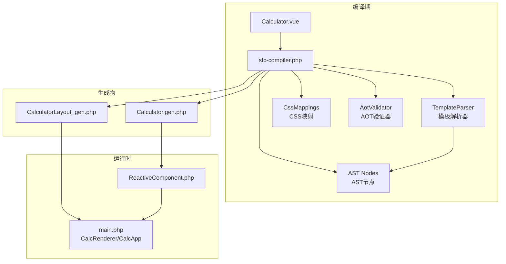
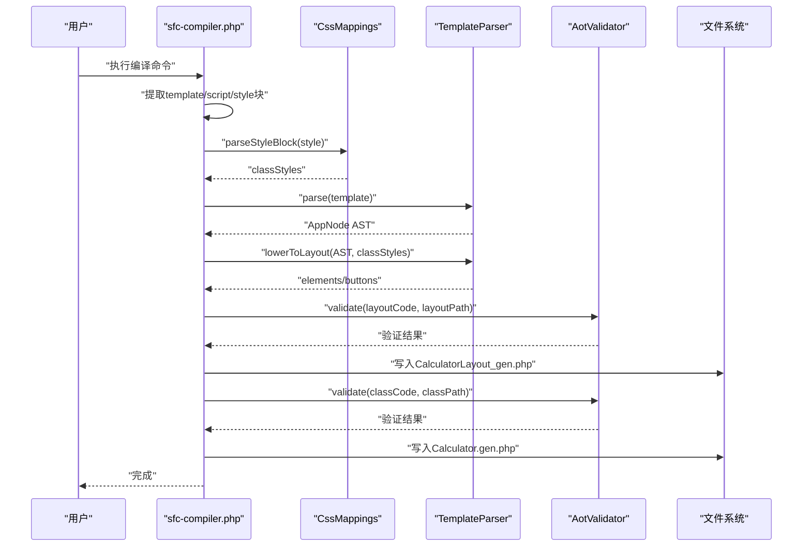
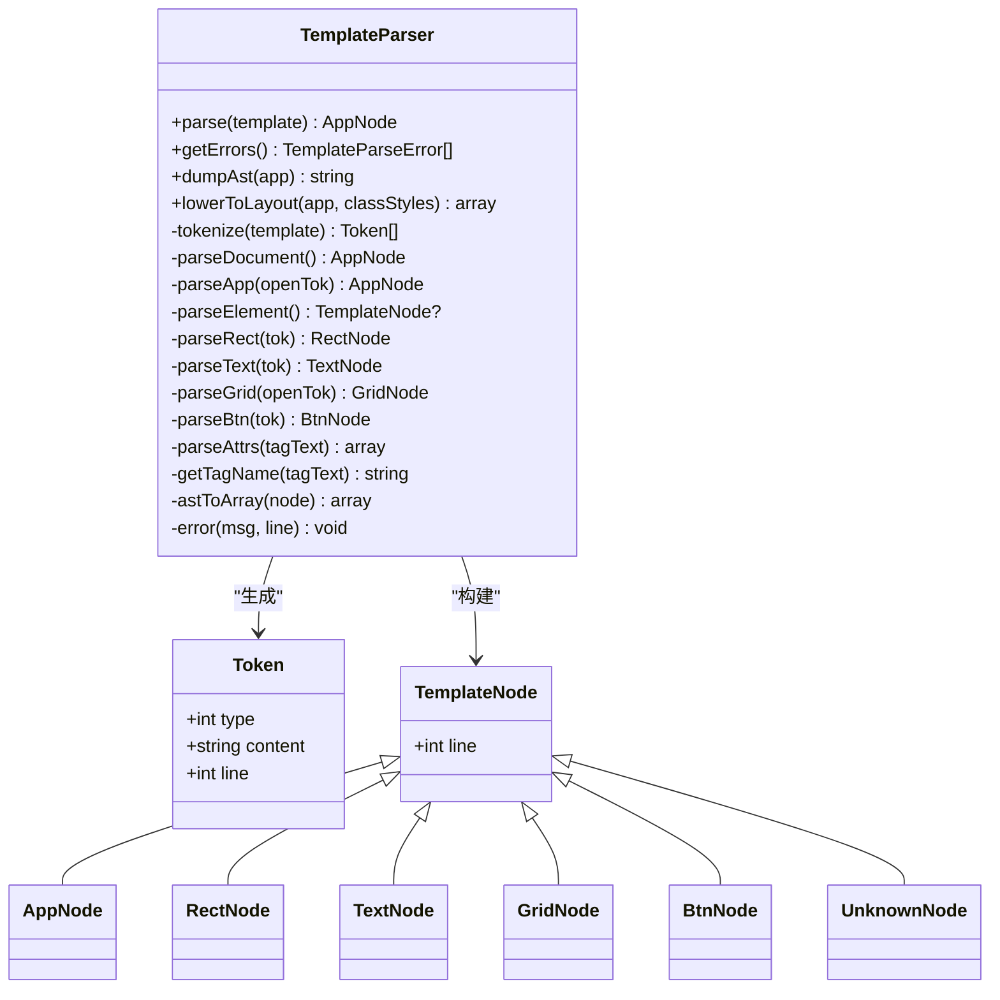
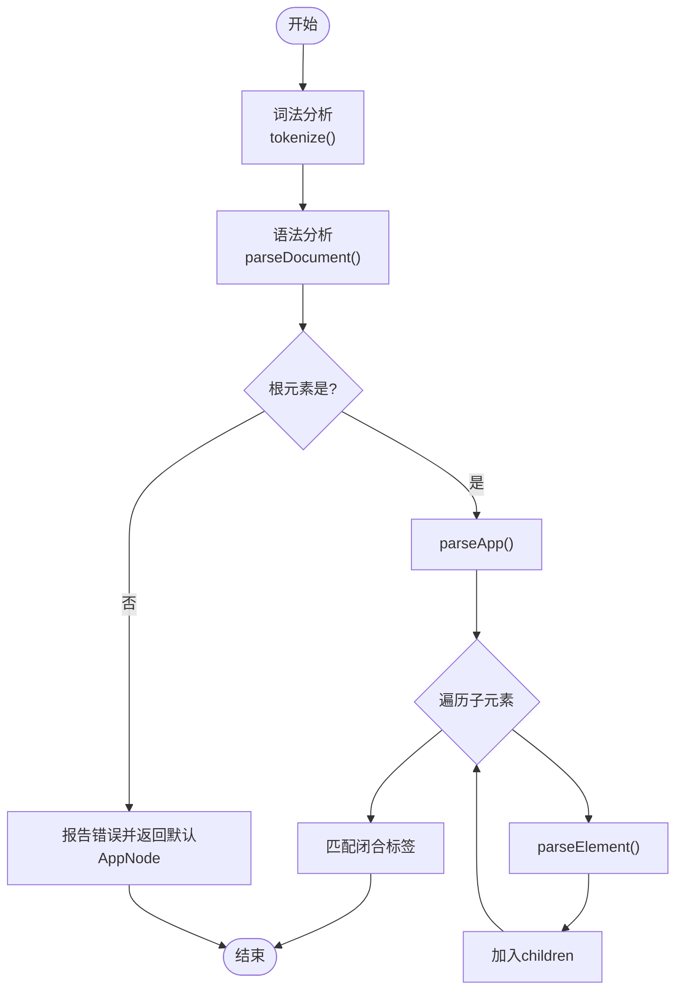
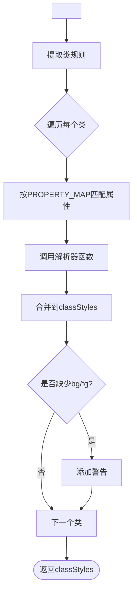
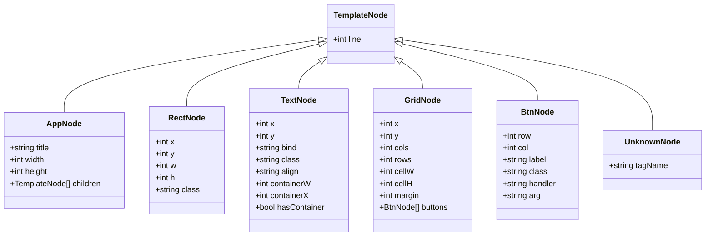
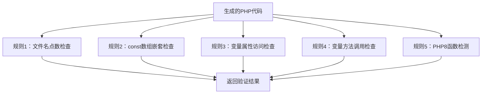
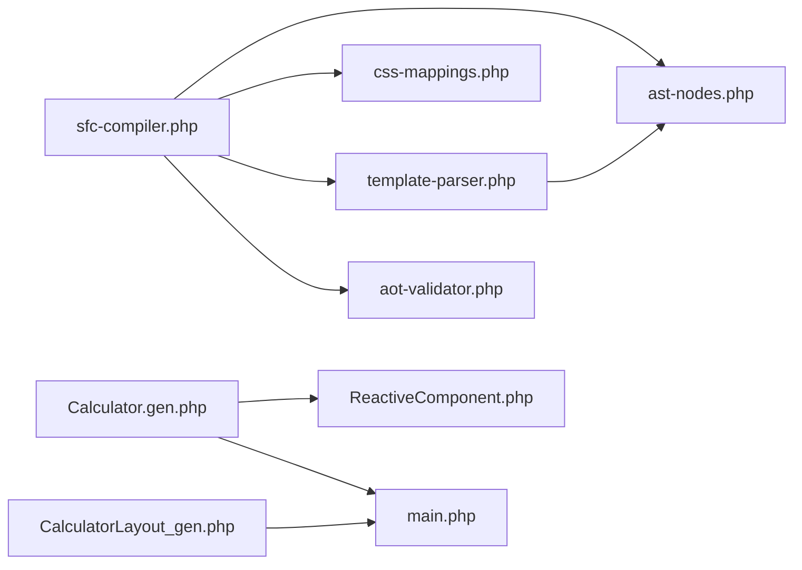
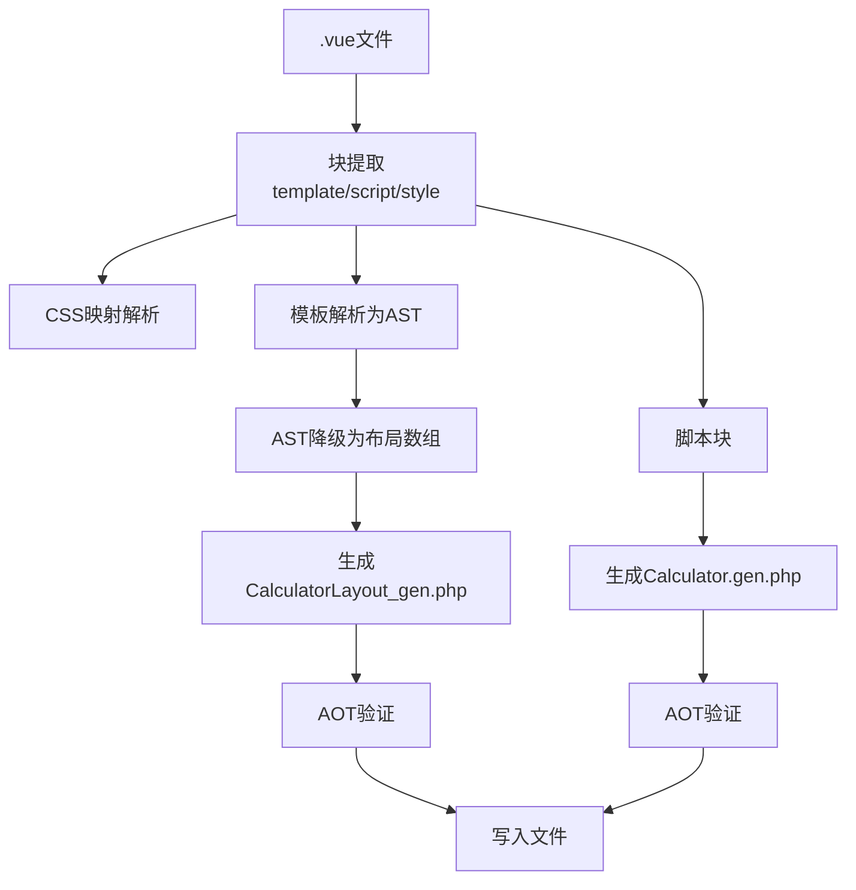

# SFC编译器系统

<cite>
**本文引用的文件**
- [Calculator.vue](file://src/Calculator.vue)
- [sfc-compiler.php](file://tools/sfc-compiler.php)
- [template-parser.php](file://tools/compiler/template-parser.php)
- [css-mappings.php](file://tools/compiler/css-mappings.php)
- [aot-validator.php](file://tools/compiler/aot-validator.php)
- [ast-nodes.php](file://tools/compiler/ast-nodes.php)
- [ReactiveComponent.php](file://src/ReactiveComponent.php)
- [Calculator.gen.php](file://src/Calculator.gen.php)
- [CalculatorLayout_gen.php](file://src/CalculatorLayout_gen.php)
- [sfc-compiler-test.php](file://tests/sfc-compiler-test.php)
- [main.php](file://main.php)
</cite>

## 目录
1. [简介](#简介)
2. [项目结构](#项目结构)
3. [核心组件](#核心组件)
4. [架构总览](#架构总览)
5. [详细组件分析](#详细组件分析)
6. [依赖关系分析](#依赖关系分析)
7. [性能考量](#性能考量)
8. [故障排查指南](#故障排查指南)
9. [结论](#结论)
10. [附录](#附录)

## 简介
本文件为SFC（Single File Component）编译器系统的技术文档，面向希望理解并扩展该编译器的开发者。文档覆盖从.vue文件到.php生成文件的完整转换流程，深入解析模板解析器的词法分析、语法分析与AST生成，阐述CSS映射系统如何将CSS样式转换为渲染所需的属性，解释AST节点定义与验证规则，并详述AOT验证器的工作原理与约束校验。同时提供编译流程图与关键算法实现细节，帮助高级开发者理解和修改编译器行为。

## 项目结构
该项目采用“工具模块 + 示例组件 + 测试 + 运行时”的分层组织：
- tools/sfc-compiler.php：编译器入口，负责块提取、样式解析、模板解析、AST降级、AOT验证与代码生成。
- tools/compiler/*：编译器核心模块（模板解析器、CSS映射、AST节点、AOT验证器）。
- src/*：示例组件与生成文件（Calculator.vue、Calculator.gen.php、CalculatorLayout_gen.php、ReactiveComponent.php）。
- tests/*：单元测试与集成测试，覆盖解析、映射、降级、AOT验证与全链路集成。
- main.php：运行时渲染器与应用主程序，演示如何消费生成的布局与组件类。

**图表来源**
- [sfc-compiler.php:1-210](file://tools/sfc-compiler.php#L1-L210)
- [template-parser.php:1-680](file://tools/compiler/template-parser.php#L1-L680)
- [css-mappings.php:1-210](file://tools/compiler/css-mappings.php#L1-L210)
- [aot-validator.php:1-169](file://tools/compiler/aot-validator.php#L1-L169)
- [ast-nodes.php:1-153](file://tools/compiler/ast-nodes.php#L1-L153)
- [Calculator.gen.php:1-174](file://src/Calculator.gen.php#L1-L174)
- [CalculatorLayout_gen.php:1-296](file://src/CalculatorLayout_gen.php#L1-L296)
- [ReactiveComponent.php:1-35](file://src/ReactiveComponent.php#L1-L35)
- [main.php:1-291](file://main.php#L1-L291)

**章节来源**
- [sfc-compiler.php:1-210](file://tools/sfc-compiler.php#L1-L210)
- [Calculator.vue:1-215](file://src/Calculator.vue#L1-L215)

## 核心组件
- 模板解析器（TemplateParser）：递归下降解析器，将模板字符串转为AST，再降级为布局数组。
- CSS映射（CssMappings）：将CSS类样式映射为渲染参数（颜色、字号、粗细等），并提供颜色推导与解析工具。
- AST节点（ast-nodes.php）：定义AppNode、RectNode、TextNode、GridNode、BtnNode、UnknownNode等节点类型。
- AOT验证器（AotValidator）：在写入生成文件前进行AOT兼容性检查，避免编译失败。
- 编译器入口（sfc-compiler.php）：协调各模块，执行块提取、解析、降级、验证与代码生成。

**章节来源**
- [template-parser.php:60-680](file://tools/compiler/template-parser.php#L60-L680)
- [css-mappings.php:15-210](file://tools/compiler/css-mappings.php#L15-L210)
- [ast-nodes.php:9-153](file://tools/compiler/ast-nodes.php#L9-L153)
- [aot-validator.php:17-169](file://tools/compiler/aot-validator.php#L17-L169)
- [sfc-compiler.php:19-210](file://tools/sfc-compiler.php#L19-L210)

## 架构总览
编译器整体流程分为六个阶段：
1) 块提取：从.vue中抽取template/script/style三块。
2) 样式解析：CSS类→GDI属性映射。
3) 模板解析：递归下降→AST。
4) AST降级：AppNode→布局数组（编译时坐标计算）。
5) AOT验证：生成前校验，避免AOT失败。
6) 代码生成：生成Calculator.gen.php与CalculatorLayout_gen.php。

**图表来源**
- [sfc-compiler.php:47-210](file://tools/sfc-compiler.php#L47-L210)
- [template-parser.php:464-541](file://tools/compiler/template-parser.php#L464-L541)
- [css-mappings.php:164-194](file://tools/compiler/css-mappings.php#L164-L194)
- [aot-validator.php:36-106](file://tools/compiler/aot-validator.php#L36-L106)

## 详细组件分析

### 模板解析器（TemplateParser）
- 词法分析：将模板字符串按标签、注释、文本切分为Token序列，记录行号。
- 语法分析：递归下降解析，支持根元素<App>、子元素<rect>/<text>/<grid>/<btn>及未知标签。
- 错误处理：收集TemplateParseError，包含消息与行号；未知标签生成UnknownNode而非忽略。
- AST降级：将AppNode转换为elements/buttons布局数组，进行编译时坐标计算。

**图表来源**
- [template-parser.php:29-680](file://tools/compiler/template-parser.php#L29-L680)
- [ast-nodes.php:9-153](file://tools/compiler/ast-nodes.php#L9-L153)

**章节来源**
- [template-parser.php:60-680](file://tools/compiler/template-parser.php#L60-L680)
- [ast-nodes.php:9-153](file://tools/compiler/ast-nodes.php#L9-L153)

#### 词法分析与语法分析流程

**图表来源**
- [template-parser.php:205-279](file://tools/compiler/template-parser.php#L205-L279)
- [template-parser.php:284-317](file://tools/compiler/template-parser.php#L284-L317)

### CSS映射系统（CssMappings）
- 支持属性：background/color/font-size/font-weight等，映射到bg/fg/fontSize/bold等键。
- 解析器：十六进制颜色解析、像素值解析、字体粗细解析、文本对齐解析。
- 工具函数：颜色十六进制→BGR整数、基于背景色推导边框色。
- 块解析：从<style>块中提取类名→属性映射，收集无前景/背景的警告。

**图表来源**
- [css-mappings.php:164-194](file://tools/compiler/css-mappings.php#L164-L194)
- [css-mappings.php:27-69](file://tools/compiler/css-mappings.php#L27-L69)

**章节来源**
- [css-mappings.php:15-210](file://tools/compiler/css-mappings.php#L15-L210)

### AST节点定义与验证规则
- 节点类型：AppNode（含title/width/height/children）、RectNode、TextNode、GridNode、BtnNode、UnknownNode。
- 验证规则：解析阶段对缺失属性（如rect缺少class、text缺少:bind）报错；grid不允许非btn子元素；btn必须在grid内。
- 错误收集：TemplateParseError携带消息与行号，便于定位问题。

**图表来源**
- [ast-nodes.php:9-153](file://tools/compiler/ast-nodes.php#L9-L153)

**章节来源**
- [ast-nodes.php:9-153](file://tools/compiler/ast-nodes.php#L9-L153)
- [template-parser.php:284-450](file://tools/compiler/template-parser.php#L284-L450)

### AOT验证器（AotValidator）
- 规则1：文件名茎名最多允许1个点，避免AOT生成无效C++符号。
- 规则2：禁止const数组嵌套结构，全局常量数组不被可靠注册。
- 规则3/4：禁止变量属性访问$obj->$var与变量方法调用$obj->$method()。
- 规则5：PHP8函数（如str_contains等）发出非致命警告，建议替换为兼容写法。
- 规则6：生成文件顶层允许const/函数/类声明，但需满足上述限制。

**图表来源**
- [aot-validator.php:36-106](file://tools/compiler/aot-validator.php#L36-L106)

**章节来源**
- [aot-validator.php:17-169](file://tools/compiler/aot-validator.php#L17-L169)

### 编译器入口与代码生成
- 块提取：正则匹配template/script/style，错误即终止。
- 样式解析：调用CssMappings::parseStyleBlock，收集警告。
- 模板解析：TemplateParser::parse，支持--dump-ast调试。
- AST降级：TemplateParser::lowerToLayout，生成elements/buttons。
- 代码生成：生成CalculatorLayout_gen.php（常量+函数）与Calculator.gen.php（类继承ReactiveComponent）。
- AOT验证：对两份生成文件分别验证，通过才写盘。

**章节来源**
- [sfc-compiler.php:47-210](file://tools/sfc-compiler.php#L47-L210)

## 依赖关系分析
- sfc-compiler.php依赖：ast-nodes.php、css-mappings.php、template-parser.php、aot-validator.php。
- TemplateParser依赖：ast-nodes.php。
- CssMappings独立模块，供TemplateParser与lowerToLayout使用。
- 生成文件Calculator.gen.php继承ReactiveComponent，依赖native_types。
- 运行时main.php依赖生成的CalculatorLayout_gen.php与Calculator.gen.php。

**图表来源**
- [sfc-compiler.php:19-24](file://tools/sfc-compiler.php#L19-L24)
- [template-parser.php:16](file://tools/compiler/template-parser.php#L16)
- [Calculator.gen.php:7-174](file://src/Calculator.gen.php#L7-L174)
- [CalculatorLayout_gen.php:7-296](file://src/CalculatorLayout_gen.php#L7-L296)
- [ReactiveComponent.php:11-35](file://src/ReactiveComponent.php#L11-L35)
- [main.php:139-291](file://main.php#L139-L291)

**章节来源**
- [sfc-compiler.php:19-24](file://tools/sfc-compiler.php#L19-L24)
- [template-parser.php:16](file://tools/compiler/template-parser.php#L16)

## 性能考量
- 词法分析：线性扫描模板字符串，时间复杂度O(n)，空间开销主要为Token数组。
- 语法分析：递归下降，深度受限于模板层级，整体O(n)。
- CSS映射：逐类匹配PROPERTY_MAP，每类最多遍历PROPERTY_MAP大小次，总体O(n_classes * k_props)。
- AST降级：遍历AppNode子树，元素数量决定时间，O(n_elements+n_buttons)。
- AOT验证：正则扫描，时间复杂度近似O(n_code)。
- 建议优化点：将PROPERTY_MAP改为预编译正则或哈希表，减少重复匹配；对超大模板可考虑分段解析与缓存中间结果。

[本节为通用性能讨论，无需特定文件来源]

## 故障排查指南
- 模板解析错误
  - 症状：出现TemplateParseError列表，包含行号与消息。
  - 排查：检查<App>根元素是否存在、属性是否齐全；rect/text/grid/btn是否符合规范；未知标签会生成UnknownNode并报错。
- CSS映射警告
  - 症状：提示某类既无background也无color，可能导致透明渲染。
  - 排查：为类添加至少一种前景或背景色。
- AOT验证失败
  - 文件名多点：修改生成文件名为单点或下划线命名。
  - const数组嵌套：将const数组改为函数返回数组。
  - 变量属性/方法：改为显式if/else路由。
  - PHP8函数：替换为兼容写法（如str_contains→strpos）。
- 运行时渲染异常
  - 检查生成的WINDOW_WIDTH/WINDOW_HEIGHT与实际一致。
  - 确认getLayout()返回结构与CalcRenderer期望一致。
  - 检查组件类继承ReactiveComponent且存在dirty标记。

**章节来源**
- [template-parser.php:610-614](file://tools/compiler/template-parser.php#L610-L614)
- [css-mappings.php:185-188](file://tools/compiler/css-mappings.php#L185-L188)
- [aot-validator.php:36-106](file://tools/compiler/aot-validator.php#L36-L106)
- [main.php:99-132](file://main.php#L99-L132)

## 结论
本SFC编译器系统以模块化设计实现了从.vue到.php的完整转换链路。模板解析器采用递归下降与严格的错误收集，CSS映射系统提供了可扩展的属性映射与颜色推导，AST节点清晰定义了渲染所需的数据结构，AOT验证器确保生成代码的编译兼容性。配合示例组件与运行时渲染器，系统展示了数据驱动的桌面应用开发模式。建议在后续版本中引入更多CSS属性支持、更完善的错误恢复与增量编译能力。

[本节为总结性内容，无需特定文件来源]

## 附录

### 编译流程图（端到端）

**图表来源**
- [sfc-compiler.php:47-210](file://tools/sfc-compiler.php#L47-L210)

### 关键算法实现要点
- 词法分析：通过正则匹配标签与注释，维护行号计数，跳过空白字符。
- 语法分析：严格匹配<App>根元素，限定子元素类型与位置，未知标签生成UnknownNode。
- CSS映射：PROPERTY_MAP定义属性→键→解析器→默认值，hexToBgr支持简写#RGB，borderColor基于背景色推导。
- AST降级：rect/text/grid/btn分别映射到elements/buttons，grid内按钮进行编译时坐标计算。
- AOT验证：多条规则逐一扫描，非致命警告与致命错误分离输出。

**章节来源**
- [template-parser.php:122-199](file://tools/compiler/template-parser.php#L122-L199)
- [template-parser.php:205-450](file://tools/compiler/template-parser.php#L205-L450)
- [css-mappings.php:27-151](file://tools/compiler/css-mappings.php#L27-L151)
- [template-parser.php:464-541](file://tools/compiler/template-parser.php#L464-L541)
- [aot-validator.php:36-106](file://tools/compiler/aot-validator.php#L36-L106)