# SFC编译器系统

<cite>
**本文引用的文件**
- [sfc-compiler.php](file://framework/sfc-compiler.php)
- [template-parser.php](file://framework/compiler/template-parser.php)
- [component-registry.php](file://framework/compiler/component-registry.php)
- [component-resolver.php](file://framework/compiler/component-resolver.php)
- [css-mappings.php](file://framework/compiler/css-mappings.php)
- [aot-validator.php](file://framework/compiler/aot-validator.php)
- [ast-nodes.php](file://framework/compiler/ast-nodes.php)
- [script-analyzer.php](file://framework/compiler/script-analyzer.php)
- [ReactiveComponent.php](file://framework/ReactiveComponent.php)
- [Application.php](file://apps/calculator/Application.php)
- [App.gen.php](file://apps/calculator/gen/App.gen.php)
- [AppLayout_gen.php](file://apps/calculator/gen/AppLayout_gen.php)
- [App.vue](file://apps/calculator/App.vue)
- [project.yml](file://apps/calculator/project.yml)
</cite>

## 更新摘要
**变更内容**
- 全面重构递归下降解析器架构，替代旧的正则表达式解析器
- 新增组件注册系统和组件引用解析功能
- 增强AST节点定义，支持组件引用和层管理
- 重构代码生成流程，增加条件渲染和自动脏标记注入
- 实现v5 M2架构的完整功能集

## 目录
1. [简介](#简介)
2. [项目结构](#项目结构)
3. [核心组件](#核心组件)
4. [架构总览](#架构总览)
5. [详细组件分析](#详细组件分析)
6. [依赖关系分析](#依赖关系分析)
7. [性能考量](#性能考量)
8. [故障排查指南](#故障排查指南)
9. [结论](#结论)
10. [附录](#附录)

## 简介
本文件为SFC（Single File Component）编译器系统的技术文档，面向希望理解并扩展该编译器的开发者。文档覆盖从.vue文件到.php生成文件的完整转换流程，深入解析全新的递归下降解析器架构，阐述组件注册系统如何实现组件引用解析，解释增强的AST节点定义与条件渲染支持，并详述自动脏标记注入和AOT验证器的工作原理。同时提供编译流程图与关键算法实现细节，帮助高级开发者理解和修改编译器行为。

## 项目结构
该项目采用"框架模块 + 示例应用 + 生成文件 + 运行时"的分层组织：
- framework/sfc-compiler.php：编译器入口，负责块提取、样式解析、模板解析、组件解析、AST降级、AOT验证与代码生成。
- framework/compiler/*：编译器核心模块（递归下降解析器、组件注册系统、CSS映射、AST节点、AOT验证器、脚本分析器）。
- apps/calculator/*：示例应用与生成文件（App.vue、gen/目录下的生成文件、Application.php）。
- framework/*：运行时框架（ReactiveComponent、BaseRenderer、ChangeQueue）。

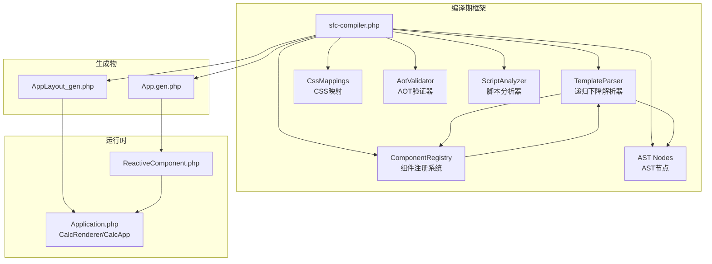

**图表来源**
- [sfc-compiler.php:1-485](file://framework/sfc-compiler.php#L1-L485)
- [template-parser.php:1-866](file://framework/compiler/template-parser.php#L1-L866)
- [component-registry.php:1-70](file://framework/compiler/component-registry.php#L1-L70)
- [css-mappings.php:1-210](file://framework/compiler/css-mappings.php#L1-L210)
- [aot-validator.php:1-169](file://framework/compiler/aot-validator.php#L1-L169)
- [ast-nodes.php:1-208](file://framework/compiler/ast-nodes.php#L1-L208)
- [script-analyzer.php:1-281](file://framework/compiler/script-analyzer.php#L1-L281)
- [App.gen.php:1-262](file://apps/calculator/gen/App.gen.php#L1-L262)
- [AppLayout_gen.php:1-523](file://apps/calculator/gen/AppLayout_gen.php#L1-L523)
- [ReactiveComponent.php:1-35](file://framework/ReactiveComponent.php#L1-L35)
- [Application.php:1-139](file://apps/calculator/Application.php#L1-L139)

**章节来源**
- [sfc-compiler.php:1-485](file://framework/sfc-compiler.php#L1-L485)
- [App.vue:1-203](file://apps/calculator/App.vue#L1-L203)

## 核心组件
- **递归下降解析器（TemplateParser）**：全新的递归下降解析器，替代旧的正则表达式解析器，支持完整的XML语法规则和组件引用解析。
- **组件注册系统（ComponentRegistry）**：从project.yml加载组件映射，将自定义标签名解析为.vue源文件路径。
- **组件解析器（ComponentResolver）**：提供组件引用解析的辅助函数，包括坐标偏移和属性绑定应用。
- **CSS映射（CssMappings）**：将CSS类样式映射为渲染参数（颜色、字号、粗细等），并提供颜色推导与解析工具。
- **AST节点（ast-nodes.php）**：定义AppNode、RectNode、TextNode、GridNode、BtnNode、UnknownNode、ComponentRefNode等节点类型。
- **脚本分析器（ScriptAnalyzer）**：自动分析PHP脚本，注入脏标记，消除手动脏标记的重复工作。
- **AOT验证器（AotValidator）**：在写入生成文件前进行AOT兼容性检查，避免编译失败。
- **编译器入口（sfc-compiler.php）**：协调各模块，执行块提取、解析、组件解析、降级、验证与代码生成。

**章节来源**
- [template-parser.php:61-866](file://framework/compiler/template-parser.php#L61-L866)
- [component-registry.php:14-70](file://framework/compiler/component-registry.php#L14-L70)
- [component-resolver.php:9-62](file://framework/compiler/component-resolver.php#L9-L62)
- [css-mappings.php:15-210](file://framework/compiler/css-mappings.php#L15-210)
- [ast-nodes.php:9-208](file://framework/compiler/ast-nodes.php#L9-L208)
- [script-analyzer.php:15-281](file://framework/compiler/script-analyzer.php#L15-L281)
- [aot-validator.php:17-169](file://framework/compiler/aot-validator.php#L17-L169)
- [sfc-compiler.php:33-485](file://framework/sfc-compiler.php#L33-L485)

## 架构总览
编译器整体流程分为八个阶段：
1) 块提取：从.vue中抽取template/script/style三块。
2) 样式解析：CSS类→GDI属性映射。
3) 组件注册：从project.yml加载组件映射。
4) 模板解析：递归下降→AST（支持组件引用）。
5) 组件解析：解析组件引用，内联子组件布局。
6) AST降级：AppNode→布局数组（编译时坐标计算）。
7) AOT验证：生成前校验，避免AOT失败。
8) 代码生成：生成App.gen.php与AppLayout_gen.php。

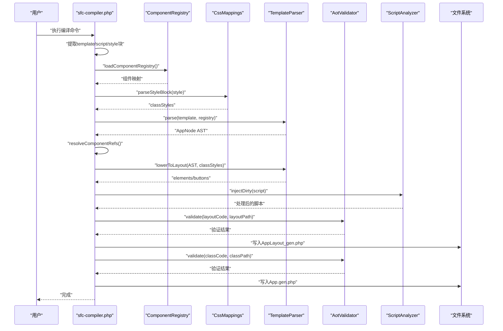

**图表来源**
- [sfc-compiler.php:33-485](file://framework/sfc-compiler.php#L33-L485)
- [template-parser.php:88-866](file://framework/compiler/template-parser.php#L88-L866)
- [component-registry.php:26-70](file://framework/compiler/component-registry.php#L26-L70)
- [css-mappings.php:164-194](file://framework/compiler/css-mappings.php#L164-194)
- [aot-validator.php:36-106](file://framework/compiler/aot-validator.php#L36-L106)
- [script-analyzer.php:27-281](file://framework/compiler/script-analyzer.php#L27-L281)

## 详细组件分析

### 递归下降解析器（TemplateParser）
- **词法分析**：将模板字符串按标签、注释、文本切分为Token序列，记录行号。
- **语法分析**：递归下降解析，支持根元素<App>、子元素<rect>/<text>/<grid>/<btn>及组件引用。
- **组件引用解析**：支持自定义标签名解析为.vue文件，内联子组件布局。
- **错误处理**：收集TemplateParseError，包含消息与行号；未知标签生成UnknownNode而非忽略。
- **AST降级**：将AppNode转换为elements/buttons布局数组，进行编译时坐标计算。

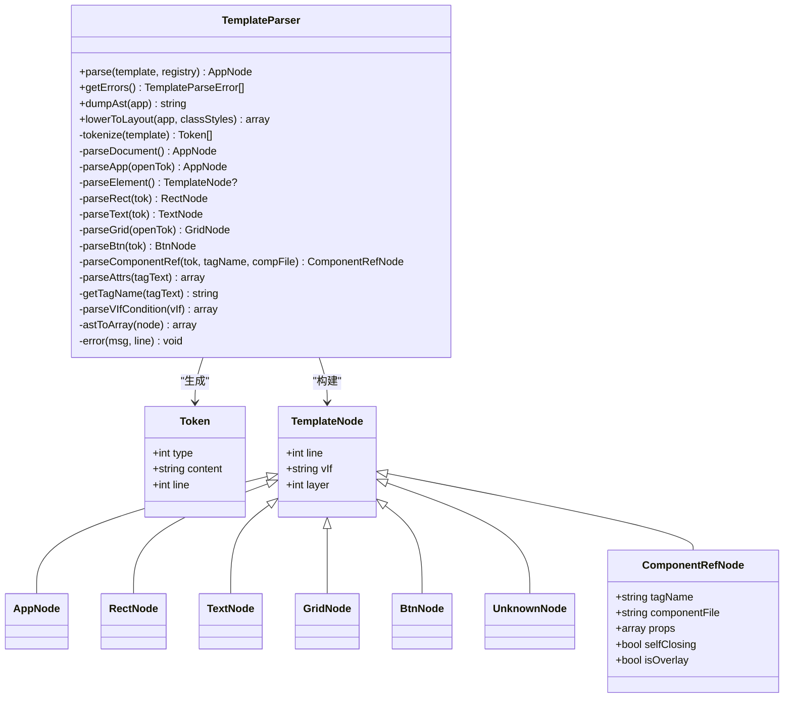

**图表来源**
- [template-parser.php:61-866](file://framework/compiler/template-parser.php#L61-L866)
- [ast-nodes.php:9-208](file://framework/compiler/ast-nodes.php#L9-L208)

**章节来源**
- [template-parser.php:61-866](file://framework/compiler/template-parser.php#L61-L866)
- [ast-nodes.php:9-208](file://framework/compiler/ast-nodes.php#L9-L208)

#### 词法分析与语法分析流程
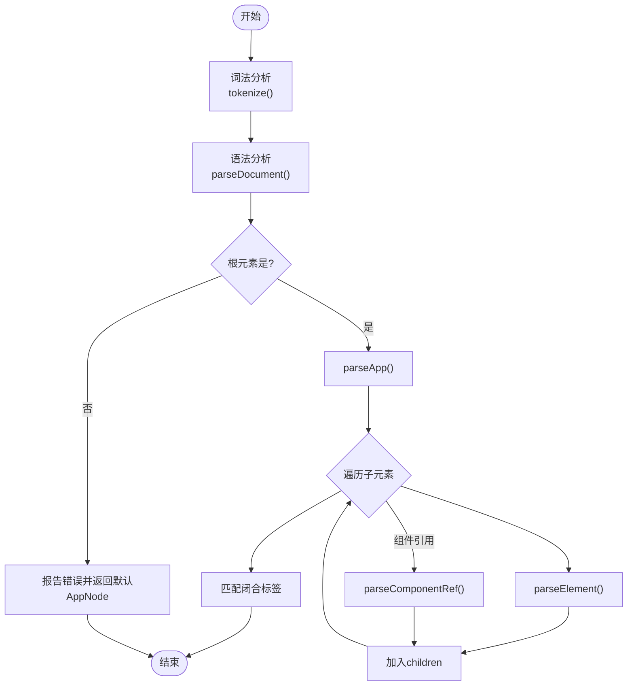

**图表来源**
- [template-parser.php:214-288](file://framework/compiler/template-parser.php#L214-L288)
- [template-parser.php:293-333](file://framework/compiler/template-parser.php#L293-L333)
- [template-parser.php:490-543](file://framework/compiler/template-parser.php#L490-L543)

### 组件注册系统（ComponentRegistry）
- **配置加载**：从project.yml的components部分加载组件映射。
- **路径解析**：支持相对路径解析和绝对路径规范化。
- **组件查找**：根据自定义标签名查找对应的.vue文件路径。
- **错误处理**：对不存在的组件源文件发出警告。

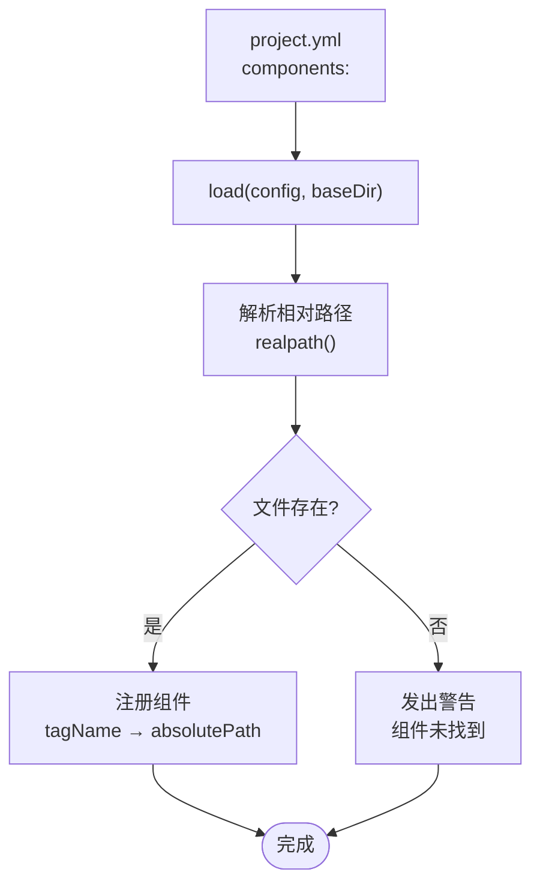

**图表来源**
- [sfc-compiler.php:33-88](file://framework/sfc-compiler.php#L33-L88)
- [component-registry.php:26-70](file://framework/compiler/component-registry.php#L26-L70)

**章节来源**
- [sfc-compiler.php:33-88](file://framework/sfc-compiler.php#L33-L88)
- [component-registry.php:14-70](file://framework/compiler/component-registry.php#L14-L70)

### 组件解析器（ComponentResolver）
- **坐标偏移**：为组件内的元素应用父组件提供的x/y偏移。
- **属性绑定**：将父组件的:prop绑定映射到子组件的:bind属性。
- **条件传播**：将父组件的v-if条件传播到子组件的子元素。
- **层管理**：为覆盖层组件分配叠加层编号。

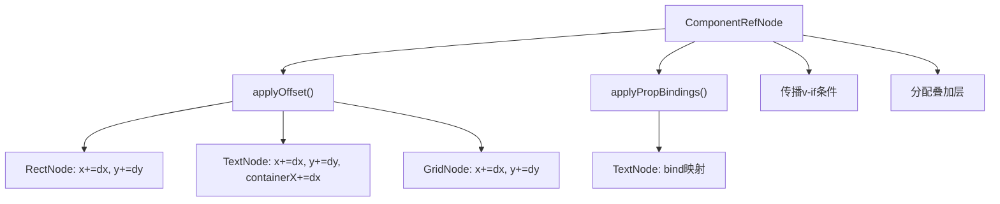

**图表来源**
- [sfc-compiler.php:93-179](file://framework/sfc-compiler.php#L93-L179)
- [component-resolver.php:13-62](file://framework/compiler/component-resolver.php#L13-L62)

**章节来源**
- [sfc-compiler.php:93-179](file://framework/sfc-compiler.php#L93-L179)
- [component-resolver.php:9-62](file://framework/compiler/component-resolver.php#L9-L62)

### CSS映射系统（CssMappings）
- 支持属性：background/color/font-size/font-weight等，映射到bg/fg/fontSize/bold等键。
- 解析器：十六进制颜色解析、像素值解析、字体粗细解析、文本对齐解析。
- 工具函数：颜色十六进制→BGR整数、基于背景色推导边框色。
- 块解析：从<style>块中提取类名→属性映射，收集无前景/背景的警告。

**图表来源**
- [css-mappings.php:164-194](file://framework/compiler/css-mappings.php#L164-194)
- [css-mappings.php:27-69](file://framework/compiler/css-mappings.php#L27-L69)

**章节来源**
- [css-mappings.php:15-210](file://framework/compiler/css-mappings.php#L15-L210)

### AST节点定义与验证规则
- **节点类型**：AppNode（含title/width/height/children）、RectNode、TextNode、GridNode、BtnNode、UnknownNode、ComponentRefNode。
- **增强功能**：支持v-if条件、层管理（layer）、覆盖层（isOverlay）。
- **验证规则**：解析阶段对缺失属性（如rect缺少class、text缺少:bind）报错；grid不允许非btn子元素；btn必须在grid内。
- **错误收集**：TemplateParseError携带消息与行号，便于定位问题。

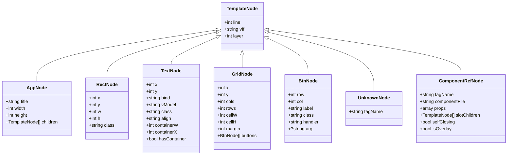

**图表来源**
- [ast-nodes.php:9-208](file://framework/compiler/ast-nodes.php#L9-L208)

**章节来源**
- [ast-nodes.php:9-208](file://framework/compiler/ast-nodes.php#L9-L208)
- [template-parser.php:293-543](file://framework/compiler/template-parser.php#L293-L543)

### 脚本分析器（ScriptAnalyzer）
- **属性提取**：从PHP脚本中提取公共属性声明，识别反应性属性。
- **脏标记注入**：自动在修改反应性属性的方法中注入$dirty = true标记。
- **方法识别**：使用状态机解析PHP方法边界，支持复杂的括号嵌套。
- **智能处理**：移除现有脏标记，避免重复注入。

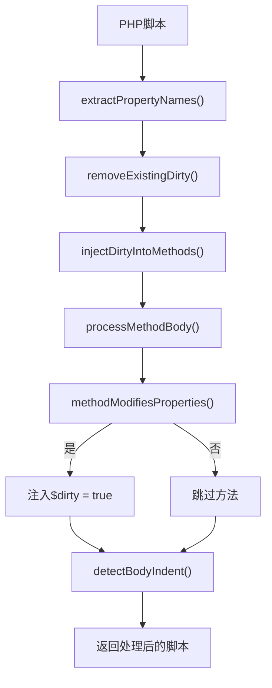

**图表来源**
- [script-analyzer.php:27-281](file://framework/compiler/script-analyzer.php#L27-L281)

**章节来源**
- [script-analyzer.php:15-281](file://framework/compiler/script-analyzer.php#L15-L281)

### AOT验证器（AotValidator）
- 规则1：文件名茎名最多允许1个点，避免AOT生成无效C++符号。
- 规则2：禁止const数组嵌套结构，全局常量数组不被可靠注册。
- 规则3/4：禁止变量属性访问$obj->$var与变量方法调用$obj->$method()。
- 规则5：PHP8函数（如str_contains等）发出非致命警告，建议替换为兼容写法。
- 规则6：生成文件顶层允许const/函数/类声明，但需满足上述限制。

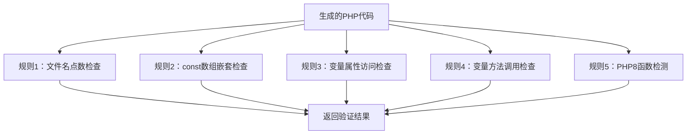

**图表来源**
- [aot-validator.php:36-106](file://framework/compiler/aot-validator.php#L36-L106)

**章节来源**
- [aot-validator.php:17-169](file://framework/compiler/aot-validator.php#L17-L169)

### 编译器入口与代码生成
- **块提取**：正则匹配template/script/style，错误即终止。
- **组件注册**：从project.yml加载组件映射，支持相对路径解析。
- **样式解析**：调用CssMappings::parseStyleBlock，收集警告。
- **模板解析**：TemplateParser::parse，支持--dump-ast调试。
- **组件解析**：resolveComponentRefs，内联子组件布局并应用偏移。
- **AST降级**：TemplateParser::lowerToLayout，生成elements/buttons。
- **脚本分析**：ScriptAnalyzer::injectDirty，自动注入脏标记。
- **代码生成**：生成AppLayout_gen.php（常量+函数）与App.gen.php（类继承ReactiveComponent）。
- **AOT验证**：对两份生成文件分别验证，通过才写盘。

**章节来源**
- [sfc-compiler.php:33-485](file://framework/sfc-compiler.php#L33-L485)

## 依赖关系分析
- sfc-compiler.php依赖：ast-nodes.php、css-mappings.php、template-parser.php、aot-validator.php、script-analyzer.php、component-registry.php、component-resolver.php。
- TemplateParser依赖：ast-nodes.php、component-registry.php。
- ComponentRegistry独立模块，用于组件标签到文件路径的映射。
- ComponentResolver提供组件解析的共享工具函数。
- ScriptAnalyzer独立模块，用于PHP脚本的脏标记注入。
- 生成文件App.gen.php继承ReactiveComponent，依赖native_types。
- 运行时Application.php依赖生成的AppLayout_gen.php与App.gen.php。

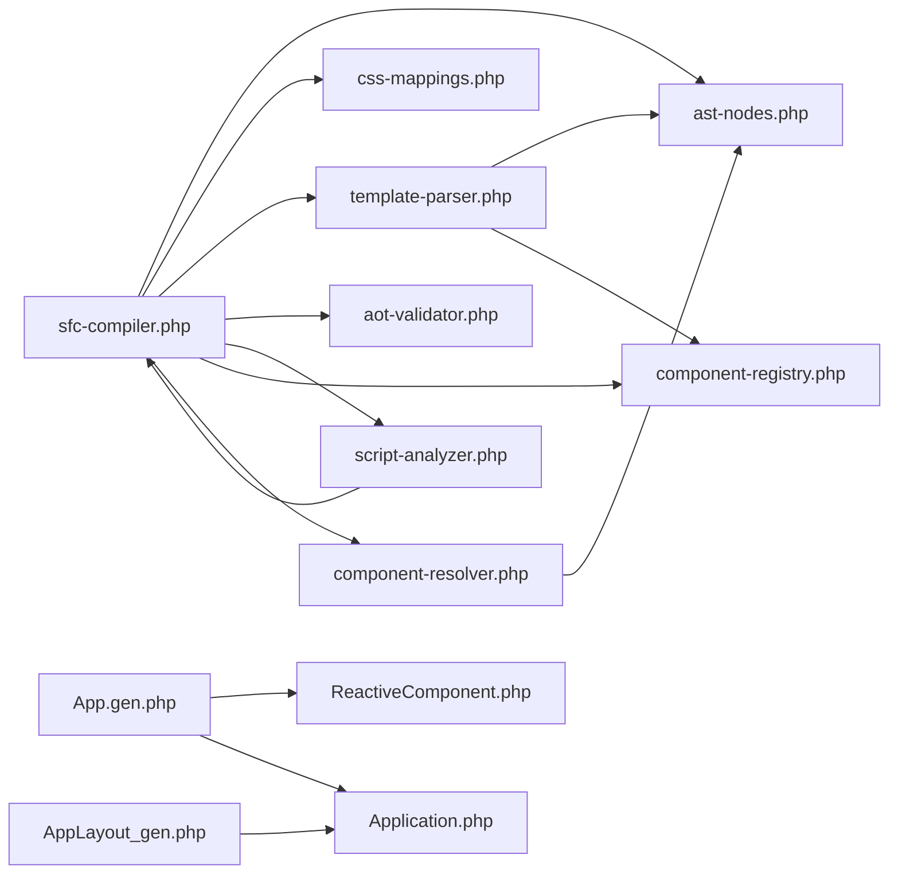

**图表来源**
- [sfc-compiler.php:20-28](file://framework/sfc-compiler.php#L20-L28)
- [template-parser.php:16-17](file://framework/compiler/template-parser.php#L16-L17)
- [component-resolver.php:13-62](file://framework/compiler/component-resolver.php#L13-L62)
- [script-analyzer.php:27-281](file://framework/compiler/script-analyzer.php#L27-L281)
- [App.gen.php:7-262](file://apps/calculator/gen/App.gen.php#L7-L262)
- [AppLayout_gen.php:7-523](file://apps/calculator/gen/AppLayout_gen.php#L7-L523)
- [ReactiveComponent.php:11-35](file://framework/ReactiveComponent.php#L11-L35)
- [Application.php:16-139](file://apps/calculator/Application.php#L16-L139)

**章节来源**
- [sfc-compiler.php:20-28](file://framework/sfc-compiler.php#L20-L28)
- [template-parser.php:16-17](file://framework/compiler/template-parser.php#L16-L17)

## 性能考量
- **词法分析**：线性扫描模板字符串，时间复杂度O(n)，空间开销主要为Token数组。
- **语法分析**：递归下降，深度受限于模板层级，整体O(n)。
- **组件解析**：递归编译子组件，最坏情况下为O(n_children)。
- **CSS映射**：逐类匹配PROPERTY_MAP，每类最多遍历PROPERTY_MAP大小次，总体O(n_classes * k_props)。
- **AST降级**：遍历AppNode子树，元素数量决定时间，O(n_elements+n_buttons)。
- **脚本分析**：状态机扫描PHP代码，时间复杂度O(n_lines)。
- **AOT验证**：正则扫描，时间复杂度近似O(n_code)。
- **建议优化点**：将PROPERTY_MAP改为预编译正则或哈希表，减少重复匹配；对超大模板可考虑分段解析与缓存中间结果。

## 故障排查指南
- **模板解析错误**
  - 症状：出现TemplateParseError列表，包含行号与消息。
  - 排查：检查<App>根元素是否存在、属性是否齐全；rect/text/grid/btn是否符合规范；组件引用标签是否在project.yml中正确注册。
- **组件解析警告**
  - 症状：提示组件文件无法读取或组件无模板块。
  - 排查：确认project.yml中的路径正确，子组件文件存在且包含<template>块。
- **CSS映射警告**
  - 症状：提示某类既无background也无color，可能导致透明渲染。
  - 排查：为类添加至少一种前景或背景色。
- **AOT验证失败**
  - 文件名多点：修改生成文件名为单点或下划线命名。
  - const数组嵌套：将const数组改为函数返回数组。
  - 变量属性/方法：改为显式if/else路由。
  - PHP8函数：替换为兼容写法（如str_contains→strpos）。
- **运行时渲染异常**
  - 检查生成的WINDOW_WIDTH/WINDOW_HEIGHT与实际一致。
  - 确认getLayout()返回结构与Application期望一致。
  - 检查组件类继承ReactiveComponent且存在dirty标记。

**章节来源**
- [template-parser.php:780-783](file://framework/compiler/template-parser.php#L780-L783)
- [sfc-compiler.php:107-126](file://framework/sfc-compiler.php#L107-L126)
- [css-mappings.php:185-188](file://framework/compiler/css-mappings.php#L185-L188)
- [aot-validator.php:36-106](file://framework/compiler/aot-validator.php#L36-L106)
- [Application.php:100-131](file://apps/calculator/Application.php#L100-L131)

## 结论
本SFC编译器系统以全新的v5 M2架构实现了从.vue到.php的完整转换链路。递归下降解析器提供了精确的XML语法规则支持，组件注册系统实现了灵活的组件引用解析，增强的AST节点定义支持条件渲染和层管理，脚本分析器自动注入脏标记消除了重复工作，AOT验证器确保生成代码的编译兼容性。配合示例应用与运行时渲染器，系统展示了数据驱动的桌面应用开发模式。建议在后续版本中引入更多CSS属性支持、更完善的错误恢复与增量编译能力。

## 附录

### 编译流程图（端到端）
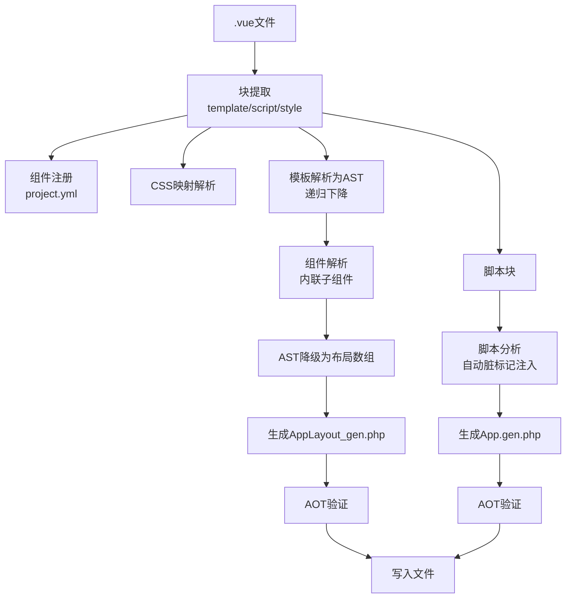

**图表来源**
- [sfc-compiler.php:33-485](file://framework/sfc-compiler.php#L33-L485)

### 关键算法实现要点
- **词法分析**：通过正则匹配标签与注释，维护行号计数，跳过空白字符。
- **语法分析**：严格匹配<App>根元素，限定子元素类型与位置，支持组件引用解析。
- **组件解析**：从project.yml加载映射，递归编译子组件，应用坐标偏移和属性绑定。
- **CSS映射**：PROPERTY_MAP定义属性→键→解析器→默认值，hexToBgr支持简写#RGB，borderColor基于背景色推导。
- **AST降级**：rect/text/grid/btn分别映射到elements/buttons，grid内按钮进行编译时坐标计算。
- **脚本分析**：状态机解析PHP方法边界，自动注入脏标记，避免重复注入。
- **AOT验证**：多条规则逐一扫描，非致命警告与致命错误分离输出。

**章节来源**
- [template-parser.php:131-208](file://framework/compiler/template-parser.php#L131-L208)
- [template-parser.php:214-543](file://framework/compiler/template-parser.php#L214-L543)
- [sfc-compiler.php:93-179](file://framework/sfc-compiler.php#L93-L179)
- [css-mappings.php:27-151](file://framework/compiler/css-mappings.php#L27-L151)
- [template-parser.php:557-683](file://framework/compiler/template-parser.php#L557-L683)
- [script-analyzer.php:87-281](file://framework/compiler/script-analyzer.php#L87-L281)
- [aot-validator.php:36-106](file://framework/compiler/aot-validator.php#L36-L106)