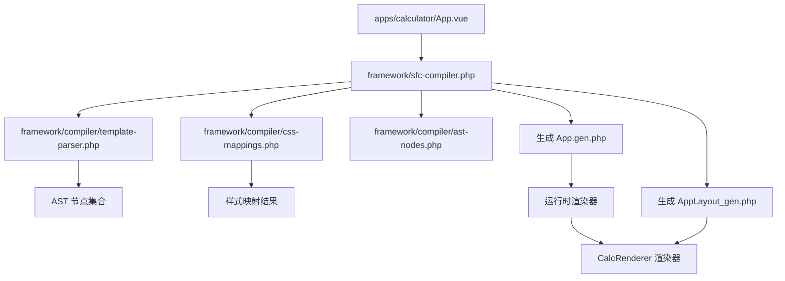
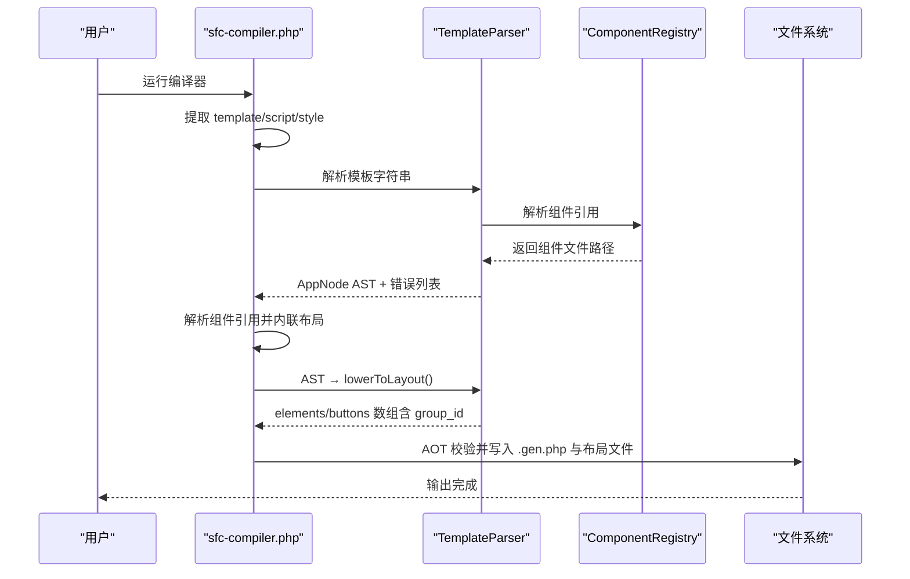
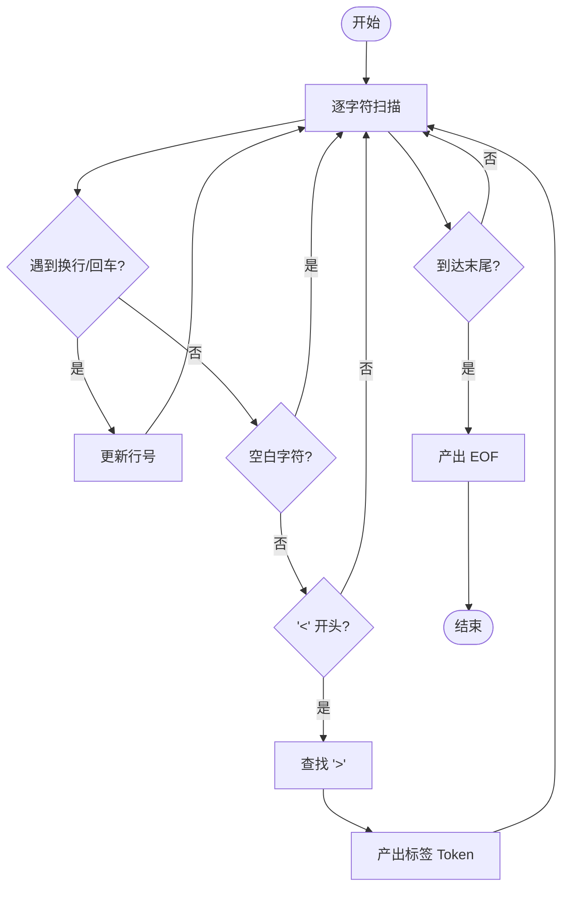
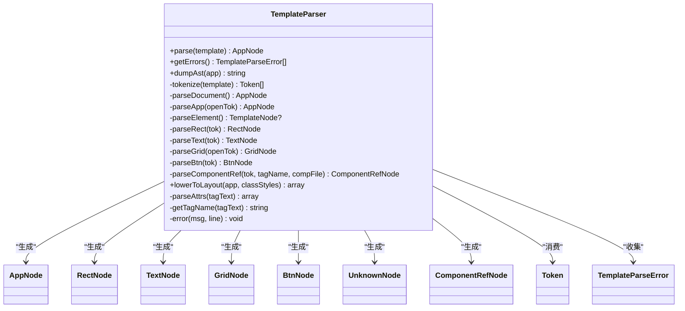
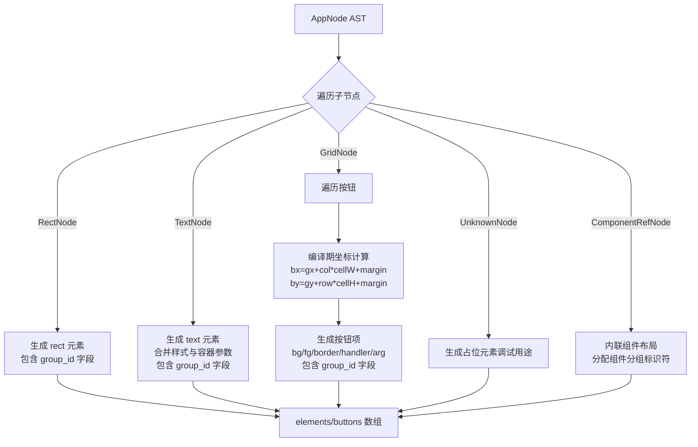
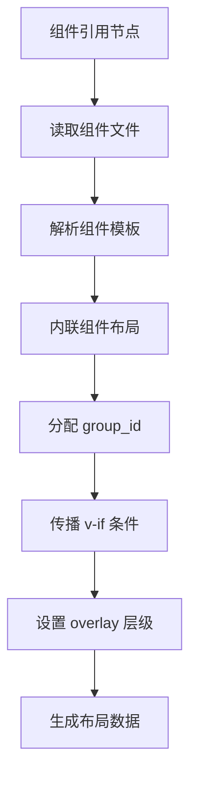
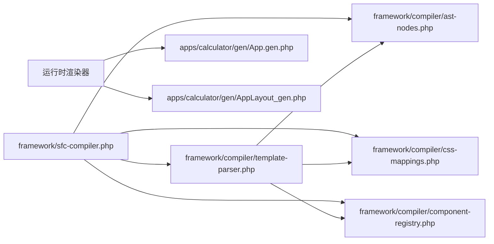

# 模板解析器

<cite>
**本文引用的文件列表**
- [template-parser.php](file://framework/compiler/template-parser.php)
- [ast-nodes.php](file://framework/compiler/ast-nodes.php)
- [sfc-compiler.php](file://framework/sfc-compiler.php)
- [AppLayout_gen.php](file://apps/calculator/gen/AppLayout_gen.php)
- [App.vue](file://apps/calculator/App.vue)
- [DisplayPanel.vue](file://apps/calculator/components/DisplayPanel.vue)
- [NumPad.vue](file://apps/calculator/components/NumPad.vue)
- [AboutDialog.vue](file://apps/calculator/components/AboutDialog.vue)
- [sfc-compiler-test.php](file://tests/sfc-compiler-test.php)
</cite>

## 更新摘要
**变更内容**
- 新增 group_id 输出功能，支持组件分组标识符
- 增强布局数据结构，支持组件边界分组
- 更新 AST 节点定义，添加 groupId 属性
- 扩展 lowerToLayout 方法，输出 group_id 字段
- 增强组件解析逻辑，自动分配组件分组 ID

## 目录
1. [简介](#简介)
2. [项目结构](#项目结构)
3. [核心组件](#核心组件)
4. [架构总览](#架构总览)
5. [详细组件分析](#详细组件分析)
6. [依赖关系分析](#依赖关系分析)
7. [性能考量](#性能考量)
8. [故障排查指南](#故障排查指南)
9. [结论](#结论)
10. [附录](#附录)

## 简介
本文件面向"模板解析器"的实现与使用，系统性阐述其递归下降解析算法、词法分析与语法分析的具体实现，以及模板语法支持范围（如 HTML 风格标签、属性绑定、事件处理等）。文档还深入解析 AST（抽象语法树）的生成过程（节点类型、树形结构、语义分析），并总结错误处理机制（语法错误检测、错误恢复与用户友好报告）。最后提供扩展解析器以支持新语法特性的实践建议与示例路径。

**更新** 本版本新增了 group_id 输出功能，支持组件分组标识符，增强了布局数据结构以支持组件边界分组。

## 项目结构
该工程采用"单文件组件（SFC）"模式，将模板、脚本与样式三部分组织在一个 .vue 文件中，通过编译器将模板解析为布局数组与组件类，再由 AOT 编译器生成可执行程序。模板解析器位于 framework/compiler/template-parser.php，配合 AST 节点定义与 CSS 映射模块共同完成从模板字符串到布局数据的转换。

**图表来源**
- [sfc-compiler.php:1-487](file://framework/sfc-compiler.php#L1-L487)
- [template-parser.php:1-869](file://framework/compiler/template-parser.php#L1-L869)
- [ast-nodes.php:1-211](file://framework/compiler/ast-nodes.php#L1-L211)
- [AppLayout_gen.php:1-488](file://apps/calculator/gen/AppLayout_gen.php#L1-L488)

**章节来源**
- [sfc-compiler.php:1-487](file://framework/sfc-compiler.php#L1-L487)
- [App.vue:1-203](file://apps/calculator/App.vue#L1-L203)

## 核心组件
- 词法分析器（Tokenize）：将模板字符串切分为标记序列，跟踪行号，识别注释、标签起止与自闭合标签。
- 语法分析器（Recursive Descent Parser）：基于递归下降算法，按模板语法规则解析出 AST。
- AST 节点库：定义 AppNode、RectNode、TextNode、GridNode、BtnNode、UnknownNode 等节点类型。
- 代码生成准备（Lowering）：将 AST 转换为布局数组，进行编译期坐标计算与样式合并。
- 错误收集与报告：统一记录 TemplateParseError，包含消息与行号，便于定位问题。
- **新增** 组件分组管理：支持组件边界分组标识符（group_id），用于区分不同组件的布局元素。

**章节来源**
- [template-parser.php:61-869](file://framework/compiler/template-parser.php#L61-L869)
- [ast-nodes.php:9-211](file://framework/compiler/ast-nodes.php#L9-L211)
- [sfc-compiler.php:93-181](file://framework/sfc-compiler.php#L93-L181)

## 架构总览
模板解析器的完整工作流如下：
- 提取模板块：从 .vue 中抽取 <template> 内容。
- 解析样式块：将 CSS 类映射为渲染参数。
- 词法分析：生成 Token 流。
- 语法分析：递归下降构建 AST。
- 语义检查：校验必需属性、标签嵌套与合法性。
- **新增** 组件解析：解析组件引用，内联子组件布局并分配 group_id。
- 代码生成准备：将 AST 降低为布局数组（含按钮坐标计算）。
- AOT 校验与输出：生成 .gen.php 与布局文件。

**图表来源**
- [sfc-compiler.php:264-296](file://framework/sfc-compiler.php#L264-L296)
- [template-parser.php:490-543](file://framework/compiler/template-parser.php#L490-L543)
- [sfc-compiler.php:93-181](file://framework/sfc-compiler.php#L93-L181)

## 详细组件分析

### 词法分析器（Lexer）
职责
- 将模板字符串切分为 Token 序列，支持注释、标签起始、结束与自闭合标签。
- 维护行号，用于后续错误定位。

实现要点
- 使用线性扫描与正则匹配相结合的方式，识别注释与标签边界。
- 对换行符进行特殊处理，确保行号准确。
- 最终追加 EOF 标记，保证解析循环安全退出。

**图表来源**
- [template-parser.php:131-208](file://framework/compiler/template-parser.php#L131-L208)

**章节来源**
- [template-parser.php:131-208](file://framework/compiler/template-parser.php#L131-L208)

### 语法分析器（Recursive Descent Parser）
职责
- 基于递归下降算法，解析模板为 AST。
- 实现模板语法的语义约束（根元素、子元素、属性校验、事件处理解析等）。
- **新增** 组件解析：支持自定义组件标签的解析与处理。

关键流程
- parseDocument：跳过非标签内容，期望根元素为 <app>，否则报错并返回默认 AppNode。
- parseApp：解析 app 标签属性（title、width、height），并遍历子元素直至 </app>。
- parseElement：分派到 rect/text/grid/btn 的解析器；未知标签记录错误并生成 UnknownNode。
- **新增** parseComponentRef：解析组件引用标签，支持自闭合与带子元素两种形式。
- parseRect/parseText/parseGrid/parseBtn：分别解析对应元素的属性与语义约束。
- lowerToLayout：将 AST 转换为布局数组，进行编译期坐标计算与样式合并。

**图表来源**
- [template-parser.php:61-869](file://framework/compiler/template-parser.php#L61-L869)
- [ast-nodes.php:29-211](file://framework/compiler/ast-nodes.php#L29-L211)

**章节来源**
- [template-parser.php:214-543](file://framework/compiler/template-parser.php#L214-L543)
- [ast-nodes.php:29-211](file://framework/compiler/ast-nodes.php#L29-L211)

### AST 节点与布局生成
**更新** AST 节点现在包含 group_id 属性，用于标识组件边界分组。

AST 节点类型
- AppNode：根节点，包含标题、宽高与子节点列表。
- RectNode：矩形背景元素，包含位置、尺寸、样式类与组件分组标识符。
- TextNode：文本元素，包含绑定属性、对齐方式、容器信息、样式类与组件分组标识符。
- GridNode：按钮网格容器，包含行列、单元尺寸、边距、按钮列表与组件分组标识符。
- BtnNode：按钮元素，包含行列、标签、样式类、事件处理器、参数与组件分组标识符。
- UnknownNode：未知标签节点，保留原始标签名与行号，便于错误报告。
- **新增** ComponentRefNode：组件引用节点，包含组件标签名、文件路径、属性、插槽内容、自闭合状态与组件分组标识符。

布局生成（Lowering）
- 将 AST 转换为 elements/buttons 数组，供渲染器使用。
- 对 GridNode 的按钮进行编译期坐标计算：bx/gx、by/gy、bw/bh、border/bg/fg 等。
- 合并样式映射（来自 CSS 类），并处理容器对齐（如右对齐）。
- **新增** 输出 group_id 字段，标识每个元素所属的组件分组。

**图表来源**
- [template-parser.php:557-686](file://framework/compiler/template-parser.php#L557-L686)
- [ast-nodes.php:9-211](file://framework/compiler/ast-nodes.php#L9-L211)

**章节来源**
- [template-parser.php:557-686](file://framework/compiler/template-parser.php#L557-L686)
- [ast-nodes.php:9-211](file://framework/compiler/ast-nodes.php#L9-L211)

### 模板语法支持范围与解析规则
**更新** 新增组件分组标识符支持，组件内的所有元素都会继承组件的分组标识符。

- 根元素：必须为 <app>，且需提供 width、height；title 可选。
- 子元素：
  - rect：必需属性 x/y/w/h/class；w/h 不能为 0。
  - text：必需属性 :bind 或 v-model 与 class；可选 align、container-w、container-x。
  - grid：必需属性 x/y/cols/rows/cell-w/cell-h/margin；不可自闭合；仅允许 <btn> 子元素。
  - btn：必需属性 row/col/label/class/@click；@click 支持无参与带单引号参数两种形式。
  - **新增** 组件引用：支持自定义组件标签，如 <display-panel>、<num-pad>、<about-dialog>。
- **新增** 组件分组：
  - 组件内的所有元素自动继承组件的标签名为 group_id。
  - 组件引用的 v-if 条件会传播到内联的子元素。
  - 组件的 overlay 属性会影响其子元素的图层分配。
- 未知标签：记录错误但保留在 AST 中，以便后续处理或调试。
- 注释：支持 <!-- ... -->，未闭合注释会触发错误。

**章节来源**
- [template-parser.php:214-543](file://framework/compiler/template-parser.php#L214-L543)
- [sfc-compiler.php:93-181](file://framework/sfc-compiler.php#L93-L181)
- [App.vue:1-203](file://apps/calculator/App.vue#L1-L203)

### 错误处理机制
- 错误类型：TemplateParseError，包含消息与行号。
- 错误来源：
  - 语法错误：如缺少根元素、标签未闭合、未知标签、属性缺失等。
  - 语义错误：如 rect 宽高为 0、text 缺少 :bind 或 class、btn 必须在 grid 内等。
  - **新增** 组件错误：如组件文件无法读取、嵌套组件超出深度限制等。
- 错误收集：解析过程中持续收集，最终统一输出，包含行号定位。
- 错误恢复：解析器在发现错误后继续推进，尽量产出完整的 AST 与布局数据。

**章节来源**
- [template-parser.php:44-59](file://framework/compiler/template-parser.php#L44-L59)
- [template-parser.php:783-786](file://framework/compiler/template-parser.php#L783-L786)
- [sfc-compiler.php:271-277](file://framework/sfc-compiler.php#L271-L277)

### 事件处理与绑定解析
- 事件绑定：@click 支持两种形式：
  - 无参：如 @click="reset"
  - 带参：如 @click="handleButton('+')"
- 参数解析：当匹配到带参形式时，提取方法名与参数值，分别存储在 handler 与 arg 字段。
- 渲染器分发：运行时根据按钮项的 handler/arg 将点击事件路由到组件方法。

**章节来源**
- [template-parser.php:458-488](file://framework/compiler/template-parser.php#L458-L488)

### 组件分组与布局数据结构增强
**新增** 组件分组功能是本次更新的核心特性，提供了以下能力：

- **组件边界标识**：每个组件内的元素都带有唯一的 group_id，标识其所属的组件。
- **自动分组分配**：组件解析时自动将组件标签名作为 group_id 分配给所有内联元素。
- **布局数据扩展**：lowerToLayout 方法现在输出 group_id 字段，支持运行时按组件分组进行渲染控制。
- **条件传播**：组件的 v-if 条件会自动传播到内联的所有子元素。

**图表来源**
- [sfc-compiler.php:93-181](file://framework/sfc-compiler.php#L93-L181)
- [template-parser.php:557-686](file://framework/compiler/template-parser.php#L557-L686)

**章节来源**
- [sfc-compiler.php:93-181](file://framework/sfc-compiler.php#L93-L181)
- [AppLayout_gen.php:15-488](file://apps/calculator/gen/AppLayout_gen.php#L15-L488)

### 代码示例：扩展解析器以支持新语法特性
以下示例展示如何为解析器增加新的元素或属性。请参考相应文件路径进行实现与测试。

- 新增元素类型（如 panel）：
  - 在 TemplateParser 中新增 parsePanel 方法，解析属性并返回 PanelNode。
  - 在 parseElement 中添加 case 'panel' 的分支，返回 parsePanel。
  - 在 AST 节点库中新增 PanelNode 类型。
  - 在 lowerToLayout 中添加 PanelNode 的处理逻辑，生成对应的布局项。
  - 在测试中添加针对新元素的断言与错误场景验证。

- 新增属性（如 text 的 :format 绑定）：
  - 在 parseText 中解析新的属性键值。
  - 在 TextNode 中新增字段并构造函数初始化。
  - 在 lowerToLayout 中将格式化逻辑映射到布局项（如字体大小、颜色等）。
  - 在测试中验证属性解析与布局输出的一致性。

- 新增事件（如 @dblclick）：
  - 在 TemplateParser 的事件解析逻辑中支持新的事件名。
  - 在 BtnNode 中新增对应字段（如 handler2/arg2）或复用现有字段。
  - 在渲染器分发逻辑中添加新事件的路由分支。
  - 在测试中覆盖新事件的解析与运行时行为。

- **新增** 新增组件分组支持：
  - 在 ComponentRefNode 中维护 groupId 属性。
  - 在 resolveComponentRefs 中为内联的子节点分配组件标签名作为 groupId。
  - 在 lowerToLayout 中输出 group_id 字段到布局数据。
  - 在测试中验证组件分组标识符的正确性。

**章节来源**
- [template-parser.php:293-543](file://framework/compiler/template-parser.php#L293-L543)
- [ast-nodes.php:174-211](file://framework/compiler/ast-nodes.php#L174-L211)
- [sfc-compiler.php:93-181](file://framework/sfc-compiler.php#L93-L181)

## 依赖关系分析
- 模块耦合
  - sfc-compiler.php 作为编排入口，依赖 TemplateParser、CssMappings、ast-nodes.php 与 AotValidator。
  - TemplateParser 依赖 ast-nodes.php 提供的节点类型与 css-mappings.php 提供的样式映射。
  - **新增** ComponentRegistry 用于解析自定义组件标签。
  - main.php 依赖生成的布局文件与组件类，负责运行时渲染与事件分发。
- 外部依赖
  - PHP 标准库（正则、数组导出、文件读写）。
  - C++ GDI 绘制接口（由渲染器调用，不在本仓库范围内）。

**图表来源**
- [sfc-compiler.php:20-28](file://framework/sfc-compiler.php#L20-L28)
- [template-parser.php:16-17](file://framework/compiler/template-parser.php#L16-L17)
- [sfc-compiler.php:33-88](file://framework/sfc-compiler.php#L33-L88)

**章节来源**
- [sfc-compiler.php:20-28](file://framework/sfc-compiler.php#L20-L28)
- [template-parser.php:16-17](file://framework/compiler/template-parser.php#L16-L17)
- [sfc-compiler.php:33-88](file://framework/sfc-compiler.php#L33-L88)

## 性能考量
- 词法分析：线性扫描 O(n)，正则匹配次数与模板复杂度成正比，注释与标签识别开销可控。
- 语法分析：递归下降 O(n)，每个 Token 最多被消费一次，整体线性时间。
- 样式映射：按类名遍历样式块，复杂度与类数量成线性关系。
- **新增** 组件解析：组件文件读取与解析，复杂度与组件数量和嵌套深度成线性关系。
- 布局生成：遍历 AST 与按钮网格，编译期计算坐标，时间复杂度与元素数量成线性关系。
- **新增** group_id 输出：额外的字符串赋值操作，对性能影响微乎其微。
- 建议
  - 对大型模板，优先减少不必要的注释与冗余属性。
  - 合理拆分样式类，避免过多重复属性导致解析与映射成本上升。
  - **新增** 控制组件嵌套深度，避免过深的组件层次影响编译性能。

## 故障排查指南
常见问题与定位方法
- 无 <template> 块：编译器会提示未找到模板块，检查 .vue 文件结构。
- 根元素不是 <app>：解析器会报错并返回默认 AppNode，确认根元素是否正确。
- 未知标签：解析器会记录错误并生成 UnknownNode，检查拼写与支持范围。
- 属性缺失：如 rect 缺少 class、text 缺少 :bind/v-model、btn 缺少 @click 等，解析器会逐一报错。
- 标签未闭合：注释或标签未闭合会触发错误，检查模板结尾。
- **新增** 组件解析失败：检查组件文件路径是否正确，组件标签是否在 project.yml 中注册。
- **新增** group_id 不正确：检查组件标签名是否符合规范，组件内元素是否正确继承分组标识符。
- 运行时渲染异常：检查生成的布局文件与组件类是否通过 AOT 校验。

**章节来源**
- [sfc-compiler.php:224-246](file://framework/sfc-compiler.php#L224-L246)
- [template-parser.php:214-285](file://framework/compiler/template-parser.php#L214-L285)
- [template-parser.php:44-59](file://framework/compiler/template-parser.php#L44-L59)
- [sfc-compiler.php:271-277](file://framework/sfc-compiler.php#L271-L277)

## 结论
模板解析器采用递归下降与词法分析相结合的方式，实现了对 Vue 风格模板的稳健解析。通过清晰的 AST 节点模型与严格的语义检查，解析器能够产出高质量的布局数组，支撑运行时渲染与事件分发。完善的错误收集与报告机制有助于快速定位问题。

**更新** 本次版本新增的 group_id 功能显著增强了组件化开发能力，通过组件边界分组标识符，开发者可以更好地组织和管理复杂的界面布局。结合组件解析、条件传播和图层管理，模板解析器现在能够支持更高级别的界面组合和渲染控制。

通过模块化的扩展点，开发者可以方便地为解析器增加新的元素、属性与事件类型，满足更复杂的界面需求。组件分组功能为未来的界面系统扩展奠定了坚实基础。

## 附录
- 关键文件索引
  - 模板解析器：framework/compiler/template-parser.php
  - AST 节点定义：framework/compiler/ast-nodes.php
  - 样式映射：framework/compiler/css-mappings.php
  - 编译器入口：framework/sfc-compiler.php
  - 组件注册表：framework/compiler/component-registry.php
  - 组件解析器：framework/compiler/component-resolver.php
  - 生成的布局文件：apps/calculator/gen/AppLayout_gen.php
  - 示例应用：apps/calculator/App.vue
  - 示例组件：apps/calculator/components/DisplayPanel.vue、NumPad.vue、AboutDialog.vue
  - 单元测试：tests/sfc-compiler-test.php