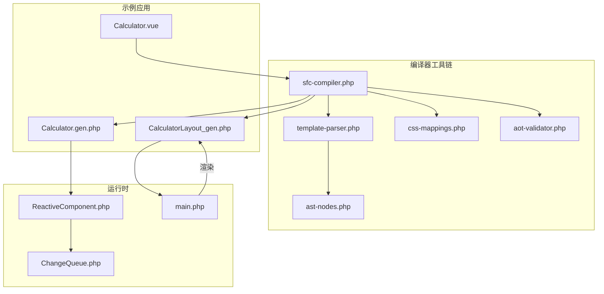
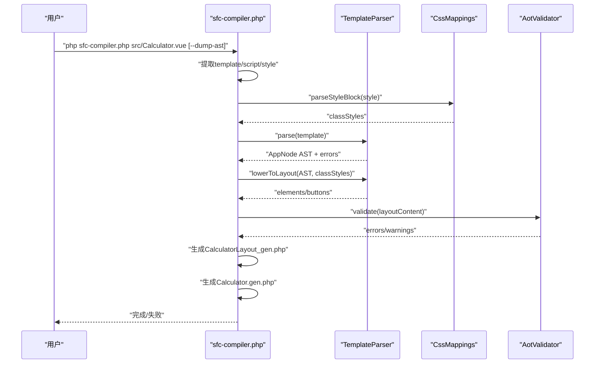
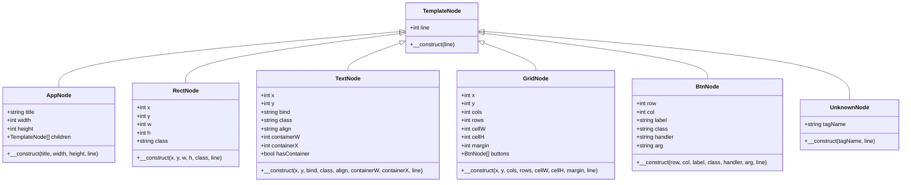
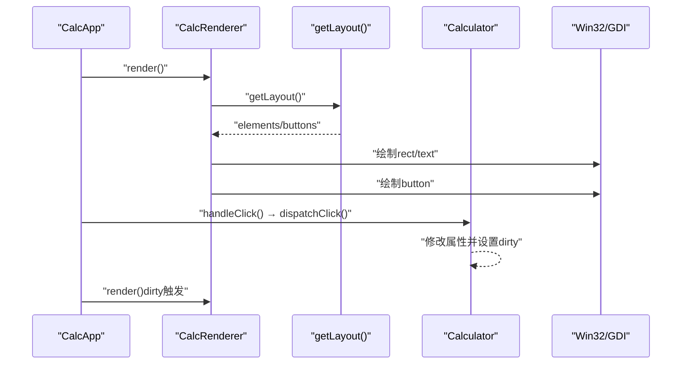
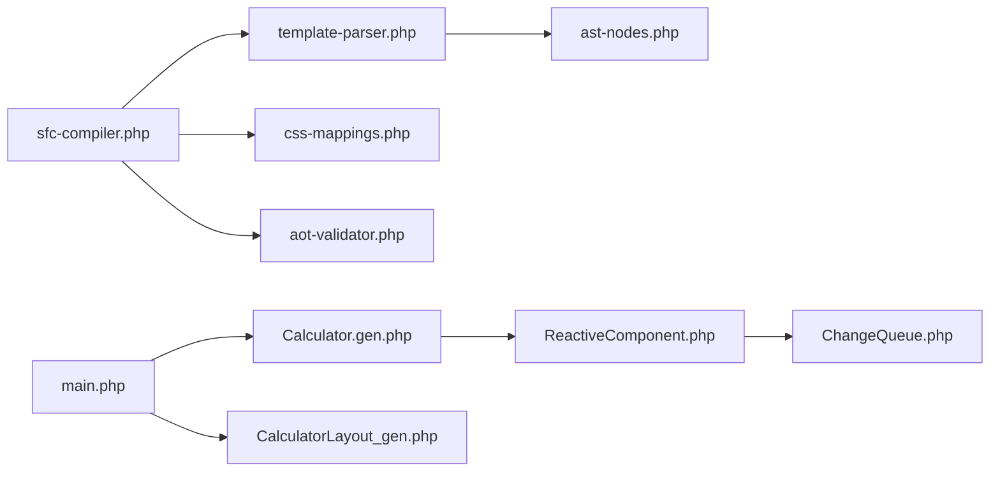
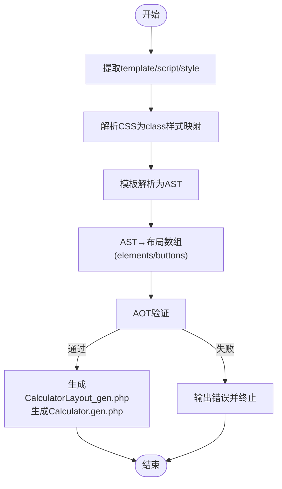

# 编译器架构设计

<cite>
**本文引用的文件**
- [Calculator.vue](file://src/Calculator.vue)
- [sfc-compiler.php](file://tools/sfc-compiler.php)
- [template-parser.php](file://tools/compiler/template-parser.php)
- [aot-validator.php](file://tools/compiler/aot-validator.php)
- [ast-nodes.php](file://tools/compiler/ast-nodes.php)
- [css-mappings.php](file://tools/compiler/css-mappings.php)
- [main.php](file://main.php)
- [ReactiveComponent.php](file://src/ReactiveComponent.php)
- [Calculator.gen.php](file://src/Calculator.gen.php)
- [CalculatorLayout_gen.php](file://src/CalculatorLayout_gen.php)
- [ChangeQueue.php](file://src/ChangeQueue.php)
- [sfc-compiler-test.php](file://tests/sfc-compiler-test.php)
- [verify-layout.php](file://tests/verify-layout.php)
</cite>

## 目录
1. [简介](#简介)
2. [项目结构](#项目结构)
3. [核心组件](#核心组件)
4. [架构总览](#架构总览)
5. [详细组件分析](#详细组件分析)
6. [依赖关系分析](#依赖关系分析)
7. [性能考量](#性能考量)
8. [故障排查指南](#故障排查指南)
9. [结论](#结论)
10. [附录](#附录)

## 简介
本文件面向SFC（Single File Component）编译器架构设计，系统性阐述从.vue单文件组件到.php生成文件的完整转换流程。编译器采用模块化设计，分为六大核心阶段：
- 块提取：从.vue中抽取template/script/style三部分
- 样式解析：CSS类映射到GDI属性
- 模板解析：递归下降解析为AST
- AST到布局数组转换：编译期坐标计算
- AOT验证：生成代码的AOT兼容性检查
- 代码生成：输出布局与组件类文件

该架构以可扩展、可测试、可维护为目标，通过清晰的模块边界与接口契约，确保编译产物与运行时渲染器的无缝衔接。

## 项目结构
项目采用“示例应用 + 工具链 + 测试”的组织方式：
- 示例应用：Calculator.vue及其生成的Calculator.gen.php与CalculatorLayout_gen.php
- 工具链：编译器入口sfc-compiler.php及各子模块（模板解析、样式映射、AOT验证）
- 运行时：ReactiveComponent基类、ChangeQueue变更队列、主程序main.php与渲染器

图表来源
- [sfc-compiler.php:1-210](file://tools/sfc-compiler.php#L1-L210)
- [template-parser.php:1-680](file://tools/compiler/template-parser.php#L1-L680)
- [css-mappings.php:1-210](file://tools/compiler/css-mappings.php#L1-L210)
- [ast-nodes.php:1-153](file://tools/compiler/ast-nodes.php#L1-L153)
- [aot-validator.php:1-169](file://tools/compiler/aot-validator.php#L1-L169)
- [main.php:1-291](file://main.php#L1-L291)
- [ReactiveComponent.php:1-35](file://src/ReactiveComponent.php#L1-L35)
- [Calculator.gen.php:1-174](file://src/Calculator.gen.php#L1-L174)
- [CalculatorLayout_gen.php:1-296](file://src/CalculatorLayout_gen.php#L1-L296)

章节来源
- [sfc-compiler.php:1-210](file://tools/sfc-compiler.php#L1-L210)
- [main.php:1-291](file://main.php#L1-L291)

## 核心组件
- 编译器入口：负责加载模块、执行六大阶段、输出文件并进行AOT验证
- 模板解析器：词法分析、递归下降语法分析、AST节点类型、布局数组生成
- 样式映射器：CSS属性到GDI参数的映射表与解析器
- AST节点：抽象节点与具体节点类型（App/Rect/Text/Grid/Btn/Unknown）
- AOT验证器：生成代码的AOT兼容性规则检查
- 运行时组件：ReactiveComponent基类、ChangeQueue变更队列、渲染器与主程序

章节来源
- [sfc-compiler.php:1-210](file://tools/sfc-compiler.php#L1-L210)
- [template-parser.php:1-680](file://tools/compiler/template-parser.php#L1-L680)
- [css-mappings.php:1-210](file://tools/compiler/css-mappings.php#L1-L210)
- [ast-nodes.php:1-153](file://tools/compiler/ast-nodes.php#L1-L153)
- [aot-validator.php:1-169](file://tools/compiler/aot-validator.php#L1-L169)
- [ReactiveComponent.php:1-35](file://src/ReactiveComponent.php#L1-L35)
- [ChangeQueue.php:1-57](file://src/ChangeQueue.php#L1-L57)

## 架构总览
编译器整体流程如下：
1. 块提取：正则匹配.vue中的template/script/style
2. 样式解析：解析<style>为class→属性映射
3. 模板解析：构建AST并进行错误收集
4. AST→布局数组：编译期计算坐标与样式合并
5. AOT验证：检查生成代码的AOT兼容性
6. 代码生成：输出布局与组件类文件

图表来源
- [sfc-compiler.php:46-210](file://tools/sfc-compiler.php#L46-L210)
- [template-parser.php:79-541](file://tools/compiler/template-parser.php#L79-L541)
- [css-mappings.php:164-194](file://tools/compiler/css-mappings.php#L164-L194)
- [aot-validator.php:36-106](file://tools/compiler/aot-validator.php#L36-L106)

## 详细组件分析

### 组件一：编译器入口（sfc-compiler.php）
职责与流程：
- 加载子模块（AST节点、样式映射、模板解析、AOT验证）
- 解析命令行参数与输入文件
- 执行六大阶段并输出结果
- 在写盘前进行AOT验证

关键特性：
- 模块化加载，便于扩展新阶段或替换模块
- 错误聚合与报告，支持--dump-ast调试模式
- 生成两份输出：布局数组文件与组件类文件

章节来源
- [sfc-compiler.php:1-210](file://tools/sfc-compiler.php#L1-L210)

### 组件二：模板解析器（template-parser.php）
职责与流程：
- 词法分析：识别标签、注释、文本等Token
- 语法分析：递归下降解析，构建AST
- 降级转换：将AST转为布局数组（元素与按钮）
- 错误收集：带行号的解析错误

数据结构与算法：
- Token类型与Token类
- TemplateParseError类
- TemplateParser类：parse/tokenize/parseDocument/parseApp/parseElement/parseRect/parseText/parseGrid/parseBtn/lowerToLayout/辅助方法

图表来源
- [ast-nodes.php:9-153](file://tools/compiler/ast-nodes.php#L9-L153)

章节来源
- [template-parser.php:1-680](file://tools/compiler/template-parser.php#L1-L680)
- [ast-nodes.php:1-153](file://tools/compiler/ast-nodes.php#L1-L153)

### 组件三：样式映射器（css-mappings.php）
职责与流程：
- 定义CSS属性到GDI参数的映射表（PROPERTY_MAP）
- 提供颜色、字体、对齐等解析器
- 解析<style>块，生成class→属性映射
- 提供边框色派生与样式解析辅助

扩展点：
- 新增CSS属性：在PROPERTY_MAP中添加条目
- 自定义解析器：实现新的解析函数并注册

章节来源
- [css-mappings.php:1-210](file://tools/compiler/css-mappings.php#L1-L210)

### 组件四：AOT验证器（aot-validator.php）
职责与流程：
- 文件名规则：限制文件名中点的数量，避免C++符号命名问题
- 结构规则：禁止const嵌套数组、变量属性访问、变量方法调用
- 兼容性规则：检测PHP8函数并给出替代建议
- 报告输出：统一格式化错误与警告

章节来源
- [aot-validator.php:1-169](file://tools/compiler/aot-validator.php#L1-L169)

### 组件五：运行时组件（ReactiveComponent.php、ChangeQueue.php、main.php）
职责与流程：
- ReactiveComponent：AOT兼容的响应式基类，提供脏标记与全局变更队列初始化
- ChangeQueue：环形缓冲的变更队列，用于组件状态变更通知
- main.php：应用入口，创建窗口、渲染器与事件循环；基于布局数据驱动渲染

图表来源
- [main.php:99-132](file://main.php#L99-L132)
- [main.php:229-258](file://main.php#L229-L258)
- [Calculator.gen.php:1-174](file://src/Calculator.gen.php#L1-L174)
- [CalculatorLayout_gen.php:1-296](file://src/CalculatorLayout_gen.php#L1-L296)

章节来源
- [ReactiveComponent.php:1-35](file://src/ReactiveComponent.php#L1-L35)
- [ChangeQueue.php:1-57](file://src/ChangeQueue.php#L1-L57)
- [main.php:1-291](file://main.php#L1-L291)

## 依赖关系分析
模块间依赖关系如下：
- sfc-compiler.php依赖template-parser.php、css-mappings.php、aot-validator.php
- template-parser.php依赖ast-nodes.php
- 运行时main.php依赖Calculator.gen.php与CalculatorLayout_gen.php，并使用ReactiveComponent与ChangeQueue

图表来源
- [sfc-compiler.php:19-24](file://tools/sfc-compiler.php#L19-L24)
- [template-parser.php](file://tools/compiler/template-parser.php#L16)
- [ast-nodes.php:1-153](file://tools/compiler/ast-nodes.php#L1-L153)
- [main.php:1-291](file://main.php#L1-L291)

章节来源
- [sfc-compiler.php:1-210](file://tools/sfc-compiler.php#L1-L210)
- [template-parser.php:1-680](file://tools/compiler/template-parser.php#L1-L680)
- [ast-nodes.php:1-153](file://tools/compiler/ast-nodes.php#L1-L153)
- [main.php:1-291](file://main.php#L1-L291)

## 性能考量
- 词法分析：线性扫描模板字符串，时间复杂度O(n)，空间复杂度O(n)
- 语法分析：递归下降，每个Token最多被消费一次，整体O(n)
- 样式解析：按class规则扫描，复杂度O(n_css_rules)，通常远小于模板规模
- 布局数组生成：遍历AST节点，O(n_nodes)，编译期一次性计算坐标
- AOT验证：正则扫描，复杂度O(n_code)，在写盘前拦截问题，避免AOT失败

优化建议：
- 大型模板可考虑分段解析或缓存中间结果
- 样式解析可引入缓存以复用class映射
- AOT验证可并行化（当前为串行扫描）

## 故障排查指南
常见问题与定位方法：
- 模板解析错误：查看--dump-ast输出与错误行号
- 样式无效：确认class是否存在、颜色格式是否正确
- AOT验证失败：修正文件名、移除const嵌套数组、避免变量属性/方法访问
- 运行时渲染异常：核对布局数组元素数量与按钮handler映射

章节来源
- [sfc-compiler.php:104-117](file://tools/sfc-compiler.php#L104-L117)
- [aot-validator.php:127-150](file://tools/compiler/aot-validator.php#L127-L150)
- [verify-layout.php:1-72](file://tests/verify-layout.php#L1-L72)

## 结论
本编译器以模块化为核心设计思想，通过清晰的阶段划分与严格的接口契约，实现了从.vue到.php的稳定转换。模板解析器采用递归下降与AST，样式映射器提供可扩展的CSS→GDI映射，AOT验证器确保生成代码的兼容性。配合运行时的响应式组件与渲染器，形成完整的数据驱动渲染流水线。该架构易于扩展与维护，适合在桌面应用中推广使用。

## 附录

### 编译流程图（代码级）

图表来源
- [sfc-compiler.php:46-210](file://tools/sfc-compiler.php#L46-L210)
- [template-parser.php:464-541](file://tools/compiler/template-parser.php#L464-L541)
- [aot-validator.php:36-106](file://tools/compiler/aot-validator.php#L36-L106)

### 扩展点与自定义选项
- 新增CSS属性：在CssMappings::PROPERTY_MAP中添加条目
- 自定义模板标签：在TemplateParser::parseElement中扩展支持
- 新增AOT规则：在AotValidator::validate中增加检查项
- 修改布局生成策略：在TemplateParser::lowerToLayout中调整坐标与样式合并逻辑

章节来源
- [css-mappings.php:27-69](file://tools/compiler/css-mappings.php#L27-L69)
- [template-parser.php:284-541](file://tools/compiler/template-parser.php#L284-L541)
- [aot-validator.php:36-106](file://tools/compiler/aot-validator.php#L36-L106)