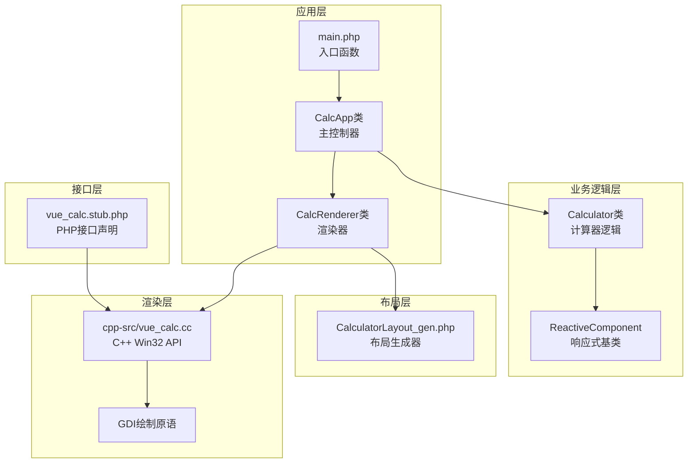
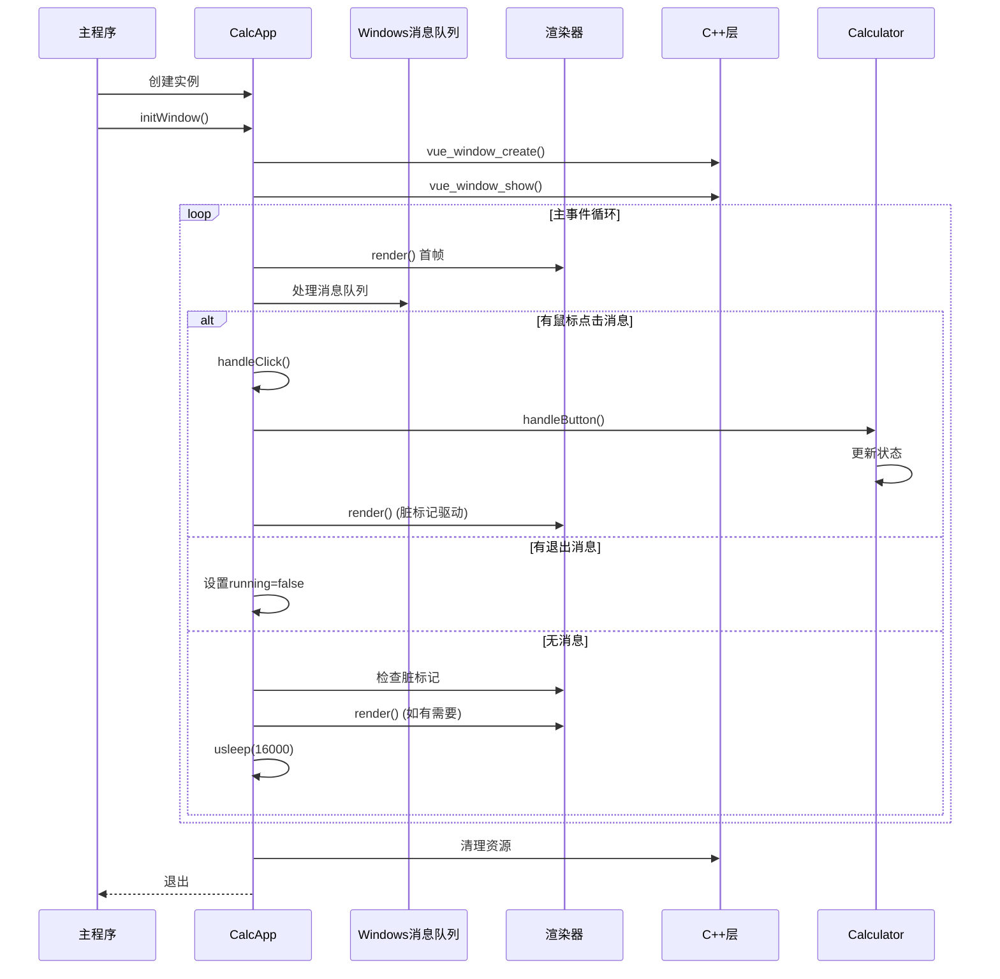
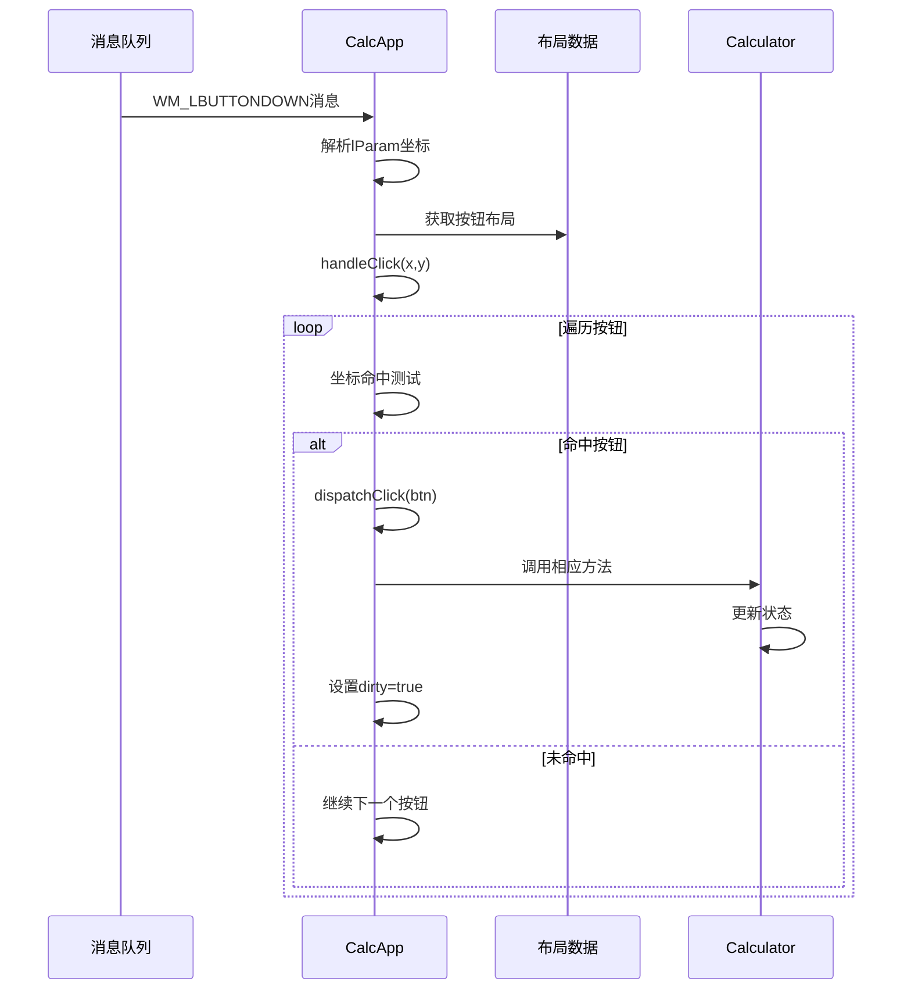
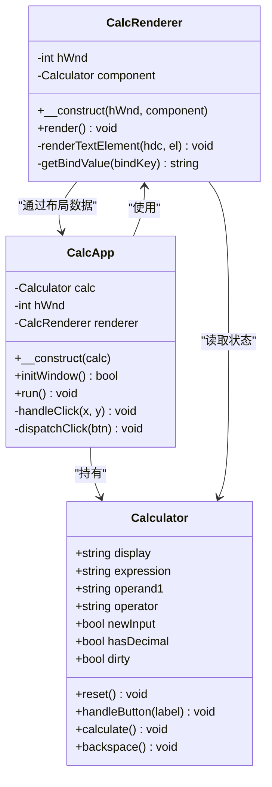
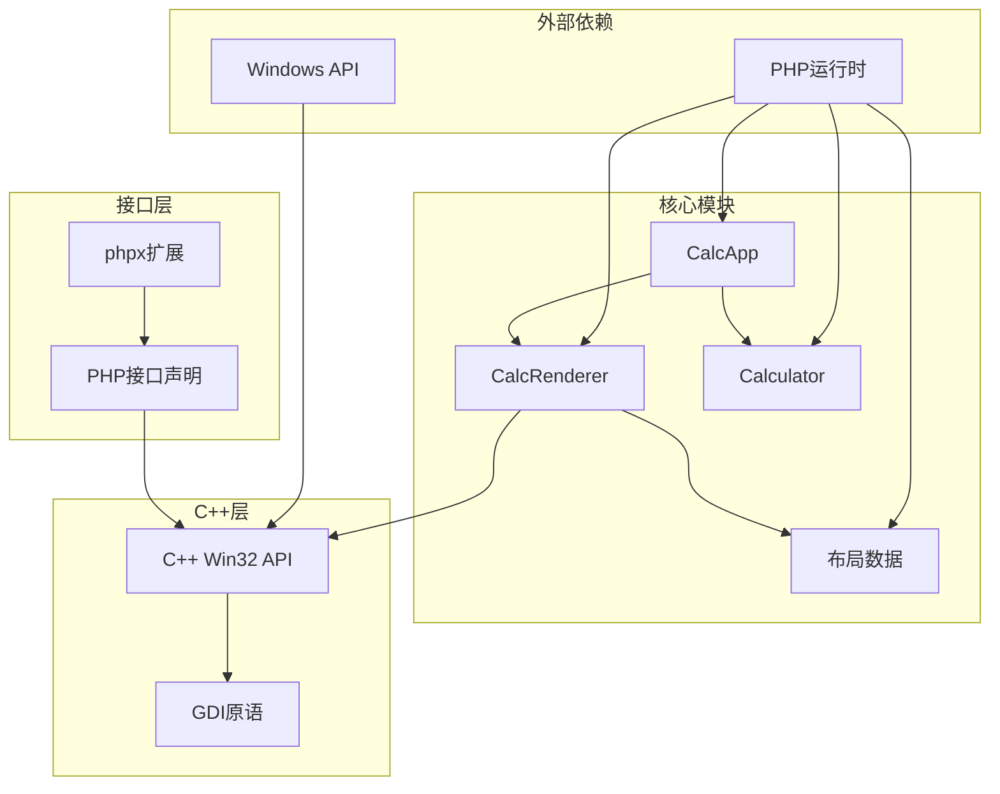

# 事件循环

<cite>
**本文档引用的文件**
- [main.php](file://main.php)
- [vue_calc.cc](file://cpp-src/vue_calc.cc)
- [vue_calc.stub.php](file://php-src/vue_calc.stub.php)
- [Calculator.gen.php](file://src/Calculator.gen.php)
- [CalculatorLayout_gen.php](file://src/CalculatorLayout_gen.php)
- [project.yml](file://project.yml)
</cite>

## 目录
1. [简介](#简介)
2. [项目结构](#项目结构)
3. [核心组件](#核心组件)
4. [架构概览](#架构概览)
5. [详细组件分析](#详细组件分析)
6. [依赖关系分析](#依赖关系分析)
7. [性能考量](#性能考量)
8. [故障排除指南](#故障排除指南)
9. [结论](#结论)

## 简介

VueCalc是一个基于Vue单文件组件（SFC）的桌面计算器应用程序，采用"类Vue数据驱动桌面框架"架构。该项目的核心创新在于将PHP的响应式逻辑与C++的Win32 API渲染层分离，实现了高效的事件循环系统。

该事件循环系统采用双循环架构设计，结合Windows消息队列处理和PHP数据驱动渲染机制，提供了流畅的用户体验。系统通过CalcApp类的run方法实现主事件循环，该循环负责消息处理、事件分发和渲染协调。

## 项目结构

项目采用分层架构设计，主要包含以下层次：



**图表来源**
- [main.php:139-259](file://main.php#L139-L259)
- [Calculator.gen.php:9-174](file://src/Calculator.gen.php#L9-L174)
- [CalculatorLayout_gen.php:10-296](file://src/CalculatorLayout_gen.php#L10-L296)

**章节来源**
- [project.yml:1-10](file://project.yml#L1-L10)
- [main.php:1-291](file://main.php#L1-L291)

## 核心组件

### CalcApp类 - 主事件循环控制器

CalcApp类是整个事件循环系统的核心，负责协调窗口管理、消息处理和渲染流程。其run方法实现了完整的主事件循环，采用双循环架构设计。

**主要职责：**
- 窗口初始化和管理
- 消息队列处理和事件分发
- 渲染协调和脏标记驱动
- 应用生命周期管理

**章节来源**
- [main.php:139-259](file://main.php#L139-L259)

### CalcRenderer类 - 数据驱动渲染器

CalcRenderer类实现了基于SFC生成布局数据的数据驱动渲染系统。它负责将PHP组件的状态转换为C++ GDI绘制命令。

**核心功能：**
- 遍历布局元素进行渲染
- 文本元素的动态字体调整
- 按钮的背景、边框和文字渲染
- 双缓冲绘制优化

**章节来源**
- [main.php:26-133](file://main.php#L26-L133)

### C++ Win32 API层

C++层提供了薄封装的Win32 API，作为渲染引擎的基础。主要包含窗口管理、消息处理和GDI绘制原语。

**关键组件：**
- 窗口创建和显示
- 消息队列处理（PeekMessage包装）
- 退出状态检查
- GDI绘制原语（双缓冲）

**章节来源**
- [vue_calc.cc:19-84](file://cpp-src/vue_calc.cc#L19-L84)

## 架构概览

事件循环系统采用分层架构，实现了清晰的关注点分离：



**图表来源**
- [main.php:171-227](file://main.php#L171-L227)
- [vue_calc.cc:69-84](file://cpp-src/vue_calc.cc#L69-L84)

## 详细组件分析

### 主事件循环实现

CalcApp::run方法实现了完整的主事件循环，采用双循环架构来处理消息队列和渲染：

```mermaid
flowchart TD
Start([进入run方法]) --> Init[初始化渲染器<br/>首帧渲染]
Init --> Loop{主循环running?}
Loop --> |是| InnerLoop[内循环: 处理所有消息]
InnerLoop --> CheckMsg{有消息?}
CheckMsg --> |是| MsgType{消息类型判断}
CheckMsg --> |否| OuterCheck[外循环检查]
MsgType --> LMB{WM_LBUTTONDOWN?}
MsgType --> Quit{WM_QUIT?}
LMB --> ParseCoord[解析鼠标坐标]
ParseCoord --> HandleClick[handleClick处理]
HandleClick --> UpdateState[更新计算器状态]
UpdateState --> DirtyFlag[设置dirty标志]
DirtyFlag --> BackToInner[回到内循环]
Quit --> SetRunning[设置running=false]
SetRunning --> BackToInner
OuterCheck --> QuitRequested{vue_quit_requested?}
QuitRequested --> |是| SetRunning2[设置running=false]
QuitRequested --> |否| RenderCheck[检查脏标记]
RenderCheck --> DirtyRender{calc->dirty?}
DirtyRender --> |是| Render[执行渲染]
DirtyRender --> |否| Sleep[usleep(16000)]
Render --> ClearDirty[清除dirty标志]
ClearDirty --> Sleep
Sleep --> Loop
Loop --> |否| Cleanup[清理资源]
Cleanup --> End([退出])
```

**图表来源**
- [main.php:171-227](file://main.php#L171-L227)

#### 消息队列处理机制

系统使用vue_peek_message函数实现高效的消息轮询，该函数封装了Windows的PeekMessage API：

**处理流程：**
1. 使用PeekMessage检查消息队列是否有待处理消息
2. 如果有消息，返回包含hwnd、message、wParam、lParam的数组
3. 调用TranslateMessage和DispatchMessage进行消息翻译和分发
4. 如果没有消息，返回空数组

**章节来源**
- [vue_calc.cc:69-84](file://cpp-src/vue_calc.cc#L69-L84)
- [main.php:180-204](file://main.php#L180-L204)

#### 鼠标点击消息处理

WM_LBUTTONDOWN消息的处理流程体现了系统的事件分发机制：



**图表来源**
- [main.php:188-198](file://main.php#L188-L198)
- [main.php:230-258](file://main.php#L230-L258)

**章节来源**
- [main.php:188-198](file://main.php#L188-L198)
- [main.php:230-258](file://main.php#L230-L258)

#### 退出消息处理

WM_QUIT消息的处理确保了应用程序的优雅退出：

**处理策略：**
1. 检测到WM_QUIT消息时，立即设置running=false
2. 同时检查vue_quit_requested()状态作为后备机制
3. 两个条件都满足时才真正退出循环

**章节来源**
- [main.php:200-208](file://main.php#L200-L208)
- [vue_calc.cc:64-67](file://cpp-src/vue_calc.cc#L64-L67)

### 渲染系统架构

渲染系统采用数据驱动设计，通过脏标记机制实现高效的渲染控制：



**图表来源**
- [main.php:26-133](file://main.php#L26-L133)
- [main.php:139-259](file://main.php#L139-L259)
- [Calculator.gen.php:9-174](file://src/Calculator.gen.php#L9-L174)

**章节来源**
- [main.php:26-133](file://main.php#L26-L133)
- [Calculator.gen.php:9-174](file://src/Calculator.gen.php#L9-L174)

## 依赖关系分析

事件循环系统的依赖关系体现了清晰的分层设计：



**图表来源**
- [main.php:1-291](file://main.php#L1-L291)
- [vue_calc.cc:1-157](file://cpp-src/vue_calc.cc#L1-L157)
- [vue_calc.stub.php:1-23](file://php-src/vue_calc.stub.php#L1-L23)

**章节来源**
- [main.php:1-291](file://main.php#L1-L291)
- [vue_calc.cc:1-157](file://cpp-src/vue_calc.cc#L1-L157)

## 性能考量

### 渲染性能优化

系统采用了多种优化策略来确保60FPS的渲染性能：

**帧率控制：**
- 使用usleep(16000)实现约16ms的帧间隔
- 60FPS目标帧率，每帧预算约16.67ms
- 实际渲染开销仅占约3%，远低于帧预算

**渲染优化：**
- 脏标记驱动渲染，仅在状态变更时重绘
- 双缓冲GDI绘制，避免闪烁
- 数据驱动渲染，减少重复绘制

**章节来源**
- [main.php:223](file://main.php#L223)
- [main.php:214-221](file://main.php#L214-L221)

### 消息处理效率

**消息轮询策略：**
- 内循环优先处理所有待处理消息，确保UI响应性
- 外循环作为后备检查，防止消息丢失
- 使用PeekMessage避免阻塞，提高系统响应性

**事件分发优化：**
- 线性遍历18个按钮的命中测试，每个约100ns
- 首次命中即停止，避免不必要的遍历
- 显式路由表设计，便于AOT编译器优化

**章节来源**
- [main.php:180-204](file://main.php#L180-L204)
- [main.php:230-241](file://main.php#L230-L241)

### C++/PHP交互优化

**调用开销控制：**
- 每帧42次PHP↔C++调用，通过批量化减少往返次数
- GDI调用开销占主导，类型转换开销相对较小
- 可通过批量调用进一步优化（未来扩展）

**内存管理：**
- 双缓冲DC和位图的正确创建和销毁
- 静态退出标志避免额外的C++调用

**章节来源**
- [vue_calc.cc:90-117](file://cpp-src/vue_calc.cc#L90-L117)
- [vue_calc.cc:69-84](file://cpp-src/vue_calc.cc#L69-L84)

## 故障排除指南

### 常见问题诊断

**事件循环卡死：**
- 检查WM_QUIT消息是否正确处理
- 确认vue_quit_requested()后备检查正常工作
- 验证usleep调用是否被执行

**渲染异常：**
- 检查calc->dirty标志是否正确设置
- 确认布局数据完整性
- 验证GDI调用顺序和参数

**消息处理错误：**
- 检查鼠标坐标解析是否正确
- 确认按钮命中测试逻辑
- 验证事件分发路由表

**章节来源**
- [main.php:200-208](file://main.php#L200-L208)
- [main.php:214-221](file://main.php#L214-L221)
- [main.php:230-258](file://main.php#L230-L258)

### 调试技巧

**日志输出：**
- 在关键节点添加调试信息
- 监控消息类型和处理结果
- 跟踪渲染触发条件

**性能监控：**
- 测量每帧渲染时间
- 监控消息队列长度
- 分析CPU使用情况

**内存检查：**
- 确认GDI资源正确释放
- 检查内存泄漏
- 验证双缓冲机制

## 结论

VueCalc的事件循环系统展现了优秀的架构设计和实现质量。通过双循环架构、数据驱动渲染和消息队列处理的有机结合，系统实现了高效、响应灵敏的桌面应用体验。

**主要优势：**
- 清晰的分层架构，职责分离明确
- 高效的消息处理机制，确保UI响应性
- 数据驱动渲染，降低渲染开销
- 完善的错误处理和性能优化

**技术特色：**
- 双循环消息处理架构
- 脏标记驱动的渲染系统
- 数据驱动的布局管理
- 高效的C++/PHP交互机制

该事件循环系统为类似的数据驱动桌面应用提供了优秀的参考实现，展示了如何在保证性能的同时实现代码的可维护性和扩展性。