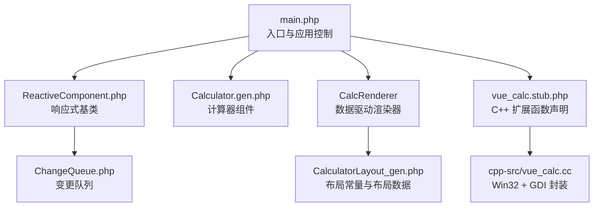
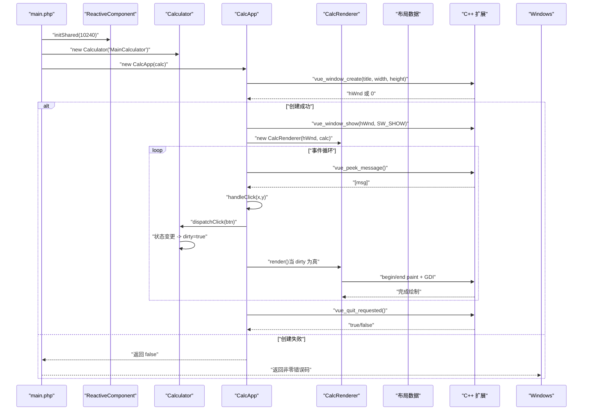
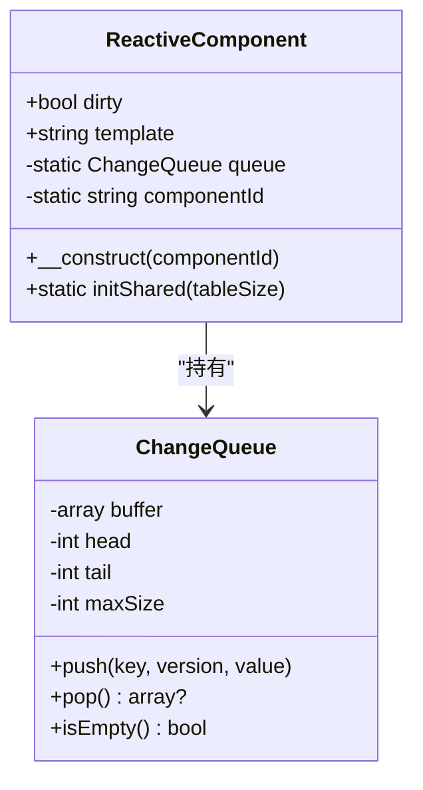
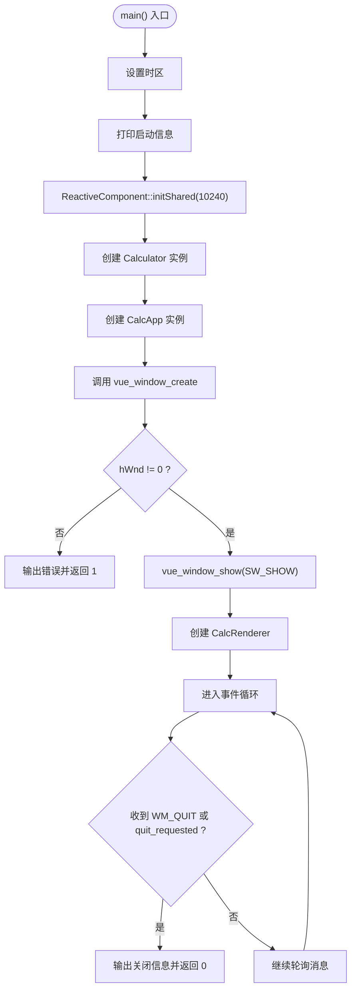
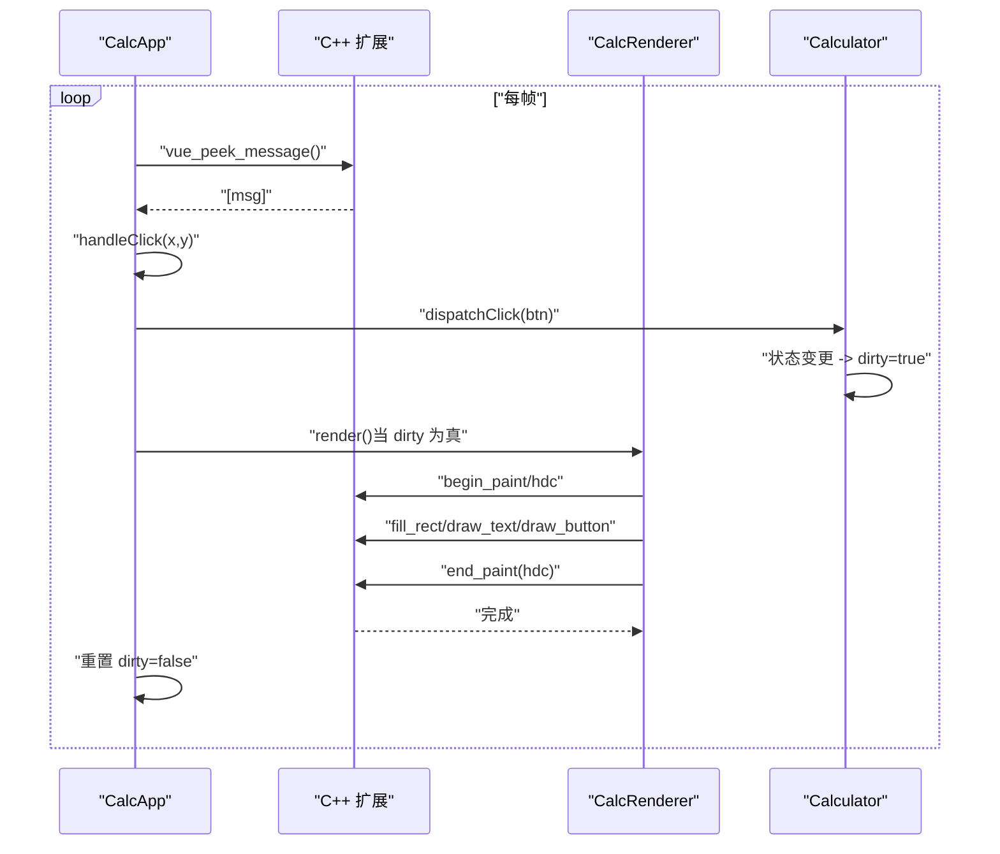
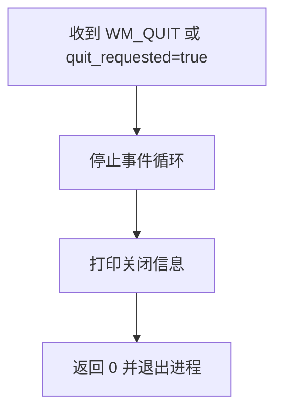
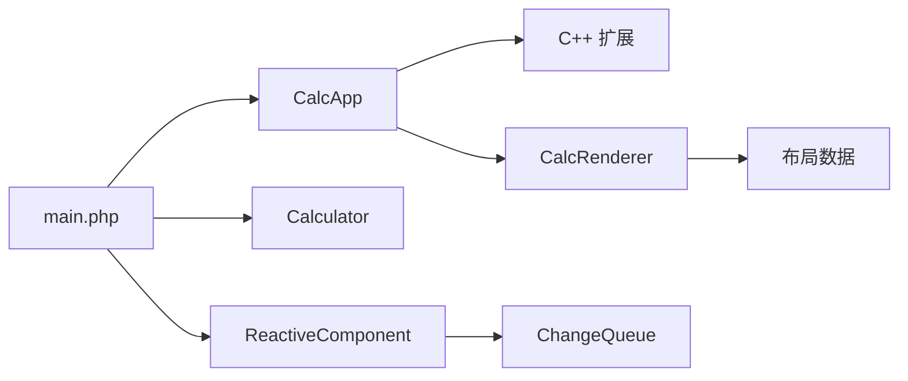

# 启动与关闭

<cite>
**本文引用的文件**
- [main.php](file://main.php)
- [ReactiveComponent.php](file://src/ReactiveComponent.php)
- [Calculator.gen.php](file://src/Calculator.gen.php)
- [ChangeQueue.php](file://src/ChangeQueue.php)
- [CalculatorLayout_gen.php](file://src/CalculatorLayout_gen.php)
- [vue_calc.stub.php](file://php-src/vue_calc.stub.php)
- [vue_calc.cc](file://cpp-src/vue_calc.cc)
</cite>

## 目录
1. [简介](#简介)
2. [项目结构](#项目结构)
3. [核心组件](#核心组件)
4. [架构总览](#架构总览)
5. [详细组件分析](#详细组件分析)
6. [依赖关系分析](#依赖关系分析)
7. [性能考虑](#性能考虑)
8. [故障排查指南](#故障排查指南)
9. [结论](#结论)
10. [附录](#附录)

## 简介
本文档系统性梳理 VueCalc 应用程序的启动与关闭流程，重点覆盖：
- main 函数的完整启动序列与顺序控制
- 响应式框架初始化（ReactiveComponent::initShared）与共享内存/变更队列的配置
- 计算器组件创建与应用启动的衔接
- 优雅关闭流程（资源清理、窗口销毁、进程退出）
- 启动失败的错误处理（窗口创建失败检测与返回码）
- 生命周期监控（启动日志与关闭通知）
- 启动性能优化与时间缩短技巧

## 项目结构
该工程采用“SFC 编译 + AOT + C++ 渲染”的混合架构：
- .vue 组件经 SFC 编译器生成 .gen.php（包含布局与组件类）
- PHP 侧实现响应式组件基类与计算器逻辑
- C++ 扩展封装 Win32 API，提供窗口/GDI 绘制原语
- main.php 作为入口，负责初始化、组件创建与事件循环

图表来源
- [main.php:265-291](file://main.php#L265-L291)
- [ReactiveComponent.php:11-35](file://src/ReactiveComponent.php#L11-L35)
- [Calculator.gen.php:9-174](file://src/Calculator.gen.php#L9-L174)
- [ChangeQueue.php:11-57](file://src/ChangeQueue.php#L11-L57)
- [CalculatorLayout_gen.php:10-296](file://src/CalculatorLayout_gen.php#L10-L296)
- [vue_calc.stub.php:12-24](file://php-src/vue_calc.stub.php#L12-L24)
- [vue_calc.cc:36-84](file://cpp-src/vue_calc.cc#L36-L84)

章节来源
- [main.php:1-291](file://main.php#L1-L291)
- [CalculatorLayout_gen.php:7-8](file://src/CalculatorLayout_gen.php#L7-L8)

## 核心组件
- 响应式基类 ReactiveComponent：提供全局变更队列、脏标记与组件标识；通过静态方法 initShared 完成共享初始化。
- 计算器组件 Calculator：继承自 ReactiveComponent，定义显示值、表达式等状态与按钮处理逻辑，每次状态变更设置 $dirty=true。
- 变更队列 ChangeQueue：环形缓冲实现，用于收集组件状态变更，供渲染循环消费。
- 渲染器 CalcRenderer：基于布局数据与组件状态进行 GDI 绘制。
- 应用控制器 CalcApp：负责窗口创建、消息循环、事件分发与渲染触发。
- C++ 扩展：提供窗口创建、消息轮询、GDI 绘制等底层能力。

章节来源
- [ReactiveComponent.php:11-35](file://src/ReactiveComponent.php#L11-L35)
- [Calculator.gen.php:9-174](file://src/Calculator.gen.php#L9-L174)
- [ChangeQueue.php:11-57](file://src/ChangeQueue.php#L11-L57)
- [main.php:26-133](file://main.php#L26-L133)
- [main.php:139-259](file://main.php#L139-L259)
- [vue_calc.stub.php:12-24](file://php-src/vue_calc.stub.php#L12-L24)
- [vue_calc.cc:36-84](file://cpp-src/vue_calc.cc#L36-L84)

## 架构总览
下图展示从 main.php 启动到渲染循环的关键交互与数据流。

图表来源
- [main.php:265-291](file://main.php#L265-L291)
- [ReactiveComponent.php:30-33](file://src/ReactiveComponent.php#L30-L33)
- [Calculator.gen.php:149-168](file://src/Calculator.gen.php#L149-L168)
- [main.php:171-227](file://main.php#L171-L227)
- [main.php:99-132](file://main.php#L99-L132)
- [CalculatorLayout_gen.php:10-296](file://src/CalculatorLayout_gen.php#L10-L296)
- [vue_calc.stub.php:13-23](file://php-src/vue_calc.stub.php#L13-L23)
- [vue_calc.cc:36-84](file://cpp-src/vue_calc.cc#L36-L84)

## 详细组件分析

### 响应式框架初始化与共享内存配置
- ReactiveComponent::initShared 的作用
  - 初始化全局变更队列实例，为后续组件状态变更提供统一的变更通道。
  - 该方法在 main 函数启动序列的第一步被调用，确保在创建任何组件之前完成共享资源的准备。
- 共享内存与变更队列
  - 变更队列采用环形缓冲实现，具备固定最大容量，避免无限增长导致内存压力。
  - 组件状态变更通过 push(key, version, value) 入队，渲染循环通过 pop() 消费变更，实现解耦的数据驱动更新。

图表来源
- [ReactiveComponent.php:11-35](file://src/ReactiveComponent.php#L11-L35)
- [ChangeQueue.php:11-57](file://src/ChangeQueue.php#L11-L57)

章节来源
- [ReactiveComponent.php:30-33](file://src/ReactiveComponent.php#L30-L33)
- [ChangeQueue.php:18-55](file://src/ChangeQueue.php#L18-L55)

### 计算器组件创建与应用启动顺序
- main 函数启动序列
  1) 设置时区与打印启动信息
  2) 调用 ReactiveComponent::initShared 完成共享初始化
  3) 创建计算器组件实例
  4) 创建应用控制器并初始化窗口
  5) 启动事件循环
  6) 优雅关闭并返回退出码
- 窗口初始化与失败处理
  - 通过 C++ 扩展的 vue_window_create 创建窗口，若返回 0 表示失败，立即输出错误信息并返回非零错误码，终止启动流程。

图表来源
- [main.php:265-291](file://main.php#L265-L291)
- [main.php:152-169](file://main.php#L152-L169)
- [vue_calc.stub.php:13](file://php-src/vue_calc.stub.php#L13)
- [vue_calc.cc:36-67](file://cpp-src/vue_calc.cc#L36-L67)

章节来源
- [main.php:265-291](file://main.php#L265-L291)
- [main.php:152-169](file://main.php#L152-L169)

### 事件循环与渲染流程
- 消息轮询与事件分发
  - 使用 vue_peek_message 获取消息，命中左键按下时进行坐标命中测试，定位到具体按钮后分发到组件方法。
  - 支持 WM_QUIT 与外部请求退出标志，保证优雅退出。
- 渲染触发与双缓冲绘制
  - 仅在组件状态变更（$dirty 为真）时触发 CalcRenderer::render。
  - 渲染器通过 C++ 扩展提供的 begin/end paint 与 GDI 接口完成双缓冲绘制，提升视觉流畅度。

图表来源
- [main.php:171-227](file://main.php#L171-L227)
- [main.php:99-132](file://main.php#L99-L132)
- [Calculator.gen.php:149-168](file://src/Calculator.gen.php#L149-L168)
- [CalculatorLayout_gen.php:10-296](file://src/CalculatorLayout_gen.php#L10-L296)
- [vue_calc.stub.php:19-23](file://php-src/vue_calc.stub.php#L19-L23)
- [vue_calc.cc:90-117](file://cpp-src/vue_calc.cc#L90-L117)

章节来源
- [main.php:171-227](file://main.php#L171-L227)
- [main.php:99-132](file://main.php#L99-L132)

### 优雅关闭流程
- 关闭路径
  - 当收到 WM_QUIT 或外部请求退出标志时，事件循环结束，打印关闭信息并返回 0。
  - C++ 层在 WM_CLOSE/WM_DESTROY 中设置退出标志并投递退出消息，确保主循环能感知退出信号。
- 资源清理
  - 渲染器在每帧绘制完成后由 C++ 层释放临时位图与 DC，避免泄漏。
  - 窗口句柄由底层系统管理，应用层通过消息机制触发销毁流程。

图表来源
- [main.php:200-208](file://main.php#L200-L208)
- [vue_calc.cc:21-33](file://cpp-src/vue_calc.cc#L21-L33)
- [vue_calc.cc:64-67](file://cpp-src/vue_calc.cc#L64-L67)

章节来源
- [main.php:200-208](file://main.php#L200-L208)
- [vue_calc.cc:21-33](file://cpp-src/vue_calc.cc#L21-L33)
- [vue_calc.cc:64-67](file://cpp-src/vue_calc.cc#L64-L67)

### 启动失败的错误处理机制
- 窗口创建失败检测
  - vue_window_create 返回 0 表示失败，应用层检测并输出错误信息。
- 错误返回码
  - main 函数在窗口创建失败时返回 1，表示启动失败；成功则返回 0。
- 建议的改进
  - 可增加更详细的错误上下文（如 GetLastError），便于诊断。

章节来源
- [main.php:152-169](file://main.php#L152-L169)
- [vue_calc.stub.php:13](file://php-src/vue_calc.stub.php#L13)
- [vue_calc.cc:36-57](file://cpp-src/vue_calc.cc#L36-L57)

### 应用程序生命周期监控
- 启动日志记录
  - main 函数打印启动信息与模式说明，便于追踪启动阶段。
  - 窗口创建成功后输出提示信息，渲染首帧后输出启动完成信息。
- 关闭通知
  - 事件循环结束后输出关闭信息，便于确认优雅退出。
- 建议增强
  - 可引入统一的日志接口或配置开关，按需输出调试信息。

章节来源
- [main.php:269-273](file://main.php#L269-L273)
- [main.php:167-168](file://main.php#L167-L168)
- [main.php:176](file://main.php#L176)
- [main.php:226](file://main.php#L226)
- [main.php:288](file://main.php#L288)

## 依赖关系分析
- 启动阶段依赖链
  - main.php 依赖 ReactiveComponent::initShared、Calculator 构造与 CalcApp::initWindow
  - CalcApp 依赖 C++ 扩展函数（窗口/GDI）
  - CalcRenderer 依赖布局数据与 C++ 扩展
- 组件耦合
  - CalcApp 与 CalcRenderer 通过窗口句柄耦合，但渲染细节通过 C++ 扩展隔离
  - ReactiveComponent 与 ChangeQueue 通过静态字段耦合，形成全局变更通道

图表来源
- [main.php:265-291](file://main.php#L265-L291)
- [ReactiveComponent.php:30-33](file://src/ReactiveComponent.php#L30-L33)
- [Calculator.gen.php:170-174](file://src/Calculator.gen.php#L170-L174)
- [main.php:139-259](file://main.php#L139-L259)
- [CalculatorLayout_gen.php:10-296](file://src/CalculatorLayout_gen.php#L10-L296)
- [vue_calc.stub.php:12-24](file://php-src/vue_calc.stub.php#L12-L24)

章节来源
- [main.php:265-291](file://main.php#L265-L291)
- [ReactiveComponent.php:30-33](file://src/ReactiveComponent.php#L30-L33)
- [Calculator.gen.php:170-174](file://src/Calculator.gen.php#L170-L174)
- [main.php:139-259](file://main.php#L139-L259)
- [CalculatorLayout_gen.php:10-296](file://src/CalculatorLayout_gen.php#L10-L296)
- [vue_calc.stub.php:12-24](file://php-src/vue_calc.stub.php#L12-L24)

## 性能考虑
- 渲染频率与帧率
  - 事件循环中使用微秒级休眠以近似 60 FPS，可根据系统负载调整休眠时长。
- 变更队列容量
  - ChangeQueue 默认最大容量适中，若组件状态变更频繁，可评估增大容量以减少溢出风险。
- 绘制优化
  - CalcRenderer 已采用双缓冲绘制，避免闪烁；可进一步按需重绘（仅重绘变更区域）。
- 启动阶段优化
  - 将布局数据与组件构造拆分为延迟初始化，减少首帧前阻塞。
  - 预热 C++ 扩展句柄与 GDI 资源，降低首帧开销。
  - 避免在启动时执行耗时任务，将非必要初始化移至运行期。

[本节为通用性能建议，不直接分析具体文件]

## 故障排查指南
- 窗口创建失败
  - 现象：输出错误信息并返回非零码
  - 排查：检查 C++ 扩展是否正确加载、窗口类注册是否成功、尺寸参数是否有效
- 渲染异常
  - 现象：渲染过程中抛出异常
  - 排查：捕获异常并记录堆栈，定位到具体渲染步骤；检查布局数据与组件状态一致性
- 事件未响应
  - 现象：点击无反应
  - 排查：确认消息轮询是否正常、命中测试坐标是否正确、按钮处理器是否匹配
- 退出不彻底
  - 现象：进程未退出或资源未释放
  - 排查：确认 WM_QUIT 是否到达、quit_requested 标志是否被设置、C++ 层是否正确投递退出消息

章节来源
- [main.php:160-163](file://main.php#L160-L163)
- [main.php:192-198](file://main.php#L192-L198)
- [main.php:215-219](file://main.php#L215-L219)
- [main.php:200-208](file://main.php#L200-L208)
- [vue_calc.cc:21-33](file://cpp-src/vue_calc.cc#L21-L33)

## 结论
本文档系统梳理了 VueCalc 的启动与关闭流程，明确了响应式框架初始化、组件创建与应用启动的顺序控制，以及渲染循环与退出路径。ReactiveComponent::initShared 为全局变更通道奠定基础，CalcApp 通过 C++ 扩展实现跨语言协作，最终达成数据驱动的桌面计算器体验。建议在生产环境中结合日志与监控，持续优化启动性能与稳定性。

[本节为总结性内容，不直接分析具体文件]

## 附录
- 关键 API 一览
  - 窗口管理：vue_window_create、vue_window_show、vue_quit_requested、vue_peek_message
  - 绘制原语：vue_begin_paint、vue_end_paint、vue_fill_rect、vue_draw_text、vue_draw_button
- 常量与布局
  - 窗口尺寸常量：WINDOW_WIDTH、WINDOW_HEIGHT
  - 布局数据：elements/buttons，包含绘制与事件映射

章节来源
- [vue_calc.stub.php:12-24](file://php-src/vue_calc.stub.php#L12-L24)
- [CalculatorLayout_gen.php:7-8](file://src/CalculatorLayout_gen.php#L7-L8)
- [CalculatorLayout_gen.php:10-296](file://src/CalculatorLayout_gen.php#L10-L296)