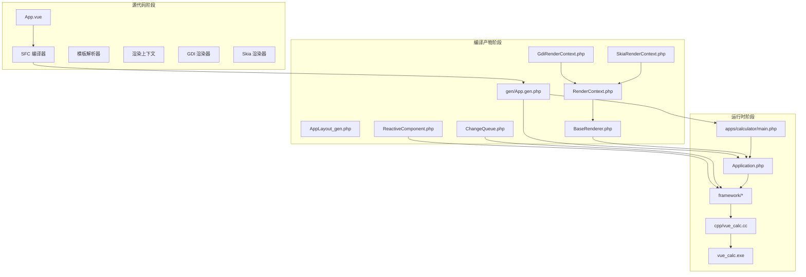
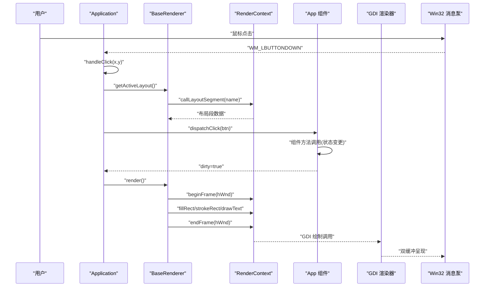
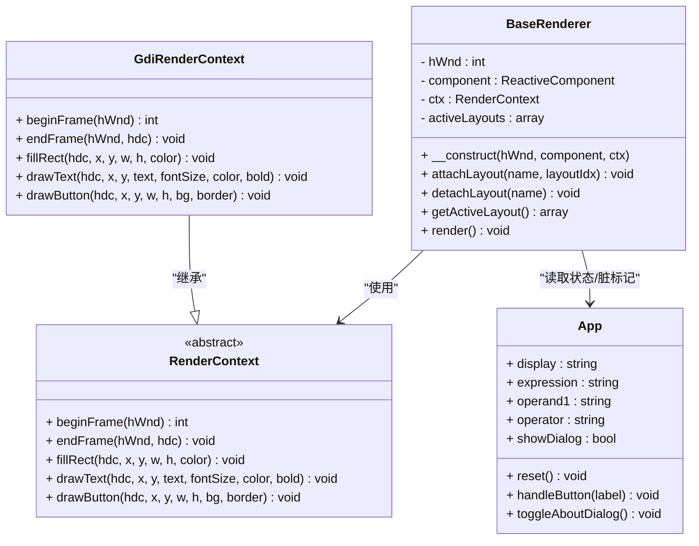
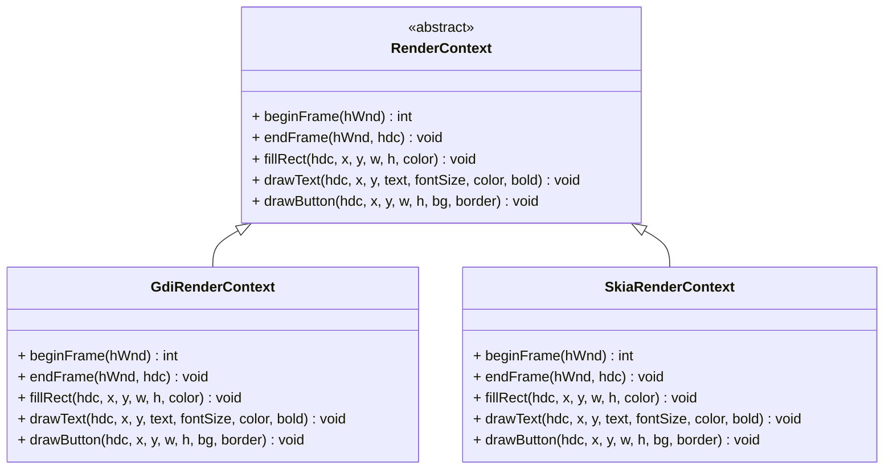
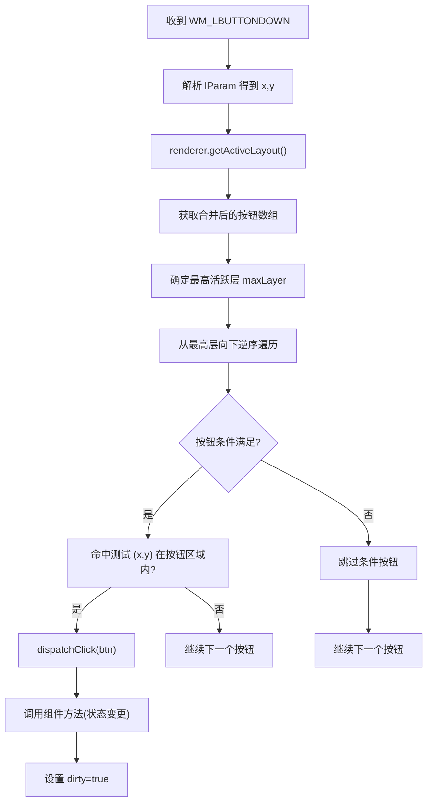
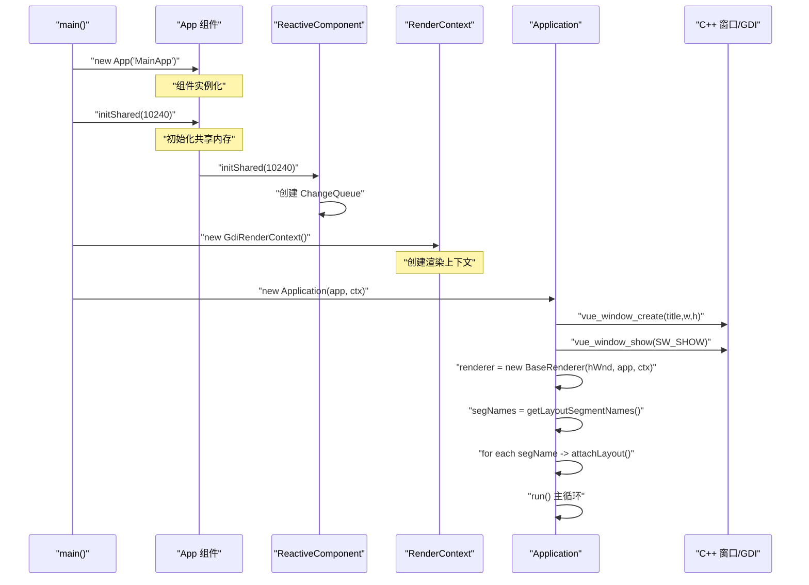
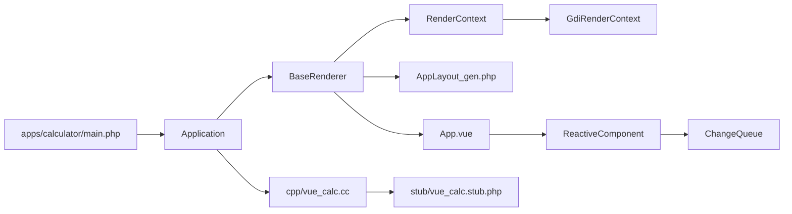

# 应用程序生命周期

<cite>
**本文引用的文件**
- [main.php](file://apps/calculator/main.php)
- [Application.php](file://apps/calculator/Application.php)
- [ReactiveComponent.php](file://framework/ReactiveComponent.php)
- [ChangeQueue.php](file://framework/ChangeQueue.php)
- [BaseRenderer.php](file://framework/BaseRenderer.php)
- [RenderContext.php](file://framework/rendering/RenderContext.php)
- [GdiRenderContext.php](file://framework/rendering/GdiRenderContext.php)
- [App.vue](file://apps/calculator/App.vue)
- [AppLayout_gen.php](file://apps/calculator/gen/AppLayout_gen.php)
- [project.yml](file://apps/calculator/project.yml)
</cite>

## 更新摘要
**所做更改**
- 更新了渲染架构，反映RenderContext集成和分段布局注册机制
- 完善了新的渲染器设计，包括分段布局管理和后端无关渲染抽象
- 更新了启动流程，反映RenderContext参数化和动态布局段注册
- 增强了事件处理机制说明，包括分段布局下的命中测试
- 更新了架构图和组件关系图，准确反映新的渲染架构

## 目录
1. [简介](#简介)
2. [项目结构](#项目结构)
3. [核心组件](#核心组件)
4. [架构总览](#架构总览)
5. [详细组件分析](#详细组件分析)
6. [依赖关系分析](#依赖关系分析)
7. [性能考量](#性能考量)
8. [故障排查指南](#故障排查指南)
9. [结论](#结论)
10. [附录](#附录)

## 简介
本文件围绕"VueCalc"应用程序的生命周期进行系统化技术文档梳理，重点覆盖以下方面：
- Application 通用控制器的设计与实现：窗口初始化、事件循环、生命周期控制
- RenderContext 渲染抽象：后端无关的绘制接口设计，支持GDI、Skia等多种渲染后端
- 分段布局系统：通过布局段注册机制实现组件化UI构建
- 事件处理机制：鼠标点击捕获、坐标转换、分层命中测试
- 数据驱动渲染：脏标记机制、渲染调度、性能优化
- 启动流程：从 main 函数到窗口创建的完整过程，包括正确的初始化顺序
- 错误处理与异常恢复
- 关闭流程、资源清理与内存管理
- 调试与监控最佳实践

## 项目结构
该项目采用"SFC 编译器 + AOT 编译器"的混合架构，前端以 .vue 单文件组件描述 UI，经 SFC 编译器生成 .gen.php（包含组件类与布局数据），再由 AOT 编译器生成原生 Windows 可执行文件。C++ 层仅提供 Win32 窗口与 GDI 绘制原语，业务逻辑与响应式状态由 PHP 实现。新的渲染架构引入了RenderContext抽象层，支持后端无关的渲染接口。

**图表来源**
- [project.yml:12-23](file://apps/calculator/project.yml#L12-L23)
- [main.php:27-28](file://apps/calculator/main.php#L27-L28)
- [Application.php:40-46](file://apps/calculator/Application.php#L40-L46)
- [BaseRenderer.php:18](file://framework/BaseRenderer.php#L18)

**章节来源**
- [project.yml:1-31](file://apps/calculator/project.yml#L1-L31)
- [main.php:1-40](file://apps/calculator/main.php#L1-L40)

## 核心组件
- Application：通用 SFC 应用控制器，负责窗口初始化、事件循环、点击分发、脏标记驱动的渲染调度
- BaseRenderer：数据驱动渲染器，基于布局数据与组件状态驱动 C++ GDI 绘制，支持分段布局和渲染上下文抽象
- RenderContext：渲染抽象基类，提供后端无关的绘制接口，支持多种渲染后端
- GdiRenderContext：Win32 GDI 后端实现，直接委托给 C++ phpx 扩展
- App：响应式组件，承载计算器业务逻辑与状态，配合脏标记驱动重绘
- ReactiveComponent：响应式基类，提供脏标记与共享变更队列能力
- ChangeQueue：环形缓冲变更队列，用于渲染循环消费组件状态变更
- C++ 层（vue_calc.cc）：封装 Win32 API 与 GDI 绘制原语，供 PHP 通过 stub 调用

**章节来源**
- [Application.php:10-146](file://apps/calculator/Application.php#L10-L146)
- [BaseRenderer.php:14-186](file://framework/BaseRenderer.php#L14-L186)
- [RenderContext.php:13-29](file://framework/rendering/RenderContext.php#L13-L29)
- [GdiRenderContext.php:11-37](file://framework/rendering/GdiRenderContext.php#L11-L37)
- [ReactiveComponent.php:11-65](file://framework/ReactiveComponent.php#L11-L65)
- [ChangeQueue.php:11-57](file://framework/ChangeQueue.php#L11-L57)

## 架构总览
应用采用"数据驱动渲染"范式：组件状态变更 → 脏标记置位 → 渲染器按需重绘 → RenderContext 抽象层 → C++ GDI 输出到屏幕。事件循环在 PHP 层维护，通过 C++ 提供的消息轮询接口与退出检测，实现与 Win32 消息泵的桥接。新的渲染架构引入了分段布局系统，支持动态注册和管理多个布局段。

**图表来源**
- [Application.php:110-139](file://apps/calculator/Application.php#L110-L139)
- [Application.php:109-139](file://apps/calculator/Application.php#L109-L139)
- [BaseRenderer.php:124-184](file://framework/BaseRenderer.php#L124-L184)
- [BaseRenderer.php:131-137](file://framework/BaseRenderer.php#L131-L137)

## 详细组件分析

### Application：通用控制器
- 窗口初始化：调用 C++ 封装的窗口创建与显示函数，创建渲染器实例并动态注册所有布局段
- 事件循环：持续轮询消息，处理鼠标点击与退出信号，驱动渲染
- 事件分发：分层命中测试按钮区域后，根据按钮配置路由到组件方法
- 渲染调度：仅在组件状态变更（dirty）后触发 BaseRenderer.render()
- 分段布局管理：通过 getLayoutSegmentNames() 动态获取布局段列表并注册到渲染器

**图表来源**
- [Application.php:52-107](file://apps/calculator/Application.php#L52-L107)
- [Application.php:59-104](file://apps/calculator/Application.php#L59-L104)

**章节来源**
- [Application.php:52-107](file://apps/calculator/Application.php#L52-L107)

### BaseRenderer：数据驱动渲染器
- 渲染上下文集成：通过 RenderContext 参数化渲染后端，支持GDI、Skia等多种后端
- 分段布局管理：通过 attachLayout()/detachLayout() 管理活跃布局列表，支持动态注册
- 数据来源：通过 callLayoutSegment() 获取布局段数据，结合组件状态属性进行绘制
- 文本渲染：支持对齐、动态字号、容器宽度计算与右对齐偏移
- 按钮渲染：背景填充、边框绘制与文字居中
- 双缓冲绘制：beginFrame/endFrame 包裹绘制，减少闪烁

**图表来源**
- [BaseRenderer.php:14-186](file://framework/BaseRenderer.php#L14-L186)
- [RenderContext.php:13-29](file://framework/rendering/RenderContext.php#L13-L29)
- [GdiRenderContext.php:11-37](file://framework/rendering/GdiRenderContext.php#L11-L37)
- [App.vue:27-193](file://apps/calculator/App.vue#L27-L193)

**章节来源**
- [BaseRenderer.php:124-184](file://framework/BaseRenderer.php#L124-L184)

### RenderContext：渲染抽象基类
- 后端无关接口：提供统一的绘制接口抽象，支持多种渲染后端
- 帧管理：beginFrame()/endFrame() 管理双缓冲渲染周期
- 绘制原语：fillRect、drawText、drawButton 等基础绘制方法
- AOT 兼容：abstract class + extends 模式已验证通过 Swoole Compiler

**图表来源**
- [RenderContext.php:13-29](file://framework/rendering/RenderContext.php#L13-L29)
- [GdiRenderContext.php:11-37](file://framework/rendering/GdiRenderContext.php#L11-L37)

**章节来源**
- [RenderContext.php:13-29](file://framework/rendering/RenderContext.php#L13-L29)

### 事件处理机制：鼠标点击捕获与分层命中测试
- 消息轮询：通过 C++ 封装的 vue_peek_message 获取消息，解析 lParam 得到点击坐标
- 坐标转换：Win32 坐标系与布局坐标一致，无需额外转换
- 分层命中测试：确定最高活跃层后，从最高层向下逆序命中测试，支持条件按钮
- 分段布局支持：通过 getActiveLayout() 获取合并后的布局数据，支持多布局段
- 方法分发：根据按钮 handler 与参数，调用组件对应方法（委托给生成的 dispatchClick 方法）

**图表来源**
- [Application.php:110-139](file://apps/calculator/Application.php#L110-L139)
- [Application.php:112-138](file://apps/calculator/Application.php#L112-L138)
- [BaseRenderer.php:42-52](file://framework/BaseRenderer.php#L42-L52)

**章节来源**
- [Application.php:110-139](file://apps/calculator/Application.php#L110-L139)

### 数据驱动渲染：脏标记与调度
- 脏标记：组件状态变更后置位 dirty，渲染器仅在 dirty 为真时重绘
- 渲染时机：事件循环空闲时检查 dirty，避免不必要的重绘
- 性能策略：固定帧率睡眠（约60FPS），减少 CPU 占用
- 文本自适应：根据文本长度动态调整字号，保证显示效果
- 分段布局优化：仅渲染活跃布局段，支持条件按钮的高效命中

**章节来源**
- [App.vue:38-179](file://apps/calculator/App.vue#L38-L179)
- [Application.php:94-101](file://apps/calculator/Application.php#L94-L101)
- [BaseRenderer.php:124-184](file://framework/BaseRenderer.php#L124-L184)

### 启动流程：从 main 到窗口创建（更新）
**更新** 反映了RenderContext集成和分段布局注册机制

应用启动流程现已优化为：先创建应用组件，再初始化共享内存，然后创建 RenderContext（GdiRenderContext），最后创建 Application 控制器并启动事件循环。新的初始化顺序确保渲染上下文在渲染器创建之前就已存在，支持分段布局的动态注册。

**图表来源**
- [main.php:23-31](file://apps/calculator/main.php#L23-L31)
- [main.php:27-28](file://apps/calculator/main.php#L27-L28)
- [Application.php:40-46](file://apps/calculator/Application.php#L40-L46)

**章节来源**
- [main.php:23-31](file://apps/calculator/main.php#L23-L31)

### 关闭流程与资源清理
- 退出检测：通过 C++ 封装的退出请求标志与消息类型判断
- 清理顺序：退出循环后打印关闭信息，遵循"先停止事件循环，再释放资源"的原则
- C++ 资源：GDI 双缓冲绘制在 beginFrame/endFrame 中完成，endFrame 会释放临时位图与 DC
- 渲染上下文：RenderContext 在对象销毁时自动清理相关资源

**章节来源**
- [Application.php:86-107](file://apps/calculator/Application.php#L86-L107)
- [BaseRenderer.php:183](file://framework/BaseRenderer.php#L183)

### 错误处理与异常恢复
- 事件处理异常：handleClick 内部 try/catch，记录错误信息与堆栈
- 渲染异常：渲染过程中异常被捕获并记录，避免中断事件循环
- 退出异常：WM_QUIT 与退出请求标志确保优雅退出
- 分段布局异常：callLayoutSegment() 返回空数组时的保护处理

**章节来源**
- [Application.php:72-78](file://apps/calculator/Application.php#L72-L78)
- [Application.php:95-100](file://apps/calculator/Application.php#L95-L100)

## 依赖关系分析
- 模块耦合
  - Application 依赖 BaseRenderer、RenderContext 与 C++ 封装函数
  - BaseRenderer 依赖 RenderContext 抽象和布局数据
  - RenderContext 依赖 GdiRenderContext 实现
  - App 继承 ReactiveComponent，使用脏标记与共享队列
- 外部依赖
  - C++ 层提供 Win32 API 与 GDI 绘制原语
  - SFC 编译器生成布局与组件类，AOT 编译器生成可执行文件
  - 分段布局函数通过 callLayoutSegment() 动态分发

**图表来源**
- [main.php:1-40](file://apps/calculator/main.php#L1-L40)
- [Application.php:1-146](file://apps/calculator/Application.php#L1-L146)
- [BaseRenderer.php:1-186](file://framework/BaseRenderer.php#L1-L186)
- [RenderContext.php:1-29](file://framework/rendering/RenderContext.php#L1-L29)
- [GdiRenderContext.php:1-37](file://framework/rendering/GdiRenderContext.php#L1-L37)
- [ReactiveComponent.php:1-65](file://framework/ReactiveComponent.php#L1-L65)
- [ChangeQueue.php:1-57](file://framework/ChangeQueue.php#L1-L57)

**章节来源**
- [project.yml:12-23](file://apps/calculator/project.yml#L12-L23)

## 性能考量
- 渲染频率控制：事件循环中固定休眠约 16ms，目标 ~60 FPS，平衡流畅度与功耗
- 脏标记驱动：仅在状态变更时重绘，避免无效绘制
- 分段布局优化：仅渲染活跃布局段，支持条件按钮的高效命中
- 文本自适应：根据文本长度动态调整字号，减少溢出与重排
- 双缓冲绘制：beginFrame/endFrame 配合内存 DC 与位图，降低闪烁与撕裂
- 渲染上下文抽象：通过 RenderContext 抽象减少后端切换成本

**章节来源**
- [Application.php:103](file://apps/calculator/Application.php#L103)
- [BaseRenderer.php:124-184](file://framework/BaseRenderer.php#L124-L184)

## 故障排查指南
- 构建阶段
  - SFC 编译器：确认 .vue 包含 template/script/style 三块，CSS 颜色正则分隔符使用 ~，避免与 # 冲突
  - AOT 编译器：确保所有代码在函数内，const 不支持复杂数组，使用 function 返回数组
  - 分段布局：确认 getLayoutSegmentNames() 生成的布局段名称与 attachLayout() 参数一致
- 运行阶段
  - 窗口创建失败：检查 C++ 注册类名与窗口尺寸常量
  - 事件无响应：确认消息轮询与 WM_LBUTTONDOWN 分支逻辑
  - 渲染不刷新：检查组件状态变更是否置位 dirty，以及事件循环中的脏标记检查
  - 初始化失败：确认 RenderContext 在 Application 创建之前已正确实例化
  - 分段布局异常：检查 callLayoutSegment() 是否能正确识别布局段名称
- 调试建议
  - 启用控制台模式（AOT 配置项）以便输出日志
  - 在关键路径添加日志输出，定位异常发生位置
  - 使用最小化复现：仅保留必要按钮与文本，逐步增加复杂度
  - 检查渲染上下文状态：确认 beginFrame/endFrame 成对调用

**章节来源**
- [project.yml:1-31](file://apps/calculator/project.yml#L1-L31)
- [Application.php:72-78](file://apps/calculator/Application.php#L72-L78)
- [Application.php:95-100](file://apps/calculator/Application.php#L95-L100)

## 结论
该应用通过"SFC 编译器 + AOT 编译器 + C++ GDI 渲染"的组合，实现了以数据驱动为核心的桌面计算器。新的渲染架构引入了RenderContext抽象层，支持后端无关的渲染接口，为未来的Skia等其他渲染后端提供了基础。分段布局系统通过动态注册机制实现了组件化的UI构建，支持条件按钮和多层渲染。Application 通用控制器承担窗口初始化、事件循环与渲染调度的核心职责；BaseRenderer 将组件状态与布局数据转化为渲染上下文调用；ReactiveComponent 与 ChangeQueue 提供 AOT 兼容的响应式基础设施。最新的初始化顺序优化确保了组件与响应式框架的正确集成，整体设计清晰、模块边界明确，具备良好的可维护性与扩展性。

## 附录
- SFC 编译器关键流程：模板解析 → AST → 布局数组 → 代码生成
- 模板标签参考：app/rect/text/grid/btn，支持 :bind 与 @click
- AOT 兼容性要点：禁止魔术方法、反射、eval；const 复杂数组改为 function 返回；文件名仅允许字母数字下划线
- 初始化顺序最佳实践：先创建组件实例，再初始化共享内存，创建 RenderContext，最后创建 Application 控制器
- RenderContext 后端支持：GDI、Skia、Web Canvas 等多种渲染后端
- 分段布局机制：通过 getLayoutSegmentNames() 动态获取布局段列表，支持条件按钮和多层渲染

**章节来源**
- [App.vue:1-203](file://apps/calculator/App.vue#L1-L203)
- [project.yml:25-31](file://apps/calculator/project.yml#L25-L31)
- [main.php:23-31](file://apps/calculator/main.php#L23-L31)
- [RenderContext.php:13-29](file://framework/rendering/RenderContext.php#L13-L29)
- [GdiRenderContext.php:11-37](file://framework/rendering/GdiRenderContext.php#L11-L37)