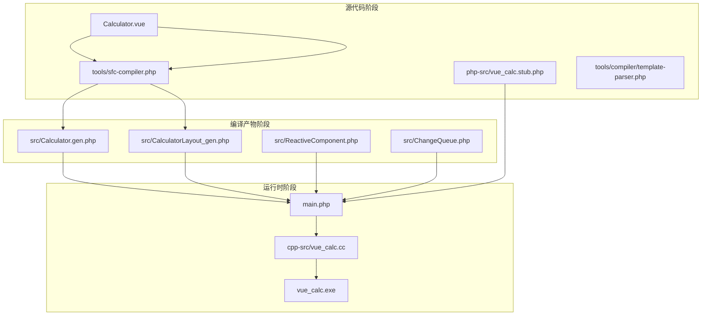
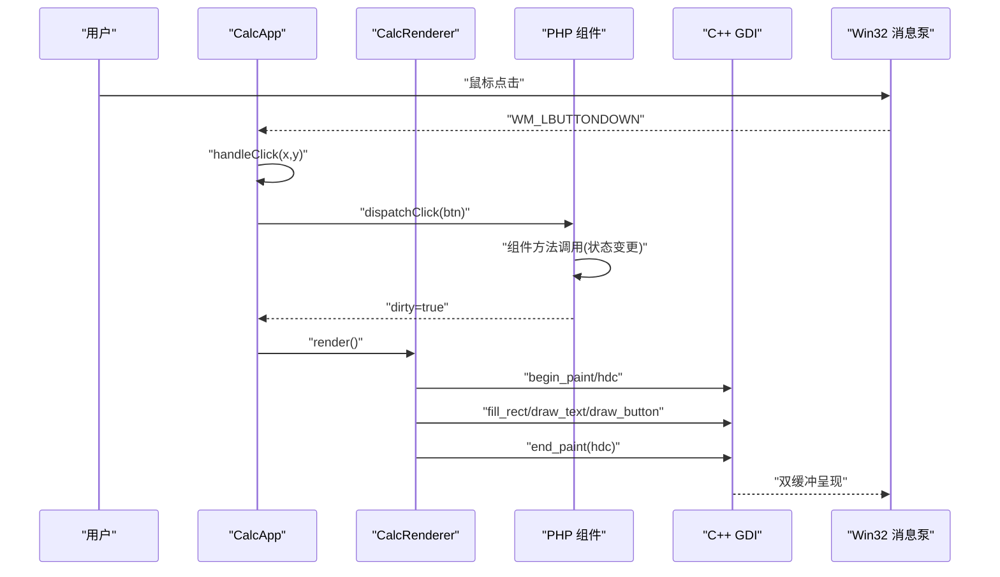
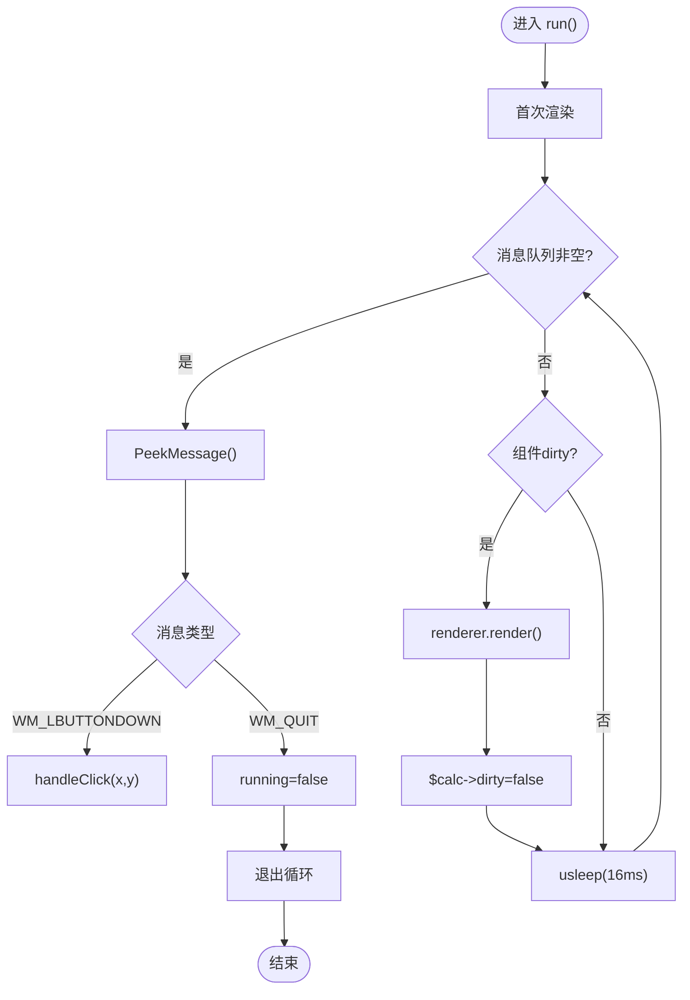
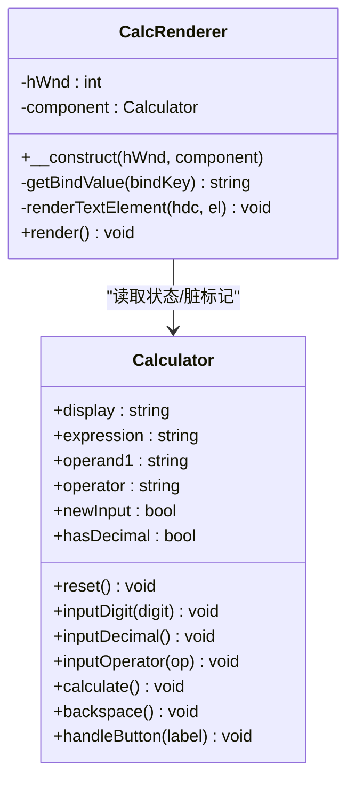
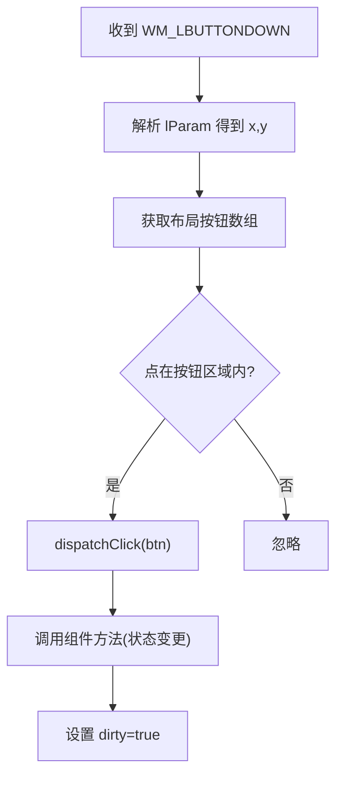
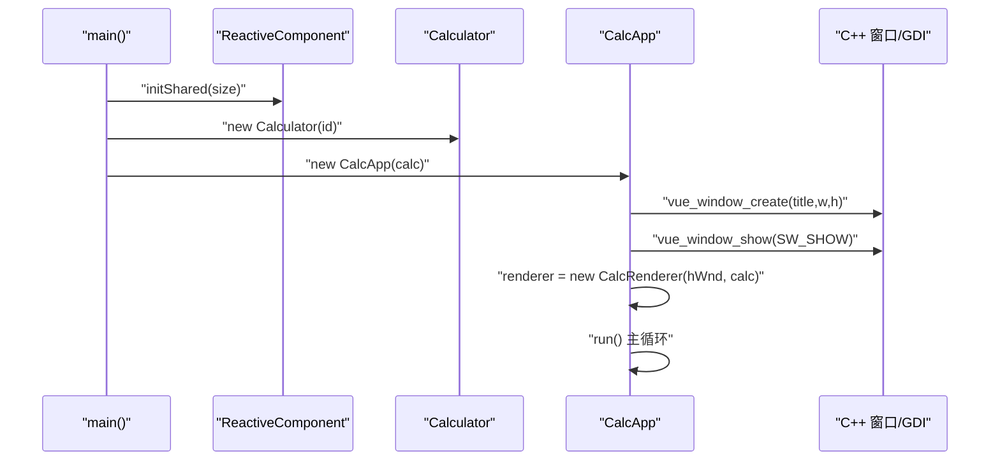
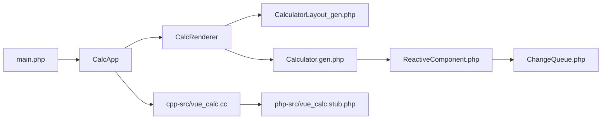

# 应用程序生命周期

<cite>
**本文引用的文件**
- [main.php](file://main.php)
- [Calculator.gen.php](file://src/Calculator.gen.php)
- [Calculator.vue](file://src/Calculator.vue)
- [CalculatorLayout_gen.php](file://src/CalculatorLayout_gen.php)
- [ReactiveComponent.php](file://src/ReactiveComponent.php)
- [ChangeQueue.php](file://src/ChangeQueue.php)
- [vue_calc.cc](file://cpp-src/vue_calc.cc)
- [vue_calc.stub.php](file://php-src/vue_calc.stub.php)
- [sfc-compiler.php](file://tools/sfc-compiler.php)
- [template-parser.php](file://tools/compiler/template-parser.php)
- [构建编译流程参考.md](file://构建编译流程参考.md)
- [VueCalc技术文档_v2.html](file://VueCalc技术文档_v2.html)
</cite>

## 目录
1. [简介](#简介)
2. [项目结构](#项目结构)
3. [核心组件](#核心组件)
4. [架构总览](#架构总览)
5. [详细组件分析](#详细组件分析)
6. [依赖关系分析](#依赖关系分析)
7. [性能考量](#性能考量)
8. [故障排查指南](#故障排查指南)
9. [结论](#结论)
10. [附录](#附录)

## 简介
本文件围绕“VueCalc”应用程序的生命周期进行系统化技术文档梳理，重点覆盖以下方面：
- CalcApp 主控制器的设计与实现：窗口初始化、事件循环、生命周期控制
- 事件处理机制：鼠标点击捕获、坐标转换、按钮命中测试
- 数据驱动渲染：脏标记机制、渲染调度、性能优化
- 启动流程：从 main 函数到窗口创建的完整过程
- 错误处理与异常恢复
- 关闭流程、资源清理与内存管理
- 调试与监控最佳实践

## 项目结构
该项目采用“SFC 编译器 + AOT 编译器”的混合架构，前端以 .vue 单文件组件描述 UI，经 SFC 编译器生成 .gen.php（包含组件类与布局数据），再由 AOT 编译器生成原生 Windows 可执行文件。C++ 层仅提供 Win32 窗口与 GDI 绘制原语，业务逻辑与响应式状态由 PHP 实现。

图表来源
- [构建编译流程参考.md:54-64](file://构建编译流程参考.md#L54-L64)
- [sfc-compiler.php:1-210](file://tools/sfc-compiler.php#L1-L210)
- [template-parser.php:1-680](file://tools/compiler/template-parser.php#L1-L680)
- [Calculator.gen.php:1-174](file://src/Calculator.gen.php#L1-L174)
- [CalculatorLayout_gen.php:1-296](file://src/CalculatorLayout_gen.php#L1-L296)
- [main.php:1-291](file://main.php#L1-L291)
- [vue_calc.cc:1-157](file://cpp-src/vue_calc.cc#L1-L157)

章节来源
- [构建编译流程参考.md:23-51](file://构建编译流程参考.md#L23-L51)
- [VueCalc技术文档_v2.html:151-194](file://VueCalc技术文档_v2.html#L151-L194)

## 核心组件
- CalcApp：主控制器，负责窗口初始化、消息循环、事件分发与渲染调度
- CalcRenderer：数据驱动渲染器，基于布局数据与组件状态驱动 C++ GDI 绘制
- Calculator：响应式组件，承载计算器业务逻辑与状态，配合脏标记驱动重绘
- ReactiveComponent：响应式基类，提供脏标记与共享变更队列能力
- ChangeQueue：环形缓冲变更队列，用于渲染循环消费组件状态变更
- C++ 层（vue_calc.cc）：封装 Win32 API 与 GDI 绘制原语，供 PHP 通过 stub 调用

章节来源
- [main.php:26-133](file://main.php#L26-L133)
- [main.php:139-259](file://main.php#L139-L259)
- [Calculator.gen.php:9-174](file://src/Calculator.gen.php#L9-L174)
- [ReactiveComponent.php:11-34](file://src/ReactiveComponent.php#L11-L34)
- [ChangeQueue.php:11-56](file://src/ChangeQueue.php#L11-L56)
- [vue_calc.cc:1-157](file://cpp-src/vue_calc.cc#L1-L157)

## 架构总览
应用采用“数据驱动渲染”范式：组件状态变更 → 脏标记置位 → 渲染器按需重绘 → C++ GDI 输出到屏幕。事件循环在 PHP 层维护，通过 C++ 提供的消息轮询接口与退出检测，实现与 Win32 消息泵的桥接。

图表来源
- [main.php:171-227](file://main.php#L171-L227)
- [main.php:229-258](file://main.php#L229-L258)
- [Calculator.gen.php:149-168](file://src/Calculator.gen.php#L149-L168)
- [vue_calc.cc:90-117](file://cpp-src/vue_calc.cc#L90-L117)

## 详细组件分析

### CalcApp：主控制器
- 窗口初始化：调用 C++ 封装的窗口创建与显示函数，创建渲染器实例
- 事件循环：持续轮询消息，处理鼠标点击与退出信号，驱动渲染
- 事件分发：命中测试按钮区域后，根据按钮配置路由到组件方法
- 渲染调度：仅在组件状态变更（dirty）后触发 CalcRenderer.render()

图表来源
- [main.php:171-227](file://main.php#L171-L227)
- [main.php:229-258](file://main.php#L229-L258)

章节来源
- [main.php:139-259](file://main.php#L139-L259)

### CalcRenderer：数据驱动渲染器
- 数据来源：通过布局函数获取元素与按钮数组，结合组件状态属性进行绘制
- 文本渲染：支持对齐、动态字号、容器宽度计算与右对齐偏移
- 按钮渲染：背景填充、边框绘制与文字居中
- 双缓冲绘制：Begin/End Paint 包裹绘制，减少闪烁

图表来源
- [main.php:26-133](file://main.php#L26-L133)
- [Calculator.gen.php:9-174](file://src/Calculator.gen.php#L9-L174)

章节来源
- [main.php:26-133](file://main.php#L26-L133)

### 事件处理机制：鼠标点击捕获与命中测试
- 消息轮询：通过 C++ 封装的 PeekMessage 获取消息，解析 lParam 得到点击坐标
- 坐标转换：Win32 坐标系与布局坐标一致，无需额外转换
- 命中测试：遍历按钮区域，判断点击点是否落入按钮矩形范围
- 方法分发：根据按钮 handler 与参数，调用组件对应方法（显式路由，兼容 AOT）

图表来源
- [main.php:188-241](file://main.php#L188-L241)
- [main.php:244-258](file://main.php#L244-L258)
- [CalculatorLayout_gen.php:59-295](file://src/CalculatorLayout_gen.php#L59-L295)

章节来源
- [main.php:188-258](file://main.php#L188-L258)

### 数据驱动渲染：脏标记与调度
- 脏标记：组件状态变更后置位 dirty，渲染器仅在 dirty 为真时重绘
- 渲染时机：事件循环空闲时检查 dirty，避免不必要的重绘
- 性能策略：固定帧率睡眠（约60FPS），减少 CPU 占用
- 文本自适应：根据文本长度动态调整字号，保证显示效果

章节来源
- [Calculator.gen.php:30-147](file://src/Calculator.gen.php#L30-L147)
- [main.php:213-224](file://main.php#L213-L224)
- [main.php:50-94](file://main.php#L50-L94)

### 启动流程：从 main 到窗口创建
- 初始化：设置时区、初始化响应式框架共享内存与变更队列
- 组件创建：实例化 Calculator（SFC 编译生成的 ReactiveComponent 子类）
- 应用启动：创建 CalcApp，初始化窗口并进入事件循环

图表来源
- [main.php:265-290](file://main.php#L265-L290)
- [main.php:151-169](file://main.php#L151-L169)
- [ReactiveComponent.php:30-33](file://src/ReactiveComponent.php#L30-L33)

章节来源
- [main.php:265-290](file://main.php#L265-L290)

### 关闭流程与资源清理
- 退出检测：通过 C++ 封装的退出请求标志与消息类型判断
- 清理顺序：退出循环后打印关闭信息，遵循“先停止事件循环，再释放资源”的原则
- C++ 资源：GDI 双缓冲绘制在 Begin/End Paint 中完成，End Paint 会释放临时位图与 DC

章节来源
- [main.php:200-227](file://main.php#L200-L227)
- [vue_calc.cc:21-33](file://cpp-src/vue_calc.cc#L21-L33)
- [vue_calc.cc:104-117](file://cpp-src/vue_calc.cc#L104-L117)

### 错误处理与异常恢复
- 事件处理异常：handleClick 内部 try/catch，记录错误信息与堆栈
- 渲染异常：渲染过程中异常被捕获并记录，避免中断事件循环
- 退出异常：WM_QUIT 与退出请求标志确保优雅退出

章节来源
- [main.php:192-198](file://main.php#L192-L198)
- [main.php:215-219](file://main.php#L215-L219)
- [vue_calc.cc:21-33](file://cpp-src/vue_calc.cc#L21-L33)

## 依赖关系分析
- 模块耦合
  - CalcApp 依赖 CalcRenderer 与 C++ 封装函数
  - CalcRenderer 依赖布局数据与组件状态
  - Calculator 继承 ReactiveComponent，使用脏标记与共享队列
- 外部依赖
  - C++ 层提供 Win32 API 与 GDI 绘制原语
  - SFC 编译器生成布局与组件类，AOT 编译器生成可执行文件

图表来源
- [main.php:1-291](file://main.php#L1-L291)
- [Calculator.gen.php:1-174](file://src/Calculator.gen.php#L1-L174)
- [CalculatorLayout_gen.php:1-296](file://src/CalculatorLayout_gen.php#L1-L296)
- [ReactiveComponent.php:1-35](file://src/ReactiveComponent.php#L1-L35)
- [ChangeQueue.php:1-57](file://src/ChangeQueue.php#L1-L57)
- [vue_calc.cc:1-157](file://cpp-src/vue_calc.cc#L1-L157)
- [vue_calc.stub.php:1-24](file://php-src/vue_calc.stub.php#L1-L24)

章节来源
- [构建编译流程参考.md:23-51](file://构建编译流程参考.md#L23-L51)

## 性能考量
- 渲染频率控制：事件循环中固定休眠约 16ms，目标 ~60 FPS，平衡流畅度与功耗
- 脏标记驱动：仅在状态变更时重绘，避免无效绘制
- 文本自适应：根据文本长度动态调整字号，减少溢出与重排
- 双缓冲绘制：Begin/End Paint 配合内存 DC 与位图，降低闪烁与撕裂
- 按钮命中测试：O(n) 遍历按钮区域，按钮数量有限，开销可接受

章节来源
- [main.php:223-224](file://main.php#L223-L224)
- [main.php:50-94](file://main.php#L50-L94)
- [vue_calc.cc:90-117](file://cpp-src/vue_calc.cc#L90-L117)

## 故障排查指南
- 构建阶段
  - SFC 编译器：确认 .vue 包含 template/script/style 三块，CSS 颜色正则分隔符使用 ~，避免与 # 冲突
  - AOT 编译器：确保所有代码在函数内，const 不支持复杂数组，使用 function 返回数组
- 运行阶段
  - 窗口创建失败：检查 C++ 注册类名与窗口尺寸常量
  - 事件无响应：确认消息轮询与 WM_LBUTTONDOWN 分支逻辑
  - 渲染不刷新：检查组件状态变更是否置位 dirty，以及事件循环中的脏标记检查
- 调试建议
  - 启用控制台模式（AOT 配置项）以便输出日志
  - 在关键路径添加日志输出，定位异常发生位置
  - 使用最小化复现：仅保留必要按钮与文本，逐步增加复杂度

章节来源
- [构建编译流程参考.md:208-239](file://构建编译流程参考.md#L208-L239)
- [构建编译流程参考.md:241-269](file://构建编译流程参考.md#L241-L269)
- [main.php:160-163](file://main.php#L160-L163)
- [main.php:192-198](file://main.php#L192-L198)
- [main.php:215-219](file://main.php#L215-L219)

## 结论
该应用通过“SFC 编译器 + AOT 编译器 + C++ GDI 渲染”的组合，实现了以数据驱动为核心的桌面计算器。CalcApp 主控制器承担窗口初始化、事件循环与渲染调度的核心职责；CalcRenderer 将组件状态与布局数据转化为 GDI 绘制指令；ReactiveComponent 与 ChangeQueue 提供 AOT 兼容的响应式基础设施。整体设计清晰、模块边界明确，具备良好的可维护性与扩展性。

## 附录
- SFC 编译器关键流程：模板解析 → AST → 布局数组 → 代码生成
- 模板标签参考：app/rect/text/grid/btn，支持 :bind 与 @click
- AOT 兼容性要点：禁止魔术方法、反射、eval；const 复杂数组改为 function 返回；文件名仅允许字母数字下划线

章节来源
- [sfc-compiler.php:1-210](file://tools/sfc-compiler.php#L1-L210)
- [template-parser.php:1-680](file://tools/compiler/template-parser.php#L1-L680)
- [构建编译流程参考.md:108-114](file://构建编译流程参考.md#L108-L114)
- [构建编译流程参考.md:241-269](file://构建编译流程参考.md#L241-L269)