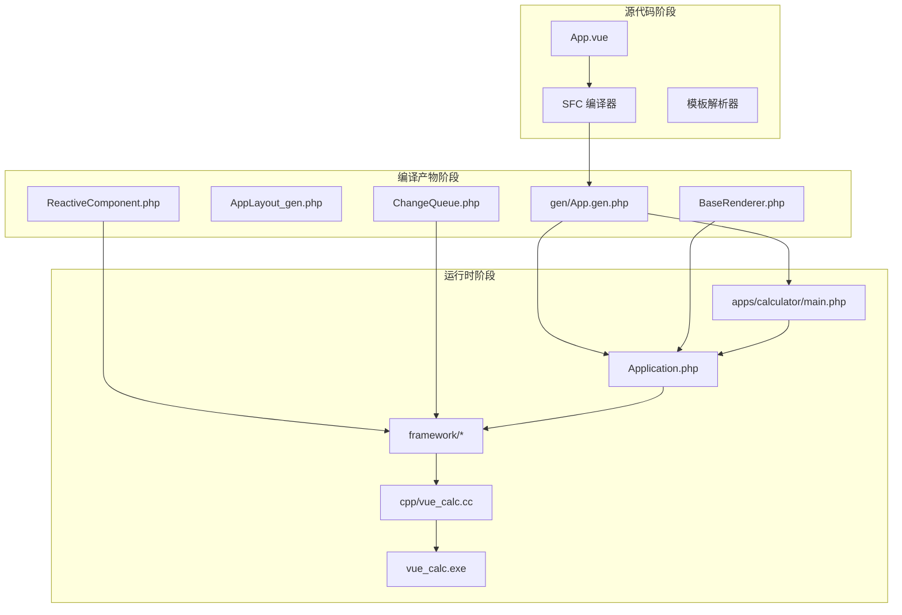
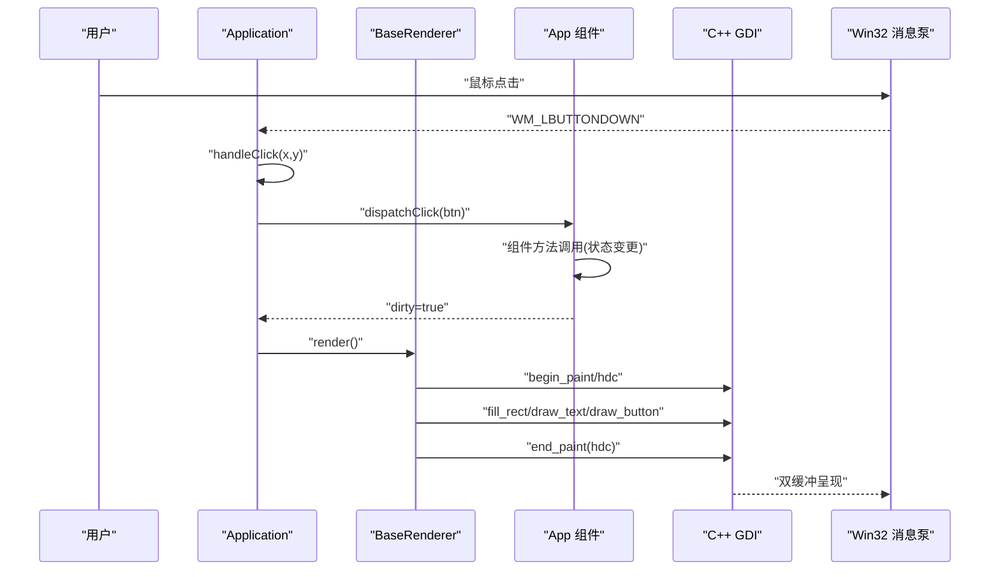
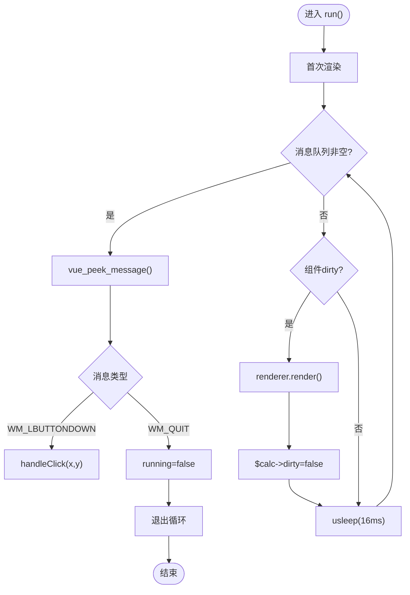
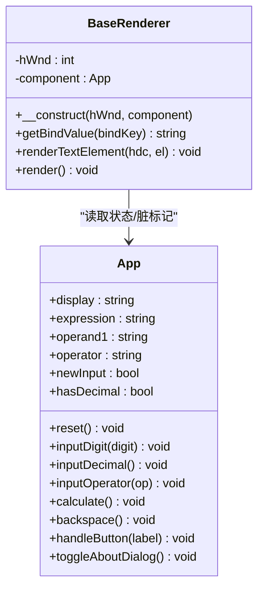
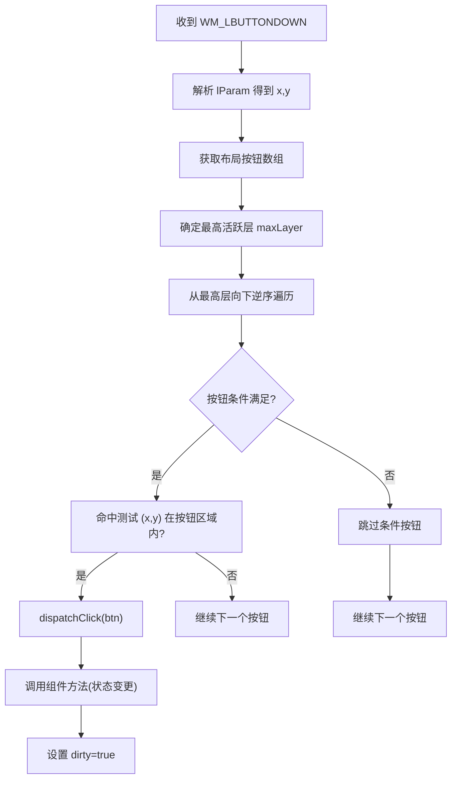
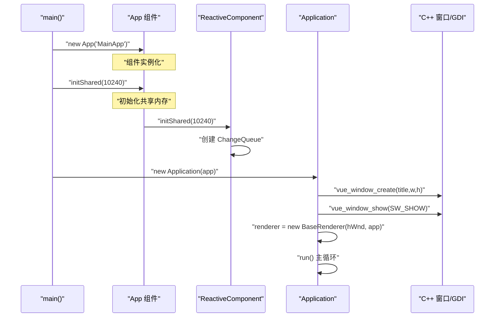
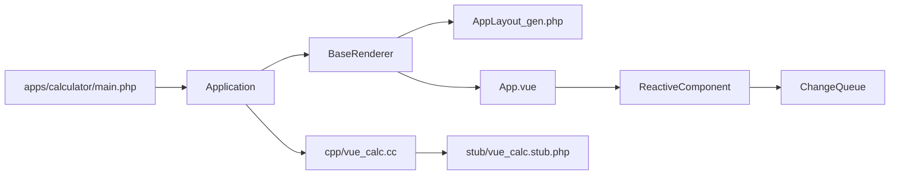

# 应用程序生命周期

<cite>
**本文引用的文件**
- [main.php](file://apps/calculator/main.php)
- [Application.php](file://apps/calculator/Application.php)
- [ReactiveComponent.php](file://framework/ReactiveComponent.php)
- [ChangeQueue.php](file://framework/ChangeQueue.php)
- [BaseRenderer.php](file://framework/BaseRenderer.php)
- [App.vue](file://apps/calculator/App.vue)
- [project.yml](file://apps/calculator/project.yml)
</cite>

## 更新摘要
**所做更改**
- 更新了应用程序启动流程，反映初始化顺序的调整（先创建组件，再初始化共享内存）
- 完善了响应式框架集成说明，强调组件与共享内存的正确初始化顺序
- 更新了启动序列图，准确反映新的初始化流程

## 目录
1. [简介](#简介)
2. [项目结构](#项目结构)
3. [核心组件](#核心组件)
4. [架构总览](#架构总览)
5. [详细组件分析](#详细组件分析)
6. [依赖关系分析](#依赖关系分析)
7. [性能考量](#性能考量)
8. [故障排查指南](#故障排查指南)
9. [结论](#结论)
10. [附录](#附录)

## 简介
本文件围绕"VueCalc"应用程序的生命周期进行系统化技术文档梳理，重点覆盖以下方面：
- Application 通用控制器的设计与实现：窗口初始化、事件循环、生命周期控制
- 事件处理机制：鼠标点击捕获、坐标转换、分层命中测试
- 数据驱动渲染：脏标记机制、渲染调度、性能优化
- 启动流程：从 main 函数到窗口创建的完整过程，包括正确的初始化顺序
- 错误处理与异常恢复
- 关闭流程、资源清理与内存管理
- 调试与监控最佳实践

## 项目结构
该项目采用"SFC 编译器 + AOT 编译器"的混合架构，前端以 .vue 单文件组件描述 UI，经 SFC 编译器生成 .gen.php（包含组件类与布局数据），再由 AOT 编译器生成原生 Windows 可执行文件。C++ 层仅提供 Win32 窗口与 GDI 绘制原语，业务逻辑与响应式状态由 PHP 实现。

**图表来源**
- [project.yml:12-23](file://apps/calculator/project.yml#L12-L23)
- [main.php:30-37](file://apps/calculator/main.php#L30-L37)
- [Application.php:22-40](file://apps/calculator/Application.php#L22-L40)

**章节来源**
- [project.yml:1-31](file://apps/calculator/project.yml#L1-L31)
- [main.php:1-46](file://apps/calculator/main.php#L1-L46)

## 核心组件
- Application：通用 SFC 应用控制器，负责窗口初始化、事件循环、点击分发、脏标记驱动的渲染调度
- BaseRenderer：数据驱动渲染器，基于布局数据与组件状态驱动 C++ GDI 绘制
- App：响应式组件，承载计算器业务逻辑与状态，配合脏标记驱动重绘
- ReactiveComponent：响应式基类，提供脏标记与共享变更队列能力
- ChangeQueue：环形缓冲变更队列，用于渲染循环消费组件状态变更
- C++ 层（vue_calc.cc）：封装 Win32 API 与 GDI 绘制原语，供 PHP 通过 stub 调用

**章节来源**
- [Application.php:10-139](file://apps/calculator/Application.php#L10-L139)
- [BaseRenderer.php:9-151](file://framework/BaseRenderer.php#L9-L151)
- [ReactiveComponent.php:11-65](file://framework/ReactiveComponent.php#L11-L65)
- [ChangeQueue.php:11-57](file://framework/ChangeQueue.php#L11-L57)

## 架构总览
应用采用"数据驱动渲染"范式：组件状态变更 → 脏标记置位 → 渲染器按需重绘 → C++ GDI 输出到屏幕。事件循环在 PHP 层维护，通过 C++ 提供的消息轮询接口与退出检测，实现与 Win32 消息泵的桥接。

**图表来源**
- [Application.php:100-137](file://apps/calculator/Application.php#L100-L137)
- [Application.php:84-92](file://apps/calculator/Application.php#L84-L92)
- [BaseRenderer.php:88-149](file://framework/BaseRenderer.php#L88-L149)

## 详细组件分析

### Application：通用控制器
- 窗口初始化：调用 C++ 封装的窗口创建与显示函数，创建渲染器实例
- 事件循环：持续轮询消息，处理鼠标点击与退出信号，驱动渲染
- 事件分发：分层命中测试按钮区域后，根据按钮配置路由到组件方法
- 渲染调度：仅在组件状态变更（dirty）后触发 BaseRenderer.render()

**图表来源**
- [Application.php:43-98](file://apps/calculator/Application.php#L43-L98)
- [Application.php:49-95](file://apps/calculator/Application.php#L49-L95)

**章节来源**
- [Application.php:42-98](file://apps/calculator/Application.php#L42-L98)

### BaseRenderer：数据驱动渲染器
- 数据来源：通过布局函数获取元素与按钮数组，结合组件状态属性进行绘制
- 文本渲染：支持对齐、动态字号、容器宽度计算与右对齐偏移
- 按钮渲染：背景填充、边框绘制与文字居中
- 双缓冲绘制：Begin/End Paint 包裹绘制，减少闪烁

**图表来源**
- [BaseRenderer.php:9-151](file://framework/BaseRenderer.php#L9-L151)
- [App.vue:27-193](file://apps/calculator/App.vue#L27-L193)

**章节来源**
- [BaseRenderer.php:88-149](file://framework/BaseRenderer.php#L88-L149)

### 事件处理机制：鼠标点击捕获与分层命中测试
- 消息轮询：通过 C++ 封装的 vue_peek_message 获取消息，解析 lParam 得到点击坐标
- 坐标转换：Win32 坐标系与布局坐标一致，无需额外转换
- 分层命中测试：确定最高活跃层后，从最高层向下逆序命中测试，支持条件按钮
- 方法分发：根据按钮 handler 与参数，调用组件对应方法（委托给生成的 dispatchClick 方法）

**图表来源**
- [Application.php:100-137](file://apps/calculator/Application.php#L100-L137)
- [Application.php:134-137](file://apps/calculator/Application.php#L134-L137)
- [App.vue:167-186](file://apps/calculator/App.vue#L167-L186)

**章节来源**
- [Application.php:100-137](file://apps/calculator/Application.php#L100-L137)

### 数据驱动渲染：脏标记与调度
- 脏标记：组件状态变更后置位 dirty，渲染器仅在 dirty 为真时重绘
- 渲染时机：事件循环空闲时检查 dirty，避免不必要的重绘
- 性能策略：固定帧率睡眠（约60FPS），减少 CPU 占用
- 文本自适应：根据文本长度动态调整字号，保证显示效果

**章节来源**
- [App.vue:38-179](file://apps/calculator/App.vue#L38-L179)
- [Application.php:84-92](file://apps/calculator/Application.php#L84-L92)
- [BaseRenderer.php:88-149](file://framework/BaseRenderer.php#L88-L149)

### 启动流程：从 main 到窗口创建（更新）
**更新** 反映了正确的初始化顺序调整

应用启动流程现已优化为：先创建应用组件，再初始化共享内存，最后创建 Application 控制器并启动事件循环。这种顺序确保组件在初始化共享内存之前就已存在，从而能够正确访问响应式框架功能。

**图表来源**
- [main.php:30-37](file://apps/calculator/main.php#L30-L37)
- [ReactiveComponent.php:36-39](file://framework/ReactiveComponent.php#L36-L39)
- [Application.php:22-40](file://apps/calculator/Application.php#L22-L40)

**章节来源**
- [main.php:30-37](file://apps/calculator/main.php#L30-L37)

### 关闭流程与资源清理
- 退出检测：通过 C++ 封装的退出请求标志与消息类型判断
- 清理顺序：退出循环后打印关闭信息，遵循"先停止事件循环，再释放资源"的原则
- C++ 资源：GDI 双缓冲绘制在 Begin/End Paint 中完成，End Paint 会释放临时位图与 DC

**章节来源**
- [Application.php:77-98](file://apps/calculator/Application.php#L77-L98)
- [BaseRenderer.php:148](file://framework/BaseRenderer.php#L148)

### 错误处理与异常恢复
- 事件处理异常：handleClick 内部 try/catch，记录错误信息与堆栈
- 渲染异常：渲染过程中异常被捕获并记录，避免中断事件循环
- 退出异常：WM_QUIT 与退出请求标志确保优雅退出

**章节来源**
- [Application.php:63-69](file://apps/calculator/Application.php#L63-L69)
- [Application.php:86-91](file://apps/calculator/Application.php#L86-L91)

## 依赖关系分析
- 模块耦合
  - Application 依赖 BaseRenderer 与 C++ 封装函数
  - BaseRenderer 依赖布局数据与组件状态
  - App 继承 ReactiveComponent，使用脏标记与共享队列
- 外部依赖
  - C++ 层提供 Win32 API 与 GDI 绘制原语
  - SFC 编译器生成布局与组件类，AOT 编译器生成可执行文件

**图表来源**
- [main.php:1-46](file://apps/calculator/main.php#L1-L46)
- [Application.php:1-139](file://apps/calculator/Application.php#L1-L139)
- [BaseRenderer.php:1-151](file://framework/BaseRenderer.php#L1-L151)
- [ReactiveComponent.php:1-65](file://framework/ReactiveComponent.php#L1-L65)
- [ChangeQueue.php:1-57](file://framework/ChangeQueue.php#L1-L57)

**章节来源**
- [project.yml:12-23](file://apps/calculator/project.yml#L12-L23)

## 性能考量
- 渲染频率控制：事件循环中固定休眠约 16ms，目标 ~60 FPS，平衡流畅度与功耗
- 脏标记驱动：仅在状态变更时重绘，避免无效绘制
- 文本自适应：根据文本长度动态调整字号，减少溢出与重排
- 双缓冲绘制：Begin/End Paint 配合内存 DC 与位图，降低闪烁与撕裂
- 分层命中测试：从最高层向下逆序遍历，支持条件按钮的高效命中

**章节来源**
- [Application.php:94](file://apps/calculator/Application.php#L94)
- [BaseRenderer.php:88-149](file://framework/BaseRenderer.php#L88-L149)

## 故障排查指南
- 构建阶段
  - SFC 编译器：确认 .vue 包含 template/script/style 三块，CSS 颜色正则分隔符使用 ~，避免与 # 冲突
  - AOT 编译器：确保所有代码在函数内，const 不支持复杂数组，使用 function 返回数组
- 运行阶段
  - 窗口创建失败：检查 C++ 注册类名与窗口尺寸常量
  - 事件无响应：确认消息轮询与 WM_LBUTTONDOWN 分支逻辑
  - 渲染不刷新：检查组件状态变更是否置位 dirty，以及事件循环中的脏标记检查
  - 初始化失败：确认组件在调用 initShared 之前已正确实例化
- 调试建议
  - 启用控制台模式（AOT 配置项）以便输出日志
  - 在关键路径添加日志输出，定位异常发生位置
  - 使用最小化复现：仅保留必要按钮与文本，逐步增加复杂度

**章节来源**
- [project.yml:1-31](file://apps/calculator/project.yml#L1-L31)
- [Application.php:63-69](file://apps/calculator/Application.php#L63-L69)
- [Application.php:86-91](file://apps/calculator/Application.php#L86-L91)

## 结论
该应用通过"SFC 编译器 + AOT 编译器 + C++ GDI 渲染"的组合，实现了以数据驱动为核心的桌面计算器。Application 通用控制器承担窗口初始化、事件循环与渲染调度的核心职责；BaseRenderer 将组件状态与布局数据转化为 GDI 绘制指令；ReactiveComponent 与 ChangeQueue 提供 AOT 兼容的响应式基础设施。最新的初始化顺序优化确保了组件与响应式框架的正确集成，整体设计清晰、模块边界明确，具备良好的可维护性与扩展性。

## 附录
- SFC 编译器关键流程：模板解析 → AST → 布局数组 → 代码生成
- 模板标签参考：app/rect/text/grid/btn，支持 :bind 与 @click
- AOT 兼容性要点：禁止魔术方法、反射、eval；const 复杂数组改为 function 返回；文件名仅允许字母数字下划线
- 初始化顺序最佳实践：先创建组件实例，再初始化共享内存，最后创建 Application 控制器

**章节来源**
- [App.vue:1-203](file://apps/calculator/App.vue#L1-L203)
- [project.yml:25-31](file://apps/calculator/project.yml#L25-L31)
- [main.php:30-37](file://apps/calculator/main.php#L30-L37)