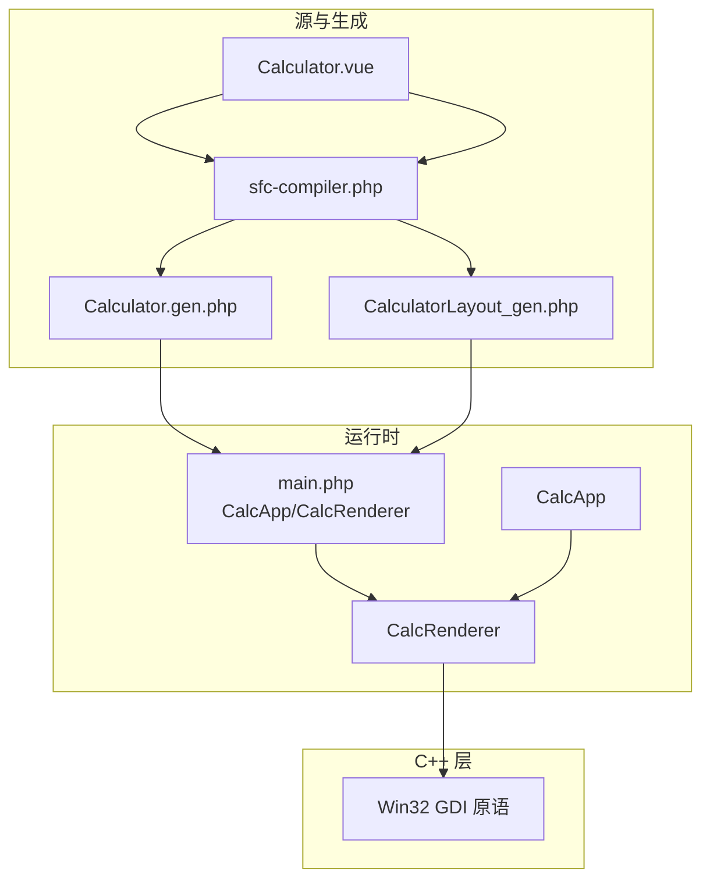
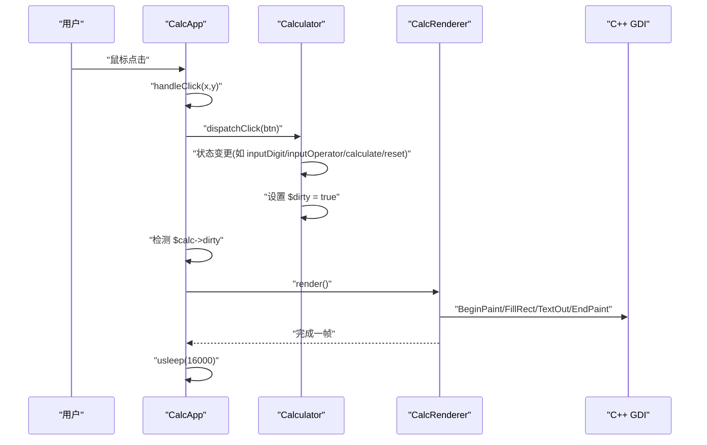
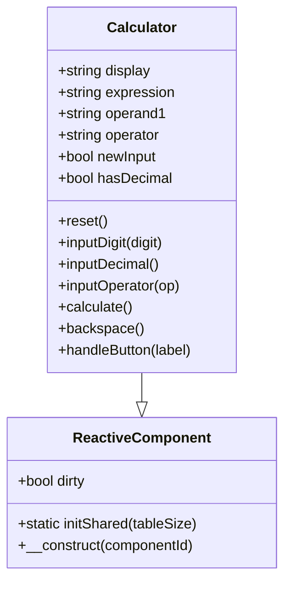
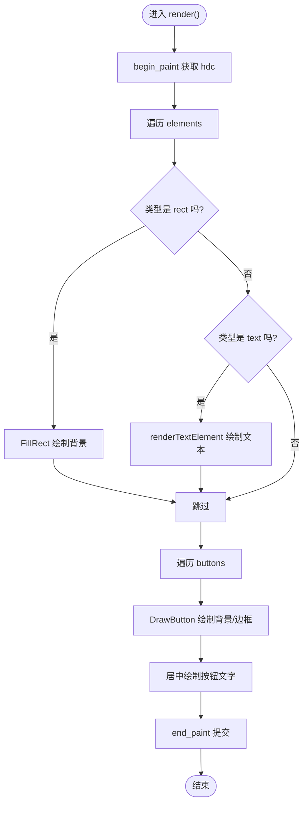
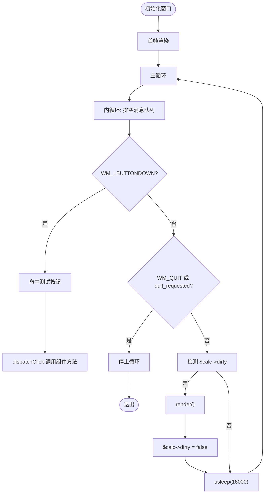
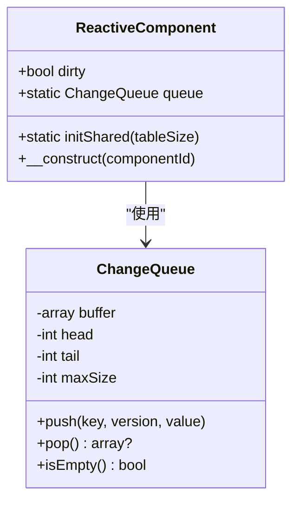
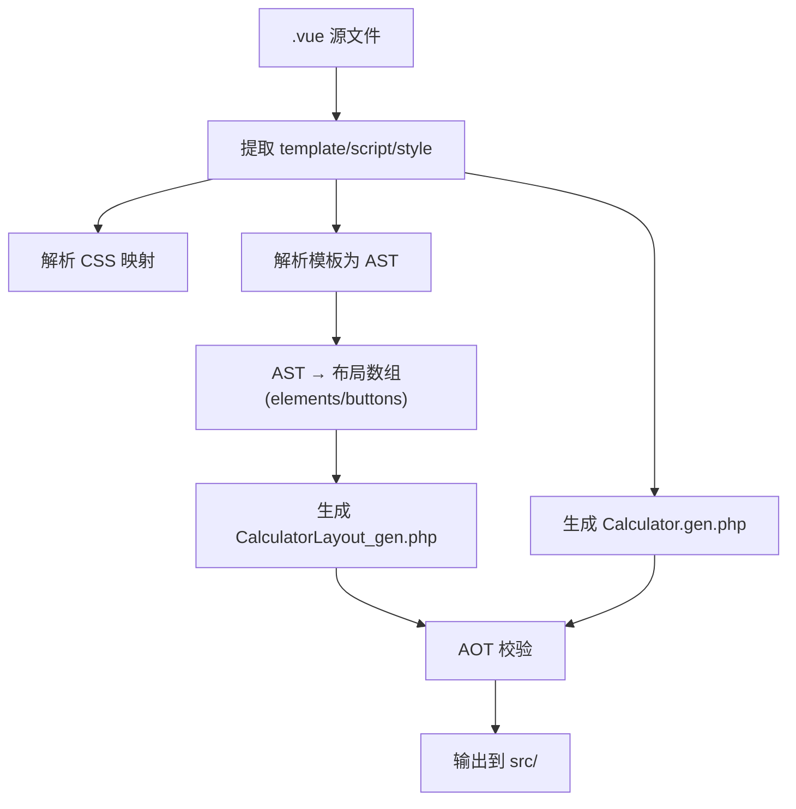
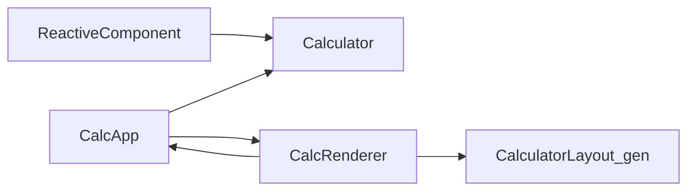

# 渲染调度

<cite>
**本文引用的文件**
- [main.php](file://main.php)
- [Calculator.vue](file://src/Calculator.vue)
- [Calculator.gen.php](file://src/Calculator.gen.php)
- [CalculatorLayout_gen.php](file://src/CalculatorLayout_gen.php)
- [ReactiveComponent.php](file://src/ReactiveComponent.php)
- [ChangeQueue.php](file://src/ChangeQueue.php)
- [sfc-compiler.php](file://tools/sfc-compiler.php)
- [sfc-compiler-test.php](file://tests/sfc-compiler-test.php)
- [verify-layout.php](file://tests/verify-layout.php)
</cite>

## 目录
1. [简介](#简介)
2. [项目结构](#项目结构)
3. [核心组件](#核心组件)
4. [架构总览](#架构总览)
5. [详细组件分析](#详细组件分析)
6. [依赖关系分析](#依赖关系分析)
7. [性能考量](#性能考量)
8. [故障排查指南](#故障排查指南)
9. [结论](#结论)
10. [附录](#附录)

## 简介
本文件面向“渲染调度系统”的深入文档，围绕数据驱动渲染的触发机制、脏标记与渲染条件判断、渲染时机控制（状态变更检测与渲染调用时机）、性能优化策略（usleep 约 60FPS 控制与渲染频率限制）、异常处理（try-catch 隔离渲染错误）、以及性能监控与调试技巧（渲染次数统计与瓶颈识别）进行系统化阐述，并给出最佳实践与常见问题解决方案。该系统采用“模板 → 编译器 → 生成代码 → AOT 编译 → 运行时”的流水线，前端逻辑由 PHP 实现，渲染由 C++ GDI 提供底层原语，形成“PHP 业务 + C++ 绘制”的混合架构。

## 项目结构
该项目采用分层组织方式：
- 源模板与生成代码：.vue 模板经编译器生成布局数组与组件类，分别输出为布局文件与组件类文件。
- 运行时与渲染器：主程序负责窗口初始化、事件循环、消息泵、渲染调度与帧率控制；渲染器根据布局数据与组件状态驱动 C++ 绘制。
- 工具链与测试：编译器工具、单元测试与布局验证脚本保障生成代码质量与一致性。

图表来源
- [main.php:171-227](file://main.php#L171-L227)
- [Calculator.gen.php:9-174](file://src/Calculator.gen.php#L9-L174)
- [CalculatorLayout_gen.php:10-296](file://src/CalculatorLayout_gen.php#L10-L296)
- [sfc-compiler.php:133-181](file://tools/sfc-compiler.php#L133-L181)

章节来源
- [main.php:1-291](file://main.php#L1-L291)
- [Calculator.gen.php:1-174](file://src/Calculator.gen.php#L1-L174)
- [CalculatorLayout_gen.php:1-296](file://src/CalculatorLayout_gen.php#L1-L296)
- [sfc-compiler.php:1-210](file://tools/sfc-compiler.php#L1-L210)

## 核心组件
- ReactiveComponent：响应式组件基类，提供全局变更队列、组件标识与脏标记字段，用于标记组件状态变更并驱动渲染。
- ChangeQueue：环形缓冲的变更通知队列，承载属性变更事件，供渲染循环消费。
- CalcRenderer：数据驱动渲染器，读取布局数据与组件状态，调用 C++ GDI 原语进行绘制。
- CalcApp：主应用控制器，负责窗口初始化、消息泵、事件分发、渲染调度与帧率控制。
- 组件类 Calculator：继承自 ReactiveComponent，封装计算器业务逻辑，所有状态变更后设置 $this->dirty=true。

章节来源
- [ReactiveComponent.php:11-35](file://src/ReactiveComponent.php#L11-L35)
- [ChangeQueue.php:11-57](file://src/ChangeQueue.php#L11-L57)
- [main.php:26-133](file://main.php#L26-L133)
- [main.php:139-259](file://main.php#L139-L259)
- [Calculator.gen.php:9-174](file://src/Calculator.gen.php#L9-L174)

## 架构总览
渲染调度系统遵循“事件驱动 + 脏标记驱动”的双层控制：
- 事件驱动：用户点击 → CalcApp.handleClick() → 组件方法（如 handleButton/reset/backspace/calculate）→ 修改组件状态 → 设置 $dirty=true。
- 脏标记驱动：渲染循环检测 $calc->dirty，若为真则执行 CalcRenderer.render()，随后清除 $dirty=false。
- 帧率控制：渲染循环在每次迭代末尾 usleep(16000) 实现约 60FPS 的帧间隔。

图表来源
- [main.php:171-227](file://main.php#L171-L227)
- [main.php:229-258](file://main.php#L229-L258)
- [main.php:99-132](file://main.php#L99-L132)

## 详细组件分析

### 组件类 Calculator（数据驱动渲染主体）
- 职责：封装计算器业务逻辑，所有状态变更后调用 $this->dirty = true，触发渲染。
- 关键行为：
  - 输入数字/小数点：更新 display/newInput/hasDecimal，并设置 $dirty=true。
  - 输入运算符：若已有运算符且非新输入，先计算；然后设置 operand1/operator/expression/newInput，并设置 $dirty=true。
  - 计算：执行四则运算，处理除零与结果格式化，更新 display/expression/operand1/operator/newInput/hasDecimal，并设置 $dirty=true。
  - 退格：删除最后一位或取消小数点，更新 display/newInput/hasDecimal，并设置 $dirty=true。
  - 重置：清空所有状态并设置 $dirty=true。
  - 按钮分发：根据标签路由到具体方法，统一设置 $dirty=true。

图表来源
- [Calculator.gen.php:9-174](file://src/Calculator.gen.php#L9-L174)
- [ReactiveComponent.php:11-35](file://src/ReactiveComponent.php#L11-L35)

章节来源
- [Calculator.gen.php:29-168](file://src/Calculator.gen.php#L29-L168)
- [Calculator.vue:64-202](file://src/Calculator.vue#L64-L202)

### 渲染器 CalcRenderer（数据驱动绘制）
- 职责：读取布局数据与组件状态，调用 C++ GDI 原语绘制背景、文本与按钮。
- 关键流程：
  - begin_paint 获取设备上下文，遍历 elements（rect/text）绘制背景与表达式文本。
  - 遍历 buttons 绘制按钮背景、边框与居中文字。
  - end_paint 完成绘制并提交到屏幕。
- 文本对齐与动态字号：根据容器宽度与字符长度动态计算右对齐位置与字号，保证显示效果。

图表来源
- [main.php:99-132](file://main.php#L99-L132)
- [main.php:49-94](file://main.php#L49-L94)

章节来源
- [main.php:26-133](file://main.php#L26-L133)

### 主应用控制器 CalcApp（消息泵与渲染调度）
- 职责：窗口初始化、消息泵、事件分发、渲染调度与帧率控制。
- 关键流程：
  - 初始化窗口并创建渲染器，首帧立即渲染。
  - 消息泵：持续 peek 消息，解析鼠标坐标，命中测试按钮，分发到组件方法。
  - 渲染调度：检测 $calc->dirty，若为真则调用 render() 并清除 $dirty=false。
  - 帧率控制：每次迭代末尾 usleep(16000) 实现约 60FPS。
  - 异常处理：handleClick 与 render 周围包裹 try-catch，捕获 Throwable 并输出错误信息。

图表来源
- [main.php:171-227](file://main.php#L171-L227)
- [main.php:229-258](file://main.php#L229-L258)

章节来源
- [main.php:139-259](file://main.php#L139-L259)

### 响应式基类与变更队列
- ReactiveComponent：提供 $dirty 脏标记与全局变更队列，子类在状态变更后手动设置 $dirty=true。
- ChangeQueue：环形缓冲实现的变更队列，支持 push/pop/isEmpty，用于承载属性变更事件。

图表来源
- [ReactiveComponent.php:11-35](file://src/ReactiveComponent.php#L11-L35)
- [ChangeQueue.php:11-57](file://src/ChangeQueue.php#L11-L57)

章节来源
- [ReactiveComponent.php:11-35](file://src/ReactiveComponent.php#L11-L35)
- [ChangeQueue.php:11-57](file://src/ChangeQueue.php#L11-L57)

### 编译器与生成代码（SFC 流水线）
- 编译器：从 .vue 提取 template/script/style，解析样式映射，解析模板为 AST，降级为布局数组，生成布局文件与组件类文件，并进行 AOT 校验。
- 生成代码：CalculatorLayout_gen.php 输出 getLayout() 与常量 WINDOW_WIDTH/WINDOW_HEIGHT；Calculator.gen.php 输出组件类，继承 ReactiveComponent 并包含业务方法。

图表来源
- [sfc-compiler.php:47-181](file://tools/sfc-compiler.php#L47-L181)
- [CalculatorLayout_gen.php:10-296](file://src/CalculatorLayout_gen.php#L10-L296)
- [Calculator.gen.php:1-174](file://src/Calculator.gen.php#L1-L174)

章节来源
- [sfc-compiler.php:1-210](file://tools/sfc-compiler.php#L1-L210)
- [CalculatorLayout_gen.php:10-296](file://src/CalculatorLayout_gen.php#L10-L296)
- [Calculator.gen.php:1-174](file://src/Calculator.gen.php#L1-L174)

## 依赖关系分析
- 组件类 Calculator 继承自 ReactiveComponent，使用 $dirty 标记驱动渲染。
- CalcApp 持有 Calculator 与 CalcRenderer，负责事件分发与渲染调度。
- CalcRenderer 依赖布局数据（CalculatorLayout_gen.php）与组件状态，调用 C++ GDI 原语。
- 编译器工具链负责将 .vue 转换为布局与组件类，并进行 AOT 校验。

图表来源
- [Calculator.gen.php:9-174](file://src/Calculator.gen.php#L9-L174)
- [ReactiveComponent.php:11-35](file://src/ReactiveComponent.php#L11-L35)
- [main.php:139-259](file://main.php#L139-L259)
- [CalculatorLayout_gen.php:10-296](file://src/CalculatorLayout_gen.php#L10-L296)

章节来源
- [main.php:139-259](file://main.php#L139-L259)
- [Calculator.gen.php:9-174](file://src/Calculator.gen.php#L9-L174)
- [CalculatorLayout_gen.php:10-296](file://src/CalculatorLayout_gen.php#L10-L296)

## 性能考量
- 帧率控制：渲染循环在每次迭代末尾 usleep(16000) 实现约 60FPS（≈16.67ms/帧）。文档中指出 GDI 渲染开销（约 500µs）远小于帧间等待（16ms），占总帧预算约 3%。因此即使渲染元素数量大幅增加，仍可在 60FPS 目标内完成。
- 脏标记驱动渲染：仅在组件状态变更后重绘，空闲时 CPU 几乎为零，避免不必要的绘制。
- 双缓冲 GDI：begin_paint 创建内存 DC，绘制完成后一次性 BitBlt 到屏幕，避免闪烁。
- 调用开销：每帧约 42 次 PHP↔C++ 调用，类型转换层开销占比较高（约 60-70%），实际 GDI 调用仅 30-40%。未来若渲染成为瓶颈，可考虑将多次 GDI 调用合并为单次批量调用，减少往返次数。

章节来源
- [main.php:213-223](file://main.php#L213-L223)
- [VueCalc技术规划文档_v3.html:2208-2219](file://VueCalc技术规划文档_v3.html#L2208-L2219)

## 故障排查指南
- 异常处理：handleClick 与 render 周围包裹 try-catch，捕获 Throwable 并输出错误信息与堆栈，便于定位问题。
- 常见错误模式识别：
  - Cannot redeclare class：AOT 已编译所有文件，不再需要 require_once。
  - Expression must be a global constant：属性默认值使用了魔术常量。
  - Cannot assign X to property Y of type Z：PHP 8 类型化属性 + 反射赋值冲突。
  - Cannot append element to an null：__get 在 AOT 中未生效，属性读取返回 null。
  - Call to undefined function any()：any() 不是 PHP 函数。
- 调试建议：
  - 开启 no-console: false，确保 GUI 应用闪退时能看到错误信息。
  - 在 handleClick 与 render 周围使用 try-catch 全覆盖，打印到控制台。
  - 编译-运行-报错-修复循环，每次改动后编译（约 10 秒），运行测试，从错误信息反推问题。

章节来源
- [main.php:192-197](file://main.php#L192-L197)
- [main.php:215-219](file://main.php#L215-L219)
- [开发经验与教训.md:293-307](file://开发经验与教训.md#L293-L307)

## 结论
该渲染调度系统通过“事件驱动 + 脏标记驱动 + 帧率控制”的组合，实现了高效、稳定的桌面计算器渲染。脏标记确保只在必要时重绘，usleep(16000) 将帧率稳定在约 60FPS，配合 try-catch 隔离渲染错误，使系统具备良好的鲁棒性与可维护性。当前 GDI 渲染开销远小于帧间等待，性能富余充足，未来可按需引入增量渲染与批量 GDI 调用等优化手段。

## 附录
- 渲染性能监控与调试技巧
  - 渲染次数统计：可在 render() 前后记录时间戳与计数器，统计每秒渲染帧数（FPS）。
  - 性能瓶颈识别：对比 GDI 渲染耗时与 usleep(16000) 的占用比例，确认瓶颈是否在渲染或帧间等待。
  - 日志与追踪：在 handleClick 与 render 中输出关键路径日志，结合异常捕获定位问题。
- 最佳实践
  - 使用脏标记驱动渲染，避免每帧全量重绘。
  - 保持渲染逻辑简洁，尽量减少 C++ 调用次数。
  - 在事件处理中尽早设置 $dirty=true，确保渲染及时响应。
  - 使用 try-catch 隔离渲染错误，避免崩溃影响主循环。
  - 严格遵循 AOT 约束，避免使用魔术方法与 PHP 8.0 特性（如 str_contains）。