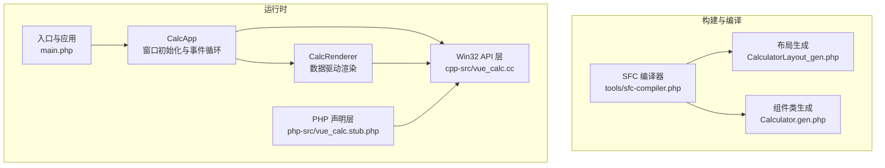
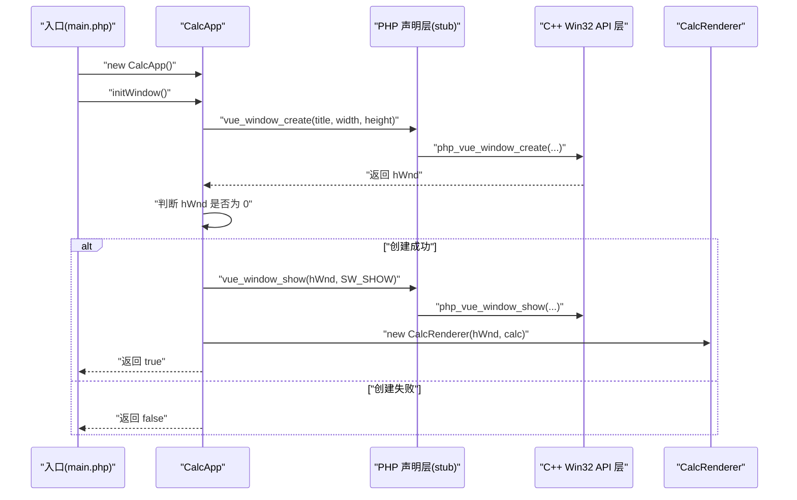
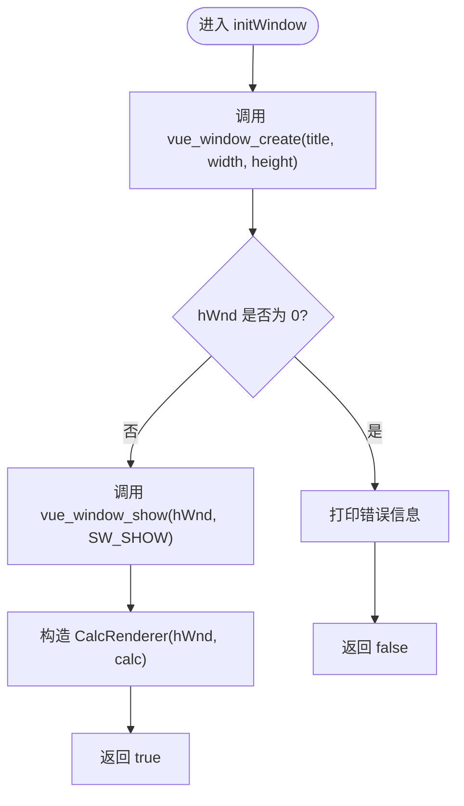
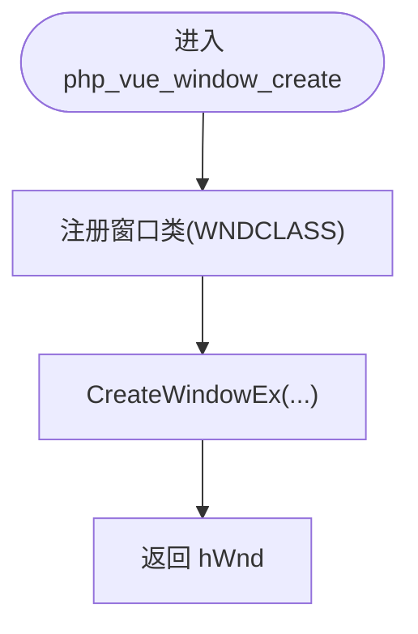
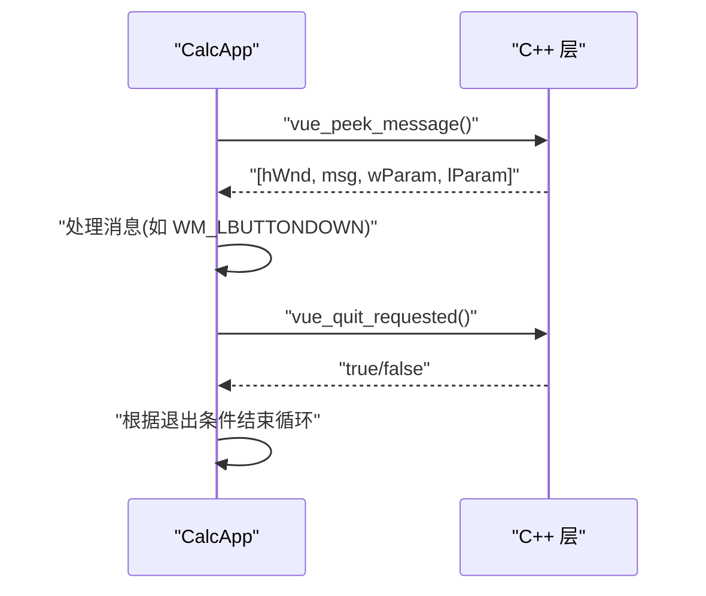
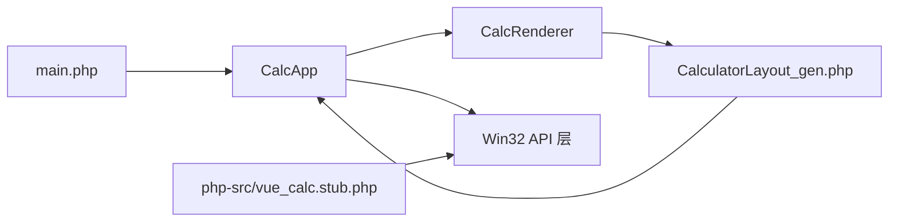

# 窗口管理

<cite>
**本文引用的文件**
- [cpp-src/vue_calc.cc](file://cpp-src/vue_calc.cc)
- [main.php](file://main.php)
- [php-src/vue_calc.stub.php](file://php-src/vue_calc.stub.php)
- [src/CalculatorLayout_gen.php](file://src/CalculatorLayout_gen.php)
- [project.yml](file://project.yml)
- [tools/sfc-compiler.php](file://tools/sfc-compiler.php)
</cite>

## 目录
1. [简介](#简介)
2. [项目结构](#项目结构)
3. [核心组件](#核心组件)
4. [架构总览](#架构总览)
5. [详细组件分析](#详细组件分析)
6. [依赖关系分析](#依赖关系分析)
7. [性能考量](#性能考量)
8. [故障排查指南](#故障排查指南)
9. [结论](#结论)
10. [附录](#附录)

## 简介
本文件聚焦于“窗口管理”主题，围绕 CalcApp 类中的 initWindow 方法展开，系统梳理以下方面：
- 窗口创建流程与尺寸设置
- vue_window_create 函数的调用参数与行为
- 窗口句柄管理与生命周期控制
- 窗口显示状态控制（含 SW_SHOW 常量）
- 错误处理与异常路径
- 资源清理与销毁最佳实践
- 在 Swoole AOT 环境下使用 Windows API 的注意事项

## 项目结构
该项目采用“单文件组件（SFC）→ AOT 编译”的流水线，前端界面由 .vue 经编译生成布局与组件类，运行时由 PHP 驱动状态，C++ 层提供 Win32 窗口与 GDI 绘制原语。

图表来源
- [tools/sfc-compiler.php:1-209](file://tools/sfc-compiler.php#L1-L209)
- [src/CalculatorLayout_gen.php:1-296](file://src/CalculatorLayout_gen.php#L1-L296)
- [main.php:139-259](file://main.php#L139-L259)
- [cpp-src/vue_calc.cc:1-157](file://cpp-src/vue_calc.cc#L1-L157)
- [php-src/vue_calc.stub.php:1-24](file://php-src/vue_calc.stub.php#L1-L24)

章节来源
- [project.yml:1-10](file://project.yml#L1-L10)
- [tools/sfc-compiler.php:1-209](file://tools/sfc-compiler.php#L1-L209)

## 核心组件
- CalcApp::initWindow：负责创建窗口、检查创建结果、显示窗口并初始化渲染器。
- CalcRenderer：基于布局数据与组件状态进行 GDI 绘制。
- Win32 API 层（C++）：提供窗口创建、消息轮询、GDI 绘制原语等底层能力。
- 声明层（PHP stub）：定义 C++ 导出函数的签名与用途。

章节来源
- [main.php:139-259](file://main.php#L139-L259)
- [cpp-src/vue_calc.cc:35-84](file://cpp-src/vue_calc.cc#L35-L84)
- [php-src/vue_calc.stub.php:12-23](file://php-src/vue_calc.stub.php#L12-L23)

## 架构总览
下图展示从应用初始化到窗口创建、显示与渲染的关键交互。

图表来源
- [main.php:151-169](file://main.php#L151-L169)
- [php-src/vue_calc.stub.php:13-16](file://php-src/vue_calc.stub.php#L13-L16)
- [cpp-src/vue_calc.cc:35-62](file://cpp-src/vue_calc.cc#L35-L62)

## 详细组件分析

### CalcApp::initWindow 方法详解
- 负责调用 C++ 层的窗口创建函数，并传入窗口标题与尺寸常量。
- 对创建结果进行校验：若返回句柄为 0，视为失败并输出错误信息。
- 成功后调用显示函数并初始化渲染器，随后返回 true；失败则返回 false。

图表来源
- [main.php:151-169](file://main.php#L151-L169)

章节来源
- [main.php:151-169](file://main.php#L151-L169)

### vue_window_create 函数调用参数与行为
- 参数说明
  - 标题：字符串类型，用于设置窗口标题栏文本。
  - 宽度/高度：整型，分别指定窗口初始宽度与高度。
- 行为说明
  - 注册窗口类并设置回调函数。
  - 使用扩展样式创建窗口，禁用可调整大小与最大化按钮。
  - 返回窗口句柄（HWND）。

图表来源
- [cpp-src/vue_calc.cc:35-57](file://cpp-src/vue_calc.cc#L35-L57)

章节来源
- [cpp-src/vue_calc.cc:35-57](file://cpp-src/vue_calc.cc#L35-L57)
- [php-src/vue_calc.stub.php:13-13](file://php-src/vue_calc.stub.php#L13-L13)

### 窗口尺寸设置与布局来源
- 窗口尺寸由 SFC 编译生成的常量提供，位于布局生成文件中。
- CalcApp::initWindow 使用这些常量作为窗口创建的宽高参数。

章节来源
- [src/CalculatorLayout_gen.php:7-8](file://src/CalculatorLayout_gen.php#L7-L8)
- [main.php:154-158](file://main.php#L154-L158)

### 窗口句柄管理与生命周期控制
- 句柄获取：通过窗口创建函数返回的 HWND。
- 生命周期要点
  - 创建阶段：检查返回值，失败时终止初始化。
  - 显示阶段：调用显示函数使窗口可见。
  - 事件循环：通过消息轮询处理用户输入与系统消息。
  - 退出条件：WM_QUIT 或内部退出标志触发关闭。

图表来源
- [main.php:171-227](file://main.php#L171-L227)
- [cpp-src/vue_calc.cc:65-84](file://cpp-src/vue_calc.cc#L65-L84)

章节来源
- [main.php:171-227](file://main.php#L171-L227)
- [cpp-src/vue_calc.cc:21-33](file://cpp-src/vue_calc.cc#L21-L33)

### 窗口显示状态控制与 SW_SHOW
- 常量定义：在入口文件中定义了 SW_SHOW，用于控制窗口显示。
- 使用位置：CalcApp::initWindow 中调用显示函数时传入该常量。
- 作用：将窗口设置为可见状态，参与事件循环与渲染。

章节来源
- [main.php:18-18](file://main.php#L18-L18)
- [main.php:165-165](file://main.php#L165-L165)

### 错误处理机制
- 窗口创建失败
  - 条件：返回 hWnd 为 0。
  - 行为：输出错误信息并返回 false，阻止后续初始化。
- 渲染异常
  - 在事件循环中捕获渲染过程抛出的异常，记录日志并继续运行。
- 消息处理异常
  - 对鼠标点击处理进行 try/catch 包裹，防止崩溃影响主循环。

章节来源
- [main.php:160-163](file://main.php#L160-L163)
- [main.php:171-227](file://main.php#L171-L227)

### 资源清理与销毁最佳实践
- 双缓冲绘制资源
  - 开始帧：获取设备上下文、创建兼容 DC 与位图。
  - 结束帧：将后台缓冲复制到前台，释放 DC 与位图对象。
- 窗口与消息
  - 窗口关闭与销毁消息会设置退出标志，确保事件循环安全退出。
  - 退出时不再进行额外的显式销毁（窗口由系统回收）。

章节来源
- [cpp-src/vue_calc.cc:90-117](file://cpp-src/vue_calc.cc#L90-L117)
- [cpp-src/vue_calc.cc:21-33](file://cpp-src/vue_calc.cc#L21-L33)

### 在 Swoole AOT 环境下的使用方式
- 函数桥接
  - PHP 侧通过声明层导出函数名，C++ 侧实现对应 php_vue_* 函数。
  - 通过 phpx.h 提供的类型系统在 PHP 与 C++ 之间传递参数与返回值。
- 构建与集成
  - 项目使用 MSVC 工具链与 AOT 编译器生成可执行程序。
  - SFC 编译器在运行前生成布局与组件类文件，供 AOT 使用。

章节来源
- [php-src/vue_calc.stub.php:1-24](file://php-src/vue_calc.stub.php#L1-L24)
- [cpp-src/vue_calc.cc:9-13](file://cpp-src/vue_calc.cc#L9-L13)
- [project.yml:1-10](file://project.yml#L1-L10)
- [tools/sfc-compiler.php:1-209](file://tools/sfc-compiler.php#L1-L209)

## 依赖关系分析
- 应用层依赖
  - CalcApp 依赖 CalcRenderer 与 Win32 API 层。
  - CalcRenderer 依赖布局数据与组件状态。
- 编译期依赖
  - SFC 编译器生成布局与组件类，供运行时使用。
- 运行时依赖
  - 声明层定义函数签名，C++ 层实现具体逻辑。

图表来源
- [main.php:139-259](file://main.php#L139-L259)
- [src/CalculatorLayout_gen.php:1-296](file://src/CalculatorLayout_gen.php#L1-L296)
- [php-src/vue_calc.stub.php:1-24](file://php-src/vue_calc.stub.php#L1-L24)
- [cpp-src/vue_calc.cc:1-157](file://cpp-src/vue_calc.cc#L1-L157)

章节来源
- [main.php:139-259](file://main.php#L139-L259)
- [src/CalculatorLayout_gen.php:1-296](file://src/CalculatorLayout_gen.php#L1-L296)
- [php-src/vue_calc.stub.php:1-24](file://php-src/vue_calc.stub.php#L1-L24)
- [cpp-src/vue_calc.cc:1-157](file://cpp-src/vue_calc.cc#L1-L157)

## 性能考量
- 渲染频率：事件循环中使用微秒级休眠以近似 60 FPS。
- 双缓冲绘制：减少闪烁，提升视觉流畅度。
- 消息处理：采用 PeekMessage + 循环处理，避免阻塞。

章节来源
- [main.php:223-223](file://main.php#L223-L223)
- [cpp-src/vue_calc.cc:90-117](file://cpp-src/vue_calc.cc#L90-L117)

## 故障排查指南
- 窗口创建失败
  - 现象：初始化返回 false 并输出错误信息。
  - 排查：确认窗口类注册是否成功、CreateWindowEx 参数是否合法。
- 窗口不显示
  - 现象：创建成功但不可见。
  - 排查：确认是否调用了显示函数以及传入的显示参数。
- 渲染异常
  - 现象：渲染过程中抛出异常。
  - 排查：查看异常日志，定位 CalcRenderer.render 中的具体步骤。
- 事件无响应
  - 现象：点击无效或退出无反应。
  - 排查：检查消息轮询与消息分发逻辑，确认 WM_LBUTTONDOWN 与 WM_QUIT 的处理。

章节来源
- [main.php:160-163](file://main.php#L160-L163)
- [main.php:171-227](file://main.php#L171-L227)
- [cpp-src/vue_calc.cc:21-33](file://cpp-src/vue_calc.cc#L21-L33)

## 结论
本项目通过清晰的职责分离实现了“数据驱动 + Win32 API”的桌面应用窗口管理：PHP 负责业务逻辑与状态，C++ 负责窗口与绘制，SFC 编译器提供布局与组件类。CalcApp::initWindow 是窗口生命周期的入口，负责创建、校验、显示与初始化渲染器。在 AOT 环境下，通过声明层与 C++ 实现的桥接，稳定地调用 Windows API 并保持良好的错误处理与资源管理。

## 附录
- 关键常量与函数
  - SW_SHOW：窗口显示常量，用于显示窗口。
  - vue_window_create：创建窗口，返回 HWND。
  - vue_window_show：显示窗口。
  - vue_peek_message：轮询并处理消息。
  - vue_quit_requested：查询退出请求标志。

章节来源
- [main.php:18-18](file://main.php#L18-L18)
- [php-src/vue_calc.stub.php:13-16](file://php-src/vue_calc.stub.php#L13-L16)
- [cpp-src/vue_calc.cc:35-84](file://cpp-src/vue_calc.cc#L35-L84)