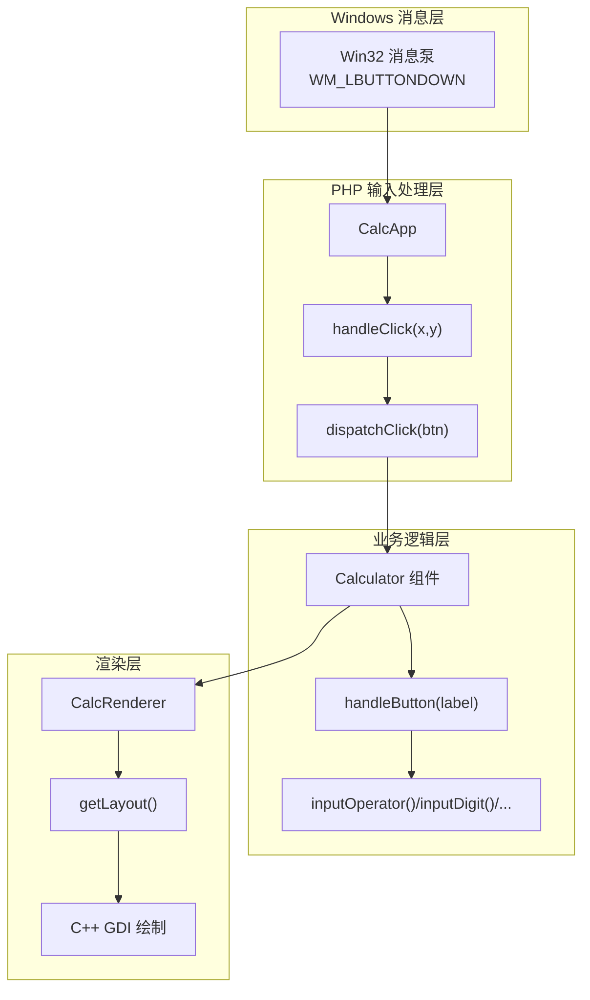
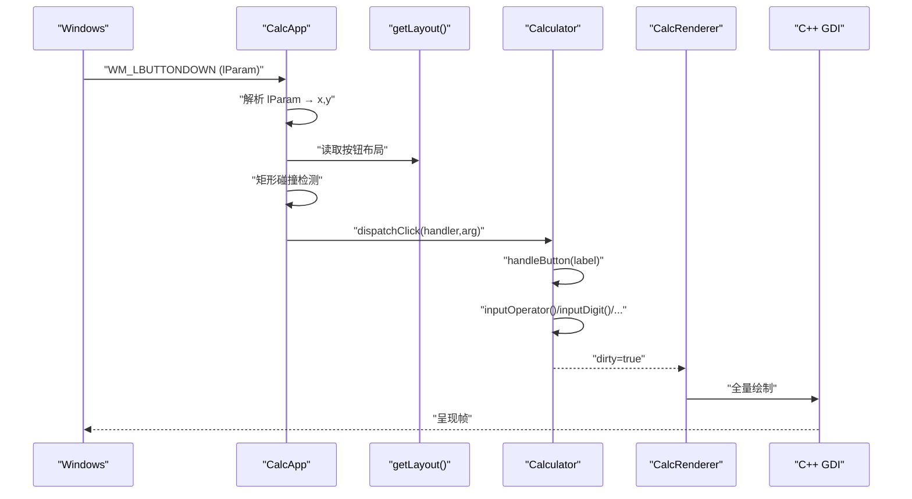
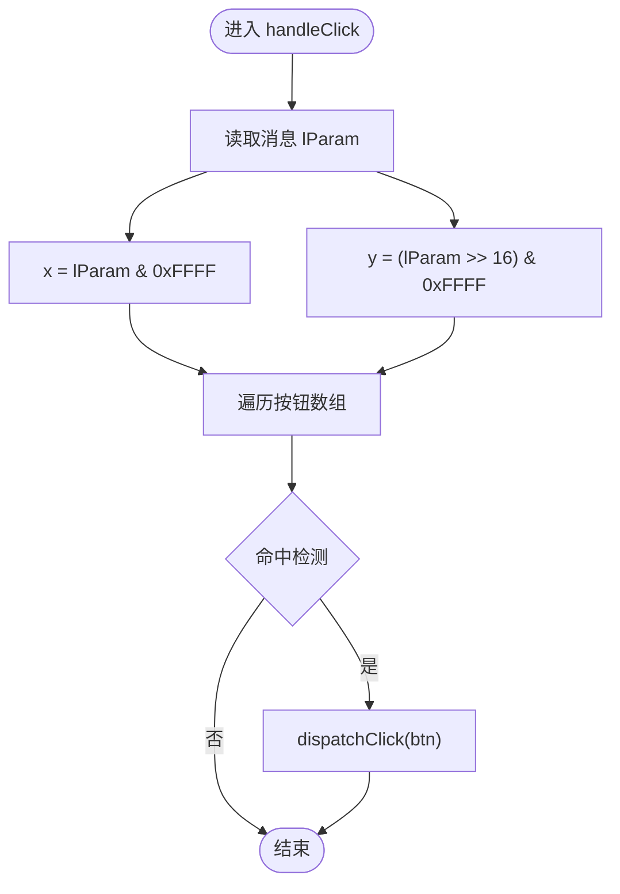
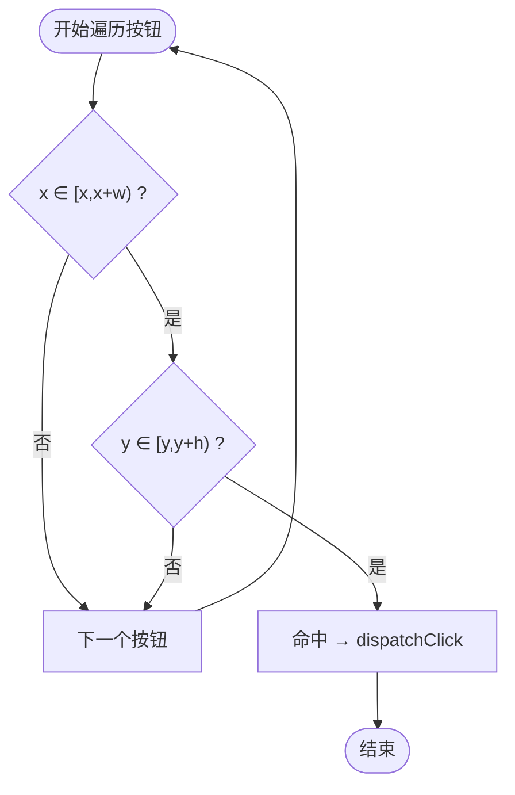
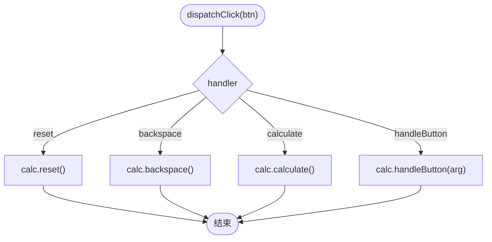
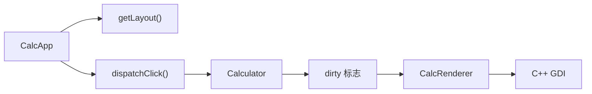

# 输入处理

<cite>
**本文引用的文件**
- [main.php](file://main.php)
- [Calculator.gen.php](file://src/Calculator.gen.php)
- [CalculatorLayout_gen.php](file://src/CalculatorLayout_gen.php)
- [vue_calc.cc](file://cpp-src/vue_calc.cc)
- [VueCalc技术文档_v2.html](file://VueCalc技术文档_v2.html)
- [VueCalc技术规划文档_v3.html](file://VueCalc技术规划文档_v3.html)
- [verify-layout.php](file://tests/verify-layout.php)
</cite>

## 目录
1. [简介](#简介)
2. [项目结构](#项目结构)
3. [核心组件](#核心组件)
4. [架构总览](#架构总览)
5. [详细组件分析](#详细组件分析)
6. [依赖分析](#依赖分析)
7. [性能考量](#性能考量)
8. [故障排查指南](#故障排查指南)
9. [结论](#结论)
10. [附录](#附录)

## 简介
本文件聚焦于输入处理系统，围绕 CalcApp 的 handleClick 方法进行深入剖析，涵盖：
- 鼠标坐标从 Windows 消息中提取与位操作
- 基于布局数据的按钮区域命中测试（矩形碰撞检测）
- 事件分发机制（dispatchClick）与组件方法调用
- 错误处理与异常恢复（try-catch 与日志）
- 输入延迟与响应性优化建议

## 项目结构
输入处理位于 PHP 层，结合 C++ 渲染层与 SFC 编译生成的布局数据，形成“消息泵 → 命中测试 → 事件路由 → 业务逻辑 → 渲染”的闭环。

图表来源
- [main.php:171-227](file://main.php#L171-L227)
- [main.php:229-258](file://main.php#L229-L258)
- [Calculator.gen.php:149-168](file://src/Calculator.gen.php#L149-L168)
- [CalculatorLayout_gen.php:10-296](file://src/CalculatorLayout_gen.php#L10-L296)
- [vue_calc.cc:69-84](file://cpp-src/vue_calc.cc#L69-L84)

章节来源
- [main.php:171-227](file://main.php#L171-L227)
- [main.php:229-258](file://main.php#L229-L258)
- [Calculator.gen.php:149-168](file://src/Calculator.gen.php#L149-L168)
- [CalculatorLayout_gen.php:10-296](file://src/CalculatorLayout_gen.php#L10-L296)
- [vue_calc.cc:69-84](file://cpp-src/vue_calc.cc#L69-L84)

## 核心组件
- CalcApp：负责消息轮询、坐标提取、命中测试与事件分发。
- CalcRenderer：消费布局数据进行全量 GDI 绘制。
- Calculator：响应式组件，承载计算器业务逻辑与状态。
- C++ 渲染层：提供窗口、消息泵与 GDI 绘制原语。

章节来源
- [main.php:139-259](file://main.php#L139-L259)
- [Calculator.gen.php:9-174](file://src/Calculator.gen.php#L9-L174)
- [CalculatorLayout_gen.php:10-296](file://src/CalculatorLayout_gen.php#L10-L296)
- [vue_calc.cc:1-157](file://cpp-src/vue_calc.cc#L1-157)

## 架构总览
输入处理的关键路径如下：
- Windows 消息泵捕获 WM_LBUTTONDOWN，将 lParam 中的低 16 位与高 16 位分别解析为 x/y。
- CalcApp.handleClick 遍历布局中的按钮，使用矩形碰撞检测判断命中。
- 命中后通过 dispatchClick 将 handler 与参数路由到 Calculator 的具体方法。
- Calculator 修改状态并设置 dirty 标志，主循环检测到后触发 CalcRenderer 渲染。

图表来源
- [main.php:187-198](file://main.php#L187-L198)
- [main.php:229-258](file://main.php#L229-L258)
- [Calculator.gen.php:149-168](file://src/Calculator.gen.php#L149-L168)
- [CalculatorLayout_gen.php:10-296](file://src/CalculatorLayout_gen.php#L10-L296)
- [main.php:99-132](file://main.php#L99-L132)
- [vue_calc.cc:91-117](file://cpp-src/vue_calc.cc#L91-L117)

## 详细组件分析

### 鼠标坐标提取与位操作
- 消息泵返回数组 [hwnd, message, wParam, lParam]，其中 lParam 包含屏幕坐标。
- 使用按位与与右移操作从 lParam 中分离 x/y：
  - x = lParam & 0xFFFF
  - y = (lParam >> 16) & 0xFFFF
- 该方法确保从 32 位整型中正确取出两个 16 位分量，避免符号扩展问题。

图表来源
- [main.php:187-198](file://main.php#L187-L198)
- [main.php:229-241](file://main.php#L229-L241)

章节来源
- [main.php:187-198](file://main.php#L187-L198)
- [main.php:229-241](file://main.php#L229-L241)

### 坐标系统与坐标转换
- 坐标来源：Windows 消息坐标系（屏幕坐标）。
- 坐标转换：由于按钮布局数据在编译期已转换为像素坐标（见布局生成），输入处理直接使用屏幕坐标与布局中的按钮矩形进行碰撞检测，无需额外坐标变换。
- 边界条件：使用“左闭右开”区间 [x, x+w) 与 [y, y+h)，避免重复命中与边界遗漏。

章节来源
- [CalculatorLayout_gen.php:10-296](file://src/CalculatorLayout_gen.php#L10-L296)
- [VueCalc技术文档_v2.html:245-251](file://VueCalc技术文档_v2.html#L245-L251)

### 按钮区域检测算法（矩形碰撞检测）
- 遍历布局中的按钮数组，对每个按钮检查：
  - x 在 [btn['x'], btn['x']+btn['w'])
  - y 在 [btn['y'], btn['y']+btn['h'])
- 首次命中即停止遍历，保证 O(n) 线性搜索的高效性。
- 文档中指出：18 个按钮的线性搜索在现代 CPU 上约 100ns，性能无压力；若按钮数量增长到 100+，可考虑空间哈希（网格分桶）。

图表来源
- [main.php:234-241](file://main.php#L234-L241)
- [VueCalc技术规划文档_v3.html:2146-2160](file://VueCalc技术规划文档_v3.html#L2146-L2160)

章节来源
- [main.php:234-241](file://main.php#L234-L241)
- [VueCalc技术规划文档_v3.html:2146-2160](file://VueCalc技术规划文档_v3.html#L2146-L2160)

### 事件分发机制（dispatchClick）
- 从按钮布局中读取 handler 与 arg，显式路由到 Calculator 的方法：
  - reset → reset()
  - backspace → backspace()
  - calculate → calculate()
  - handleButton → handleButton(arg)
- 该显式路由满足 AOT 编译器约束，避免动态方法调用与反射。

图表来源
- [main.php:243-258](file://main.php#L243-L258)

章节来源
- [main.php:243-258](file://main.php#L243-L258)

### 组件方法调用与状态变更
- Calculator.handleButton 根据标签选择具体操作（数字、运算符、小数点、等号、清除、退格）。
- 每个方法内部修改组件状态，并设置 dirty 标志，触发渲染。

章节来源
- [Calculator.gen.php:149-168](file://src/Calculator.gen.php#L149-L168)
- [Calculator.gen.php:60-147](file://src/Calculator.gen.php#L60-L147)

### 渲染与呈现
- CalcRenderer 读取布局数据，遍历 elements/buttons，调用 C++ GDI 函数绘制。
- 主循环检测 dirty 标志，仅在状态变更后重绘，避免不必要的绘制。

章节来源
- [main.php:99-132](file://main.php#L99-L132)
- [main.php:213-221](file://main.php#L213-L221)
- [vue_calc.cc:91-117](file://cpp-src/vue_calc.cc#L91-L117)

## 依赖分析
- CalcApp 依赖布局数据（getLayout）与 C++ 消息泵（php_vue_peek_message）。
- Calculator 依赖 ReactiveComponent 的 dirty 标志。
- CalcRenderer 依赖布局数据与 C++ GDI 绘制原语。

图表来源
- [main.php:229-258](file://main.php#L229-L258)
- [Calculator.gen.php:149-168](file://src/Calculator.gen.php#L149-L168)
- [main.php:99-132](file://main.php#L99-L132)
- [CalculatorLayout_gen.php:10-296](file://src/CalculatorLayout_gen.php#L10-L296)

章节来源
- [main.php:229-258](file://main.php#L229-L258)
- [Calculator.gen.php:149-168](file://src/Calculator.gen.php#L149-L168)
- [main.php:99-132](file://main.php#L99-L132)
- [CalculatorLayout_gen.php:10-296](file://src/CalculatorLayout_gen.php#L10-L296)

## 性能考量
- 命中测试：O(n) 线性搜索，n=18，单次检测约 100ns，性能极佳。
- 渲染策略：全量 GDI 重绘，仅在 dirty 为真时触发，避免频繁重绘。
- 帧率控制：主循环使用 usleep 控制帧率，约 60 FPS。
- 优化建议（通用指导，非特定实现）：
  - 若按钮数量增长，可考虑空间哈希（网格分桶）降低命中测试复杂度。
  - 将布局坐标预计算为更紧凑的数据结构（如四叉树）以减少遍历成本。
  - 在渲染层引入脏矩形合并与区域裁剪，减少 GDI 绘制面积。
  - 使用更高效的文本与图形 API（如 Direct2D）以获得更好的抗锯齿与硬件加速。

章节来源
- [VueCalc技术规划文档_v3.html:2146-2160](file://VueCalc技术规划文档_v3.html#L2146-L2160)
- [main.php:222-223](file://main.php#L222-L223)

## 故障排查指南
- 错误处理与日志
  - 输入处理异常：捕获 Throwable 并打印错误信息与堆栈，便于定位问题。
  - 渲染异常：捕获 Throwable 并打印错误信息，避免渲染中断。
- 常见问题
  - 坐标不匹配：确认布局数据与按钮坐标一致（可通过测试用例验证）。
  - 事件未触发：检查按钮 handler 与 arg 是否正确写入布局。
  - 渲染未更新：确认组件方法内设置了 dirty 标志。
- 验证布局坐标
  - 使用测试脚本验证按钮坐标与 handler/arg 的正确性。

章节来源
- [main.php:192-197](file://main.php#L192-L197)
- [main.php:214-219](file://main.php#L214-L219)
- [verify-layout.php:59-71](file://tests/verify-layout.php#L59-L71)

## 结论
本输入处理系统以“布局驱动 + 显式路由”为核心设计，实现了从 Windows 消息到组件方法的清晰路径。坐标提取采用标准的 lParam 位操作，命中测试采用 O(n) 矩形碰撞检测，事件分发通过显式路由满足 AOT 约束。错误处理采用 try-catch 与日志记录，保障系统稳定性。整体性能优异，适合当前计算器规模；未来可按需引入空间索引与增量渲染以进一步提升性能。

## 附录
- 关键实现路径参考
  - 坐标提取与消息处理：[main.php:187-198](file://main.php#L187-L198)
  - 命中测试与事件分发：[main.php:229-258](file://main.php#L229-L258)
  - 组件方法调用：[Calculator.gen.php:149-168](file://src/Calculator.gen.php#L149-L168)
  - 布局数据与按钮坐标：[CalculatorLayout_gen.php:10-296](file://src/CalculatorLayout_gen.php#L10-L296)
  - 渲染与 GDI 绘制：[main.php:99-132](file://main.php#L99-L132), [vue_calc.cc:91-117](file://cpp-src/vue_calc.cc#L91-L117)