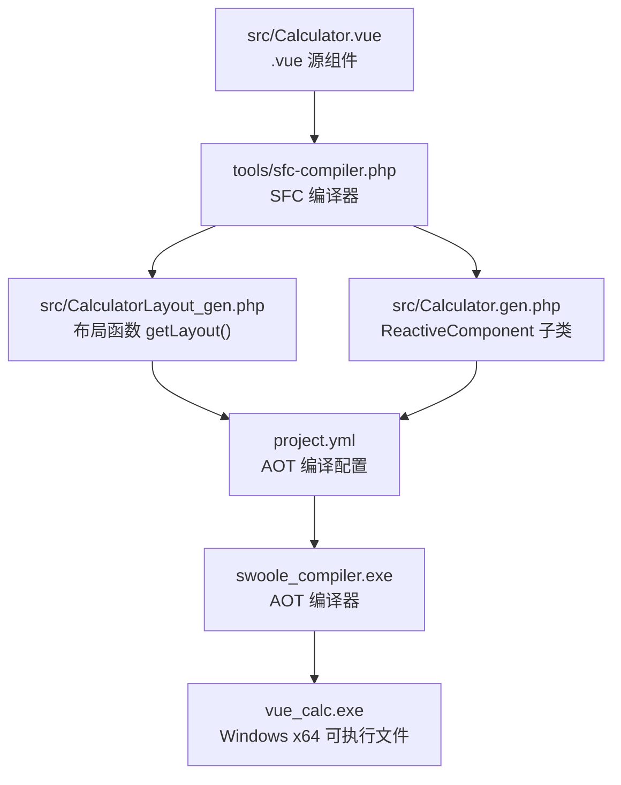
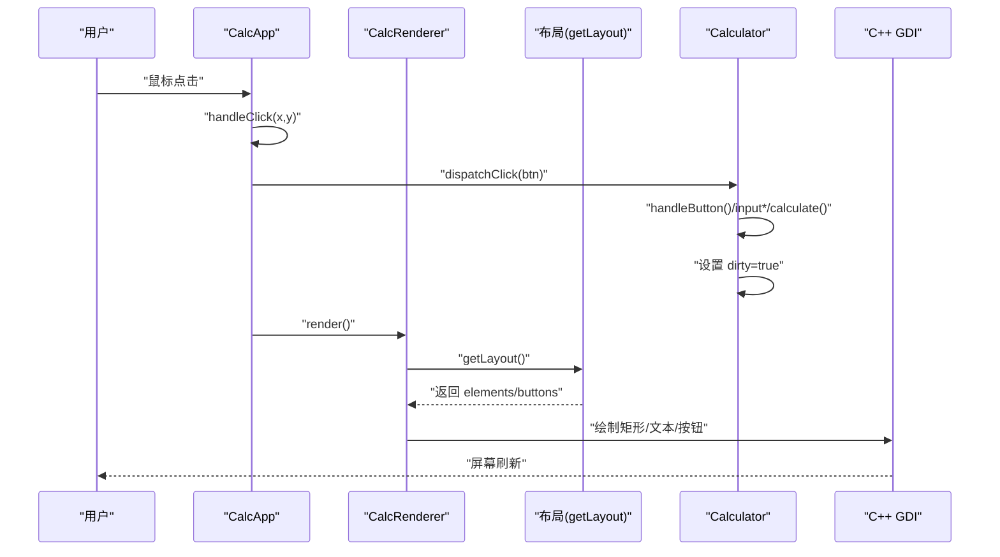
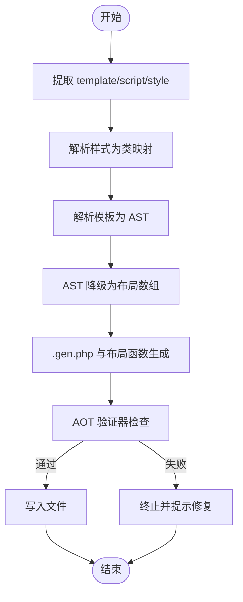
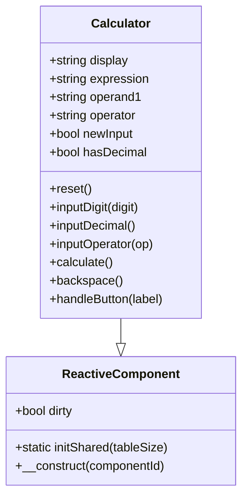
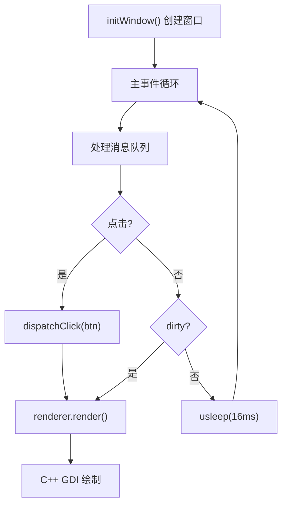
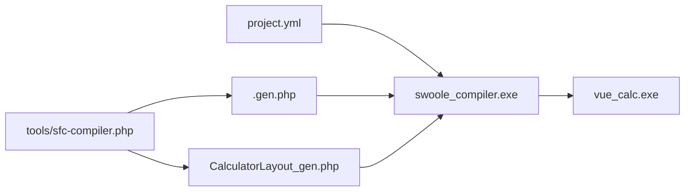

# 快速开始

<cite>
**本文引用的文件**
- [main.php](file://main.php)
- [Calculator.vue](file://src/Calculator.vue)
- [Calculator.gen.php](file://src/Calculator.gen.php)
- [ReactiveComponent.php](file://src/ReactiveComponent.php)
- [sfc-compiler.php](file://tools/sfc-compiler.php)
- [aot-validator.php](file://tools/compiler/aot-validator.php)
- [project.yml](file://project.yml)
- [构建编译流程参考.md](file://构建编译流程参考.md)
- [开发经验与教训.md](file://开发经验与教训.md)
- [verify-layout.php](file://tests/verify-layout.php)
- [sfc-compiler-test.php](file://tests/sfc-compiler-test.php)
</cite>

## 目录
1. [简介](#简介)
2. [项目结构](#项目结构)
3. [核心组件](#核心组件)
4. [架构总览](#架构总览)
5. [详细组件分析](#详细组件分析)
6. [依赖关系分析](#依赖关系分析)
7. [性能考虑](#性能考虑)
8. [故障排查指南](#故障排查指南)
9. [结论](#结论)
10. [附录](#附录)

## 简介
本指南面向首次接触 VueCalc 的开发者，帮助你在约 30 分钟内完成从环境准备到运行第一个桌面计算器的全流程。你将学会：
- 安装并配置必要的组件：PHP CLI、Swoole AOT 编译器、Visual Studio/MSVC、Windows SDK
- 理解从 .vue 到 .exe 的完整编译管线
- 编写第一个计算器组件并成功运行可执行文件
- 快速定位常见编译与运行错误，并掌握调试技巧

## 项目结构
VueCalc 采用“SFC 编译器 + AOT 编译器”的混合架构，将 .vue 组件在编译期转为 .gen.php，再由 AOT 编译为 Windows 原生可执行文件。核心目录与文件如下：
- src：包含 .vue 源组件、生成的 .gen.php、响应式基类与变更队列
- tools：SFC 编译器与 AOT 验证器
- cpp-src/php-src：C++ 原生实现与 PHP 声明（Stub）
- tests：编译器单元测试与布局校验脚本
- project.yml：AOT 编译配置
- main.php：应用入口与主事件循环

图表来源
- [构建编译流程参考.md:54-64](file://构建编译流程参考.md#L54-L64)
- [project.yml:1-10](file://project.yml#L1-L10)

章节来源
- [构建编译流程参考.md:23-51](file://构建编译流程参考.md#L23-L51)
- [project.yml:1-10](file://project.yml#L1-L10)

## 核心组件
- 响应式组件基类：ReactiveComponent 提供脏标记与共享基础设施，子类通过显式属性与手动 dirty 标记实现数据驱动渲染。
- 计算器组件：Calculator 继承自 ReactiveComponent，包含计算器业务逻辑与状态。
- 渲染器：CalcRenderer 读取布局数据与组件状态，调用 C++ GDI 绘制函数进行渲染。
- 应用控制器：CalcApp 负责窗口创建、事件循环与点击分发。
- SFC 编译器：将 .vue 的 template/script/style 解析为 .gen.php 与布局函数，进行 AOT 兼容性验证后再输出。
- AOT 编译器：将 PHP 源码翻译为 C++，再由 MSVC 链接为 Windows PE 可执行文件。

章节来源
- [ReactiveComponent.php:11-35](file://src/ReactiveComponent.php#L11-L35)
- [Calculator.gen.php:9-174](file://src/Calculator.gen.php#L9-L174)
- [main.php:26-133](file://main.php#L26-L133)
- [main.php:139-259](file://main.php#L139-L259)
- [sfc-compiler.php:1-210](file://tools/sfc-compiler.php#L1-L210)
- [aot-validator.php:17-169](file://tools/compiler/aot-validator.php#L17-L169)

## 架构总览
下面的序列图展示了从用户点击到屏幕刷新的端到端流程。

图表来源
- [main.php:171-227](file://main.php#L171-L227)
- [main.php:229-258](file://main.php#L229-L258)
- [Calculator.gen.php:149-168](file://src/Calculator.gen.php#L149-L168)

## 详细组件分析

### SFC 编译器（从 .vue 到 .gen.php）
SFC 编译器负责：
- 提取 template/script/style 三块内容
- 解析样式为 GDI 属性映射
- 解析模板为 AST，再降级为布局数组
- 生成 .gen.php 与布局函数文件
- 运行 AOT 验证器，确保生成代码满足 AOT 约束

图表来源
- [sfc-compiler.php:46-210](file://tools/sfc-compiler.php#L46-L210)
- [aot-validator.php:36-106](file://tools/compiler/aot-validator.php#L36-L106)

章节来源
- [sfc-compiler.php:1-210](file://tools/sfc-compiler.php#L1-L210)
- [aot-validator.php:17-169](file://tools/compiler/aot-validator.php#L17-L169)

### 计算器组件（Calculator）
Calculator 继承自 ReactiveComponent，声明了显示值、表达式、操作数、运算符等状态属性，并在每个修改状态的方法末尾设置 $this->dirty=true，以便主循环检测并触发重绘。

图表来源
- [ReactiveComponent.php:11-35](file://src/ReactiveComponent.php#L11-L35)
- [Calculator.gen.php:9-174](file://src/Calculator.gen.php#L9-L174)

章节来源
- [Calculator.gen.php:9-174](file://src/Calculator.gen.php#L9-L174)
- [ReactiveComponent.php:11-35](file://src/ReactiveComponent.php#L11-L35)

### 渲染器与应用控制器
- CalcRenderer 从布局数据与组件状态读取信息，调用 C++ 绘制函数进行矩形、文本与按钮的绘制。
- CalcApp 负责窗口创建、事件循环、消息处理与渲染触发，使用脏标记驱动最小化重绘。

图表来源
- [main.php:151-169](file://main.php#L151-L169)
- [main.php:171-227](file://main.php#L171-L227)
- [main.php:229-258](file://main.php#L229-L258)

章节来源
- [main.php:26-133](file://main.php#L26-L133)
- [main.php:139-259](file://main.php#L139-L259)

## 依赖关系分析
- 项目配置：project.yml 指定编译模式、源码目录与输出命名。
- 编译管线：SFC 编译器生成 .gen.php 与布局函数；AOT 编译器将 PHP 翻译为 C++ 并链接为 exe。
- 运行时依赖：exe 依赖 php8ts.dll、phpx.dll 以及 Windows GDI/User32 库。

图表来源
- [project.yml:1-10](file://project.yml#L1-L10)
- [构建编译流程参考.md:117-171](file://构建编译流程参考.md#L117-L171)

章节来源
- [project.yml:1-10](file://project.yml#L1-L10)
- [构建编译流程参考.md:117-171](file://构建编译流程参考.md#L117-L171)

## 性能考虑
- 事件循环采用批量消息处理与脏标记驱动渲染，避免每条消息都重绘，从而降低 CPU 占用并维持约 60 FPS。
- 字体大小根据文本长度动态调整，长数字自动缩小，提升可读性。
- 布局坐标在编译期计算，运行时仅做查找与绘制，减少运行时开销。

章节来源
- [main.php:171-227](file://main.php#L171-L227)
- [main.php:71-79](file://main.php#L71-L79)

## 故障排查指南

### 环境准备与初始化
- 确保已安装并初始化 MSVC 环境：先运行 vcvarsall.bat x64，使 cl.exe 可用。
- 确保 PHP CLI 可用，版本满足 SFC 编译器要求。
- 确保运行时 DLL（php8ts.dll、phpx.dll）存在于 SDK 目录，AOT 链接时可找到。

章节来源
- [构建编译流程参考.md:9-20](file://构建编译流程参考.md#L9-L20)

### 常见编译错误与修复
- SFC 编译器错误
  - 缺少 template/script/style：确保 .vue 文件包含三块。
  - 正则分隔符冲突：避免使用与 CSS 颜色相同的 #，改用其他分隔符。
  - 按钮绑定属性不匹配：确保 :bind 属性名正确。
- AOT 编译器错误
  - cl 未找到：先初始化 vcvarsall.bat x64。
  - 顶层 require_once：移除顶层 require_once，AOT 通过 sources 自动链接。
  - 属性默认值使用魔术常量：将 __DIR__ 等移动到构造函数。
  - 文件名含点号：将 Layout.gen.php 改为 Layout_gen.php。
  - 重复类声明：移除 require_once。
  - 未定义变量：先赋初始值（如 = null）。
  - LAYOUT 常量：改用 function getLayout() 返回数组。
  - 链接符号未解析：检查 C++ 函数名是否为 php_xxx，确保实现存在。
  - 库文件缺失：确认 phpx.lib、php8ts.lib、user32.lib、gdi32.lib、kernel32.lib 路径正确。

章节来源
- [构建编译流程参考.md:208-239](file://构建编译流程参考.md#L208-L239)
- [开发经验与教训.md:20-36](file://开发经验与教训.md#L20-L36)
- [开发经验与教训.md:39-58](file://开发经验与教训.md#L39-L58)
- [开发经验与教训.md:64-72](file://开发经验与教训.md#L64-L72)

### 调试技巧
- 开启控制台：将 project.yml 中 no-console 设置为 false，便于查看错误信息。
- 全局 try-catch：在 handleClick 与 render 周围包裹异常捕获，打印堆栈。
- 编译-运行-报错-修复循环：每次改动后重新编译（约 10 秒），快速定位问题。
- 使用测试脚本：运行 tests/verify-layout.php 与 tests/sfc-compiler-test.php 验证布局与编译器功能。

章节来源
- [开发经验与教训.md:291-308](file://开发经验与教训.md#L291-L308)
- [verify-layout.php:1-72](file://tests/verify-layout.php#L1-L72)
- [sfc-compiler-test.php:1-365](file://tests/sfc-compiler-test.php#L1-L365)

## 结论
通过本指南，你已经掌握了 VueCalc 的环境准备、编译流程与调试方法。按照“SFC 编译器 → AOT 编译器 → 运行”的顺序，即可在 30 分钟内成功运行第一个桌面计算器。后续可继续扩展组件与布局，逐步构建更复杂的桌面应用。

## 附录

### 快速开始步骤清单
- 环境初始化
  - 初始化 MSVC：vcvarsall.bat x64
  - 确认 PHP CLI 可用
  - 确认运行时 DLL 与库文件可用
- 编译 SFC
  - 运行：php tools/sfc-compiler.php src/Calculator.vue
  - 校验生成文件：Calculator.gen.php 与 CalculatorLayout_gen.php
- AOT 编译
  - 运行：swoole_compiler.exe project.yml -f
  - 查看输出：vue_calc.exe
- 运行与调试
  - 启动：双击或命令行运行 vue_calc.exe
  - 如需调试：将 project.yml 中 no-console 设为 false

章节来源
- [构建编译流程参考.md:173-205](file://构建编译流程参考.md#L173-L205)
- [构建编译流程参考.md:117-148](file://构建编译流程参考.md#L117-L148)