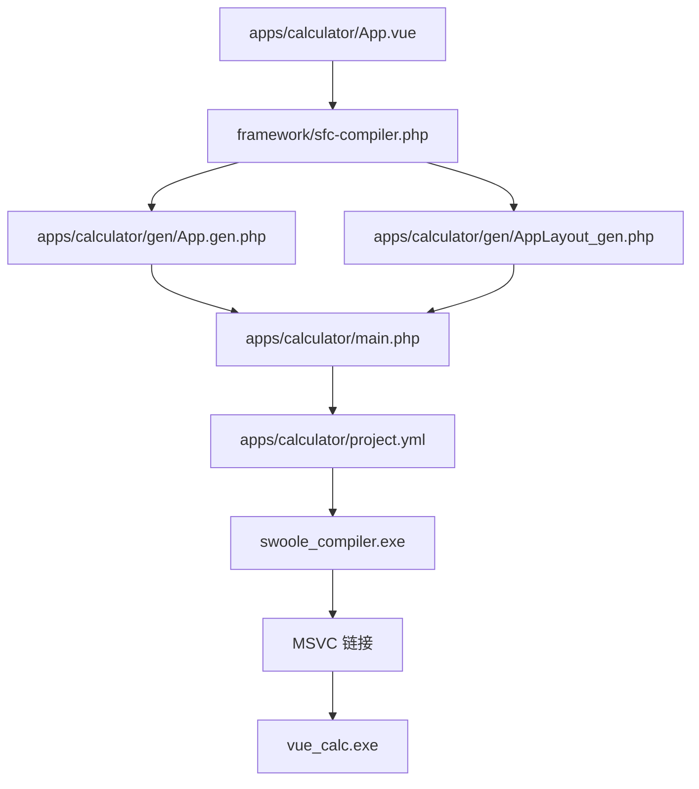
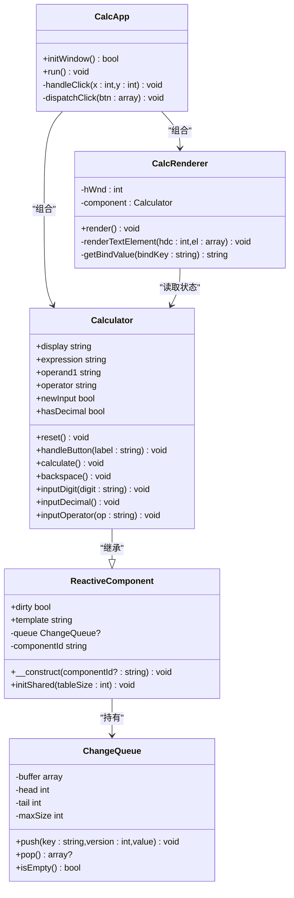
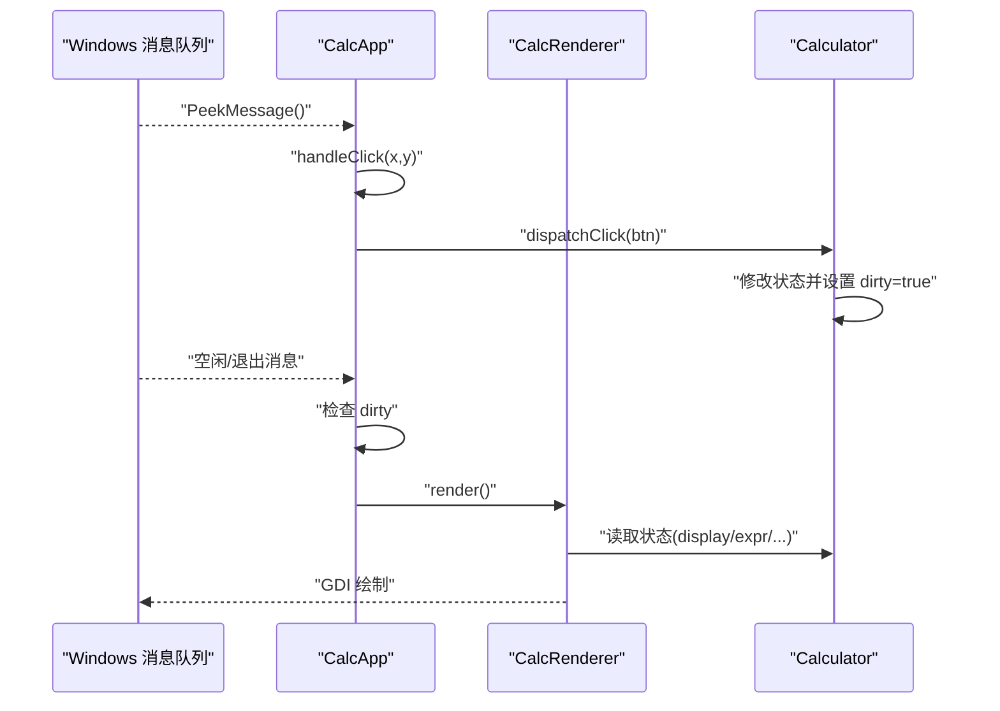
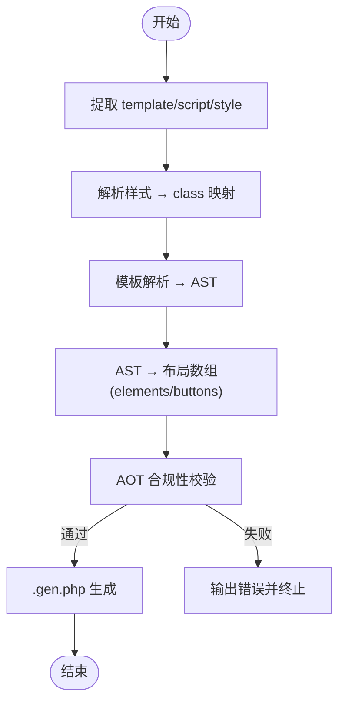
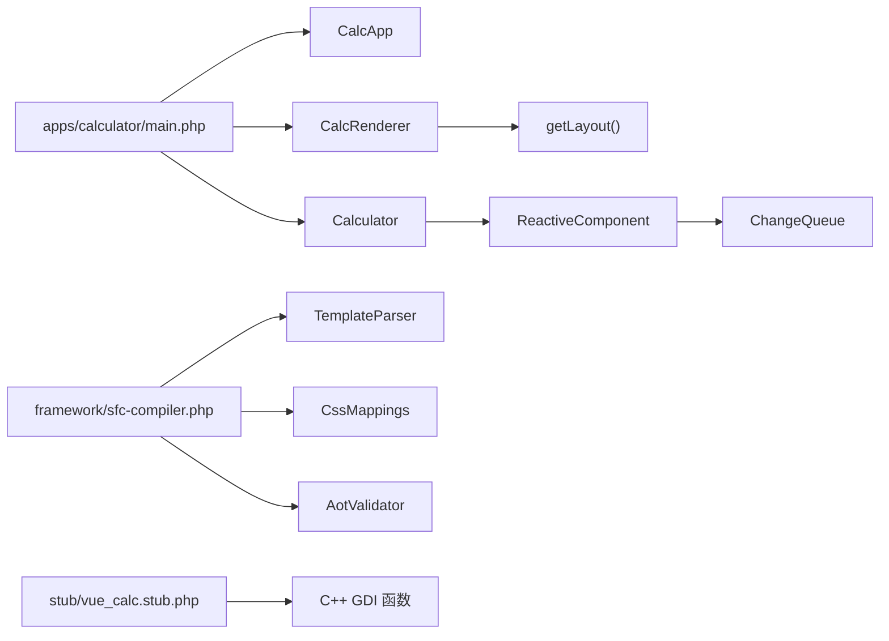

# 故障排除和常见问题

<cite>
**本文引用的文件**
- [main.php](file://apps/calculator/main.php)
- [开发经验与教训.md](file://docs/开发经验与教训.md)
- [开发经验与教训_v2.md](file://docs/开发经验与教训_v2.md)
- [构建编译流程参考.md](file://docs/构建编译流程参考.md)
- [App.vue](file://apps/calculator/App.vue)
- [App.gen.php](file://apps/calculator/gen/App.gen.php)
- [BaseRenderer.php](file://framework/BaseRenderer.php)
- [main_build.bat](file://main_build.bat)
- [sfc-compiler.php](file://framework/sfc-compiler.php)
- [aot-validator.php](file://framework/compiler/aot-validator.php)
- [template-parser.php](file://framework/compiler/template-parser.php)
- [css-mappings.php](file://framework/compiler/css-mappings.php)
- [sfc-compiler-test.php](file://tests/sfc-compiler-test.php)
- [project.yml](file://apps/calculator/project.yml)
- [vue_calc.stub.php](file://stub/vue_calc.stub.php)
</cite>

## 更新摘要
**变更内容**
- 新增 z-order 渲染修复章节，解决弹窗遮挡问题
- 新增绝对路径问题章节，提供路径管理最佳实践
- 新增缺失居中对齐功能章节，完善文本渲染支持
- 新增 UI 布局问题章节，解决组件尺寸和样式不匹配
- 新增构建脚本改进章节，优化路径查找和错误处理
- 更新 AOT 兼容性规则，增加新的设计约束
- 完善调试方法章节，提供更系统的故障排除流程

## 目录
1. [简介](#简介)
2. [项目结构](#项目结构)
3. [核心组件](#核心组件)
4. [架构总览](#架构总览)
5. [详细组件分析](#详细组件分析)
6. [依赖关系分析](#依赖关系分析)
7. [性能考虑](#性能考虑)
8. [故障排除指南](#故障排除指南)
9. [结论](#结论)
10. [附录](#附录)

## 简介
本文件面向使用 Swoole Compiler AOT 在 Windows 桌面端开发 PHP + C++ 混合应用的开发者，围绕 VueCalc 项目提供系统化的故障排除与常见问题解答。内容涵盖：
- 编译错误与 AOT 限制相关的排查与修复
- 运行时异常定位与调试技巧
- 性能优化建议（渲染、内存、事件处理）
- 开发经验与教训总结，帮助规避常见陷阱
- 社区支持与问题反馈渠道指引

## 项目结构
项目采用"SFC 编译器 + AOT 编译"的两阶段流水线：
- 阶段一（预处理）：SFC 编译器将 .vue 组件解析为 .gen.php（组件类）与布局函数，确保生成代码满足 AOT 约束
- 阶段二（AOT 编译）：AOT 编译器将 PHP 源码翻译为 C++，再由 MSVC 链接为原生 exe

**图表来源**
- [framework/sfc-compiler.php:1-210](file://framework/sfc-compiler.php#L1-L210)
- [docs/构建编译流程参考.md:54-162](file://docs/构建编译流程参考.md#L54-L162)
- [apps/calculator/project.yml:1-10](file://apps/calculator/project.yml#L1-L10)

**章节来源**
- [docs/构建编译流程参考.md:23-162](file://docs/构建编译流程参考.md#L23-L162)

## 核心组件
- CalcApp：主应用控制器，负责窗口初始化、事件循环、点击分发与渲染触发
- CalcRenderer：数据驱动渲染器，读取布局数据与组件状态，调用 C++ GDI 绘制原语
- ReactiveComponent：响应式基类，提供脏标记与共享基础设施
- ChangeQueue：变更通知队列（保留，当前未启用）
- SFC 编译器：将 .vue 解析为 .gen.php 与布局函数，内置 AOT 合规性校验
- C++ Stub：Win32 API 的 PHP 声明，约定函数命名与类型映射

**章节来源**
- [apps/calculator/main.php:26-133](file://apps/calculator/main.php#L26-L133)
- [apps/calculator/main.php:139-259](file://apps/calculator/main.php#L139-L259)
- [framework/BaseRenderer.php:1-146](file://framework/BaseRenderer.php#L1-L146)
- [framework/ReactiveComponent.php:1-35](file://framework/ReactiveComponent.php#L1-L35)
- [framework/ChangeQueue.php:1-57](file://framework/ChangeQueue.php#L1-L57)
- [framework/sfc-compiler.php:1-210](file://framework/sfc-compiler.php#L1-L210)
- [stub/vue_calc.stub.php:1-24](file://stub/vue_calc.stub.php#L1-L24)

## 架构总览

**图表来源**
- [apps/calculator/main.php:26-133](file://apps/calculator/main.php#L26-L133)
- [apps/calculator/main.php:139-259](file://apps/calculator/main.php#L139-L259)
- [framework/ReactiveComponent.php:1-35](file://framework/ReactiveComponent.php#L1-L35)
- [framework/ChangeQueue.php:1-57](file://framework/ChangeQueue.php#L1-L57)
- [apps/calculator/App.vue:43-203](file://apps/calculator/App.vue#L43-L203)

## 详细组件分析

### 事件循环与渲染流程
- 事件循环：持续轮询消息队列，批量处理消息后统一检查脏标记并渲染
- 点击命中测试：遍历布局按钮数组，基于像素边界判断点击目标
- 渲染策略：仅在 dirty 为真时调用 CalcRenderer.render，减少不必要的绘制

**图表来源**
- [apps/calculator/main.php:171-227](file://apps/calculator/main.php#L171-L227)
- [apps/calculator/main.php:229-258](file://apps/calculator/main.php#L229-L258)
- [apps/calculator/main.php:99-132](file://apps/calculator/main.php#L99-L132)

**章节来源**
- [apps/calculator/main.php:171-258](file://apps/calculator/main.php#L171-L258)

### SFC 编译器与 AOT 合规性
- 模块化设计：块提取、样式解析、模板解析（递归下降）、布局数组生成、AOT 校验、代码生成
- AOT 校验规则：禁止多点文件名、禁止 const 复杂数组、禁止变量属性/方法访问、PHP8 函数替换提示
- 生成文件：Calculator.gen.php（组件类）、CalculatorLayout_gen.php（布局函数）

**图表来源**
- [framework/sfc-compiler.php:46-210](file://framework/sfc-compiler.php#L46-L210)
- [framework/compiler/aot-validator.php:36-106](file://framework/compiler/aot-validator.php#L36-L106)
- [framework/compiler/template-parser.php:79-541](file://framework/compiler/template-parser.php#L79-L541)
- [framework/compiler/css-mappings.php:164-194](file://framework/compiler/css-mappings.php#L164-L194)

**章节来源**
- [framework/sfc-compiler.php:1-210](file://framework/sfc-compiler.php#L1-L210)
- [framework/compiler/aot-validator.php:1-169](file://framework/compiler/aot-validator.php#L1-L169)
- [framework/compiler/template-parser.php:1-680](file://framework/compiler/template-parser.php#L1-L680)
- [framework/compiler/css-mappings.php:1-210](file://framework/compiler/css-mappings.php#L1-L210)

### 响应式与脏标记机制
- 去除魔术方法：AOT 下 __get/__set 不可靠，改为显式属性 + 手动 dirty 标记
- 共享基础设施：初始化共享变更队列，保留扩展接口
- 事件处理：按钮点击通过显式路由分发到组件方法，最后统一设置 dirty

**章节来源**
- [framework/ReactiveComponent.php:1-35](file://framework/ReactiveComponent.php#L1-L35)
- [apps/calculator/App.vue:64-202](file://apps/calculator/App.vue#L64-L202)
- [apps/calculator/gen/App.gen.php:40-262](file://apps/calculator/gen/App.gen.php#L40-L262)
- [apps/calculator/main.php:244-258](file://apps/calculator/main.php#L244-L258)

## 依赖关系分析
- 顶层入口 main.php 依赖 CalcApp、CalcRenderer、Calculator
- CalcRenderer 依赖布局函数 getLayout() 与组件状态
- SFC 编译器依赖模板解析器、样式映射、AOT 校验器
- C++ Stub 定义 Win32 API 的 PHP 声明，供渲染与窗口管理使用

**图表来源**
- [apps/calculator/main.php:26-133](file://apps/calculator/main.php#L26-L133)
- [apps/calculator/main.php:139-259](file://apps/calculator/main.php#L139-L259)
- [framework/sfc-compiler.php:1-210](file://framework/sfc-compiler.php#L1-L210)
- [framework/compiler/template-parser.php:1-680](file://framework/compiler/template-parser.php#L1-L680)
- [framework/compiler/css-mappings.php:1-210](file://framework/compiler/css-mappings.php#L1-L210)
- [framework/compiler/aot-validator.php:1-169](file://framework/compiler/aot-validator.php#L1-L169)
- [stub/vue_calc.stub.php:1-24](file://stub/vue_calc.stub.php#L1-L24)

**章节来源**
- [apps/calculator/main.php:26-259](file://apps/calculator/main.php#L26-L259)
- [framework/sfc-compiler.php:1-210](file://framework/sfc-compiler.php#L1-L210)
- [stub/vue_calc.stub.php:1-24](file://stub/vue_calc.stub.php#L1-L24)

## 性能考虑
- 渲染优化
  - 批量消息处理：内层循环清空消息队列，外层统一渲染，避免频繁重绘
  - 脏标记驱动：仅在 dirty 为真时渲染，降低 GDI 调用频率
  - 文本自适应：根据字符串长度动态调整字号，避免超长文本溢出
- 内存管理
  - 双缓冲绘制：在内存 DC 中完成绘制，一次性 BitBlt 到屏幕，减少闪烁与系统调用
  - 环形缓冲：变更队列采用固定大小环形缓冲，避免频繁分配
- 事件处理
  - 点击命中测试：遍历布局按钮数组进行边界检测，支持任意排列
  - 事件节流：usleep 控制帧率，避免忙等占用 CPU

**章节来源**
- [apps/calculator/main.php:171-238](file://apps/calculator/main.php#L171-L238)
- [apps/calculator/main.php:99-132](file://apps/calculator/main.php#L99-L132)
- [framework/ChangeQueue.php:1-57](file://framework/ChangeQueue.php#L1-L57)
- [docs/开发经验与教训.md:245-288](file://docs/开发经验与教训.md#L245-L288)

## 故障排除指南

### 一、编译错误与 AOT 限制
- 症状：顶层可执行代码必须位于函数内
  - 根因：AOT 要求所有可执行代码在函数内
  - 修复：移除顶层 require_once，使用 project.yml 的 sources 配置集中编译
  - 参考：[开发经验与教训_v2.md:35-41](file://docs/开发经验与教训_v2.md#L35-L41)、[构建编译流程参考.md:224-228](file://docs/构建编译流程参考.md#L224-L228)
- 症状：属性默认值使用魔术常量
  - 根因：AOT 不支持 __DIR__ 等魔术常量作为默认值
  - 修复：将赋值移至构造函数
  - 参考：[开发经验与教训_v2.md:45-49](file://docs/开发经验与教训_v2.md#L45-L49)
- 症状：文件名含点号导致 C++ 符号名非法
  - 根因：AOT 将文件名映射为 C++ 符号，点号非法
  - 修复：改用下划线命名（如 _gen.php）
  - 参考：[开发经验与教训_v2.md:146-157](file://docs/开发经验与教训_v2.md#L146-L157)、[构建编译流程参考.md:226](file://docs/构建编译流程参考.md#L226)
- 症状：const 复杂数组未注册
  - 根因：AOT 对 const 支持有限
  - 修复：改用 function 返回数组
  - 参考：[开发经验与教训_v2.md:161-185](file://docs/开发经验与教训_v2.md#L161-L185)、[构建编译流程参考.md:229](file://docs/构建编译流程参考.md#L229)
- 症状：变量属性/方法访问不被支持
  - 根因：AOT 不支持 $obj->$var/$obj->$method()
  - 修复：改用显式 if/else 路由
  - 参考：[framework/compiler/aot-validator.php:72-83](file://framework/compiler/aot-validator.php#L72-L83)
- 症状：PHP8 函数在运行时不可用
  - 根因：AOT 运行时版本可能低于 PHP 8
  - 修复：使用兼容函数（如 strpos 替代 str_contains）
  - 参考：[开发经验与教训_v2.md:83-85](file://docs/开发经验与教训_v2.md#L83-L85)、[framework/compiler/aot-validator.php:94-99](file://framework/compiler/aot-validator.php#L94-L99)

### 二、运行时异常与调试
- 症状：点击无响应或报错 Cannot append element to an null
  - 根因：AOT 下 __get/__set 不生效，属性读取返回 null
  - 修复：改为显式属性 + 手动 dirty 标记
  - 参考：[docs/开发经验与教训.md:129-159](file://docs/开发经验与教训.md#L129-L159)
- 症状：undefined function any()
  - 根因：any() 不是 PHP 函数
  - 修复：移除 any()，直接存储值
  - 参考：[docs/开发经验与教训.md:102-115](file://docs/开发经验与教训.md#L102-L115)
- 症状：颜色解析失败，按钮全灰
  - 根因：正则分隔符与 CSS 颜色 # 冲突
  - 修复：改用 ~ 等不冲突分隔符
  - 参考：[开发经验与教训_v2.md:108-124](file://docs/开发经验与教训_v2.md#L108-L124)
- 症状：文本元素未解析
  - 根因：属性名字符类不包含冒号
  - 修复：添加 : 到字符类
  - 参考：[开发经验与教训_v2.md:128-142](file://docs/开发经验与教训_v2.md#L128-L142)
- 症状：GUI 闪退无错误信息
  - 根因：控制台未开启
  - 修复：设置 no-console=false，确保错误输出
  - 参考：[docs/开发经验与教训.md:293-297](file://docs/开发经验与教训.md#L293-L297)

### 三、构建与链接错误
- 症状：cl 不是内部或外部命令
  - 根因：MSVC 环境未初始化
  - 修复：先执行 vcvarsall.bat x64
  - 参考：[docs/构建编译流程参考.md:223](file://docs/构建编译流程参考.md#L223)
- 症状：链接 unresolved external symbol
  - 根因：C++ 函数未实现或命名不匹配（php_ 前缀）
  - 修复：检查 cpp-src 中函数名与 stub 声明一致
  - 参考：[docs/构建编译流程参考.md:236-237](file://docs/构建编译流程参考.md#L236-L237)

### 四、SFC 编译器专项问题
- 症状：缺少 <template> 块
  - 修复：确保 .vue 包含 template/script/style 三块
  - 参考：[docs/构建编译流程参考.md:214](file://docs/构建编译流程参考.md#L214)
- 症状：未知标签或属性缺失
  - 修复：使用受支持的标签与属性，检查行号错误
  - 参考：[tests/sfc-compiler-test.php:146-196](file://tests/sfc-compiler-test.php#L146-L196)

### 五、z-order 渲染修复
- 症状：弹窗（AboutDialog）显示时，底层按钮残留在弹窗区域内，出现"半透明"的视觉穿透效果
  - 根因：BaseRenderer.render() 将元素和按钮分为两个独立分层循环——先遍历所有层画完全部元素，再遍历所有层画完全部按钮。这导致高层按钮会在高层元素之上，但低层按钮的绘制发生在高层元素之后，低层按钮残留在画面上无法被高层元素完整覆盖
  - 修复：合并为单一循环——每层内先画元素再画按钮，确保高层完整覆盖低层
  - 参考：[开发经验与教训_v2.md:189-214](file://docs/开发经验与教训_v2.md#L189-L214)
- 症状：按钮条件遮挡失效
  - 根因：分层渲染的 z-order 正确性要求同一层内所有内容作为一个整体绘制
  - 修复：每层内先画元素再画按钮，确保条件遮挡的正确性
  - 参考：[framework/BaseRenderer.php:85-144](file://framework/BaseRenderer.php#L85-L144)

### 六、绝对路径问题
- 症状：vendor/autoload.php 硬编码绝对路径导致加载失败
  - 根因：硬编码绝对路径在项目迁移或不同机器上构建时失效
  - 修复：改用 __DIR__ 相对路径，确保跨平台可移植性
  - 参考：[开发经验与教训_v2.md:217-234](file://docs/开发经验与教训_v2.md#L217-L234)
- 症状：构建脚本路径查找不完整
  - 根因：main_build.bat 只搜索了 lib/ 和 lib/lib/ 两个路径，遗漏了 SDK/lib/
  - 修复：在路径查找列表中添加 SDK/lib/ 作为第三候选路径
  - 参考：[开发经验与教训_v2.md:237-250](file://docs/开发经验与教训_v2.md#L237-L250)

### 七、缺失居中对齐功能
- 症状：文本对齐功能缺失，center 对齐完全缺失
  - 根因：BaseRenderer 只实现了 right 文本对齐，center 对齐功能未实现
  - 修复：在 drawText() 中添加 center 对齐分支，支持居中对齐
  - 参考：[开发经验与教训_v2.md:253-270](file://docs/开发经验与教训_v2.md#L253-L270)
- 症状：AboutDialog 文本无法居中显示
  - 根因：渲染器缺少 center 对齐支持
  - 修复：实现居中对齐算法，根据容器宽度和文本长度计算居中位置
  - 参考：[framework/BaseRenderer.php:70-80](file://framework/BaseRenderer.php#L70-L80)

### 八、UI 布局问题
- 症状：DisplayPanel 显示文本区域过宽，与右侧 ? 按钮重叠
  - 根因：container-w=320 过宽，未考虑右侧按钮的空间
  - 修复：将 container-w 从 320 缩小到 282，为 ? 按钮留出空间
  - 参考：[开发经验与教训_v2.md:273-285](file://docs/开发经验与教训_v2.md#L273-L285)
- 症状：AboutDialog Close 按钮尺寸过小且使用灰色样式
  - 根因：按钮尺寸 60×28 过小，样式 btn-func（灰色）不符合关闭操作的视觉惯例
  - 修复：Close 按钮从 60×28 加大到 100×34，样式从 btn-func 改为 btn-op（橙色）
  - 参考：[开发经验与教训_v2.md:273-285](file://docs/开发经验与教训_v2.md#L273-L285)

### 九、构建脚本改进
- 症状：构建脚本路径查找不完整
  - 修复：在 main_build.bat 中添加 SDK/lib/ 路径查找，确保 php8embed.lib 能够被正确找到
  - 参考：[main_build.bat:242-247](file://main_build.bat#L242-L247)
- 症状：路径计算依赖硬编码绝对路径
  - 修复：使用 %~dp0 相对路径计算，确保脚本在任何位置都能正确运行
  - 参考：[main_build.bat:29-34](file://main_build.bat#L29-L34)
- 症状：错误处理不完善
  - 修复：增强错误处理逻辑，提供更详细的错误信息和解决方案
  - 参考：[main_build.bat:388-404](file://main_build.bat#L388-L404)

### 十、调试与诊断方法
- 日志与错误输出
  - 在 handleClick 与 render 周围包裹 try-catch，打印异常信息与堆栈
  - 参考：[apps/calculator/main.php:192-219](file://apps/calculator/main.php#L192-L219)
- 构建-运行-修复循环
  - 每次改动后执行 SFC 编译与 AOT 编译，快速定位问题
  - 参考：[docs/开发经验与教训.md:297-298](file://docs/开发经验与教训.md#L297-L298)
- 单元测试验证
  - 使用 tests/sfc-compiler-test.php 验证 CSS 映射、模板解析、布局生成与 AOT 校验
  - 参考：[tests/sfc-compiler-test.php:1-365](file://tests/sfc-compiler-test.php#L1-L365)

**章节来源**
- [docs/开发经验与教训.md:293-339](file://docs/开发经验与教训.md#L293-L339)
- [docs/开发经验与教训_v2.md:208-446](file://docs/开发经验与教训_v2.md#L208-L446)
- [docs/构建编译流程参考.md:208-239](file://docs/构建编译流程参考.md#L208-L239)
- [apps/calculator/main.php:192-219](file://apps/calculator/main.php#L192-L219)
- [tests/sfc-compiler-test.php:1-365](file://tests/sfc-compiler-test.php#L1-L365)

## 结论
- AOT 环境下，必须以"显式优于隐式""编译期优于运行时"为设计原则
- 魔术方法、反射、动态特性在 AOT 下不可靠，应改用静态声明与手工标记
- SFC 编译器应作为 AOT 预处理器，生成严格合规的 .gen.php 与布局函数
- 通过完善的单元测试与构建脚本，形成"构建-运行-报错-修复"的高效闭环
- 路径管理、渲染优化、UI 布局等细节问题需要在设计阶段就充分考虑

## 附录

### AOT 兼容性规则速查
- 禁止：$$ 动态变量、extract()、生成器、多层 break/continue、__get/__set、反射、eval/include、含 \0 的字符串、参数数量不匹配、变量类型转换
- 必须：所有代码在函数内、变量先定义后使用、类型不可变、文件名仅用 [a-zA-Z0-9_]、全局 const 仅用标量

**章节来源**
- [docs/构建编译流程参考.md:241-268](file://docs/构建编译流程参考.md#L241-L268)

### 社区支持与问题反馈
- 本仓库提供完整的构建脚本、SFC 编译器与单元测试，建议在以下场景寻求帮助：
  - AOT 编译器行为差异与限制
  - SFC 模板标签与属性的扩展需求
  - C++ 互操作与 GDI 绘制问题
  - z-order 渲染与 UI 布局问题
  - 路径管理与构建脚本问题
- 提交问题时请附带：
  - 重现步骤与期望/实际结果
  - 相关日志与错误堆栈
  - 生成的 .gen.php 片段与 project.yml 配置
  - 具体的代码片段和错误信息

### 设计原则与最佳实践
- **AOT 约束前置**：设计阶段就列出"不能用什么"
- **极简主义**：每多一层抽象就多一个 AOT 不兼容的风险点
- **编译期预处理**：任何需要动态处理的逻辑（模板解析、布局计算）都应在 AOT 编译前由独立工具完成
- **显式优于隐式**：手动 $this->dirty = true 虽然不够优雅，但绝对可靠
- **文件名只用 [a-zA-Z0-9_]**：避免点号、连字符等 AOT 不兼容字符
- **配置数据用函数不用 const 数组**：AOT 对 const 的支持有限
- **路径永远用相对计算**：__DIR__ / %~dp0，绝不硬编码绝对路径
- **分层渲染必须单一循环**：每层内所有内容一笔画完，不得拆成多循环
- **渲染原语全覆盖**：对齐（left/center/right）等基础功能在设计期就规划完整
- **UI 尺寸实际运行验证**：仅凭计算值设计布局容易遗漏元素间的重叠问题

### 故障排除检查清单
- [ ] 确认所有顶层代码都在函数内
- [ ] 检查文件名是否包含点号或特殊字符
- [ ] 验证 const 数组是否为简单标量
- [ ] 确认路径使用 __DIR__ 或 %~dp0 相对计算
- [ ] 检查渲染循环是否为单一循环结构
- [ ] 验证文本对齐功能是否完整实现
- [ ] 确认 UI 组件尺寸是否考虑了所有重叠元素
- [ ] 检查构建脚本的路径查找是否完整
- [ ] 验证控制台是否开启以便调试
- [ ] 确认每次修改后都进行了完整的构建测试