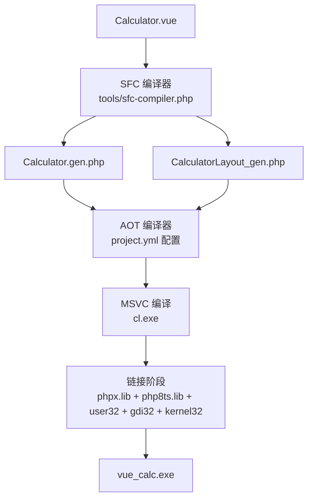
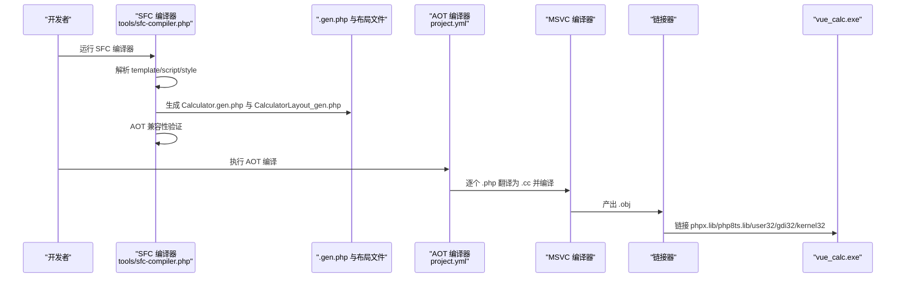
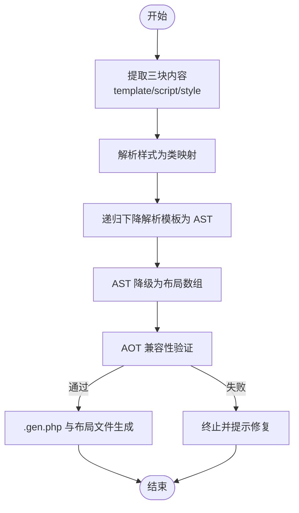
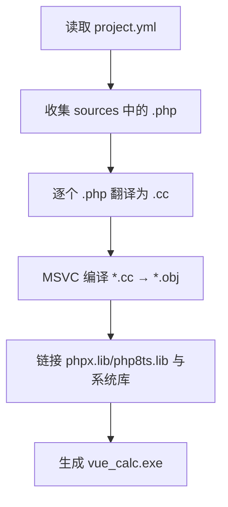
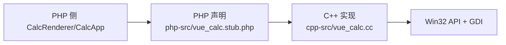
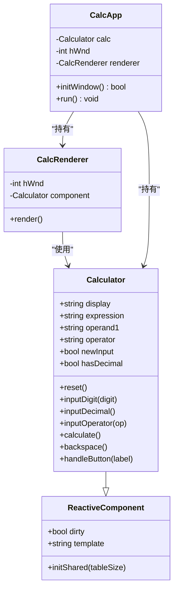
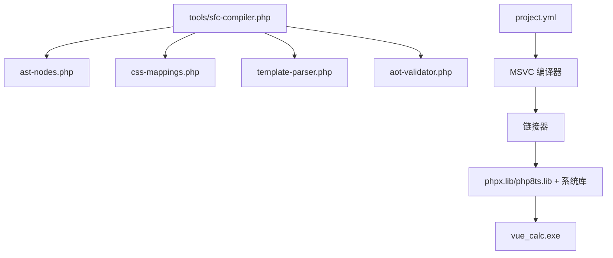

# 构建和部署

<cite>
**本文引用的文件**
- [project.yml](file://project.yml)
- [main.php](file://main.php)
- [构建编译流程参考.md](file://构建编译流程参考.md)
- [tools/sfc-compiler.php](file://tools/sfc-compiler.php)
- [tools/compiler/aot-validator.php](file://tools/compiler/aot-validator.php)
- [tools/compiler/template-parser.php](file://tools/compiler/template-parser.php)
- [tools/compiler/css-mappings.php](file://tools/compiler/css-mappings.php)
- [tools/compiler/ast-nodes.php](file://tools/compiler/ast-nodes.php)
- [cpp-src/vue_calc.cc](file://cpp-src/vue_calc.cc)
- [php-src/vue_calc.stub.php](file://php-src/vue_calc.stub.php)
- [src/ReactiveComponent.php](file://src/ReactiveComponent.php)
- [src/Calculator.gen.php](file://src/Calculator.gen.php)
- [src/CalculatorLayout_gen.php](file://src/CalculatorLayout_gen.php)
</cite>

## 目录
1. [简介](#简介)
2. [项目结构](#项目结构)
3. [核心组件](#核心组件)
4. [架构总览](#架构总览)
5. [详细组件分析](#详细组件分析)
6. [依赖关系分析](#依赖关系分析)
7. [性能考虑](#性能考虑)
8. [故障排除指南](#故障排除指南)
9. [结论](#结论)
10. [附录](#附录)

## 简介
本指南面向希望在 Windows 上使用 Swoole AOT 编译器将 PHP + C++ 桌面应用编译为原生可执行文件的开发者。文档覆盖从源码准备、SFC 编译器生成中间文件、AOT 编译器转换与链接，到最终可执行文件的完整流程；同时详解 project.yml 配置项、AOT 兼容性约束、构建脚本与常见问题排查，并给出多组件扩展与版本管理建议。

## 项目结构
该示例项目采用“单文件组件（.vue）→ SFC 编译器 → .gen.php → AOT 编译器 → .exe”的流水线，结合 C++ Win32 GDI 绘制层，形成“PHP 逻辑 + C++ 渲染”的混合桌面应用。

图表来源
- [构建编译流程参考.md:54-64](file://构建编译流程参考.md#L54-L64)
- [project.yml:1-10](file://project.yml#L1-L10)
- [tools/sfc-compiler.php:1-210](file://tools/sfc-compiler.php#L1-L210)

章节来源
- [构建编译流程参考.md:23-51](file://构建编译流程参考.md#L23-L51)

## 核心组件
- SFC 编译器：负责解析 .vue 的 template/script/style，生成布局数据与组件类文件，并进行 AOT 兼容性校验。
- AOT 编译器：基于 project.yml 收集 sources，逐个 .php 翻译为 .cc，再由 MSVC 编译为 .obj 并链接生成 .exe。
- C++ 渲染层：提供 Win32 窗口与 GDI 绘制原语，供 PHP 侧通过 stub 声明调用。
- 响应式组件基类：提供脏标记与共享变更队列，支撑数据驱动渲染。

章节来源
- [tools/sfc-compiler.php:1-210](file://tools/sfc-compiler.php#L1-L210)
- [project.yml:1-10](file://project.yml#L1-L10)
- [cpp-src/vue_calc.cc:1-157](file://cpp-src/vue_calc.cc#L1-L157)
- [src/ReactiveComponent.php:1-35](file://src/ReactiveComponent.php#L1-L35)

## 架构总览
下图展示从 .vue 到 .exe 的端到端流程，以及各模块之间的依赖关系。

图表来源
- [构建编译流程参考.md:117-162](file://构建编译流程参考.md#L117-L162)
- [tools/sfc-compiler.php:130-210](file://tools/sfc-compiler.php#L130-L210)
- [project.yml:1-10](file://project.yml#L1-L10)

## 详细组件分析

### SFC 编译器（PHP CLI 预处理）
- 功能概览
  - 提取 template/script/style 三块内容
  - 解析样式为 CSS 映射表，支持颜色、字号、粗细等
  - 递归下降解析模板为 AST，再降级为布局数组
  - 生成两个 .gen.php 文件：组件类与布局函数
  - AOT 兼容性验证，失败则不写入磁盘
- 关键实现要点
  - 模板解析：基于 Token 流的递归下降语法分析
  - 样式映射：将 CSS 属性映射到 GDI 参数（BGR 颜色、字号、粗细等）
  - 代码生成：使用 heredoc 与 var_export 输出稳定结构
  - 兼容性校验：禁止文件名含多个点、const 复杂数组、变量属性/方法访问等
- 命令与输入输出
  - 命令：php tools/sfc-compiler.php src/Calculator.vue
  - 输出：Calculator.gen.php、CalculatorLayout_gen.php

图表来源
- [tools/sfc-compiler.php:46-210](file://tools/sfc-compiler.php#L46-L210)
- [tools/compiler/template-parser.php:60-96](file://tools/compiler/template-parser.php#L60-L96)
- [tools/compiler/css-mappings.php:15-210](file://tools/compiler/css-mappings.php#L15-L210)
- [tools/compiler/aot-validator.php:17-106](file://tools/compiler/aot-validator.php#L17-L106)

章节来源
- [tools/sfc-compiler.php:1-210](file://tools/sfc-compiler.php#L1-L210)
- [tools/compiler/template-parser.php:1-680](file://tools/compiler/template-parser.php#L1-L680)
- [tools/compiler/css-mappings.php:1-210](file://tools/compiler/css-mappings.php#L1-L210)
- [tools/compiler/aot-validator.php:1-169](file://tools/compiler/aot-validator.php#L1-L169)

### AOT 编译器与 project.yml 配置
- 配置项详解
  - name：决定最终可执行文件名（连字符将转为下划线）
  - version：版本号
  - mode：bin（可执行文件）或 ext（扩展）
  - no-console：false 时保留控制台（便于调试）
  - sources：入口文件 main.php 与目录 ./src、./php-src、./cpp-src
- 编译流程
  - prepare：收集 sources 中所有 .php 文件（7 个源文件）
  - convert：每个 .php 翻译为 .cc（生成 arginfo 头文件）
  - compile：cl /c *.cc → *.obj（11 个文件）
  - link：*.obj + phpx.lib + php8ts.lib + user32 + gdi32 + kernel32 → vue_calc.exe
- 常用参数
  - -f：强制全量重编译
  - -o：指定输出文件名
  - -j N：并发编译任务数
  - -m bin/ext：编译模式
  - --debug-info：附带调试信息

图表来源
- [project.yml:1-10](file://project.yml#L1-L10)
- [构建编译流程参考.md:149-162](file://构建编译流程参考.md#L149-L162)

章节来源
- [project.yml:1-10](file://project.yml#L1-L10)
- [构建编译流程参考.md:117-171](file://构建编译流程参考.md#L117-L171)

### C++ 渲染层与 PHP Stub 声明
- C++ 层提供窗口创建/显示、消息轮询、双缓冲绘制、矩形填充、文本绘制、按钮绘制等原语
- PHP 通过 stub 声明调用 C++ 函数（命名约定：php_vue_* 对应 vue_*）
- 产物：在 AOT 链接阶段与 .obj 一起生成最终 exe

图表来源
- [php-src/vue_calc.stub.php:1-24](file://php-src/vue_calc.stub.php#L1-L24)
- [cpp-src/vue_calc.cc:1-157](file://cpp-src/vue_calc.cc#L1-L157)

章节来源
- [php-src/vue_calc.stub.php:1-24](file://php-src/vue_calc.stub.php#L1-L24)
- [cpp-src/vue_calc.cc:1-157](file://cpp-src/vue_calc.cc#L1-L157)

### 响应式组件与数据驱动渲染
- ReactiveComponent：提供脏标记与共享变更队列，子类声明公开属性并在状态变更后置位 dirty
- CalcRenderer：读取布局数据与组件状态，调用 C++ 绘制原语进行渲染
- CalcApp：主事件循环，处理消息、触发渲染、控制窗口生命周期

图表来源
- [src/ReactiveComponent.php:1-35](file://src/ReactiveComponent.php#L1-L35)
- [src/Calculator.gen.php:1-174](file://src/Calculator.gen.php#L1-L174)
- [main.php:26-291](file://main.php#L26-L291)

章节来源
- [src/ReactiveComponent.php:1-35](file://src/ReactiveComponent.php#L1-L35)
- [src/Calculator.gen.php:1-174](file://src/Calculator.gen.php#L1-L174)
- [main.php:26-291](file://main.php#L26-L291)

### AOT 兼容性规则与最佳实践
- 禁止特性
  - 动态变量、extract、生成器、多层 break/continue、魔术方法、反射、eval/include 动态加载、字符串含 \0、参数数量不匹配、变量类型转换
- 必须遵守
  - 所有代码在函数/类内
  - 变量先定义后使用
  - 类型不可变（变量与对象类型均不可变）
  - 文件名仅使用字母数字下划线
  - 全局 const 仅限标量，复杂数组用函数返回
- SFC 编译器针对上述规则进行验证，避免 AOT 失败

章节来源
- [构建编译流程参考.md:241-269](file://构建编译流程参考.md#L241-L269)
- [tools/compiler/aot-validator.php:17-106](file://tools/compiler/aot-validator.php#L17-L106)

## 依赖关系分析
- SFC 编译器依赖
  - 模块：ast-nodes、css-mappings、template-parser、aot-validator
  - CLI：php tools/sfc-compiler.php <vue-file>
- AOT 编译器依赖
  - 配置：project.yml
  - 工具链：MSVC（cl.exe）、链接器、phpx.lib、php8ts.lib、user32.lib、gdi32.lib、kernel32.lib
- 运行时依赖
  - php8ts.dll、phpx.dll（SDK 目录）

图表来源
- [tools/sfc-compiler.php:19-24](file://tools/sfc-compiler.php#L19-L24)
- [tools/compiler/ast-nodes.php:1-153](file://tools/compiler/ast-nodes.php#L1-L153)
- [tools/compiler/css-mappings.php:1-210](file://tools/compiler/css-mappings.php#L1-L210)
- [tools/compiler/template-parser.php:1-680](file://tools/compiler/template-parser.php#L1-L680)
- [tools/compiler/aot-validator.php:1-169](file://tools/compiler/aot-validator.php#L1-L169)
- [project.yml:1-10](file://project.yml#L1-L10)

章节来源
- [tools/sfc-compiler.php:1-210](file://tools/sfc-compiler.php#L1-L210)
- [project.yml:1-10](file://project.yml#L1-L10)

## 性能考虑
- 渲染性能
  - 双缓冲绘制减少闪烁
  - 仅在 dirty 为真时重绘，降低 CPU/GPU 占用
  - 文本长度阈值动态调整字号，提升可读性与绘制效率
- 编译性能
  - 使用 -j N 提升并发编译任务数
  - -f 强制全量编译适合首次构建或大范围改动
- 内存管理
  - AOT 要求类型不可变，避免运行时分配与类型切换带来的开销
  - 布局数据以函数返回数组形式提供，避免复杂 const 数组导致的注册问题

章节来源
- [main.php:96-133](file://main.php#L96-L133)
- [构建编译流程参考.md:139-148](file://构建编译流程参考.md#L139-L148)

## 故障排除指南
- SFC 编译器错误
  - 缺少 template/script/style 块：确保 .vue 三块齐全
  - 正则分隔符冲突：避免使用 # 作为分隔符，优先使用 ~
  - :bind 属性未识别：确保属性名包含冒号与连字符的正则匹配正确
  - 按钮颜色异常：检查 CSS 颜色正则分隔符与十六进制格式
- AOT 编译器错误
  - cl 未找到：先初始化 vcvarsall.bat x64
  - 顶层可执行语句：移除 require_once 等顶层语句，改由 sources 自动链接
  - __DIR__ 在属性默认值：移至构造函数初始化
  - 文件名含点号：改为下划线命名（如 Layout_gen.php）
  - 重复类声明：移除 require
  - 未定义变量：先赋初始值（如 null）
  - LAYOUT 常量未注册：改用 function getLayout() 返回数组
  - 链接失败：检查 C++ 函数名与 stub 声明一致（php_ 前缀）
- 链接错误
  - 未解析外部符号：核对 cpp-src 中函数名与 stub 声明一致
  - 库文件缺失：确认 phpx.lib 与 php8ts.lib 路径

章节来源
- [构建编译流程参考.md:208-239](file://构建编译流程参考.md#L208-L239)

## 结论
本项目通过“SFC 编译器 + AOT 编译器 + C++ 渲染层”的组合，实现了从 .vue 到原生 .exe 的高效构建路径。遵循 AOT 兼容性规则、合理组织 project.yml 与 sources、以及完善的错误排查机制，可稳定产出体积小、性能高的 Windows 桌面应用。

## 附录

### 构建与部署流程清单
- 环境准备
  - 安装 Visual Studio 2026（含 C++ 桌面开发工作负载）
  - 初始化 MSVC 环境：vcvarsall.bat x64
  - PHP CLI 7.4+（推荐 8.x）
  - 运行时 DLL：php8ts.dll、phpx.dll（SDK 目录）
- 一键构建
  - SFC 编译：php tools/sfc-compiler.php src/Calculator.vue
  - AOT 编译：swoole_compiler.exe project.yml -f
  - 产物：vue_calc.exe（约 232KB，PE32+ x64）
- 多组件扩展
  - 新增 .vue 组件后，运行 SFC 编译器生成 .gen.php，然后在 main.php 中实例化新组件并重新构建
  - 如需多组件项目，可在 project.yml 的 sources 中添加其他 .vue 组件目录

章节来源
- [构建编译流程参考.md:1-337](file://构建编译流程参考.md#L1-L337)
- [project.yml:1-10](file://project.yml#L1-L10)
- [tools/sfc-compiler.php:1-210](file://tools/sfc-compiler.php#L1-L210)
- [main.php:265-291](file://main.php#L265-L291)