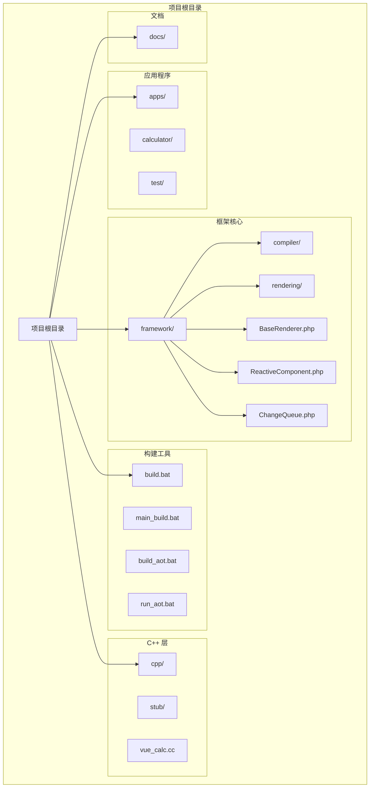
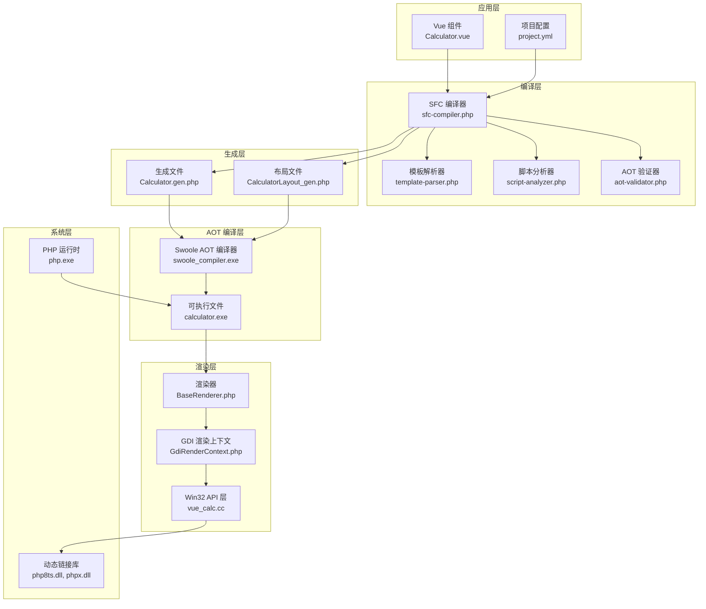
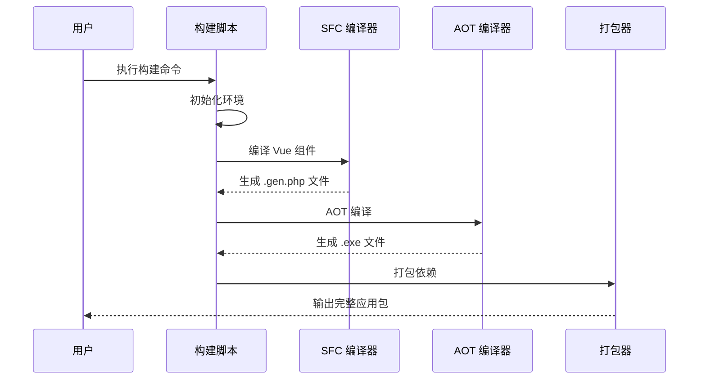
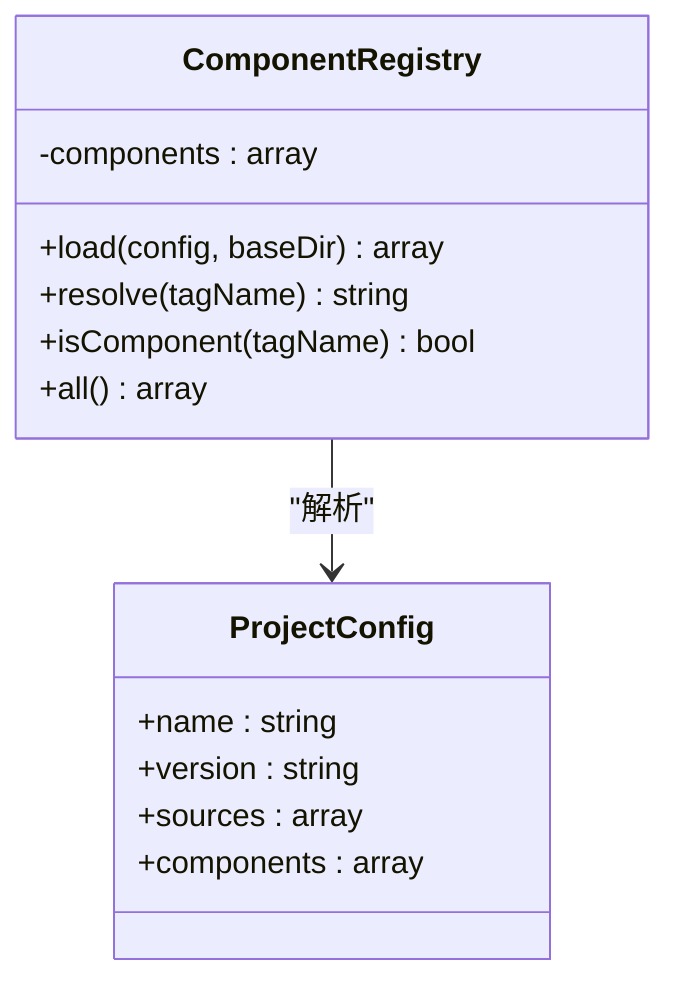
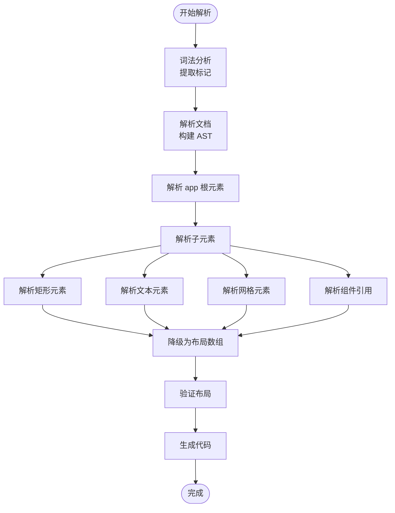
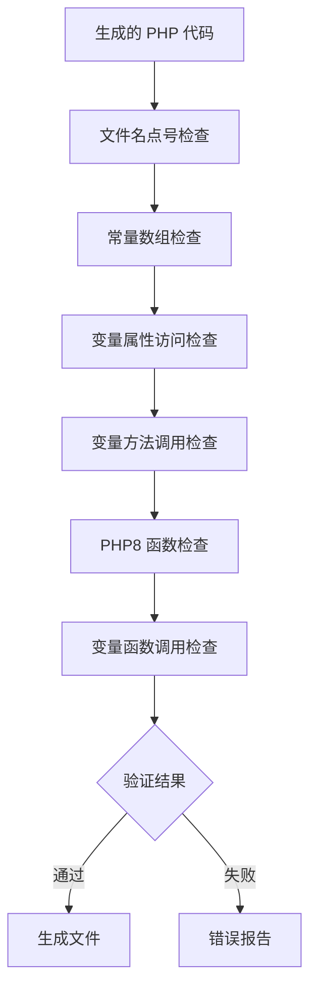
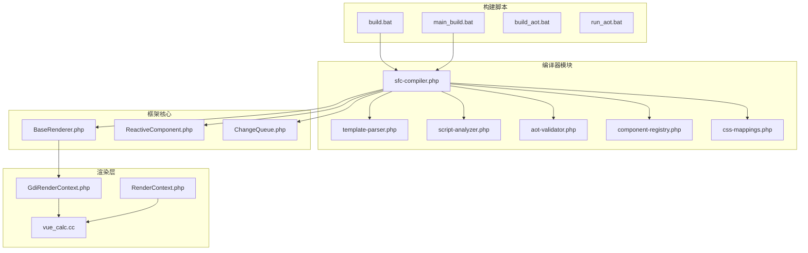

# 构建系统

<cite>
**本文档引用的文件**
- [build.bat](file://build.bat)
- [main_build.bat](file://main_build.bat)
- [build_aot.bat](file://build_aot.bat)
- [run_aot.bat](file://run_aot.bat)
- [sfc-compiler.php](file://framework/sfc-compiler.php)
- [template-parser.php](file://framework/compiler/template-parser.php)
- [aot-validator.php](file://framework/compiler/aot-validator.php)
- [script-analyzer.php](file://framework/compiler/script-analyzer.php)
- [component-registry.php](file://framework/compiler/component-registry.php)
- [css-mappings.php](file://framework/compiler/css-mappings.php)
- [calculator project.yml](file://apps/calculator/project.yml)
- [test project.yml](file://apps/test/project.yml)
- [vue_calc.cc](file://cpp/vue_calc.cc)
</cite>

## 目录
1. [简介](#简介)
2. [项目结构](#项目结构)
3. [核心组件](#核心组件)
4. [架构概览](#架构概览)
5. [详细组件分析](#详细组件分析)
6. [依赖关系分析](#依赖关系分析)
7. [性能考虑](#性能考虑)
8. [故障排除指南](#故障排除指南)
9. [结论](#结论)

## 简介

Vue-Calc 是一个基于 Swoole AOT 编译器的 Vue-like 单文件组件桌面应用程序框架。该构建系统提供了完整的开发到部署流水线，包括 Vue 组件编译、AOT 编译、打包和运行验证。

该系统的核心目标是将 Vue 风格的单文件组件转换为高性能的本地桌面应用程序，通过 Swoole AOT 编译器将 PHP 代码编译为原生可执行文件，并结合 C++ 渲染层实现跨平台的桌面应用开发。

## 项目结构

项目采用模块化的目录结构，主要分为以下几个核心部分：

**图表来源**
- [项目结构图:1-350](file://build.bat#L1-L350)
- [框架结构图:1-567](file://framework/sfc-compiler.php#L1-L567)

**章节来源**
- [build.bat:1-350](file://build.bat#L1-L350)
- [main_build.bat:1-404](file://main_build.bat#L1-L404)

## 核心组件

### 构建脚本系统

构建系统包含多个批处理脚本，每个都有特定的功能和用途：

#### 主构建脚本 (main_build.bat)
提供交互式的应用构建体验，支持多应用选择和循环构建。

#### 非交互式构建脚本 (build.bat)
自动化构建流程，适合 CI/CD 环境使用。

#### AOT 编译脚本
专门用于 AOT 编译过程的简化脚本。

### 编译器核心

#### SFC 编译器 (sfc-compiler.php)
负责将 Vue 单文件组件转换为 PHP 生成文件，包含完整的编译流水线。

#### 模板解析器 (template-parser.php)
实现递归下降解析算法，将模板字符串转换为抽象语法树。

#### AOT 验证器 (aot-validator.php)
在生成代码写入磁盘前进行 AOT 兼容性验证。

**章节来源**
- [sfc-compiler.php:1-567](file://framework/sfc-compiler.php#L1-L567)
- [template-parser.php:1-869](file://framework/compiler/template-parser.php#L1-L869)
- [aot-validator.php:1-207](file://framework/compiler/aot-validator.php#L1-L207)

## 架构概览

构建系统采用分层架构设计，从上到下分为应用层、编译层、渲染层和系统层：

**图表来源**
- [构建架构图:1-567](file://framework/sfc-compiler.php#L1-L567)
- [编译流程图:1-350](file://build.bat#L1-L350)

## 详细组件分析

### 构建流水线

构建系统实现了完整的端到端流水线，包含四个主要阶段：

#### 阶段 0：MSVC 环境准备
- 初始化 Visual Studio 命令提示
- 验证 cl.exe 可用性
- 设置编译器环境变量

#### 阶段 1：SFC 编译 (可选)
- 解析 Vue 组件文件
- 提取模板、脚本和样式块
- 生成布局数组和 PHP 类文件

#### 阶段 2：AOT 编译
- 使用 swoole_compiler.exe 编译 PHP 到原生代码
- 验证生成的可执行文件
- 复制必要的 DLL 文件

#### 阶段 3：打包和验证
- 创建输出目录结构
- 复制可执行文件和依赖库
- 可选的运行时验证测试

**图表来源**
- [构建流程序列图:177-350](file://build.bat#L177-L350)
- [SFC 编译序列图:240-567](file://framework/sfc-compiler.php#L240-L567)

**章节来源**
- [build.bat:177-350](file://build.bat#L177-L350)
- [main_build.bat:229-383](file://main_build.bat#L229-L383)

### SFC 编译器架构

SFC 编译器实现了完整的编译流水线，包含以下关键组件：

#### 组件注册表 (ComponentRegistry)
管理自定义组件标签到源文件的映射关系：

**图表来源**
- [组件注册表类图:14-70](file://framework/compiler/component-registry.php#L14-L70)

#### 模板解析器 (TemplateParser)
实现递归下降解析算法，支持复杂的模板语法：

**图表来源**
- [模板解析流程图:88-686](file://framework/compiler/template-parser.php#L88-L686)

#### CSS 映射系统
将 CSS 样式属性转换为渲染参数：

| CSS 属性 | 输出键 | 解析函数 | 默认值 |
|---------|--------|----------|--------|
| background | bg | parseHexColor | 0 |
| color | fg | parseHexColor | 0xFFFFFF |
| font-size | fontSize | parsePixels | 16 |
| font-weight | bold | parseFontWeight | 0 |
| border-radius | borderRadius | parsePixels | 0 |
| padding | padding | parsePixels | 0 |
| margin | margin | parsePixels | 0 |
| text-align | textAlign | parseTextAlign | 'left' |

**章节来源**
- [css-mappings.php:1-210](file://framework/compiler/css-mappings.php#L1-L210)
- [template-parser.php:557-686](file://framework/compiler/template-parser.php#L557-L686)

### AOT 验证系统

AOT 验证器确保生成的代码符合 Swoole AOT 编译器的要求：

**图表来源**
- [AOT 验证流程图:37-121](file://framework/compiler/aot-validator.php#L37-L121)

**章节来源**
- [aot-validator.php:37-121](file://framework/compiler/aot-validator.php#L37-L121)

## 依赖关系分析

构建系统中的组件依赖关系如下：

**图表来源**
- [依赖关系图:20-29](file://framework/sfc-compiler.php#L20-L29)
- [构建脚本依赖图:46-69](file://build.bat#L46-L69)

**章节来源**
- [framework/sfc-compiler.php:20-29](file://framework/sfc-compiler.php#L20-L29)
- [build.bat:46-69](file://build.bat#L46-L69)

## 性能考虑

### 编译性能优化

1. **增量编译支持**：SFC 编译器支持生成文件的自动脏检测，避免不必要的重新编译。

2. **并行处理**：构建脚本支持多应用并行构建，提高整体编译效率。

3. **缓存机制**：生成的 .gen.php 文件可以作为缓存，减少重复编译时间。

### 运行时性能

1. **AOT 编译优势**：通过静态编译消除了 PHP 解释开销，提供接近原生应用的性能。

2. **内存管理**：使用 C++ 渲染层进行底层资源管理，减少内存碎片。

3. **渲染优化**：GDI 双缓冲技术减少闪烁，提升用户体验。

## 故障排除指南

### 常见构建错误

#### SFC 编译失败
- **症状**：SFC 编译步骤返回非零退出码
- **原因**：Vue 组件语法错误或缺少必需的模板块
- **解决方案**：检查 Vue 文件的语法完整性，确保包含完整的 `<template>`、`<script>` 和 `<style>` 块

#### AOT 编译失败
- **症状**：AOT 编译返回错误码 3
- **常见原因**：
  1. MSVC 编译器未找到 (`cl.exe`)
  2. 顶层可执行语句（必须在函数或类内部）
  3. 变量先使用后定义
  4. 变量类型改变
  5. 文件名包含特殊字符

#### 打包失败
- **症状**：打包步骤返回错误码 4
- **原因**：复制可执行文件或 DLL 失败
- **解决方案**：检查输出目录权限和磁盘空间

### 调试技巧

1. **启用详细日志**：使用 `--dump-ast` 参数查看 AST 转储信息
2. **逐步验证**：分别运行 SFC 和 AOT 步骤，定位具体失败环节
3. **检查生成文件**：验证 `.gen.php` 文件的内容和格式

**章节来源**
- [build.bat:190-270](file://build.bat#L190-L270)
- [main_build.bat:244-331](file://main_build.bat#L244-L331)

## 结论

Vue-Calc 构建系统提供了一个完整、高效的 Vue-like 单文件组件桌面应用开发解决方案。通过精心设计的分层架构和严格的验证机制，该系统能够：

1. **简化开发流程**：从 Vue 组件到原生可执行文件的完整自动化
2. **保证代码质量**：通过 AOT 验证确保生成代码的兼容性
3. **提升性能表现**：利用 AOT 编译和优化的渲染层实现高性能应用
4. **增强可维护性**：清晰的模块划分和完善的错误处理机制

该构建系统为桌面应用开发提供了一个现代化的解决方案，特别适合需要快速原型开发和高性能要求的应用场景。通过持续的优化和扩展，该系统将继续为开发者提供更好的开发体验和更优秀的应用性能。