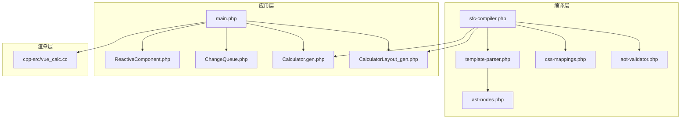
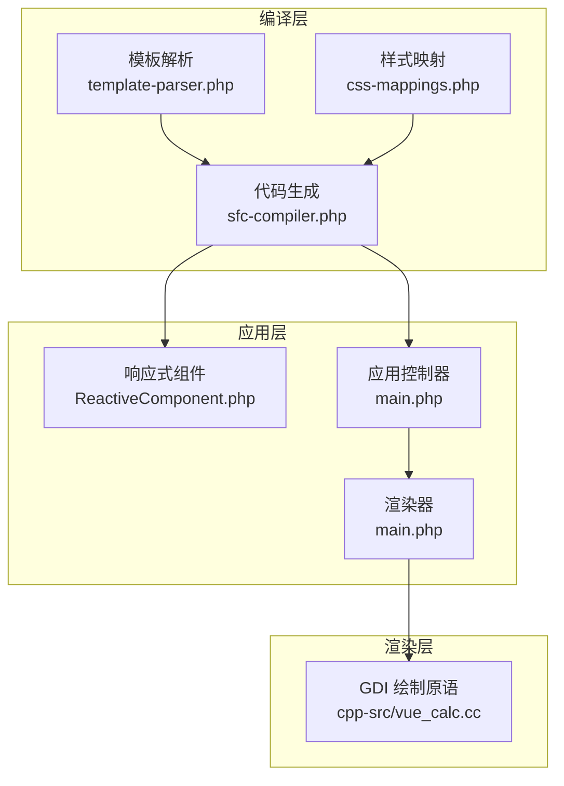
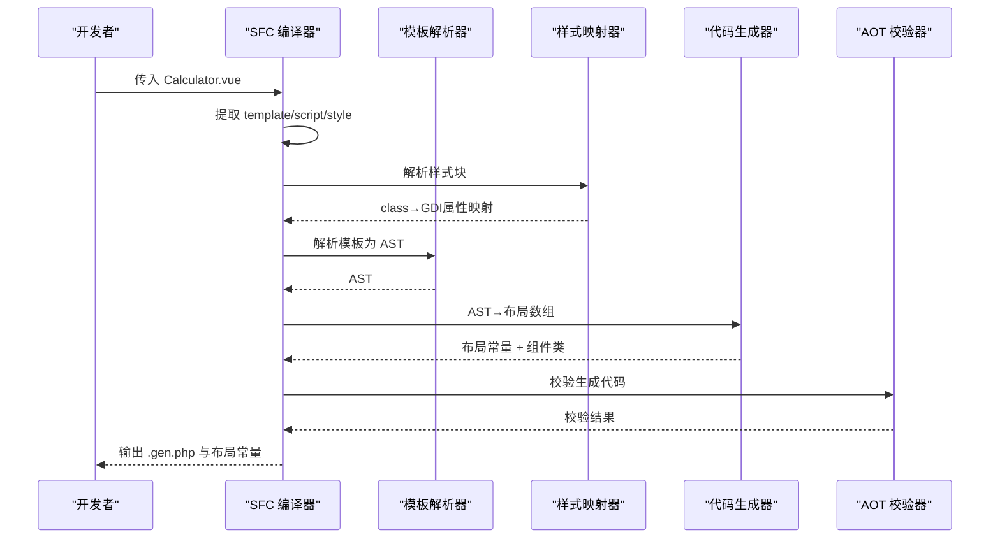
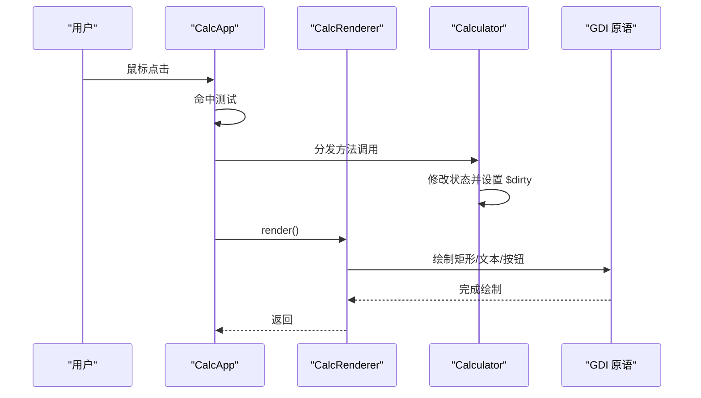
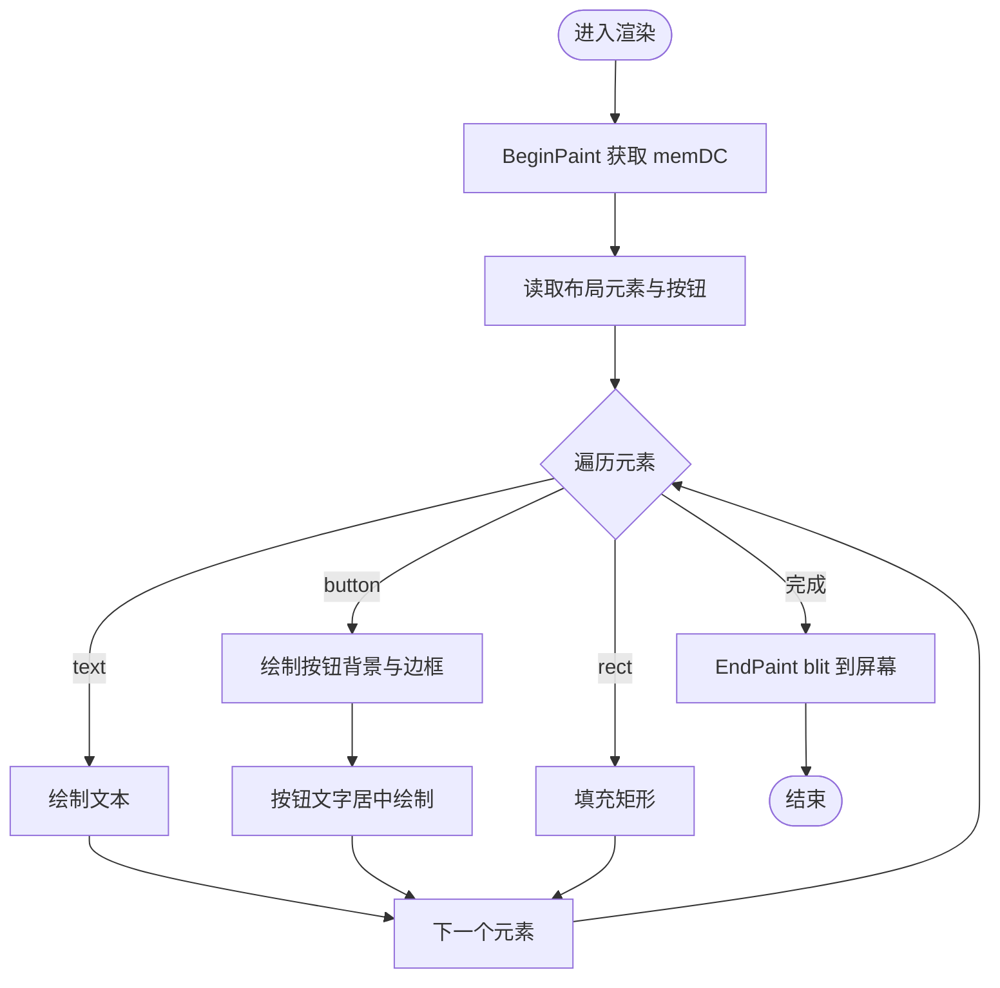
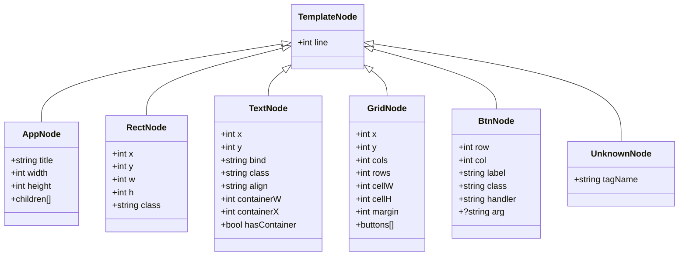
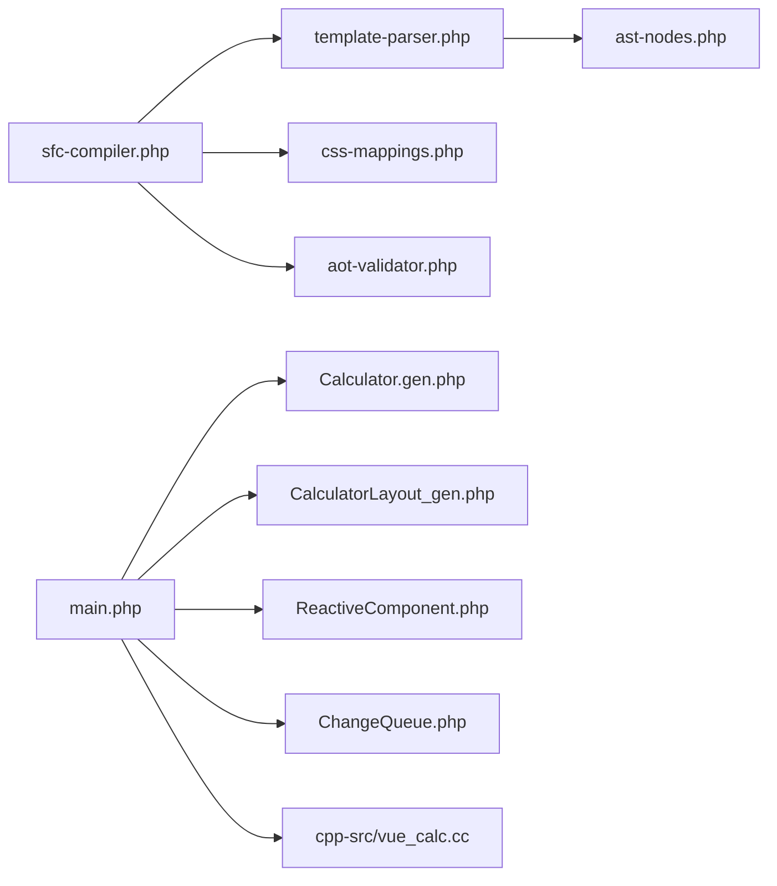

# 分层架构设计

<cite>
**本文引用的文件列表**
- [main.php](file://main.php)
- [Calculator.vue](file://src/Calculator.vue)
- [Calculator.gen.php](file://src/Calculator.gen.php)
- [CalculatorLayout_gen.php](file://src/CalculatorLayout_gen.php)
- [ReactiveComponent.php](file://src/ReactiveComponent.php)
- [ChangeQueue.php](file://src/ChangeQueue.php)
- [sfc-compiler.php](file://tools/sfc-compiler.php)
- [template-parser.php](file://tools/compiler/template-parser.php)
- [css-mappings.php](file://tools/compiler/css-mappings.php)
- [ast-nodes.php](file://tools/compiler/ast-nodes.php)
- [aot-validator.php](file://tools/compiler/aot-validator.php)
- [vue_calc.cc](file://cpp-src/vue_calc.cc)
- [sfc-compiler-test.php](file://tests/sfc-compiler-test.php)
</cite>

## 目录
1. [引言](#引言)
2. [项目结构](#项目结构)
3. [核心组件](#核心组件)
4. [架构总览](#架构总览)
5. [详细组件分析](#详细组件分析)
6. [依赖关系分析](#依赖关系分析)
7. [性能考量](#性能考量)
8. [故障排查指南](#故障排查指南)
9. [结论](#结论)
10. [附录](#附录)

## 引言
本项目通过“分层架构”实现从 .vue 单文件组件到可执行程序的完整流水线：
- 编译层：将 .vue 模板解析为布局数据与组件类代码，确保 AOT 兼容性。
- 应用层：以响应式组件为核心，承载业务逻辑与事件处理。
- 渲染层：基于布局数据与组件状态，驱动 C++ GDI 绘制。

该设计实现了“数据驱动”的界面更新与“事件驱动”的交互处理，同时保持跨语言边界清晰、职责分离明确。

## 项目结构
项目采用按职责分层的组织方式：
- tools：编译器工具链（模板解析、样式映射、AOT 校验）
- src：运行时组件与生成文件（响应式基类、布局常量、组件类）
- cpp-src：C++ GDI 绘制原语封装
- tests：编译器与流水线集成测试
- main.php：应用入口与渲染循环

图表来源
- [sfc-compiler.php:1-210](file://tools/sfc-compiler.php#L1-L210)
- [template-parser.php:1-680](file://tools/compiler/template-parser.php#L1-L680)
- [css-mappings.php:1-210](file://tools/compiler/css-mappings.php#L1-L210)
- [ast-nodes.php:1-153](file://tools/compiler/ast-nodes.php#L1-L153)
- [aot-validator.php:1-169](file://tools/compiler/aot-validator.php#L1-L169)
- [ReactiveComponent.php:1-35](file://src/ReactiveComponent.php#L1-L35)
- [ChangeQueue.php:1-57](file://src/ChangeQueue.php#L1-L57)
- [Calculator.gen.php:1-174](file://src/Calculator.gen.php#L1-L174)
- [CalculatorLayout_gen.php:1-296](file://src/CalculatorLayout_gen.php#L1-L296)
- [main.php:1-291](file://main.php#L1-L291)
- [vue_calc.cc:1-157](file://cpp-src/vue_calc.cc#L1-L157)

章节来源
- [main.php:1-291](file://main.php#L1-L291)
- [sfc-compiler.php:1-210](file://tools/sfc-compiler.php#L1-L210)

## 核心组件
- 编译器主控：负责块提取、样式解析、模板解析、AST 降级、AOT 校验与代码生成。
- 响应式组件基类：提供脏标记与全局变更队列，子类通过手动设置 $dirty 触发重绘。
- 渲染器：从布局数据与组件状态读取，调用 C++ GDI 原语进行绘制。
- 应用控制器：事件循环、消息处理、点击命中测试与方法分发。
- C++ GDI 层：封装 Win32 窗口与 GDI 绘制原语，提供双缓冲绘制能力。

章节来源
- [ReactiveComponent.php:1-35](file://src/ReactiveComponent.php#L1-L35)
- [ChangeQueue.php:1-57](file://src/ChangeQueue.php#L1-L57)
- [main.php:26-259](file://main.php#L26-L259)
- [vue_calc.cc:1-157](file://cpp-src/vue_calc.cc#L1-L157)

## 架构总览
分层架构的职责划分如下：
- 编译层
  - 解析 .vue 的 template/script/style 块
  - 将模板解析为 AST，并降级为布局数组（元素与按钮）
  - 将样式映射为 GDI 参数（颜色、字号、粗细等）
  - 生成布局常量文件与组件类文件，并进行 AOT 校验
- 应用层
  - ReactiveComponent 提供脏标记与共享队列
  - 组件类承载业务逻辑（如计算器），修改状态后设置 $dirty
  - 应用控制器负责事件循环、消息处理与方法分发
- 渲染层
  - 渲染器遍历布局数组，结合组件状态进行绘制
  - C++ 层提供窗口创建、消息循环、双缓冲与 GDI 绘制原语

图表来源
- [template-parser.php:79-541](file://tools/compiler/template-parser.php#L79-L541)
- [css-mappings.php:164-194](file://tools/compiler/css-mappings.php#L164-L194)
- [sfc-compiler.php:133-207](file://tools/sfc-compiler.php#L133-L207)
- [ReactiveComponent.php:11-34](file://src/ReactiveComponent.php#L11-L34)
- [main.php:26-133](file://main.php#L26-L133)
- [vue_calc.cc:36-157](file://cpp-src/vue_calc.cc#L36-L157)

## 详细组件分析

### 编译层：SFC 编译器流水线
- 模块职责
  - 块提取：从 .vue 中抽取 template/script/style
  - 样式解析：将 CSS class 映射为 GDI 属性
  - 模板解析：递归下降解析为 AST
  - AST 降级：生成布局数组（元素与按钮）
  - AOT 校验：检查生成代码是否满足 AOT 约束
  - 代码生成：输出布局常量与组件类文件
- 关键接口
  - getLayout()：返回窗口尺寸与布局数组
  - 组件类继承 ReactiveComponent 并暴露业务方法
- 数据传递
  - 模板解析器输出 AST，再降级为布局数组
  - 样式映射器输出 class→属性映射，用于布局数组生成
  - AOT 校验器对生成代码进行约束检查

图表来源
- [sfc-compiler.php:47-207](file://tools/sfc-compiler.php#L47-L207)
- [template-parser.php:79-541](file://tools/compiler/template-parser.php#L79-L541)
- [css-mappings.php:164-194](file://tools/compiler/css-mappings.php#L164-L194)
- [aot-validator.php:36-106](file://tools/compiler/aot-validator.php#L36-L106)

章节来源
- [sfc-compiler.php:1-210](file://tools/sfc-compiler.php#L1-L210)
- [template-parser.php:1-680](file://tools/compiler/template-parser.php#L1-L680)
- [css-mappings.php:1-210](file://tools/compiler/css-mappings.php#L1-L210)
- [aot-validator.php:1-169](file://tools/compiler/aot-validator.php#L1-L169)

### 应用层：响应式组件与事件处理
- 响应式组件基类
  - 提供 $dirty 脏标记与全局变更队列
  - 子类通过直接属性赋值后设置 $dirty 触发重绘
- 应用控制器
  - 初始化窗口与渲染器
  - 事件循环：轮询消息，命中按钮区域后分发到组件方法
  - 仅在 $dirty 为真时触发渲染
- 渲染器
  - 从布局常量读取元素与按钮信息
  - 根据组件状态绑定渲染文本与按钮
  - 使用 C++ GDI 原语绘制矩形、文本与按钮

图表来源
- [main.php:139-259](file://main.php#L139-L259)
- [main.php:26-133](file://main.php#L26-L133)
- [Calculator.gen.php:29-168](file://src/Calculator.gen.php#L29-L168)
- [vue_calc.cc:90-157](file://cpp-src/vue_calc.cc#L90-L157)

章节来源
- [ReactiveComponent.php:1-35](file://src/ReactiveComponent.php#L1-L35)
- [main.php:1-291](file://main.php#L1-L291)
- [Calculator.gen.php:1-174](file://src/Calculator.gen.php#L1-L174)

### 渲染层：C++ GDI 绘制
- 职责
  - 封装 Win32 窗口与消息循环
  - 提供双缓冲绘制：BeginPaint/EndPaint
  - 提供绘制原语：填充矩形、绘制文本、绘制按钮（含边框）
- 接口契约
  - 通过 PHP 扩展导出函数与常量，供应用层调用
  - 渲染器仅负责读取布局与状态，不关心具体绘制细节

图表来源
- [main.php:99-132](file://main.php#L99-L132)
- [vue_calc.cc:90-157](file://cpp-src/vue_calc.cc#L90-L157)

章节来源
- [vue_calc.cc:1-157](file://cpp-src/vue_calc.cc#L1-L157)
- [main.php:26-133](file://main.php#L26-L133)

### 模板解析器：AST 与布局降级
- 词法与语法
  - Token 化：识别标签、注释、文本
  - 递归下降：解析 <app>/<rect>/<text>/<grid>/<btn> 等节点
  - 错误收集：保留行号，未知标签生成 UnknownNode
- AST 降级
  - 将 AST 转换为布局数组：元素（rect/text）与按钮（含坐标、颜色、处理器）
  - 在编译期计算按钮坐标，减少运行时开销

图表来源
- [ast-nodes.php:9-153](file://tools/compiler/ast-nodes.php#L9-L153)
- [template-parser.php:205-541](file://tools/compiler/template-parser.php#L205-L541)

章节来源
- [template-parser.php:1-680](file://tools/compiler/template-parser.php#L1-L680)
- [ast-nodes.php:1-153](file://tools/compiler/ast-nodes.php#L1-L153)

### 样式映射器：CSS 到 GDI 的桥梁
- 支持属性
  - background → bg（BGR 整数）
  - color → fg（BGR 整数）
  - font-size → fontSize（像素）
  - font-weight → bold（0/1）
  - 扩展项：border-radius、padding、margin、text-align
- 工具函数
  - hexToBgr：十六进制颜色转 BGR
  - borderColor：基于背景色推导边框色
  - parseStyleBlock：解析样式块为 class→属性映射

章节来源
- [css-mappings.php:1-210](file://tools/compiler/css-mappings.php#L1-L210)

### AOT 校验器：生成代码合规性检查
- 约束规则
  - 文件名点数限制：防止无效 C++ 符号名
  - 禁止 const 嵌套数组：全局常量未注册
  - 禁止变量属性访问与变量方法调用：AOT 不支持
  - 警告 PHP8 函数：str_contains 等需替换
- 报告输出
  - 错误：阻止写盘
  - 警告：提示潜在兼容性问题

章节来源
- [aot-validator.php:1-169](file://tools/compiler/aot-validator.php#L1-L169)

## 依赖关系分析
- 编译层内部依赖
  - sfc-compiler.php 依赖 template-parser.php、css-mappings.php、aot-validator.php
  - template-parser.php 依赖 ast-nodes.php
- 运行时依赖
  - main.php 依赖 Calculator.gen.php、CalculatorLayout_gen.php、ReactiveComponent.php、ChangeQueue.php、cpp-src/vue_calc.cc
  - 渲染器依赖布局常量与组件状态
- 跨语言依赖
  - PHP 通过扩展调用 C++ GDI 原语

图表来源
- [sfc-compiler.php:19-24](file://tools/sfc-compiler.php#L19-L24)
- [template-parser.php:16-16](file://tools/compiler/template-parser.php#L16-L16)
- [ast-nodes.php:1-8](file://tools/compiler/ast-nodes.php#L1-L8)
- [main.php:1-291](file://main.php#L1-L291)
- [Calculator.gen.php:1-174](file://src/Calculator.gen.php#L1-L174)
- [CalculatorLayout_gen.php:1-296](file://src/CalculatorLayout_gen.php#L1-L296)
- [ReactiveComponent.php:1-35](file://src/ReactiveComponent.php#L1-L35)
- [ChangeQueue.php:1-57](file://src/ChangeQueue.php#L1-L57)
- [vue_calc.cc:1-157](file://cpp-src/vue_calc.cc#L1-L157)

章节来源
- [sfc-compiler.php:1-210](file://tools/sfc-compiler.php#L1-L210)
- [template-parser.php:1-680](file://tools/compiler/template-parser.php#L1-L680)
- [main.php:1-291](file://main.php#L1-L291)

## 性能考量
- 编译期优化
  - 模板解析与布局降级在编译期完成，运行时仅做数据读取与绘制
  - 按钮坐标在编译期计算，避免运行时重复计算
- 渲染优化
  - 仅在 $dirty 为真时触发渲染，降低 CPU/GPU 占用
  - 双缓冲绘制减少闪烁
- 内存与队列
  - 变更队列采用环形缓冲，避免频繁分配与拷贝

章节来源
- [main.php:213-224](file://main.php#L213-L224)
- [ChangeQueue.php:1-57](file://src/ChangeQueue.php#L1-L57)
- [vue_calc.cc:90-117](file://cpp-src/vue_calc.cc#L90-L117)

## 故障排查指南
- 编译失败
  - 检查模板是否包含 <app> 根节点与必需属性（width/height）
  - 确认 <grid> 内仅包含 <btn>，且 <btn> 必须指定 @click 与 label
  - 样式类必须包含 background/color 等必要属性
- AOT 校验失败
  - 文件名中“.”过多会导致符号名非法
  - 避免 const 嵌套数组、变量属性/方法访问、PHP8 函数
- 运行时问题
  - 确保组件在状态变更后设置 $dirty
  - 检查布局常量是否正确生成（WINDOW_WIDTH/WINDOW_HEIGHT）

章节来源
- [template-parser.php:205-450](file://tools/compiler/template-parser.php#L205-L450)
- [aot-validator.php:36-106](file://tools/compiler/aot-validator.php#L36-L106)
- [main.php:213-224](file://main.php#L213-L224)

## 结论
该分层架构通过“编译期确定布局、运行期数据驱动渲染”的模式，实现了高性能、可维护的桌面应用。编译层保证了 AOT 兼容性与布局稳定性；应用层以响应式组件为核心，简化了状态管理与事件处理；渲染层专注于绘制原语，职责单一、易于扩展。整体设计在保持跨语言边界清晰的同时，提供了良好的扩展点与限制，便于后续演进。

## 附录
- 扩展点
  - 编译层：新增 CSS 属性映射、模板节点类型、AOT 约束
  - 应用层：增加更多响应式组件类型、变更队列策略
  - 渲染层：引入更多 GDI/Direct2D 原语、双缓冲策略优化
- 限制
  - AOT 不支持变量属性/方法访问与某些 PHP8 函数
  - 布局常量需通过函数返回而非 const 数组
  - 文件名中“.”数量受限，避免无效 C++ 符号名