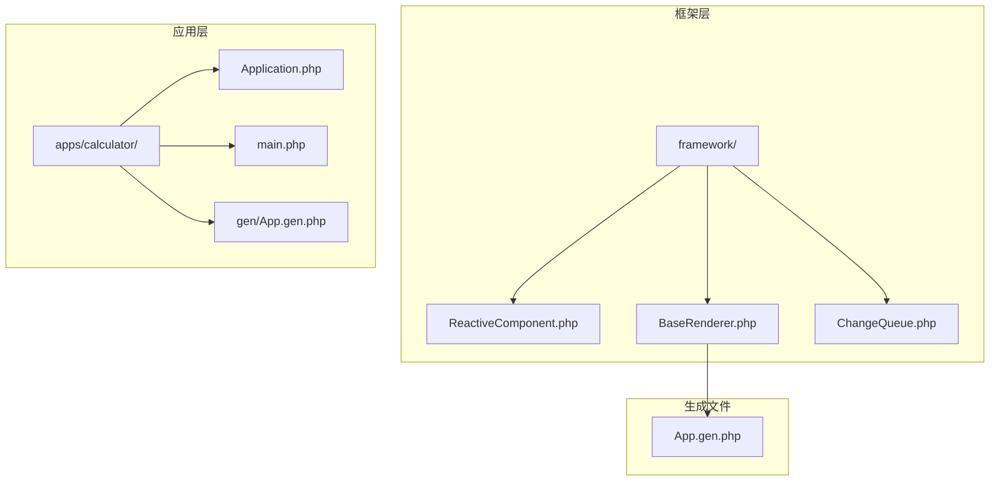
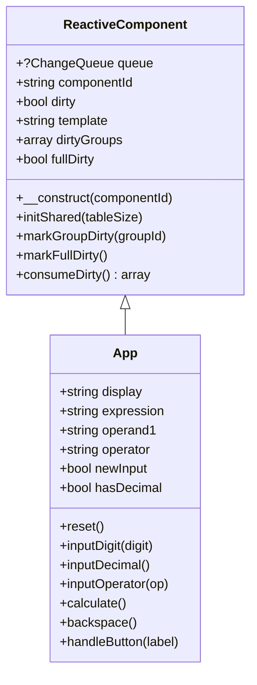
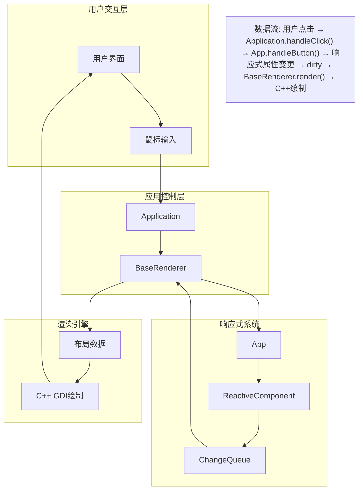
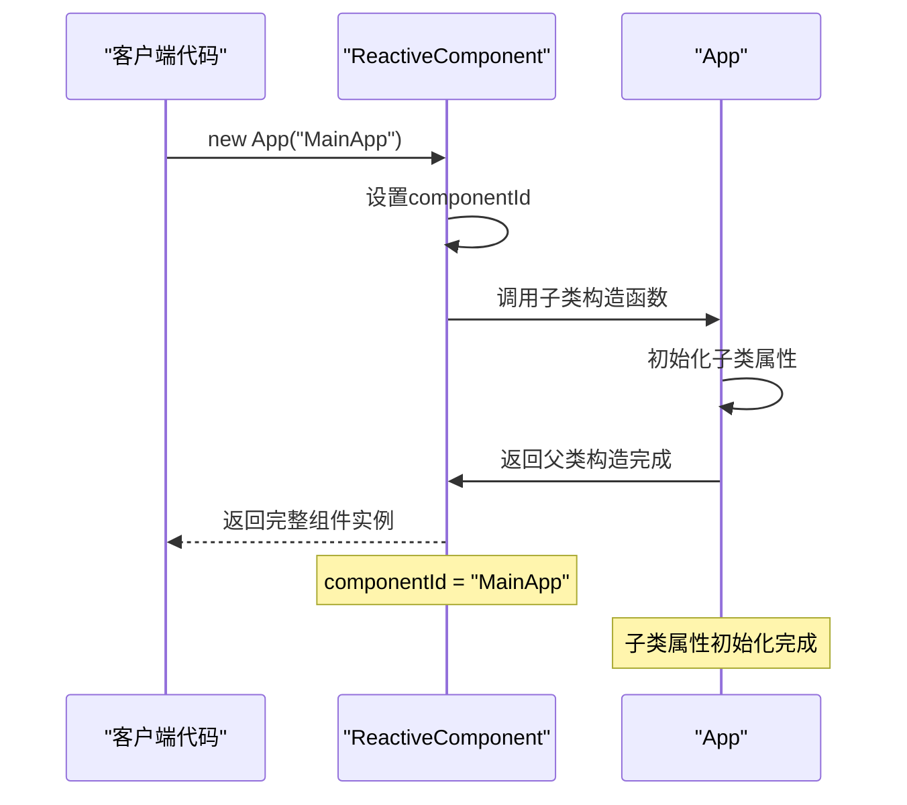
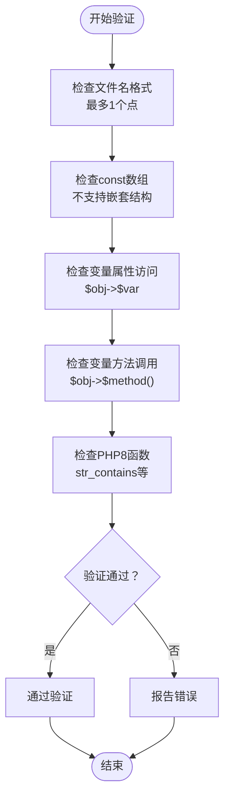
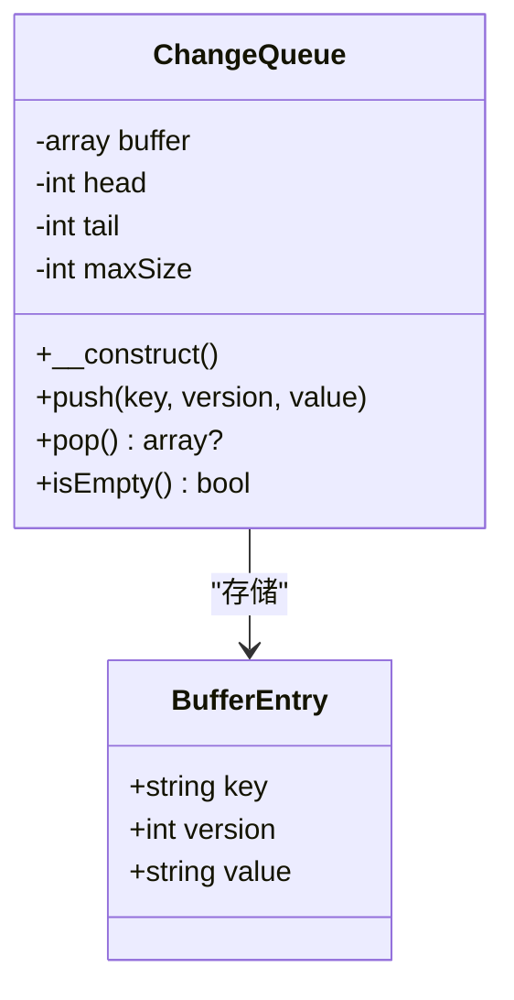
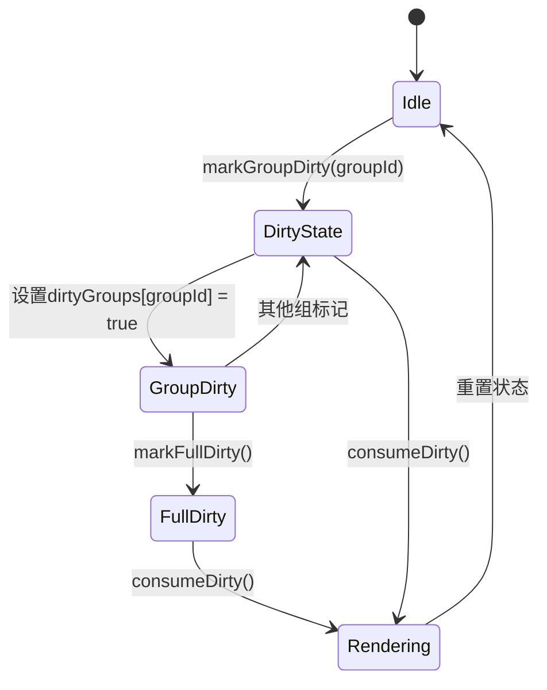
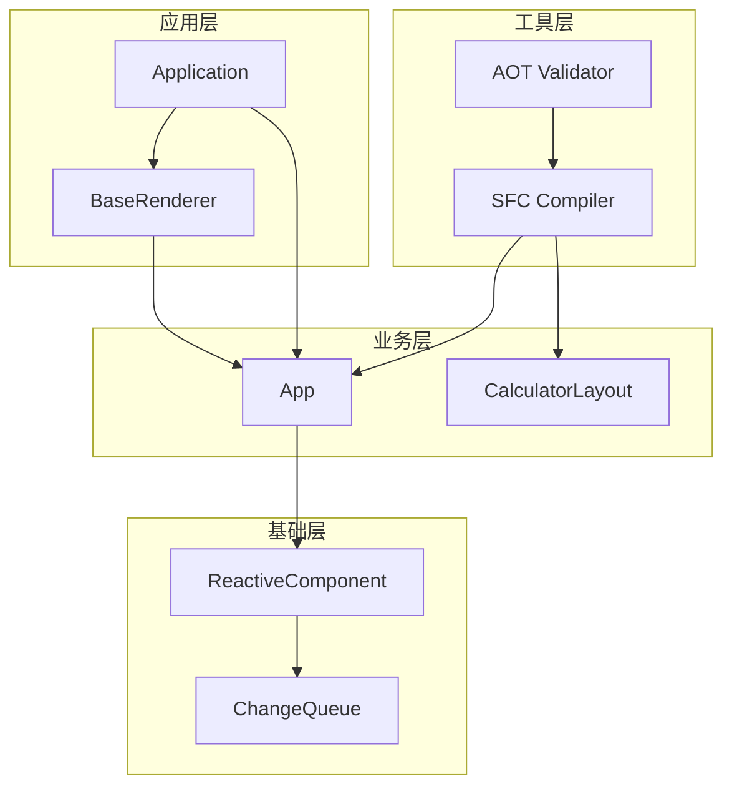

# ReactiveComponent基类设计

<cite>
**本文档引用的文件**
- [ReactiveComponent.php](file://framework/ReactiveComponent.php)
- [BaseRenderer.php](file://framework/BaseRenderer.php)
- [ChangeQueue.php](file://framework/ChangeQueue.php)
- [Application.php](file://apps/calculator/Application.php)
- [main.php](file://apps/calculator/main.php)
- [App.gen.php](file://apps/calculator/gen/App.gen.php)
</cite>

## 更新摘要
**变更内容**
- 新增组级脏标记追踪功能，包括`$dirtyGroups`和`$fullDirty`属性
- 添加`markGroupDirty()`、`markFullDirty()`和`consumeDirty()`方法
- 更新渲染器以支持新的脏状态消费机制
- 增强响应式系统以支持增量渲染的准备工作

## 目录
1. [简介](#简介)
2. [项目结构](#项目结构)
3. [核心组件](#核心组件)
4. [架构概览](#架构概览)
5. [详细组件分析](#详细组件分析)
6. [组级脏标记追踪系统](#组级脏标记追踪系统)
7. [依赖关系分析](#依赖关系分析)
8. [性能考虑](#性能考虑)
9. [故障排除指南](#故障排除指南)
10. [结论](#结论)

## 简介

ReactiveComponent是Vue-Calc项目中的响应式组件基类，专门为Swoole AOT编译器优化设计。该基类采用了AOT兼容的静态属性而非魔术方法的设计理念，通过明确的属性声明和手动脏标记机制实现了高效的响应式系统。

Vue-Calc是一个基于单文件组件(SFC)模式的桌面计算器应用，采用"逻辑PHP + C++ GDI渲染"的混合架构。ReactiveComponent作为整个响应式系统的核心，为所有UI组件提供了统一的状态管理和变更通知机制。

**最新更新**：基类现已支持组级脏标记追踪，为未来的增量渲染提供基础支持。

## 项目结构

Vue-Calc项目采用模块化的文件组织方式，主要包含以下关键目录和文件：



**图表来源**
- [ReactiveComponent.php:1-65](file://framework/ReactiveComponent.php#L1-L65)
- [BaseRenderer.php:1-151](file://framework/BaseRenderer.php#L1-L151)

**章节来源**
- [ReactiveComponent.php:1-65](file://framework/ReactiveComponent.php#L1-L65)
- [BaseRenderer.php:1-151](file://framework/BaseRenderer.php#L1-L151)

## 核心组件

### ReactiveComponent基类设计

ReactiveComponent基类采用了精心设计的架构决策，主要体现在以下几个方面：

#### 设计理念

基类采用了"AOT兼容的静态属性"而非"魔术方法"的设计理念。这种设计选择是基于Swoole AOT编译器的特殊要求和限制：

- **静态属性声明**：子类必须明确声明所有响应式属性
- **手动脏标记**：通过显式的`$this->dirty = true`触发重绘
- **无魔术方法**：避免使用`__get/__set`等魔术方法，确保AOT编译兼容性

#### 核心成员变量



**图表来源**
- [ReactiveComponent.php:11-65](file://framework/ReactiveComponent.php#L11-L65)
- [App.gen.php:9-262](file://apps/calculator/gen/App.gen.php#L9-L262)

**章节来源**
- [ReactiveComponent.php:11-65](file://framework/ReactiveComponent.php#L11-L65)
- [App.gen.php:9-262](file://apps/calculator/gen/App.gen.php#L9-L262)

## 架构概览

Vue-Calc的整体架构采用"数据驱动渲染"的设计模式，实现了清晰的职责分离：



**图表来源**
- [Application.php:43-98](file://apps/calculator/Application.php#L43-L98)
- [ReactiveComponent.php:11-65](file://framework/ReactiveComponent.php#L11-L65)

**章节来源**
- [Application.php:43-98](file://apps/calculator/Application.php#L43-L98)
- [ReactiveComponent.php:11-65](file://framework/ReactiveComponent.php#L11-L65)

## 详细组件分析

### ReactiveComponent基类详解

#### 成员变量设计

ReactiveComponent基类包含了六个核心成员变量，每个都有特定的作用机制：

**1. $queue全局变更队列**
- 类型：`protected ?ChangeQueue`
- 作用：存储所有组件的变更通知
- 初始化：通过`initShared()`静态方法进行
- 生命周期：进程级单例，所有组件共享

**2. $componentId组件标识**
- 类型：`protected string`
- 作用：唯一标识当前组件实例
- 默认值：如果未指定则使用类名
- 用途：用于组件识别和调试

**3. $dirty脏标记**
- 类型：`public bool`
- 作用：指示组件状态是否需要重绘
- 触发机制：每次状态变更后设置为`true`
- 消费机制：渲染循环检查此标志决定是否重绘

**4. $template模板路径**
- 类型：`public string`
- 作用：可选的模板文件路径
- 设计：为未来可能的模板系统预留接口

**5. $dirtyGroups组级脏标记**
- 类型：`protected array`
- 作用：跟踪特定UI组的脏状态
- 设计：键为组ID，值为布尔标记
- 用途：支持增量渲染的分组机制

**6. $fullDirty全量脏标记**
- 类型：`protected bool`
- 作用：标记是否需要全量重绘
- 设计：默认为true，确保首次渲染
- 用途：支持全量重绘和增量渲染的切换

#### 构造函数初始化流程



**图表来源**
- [ReactiveComponent.php:31-34](file://framework/ReactiveComponent.php#L31-L34)
- [App.gen.php:258-262](file://apps/calculator/gen/App.gen.php#L258-L262)

#### 静态初始化方法initShared

`initShared()`方法负责初始化响应式系统的全局基础设施：

**工作原理：**
1. 创建新的`ChangeQueue`实例
2. 设置静态`$queue`属性
3. 支持自定义队列大小参数
4. 为所有后续组件实例提供共享的变更通知机制

**配置选项：**
- `tableSize`: 队列缓冲区大小，默认10240
- 内存管理：环形缓冲区实现，支持高效的数据存储和检索

**章节来源**
- [ReactiveComponent.php:36-39](file://framework/ReactiveComponent.php#L36-L39)
- [ChangeQueue.php:18-56](file://framework/ChangeQueue.php#L18-L56)

### AOT编译器兼容性设计

#### AOT编译器限制分析

Swoole AOT编译器对PHP代码有严格的限制，ReactiveComponent的设计充分考虑了这些限制：

**限制类型及解决方案：**

1. **变量属性访问限制**
   - 问题：`$obj->$var`不被支持
   - 解决：使用显式if/else分支处理

2. **变量方法调用限制**
   - 问题：`$obj->$method()`不被支持  
   - 解决：使用显式路由分发

3. **文件名格式限制**
   - 问题：文件名中不能包含多个点
   - 解决：使用下划线替代点号

4. **PHP8特性限制**
   - 问题：某些PHP8函数不可用
   - 解决：使用兼容的替代方案

#### AOT验证器工作机制



**图表来源**
- [aot-validator.php:36-106](file://tools/compiler/aot-validator.php#L36-L106)

**章节来源**
- [aot-validator.php:17-169](file://tools/compiler/aot-validator.php#L17-L169)

### ChangeQueue变更队列系统

ChangeQueue实现了环形缓冲区的数据结构，为响应式系统提供高效的变更通知机制：

#### 数据结构设计



**图表来源**
- [ChangeQueue.php:11-57](file://framework/ChangeQueue.php#L11-L57)

#### 性能特征

- **时间复杂度**：push/pop均为O(1)
- **空间复杂度**：O(maxSize)
- **内存效率**：环形缓冲区避免内存碎片
- **容量管理**：默认4096个条目，可根据需要调整

**章节来源**
- [ChangeQueue.php:11-57](file://framework/ChangeQueue.php#L11-L57)

### App组件继承示例

App作为ReactiveComponent的具体实现，展示了正确的继承和使用方式：

#### 属性声明模式

App类遵循ReactiveComponent的设计原则：

**属性声明：**
- 明确声明所有响应式属性
- 使用适当的类型注解
- 在构造函数中初始化默认值

**状态变更模式：**
- 每次属性修改后设置`$this->dirty = true`
- 确保渲染循环能够检测到变更
- 避免遗漏脏标记设置

#### 方法实现模式

App的每个公共方法都遵循相同的模式：
1. 修改内部状态
2. 设置脏标记
3. 保持幂等性

**章节来源**
- [App.gen.php:9-262](file://apps/calculator/gen/App.gen.php#L9-L262)

## 组级脏标记追踪系统

### 新增功能概述

ReactiveComponent基类新增了组级脏标记追踪系统，为未来的增量渲染提供基础支持。这一系统包括三个核心组件：

1. **$dirtyGroups** - 组级脏标记映射表
2. **$fullDirty** - 全量重绘标记
3. **相关方法** - 标记和消费脏状态的方法

### 组级脏标记机制



**图表来源**
- [ReactiveComponent.php:25-63](file://framework/ReactiveComponent.php#L25-L63)

### 核心方法详解

#### markGroupDirty方法

`markGroupDirty()`方法用于标记特定UI组为脏状态：

**功能特性：**
- 接收组ID作为参数
- 将对应组标记为脏
- 自动设置全局脏标记
- 支持多组同时标记

**使用场景：**
- UI布局中的独立区域更新
- 条件渲染元素的局部重绘
- 按钮状态的精准更新

#### markFullDirty方法

`markFullDirty()`方法用于标记全量重绘需求：

**功能特性：**
- 设置`$fullDirty = true`
- 自动设置全局脏标记
- 覆盖所有组级标记
- 确保完整的UI重绘

**使用场景：**
- 首次渲染启动
- 布局结构重大变化
- 主题切换或样式重载

#### consumeDirty方法

`consumeDirty()`方法用于消费和重置脏状态：

**功能特性：**
- 返回包含`full`和`groups`的数组
- 重置`$dirtyGroups`映射表
- 重置`$fullDirty`标记
- 为下次渲染准备状态

**返回结构：**
```php
[
    'full' => true,      // 是否需要全量重绘
    'groups' => []       // 脏组列表
]
```

### 渲染器集成

BaseRenderer已经集成了新的脏状态消费机制：

**当前实现特点：**
- 调用`$component->consumeDirty()`获取脏状态
- 当前仍执行全量重绘
- 为未来的增量渲染预留接口
- 保持向后兼容性

**章节来源**
- [ReactiveComponent.php:41-63](file://framework/ReactiveComponent.php#L41-L63)
- [BaseRenderer.php:88-94](file://framework/BaseRenderer.php#L88-L94)

## 依赖关系分析

### 组件间依赖关系



**图表来源**
- [ReactiveComponent.php:11-65](file://framework/ReactiveComponent.php#L11-L65)
- [App.gen.php:9-262](file://apps/calculator/gen/App.gen.php#L9-L262)
- [Application.php:10-139](file://apps/calculator/Application.php#L10-L139)

### 关键依赖链

1. **ReactiveComponent → ChangeQueue**：基类依赖队列系统
2. **App → ReactiveComponent**：组件继承基类
3. **BaseRenderer → App**：渲染器依赖组件状态
4. **Application → BaseRenderer**：应用控制渲染流程
5. **SFC Compiler → AOT Validator**：编译器依赖验证器

**章节来源**
- [ReactiveComponent.php:11-65](file://framework/ReactiveComponent.php#L11-L65)
- [Application.php:43-98](file://apps/calculator/Application.php#L43-L98)

## 性能考虑

### 响应式系统性能优化

ReactiveComponent的性能设计考虑了多个方面：

**1. 脏标记机制**
- O(1)检查成本
- 避免不必要的重绘
- 支持批量状态更新

**2. 组级脏标记优化**
- 精确的UI区域更新
- 减少重绘范围
- 为增量渲染做准备

**3. 环形缓冲区**
- 高效的内存管理
- 避免频繁的内存分配
- 支持高并发场景

**4. 显式路由分发**
- 避免反射调用开销
- 提供编译时优化机会
- 减少运行时分支判断

### 内存使用优化

- **静态属性共享**：组件间共享队列实例
- **紧凑的数据结构**：最小化内存占用
- **及时清理**：避免内存泄漏
- **组级标记复用**：减少重复状态存储

## 故障排除指南

### 常见问题及解决方案

**问题1：组件无法重绘**
- 检查是否设置了`$this->dirty = true`
- 确认渲染循环正确检查脏标记
- 验证`BaseRenderer`的`render()`方法

**问题2：AOT编译失败**
- 检查文件名是否包含多余点号
- 避免使用变量属性或方法访问
- 替换PHP8特有的函数

**问题3：内存泄漏**
- 确保不再使用的组件从队列中移除
- 检查是否有循环引用
- 定期清理临时对象

**问题4：组级脏标记失效**
- 确认使用`markGroupDirty()`而非直接设置
- 检查组ID是否正确传递
- 验证`consumeDirty()`方法的调用时机

**问题5：全量重绘性能问题**
- 分析UI布局是否过于复杂
- 考虑拆分大组件为多个小组件
- 实现更精细的组级标记策略

**章节来源**
- [Application.php:84-92](file://apps/calculator/Application.php#L84-L92)
- [BaseRenderer.php:88-94](file://framework/BaseRenderer.php#L88-L94)

## 结论

ReactiveComponent基类代表了一个精心设计的响应式系统架构，其核心优势在于：

**设计理念优势：**
- AOT兼容性确保了编译时优化
- 明确的API设计提高了代码可维护性
- 手动脏标记提供了精确的控制能力
- 组级脏标记为增量渲染奠定基础

**架构设计优势：**
- 清晰的职责分离便于扩展
- 环形缓冲区提供了高效的变更通知
- 显式路由分发避免了运行时开销
- 新的脏标记系统支持未来的性能优化

**实践价值：**
- 为桌面应用的响应式开发提供了可靠的基础
- 展示了如何在受限环境中实现高性能的响应式系统
- 为其他类似项目提供了可复用的架构模式
- 为增量渲染技术的引入做好了充分准备

通过遵循ReactiveComponent的设计原则，开发者可以构建出既符合AOT编译器要求又具有良好性能表现的响应式组件系统。新增的组级脏标记追踪功能为未来的性能优化和功能扩展提供了坚实的基础。