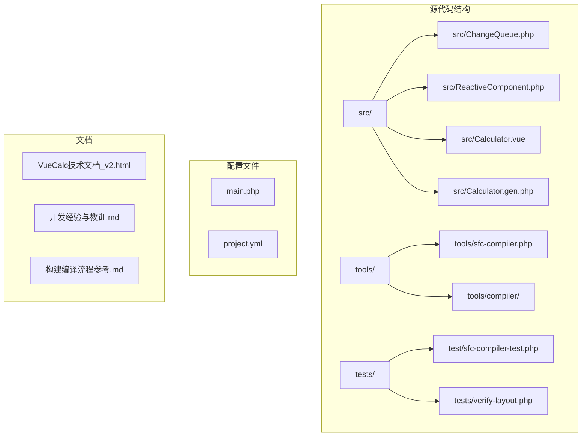
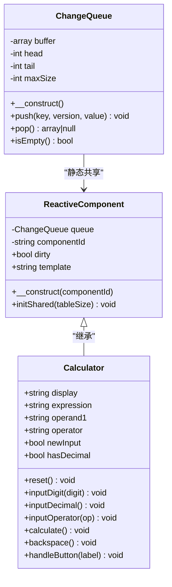
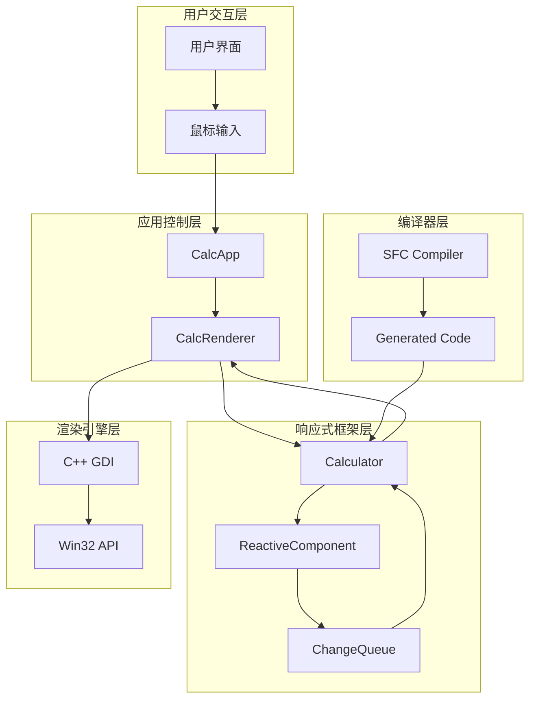
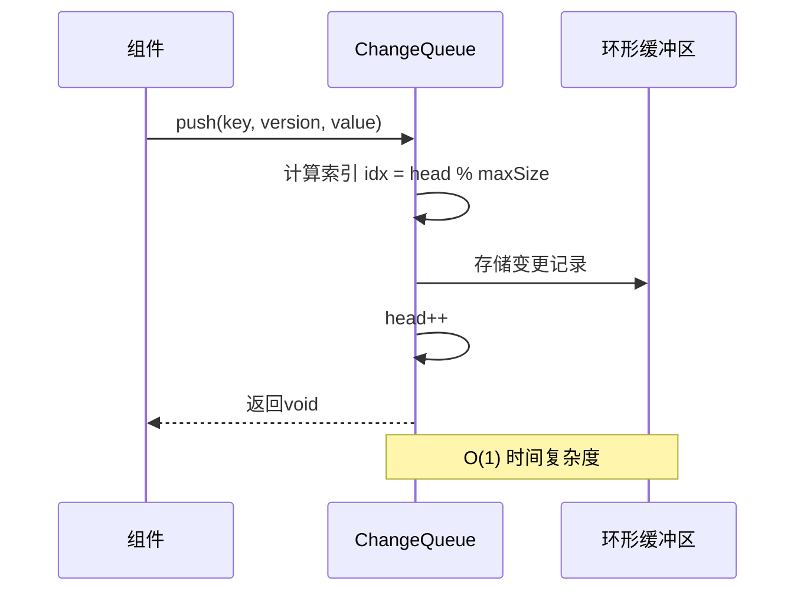
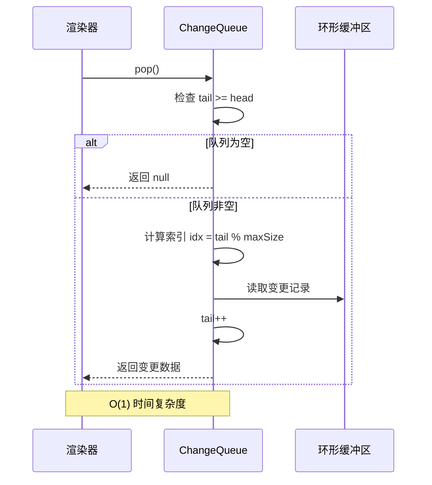
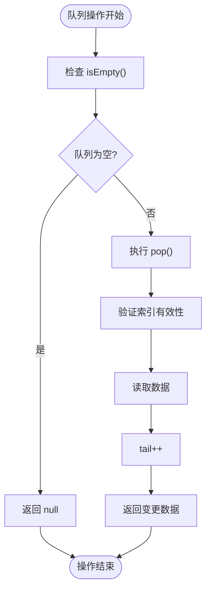
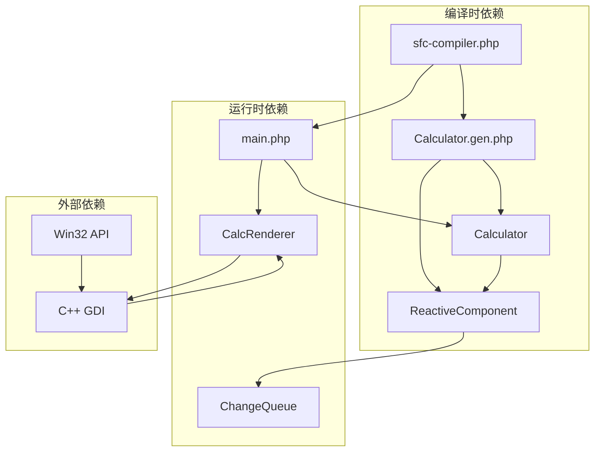

# 变更队列系统

<cite>
**本文档引用的文件**
- [ChangeQueue.php](file://src/ChangeQueue.php)
- [ReactiveComponent.php](file://src/ReactiveComponent.php)
- [Calculator.vue](file://src/Calculator.vue)
- [Calculator.gen.php](file://src/Calculator.gen.php)
- [main.php](file://main.php)
- [sfc-compiler.php](file://tools/sfc-compiler.php)
- [开发经验与教训.md](file://开发经验与教训.md)
- [VueCalc技术文档_v2.html](file://VueCalc技术文档_v2.html)
</cite>

## 目录
1. [简介](#简介)
2. [项目结构](#项目结构)
3. [核心组件](#核心组件)
4. [架构概览](#架构概览)
5. [详细组件分析](#详细组件分析)
6. [依赖关系分析](#依赖关系分析)
7. [性能考虑](#性能考虑)
8. [故障排除指南](#故障排除指南)
9. [结论](#结论)
10. [附录](#附录)

## 简介

ChangeQueue变更队列系统是VueCalc响应式数据驱动架构的核心组件之一。该系统实现了环形缓冲区数据结构，用于收集和管理组件状态变更，协调多个组件间的变更处理。在AOT（Ahead-of-Time）编译环境中，该队列系统提供了可靠的变更通知机制，确保UI能够及时响应数据状态的变化。

VueCalc是一个类Vue响应式数据驱动的Windows桌面计算器，采用PHP + C++混合架构。项目通过SFC（Single File Component）编译器将.vue单文件组件编译为PHP类，结合C++ GDI渲染引擎，最终生成独立的Windows可执行文件。

## 项目结构

VueCalc项目采用模块化的文件组织方式，主要包含以下核心目录和文件：



**图表来源**
- [main.php:1-291](file://main.php#L1-L291)
- [sfc-compiler.php:1-210](file://tools/sfc-compiler.php#L1-L210)

**章节来源**
- [main.php:1-291](file://main.php#L1-L291)
- [sfc-compiler.php:1-210](file://tools/sfc-compiler.php#L1-L210)

## 核心组件

### ChangeQueue类设计

ChangeQueue是变更通知队列的核心实现，采用了高效的环形缓冲区数据结构：



**图表来源**
- [ChangeQueue.php:11-56](file://src/ChangeQueue.php#L11-L56)
- [ReactiveComponent.php:11-35](file://src/ReactiveComponent.php#L11-L35)
- [Calculator.gen.php:9-174](file://src/Calculator.gen.php#L9-L174)

### 数据结构设计

ChangeQueue采用了精心设计的环形缓冲区结构，具有以下特点：

- **固定大小缓冲区**：最大容量为4096个元素，通过模运算实现循环使用
- **双指针机制**：使用head和tail指针跟踪队列的头部和尾部位置
- **高效内存管理**：通过索引计算避免数组移动操作
- **原子性操作**：push和pop操作都是O(1)时间复杂度

**章节来源**
- [ChangeQueue.php:11-56](file://src/ChangeQueue.php#L11-L56)

## 架构概览

VueCalc的整体架构采用了分层设计，从底层的C++渲染引擎到顶层的PHP业务逻辑形成了清晰的层次结构：



**图表来源**
- [main.php:139-259](file://main.php#L139-L259)
- [sfc-compiler.php:1-210](file://tools/sfc-compiler.php#L1-L210)

### 数据流处理

系统遵循严格的数据流向，确保状态变更的正确传播：

1. **用户输入** → **CalcApp.handleClick()** → **Calculator.handleButton()**
2. **状态变更** → **$this->dirty = true** → **主循环检测**
3. **渲染触发** → **CalcRenderer.render()** → **C++绘制**

**章节来源**
- [main.php:171-227](file://main.php#L171-L227)
- [Calculator.gen.php:149-168](file://src/Calculator.gen.php#L149-L168)

## 详细组件分析

### ChangeQueue实现机制

ChangeQueue的实现体现了高性能队列设计的最佳实践：

#### 入队操作（push）



**图表来源**
- [ChangeQueue.php:24-33](file://src/ChangeQueue.php#L24-L33)

#### 出队操作（pop）



**图表来源**
- [ChangeQueue.php:36-49](file://src/ChangeQueue.php#L36-L49)

#### 队列状态管理

ChangeQueue提供了完整的状态检查机制：



**图表来源**
- [ChangeQueue.php:52-55](file://src/ChangeQueue.php#L52-L55)

**章节来源**
- [ChangeQueue.php:11-56](file://src/ChangeQueue.php#L11-L56)

### ReactiveComponent基类

ReactiveComponent作为所有响应式组件的基类，提供了统一的变更管理基础设施：

#### 共享队列初始化

```mermaid
classDiagram
class ReactiveComponent {
-static ChangeQueue queue
-static string componentId
+bool dirty
+string template
+__construct(componentId)
+initShared(tableSize) void
}
note for ReactiveComponent : "静态共享队列<br/>用于跨组件变更通知"
```

**图表来源**
- [ReactiveComponent.php:11-35](file://src/ReactiveComponent.php#L11-L35)

#### 脏标记机制

ReactiveComponent实现了简洁而有效的脏标记系统：

- **手动标记**：每个修改状态的方法末尾设置`$this->dirty = true`
- **主循环检测**：CalcApp::run()每帧检查组件的dirty状态
- **条件渲染**：仅在状态变更后才触发UI重绘

**章节来源**
- [ReactiveComponent.php:11-35](file://src/ReactiveComponent.php#L11-L35)
- [main.php:214-221](file://main.php#L214-L221)

### Calculator组件

Calculator是具体的业务组件实现，展示了如何正确使用响应式框架：

#### 状态属性设计

```mermaid
classDiagram
class Calculator {
+string display
+string expression
+string operand1
+string operator
+bool newInput
+bool hasDecimal
+reset() void
+inputDigit(digit) void
+inputDecimal() void
+inputOperator(op) void
+calculate() void
+backspace() void
+handleButton(label) void
}
class ReactiveComponent {
+bool dirty
+initShared(tableSize) void
}
Calculator --|> ReactiveComponent : "继承"
note for Calculator : "6个公共属性<br/>每个方法末尾设置 dirty = true"
```

**图表来源**
- [Calculator.gen.php:9-174](file://src/Calculator.gen.php#L9-L174)

#### 业务逻辑实现

Calculator实现了完整的计算器功能，包括：

- **数字输入处理**：支持连续数字输入和小数点处理
- **运算符处理**：支持四则运算和自动计算
- **错误处理**：处理除零等异常情况
- **状态管理**：维护复杂的计算状态

**章节来源**
- [Calculator.gen.php:29-168](file://src/Calculator.gen.php#L29-L168)

## 依赖关系分析

### 组件间依赖关系



**图表来源**
- [sfc-compiler.php:160-181](file://tools/sfc-compiler.php#L160-L181)
- [main.php:265-290](file://main.php#L265-L290)

### 关键依赖点

1. **编译器依赖**：sfc-compiler.php负责将.vue文件编译为PHP类
2. **运行时依赖**：main.php负责初始化和运行时调度
3. **渲染依赖**：CalcRenderer负责将数据转换为视觉输出
4. **队列依赖**：ChangeQueue提供变更通知机制

**章节来源**
- [sfc-compiler.php:160-181](file://tools/sfc-compiler.php#L160-L181)
- [main.php:265-290](file://main.php#L265-L290)

## 性能考虑

### 内存使用模式

ChangeQueue采用了高效的内存管理模式：

- **固定内存分配**：初始化时分配固定大小的数组缓冲区
- **循环利用**：通过模运算实现内存的循环使用，避免内存碎片
- **最小化开销**：每个队列元素仅包含必要的键、版本号和值信息

### 性能优化策略

1. **O(1)操作复杂度**：push和pop操作都是常数时间复杂度
2. **缓存友好**：数组索引访问具有良好的CPU缓存局部性
3. **批量处理**：支持批量处理多个变更，减少系统调用次数

### 容量管理

- **默认容量**：4096个元素的环形缓冲区
- **溢出处理**：通过模运算实现自然溢出，覆盖最旧的元素
- **容量调整**：可通过构造函数参数调整队列大小

**章节来源**
- [ChangeQueue.php:16](file://src/ChangeQueue.php#L16)
- [ChangeQueue.php:26](file://src/ChangeQueue.php#L26)

## 故障排除指南

### 常见问题及解决方案

#### AOT编译器兼容性问题

**问题**：某些PHP特性在AOT编译环境中不可用
**解决方案**：
- 避免使用`__get/__set`魔术方法
- 移除对`any()`和`json_encode`的依赖
- 使用PHP 7级别的API函数

#### 静态属性初始化问题

**问题**：PHP 8.x类型化静态属性的"未初始化"状态
**解决方案**：
- 为静态属性提供明确的默认值
- 在使用前进行null检查

#### 内存泄漏预防

**问题**：长时间运行的应用可能出现内存增长
**解决方案**：
- 合理设置队列容量
- 及时处理队列中的变更
- 监控组件状态变更频率

**章节来源**
- [开发经验与教训.md:129-170](file://开发经验与教训.md#L129-L170)

### 调试技巧

1. **日志记录**：在关键操作点添加调试输出
2. **状态监控**：定期检查队列长度和组件状态
3. **性能分析**：监控队列操作的性能指标

## 结论

ChangeQueue变更队列系统是VueCalc响应式架构的重要组成部分，它通过高效的环形缓冲区设计实现了可靠的变更通知机制。在AOT编译环境的限制下，该系统展现了出色的兼容性和稳定性。

系统的主要优势包括：

- **高可靠性**：避免了AOT环境中不可用的PHP特性
- **高性能**：O(1)时间复杂度的操作满足实时渲染需求
- **可扩展性**：为未来的增量渲染和复杂组件通信预留了接口
- **易于维护**：简洁的设计降低了代码复杂度和维护成本

通过合理的架构设计和严格的AOT兼容性考虑，ChangeQueue成功地在受限环境中实现了灵活的变更管理功能，为整个VueCalc系统的稳定运行奠定了坚实基础。

## 附录

### 使用示例

#### 组件注册和变更处理

```php
// 初始化共享队列
ReactiveComponent::initShared(10240);

// 创建组件实例
$calc = new Calculator('MainCalculator');

// 组件状态变更（示例）
$calc->inputDigit('5');  // 自动设置 $this->dirty = true
$calc->inputOperator('+');
$calc->inputDigit('3');
$calc->calculate();      // 设置 $this->dirty = true
```

#### 队列操作示例

```php
// 入队操作
$queue->push('display', 1, '123');

// 出队操作
$change = $queue->pop();
if ($change !== null) {
    // 处理变更
    echo "Key: {$change['key']}, Value: {$change['value']}";
}
```

### 最佳实践

1. **合理设置队列容量**：根据应用规模选择合适的队列大小
2. **及时处理变更**：避免变更在队列中积压过久
3. **监控性能指标**：定期检查队列长度和处理延迟
4. **保持代码简洁**：避免过度复杂的变更处理逻辑