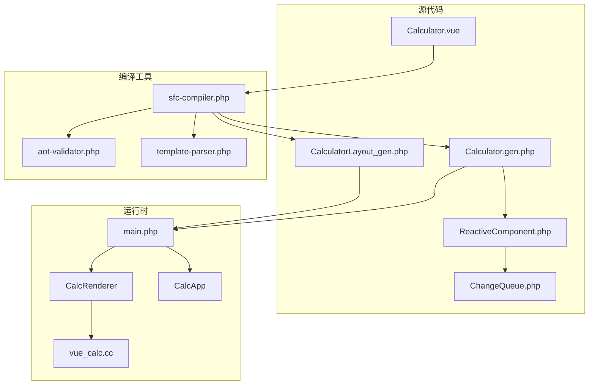
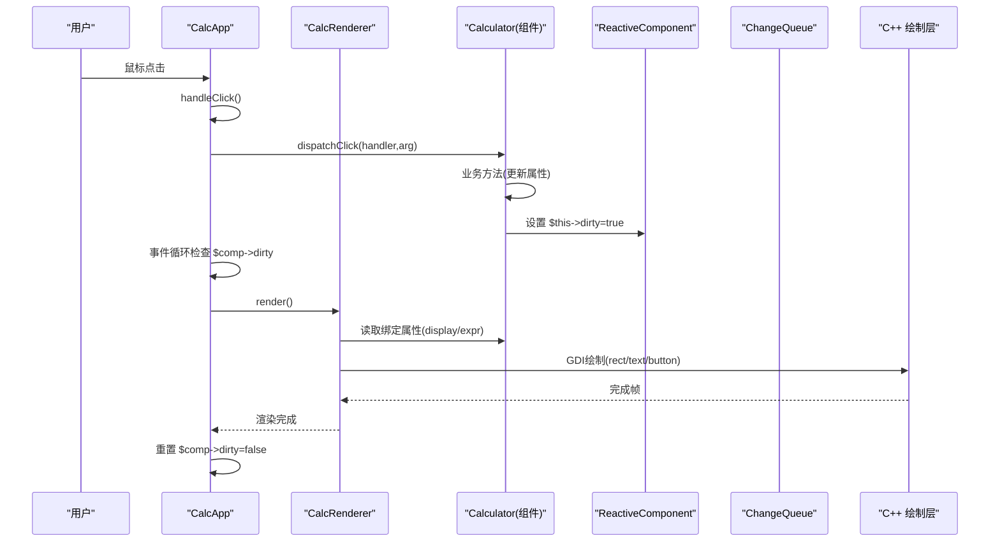
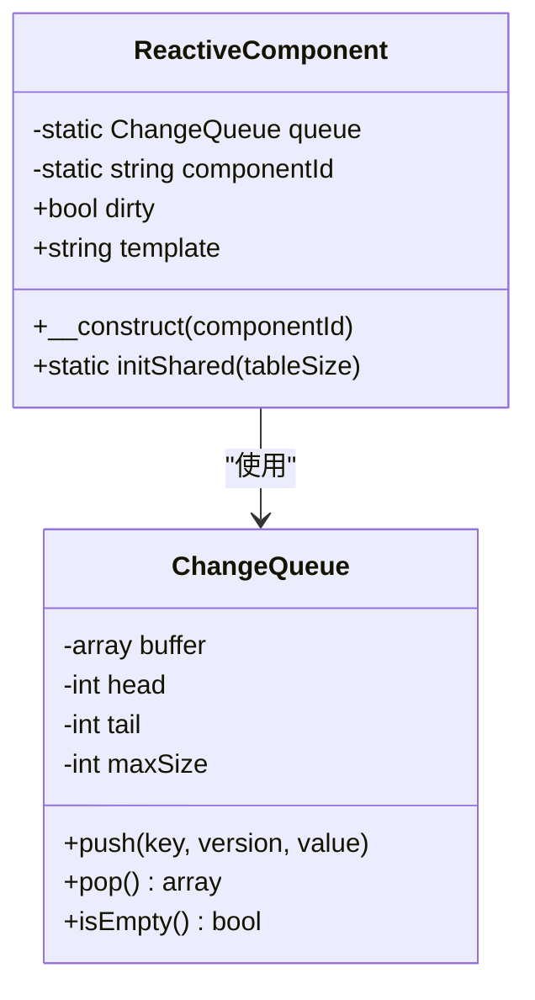
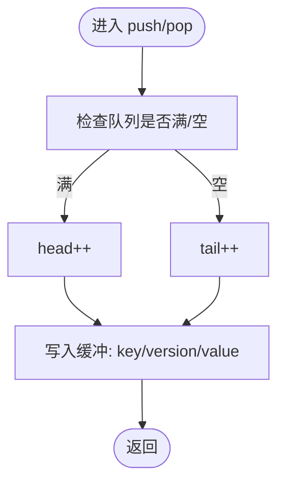
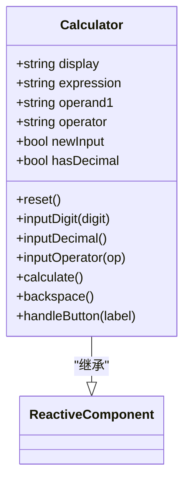
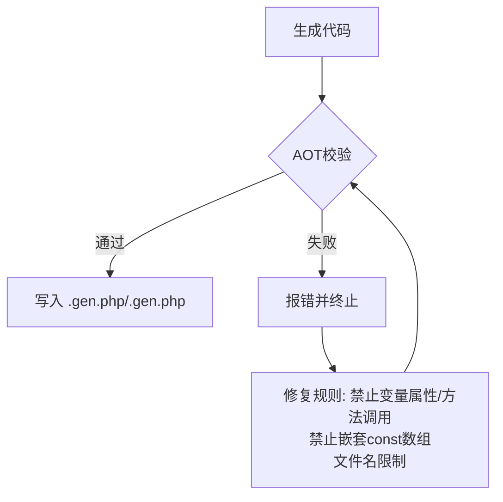
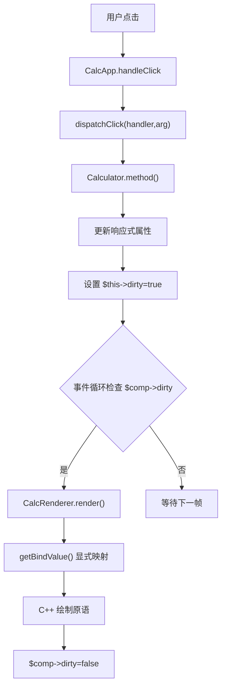
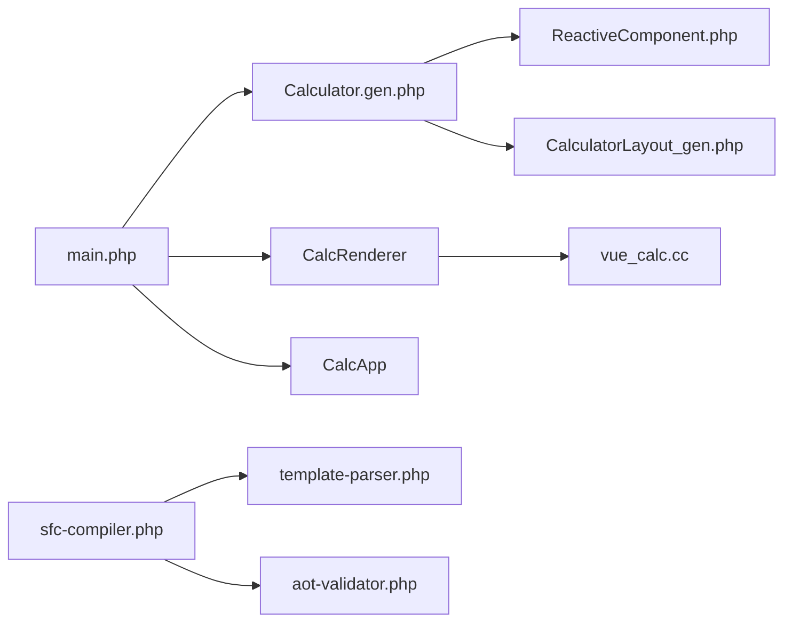

# 响应式系统架构

<cite>
**本文引用的文件**
- [ReactiveComponent.php](file://src/ReactiveComponent.php)
- [ChangeQueue.php](file://src/ChangeQueue.php)
- [Calculator.vue](file://src/Calculator.vue)
- [Calculator.gen.php](file://src/Calculator.gen.php)
- [main.php](file://main.php)
- [sfc-compiler.php](file://tools/sfc-compiler.php)
- [aot-validator.php](file://tools/compiler/aot-validator.php)
- [template-parser.php](file://tools/compiler/template-parser.php)
- [vue_calc.cc](file://cpp-src/vue_calc.cc)
- [sfc-compiler-test.php](file://tests/sfc-compiler-test.php)
- [verify-layout.php](file://tests/verify-layout.php)
</cite>

## 目录
1. [简介](#简介)
2. [项目结构](#项目结构)
3. [核心组件](#核心组件)
4. [架构总览](#架构总览)
5. [详细组件分析](#详细组件分析)
6. [依赖关系分析](#依赖关系分析)
7. [性能考量](#性能考量)
8. [故障排查指南](#故障排查指南)
9. [结论](#结论)
10. [附录](#附录)

## 简介
本文件面向VueCalc项目，系统性阐述其响应式系统架构，重点解释ReactiveComponent基类的设计原理（脏标记机制、变更队列、共享内存管理），以及从属性变更到脏标记设置再到渲染触发的完整工作流程。同时说明AOT编译器对响应式系统支持与限制，解释为何需要显式的方法调用而非动态属性访问，并总结性能优化策略与内存管理机制。最后通过具体代码示例路径展示响应式属性的使用模式。

## 项目结构
VueCalc采用“单文件组件（SFC）+ AOT编译”的混合架构：
- 源模板与逻辑：src/Calculator.vue（模板 + PHP脚本）
- 编译产物：src/Calculator.gen.php（组件类）、src/CalculatorLayout_gen.php（布局常量）
- 响应式基础：src/ReactiveComponent.php（基类）、src/ChangeQueue.php（变更队列）
- 运行时：main.php（应用入口、渲染器、事件循环）
- C++渲染层：cpp-src/vue_calc.cc（Win32窗口/GDI绘制原语）
- 编译器工具链：tools/sfc-compiler.php、tools/compiler/*（模板解析、AOT校验、代码生成）



**图表来源**
- [sfc-compiler.php:1-210](file://tools/sfc-compiler.php#L1-L210)
- [main.php:1-291](file://main.php#L1-L291)
- [ReactiveComponent.php:1-35](file://src/ReactiveComponent.php#L1-L35)
- [ChangeQueue.php:1-57](file://src/ChangeQueue.php#L1-L57)
- [Calculator.gen.php:1-174](file://src/Calculator.gen.php#L1-L174)

**章节来源**
- [sfc-compiler.php:1-210](file://tools/sfc-compiler.php#L1-L210)
- [main.php:1-291](file://main.php#L1-L291)

## 核心组件
- ReactiveComponent：响应式组件基类，提供全局共享的变更队列、组件标识、脏标记字段，以及静态初始化接口。
- ChangeQueue：环形缓冲的变更通知队列，用于收集组件状态变更并供渲染循环消费。
- Calculator（生成类）：继承自ReactiveComponent，声明响应式属性并在业务方法中显式设置脏标记以触发重绘。
- CalcRenderer：基于布局数据从组件状态读取绑定值，驱动C++ GDI绘制。
- CalcApp：应用主控制器，负责窗口生命周期、消息循环、事件分发与按需渲染。
- C++层：封装Win32窗口与GDI绘制原语，供PHP侧调用。

**章节来源**
- [ReactiveComponent.php:11-35](file://src/ReactiveComponent.php#L11-L35)
- [ChangeQueue.php:11-57](file://src/ChangeQueue.php#L11-L57)
- [Calculator.gen.php:9-174](file://src/Calculator.gen.php#L9-L174)
- [main.php:26-259](file://main.php#L26-L259)
- [vue_calc.cc:1-157](file://cpp-src/vue_calc.cc#L1-L157)

## 架构总览
VueCalc的响应式系统围绕“显式脏标记 + 数据驱动渲染”展开，遵循AOT编译器约束，避免动态属性访问与变量方法调用，确保编译期可确定性。



**图表来源**
- [main.php:171-227](file://main.php#L171-L227)
- [main.php:243-258](file://main.php#L243-L258)
- [Calculator.gen.php:29-168](file://src/Calculator.gen.php#L29-L168)
- [ReactiveComponent.php:11-35](file://src/ReactiveComponent.php#L11-L35)
- [ChangeQueue.php:11-57](file://src/ChangeQueue.php#L11-L57)
- [main.php:26-133](file://main.php#L26-L133)
- [vue_calc.cc:90-157](file://cpp-src/vue_calc.cc#L90-L157)

## 详细组件分析

### ReactiveComponent 基类设计
- 全局共享：通过静态字段持有全局变更队列实例，便于跨组件统一管理。
- 组件标识：静态组件ID用于区分不同实例或调试用途。
- 脏标记：实例级布尔字段，用于指示组件状态是否需要重绘。
- 初始化：静态初始化方法创建并注入全局变更队列，供后续组件使用。



**图表来源**
- [ReactiveComponent.php:11-35](file://src/ReactiveComponent.php#L11-L35)
- [ChangeQueue.php:11-57](file://src/ChangeQueue.php#L11-L57)

**章节来源**
- [ReactiveComponent.php:11-35](file://src/ReactiveComponent.php#L11-L35)

### 变更队列 ChangeQueue
- 环形缓冲：固定最大容量，使用头尾指针推进，避免频繁扩容。
- 数据项：包含键名、版本号与字符串化后的值，保证序列化一致性。
- 并发注意：当前实现未加锁，适用于单线程渲染循环；如需多线程，应在渲染循环外侧进行同步。



**图表来源**
- [ChangeQueue.php:24-49](file://src/ChangeQueue.php#L24-L49)

**章节来源**
- [ChangeQueue.php:11-57](file://src/ChangeQueue.php#L11-L57)

### 组件类 Calculator（生成类）
- 继承关系：Calculator extends ReactiveComponent，复用基类提供的共享队列与脏标记。
- 响应式属性：显式声明多个公共属性（如display、expression、operand1、operator、newInput、hasDecimal）。
- 方法调用：所有状态变更均通过显式方法完成，方法内部更新属性并设置脏标记，确保AOT兼容性。



**图表来源**
- [Calculator.gen.php:9-174](file://src/Calculator.gen.php#L9-L174)
- [Calculator.vue:45-202](file://src/Calculator.vue#L45-L202)

**章节来源**
- [Calculator.gen.php:9-174](file://src/Calculator.gen.php#L9-L174)
- [Calculator.vue:45-202](file://src/Calculator.vue#L45-L202)

### 渲染器 CalcRenderer 与应用主循环
- 渲染器职责：从布局数据遍历元素，按需读取组件绑定属性，调用C++绘制原语。
- 绑定读取：为避免AOT不支持的动态属性访问，使用显式的if/else映射读取绑定值。
- 主循环：持续轮询消息，命中按钮后分发到组件方法，仅在脏标记为真时执行渲染并重置脏标记。

```mermaid
sequenceDiagram
participant Loop as "事件循环"
participant Renderer as "CalcRenderer"
participant Comp as "Calculator"
participant Cpp as "C++ 绘制层"
Loop->>Loop : 检查 $comp->dirty
alt 需要重绘
Loop->>Renderer : render()
Renderer->>Comp : 读取绑定属性
Renderer->>Cpp : 绘制rect/text/button
Cpp-->>Renderer : 完成
Renderer-->>Loop : 返回
Loop->>Comp : $comp->dirty=false
else 无需重绘
Loop-->>Loop : 等待
end
```

**图表来源**
- [main.php:96-133](file://main.php#L96-L133)
- [main.php:171-227](file://main.php#L171-L227)

**章节来源**
- [main.php:26-133](file://main.php#L26-L133)
- [main.php:171-227](file://main.php#L171-L227)

### AOT编译器支持与限制
- 支持点：类定义、函数、常量、静态字段、显式方法调用、字符串常量等。
- 限制点：
  - 禁止变量属性访问（如$obj->$var）与变量方法调用（如$obj->$method()）。
  - 常量数组嵌套结构可能不受支持。
  - 文件名中含多个点可能导致C++符号无效。
  - 推荐使用strpos替代str_contains等PHP8特性。
- 兼容策略：模板解析器将@click转换为显式处理器与参数；渲染器通过显式映射读取绑定属性；组件方法显式设置脏标记。



**图表来源**
- [aot-validator.php:17-169](file://tools/compiler/aot-validator.php#L17-L169)
- [sfc-compiler.php:184-201](file://tools/sfc-compiler.php#L184-L201)

**章节来源**
- [aot-validator.php:17-169](file://tools/compiler/aot-validator.php#L17-L169)
- [sfc-compiler.php:184-201](file://tools/sfc-compiler.php#L184-L201)

### 响应式状态管理全流程
- 属性变更：用户交互触发CalcApp.handleClick，分发到Calculator的显式方法。
- 脏标记设置：方法内部更新响应式属性并设置$comp->dirty=true。
- 渲染触发：主循环检测到脏标记为真，调用CalcRenderer.render。
- 绑定读取：CalcRenderer.getBindValue显式映射绑定键到组件属性。
- 绘制执行：CalcRenderer调用C++绘制原语完成一帧渲染。
- 状态重置：渲染完成后将脏标记重置为false，等待下一次变更。



**图表来源**
- [main.php:188-258](file://main.php#L188-L258)
- [Calculator.gen.php:29-168](file://src/Calculator.gen.php#L29-L168)
- [main.php:37-47](file://main.php#L37-L47)
- [main.php:96-133](file://main.php#L96-L133)

**章节来源**
- [main.php:188-258](file://main.php#L188-L258)
- [Calculator.gen.php:29-168](file://src/Calculator.gen.php#L29-L168)
- [main.php:37-47](file://main.php#L37-L47)
- [main.php:96-133](file://main.php#L96-L133)

## 依赖关系分析
- 组件类依赖基类：Calculator依赖ReactiveComponent的静态共享队列与脏标记。
- 渲染器依赖布局：CalcRenderer依赖CalculatorLayout_gen.php中的布局数组与窗口尺寸常量。
- 应用主控依赖组件与渲染器：CalcApp负责事件分发与渲染调度。
- 编译器依赖模板解析与AOT校验：sfc-compiler.php串联模板解析、布局生成、AOT验证与代码输出。



**图表来源**
- [Calculator.gen.php:9-174](file://src/Calculator.gen.php#L9-L174)
- [ReactiveComponent.php:11-35](file://src/ReactiveComponent.php#L11-L35)
- [main.php:26-133](file://main.php#L26-L133)
- [sfc-compiler.php:19-24](file://tools/sfc-compiler.php#L19-L24)

**章节来源**
- [Calculator.gen.php:9-174](file://src/Calculator.gen.php#L9-L174)
- [ReactiveComponent.php:11-35](file://src/ReactiveComponent.php#L11-L35)
- [main.php:26-133](file://main.php#L26-L133)
- [sfc-compiler.php:19-24](file://tools/sfc-compiler.php#L19-L24)

## 性能考量
- 脏标记最小化重绘：仅在状态真正变更时设置脏标记，避免每帧重复渲染。
- 渲染频率控制：事件循环中使用微秒级sleep维持约60FPS，平衡流畅度与CPU占用。
- 绑定读取显式化：避免动态属性访问，减少AOT编译器的不确定性与运行时开销。
- 布局预计算：模板解析阶段将网格按钮坐标在编译期计算，运行时直接使用常量布局数组。
- 环形缓冲队列：固定容量与头尾指针推进，降低内存分配与拷贝成本。

**章节来源**
- [main.php:213-224](file://main.php#L213-L224)
- [template-parser.php:498-541](file://tools/compiler/template-parser.php#L498-L541)
- [ChangeQueue.php:13-16](file://src/ChangeQueue.php#L13-L16)

## 故障排查指南
- AOT校验失败：
  - 多点文件名：确保文件名中仅包含最多一个点（如Calculator.gen.php），避免C++符号无效。
  - 常量数组嵌套：将布局数组改为函数返回形式，避免const嵌套数组。
  - 变量属性/方法调用：使用显式if/else映射或显式方法调用，避免$obj->$var或$obj->$method()。
  - PHP8函数：使用strpos替代str_contains等兼容性更好的函数。
- 渲染异常：
  - 检查CalcRenderer.getBindValue映射是否覆盖所有绑定键。
  - 确认事件分发dispatchClick正确路由到组件方法。
  - 确保每次状态变更后都设置$comp->dirty=true。
- 按钮命中问题：
  - 使用tests/verify-layout.php核对生成布局的坐标与数量，确保网格按钮位置正确。

**章节来源**
- [aot-validator.php:36-106](file://tools/compiler/aot-validator.php#L36-L106)
- [main.php:37-47](file://main.php#L37-L47)
- [main.php:243-258](file://main.php#L243-L258)
- [verify-layout.php:1-72](file://tests/verify-layout.php#L1-L72)

## 结论
VueCalc的响应式系统通过“显式脏标记 + 数据驱动渲染”的方式，在满足AOT编译器严格限制的前提下，实现了清晰、可控且高性能的UI更新路径。ReactiveComponent提供共享队列与脏标记基础设施，Calculator生成类以显式方法管理状态，CalcRenderer与CalcApp共同完成事件分发与按需渲染。模板解析与AOT校验确保了编译期可确定性与运行时稳定性。该架构既适合教学演示，也具备工程落地的可扩展性。

## 附录
- 代码示例路径（不展示具体代码内容）：
  - 响应式属性声明与脏标记设置：[Calculator.vue:45-202](file://src/Calculator.vue#L45-L202)
  - 组件类生成与方法实现：[Calculator.gen.php:29-168](file://src/Calculator.gen.php#L29-L168)
  - 渲染器绑定读取与绘制：[main.php:37-47](file://main.php#L37-L47), [main.php:96-133](file://main.php#L96-L133)
  - 事件循环与脏标记重置：[main.php:213-227](file://main.php#L213-L227)
  - AOT校验规则与修复建议：[aot-validator.php:36-106](file://tools/compiler/aot-validator.php#L36-L106)
  - 布局生成与坐标预计算：[template-parser.php:498-541](file://tools/compiler/template-parser.php#L498-L541)
  - 编译器流水线与验证：[sfc-compiler.php:184-201](file://tools/sfc-compiler.php#L184-L201)
  - C++绘制原语封装：[vue_calc.cc:90-157](file://cpp-src/vue_calc.cc#L90-L157)