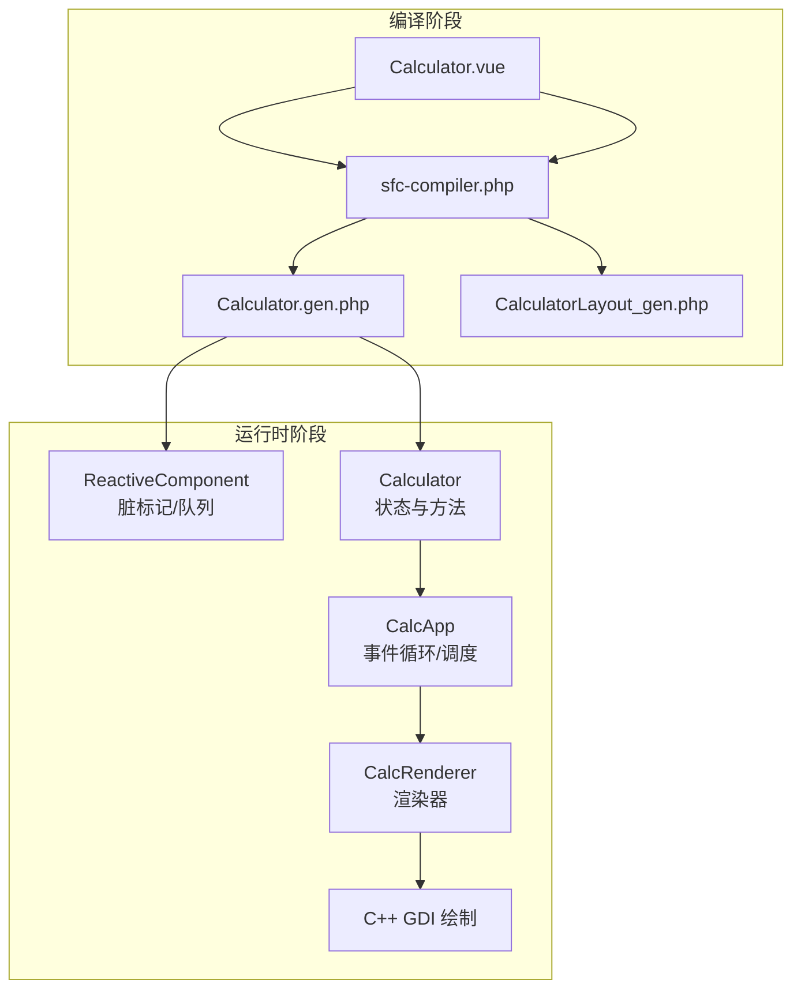
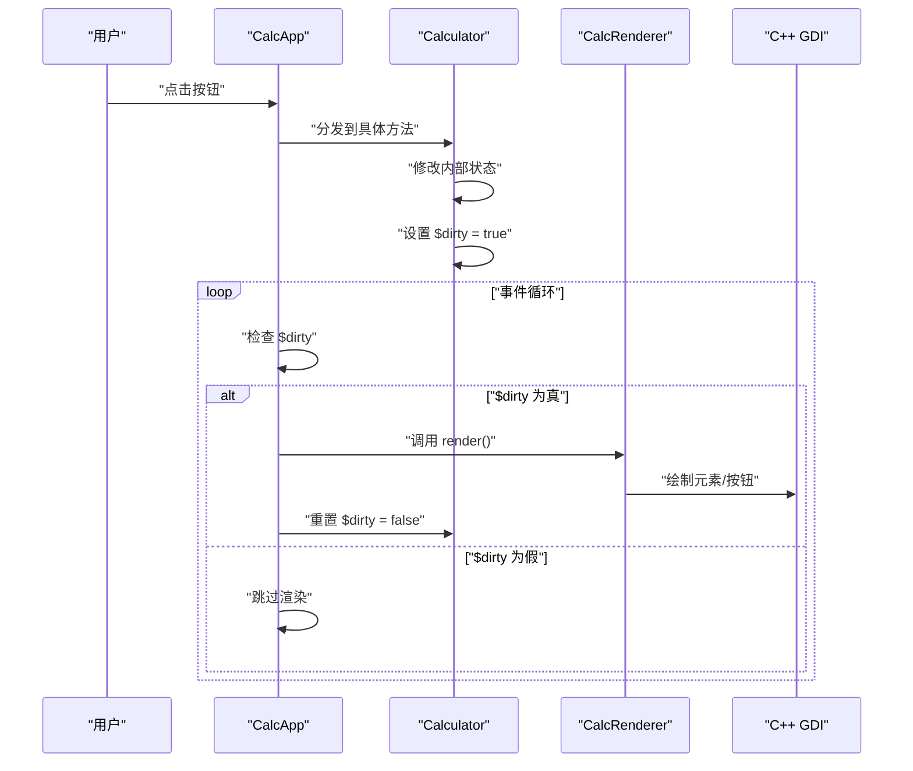
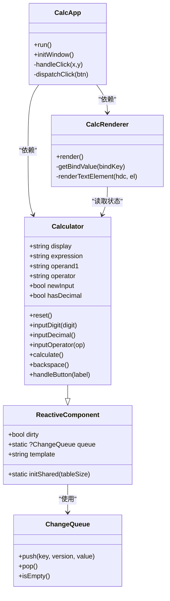

# 脏标记机制

<cite>
**本文引用的文件**
- [ReactiveComponent.php](file://src/ReactiveComponent.php)
- [Calculator.gen.php](file://src/Calculator.gen.php)
- [ChangeQueue.php](file://src/ChangeQueue.php)
- [main.php](file://main.php)
- [Calculator.vue](file://src/Calculator.vue)
- [sfc-compiler.php](file://tools/sfc-compiler.php)
- [aot-validator.php](file://tools/compiler/aot-validator.php)
- [template-parser.php](file://tools/compiler/template-parser.php)
</cite>

## 目录
1. [简介](#简介)
2. [项目结构](#项目结构)
3. [核心组件](#核心组件)
4. [架构总览](#架构总览)
5. [详细组件分析](#详细组件分析)
6. [依赖关系分析](#依赖关系分析)
7. [性能考量](#性能考量)
8. [故障排查指南](#故障排查指南)
9. [结论](#结论)
10. [附录](#附录)

## 简介
本文件围绕“脏标记（$dirty）”在响应式系统中的工作机制展开，结合项目中的实际实现，系统阐述从属性变更到脏标记设置、再到组件重绘与渲染更新的完整流程。同时解释脏标记与 AOT 编译器的兼容性设计，说明为何采用显式脏标记而非自动检测，并给出最佳实践与性能优化建议。文中所有分析均基于仓库中的真实代码文件。

## 项目结构
该项目是一个基于 SFC（单文件组件）编译器的桌面计算器应用，采用“PHP 逻辑 + C++ GDI 绘制”的混合架构：
- 模板与脚本由 SFC 编译器生成 PHP 组件类，该类继承自响应式基类。
- 响应式基类提供脏标记与全局变更队列等基础设施。
- 主应用在事件循环中根据脏标记决定是否触发渲染。
- C++ 层仅提供窗口与绘制原语，渲染器从组件状态读取数据并驱动绘制。

图表来源
- [sfc-compiler.php:1-200](file://tools/sfc-compiler.php#L1-L200)
- [Calculator.gen.php:1-174](file://src/Calculator.gen.php#L1-L174)
- [ReactiveComponent.php:1-35](file://src/ReactiveComponent.php#L1-L35)
- [main.php:1-291](file://main.php#L1-L291)

章节来源
- [sfc-compiler.php:1-200](file://tools/sfc-compiler.php#L1-L200)
- [main.php:1-291](file://main.php#L1-L291)

## 核心组件
- 响应式基类（ReactiveComponent）
  - 提供脏标记字段与全局变更队列的初始化入口。
  - 子类通过显式设置 $dirty = true 来表达“需要重绘”。

- 计算器组件（Calculator）
  - 直接声明状态属性，每个修改状态的方法末尾显式设置 $dirty = true。
  - 提供 reset、inputDigit、inputDecimal、inputOperator、calculate、backspace 等方法。

- 变更队列（ChangeQueue）
  - 环形缓冲实现，用于存放变更记录（键、版本、值）。
  - 本项目中用于响应式基础设施，配合脏标记进行渲染调度。

- 主应用与渲染器（CalcApp、CalcRenderer）
  - 事件循环中检查组件的 $dirty，若为真则调用渲染器执行全量渲染，并重置 $dirty。

章节来源
- [ReactiveComponent.php:1-35](file://src/ReactiveComponent.php#L1-L35)
- [Calculator.gen.php:1-174](file://src/Calculator.gen.php#L1-L174)
- [ChangeQueue.php:1-57](file://src/ChangeQueue.php#L1-L57)
- [main.php:1-291](file://main.php#L1-L291)

## 架构总览
脏标记在本项目中的工作流如下：
- 用户交互触发按钮点击，主应用分发到组件方法。
- 组件方法修改内部状态，并在末尾设置 $this->dirty = true。
- 事件循环检测到 $dirty 为真，调用渲染器进行全量渲染，随后将 $dirty 置为 false。
- C++ 层执行绘制原语，完成界面更新。

图表来源
- [main.php:171-227](file://main.php#L171-L227)
- [Calculator.gen.php:29-181](file://src/Calculator.gen.php#L29-L181)

## 详细组件分析

### 响应式基类（ReactiveComponent）
- 设计要点
  - 去除魔术方法（__get/__set），改为直接属性声明 + 手动脏标记，以满足 AOT 编译器约束。
  - 提供静态 initShared() 初始化全局变更队列，便于扩展后续响应式特性。

- 脏标记的作用
  - 作为“是否需要重绘”的信号位，避免每帧全量渲染，降低 CPU/GPU 压力。

- AOT 兼容性
  - 通过移除变量属性访问与变量方法调用等限制，保证生成的 C++ 符号合法且可链接。

章节来源
- [ReactiveComponent.php:1-35](file://src/ReactiveComponent.php#L1-L35)
- [aot-validator.php:1-169](file://tools/compiler/aot-validator.php#L1-L169)

### 计算器组件（Calculator）
- 状态属性
  - 包括 display、expression、operand1、operator、newInput、hasDecimal 等，直接声明在类中，便于 AOT 编译。

- 方法与脏标记
  - 每个修改状态的方法（如 reset、inputDigit、inputDecimal、inputOperator、calculate、backspace）在末尾显式设置 $this->dirty = true。
  - 这些方法覆盖了典型计算器的输入、运算与清理逻辑。

- 与模板的映射
  - 模板中的 :bind 属性与组件状态字段一一对应，渲染器通过显式分支读取组件属性，避免变量属性访问，满足 AOT 校验。

章节来源
- [Calculator.gen.php:1-174](file://src/Calculator.gen.php#L1-L174)
- [Calculator.vue:43-203](file://src/Calculator.vue#L43-L203)

### 变更队列（ChangeQueue）
- 结构与行为
  - 环形缓冲，支持 push/pop 操作，提供 isEmpty 判断。
  - 本项目中用于响应式基础设施，配合脏标记实现渲染调度。

- 与脏标记的关系
  - 脏标记是“是否渲染”的判定条件；变更队列用于记录变更，二者共同构成响应式更新路径。

章节来源
- [ChangeQueue.php:1-57](file://src/ChangeQueue.php#L1-L57)

### 主应用与渲染器（CalcApp、CalcRenderer）
- 事件循环
  - 首帧渲染后进入循环，持续处理消息队列。
  - 每帧检查组件 $dirty，若为真则渲染并重置 $dirty，否则跳过。

- 渲染器
  - 从布局数据与组件状态读取绑定值，进行文本与按钮的绘制。
  - 通过动态字号与对齐策略提升显示效果。

章节来源
- [main.php:171-227](file://main.php#L171-L227)
- [main.php:26-133](file://main.php#L26-L133)

### SFC 编译器与 AOT 校验
- 编译流程
  - 解析模板块、样式块与脚本块，生成布局数组与组件类文件。
  - 生成的组件类继承自 ReactiveComponent，并在方法末尾显式设置 $dirty = true。

- AOT 校验规则
  - 禁止变量属性访问（$obj->$var）与变量方法调用（$obj->$method()）。
  - 禁止复杂 const 数组，要求使用函数返回数组。
  - 要求所有代码位于函数或类内，避免顶层可执行语句。

章节来源
- [sfc-compiler.php:1-200](file://tools/sfc-compiler.php#L1-L200)
- [aot-validator.php:1-169](file://tools/compiler/aot-validator.php#L1-L169)

## 依赖关系分析
- 组件耦合
  - Calculator 依赖 ReactiveComponent 的脏标记与初始化能力。
  - CalcApp 依赖 Calculator 的状态与 $dirty 字段，控制渲染时机。
  - CalcRenderer 依赖布局数据与组件状态，驱动 C++ 绘制。

- 外部依赖
  - C++ 层提供窗口创建、绘制与消息处理接口，渲染器通过这些接口完成绘制。

图表来源
- [ReactiveComponent.php:1-35](file://src/ReactiveComponent.php#L1-L35)
- [Calculator.gen.php:1-174](file://src/Calculator.gen.php#L1-L174)
- [main.php:139-259](file://main.php#L139-L259)
- [ChangeQueue.php:1-57](file://src/ChangeQueue.php#L1-L57)

## 性能考量
- 脏标记驱动的全量渲染
  - 计算器场景下，每帧最多执行约 42 次 GDI 调用，渲染开销约为 500µs，远小于帧间等待（16ms），因此在 60 FPS 下表现良好。
  - 全量渲染对计算器足够，无需引入增量渲染，从而简化实现与维护成本。

- 调用链与开销
  - 每帧 42 次 PHP↔C++ 调用，其中类型转换占比较高，实际 GDI 调用仅占 30-40%。
  - 若未来渲染成为瓶颈，可考虑将渲染调用合并为批量调用，减少往返次数。

- 脏标记设置频率
  - 每个修改状态的方法末尾设置 $dirty = true，确保渲染及时更新。
  - 避免在同一帧内多次设置 $dirty，可在一次交互中聚合状态变更后再设置一次。

章节来源
- [main.php:2212-2221](file://main.php#L2212-L2221)

## 故障排查指南
- AOT 编译失败常见问题
  - 变量属性访问或变量方法调用：需改用显式 if/else 分支，避免 $obj->$var 或 $obj->$method()。
  - const 复杂数组：改用函数返回数组，确保全局常量可被注册。
  - 文件名含多个点号：将生成文件名改为下划线形式，避免无效 C++ 符号。
  - PHP8 特性：如 str_contains() 替换为 strpos()，确保在 PHP 7+ 环境可用。

- 脏标记未设置导致的渲染问题
  - 若某方法修改了状态但未设置 $dirty = true，则不会触发渲染。
  - 排查步骤：确认方法末尾存在 $this->dirty = true；检查事件分发是否正确路由到目标方法。

- 渲染器绑定值为空
  - 渲染器通过显式分支读取组件属性，若绑定键与组件状态不一致，可能导致渲染为空。
  - 排查步骤：核对模板中的 :bind 与组件属性名称一致。

章节来源
- [aot-validator.php:1-169](file://tools/compiler/aot-validator.php#L1-L169)
- [main.php:37-47](file://main.php#L37-L47)
- [Calculator.gen.php:29-181](file://src/Calculator.gen.php#L29-L181)

## 结论
脏标记机制在本项目中承担着“状态变更 → 渲染触发”的关键角色。通过显式设置 $dirty = true，组件能够在 AOT 编译环境下稳定工作，避免自动拦截（如 __get/__set）带来的兼容性问题。配合事件循环中的脏标记检查与全量渲染，系统实现了简洁、可控且高效的响应式更新路径。对于计算器这类界面元素较少的应用，全量渲染足以满足性能目标，无需引入复杂的增量渲染策略。

## 附录

### 脏标记设置的最佳实践
- 何时设置脏标记
  - 每个修改组件状态的方法末尾设置 $dirty = true。
  - 对于组合操作（如连续输入多个数字），可在最终落盘时统一设置一次，避免重复渲染。

- 如何避免不必要的重绘
  - 在方法内部先判断是否确实发生了有意义的状态变化，再决定是否设置 $dirty。
  - 合并同一事件内的多次状态变更，减少 $dirty 设置次数。

- 脏标记状态管理策略
  - 渲染完成后立即重置 $dirty = false，防止重复渲染。
  - 在事件循环中仅检查一次 $dirty，避免在渲染过程中再次触发。

- 与 AOT 的兼容性注意事项
  - 避免变量属性访问与变量方法调用，使用显式分支与固定方法名。
  - 将布局数据通过函数返回而非 const 数组导出。
  - 确保文件名不含多余点号，避免无效 C++ 符号。

章节来源
- [Calculator.gen.php:29-181](file://src/Calculator.gen.php#L29-L181)
- [aot-validator.php:1-169](file://tools/compiler/aot-validator.php#L1-L169)
- [main.php:213-221](file://main.php#L213-L221)