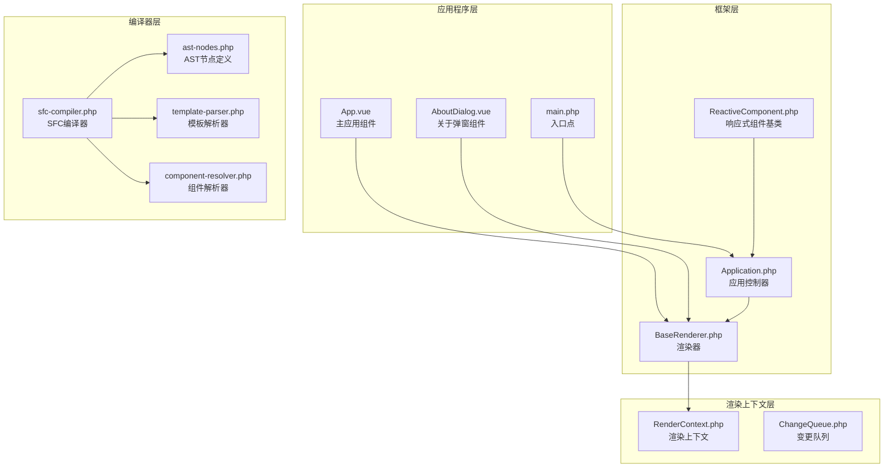
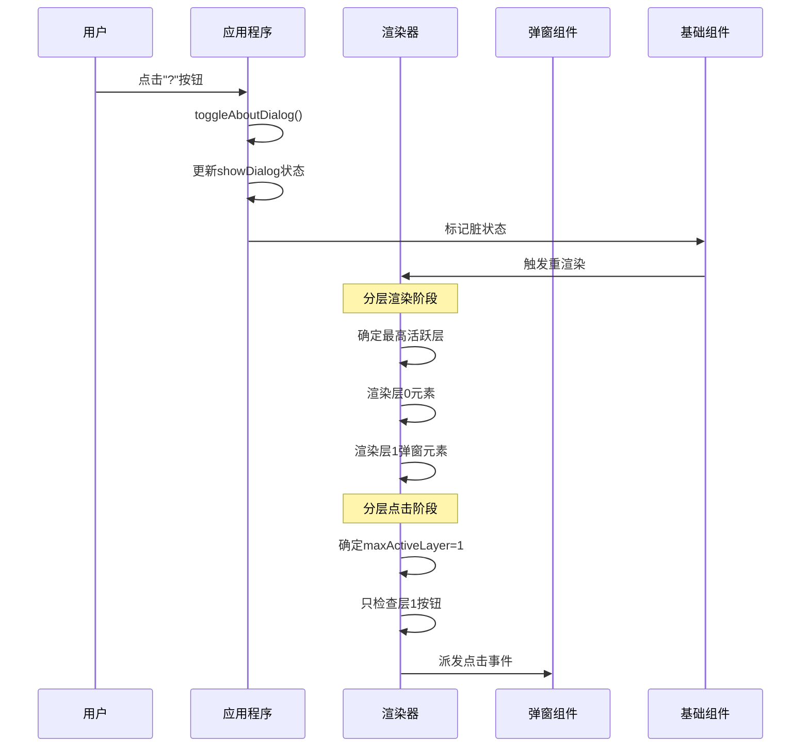
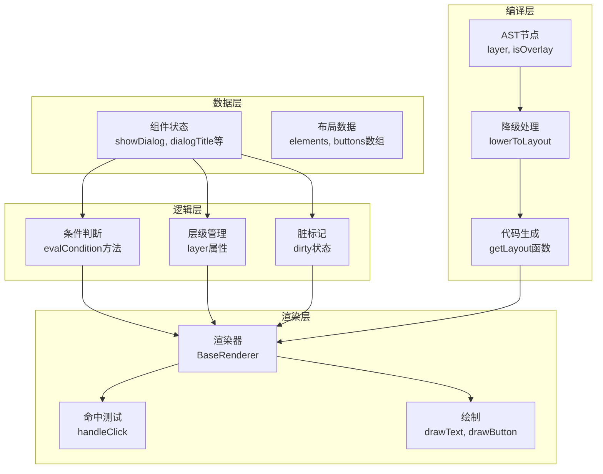
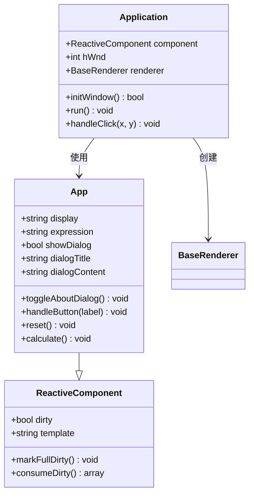
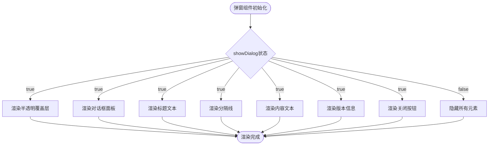
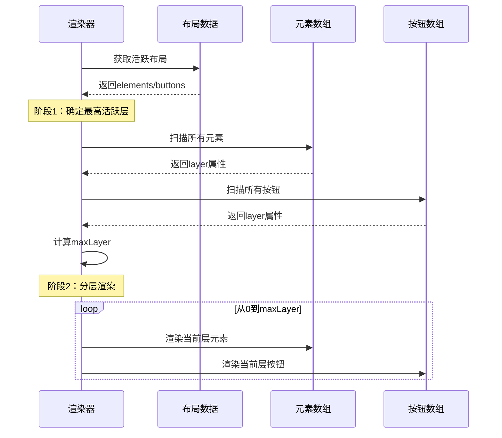
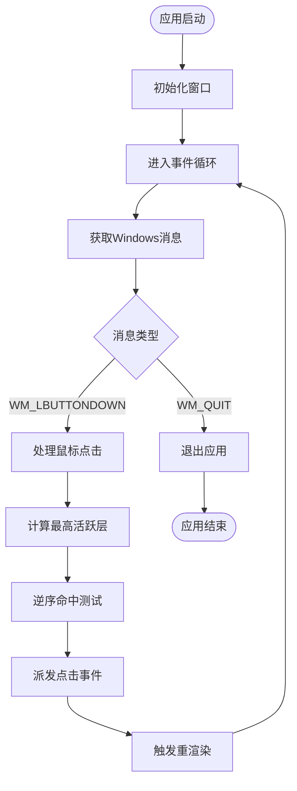
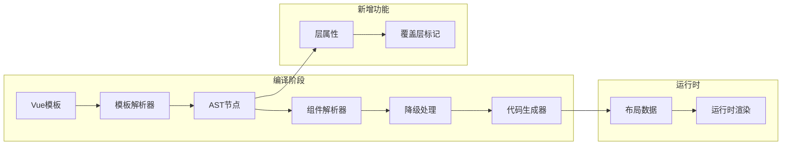
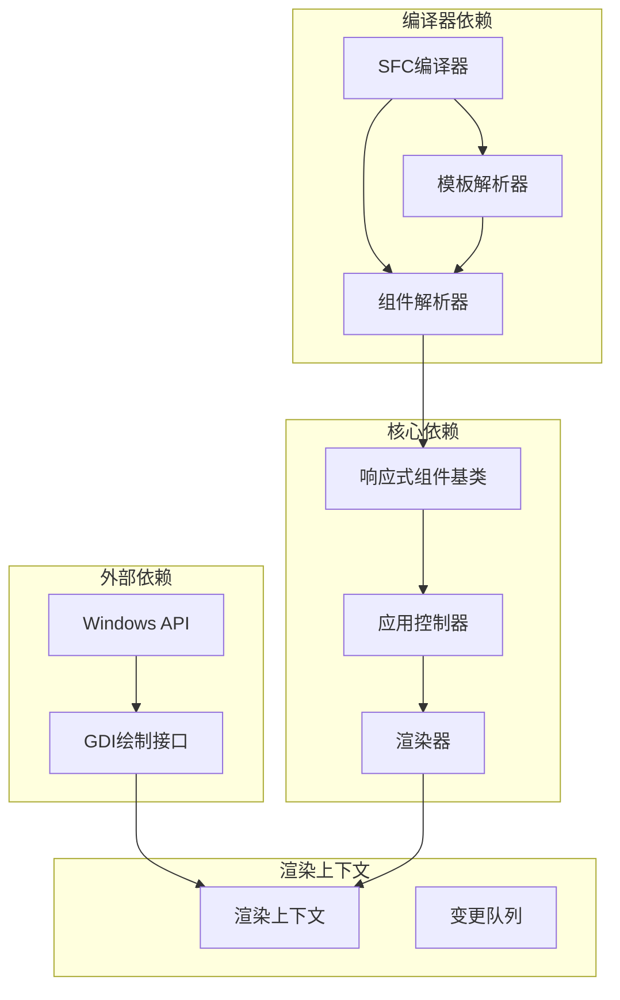

# 弹窗覆盖层系统

<cite>
**本文档引用的文件**
- [App.vue](file://apps/calculator/App.vue)
- [AboutDialog.vue](file://apps/calculator/components/AboutDialog.vue)
- [Application.php](file://apps/calculator/Application.php)
- [BaseRenderer.php](file://framework/BaseRenderer.php)
- [ReactiveComponent.php](file://framework/ReactiveComponent.php)
- [vue-dialog-overlay-pattern.md](file://docs/vue-dialog-overlay-pattern.md)
- [sfc-compiler.php](file://framework/sfc-compiler.php)
- [ast-nodes.php](file://framework/compiler/ast-nodes.php)
- [template-parser.php](file://framework/compiler/template-parser.php)
- [component-resolver.php](file://framework/compiler/component-resolver.php)
- [RenderContext.php](file://framework/rendering/RenderContext.php)
- [ChangeQueue.php](file://framework/ChangeQueue.php)
- [main.php](file://apps/calculator/main.php)
</cite>

## 目录
1. [简介](#简介)
2. [项目结构](#项目结构)
3. [核心组件](#核心组件)
4. [架构概览](#架构概览)
5. [详细组件分析](#详细组件分析)
6. [依赖关系分析](#依赖关系分析)
7. [性能考虑](#性能考虑)
8. [故障排除指南](#故障排除指南)
9. [结论](#结论)

## 简介

弹窗覆盖层系统是VueCalc SFC框架中的一个重要特性，它解决了传统基于v-if条件的弹窗实现中存在的多重问题。该系统通过引入分层渲染和分层点击的概念，实现了声明式的overlay层管理，支持多层叠加弹窗，消除了点击穿透bug，并提供了更好的用户体验。

## 项目结构

VueCalc项目采用模块化的架构设计，主要包含以下几个核心部分：

**图表来源**
- [App.vue:1-203](file://apps/calculator/App.vue#L1-L203)
- [Application.php:1-139](file://apps/calculator/Application.php#L1-L139)
- [BaseRenderer.php:1-181](file://framework/BaseRenderer.php#L1-L181)

**章节来源**
- [main.php:1-46](file://apps/calculator/main.php#L1-L46)
- [App.vue:1-203](file://apps/calculator/App.vue#L1-L203)

## 核心组件

### 弹窗覆盖层系统的关键特性

弹窗覆盖层系统通过以下核心特性解决了传统实现的问题：

1. **声明式overlay管理**：开发者只需在弹窗组件上添加`overlay`属性
2. **自动条件传播**：弹窗状态自动传播到所有内部元素
3. **分层渲染机制**：支持多层叠加弹窗
4. **智能点击处理**：确保点击事件正确路由到当前活跃层

### 系统架构设计

**图表来源**
- [Application.php:100-131](file://apps/calculator/Application.php#L100-L131)
- [BaseRenderer.php:118-179](file://framework/BaseRenderer.php#L118-L179)

**章节来源**
- [vue-dialog-overlay-pattern.md:1-1729](file://docs/vue-dialog-overlay-pattern.md#L1-L1729)

## 架构概览

弹窗覆盖层系统采用了分层架构设计，通过多个层次的协作实现完整的弹窗功能：

**图表来源**
- [ReactiveComponent.php:19-63](file://framework/ReactiveComponent.php#L19-L63)
- [BaseRenderer.php:118-179](file://framework/BaseRenderer.php#L118-L179)
- [sfc-compiler.php:93-181](file://framework/sfc-compiler.php#L93-L181)

## 详细组件分析

### 应用程序组件（App.vue）

应用程序组件负责管理弹窗状态和用户交互：

**图表来源**
- [App.vue:25-193](file://apps/calculator/App.vue#L25-L193)
- [ReactiveComponent.php:11-75](file://framework/ReactiveComponent.php#L11-L75)
- [Application.php:10-139](file://apps/calculator/Application.php#L10-L139)

应用程序组件的核心功能包括：
- **弹窗状态管理**：通过`showDialog`属性控制弹窗显示/隐藏
- **用户交互处理**：处理各种按钮点击事件
- **状态同步**：确保弹窗状态与其他UI元素协调一致

**章节来源**
- [App.vue:188-193](file://apps/calculator/App.vue#L188-L193)

### 弹窗组件（AboutDialog.vue）

弹窗组件实现了覆盖层的核心功能：

**图表来源**
- [AboutDialog.vue:1-37](file://apps/calculator/components/AboutDialog.vue#L1-L37)

弹窗组件的设计特点：
- **条件渲染**：所有内部元素都使用`v-if="showDialog"`进行条件渲染
- **样式隔离**：通过CSS类实现统一的视觉风格
- **交互设计**：提供标准的关闭机制

**章节来源**
- [AboutDialog.vue:1-37](file://apps/calculator/components/AboutDialog.vue#L1-L37)

### 渲染器组件（BaseRenderer.php）

渲染器组件实现了分层渲染的核心逻辑：

**图表来源**
- [BaseRenderer.php:118-179](file://framework/BaseRenderer.php#L118-L179)

渲染器的核心算法：
- **两阶段渲染**：先确定最高活跃层，再按层渲染
- **条件过滤**：只渲染满足条件的元素和按钮
- **层优先级**：高层元素覆盖低层元素

**章节来源**
- [BaseRenderer.php:118-179](file://framework/BaseRenderer.php#L118-L179)

### 应用控制器（Application.php）

应用控制器负责事件循环和点击处理：

**图表来源**
- [Application.php:43-98](file://apps/calculator/Application.php#L43-L98)

应用控制器的关键功能：
- **事件循环管理**：处理Windows消息和事件
- **点击事件处理**：实现分层点击检测
- **渲染调度**：根据脏状态触发重渲染

**章节来源**
- [Application.php:43-131](file://apps/calculator/Application.php#L43-L131)

### 编译器组件

编译器组件负责将模板转换为可执行代码：

**图表来源**
- [sfc-compiler.php:93-181](file://framework/sfc-compiler.php#L93-L181)
- [template-parser.php:490-543](file://framework/compiler/template-parser.php#L490-L543)

编译器的扩展功能：
- **层属性支持**：在AST节点中添加`layer`属性
- **覆盖层标记**：识别`overlay`属性并设置`isOverlay`
- **条件传播**：将组件v-if条件传播到子元素

**章节来源**
- [ast-nodes.php:17-18](file://framework/compiler/ast-nodes.php#L17-L18)
- [template-parser.php:539-542](file://framework/compiler/template-parser.php#L539-L542)

## 依赖关系分析

弹窗覆盖层系统的依赖关系体现了清晰的分层架构：

**图表来源**
- [RenderContext.php:13-29](file://framework/rendering/RenderContext.php#L13-L29)
- [ChangeQueue.php:11-57](file://framework/ChangeQueue.php#L11-L57)

系统依赖的特点：
- **低耦合高内聚**：各组件职责明确，相互依赖最小化
- **向上依赖**：下层组件依赖上层接口，符合依赖倒置原则
- **向后兼容**：新功能通过扩展而非修改现有接口实现

**章节来源**
- [vue-dialog-overlay-pattern.md:345-356](file://docs/vue-dialog-overlay-pattern.md#L345-L356)

## 性能考虑

弹窗覆盖层系统在设计时充分考虑了性能因素：

### 渲染性能优化

1. **分层渲染减少重绘**：通过确定最高活跃层，避免不必要的元素渲染
2. **条件过滤机制**：只处理满足条件的元素，减少无效计算
3. **增量渲染支持**：通过脏标记机制实现按需重绘

### 内存使用分析

根据文档分析，当前系统的内存开销非常小：
- **元素数量**：约30个元素（背景、显示、按钮等）
- **层属性开销**：每个元素约4字节，总开销约120字节
- **可接受性**：相比功能收益，开销可以忽略不计

### 扩展性考虑

系统设计支持未来的性能扩展：
- **分段布局**：支持按需加载组件布局
- **变更队列**：为增量渲染提供基础设施
- **生命周期管理**：为复杂应用的性能优化奠定基础

## 故障排除指南

### 常见问题及解决方案

#### 弹窗无法显示

**症状**：点击"?"按钮后弹窗不出现

**可能原因**：
1. `showDialog`状态未正确更新
2. 条件渲染逻辑错误
3. 层级分配问题

**解决方案**：
- 检查`toggleAboutDialog()`方法的实现
- 验证模板中的`v-if="showDialog"`语法
- 确认编译器正确识别`overlay`属性

#### 点击穿透问题

**症状**：弹窗显示时仍能点击底层按钮

**可能原因**：
1. 点击处理逻辑未正确实现分层检测
2. 层级计算错误
3. 条件过滤逻辑问题

**解决方案**：
- 检查`handleClick()`方法中的分层点击逻辑
- 验证`maxActiveLayer`计算的正确性
- 确认条件过滤逻辑的完整性

#### 性能问题

**症状**：应用响应缓慢，特别是在复杂弹窗场景

**可能原因**：
1. 元素数量过多
2. 重复渲染
3. 内存泄漏

**解决方案**：
- 优化元素结构，减少不必要的嵌套
- 检查脏标记机制是否正确工作
- 使用分段布局功能按需加载组件

**章节来源**
- [vue-dialog-overlay-pattern.md:619-728](file://docs/vue-dialog-overlay-pattern.md#L619-L728)

## 结论

弹窗覆盖层系统通过引入分层渲染和分层点击的概念，成功解决了传统基于v-if条件的弹窗实现中的多重问题。该系统的主要优势包括：

1. **声明式管理**：开发者只需添加`overlay`属性即可实现弹窗功能
2. **自动条件传播**：弹窗状态自动应用到所有内部元素
3. **多层支持**：天然支持弹窗叠加，无需复杂的条件管理
4. **智能交互**：确保点击事件正确路由到当前活跃层
5. **向后兼容**：完全兼容现有代码，无破坏性变更

系统的设计体现了良好的软件工程实践：
- **清晰的分层架构**：各组件职责明确，相互依赖最小化
- **扩展性设计**：为未来的功能扩展和性能优化奠定了基础
- **性能优化**：通过多种机制确保系统的高效运行
- **故障排除友好**：提供了完善的调试和故障排除机制

该系统不仅解决了当前的弹窗需求，更为VueCalc框架的未来发展提供了坚实的技术基础，支持更复杂的应用场景和更高的性能要求。