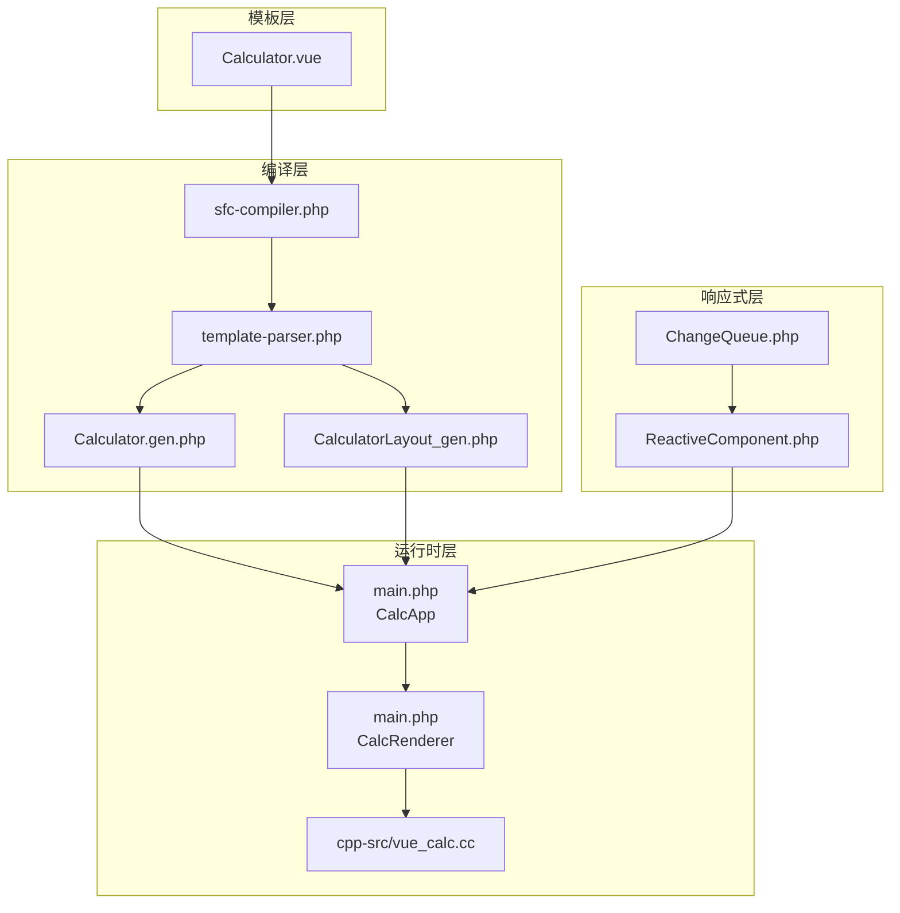
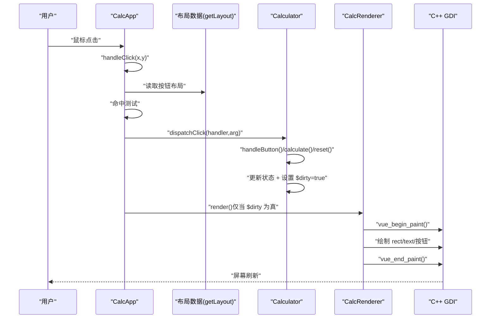
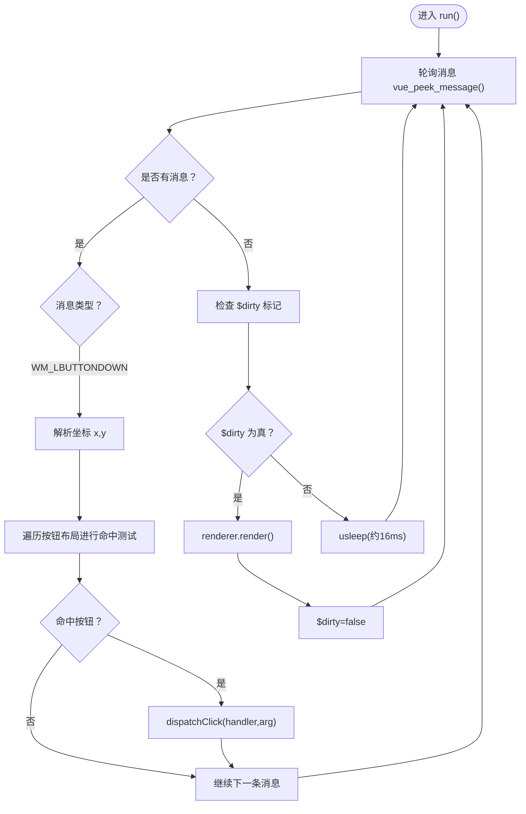
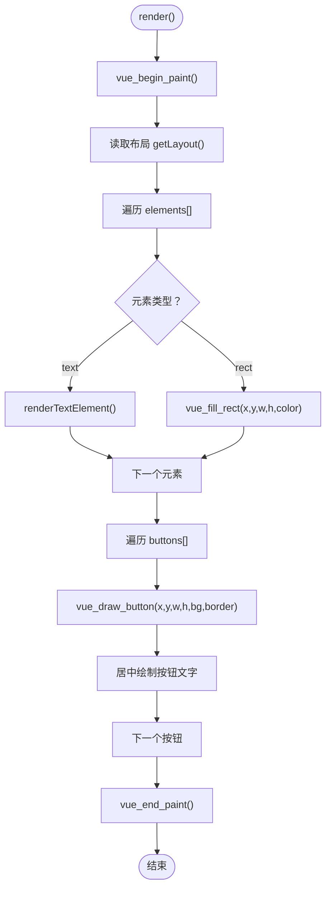
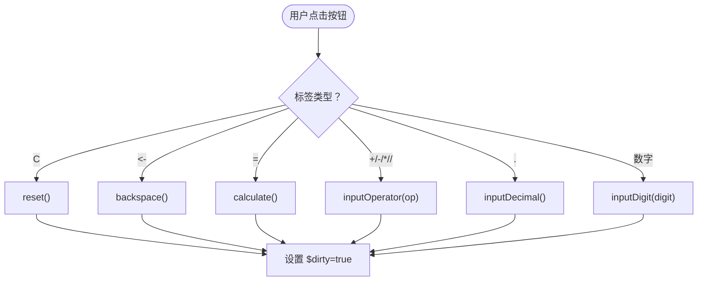
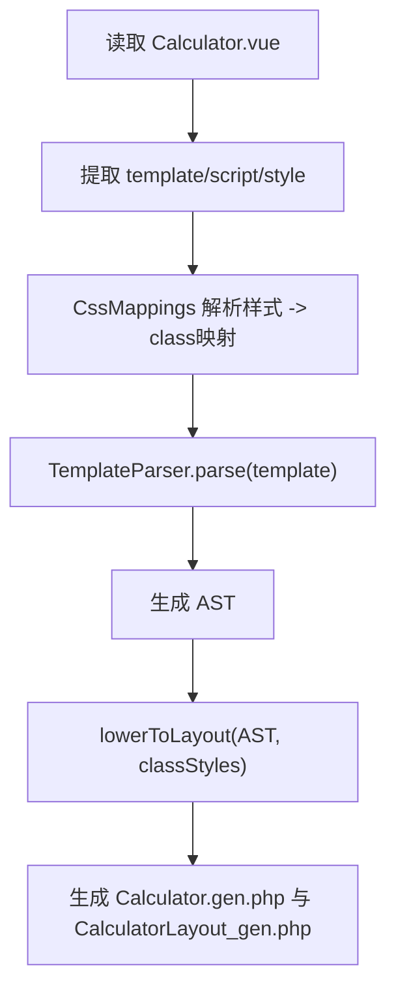
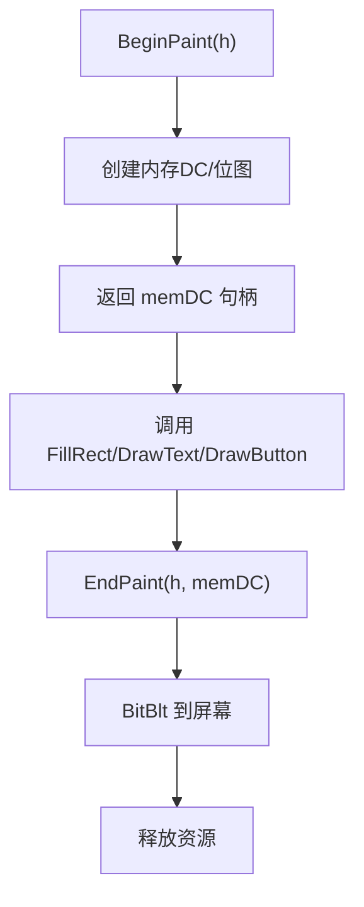
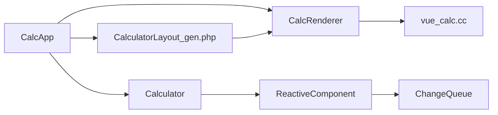

# 数据流架构

<cite>
**本文引用的文件**
- [Calculator.vue](file://src/Calculator.vue)
- [Calculator.gen.php](file://src/Calculator.gen.php)
- [CalculatorLayout_gen.php](file://src/CalculatorLayout_gen.php)
- [ReactiveComponent.php](file://src/ReactiveComponent.php)
- [ChangeQueue.php](file://src/ChangeQueue.php)
- [main.php](file://main.php)
- [vue_calc.cc](file://cpp-src/vue_calc.cc)
- [sfc-compiler.php](file://tools/sfc-compiler.php)
- [template-parser.php](file://tools/compiler/template-parser.php)
</cite>

## 目录
1. [简介](#简介)
2. [项目结构](#项目结构)
3. [核心组件](#核心组件)
4. [架构总览](#架构总览)
5. [详细组件分析](#详细组件分析)
6. [依赖关系分析](#依赖关系分析)
7. [性能考量](#性能考量)
8. [故障排查指南](#故障排查指南)
9. [结论](#结论)
10. [附录](#附录)

## 简介
本文件面向VueCalc项目，系统性梳理“从用户输入到屏幕显示”的完整数据流路径，重点解释：
- 用户点击 → CalcApp.handleClick() → Calculator.handleButton()
- 响应式属性变更 → dirty标记
- CalcRenderer.render() → C++ GDI绘制
并深入阐述事件捕获、坐标转换、布局匹配等关键步骤，以及数据驱动渲染的优势与实现原理。文档同时提供数据流图与时序图，帮助读者快速把握各组件间的协作关系。

## 项目结构
VueCalc采用“模板驱动 + 编译期布局生成 + 运行时数据驱动渲染”的分层架构：
- 模板层：.vue单文件组件定义视图结构与样式
- 编译层：SFC编译器将模板解析为布局数组与组件类
- 运行时层：CalcApp主循环 + CalcRenderer渲染器 + C++ GDI绘制
- 响应式层：ReactiveComponent基类 + ChangeQueue变更队列

图表来源
- [sfc-compiler.php:1-210](file://tools/sfc-compiler.php#L1-L210)
- [template-parser.php:1-680](file://tools/compiler/template-parser.php#L1-L680)
- [Calculator.gen.php:1-174](file://src/Calculator.gen.php#L1-L174)
- [CalculatorLayout_gen.php:1-296](file://src/CalculatorLayout_gen.php#L1-L296)
- [main.php:1-291](file://main.php#L1-L291)
- [vue_calc.cc:1-157](file://cpp-src/vue_calc.cc#L1-L157)
- [ReactiveComponent.php:1-35](file://src/ReactiveComponent.php#L1-L35)
- [ChangeQueue.php:1-57](file://src/ChangeQueue.php#L1-L57)

章节来源
- [Calculator.vue:1-215](file://src/Calculator.vue#L1-L215)
- [sfc-compiler.php:1-210](file://tools/sfc-compiler.php#L1-L210)
- [template-parser.php:1-680](file://tools/compiler/template-parser.php#L1-L680)
- [main.php:1-291](file://main.php#L1-L291)

## 核心组件
- ReactiveComponent：提供脏标记与共享变更队列，子类通过设置$dirty触发重绘
- ChangeQueue：环形缓冲的变更通知队列，用于解耦数据变更与渲染
- CalcApp：主应用控制器，负责窗口初始化、消息循环、事件分发与按需渲染
- CalcRenderer：数据驱动渲染器，读取布局数组与组件状态，调用GDI绘制
- C++ GDI层：封装Win32 API，提供窗口、消息与绘制原语
- 编译产物：Calculator.gen.php（组件类）、CalculatorLayout_gen.php（布局数据）

章节来源
- [ReactiveComponent.php:1-35](file://src/ReactiveComponent.php#L1-L35)
- [ChangeQueue.php:1-57](file://src/ChangeQueue.php#L1-L57)
- [main.php:26-133](file://main.php#L26-L133)
- [main.php:139-259](file://main.php#L139-L259)
- [vue_calc.cc:1-157](file://cpp-src/vue_calc.cc#L1-L157)
- [Calculator.gen.php:1-174](file://src/Calculator.gen.php#L1-L174)
- [CalculatorLayout_gen.php:1-296](file://src/CalculatorLayout_gen.php#L1-L296)

## 架构总览
数据驱动渲染的核心在于：模板在编译期被解析为布局数组，运行时仅根据组件状态与布局数据进行绘制。用户交互通过消息循环捕获，命中测试定位按钮，再通过显式路由调用组件方法，最终以脏标记驱动渲染。

图表来源
- [main.php:171-227](file://main.php#L171-L227)
- [main.php:229-258](file://main.php#L229-L258)
- [main.php:99-132](file://main.php#L99-L132)
- [Calculator.gen.php:149-168](file://src/Calculator.gen.php#L149-L168)
- [CalculatorLayout_gen.php:10-296](file://src/CalculatorLayout_gen.php#L10-L296)
- [vue_calc.cc:90-157](file://cpp-src/vue_calc.cc#L90-L157)

## 详细组件分析

### 组件A：CalcApp（事件循环与消息分发）
- 职责
  - 初始化窗口与渲染器
  - 处理Windows消息，提取鼠标坐标
  - 基于布局数据进行按钮命中测试
  - 将点击事件分发给组件方法（显式路由，兼容AOT）
  - 按需渲染：仅在组件$dirty为真时调用render()

- 关键流程
  - run()主循环：轮询消息、处理WM_LBUTTONDOWN、检测WM_QUIT、按需渲染
  - handleClick()：将屏幕坐标转换为布局坐标系，进行矩形命中测试
  - dispatchClick()：根据布局中的handler与arg，调用组件对应方法

图表来源
- [main.php:171-227](file://main.php#L171-L227)
- [main.php:229-258](file://main.php#L229-L258)

章节来源
- [main.php:139-259](file://main.php#L139-L259)

### 组件B：CalcRenderer（数据驱动渲染）
- 职责
  - 从布局数组读取元素与按钮配置
  - 从组件状态读取绑定值（如display、expression）
  - 调用GDI绘制原语完成整帧绘制
  - 文本对齐与动态字号适配（右对齐、容器宽度计算）

- 关键流程
  - render()：begin_paint → 遍历elements(rect/text) → 遍历buttons → end_paint
  - renderTextElement()：根据绑定键获取值、动态字号、右对齐计算

图表来源
- [main.php:99-132](file://main.php#L99-L132)
- [main.php:49-94](file://main.php#L49-L94)
- [vue_calc.cc:90-157](file://cpp-src/vue_calc.cc#L90-L157)

章节来源
- [main.php:26-133](file://main.php#L26-L133)

### 组件C：Calculator（组件逻辑与脏标记）
- 职责
  - 维护计算器状态(display、expression、operand1、operator、newInput、hasDecimal)
  - 提供reset/backspace/inputDigit/inputDecimal/inputOperator/calculate/handleButton等方法
  - 每次状态变更后设置$dirty=true，触发重绘

- 关键流程
  - handleButton()：根据标签路由到具体逻辑（数字、运算符、小数点、等号、清除、退格）
  - calculate()：执行四则运算，错误处理（除零），格式化输出，更新$dirty

图表来源
- [Calculator.gen.php:149-168](file://src/Calculator.gen.php#L149-L168)
- [Calculator.gen.php:85-128](file://src/Calculator.gen.php#L85-L128)
- [Calculator.gen.php:130-147](file://src/Calculator.gen.php#L130-L147)
- [Calculator.gen.php:41-56](file://src/Calculator.gen.php#L41-L56)
- [Calculator.gen.php:58-70](file://src/Calculator.gen.php#L58-L70)

章节来源
- [Calculator.gen.php:1-174](file://src/Calculator.gen.php#L1-L174)
- [Calculator.vue:183-202](file://src/Calculator.vue#L183-L202)

### 组件D：布局生成与编译器（模板到布局数组）
- 职责
  - 解析.vue模板，构建AST
  - 将AST降级为布局数组（elements/buttons），包含位置、尺寸、颜色、事件处理器等
  - 生成Calculator.gen.php与CalculatorLayout_gen.php

- 关键流程
  - sfc-compiler.php：提取template/script/style → 调用TemplateParser → 生成布局数组 → 写出.gen.php
  - TemplateParser：递归下降解析，支持rect/text/grid/btn，计算按钮坐标（compile-time）

图表来源
- [sfc-compiler.php:46-210](file://tools/sfc-compiler.php#L46-L210)
- [template-parser.php:79-541](file://tools/compiler/template-parser.php#L79-L541)

章节来源
- [sfc-compiler.php:1-210](file://tools/sfc-compiler.php#L1-L210)
- [template-parser.php:1-680](file://tools/compiler/template-parser.php#L1-L680)

### 组件E：C++ GDI绘制层
- 职责
  - 提供窗口创建/显示、消息轮询、退出检测
  - 提供双缓冲绘制原语：BeginPaint/EndPaint、FillRect、DrawText、DrawButton

- 关键流程
  - BeginPaint：创建内存DC与位图，返回句柄
  - EndPaint：BitBlt到屏幕，释放资源
  - DrawText/DrawButton：根据传入参数绘制

图表来源
- [vue_calc.cc:90-157](file://cpp-src/vue_calc.cc#L90-L157)

章节来源
- [vue_calc.cc:1-157](file://cpp-src/vue_calc.cc#L1-L157)

## 依赖关系分析
- 组件耦合
  - CalcApp依赖布局数据（CalculatorLayout_gen.php）与组件实例（Calculator）
  - CalcRenderer依赖布局数据与组件状态，不直接依赖组件内部逻辑
  - C++ GDI层仅提供绘制原语，不感知业务逻辑
- 数据流向
  - 用户输入 → CalcApp.handleClick() → Calculator.handleButton() → 组件状态变更 → $dirty → CalcRenderer.render() → GDI绘制
- 编译期与运行时分离
  - 编译期：模板解析、布局计算、代码生成
  - 运行时：消息循环、命中测试、按需渲染

图表来源
- [main.php:139-259](file://main.php#L139-L259)
- [Calculator.gen.php:1-174](file://src/Calculator.gen.php#L1-L174)
- [CalculatorLayout_gen.php:10-296](file://src/CalculatorLayout_gen.php#L10-L296)
- [ReactiveComponent.php:1-35](file://src/ReactiveComponent.php#L1-L35)
- [ChangeQueue.php:1-57](file://src/ChangeQueue.php#L1-L57)
- [vue_calc.cc:1-157](file://cpp-src/vue_calc.cc#L1-L157)

章节来源
- [main.php:1-291](file://main.php#L1-L291)
- [Calculator.gen.php:1-174](file://src/Calculator.gen.php#L1-L174)
- [CalculatorLayout_gen.php:1-296](file://src/CalculatorLayout_gen.php#L1-L296)
- [ReactiveComponent.php:1-35](file://src/ReactiveComponent.php#L1-L35)
- [ChangeQueue.php:1-57](file://src/ChangeQueue.php#L1-L57)
- [vue_calc.cc:1-157](file://cpp-src/vue_calc.cc#L1-L157)

## 性能考量
- 按需渲染：仅在$dirty为真时调用render()，减少无效绘制
- 双缓冲：BeginPaint/EndPaint避免闪烁，提升视觉流畅度
- 命中测试：O(n)遍历按钮布局，n通常较小（~18个按钮），开销可控
- 字号自适应：根据文本长度动态调整字号，避免溢出与重排
- 消息循环节流：usleep(约16ms)近似60FPS，平衡CPU占用与刷新率

## 故障排查指南
- 无法启动窗口
  - 检查窗口创建返回值与错误日志
  - 确认WINDOW_WIDTH/WINDOW_HEIGHT与布局一致
- 点击无响应
  - 检查消息循环是否正确处理WM_LBUTTONDOWN
  - 核对布局按钮坐标与命中测试范围
  - 确认dispatchClick的handler与arg与布局一致
- 渲染异常
  - 检查$dirty是否被正确复位
  - 确认BeginPaint/EndPaint成对调用
  - 排查GDI绘制参数（颜色、字体、坐标）
- 编译问题
  - 检查.sfc编译器输出与校验报告
  - 确认模板语法（<grid>/<btn>嵌套、:bind/@click等）

章节来源
- [main.php:151-169](file://main.php#L151-L169)
- [main.php:188-204](file://main.php#L188-L204)
- [main.php:213-221](file://main.php#L213-L221)
- [sfc-compiler.php:184-201](file://tools/sfc-compiler.php#L184-L201)

## 结论
VueCalc通过“模板驱动 + 编译期布局生成 + 运行时数据驱动渲染”的架构，实现了清晰的职责分离与高效的渲染路径。用户输入经由消息循环与命中测试到达组件逻辑，组件状态变更通过脏标记触发渲染，最终由C++ GDI完成绘制。该设计具备以下优势：
- 数据驱动：视图与状态解耦，渲染逻辑集中
- 编译期优化：布局坐标与样式在编译期确定，运行时只需读取
- AOT友好：显式路由与静态布局便于AOT编译器处理
- 可维护性：组件职责单一，渲染器与GDI层边界清晰

## 附录
- 数据绑定与布局匹配要点
  - 文本元素通过:bind绑定组件属性（如display、expression）
  - 按钮通过@click绑定组件方法与参数，编译期写入布局的handler/arg
  - 坐标系：屏幕坐标与布局坐标一致，命中测试基于布局数组的x/y/w/h
- 实现建议
  - 在组件方法中统一设置$dirty=true，确保渲染一致性
  - 文本右对齐时，合理设置containerW/containerX与字符宽度估算
  - GDI绘制参数尽量来自布局数组，避免硬编码