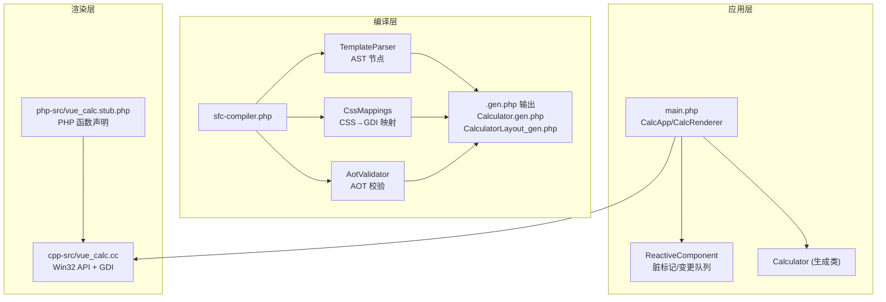
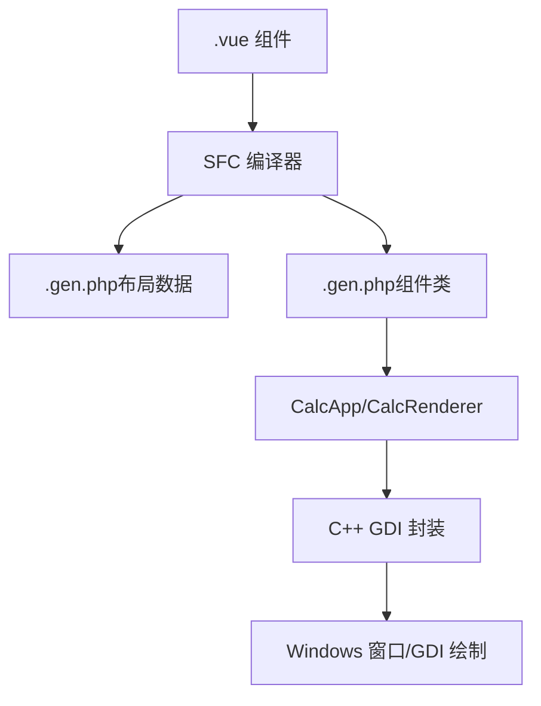
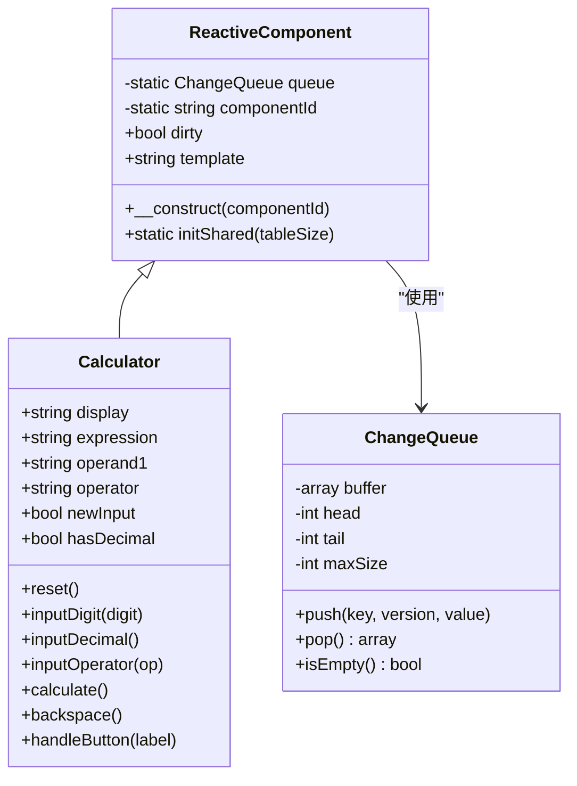
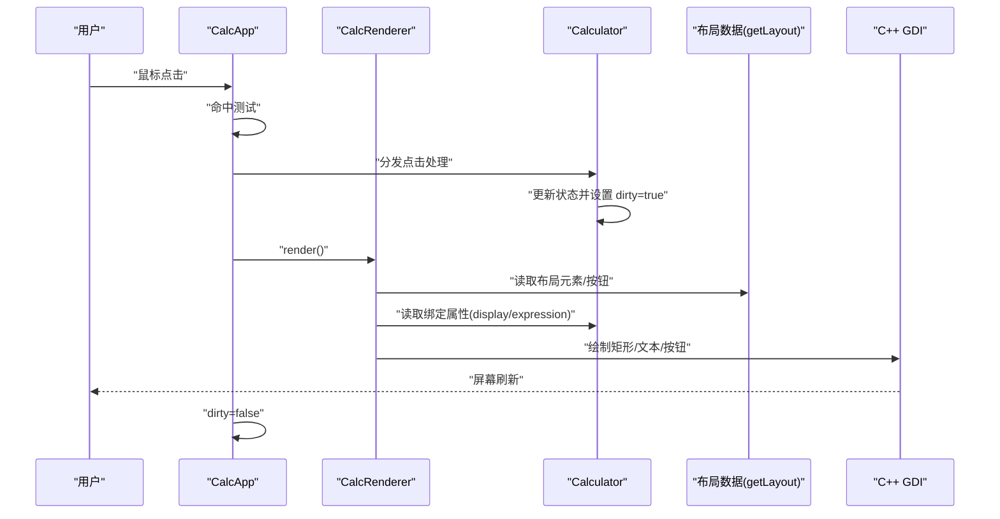
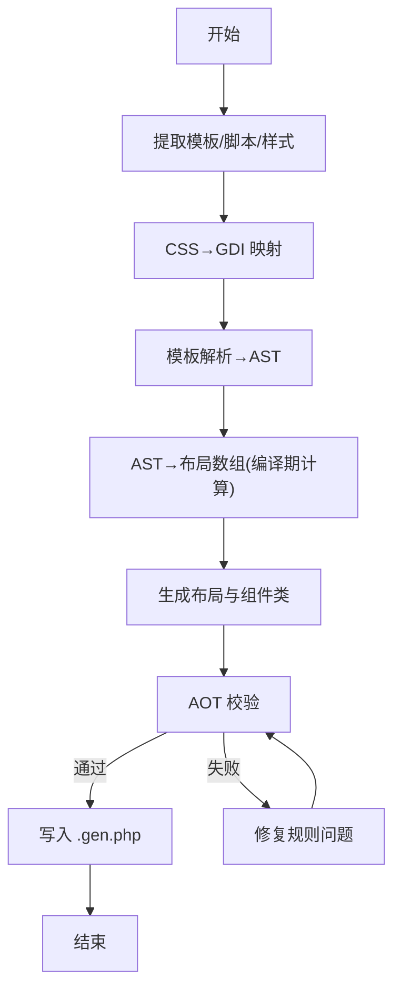
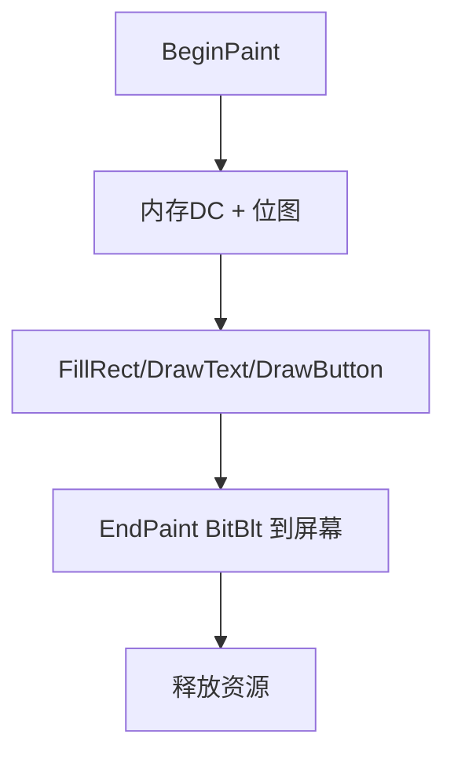
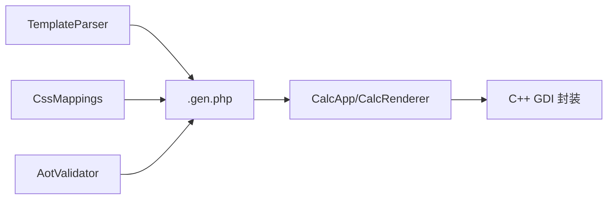

# 架构设计

<cite>
**本文引用的文件**
- [ReactiveComponent.php](file://src/ReactiveComponent.php)
- [ChangeQueue.php](file://src/ChangeQueue.php)
- [Calculator.vue](file://src/Calculator.vue)
- [Calculator.gen.php](file://src/Calculator.gen.php)
- [CalculatorLayout_gen.php](file://src/CalculatorLayout_gen.php)
- [main.php](file://main.php)
- [vue_calc.cc](file://cpp-src/vue_calc.cc)
- [sfc-compiler.php](file://tools/sfc-compiler.php)
- [aot-validator.php](file://tools/compiler/aot-validator.php)
- [sfc-compiler-test.php](file://tests/sfc-compiler-test.php)
- [verify-layout.php](file://tests/verify-layout.php)
- [vue_calc.stub.php](file://php-src/vue_calc.stub.php)
- [project.yml](file://project.yml)
</cite>

## 目录
1. [引言](#引言)
2. [项目结构](#项目结构)
3. [核心组件](#核心组件)
4. [架构总览](#架构总览)
5. [详细组件分析](#详细组件分析)
6. [依赖分析](#依赖分析)
7. [性能考量](#性能考量)
8. [故障排查指南](#故障排查指南)
9. [结论](#结论)
10. [附录](#附录)

## 引言
本项目通过“单文件组件（SFC）编译器 + 响应式组件系统 + 数据驱动渲染”的三层架构，实现了基于 PHP 的数据驱动桌面计算器，并通过 AOT 编译器输出原生 Windows 可执行程序。其核心目标是：
- 使用 PHP 实现业务逻辑与响应式状态管理；
- 使用 C++ GDI 进行高性能绘制；
- 通过编译期将 .vue 组件转换为 .gen.php（类 + 布局数据），满足 AOT 限制；
- 以“UI = f(state)”的方式实现数据驱动渲染。

## 项目结构
项目采用按职责分层的组织方式：
- 编译层：SFC 编译器工具链，负责将 .vue 组件解析为布局数据与 PHP 组件类，并进行 AOT 兼容性校验。
- 应用层：主入口与应用控制器，负责初始化窗口、事件循环、响应式组件与渲染器协作。
- 渲染层：C++ GDI 封装，提供窗口、消息与绘制原语，供 PHP 渲染器调用。

图表来源
- [sfc-compiler.php:1-210](file://tools/sfc-compiler.php#L1-L210)
- [aot-validator.php:1-169](file://tools/compiler/aot-validator.php#L1-L169)
- [Calculator.gen.php:1-174](file://src/Calculator.gen.php#L1-L174)
- [CalculatorLayout_gen.php:1-296](file://src/CalculatorLayout_gen.php#L1-L296)
- [main.php:1-291](file://main.php#L1-L291)
- [vue_calc.cc:1-157](file://cpp-src/vue_calc.cc#L1-L157)
- [vue_calc.stub.php:1-24](file://php-src/vue_calc.stub.php#L1-L24)

章节来源
- [project.yml:1-10](file://project.yml#L1-L10)
- [sfc-compiler.php:1-210](file://tools/sfc-compiler.php#L1-L210)
- [main.php:1-291](file://main.php#L1-L291)

## 核心组件
- 响应式组件基类：提供全局变更队列、组件标识、脏标记与初始化接口，满足 AOT 约束。
- 变更队列：环形缓冲实现，承载组件状态变更，供渲染循环消费。
- 计算器组件：由 SFC 编译器生成，包含业务逻辑与脏标记触发点。
- 渲染器：读取布局数据与组件状态，调用 C++ GDI 绘制原语。
- 应用控制器：负责窗口生命周期、事件分发与渲染调度。
- C++ GDI 封装：提供窗口创建、消息轮询、双缓冲绘制与基础图形原语。
- SFC 编译器：解析模板/样式，生成布局数据与组件类，并进行 AOT 校验。

章节来源
- [ReactiveComponent.php:1-35](file://src/ReactiveComponent.php#L1-L35)
- [ChangeQueue.php:1-57](file://src/ChangeQueue.php#L1-L57)
- [Calculator.gen.php:1-174](file://src/Calculator.gen.php#L1-L174)
- [main.php:26-259](file://main.php#L26-L259)
- [vue_calc.cc:1-157](file://cpp-src/vue_calc.cc#L1-L157)
- [sfc-compiler.php:1-210](file://tools/sfc-compiler.php#L1-L210)

## 架构总览
整体架构分为三层：
- 编译层：SFC 编译器将 .vue 转换为 .gen.php（类 + 布局数据），并进行 AOT 校验。
- 应用层：应用控制器与渲染器协调，仅在组件状态变更时触发重绘。
- 渲染层：C++ GDI 提供窗口与绘制能力，PHP 侧通过 stub 函数调用。

图表来源
- [sfc-compiler.php:133-207](file://tools/sfc-compiler.php#L133-L207)
- [Calculator.gen.php:1-174](file://src/Calculator.gen.php#L1-L174)
- [CalculatorLayout_gen.php:1-296](file://src/CalculatorLayout_gen.php#L1-L296)
- [main.php:26-259](file://main.php#L26-L259)
- [vue_calc.cc:1-157](file://cpp-src/vue_calc.cc#L1-L157)

## 详细组件分析

### 响应式组件系统
- 设计原则：AOT 兼容模式下禁用魔术方法，采用直接属性 + 手动脏标记。
- 关键点：
  - 全局共享变更队列：用于收集组件状态变更。
  - 脏标记：布尔标志，指示是否需要重绘。
  - 组件标识：用于区分不同实例或类型。
- 交互流程：组件状态更新后设置脏标记；渲染循环检测脏标记并触发渲染；渲染完成后清除脏标记。

图表来源
- [ReactiveComponent.php:11-35](file://src/ReactiveComponent.php#L11-L35)
- [ChangeQueue.php:11-57](file://src/ChangeQueue.php#L11-L57)
- [Calculator.gen.php:9-174](file://src/Calculator.gen.php#L9-L174)

章节来源
- [ReactiveComponent.php:1-35](file://src/ReactiveComponent.php#L1-L35)
- [ChangeQueue.php:1-57](file://src/ChangeQueue.php#L1-L57)
- [Calculator.gen.php:1-174](file://src/Calculator.gen.php#L1-L174)

### 数据驱动渲染流程
- 数据源：布局数据（元素与按钮）、组件状态（display/expression 等）。
- 渲染器职责：遍历布局元素，按需读取组件状态，调用 C++ 绘制原语。
- 事件驱动：用户点击 → CalcApp.handleClick → 分发到组件方法 → 设置脏标记 → 触发重绘。

图表来源
- [main.php:171-259](file://main.php#L171-L259)
- [Calculator.gen.php:29-168](file://src/Calculator.gen.php#L29-L168)
- [CalculatorLayout_gen.php:10-296](file://src/CalculatorLayout_gen.php#L10-L296)
- [vue_calc.cc:90-157](file://cpp-src/vue_calc.cc#L90-L157)

章节来源
- [main.php:26-259](file://main.php#L26-L259)
- [Calculator.gen.php:1-174](file://src/Calculator.gen.php#L1-L174)
- [CalculatorLayout_gen.php:1-296](file://src/CalculatorLayout_gen.php#L1-L296)
- [vue_calc.cc:1-157](file://cpp-src/vue_calc.cc#L1-L157)

### SFC 编译器与 AOT 校验
- 编译步骤：
  1) 提取模板/脚本/样式块；
  2) 样式解析：CSS 类映射到 GDI 属性；
  3) 模板解析：递归下降解析为 AST；
  4) AST 降级：编译期计算坐标，生成布局数组；
  5) AOT 校验：检查 filename 点号、const 数组、变量属性/方法访问、PHP8 函数等；
  6) 代码生成：输出布局文件与组件类文件。
- AOT 限制与对策：
  - 禁止魔术方法与反射：改为直接属性 + 手动脏标记；
  - 禁止变量属性/方法访问：显式 if/else 路由；
  - 全局常量数组：改用函数返回数组；
  - PHP8 函数：替换为兼容写法。

图表来源
- [sfc-compiler.php:46-207](file://tools/sfc-compiler.php#L46-L207)
- [aot-validator.php:36-106](file://tools/compiler/aot-validator.php#L36-L106)

章节来源
- [sfc-compiler.php:1-210](file://tools/sfc-compiler.php#L1-L210)
- [aot-validator.php:1-169](file://tools/compiler/aot-validator.php#L1-L169)
- [sfc-compiler-test.php:1-365](file://tests/sfc-compiler-test.php#L1-L365)

### C++ GDI 渲染层
- 职责：封装 Win32 API，提供窗口创建/显示、消息轮询、双缓冲绘制与基础图形原语。
- 接口：通过 php_ 前缀函数暴露给 PHP 调用，C++ 实现 php_vue_ 前缀函数。
- 绘制流程：BeginPaint 获取内存 DC → 绘制 → EndPaint 完成双缓冲交换。

图表来源
- [vue_calc.cc:90-157](file://cpp-src/vue_calc.cc#L90-L157)
- [vue_calc.stub.php:12-24](file://php-src/vue_calc.stub.php#L12-L24)

章节来源
- [vue_calc.cc:1-157](file://cpp-src/vue_calc.cc#L1-L157)
- [vue_calc.stub.php:1-24](file://php-src/vue_calc.stub.php#L1-L24)

## 依赖分析
- 编译层依赖：模板解析器、CSS 映射、AOT 校验器共同构成编译管线。
- 应用层依赖：响应式组件基类、生成的组件类、布局数据、C++ GDI 封装。
- 渲染层依赖：Win32 API，通过 PHP stub 函数桥接。

图表来源
- [sfc-compiler.php:19-24](file://tools/sfc-compiler.php#L19-L24)
- [Calculator.gen.php:1-174](file://src/Calculator.gen.php#L1-L174)
- [CalculatorLayout_gen.php:1-296](file://src/CalculatorLayout_gen.php#L1-L296)
- [main.php:26-259](file://main.php#L26-L259)
- [vue_calc.cc:1-157](file://cpp-src/vue_calc.cc#L1-L157)

章节来源
- [sfc-compiler.php:1-210](file://tools/sfc-compiler.php#L1-L210)
- [main.php:1-291](file://main.php#L1-L291)

## 性能考量
- 脏标记与渲染节流：仅在 dirty 为真时重绘，减少无效绘制。
- 渲染循环频率：约 60 FPS（微秒级休眠），平衡流畅度与 CPU 占用。
- 双缓冲绘制：避免闪烁，提升视觉质量。
- 编译期坐标计算：降低运行时布局计算开销。
- AOT 优化：静态编译产物体积小、启动快、运行稳定。

## 故障排查指南
- AOT 校验失败：
  - 文件名含多个点号：确保生成文件名仅含一个点号（如 Calculator.gen.php）。
  - const 嵌套数组：将布局常量改为函数返回数组。
  - 变量属性/方法访问：改为显式 if/else 路由。
  - PHP8 函数：替换为兼容写法（如 str_contains → strpos）。
- 布局不一致：
  - 使用验证脚本核对生成布局数量与坐标。
- 渲染异常：
  - 检查 CalcApp 渲染循环是否正确读取布局与组件状态。
  - 确认 C++ GDI 函数调用顺序与参数。

章节来源
- [aot-validator.php:36-106](file://tools/compiler/aot-validator.php#L36-L106)
- [verify-layout.php:1-72](file://tests/verify-layout.php#L1-L72)
- [main.php:171-259](file://main.php#L171-L259)

## 结论
该架构以“编译期生成 + 运行期数据驱动”为核心，结合 AOT 编译器与 C++ GDI，实现了高性能、可维护的桌面应用。通过严格的 AOT 校验与清晰的分层职责，项目在保持开发效率的同时，获得了接近原生的运行性能与稳定性。

## 附录
- 技术决策权衡：
  - 选择 PHP + Win32 的组合：利用 PHP 的快速开发与 AOT 编译能力，配合 C++ GDI 的高效绘制，兼顾易用性与性能。
  - 跨语言编译：SFC 编译器在标准 PHP CLI 下运行，生成 .gen.php 后交由 AOT 编译器生成原生二进制，避免运行时反射与魔术方法带来的不确定性。
- 扩展性与未来方向：
  - 支持更多自定义模板标签与样式属性映射；
  - 引入组件间通信机制与事件总线；
  - 增强测试覆盖与持续集成；
  - 探索多平台适配（当前聚焦 Windows）。